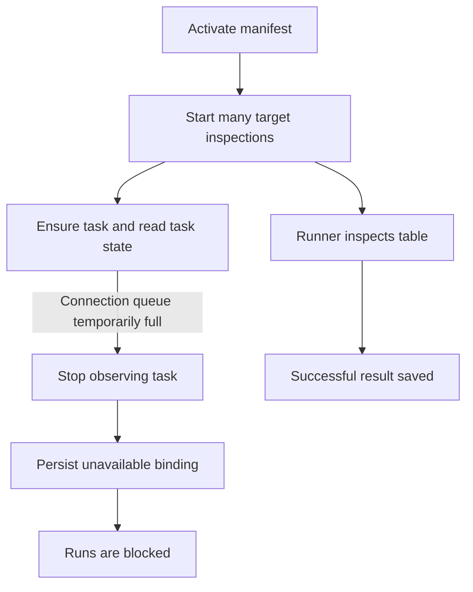
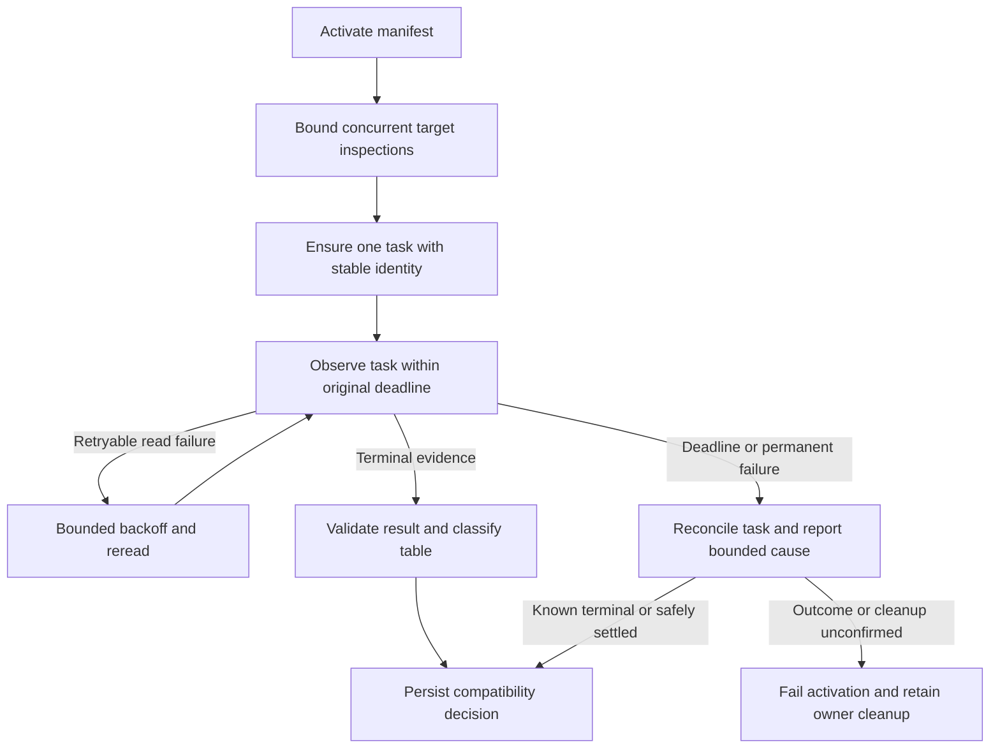

# Change Record: Reliable activation inspection under database pressure

| Field | Value |
| --- | --- |
| Status | Implementing |
| Type | Bug fix |
| Primary issue | [#522 — production deployment](https://github.com/eirhop/favn/issues/522), follow-up to its closed release work |
| Pull request | [#768](https://github.com/eirhop/favn/pull/768) — plan-only draft |
| Related work | [#525 — performance](https://github.com/eirhop/favn/issues/525), merged [#766](https://github.com/eirhop/favn/pull/766) and [#767](https://github.com/eirhop/favn/pull/767) |
| Affected areas | Orchestrator activation and operation-task reads; PostgreSQL error diagnostics; activation CLI |
| Approved plan commit | `d4cbcfc4` |
| Last updated | 2026-09-25 |

## One-minute summary

A busy orchestrator can label a healthy table unavailable because it briefly
cannot obtain a database connection to read a successful inspection task. That
classification blocks runs until a later activation succeeds. The fix keeps
observing the same durable task through temporary read failures, within the
original deadline, and reduces unnecessary activation pressure. It also fixes
closely related result, crash, and runner-pool selection errors and reports the
actual failure category. This record is explicitly requested and covers lifecycle,
diagnostic, and default-concurrency changes across multiple owners.

## Impact

After replacing runner images in the retained 0.25-vCPU environment, 34 and then
33 unavailable target inspections blocked two 35-asset runs before execution,
although 68 inspection tasks succeeded. A fresh reproduction left 24 and 23
unresolved inspections. Temporarily reducing the existing inspection admission
limit from 32 to 4 made a subsequent activation classify all 35 stress targets
ready, without replacing images or resetting data.

The desired outcome is reliable activation under recoverable read pressure, with
an honest bounded failure if inspection or storage really remains unavailable.
It is not a guarantee that all outages can be hidden or that all manifest changes
are compatible.

## Problem analysis

### Verified root cause

The planner performs up to 32 concurrent target classifications. Its task path
repeats durable reads around ensure, enqueue, await, and subscription. A hydrated
task read holds a snapshot transaction while validating the pinned manifest,
payload, orchestration context, and result. Under a small CPU quota these
transactions occupy the 15-connection pool long enough for its adaptive queue to
reject additional requests.

A trace captured the same classifier encountering
`DBConnection.ConnectionError(reason: :queue_timeout)`, receiving a retryable
persistence `unavailable` error, and returning an unavailable physical inspection.
The initial read in `OperationRunnerTasks.await/3` and the ensure path fail
immediately. Their temporary inability to observe the task becomes a persisted
`operator_decision` binding. The runner can finish successfully after observation
has already stopped.

The correctness defect is the one-shot treatment of explicitly retryable reads.
High inspection fan-out and repeated hydration amplify it. The measured connection
pressure is related to #525, but this change does not claim to finish that wider
performance work.

### Surrounding defects

- The planner discards failure stage and cause, making database pressure look like
  a runner or data-system inspection failure.
- A linked classifier crash can terminate the planner before its existing exit
  reconciliation branch executes.
- Timeout reconciliation can read a succeeded task and still report timeout.
- Whole-manifest release-map equality can select an old runner pool when an asset
  moves between pools already present in both manifests.
- The activation CLI drops unresolved-inspection details. Its `reconciled` flag
  describes recovery of an uncertain HTTP outcome, not table compatibility.

### Evidence and limits

| Evidence | What it proves | What it does not prove |
| --- | --- | --- |
| [Investigation scratchpad](../../report/2026-09-25-activation-inspection-scratchpad.md) and [earlier qualification](../../report/2026-09-25-runner-readiness.md) | Durable successes coexisted with blocked bindings | Every historical production failure had this cause |
| Tidewave checks of 68 actual request/result pairs with their pinned manifest | Decode, completion validation, release identity, and fingerprint checks succeed on main | Live delivery always succeeds |
| Two traced activations, revisions 4 and 5 | Queue timeout becomes a retryable read error and unavailable decision | Exact historical timing, or the largest CPU cost |
| Database samples: up to 15 open transactions waiting for client work | Connection occupancy during activation; one demand-row lock wait | A complete query/CPU/lock profile |
| Four-worker experiment, revision 6 | Zero unresolved inspections with unchanged images, quota, and data | Permanent correction, general throughput, or network-delay qualification |
| Tidewave linked-task probe and source review | Classifier crashes bypass the intended exit-result handling | This caused the observed queue-timeout failures |
| Source parity for planner, operation tasks, result router, and task store | Affected paths are unchanged between retained control and main | A full aligned-main container test |

### Assumptions

The existing immutable task identity and persistence retry classification remain
authoritative. Inspection is read-only against the data system, but enqueue and
cancellation remain durable commands with their existing outcome semantics.
There is no need to read old customer executable code to inspect a persisted
physical relation through a replacement runner.

## Current behavior

## Approved plan

This plan was independently approved on 2026-09-25. Preserve it as the baseline;
record later changes separately.

### 1. Keep safe observation within a fixed budget

Use one absolute inspection deadline from admission through task lookup, enqueue
receipt observation, subscription, and final classification. Starting a waiter
or retrying a read must not renew the budget. Thread that deadline explicitly
through the operation-task read path; existing callers retain their bounded
relative timeout translated once at entry.

Retry only durable **reads** with an explicitly retryable persistence error.
Use capped exponential backoff with jitter (start 50 ms, cap 500 ms) and stop at
the original deadline. A retry must not hold a database connection while waiting.
The wait belongs to the existing bounded inspection worker, not a GenServer
callback. Deadline and caller termination must stop the observation work.
Permanent authorization, identity, corrupt-data, and expired-history failures
return immediately.

Bound each read itself, not just the delay between reads. Reuse the existing
owner-watched, heap-bounded `ManifestMemory.manifest_worker/2` for this manifest
inspection read, with timeout equal to the lesser of the remaining observation
budget and 15 seconds. Its owner watcher terminates the read on caller death;
on timeout it kills the read worker and awaits termination. PostgreSQL tests must
prove that a blocked read releases its transaction/connection. Keep this wrapper
on the activation observation path; do not move enqueue, cancellation, or any
mutation into this read-only worker. A worker timeout is a safe observation timeout,
not evidence that a task failed. Retain distinct memory/worker failures. This
reuses existing bounded-work machinery rather than adding a generic task framework.
Measure the wrapper's copying/serialization cost during local qualification.

For operation-task observers, add an explicit opt-in read-error reporting policy
to the existing result router subscription. Initial and subsequent non-retryable
read errors must reach that observer as a typed error notification, with waiter
and monitor cleanup. The waiter forwards the error before exiting, so the parent
can return the original safe category rather than a generic DOWN reason. Explicitly
retryable read failures continue bounded observation; router restart/overload
remains a transient subscription condition. Keep asset-run subscriptions on their
existing policy and test them unchanged. No fabricated terminal task or result is
allowed. Stopping an expired observer must also terminate its in-flight router
read; a failed observation must not leave a pending read holding a connection.

Remove the planner's duplicate pre-ensure task lookup by making the owning
operation-task boundary enforce the existing distinction: an existing task can
be reconciled after its deadline, but a missing task must not be created after
that deadline. Reuse an already fetched task when entering await rather than
immediately fetching it again, while subscribing through the existing race-safe
result router. Preserve payload-hash, manifest/release, owner, deadline, and
orchestration-context identity validation. Reuse requires `data_state: :available`;
scalar `:not_loaded` receipts, including safe-retry receipts, still require one
bounded hydration read. Do not treat missing payload data as a permanent error
or pass a scalar receipt to result validation.

Do not wrap `ensure`, enqueue, safe-retry mutation, or activation wholesale in a
retry loop. If a command outcome is unconfirmed, look up the same task/command
identity; do not create another task or infer failure from an absent read. An
unresolved mutation outcome remains an explicit failure to reconcile, using the
existing operation ownership and cleanup contracts.

### 2. Reduce activation fan-out

Change the production/default orchestrator inspection admission limit from 32 to
4, matching the existing local-development default. Keep the existing
`FAVN_MANIFEST_INSPECTION_CONCURRENCY` override and its 1–32 range. Keep a single
global admission owner so simultaneous activations share the limit. Waiting for
a slot must consume the same absolute deadline and end when it expires; an
expired caller must not keep a queued or active permit after it terminates.
Test expiry before grant and a grant racing caller timeout using the existing
monitored-owner cleanup.

This is a conservative default supported by the controlled experiment, not an
automatic CPU heuristic. Do not raise pool size or database timeouts. Do not add a
cache or change transaction isolation in this correction. Broader status-read
projection, decode-cost, polling, and transaction-duration work remains #525.

### 3. Make completion, deadline, and crash behavior consistent

At timeout, reread the same task before declaring failure. A valid succeeded
result already durable when reconciliation observes it must proceed through the
normal release and fingerprint checks. A terminal failed/cancelled/unknown task
keeps its real outcome. For a task still pending, use existing cancellation and
confirmation; an unconfirmed cancellation must remain explicit. Never classify
an unobserved or malformed result as success.

The deadline stops new dispatch and normal waiting. A bounded final reconciliation
read may observe a task that won the completion-versus-cancellation race; durable
terminal evidence takes precedence. It does not reopen the deadline or dispatch
more work. Give final observation a separate five-second absolute budget, shared
by pre-cancellation and post-cancellation reads and their backoff. Use the same
owner-watched read mechanism. If that budget is exhausted, report reconciliation
unconfirmed and let the existing durable owner finish cleanup. An unconfirmed
task/read/cancellation outcome is a planner error, not an ordinary unavailable
compatibility decision: do not publish a new deployment or overwrite bindings
from that uncertain classification. Preserve the previous active deployment and
the owning operation's cleanup state, matching the existing
`inspection_timeout_reconciliation_failed` failure boundary.

Issue at most one cancellation command in this foreground pass with
`wait_for_ack: false`; do not add the existing acknowledgment polling loop. A
cancellation command remains synchronous under the existing configured PostgreSQL
command bound (15-second defaults), separately from the five-second read allowance.
It is not killed or blindly retried. If it consumes the observation allowance,
return explicit unconfirmed cleanup instead of starting a fresh read budget.
Consequently the inspection deadline bounds normal observation, not a promise
that all durable cancellation work finishes at that instant. Keep unknown command
outcomes explicit and preserve existing background owner reconciliation.
Document and test this distinction rather than using runner-supplied timestamps
as proof of orchestrator commit time.

Capture exceptions and exits from each classifier into an explicit classifier
failure result inside the existing linked worker. This lets the planner run its
existing task reconciliation while retaining parent termination of workers.
Do not enable process-wide exit trapping or create detached inspection workers.
An untrappable worker death or owner shutdown may still fail the deployment;
the existing durable operation owner must fence and clean up its tasks. Replace
the binding pattern-match crash with an explicit error.

### 4. Select the desired asset's effective runner binding

Compare the active and desired asset's effective pool and required release,
using existing manifest binding helpers. Reuse old asset-based inspection only
when that binding is unchanged. Otherwise inspect the persisted active physical
relation through the desired manifest and desired pool/release. Preserve
connection compatibility and historical-descriptor checks. Test pool A to pool B
with an unchanged overall release map and the old pool unavailable.

### 5. Preserve safe diagnostics

Keep the current top-level compatibility states and reason codes. Add bounded
inspection details to the existing compatibility diff: stage, an allowlisted
failure code, whether the read was retryable, task ID when known, and attempt
count. Map database queue timeout to a fixed safe reason in the PostgreSQL error
mapper; do not store exception messages, arbitrary terms, SQL, connection strings,
or payloads. Preserve distinct data corruption, release mismatch, classifier
failure, genuine inspection failure, and deadline outcomes.

Carry the API's bounded unresolved-inspection count and retry guidance through
`Favn.CLI.Activate` and print them in `mix favn.activate`. Make the existing
HTTP-outcome reconciliation label clear. Successful activation with unresolved
bindings remains representable; do not silently change the command's exit status
or pretend that the manifest was not activated. If HTTP outcome reconciliation
only proves that the manifest is active and has no inspection diagnostics,
report inspection status/count as unknown. Missing diagnostics must never become
zero unresolved targets.

### Contracts and invariants

- One durable inspection identity per target and deployment operation.
- No blind write or asset retry; no weaker release, fingerprint, or authority checks.
- Retryable reads do not become target incompatibility on their first failure.
- Permanent failures and genuinely unavailable inspections still block affected runs.
- No new task after its original deadline; late terminal evidence is reconciled once.
- No connection held by retry backoff; no new unbounded processes, queues, or timers.
- Operation cancellation/closure and parent termination retain their fences and cleanup.
- No database reset, persistent runner storage, new listener, or repair subsystem.

### Non-goals

General run admission/claim/completion performance, SQL-session pooling, changes
to atomic generation publication, data migration, UI redesign, and a new CI
stress simulator. The local OrbStack harness is the live qualification vehicle.

### Implementation slices and complexity budget

Ranges exclude this record, investigation notes, generated files, locks, and
format-only changes. Supporting lines include tests, fixtures, and canonical docs.

| Slice | Owner | Production added | Production deleted | Supporting added | Supporting deleted |
| --- | --- | ---: | ---: | ---: | ---: |
| Deadline-bounded reads, router errors, and duplicate-read removal | Orchestrator operation tasks/planner/router | 140–230 | 35–85 | 200–300 | 10–40 |
| Admission expiry/default, crash/result races, pool selection | Orchestrator runtime/admission/planner | 65–120 | 20–55 | 180–280 | 5–30 |
| Safe failure diagnostics and CLI reporting | Storage error mapper, orchestrator, public CLI | 70–130 | 10–35 | 110–180 | 5–25 |

The supporting budget covers distinct regression paths, not a new test framework.
Production additions should stay within 275–480 lines. Explain variance above an
upper range by more than 25% or 100 lines, whichever is smaller, and materially
fewer deletions. A new generic retry framework, new task state machine, broad
storage read API, or timeout increase requires plan re-review.

### Implementation map

| Area | Responsibility |
| --- | --- |
| `OperationRunnerTasks` | Fixed observation deadline; retryable reads; preserve ensure identity checks |
| `TargetCompatibilityPlanner` | Classification, bounded reconciliation, effective runner binding, safe diagnostics |
| `ManifestInspectionAdmission` and runtime config | Deadline-limited slot acquisition, monitored-owner cleanup, four-worker default and existing override |
| `RunnerTaskResultRouter` | Opt-in permanent-read-error delivery and read-worker cleanup for operation observers; preserve asset policy |
| `ErrorMapper` | Safe queue-timeout category without raw database errors |
| `Favn.CLI.Activate` and Mix activation task | Preserve and explain unresolved inspection summaries |

### Canonical documentation updates

Update the activation/inspection section of
[Target generations and rebuilds](../../architecture/target-generations-and-rebuilds.md),
the inspection concurrency setting in
[control-plane environment](../../production/control_plane_environment.md), and the public [configuration guide](../../../apps/favn/guides/configuration.md),
and the public
[manifest deployment guide](../../../apps/favn/guides/manifest-deployment.md).
Update the owning module docs/types for the deadline and observer policy and the
CLI summary, with `Favn.AI` routing checked if public guide organization changes.
Keep current status in FEATURES and forward work in ROADMAP concise and linked.

## Operational design

Deploy the control-plane correction first. No data migration or runner wire change
is intended; the existing runner inspection contract remains valid. Previously
blocked bindings are reevaluated by an explicit activation with a new operation
key after the cause is fixed. Reusing an old key intentionally replays its old
receipt. Do not rewrite old task results or reset the environment.

When storage remains unavailable, stop within the fixed observation and bounded
reconciliation budgets and report the stage and safe failure category. A process
crash, closed operation, or unknown command outcome retains existing fencing and
cleanup. Rollback restores previous code/defaults and may restore the old failure;
it must not require schema or data rollback.

| Diagnostic | Surface | Safe fields | Bound |
| --- | --- | --- | --- |
| Recovered transient read | Telemetry | Stage, read-attempt count, elapsed time | One aggregate per inspection |
| Unresolved inspection | Existing compatibility diff and activation summary | Stage, allowlisted cause, retryable flag, task/target IDs | Existing bounded target summary; no per-attempt logs |
| Activation convergence | CLI | Unresolved count and existing recovery guidance | One summary per invocation |

## Verification plan

| Acceptance criterion | Planned evidence |
| --- | --- |
| Temporary initial/post-enqueue/await read failure recovers | Deterministic owning-layer tests with injected read outcomes and exact enqueue count |
| Permanent and corrupt-data errors are not retried | Initial and post-subscription errors, asserting original category, number of reads, and unchanged asset observer behavior |
| Original deadline includes read, admission and waiter startup | Gated blocked read; PostgreSQL connection/transaction release; slot expiry before/racing grant; observer termination cancels router read |
| Persisted deadline wins replay | Later caller deadline cannot extend existing deadline; expired succeeded task is consumed; expired safe-to-retry failed task issues no retry mutation |
| Completion wins reconciliation race | Delayed notification with durable success; pending cancellation; failed and unknown result cases |
| Worker exceptions reconcile without killing normal planner flow | Actual raised and exited classifier probes; owner shutdown/untrappable death lifecycle checks |
| Effective pool migration uses desired runner | Two-pool manifest with identical overall maps; old pool absent |
| Safe diagnostics cannot leak raw details | Error containing sentinel secret and SQL; assert only allowlisted fields survive |
| CLI reports incomplete inspection accurately | Success with unresolved targets, clean success, and uncertain HTTP receipt cases with unknown inspection status |
| Four-worker default is consistent and override preserved | Runtime/production/local config tests |
| No pressure regression or environment reset needed | Same local 0.25-vCPU, five-runner environment; aligned main images; repeated activation and successful 35-asset runs |

Start with focused orchestrator, storage error-mapper, and CLI tests. Run relevant
owning suites, formatting, warning-free compilation, test-tag guard, and CI before
implementation review. Live qualification must include injected temporary read
pressure or network latency, recovery without reset, and recorded connection/read
measurements. Use the retained data and compare the same workload; exclude tracing
from throughput comparisons. A 100-asset scenario is a later scale qualification,
not a substitute for proving this regression.

## Risks and decisions

| Risk | Decision |
| --- | --- |
| Retries worsen an overloaded pool | Lower fan-out, remove redundant reads, cap/jitter backoff, keep original deadline |
| Global operation-task changes affect rebuild/run helpers | Preserve existing default behavior and test cancellation, cleanup, validation deadlines, and owner loss |
| Lower default reduces throughput on larger hosts | Keep existing override; measure activation duration as well as failures |
| Error recovery hides a real invalid result | Retry only explicitly retryable reads; never skip result validation |
| Terminal evidence observed after normal deadline | One bounded reconciliation accepts durable outcome; no new work or deadline renewal |
| Root cause is overstated | Live failure chain is proven; CPU attribution and full performance work remain unqualified |

## Plan review

| Field | Result |
| --- | --- |
| Reviewer | Independent Astra agent, xhigh (`review_activation_paths`) |
| Reviewed against | Current source, retained runtime evidence, #522/#525 context, and this plan |
| Findings | First review confirmed root cause and scope; requested concrete read/admission bounds, permanent-error delivery after subscription, deadline replay tests, and named canonical docs |
| Findings addressed and rechecked | Plan amended for owner-watched read bounds, slot expiry, five-second final observation allowance with separate cancellation command bound, opt-in router error delivery, replay tests, and canonical docs. Final review also required an explicit planner-error branch for unconfirmed reconciliation; all amendments rechecked |
| Verdict | Approved. Root cause, scope, failure semantics, tests, and complexity budget accepted; implementation and live qualification remain outstanding |

## Implementation outcome and deviations

Implementation has not started. No production source changes or automated fix
qualification are claimed. After approval, preserve the planning commit as the
baseline and record implementation, deviations, actual complexity, verification,
and final independent review here.

## Planning verification

Relative documentation links and whitespace checks passed. Both Mermaid diagrams
were rendered and visually checked on GitHub after draft PR #768 was opened;
their source is byte-identical to the independently reviewed baseline. The PR
number update changed only metadata and the filename. This is documentation
verification, not implementation or workload qualification.
