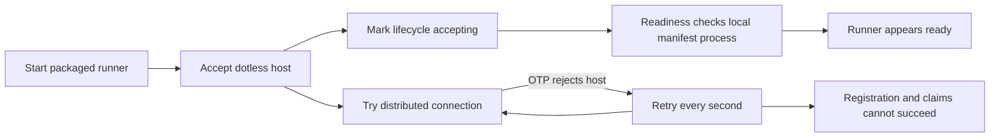
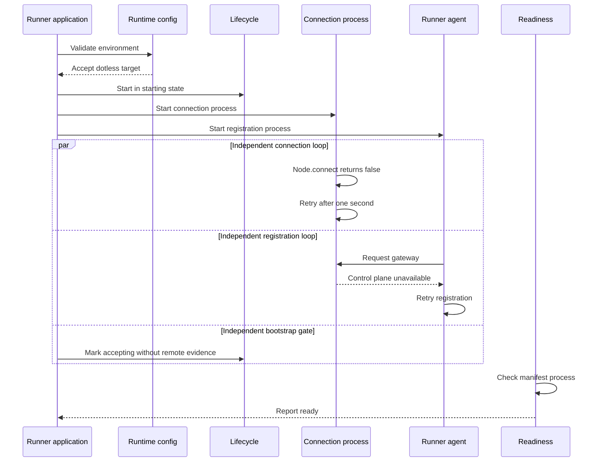
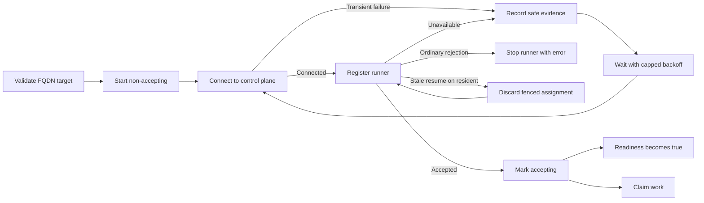
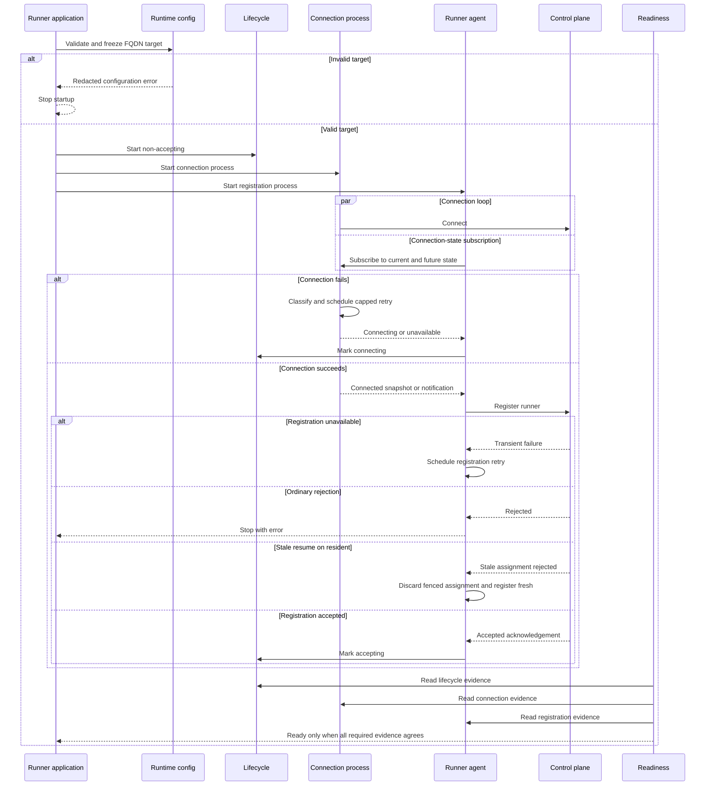
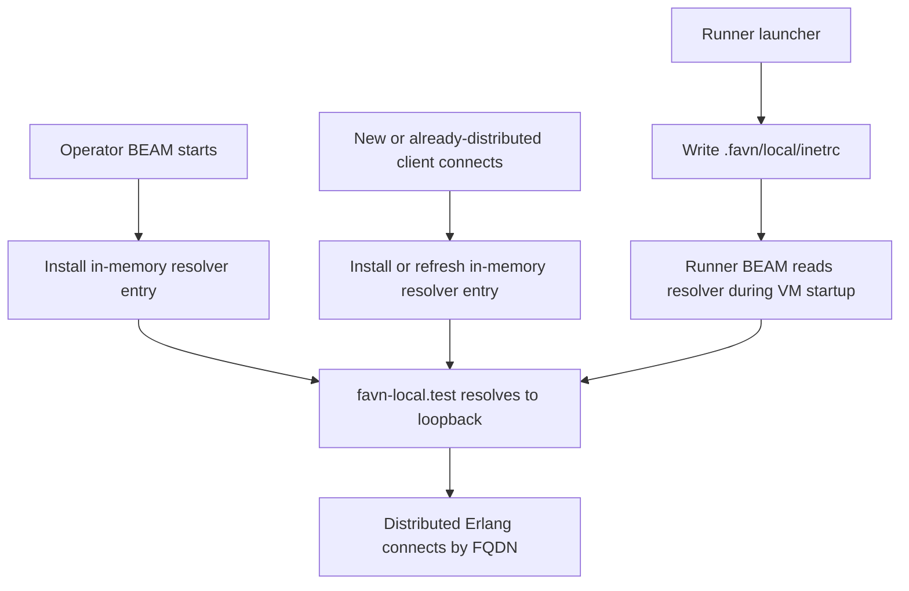
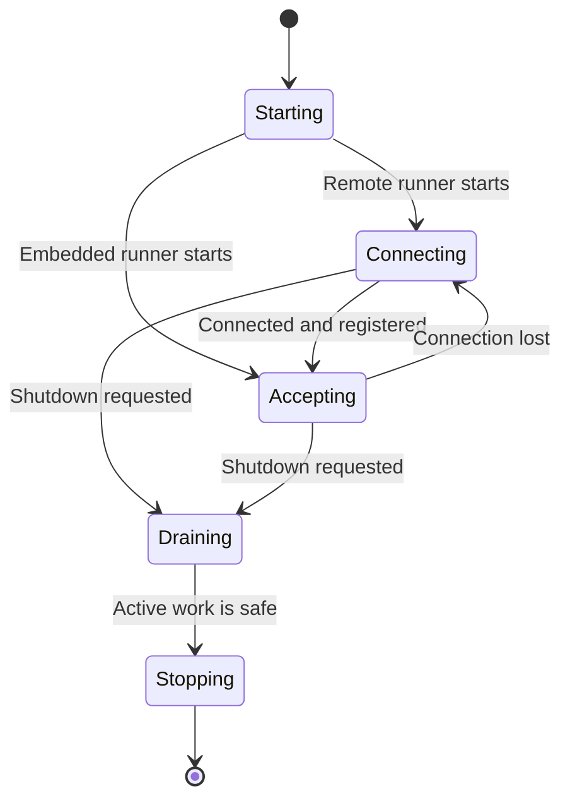

# Change Record: Runner Control-Plane Connectivity

| Field | Value |
| --- | --- |
| Status | Implemented |
| Type | Bug fix |
| Primary issue | [#633](https://github.com/eirhop/favn/issues/633) |
| Pull request | [#656](https://github.com/eirhop/favn/pull/656) |
| Related work | The repository change-record standard is introduced in the same PR at the user's request. |
| Affected areas | Packaged and source-development runner startup, distributed-BEAM connection, registration, lifecycle, readiness, deployment templates, logs, and diagnostics |
| Approved plan commit | Not available. The temporary plan was reviewed and removed before permanent change records were adopted. |
| Original code baseline | `87e91127` |
| Implementation commit before this record | `ed4abc65`, rewritten as `38b8be63` by the required rebases |
| Post-rebase OTP typing correction | `99fcd715` |
| Distributed slow-test topology correction | `e02472f7`, completed for every peer path by `e2fd8c05` |
| Docker-free local topology correction | `97c6d731`, hardened for already-distributed clients by `bec560aa` |
| Last updated | 2026-08-21 |

## One-minute summary

A packaged runner could accept a short control-plane hostname even though it
uses long distributed-Erlang node names. OTP then rejected the connection, but
the runner kept retrying with little useful evidence. At the same time, the
runner reported itself as accepting and ready before it had connected or
registered.

The fix rejects an invalid hostname during startup, keeps a remote runner
non-accepting until connection and registration both succeed, and makes
readiness depend on that evidence. It also adds capped retry delays, safe
failure classes, rate-limited logs, telemetry, and redacted diagnostics.
Generated deployment artifacts and Docker-free source development now both use
valid FQDN node aliases; the local alias resolves only inside the participating
BEAM processes and requires no machine-level DNS changes.

This record was made permanent after implementation because the repository
adopted the change-record process while PR #656 was already open. The known
decisions from the approved temporary plan are reconstructed here from the
issue, original source, implementation review, and reviewer evidence. This is
not an exact copy of the deleted plan, and no baseline commit is claimed.

## Impact

Before this change, an operator could see a running, ready-looking runner while
queued work never moved. A simple hostname error looked like a scaling or
scheduling failure.

After this change:

- an invalid control-plane hostname stops packaged runner startup with a clear,
  redacted configuration error;
- a disconnected or unregistered runner reports not ready and does not accept
  new work;
- diagnostics show which layer is failing and, when available, the connection
  and registration retry schedules; the subscription retry remains internal;
- Docker-free source development uses a reserved local FQDN automatically,
  without requiring DNS or hosts-file setup;
- repeated failures produce useful evidence without flooding logs.

## Problem analysis

The failure had three root causes:

1. **Validation gap:** the runner accepted a dotless host even in long-name
   distributed-Erlang mode.
2. **Lifecycle gap:** `RuntimeBootstrap` marked every runner accepting without
   connection or registration evidence.
3. **Readiness and diagnostic gap:** readiness mostly proved that the manifest
   process existed. It did not require connection, registration, or lifecycle
   acceptance, and retries exposed little bounded evidence.

These gaps combined into a false healthy state. The connection loop itself was
not enough to establish whether the runner could claim work.

### Assumptions

- The issue concerns a packaged runner with `FAVN_CONTROL_PLANE_NODE` configured.
- Packaged production runners use long distributed-Erlang names, mutual TLS, a
  high-entropy cookie, and one explicit control-plane node.
- Embedded and test operation without a control plane must keep immediate local
  acceptance.
- Code can validate FQDN syntax. Private DNS routing remains an infrastructure
  responsibility.
- Existing assignment, lease, fencing, drain, and unknown-outcome behavior is
  correct and must not change.
- `Node.connect/1` returning `false` cannot safely distinguish every TCP, TLS,
  certificate, or cookie failure.
- Invalid startup configuration is terminal. Transient connection or
  registration failures continue with bounded retry frequency.
- No runner wire-protocol change is required.

### Evidence

| Evidence | What it proves | What it does not prove |
| --- | --- | --- |
| Issue #633 and the observed Azure Container Apps failure | A dotless hostname can leave a runner running but unable to register or claim work. | The behavior of every infrastructure provider. |
| Original source at `87e91127` | Startup marked lifecycle accepting independently of connection and readiness omitted connection and registration. | Live network behavior. |
| Focused runner tests in PR #656 | Invalid-host, disconnect, retry, registration, readiness, and redaction behavior are deterministic. | A real two-node TLS deployment. |
| Rebased slow and local-lifecycle tests | Real child runners connect and register through valid process-local FQDN aliases. | External private-DNS or TLS deployment behavior. |
| Independent plan-to-code review | The implementation preserves the approved invariants and identifies material deviations. | Post-push CI or live deployment proof. |

## Current behavior before the change

### Old call and event sequence

The important ordering bug is visible above: acceptance and readiness could
happen before the connection and registration loops succeeded.

## Reconstructed approved plan

For a configured remote runner, startup must establish evidence in this order:

### New call and event sequence

The connection and subscription loops may start in either order. A late
subscriber receives the current connection snapshot. The enforced order is
connected evidence, registration, accepted acknowledgement, then lifecycle
acceptance.

### Contracts and invariants

- Only the frozen, validated target node may be contacted.
- A configured remote runner accepts work only after connection and accepted
  registration.
- Every disconnect requires a fresh accepted registration.
- `draining` and `stopping` remain monotonic. They cannot regress to connecting
  or accepting.
- Connection loss rejects new admission owners but preserves an existing
  monitored permit so admitted work can finish.
- Existing assignments, leases, buffered results, fencing, and unknown outcomes
  keep their previous semantics.
- Possibly completed writes or side effects are never blindly retried.
- The connection process owns transport state and timing.
- The runner agent owns registration and assignment-resume state.
- Lifecycle owns local admission. The orchestrator remains durable work
  authority.
- Failure classes are bounded atoms derived from stable public OTP results.
- Diagnostics and logs never include cookies, tokens, certificate contents, TLS
  paths, private paths, or arbitrary exception terms.
- Telemetry still fires when a matching log is suppressed.
- No orchestrator dependency is added to `favn_runner`.

### Scope

- Validate the packaged runner node topology before the supervision tree starts.
- Make connection, registration, lifecycle, and readiness state agree.
- Add bounded connection and registration retry ownership.
- Expose safe operational evidence through diagnostics, logs, and telemetry.
- Update generated Compose node aliases and canonical runner documentation.
- Add focused regression, recovery, readiness, logging, and redaction tests.

### Non-goals

- Database, storage, manifest, or public DSL changes.
- A runner wire-protocol change.
- A generic distributed-Erlang discovery framework.
- Reworking durable task recovery, fencing, or unknown outcomes.
- Proving or deploying a live Azure or distributed-TLS environment.

### Implementation slices

| Slice | Outcome | Owner or area | Depends on |
| --- | --- | --- | --- |
| 1 | Reject invalid long-name targets before startup | Production runtime configuration | Existing release configuration |
| 2 | Own connection state, classification, diagnostics, and one capped retry timer | Connection process | Validated target |
| 3 | Register only after connection and own registration recovery | Runner agent | Connection notifications |
| 4 | Keep remote runners connecting until registration is accepted | Lifecycle and bootstrap | Registration state |
| 5 | Fail readiness closed from composed evidence | Public runner facade | Lifecycle, connection, and registration diagnostics |
| 6 | Emit debug failed attempts, rate-limited warning summaries, success events, and per-event telemetry | Runner operational events | Stable failure classes |
| 7 | Use one consistent long-name topology | Deployment template and canonical docs | FQDN contract |
| 8 | Prove failure, recovery, concurrency, and redaction behavior | Runner and acceptance tests | All earlier slices |

### Implementation map

| Concept | Code area | Responsibility |
| --- | --- | --- |
| Startup validation | `production_runtime_config.ex` and `application.ex` | Reject unsafe targets and pass frozen configuration to children. |
| Transport state | `control_plane_connection.ex` | Connect, monitor, classify, retry, notify, and report diagnostics. |
| Registration state | `runner_agent.ex` | Register, recover, fence stale results, and control lifecycle acceptance. |
| Admission state | `lifecycle.ex` and `runtime_bootstrap.ex` | Reject new work until remote registration is accepted. |
| Readiness | `favn_runner.ex` | Compose release, local, connection, and registration evidence. |
| Operational evidence | `operational_events.ex` | Separate telemetry from rate-limited structured logs. |
| Deployment contract | Compose template and production docs | Use fully-qualified long-name aliases consistently. |

## Operational design

### Failures and recovery

- An invalid hostname is a startup error and is not retried.
- A transient connection failure records a safe class and schedules one capped,
  jittered retry.
- Connection loss clears the usable gateway, marks registration and lifecycle
  connecting, and requires fresh registration.
- Registration failure has a separate coalesced retry because transport may
  remain connected while the control-plane registration endpoint is unavailable.
- Ordinary registration rejection stops the runner with an error. The one
  recoverable rejection is a stale assignment on a resident runner: it discards
  the fenced assignment and registers fresh.
- A late registration acknowledgement from before a disconnect is fenced and
  cannot make the runner accepting.
- Existing admitted work may finish. New work waits until recovery.
- The runner may stay unavailable for an unbounded outage, but retry rate and
  diagnostic payloads remain bounded.

### Logs and diagnostics

| Event or state | Level or surface | Safe fields | Rate limit |
| --- | --- | --- | --- |
| Failed connection attempt | Debug log and telemetry | Retry number, bounded target identity, safe class, next delay | Every failed attempt |
| Connection failure summary | Warning log and telemetry | Safe class, retry number, next delay, suppressed count, bounded target identity | Log at retries 1, 2, 4, 8, every 20, and when class changes; telemetry every failure |
| Registration failure | Warning log and telemetry | Safe class, retry number, next delay, sanitized pool | Log at retries 1, 2, 4, 8, every 20, and when class changes; telemetry every failure |
| Connection success | Info log and telemetry | Connection duration, prior retry count, bounded target identity | Once for initial connection and once per recovery |
| Registration accepted | Info log and telemetry | Sanitized pool | Once for each accepted registration |
| Runner diagnostics | `FavnRunner.diagnostics/0` | Lifecycle, target, connection, registration, retry count, timestamps, next delay, manifest state | On request; remote evidence uses short bounded calls |
| Runner readiness | Health-check surface | Ready or not ready from required evidence | On request; remote evidence fails closed when unavailable |

Connection diagnostics include status, connected state, validated target,
retry count, last safe failure class and time, connected time, and next retry.
Registration diagnostics include status, registered state, agent phase, retry
count, last safe failure class and time, and next retry.

Raw credentials, certificate material, TLS paths, arbitrary exceptions, and
unbounded rejection values are excluded.

### Deployment, migration, and compatibility

There is no database migration or wire-protocol compatibility window. Existing
valid FQDN configurations continue to work. Dotless, IP, malformed, and
underscore-bearing control-plane hosts now fail startup and must be corrected
before deployment.

Generated Compose artifacts give Control Plane, View, and Runner consistent
FQDN aliases because long-name distributed-Erlang nodes cannot safely mix with
short-name nodes. Rollback uses the previous immutable runner release and its
matching manifest. Rolling back also restores the old false-ready risk, so
correcting configuration is preferred.

## Verification plan

| Acceptance criterion | Planned evidence | Owning layer |
| --- | --- | --- |
| Invalid short or malformed targets fail before startup | Runtime configuration and application tests | Runner startup |
| Valid FQDN targets continue working | Runtime configuration tests | Runner startup |
| Disconnected or rejected runners are never accepting or ready | Lifecycle, runner-agent, and facade tests | Runner lifecycle |
| Accepted registration restores accepting and ready | Runner-agent and facade tests | Runner registration |
| Reconnection requires fresh registration | Connection and runner-agent recovery tests | Transport and registration |
| Active permits survive disconnect while new owners are rejected | Lifecycle concurrency tests | Local admission |
| Retries are coalesced, capped, and truthful | Connection and runner-agent timer tests | Retry owners |
| Logs are rate-limited while telemetry remains complete | Operational-event tests | Diagnostics |
| Sensitive canaries never appear | Redaction tests | Configuration, diagnostics, and logs |
| Generated services use qualified names | Deployment artifact acceptance test | Deployment template |

Evidence must separate source inspection, focused tests, broader CI, and live
deployment proof. Live Azure or two-node TLS verification was not part of this
change.

## Risks and open questions

| Risk or question | Impact | Mitigation or decision |
| --- | --- | --- |
| OTP collapses several handshake failures into one public result | Diagnostics may be less specific than the underlying failure. | Use an honest aggregate class rather than false precision. |
| Registration completes after disconnect | A stale acknowledgement could restore acceptance. | Tokenize and fence the operation; test the late-result path. |
| Repeated timers or node monitors duplicate events | Retry storms and noisy logs. | Coalesce timers, enable monitoring once, and ignore stale tokens. |
| Remote diagnostic calls exceed the container health-check budget | Health checks can time out or mistake restart windows for embedded operation. | Use short connection and registration calls and return explicit unavailable evidence. |
| Infrastructure accepts an FQDN that does not route privately | Startup validation passes but connection fails. | Report bounded runtime failure; infrastructure owns DNS and routing. |

## Plan review

| Field | Result |
| --- | --- |
| Reviewer | Independent sub-agent `issue_633_plan_review` |
| Reviewed against | Issue #633, temporary plan, original source, implementation, focused tests, logs, diagnostics, and canonical docs |
| Findings | Concurrency, stale-registration, duplicate-monitoring, retry-counter, redaction, and health-check-budget hardening findings |
| Findings addressed and rechecked | Yes. The reviewer reran focused checks against the corrected implementation. |
| Verdict | PR-ready with no remaining P0-P2 findings; one unused-state P3 cleanup was non-blocking. |

The temporary plan was deliberately removed before PR creation. Because the
permanent-record standard did not yet exist, there is no approved-plan commit.
This record keeps that limitation visible instead of rewriting history.

---

## Implementation outcome

The implementation follows the approved ordering: validate, connect, register,
then accept work. Disconnect reverses availability and a fresh accepted
registration is required for recovery.

Post-rebase qualification also removed an impossible four-element success
match from the EPMD address probe. OTP 29's public type returns either an
address or an error at that step, so the removed clauses were unreachable. This
fixed Dialyzer without changing runtime behavior or the approved design.

The first rebased CI run then found two remaining IP-based local topologies.
Production code correctly rejected both. The distributed-runner slow test now
installs a process-local FQDN resolver entry and starts its control-plane node
as `control-plane.favn.test`. Docker-free source development now uses the
reserved `favn-local.test` alias for operator, runner, and client nodes, with a
loopback mapping installed inside each BEAM. Neither correction weakens
production validation or requires external DNS changes.

Final slow CI then proved the shared peer resolver setup was still applied only
before the real-runner path. Lightweight distributed scale agents used the same
peer but missed the mapping. Commit `e2fd8c05` moves the existing resolver setup
to peer creation, so every distributed runner path receives it.

### Actual scope and complexity

- Issue implementation: 27 files across runner runtime, local-development
  runtime, tests, deployment artifacts, and canonical documentation.
- Process documentation added at the user's request: `AGENTS.md`, documentation
  routing, the change-record README and template, and this record.
- Ownership boundaries affected: runner startup, transport connection,
  registration, lifecycle admission, readiness, operational evidence, and
  deployment and local-development generation. Durable orchestrator and storage
  ownership did not change.
- Implementation complexity: **High** — several concurrent state owners, timers,
  disconnect races, readiness composition, redaction, and recovery invariants
  had to agree.
- Operational complexity: **Moderate** — deployment configuration becomes
  stricter and diagnostics improve, but there is no migration, protocol change,
  or new operator service.
- Canonical documentation updated: `docs/production/elastic_runners.md`,
  `docs/structure/favn_runner.md`, `docs/structure/favn_local.md`, and the public
  local-development guide.

## Deviations from the approved plan

| Planned | Implemented | Reason | Impact | Reviewer verdict |
| --- | --- | --- | --- | --- |
| Distinguish EPMD unavailable from no registered node. | Use aggregate `epmd_probe_failed`. | OTP's public EPMD API returns the same `:noport` result for both cases. | Less specific but truthful diagnostics. | Justified; avoids false precision. |
| Qualify the control-plane destination in generated defaults. | Give Control Plane, View, and Runner consistent FQDN aliases. | Long-name distributed nodes cannot safely mix with short-name nodes. | Broader generated Compose change, no protocol change. | Justified and required for a coherent topology. |
| Keep one coalesced transport timer; registration remains runner-agent state. | Add a separate tokenized registration timer and connection-subscription retry. | Transport may be connected while registration is unavailable, and subscription can initially time out. | More state, but each failure layer has one clear retry owner. | Justified after concurrency review. |
| Make remote diagnostics bounded and require configured connection and registration evidence. | Add short timeouts for connection and registration evidence and derive requiredness from frozen configuration. | Process presence can briefly disappear during one-for-all restart, and default remote calls can exceed the three-second health check. | Remote evidence fails closed quickly; this does not claim a total readiness deadline. | Justified hardening. |
| Log recovery at info. | Log one initial success and one event per recovery. | Initial positive evidence is useful and does not repeat. | One extra bounded startup event. | Justified; low noise. |
| Keep the PR limited to issue #633. | Add the repository change-record standard and this permanent record. | The user explicitly adopted the process after implementation and asked to update this PR. | Six documentation files broaden the review but do not alter runtime behavior. | Accepted as an explicit documentation-only scope addition. |
| Update generated deployment defaults to use a valid FQDN topology. | Also update Docker-free local operator, runner, and client nodes to use the reserved `favn-local.test` alias with process-local loopback resolution. | Rebased acceptance CI proved the real source-development child runner was rejected by the same new production contract. | Nine local runtime, test, and documentation files; no external DNS, machine configuration, protocol, or storage change. | Justified and complete after final plan-to-code review. |

Review also found implementation defects that were corrected without changing
the approved architecture: stale registration acknowledgements are fenced,
node monitoring is enabled once, duplicate disconnect events are ignored, retry
counters remain truthful, periodic summaries continue after retry 8, underscore
hosts are rejected, runner-pool metadata is sanitized, and remote connection and
registration evidence fails closed within the health-check budget. Post-rebase
CI preparation also removed unreachable EPMD return-shape matches reported by
OTP 29 Dialyzer, updated one distributed-runner fixture, and aligned the real
Docker-free local topology with the required FQDN contract. The first two are
qualification corrections; the local-topology expansion is recorded above as
a material deviation.

## Decision log

| Date | Decision | Reason | Review needed |
| --- | --- | --- | --- |
| 2026-08-21 | Aggregate EPMD probe failures. | OTP cannot expose the planned distinction reliably. | Reviewed and accepted. |
| 2026-08-21 | Use FQDN aliases for every generated BEAM service. | One long-name topology must be internally consistent. | Reviewed and accepted. |
| 2026-08-21 | Separate transport, subscription, and registration retry ownership. | They can fail independently and need coalesced recovery. | Reviewed and accepted. |
| 2026-08-21 | Add the permanent change-record standard and record to PR #656. | User requested adoption before the next push. | Reviewed and accepted. |
| 2026-08-21 | Remove impossible EPMD address-probe return matches. | OTP 29 Dialyzer proved those clauses are unreachable; the supported address and error results were already handled. | Reviewed and accepted; no plan deviation. |
| 2026-08-21 | Give every distributed-runner slow-test peer a process-local FQDN mapping. | Rebased CI proved the old dotless node was invalid; final slow CI then proved the mapping must be installed at peer creation for both real and lightweight agents. | Reviewed and accepted as a qualification correction completing commit `e02472f7`. |
| 2026-08-21 | Give Docker-free source development a reserved process-local FQDN. | Rebased acceptance CI proved the child runner still used an IP-based node that the new contract correctly rejects. | Reviewed and accepted as deviation seven. |

## Verification evidence

| Check | Result | Evidence boundary |
| --- | --- | --- |
| Repository formatting | Passed after rebase. | Formatting only. |
| Runner compile with warnings as errors | Passed after rebase and the OTP typing correction. | Compile qualification, not runtime proof. |
| Five affected runner test files | 67 passed after rebase. | Focused deterministic behavior. |
| Runner fast suite | 238 passed after rebase. | Runner regression qualification. |
| Public `favn` fast suite | 183 passed, 3 excluded after rebase. | Public facade regression qualification. |
| Deployment artifact acceptance test | 1 passed after rebase. | Generated Compose contract. |
| Real distributed-runner storage slow test | 1 passed, 35 excluded, against an isolated PostgreSQL instance after the FQDN fixture correction. | Cross-node connection, registration, lifecycle acceptance, and task start. |
| Three-pool distributed scale slow test | 1 passed, 35 excluded after commit `e2fd8c05`; 333 agents started with a measured 2,566 ms p95 and empty gateway and registry mailboxes. | Shared peer resolution and distributed scale behavior; not the complete slow suite. |
| FavnLocal fast suite | 33 passed, 2 excluded after the process-local FQDN correction, including the already-distributed client path. | Local configuration, resolver-file, launcher, client, and lifecycle regression qualification. |
| Docker-free local lifecycle acceptance test | 1 passed against an isolated PostgreSQL instance after commits `97c6d731` and `bec560aa`; logs show connect, accepted registration, accepting lifecycle, replacement, drain, and recovery through `favn-local.test`. | Real child-BEAM source-development lifecycle; not external DNS or TLS proof. |
| Umbrella compile with warnings as errors | Passed after rebase. | Compile qualification across applications. |
| Quick Credo and Sobelow checks | Passed after rebase with no issues. | Static lint and security qualification. |
| Whole-umbrella Dialyzer | Passed after the OTP typing correction; the configured three known exclusions remained skipped. | Static type qualification. |
| Test-tier guard | Passed after rebase. | CI-routing consistency. |
| Diff checks | Passed after the final record update. | Patch formatting only. |
| Independent implementation review | PR-ready; no P0-P3 findings remained after corrections. | Plan-to-code and focused-test comparison. |
| Initial PR CI | Mixed: fast tests and image qualification passed; quick, Dialyzer, acceptance, and slow jobs failed. | Stale pre-rebase CI; not final evidence for the rebased head. |
| First rebased PR CI | Quick, Dialyzer, fast, and both image qualifications passed. Slow CI exposed an outdated dotless test fixture; acceptance exposed the same contract mismatch in the IP-based Docker-free local topology. | Intermediate CI evidence before commits `e02472f7`, `97c6d731`, and `bec560aa`. |
| First final-head PR CI | Every job except slow tests passed. The slow scale test exposed that the shared peer mapping was initialized only by the real-runner helper. | Intermediate CI evidence before commit `e2fd8c05`; the aggregate CI job failed only because slow tests failed. |
| Final pre-rewrite PR CI | All required jobs passed, including quick, fast, acceptance, slow, Dialyzer, HTTP-boundary security, and both image qualifications. | Qualification of the equivalent pre-rewrite head `a5b34620`; `main` advanced afterward, so the rewritten head still requires CI. |

### Not verified

- Post-push CI for the rebased head is pending.
- No live two-node TLS distribution test was run.
- Private-DNS routing, certificate SANs, cookie compatibility, and Azure
  deployment were not proven.
- The umbrella fast suite was incomplete in the original shell because
  `FAVN_DATABASE_URL` was absent; one unrelated 100 ms connection-guard
  assertion also missed its message.

## Final review

| Field | Result |
| --- | --- |
| Reviewer | Independent sub-agent `change_record_standard_review` |
| Compared | Approved temporary plan, implementation, tests, diagnostics, canonical docs, and this reconstructed record |
| Deviations complete | Yes. Seven material plan or PR-scope deviations are recorded. |
| Findings | Earlier record reviews found accuracy and precision issues. Final topology review found one P1 plan-integrity issue, one P2 existing-client resolver gap, and two P3 visualization or count issues. Final CI found incomplete FQDN setup in a shared test peer. |
| Findings addressed and rechecked | Yes. The approved-plan wording, existing-client resolver, visualization, counts, and shared distributed-peer fixture were corrected and independently rechecked. |
| Verdict | Approved with no remaining P0-P3 findings. The implementation matches the reconstructed plan except for the seven recorded and accepted deviations; commit `e2fd8c05` is a qualification correction, not an eighth deviation. |
