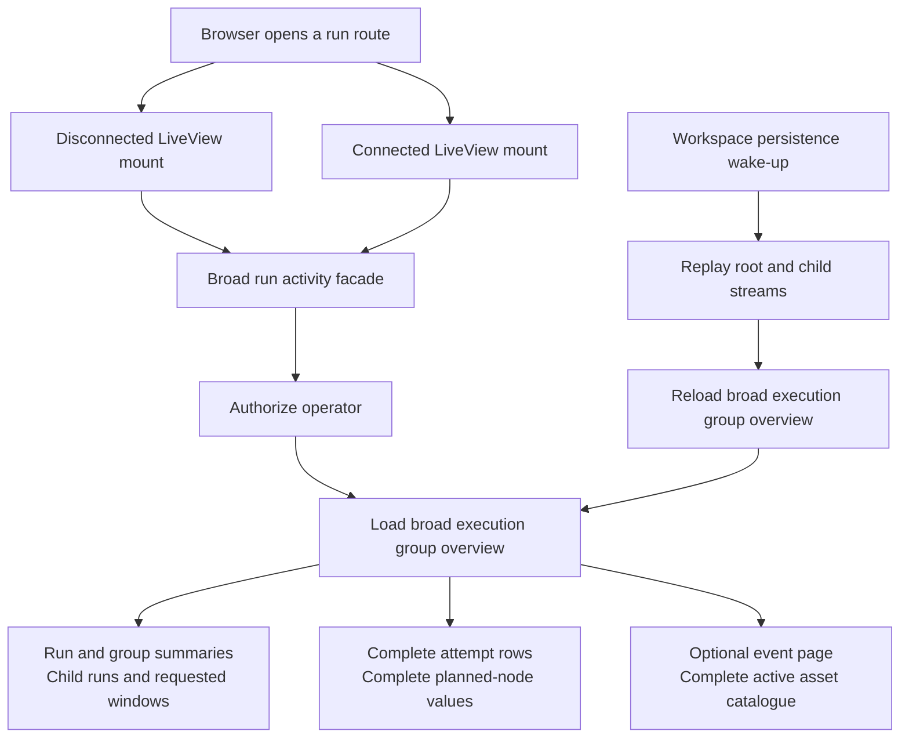
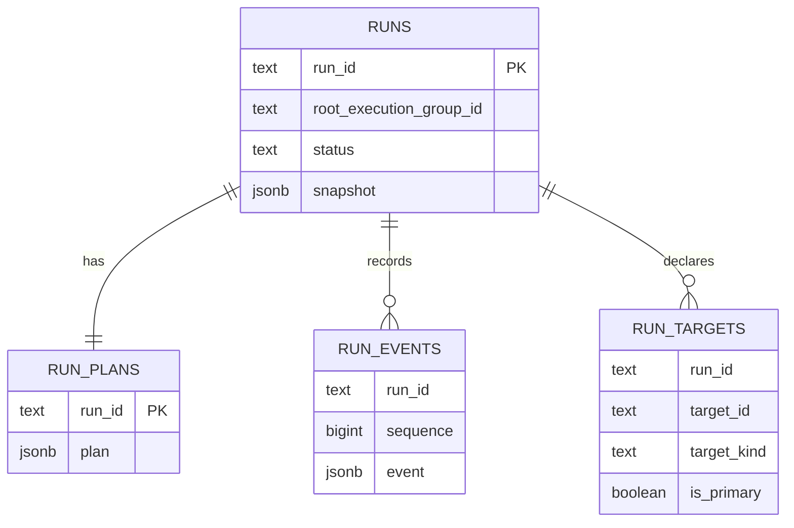
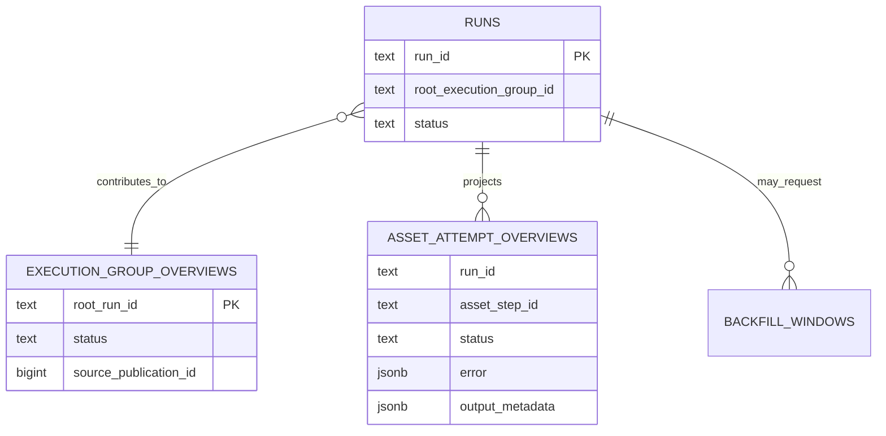
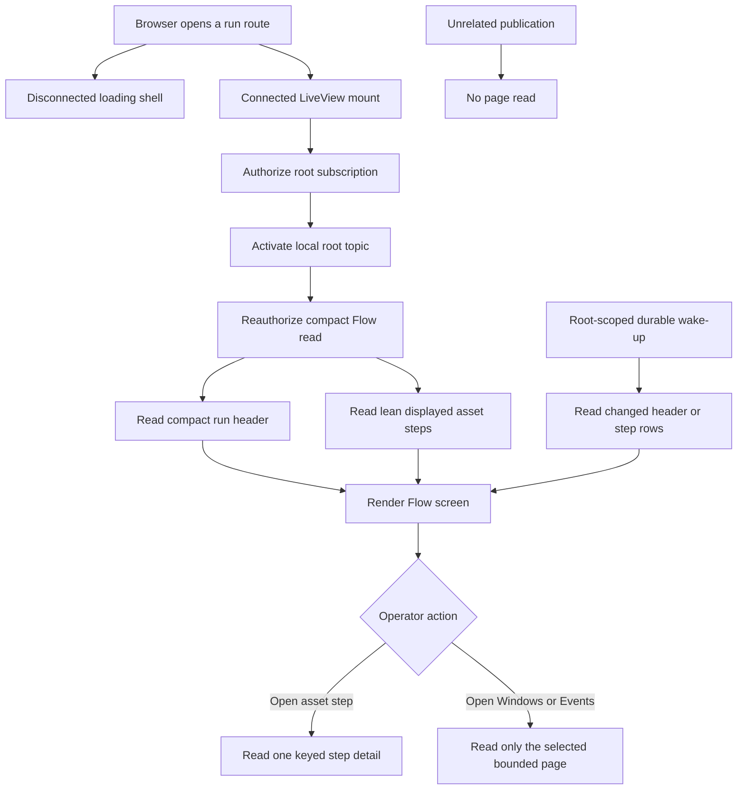
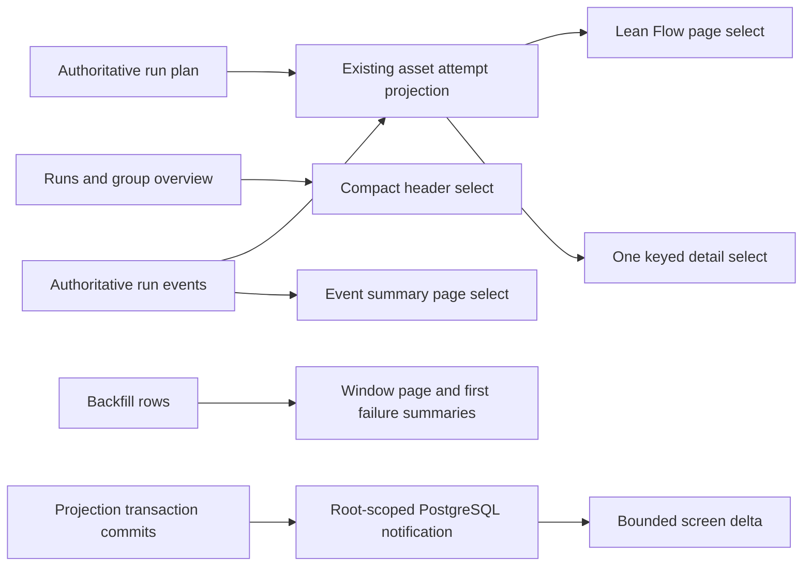
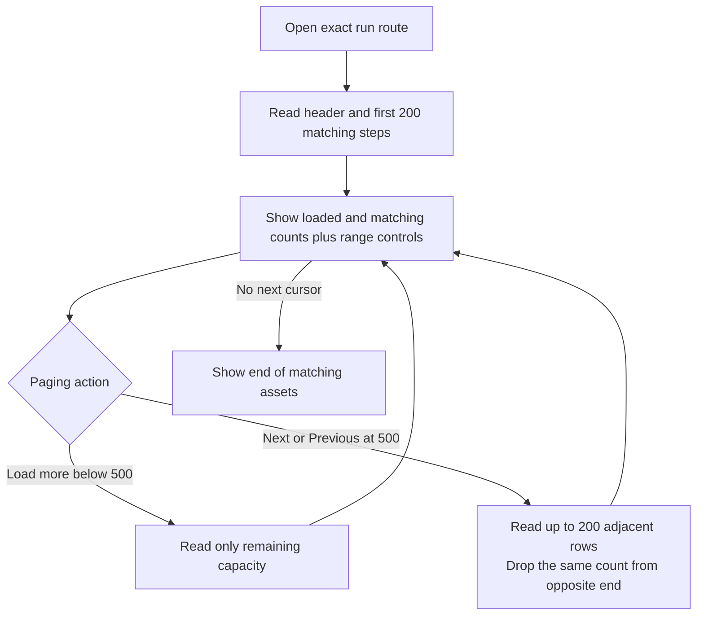
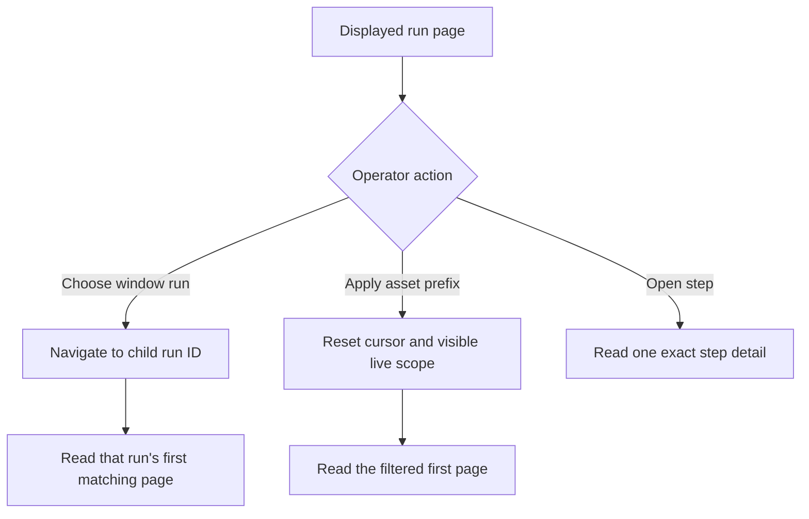
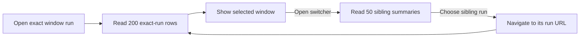
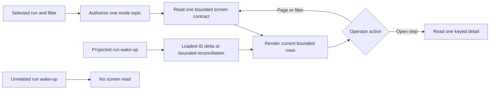

# Change Record: Run Detail Read Performance

| Field | Value |
| --- | --- |
| Status | Implementing |
| Type | Bug fix and cross-application refactor |
| Primary issue | [#658](https://github.com/eirhop/favn/issues/658) |
| Pull request | [#659](https://github.com/eirhop/favn/pull/659) |
| Related work | None |
| Affected areas | Operator run reads in `favn_orchestrator`, PostgreSQL operator-read queries in `favn_storage_postgres`, and `/runs/:run_id` in `favn_view` |
| Approved plan commit | `a588ee304fcb0a7af99f5ef853a48bb12694a904` |
| Last updated | 2026-08-23 |

## One-minute summary

Opening a running pipeline with about 90 assets asks the control plane for a
broad execution-group model instead of the small model rendered by the selected
screen. The initial Flow screen loads child runs, windows, complete attempt
details, planned-node payloads, and a full asset catalogue; disconnected and
connected LiveView mounts can repeat the load, and broad wake-ups can trigger it
again. That makes page cost much larger than the visible UI and spends
PostgreSQL and orchestrator capacity that must remain available for scheduling,
runner coordination, and heartbeats.

This change will replace the broad run-detail read with four bounded operator
use cases: Flow summary, window page, event page, and one keyed asset-step
detail. It will evolve the existing `asset_attempt_overviews` projection in
place so planned and observed steps share one row source, select only fields
rendered by the active screen, load detail only after a click, and refresh only
the affected execution group. It will not create a duplicate table. The change crosses View,
orchestrator, persistence contracts, PostgreSQL queries, and live-update
semantics, so it needs a reviewed change record before implementation.

## Impact

An operator opening a 90-asset running pipeline currently waits while the page
hydrates data for three modes and every attempt drawer. The database can read
large JSONB values and execute a constant but high number of queries before the
operator has requested those details. Every additional viewer and unrelated
persistence publication can repeat that work.

After this change, the default Flow screen will receive one compact run header
and at most 200 lean asset-step rows. Windows, events, and complete attempt
diagnostics will not be read until the operator selects them. Query count will
remain constant as asset or child-run count grows, response size will be bounded,
and an unrelated publication will cause no run-page database read.

The authoritative run lifecycle, scheduling, runner protocol, heartbeat path,
run snapshots, plans, events, and command semantics will not change.

## Problem analysis

The persistence model already separates authoritative run state from derived
operator projections, but the run-detail use case recombines too much of that
model at once:

1. `RunDetailLive` calls one option-driven activity facade for Flow, Windows,
   and Events. Changing modes reloads the same broad base model.
2. `get_operator_run_overview/1` resolves the selected run and then loads the
   execution-group summary, root summary, group runs, requested windows,
   per-run asset counts, attempts, planned nodes, attempt counts, window counts,
   and target references.
3. The attempt query loads complete `asset_attempt_overviews` structs. That
   includes `window`, `error`, and `output_metadata`, although those values are
   used only by an opened detail drawer.
4. Planned steps are returned as complete plan-node JSON values and reduced in
   Elixir, although Flow renders only identity, asset, stage, window, pool, and
   state.
5. The page queries the complete active asset catalogue only to turn one primary
   run target into a back link, even though `run_targets` already stores the
   stable target ID.
6. LiveView performs the data load during mount without excluding the
   disconnected render. A normal LiveView navigation can therefore perform the
   read once for static HTML and again for the connected process.
7. The connected page subscribes to the root and every loaded child run. A
   durable workspace wake-up can replay several streams and then schedule a
   complete broad reload.
8. The one-second Flow clock rebuild is scheduled for an active run even when a
   non-Flow mode is selected.

This is read-boundary drift, not evidence that the authoritative run model is
wrong. The broad domain read was reused as a view DTO, and later compact
projections were placed beneath that DTO without splitting it into
screen-specific contracts.

### Assumptions

- The reported case is an execution group with about 90 planned asset steps and
  no more than the current 200-row initial detail limit.
- The current Flow, Window runs, Events, cancel, retry-remaining, back-link,
  failure, and attempt-drawer capabilities remain available.
- PostgreSQL is the only supported control-plane store.
- `execution_group_overviews` and `asset_attempt_overviews` remain repairable
  projections; `runs`, `run_plans`, and `run_events` remain authoritative.
  `asset_attempt_overviews` may gain planned rows, scalar summary fields, and
  indexes, but it will not become authoritative.
- Large `error` and `output_metadata` values are legitimate detail data. The
  fix is to avoid selecting them for summaries, not to discard them.
- A target ID alone cannot identify one displayed step because an asset can run
  more than once across windows. A detail lookup therefore uses `run_id` plus
  the stable `asset_step_id`; the returned detail includes `target_id` for asset
  navigation.
- Authorization is required on every public read and after every durable
  wake-up. Authorization work is not cached across independent requests.
- Static query counts are lower-bound evidence; runtime baselines must be
  captured before implementation changes the code.
- Protecting the control plane means bounding rows, bytes, query time, refresh
  frequency, and concurrent work. Moving operator reads to a second database or
  adding a cache is not assumed necessary.

### Evidence

| Evidence | What it proves | What it does not prove |
| --- | --- | --- |
| `apps/favn_view/lib/favn_view/run_detail_live.ex` mount, `load_run/5`, and `handle_params/3` | The page loads during mount, uses one broad mode-dependent facade, and reloads the base model on mode changes. | Exact production latency or PostgreSQL buffer usage. |
| `RunDetailLive.detail_from_execution_group/6` and `back_asset_href/2` | The Flow DTO receives attempts, child runs, windows, failures, and optional events, then reads the full active catalogue for one link. | The catalogue size in the reported deployment. |
| `apps/favn_storage_postgres/lib/favn_storage_postgres/operator_reads/store.ex:get_operator_run_overview/1` | The overview composes roughly fifteen store queries before authorization and fallback reads; query count is broad even when Flow alone is visible. | Queries introduced by deployment-specific authentication or telemetry. |
| `compact_attempts/3` calling `Repo.all/1` without a select | Complete attempt rows, including detail JSONB, are materialized for the summary page. | Whether every value is out-of-line TOAST data in the reported database. |
| `add_asset_attempt_overviews_v2.ex` | Each row permits a 64 KiB window, 64 KiB error, and 256 KiB output-metadata payload. Ninety theoretical maximum rows can therefore carry tens of MiB before DTO overhead. | Typical row size in the reported pipeline. |
| `compact_planned_steps/3` | Complete plan-node JSON values are returned to Elixir even though only a few fields are projected. | PostgreSQL CPU cost for the specific 90-node plan. |
| `add_asset_attempt_overviews_v2.ex` and `Projector.project_asset_attempt!/2` | The existing asset-step projection excludes `planned` status and is populated only after attempt-bearing run events, which is why the page falls back to `run_plans`. | The final migration and repair duration. |
| Existing `asset-attempts` projection maintenance | Historical projection rows can already be rebuilt in bounded publication order from authoritative data. | Planned rows until the projector is extended to seed them from `run_plans`. |
| `RunEventRefresh` integration and `subscribed_run_ids/2` | The page subscribes per root/child run and schedules broad refreshes after wake-up or fallback polling. | Cross-node publication rate in production. |
| `assign_flow/1` and `maybe_schedule_flow_tick/1` | Active-run flow geometry can be rebuilt on its clock even when another mode is visible. | Browser render time for the reported machine. |
| Static call-path accounting | A normal disconnected-plus-connected initial Flow load has a lower bound of about 41 page-specific SQL statements and two complete catalogue reads before live-event traffic. | An exact runtime trace; this must be measured in slice 1. |

## Current behavior

The current contract is bounded by row limits, but it is not bounded by the
selected screen. A 200-row limit does not help when every row carries detail
JSONB and several unrelated query families are also executed.

### Current data model

Authoritative run data:

Operator-facing relations:

There is no need to add another table for this work. The existing
`asset_attempt_overviews` relation is the intended asset-run read projection,
but it is incomplete before execution starts. The plan will evolve and repair
that relation in place, then remove `run_plans` from the browser read path.

## Approved plan

Adopt one rule for the run route: **one visible screen gets one public use-case
read, and a closed detail panel gets no detail read**.

The disconnected mount will render a loading shell without making a run-detail
call; mandatory session and workspace calls remain. The connected process will
authorize a root subscription, activate it locally, then independently
reauthorize and load the default Flow contract once.
Mode changes will load only the selected mode. Selecting an executed asset step
will issue one keyed detail read; closing or switching modes will not retain
unbounded detail data.

### Public read contracts

The public orchestrator facade will expose stable structs rather than a broad
map whose `view` and `include` options radically change its contents.

| Use case | Required result | Explicitly excluded |
| --- | --- | --- |
| Initial Flow page | Run/root IDs, target label and primary target ID, group status, trigger, start/end, cancel/retry capability, exact progress counts, projection cursor, at most 200 lean step summaries, and the first 10 pre-attempt window failures plus exact failure total | Run snapshot, plan JSONB, event payloads, ordinary child/window rows, complete error, output metadata, complete window JSON, asset catalogue |
| Flow step summary | `run_id`, stable `asset_step_id`, `target_id`, asset ref/display name, status, stage, scalar window label/range fields, start/end, attempt number, and a bounded failure summary only when rendered inline | Complete error, output metadata, runner payloads, logs, physical relation, input generations |
| Window runs page | Exact total plus a keyset page of 50 child/window summaries with ID, state, asset/window label, start/end/duration, total assets, and succeeded/skipped/failed/running/queued/planned counts | Asset-step detail, event payloads, plans, snapshots |
| Events page | A keyset page of 50 event summaries with run ID, sequence, occurrence time, type, asset-step ID when present, and bounded safe summary | Complete event JSON, plans, snapshots, attempts, windows |
| Asset-step detail | One row addressed by authorized workspace, `run_id`, and `asset_step_id`, including complete bounded error and output metadata needed by the drawer | Other attempts, sibling assets, group windows, catalogue |

The facade may return a durable pre-admission submission state instead of Flow
data, preserving the current distinction between an accepted submission and an
admitted run. Missing, forbidden, unavailable, projection-lag, timeout, and
invalid-cursor outcomes remain explicit and have stable UI states.

### PostgreSQL projection and query design

The implementation will evolve `asset_attempt_overviews` in place. It will not
create or rename a table:

- allow the `planned` state in the existing status constraint;
- add nullable, bounded scalar summary columns needed by Flow without decoding
  JSONB: `target_id`, window kind/start/end/timezone, and `failure_summary`;
- cap `failure_summary` at 1,024 encoded bytes and keep existing identifier and
  detail-payload bounds;
- add an initial-page index on workspace/root/stage/asset/window/run/step and a
  delta index on workspace/root/source-publication/run/step;
- when a run's first authoritative event is projected, decode its immutable
  `run_plans` row once and upsert one `planned` row per plan node using
  `AssetStepIdentity.asset_step_id/3`;
- let later attempt events update that same primary-key row under the existing
  publication-order guard; an attempt event without a seed still upserts a
  complete observed row so projection lag cannot lose execution evidence;
- populate scalar window and bounded failure fields in the projector while
  retaining complete bounded `error` and `output_metadata` only for the keyed
  detail read;
- extend the existing bounded `asset-attempts` repair so replaying the first run
  event seeds planned rows before later events update them. Plans plus run events
  remain the rebuild source;
- use one deterministic, versioned `maintenance_jobs` record per workspace for
  `asset_attempts` version 2 readiness. The initial root-resolution statement
  checks that completed marker in the same query; an absent/running/failed marker
  returns the explicit projection state without adding a per-page readiness
  query.

After projection repair, browser reads never select `run_plans.plan`. The Flow
query reads planned and observed rows from one ordered projection using the
cursor `(stage, asset_ref, window_identity, run_id, asset_step_id)`. Exact status
counts are computed in the same statement independently of the 200-row page.
The selected run/root header uses explicit fields from `runs`,
`execution_group_overviews`, `run_targets`, and existing backfill aggregates;
it never selects `runs.snapshot`. The primary target ID comes from
`run_targets`, eliminating the asset-catalogue read.

Window and Event queries use existing authoritative/derived relations with
explicit summary selects and keyset cursors. The Event query selects relational
event columns and a bounded safe summary; it never decodes `run_events.event`.
The asset-step detail query uses the existing `(workspace_id, run_id,
asset_step_id)` index and selects exactly zero or one complete detail.

Every multi-statement screen read runs in one read-only, repeatable-read
transaction and returns the global projection cursor observed in that same
snapshot. PostgreSQL enforces a 750 ms statement timeout and a 1,500 ms
transaction timeout. The View's local composite operation propagates one
monotonic three-second deadline across remote grant authorization/root
resolution, local subscription activation, independent remote read
reauthorization, and storage. It cancels the operation at that deadline and does
not automatically retry. These are initial protective budgets and may be
tightened, but relaxing them requires recorded runtime evidence and plan review.

### Proposed data flow

`B` is the existing `asset_attempt_overviews` table, evolved in place. Planned
rows are a disposable rendering projection, not a second copy of authoritative
run state. A full rebuild deletes/recreates only derived rows from `A` and `C`.

### Read and payload budgets

| Interaction | Facade budget | Store data-query budget | Row and payload budget |
| --- | --- | --- | --- |
| Disconnected mount | Zero run-detail calls | Zero run-detail data queries | Authentication/session setup remains mandatory; run content is a loading shell |
| Connected initial Flow and root subscription | Two remote facade calls and two independent authorization operations: grant, then snapshot | At most four data statements across grant/root resolution and Flow snapshot, independent of asset and child-run count | Header at most 16 KiB; 200 steps at most 1 MiB; 90-step fixture at most 512 KiB; 10 window failures within the same 1 MiB response |
| Select Window runs | One call and one authorization operation | At most two data statements | 50 summaries, exact total, keyset cursor, at most 256 KiB |
| Select Events | One call and one authorization operation | At most two data statements | 50 summaries, 1,024-byte summary each, keyset cursor, at most 256 KiB |
| Open attempt drawer | One call and one authorization operation | One indexed data statement | Exactly zero or one detail; error at most 64 KiB, output metadata at most 256 KiB, total response at most 448 KiB |
| Relevant live delta | One coalesced call and one reauthorization operation | At most two data statements | Only rows newer than the acknowledged projection cursor, capped at 200 and 1 MiB |
| Unrelated publication | Zero run-detail calls | Zero page-owned queries | No socket change |

The budgets count use-case data statements separately from the shared identity
queries so ownership remains clear. Slice 1 will also capture and lock the exact
end-to-end SQL count, including authorization, for the repository's configured
auth mode. No per-asset, per-child-run, or per-event query is permitted.

The initial Flow SQL must have automated evidence that it does not select or
decode `runs.snapshot`, `run_plans.plan`, `run_events.event`,
`asset_attempt_overviews.window`, `error`, or `output_metadata`. A 90-asset page
must not call `active_asset_catalogue/1`.

### Live update design

One connected page subscribes to the resolved root execution group, not to each
member run. Existing durable outbox/publication evidence remains the source of
truth; no event payload is trusted from PubSub and no new persistence table is
introduced.

The initial connection is an explicit local composition owned by
`FavnView.Orchestrator`:

1. a remote facade call reauthorizes the caller, resolves the immutable
   workspace/root identity with one scalar read, and returns a bounded
   non-authoritative subscription grant;
2. the View adapter activates that grant locally in the calling LiveView
   process;
3. a second remote facade call independently reauthorizes the caller and reads
   the repeatable-read Flow snapshot;
4. a read failure deactivates the local subscription before returning the
   error.

A projection committed before local activation is visible in the later
snapshot; a projection committed after activation queues a wake-up. The grant
authorizes wake-ups only and can never authorize or supply a durable read.
Direct `?attempt=` navigation completes this Flow connection first and then
performs one separately authorized keyed detail read.

The existing pre-projection `favn_outbox_published` wake-up remains available to
the projection worker but is no longer consumed by run pages. During the
projection transaction, the projector collects affected
`{workspace_id, root_run_id}` pairs from run and backfill contexts. After it has
written all projections and advanced the global projection cursor, it executes
one bounded `pg_notify` per affected root on a new
`favn_execution_group_projected` channel. PostgreSQL delivers those
notifications only if and after the transaction commits, eliminating a process
crash window between commit and notification.

Every control-plane node's `NotificationListener` listens to that channel,
validates the bounded JSON payload, and broadcasts a node-local root topic with
workspace, root, committed projection cursor, and bounded change classes. Run
events mark header/steps/events; backfill plan/window events mark
header/windows. The change class only narrows the follow-up read and never
supplies display data.

Each screen response carries the global projection cursor read in the same
repeatable-read snapshot as its rows. The LiveView coalesces root wake-ups for
100 ms and calls a reauthorized delta facade:

- a header change reads the compact header and first 10 pre-attempt failures;
- changed `asset_attempt_overviews` rows use the delta index and return current
  lean rows with `source_publication_id` greater than the acknowledged cursor;
- Events reads rows after its durable group event-ID cursor only while Events is
  selected;
- Window runs refreshes its selected keyset page only for a window/member change;
- the socket advances a screen cursor only after every statement in the
  repeatable-read result succeeds;
- a gap, projection lag, or delta truncation performs one bounded reload of the
  active screen, never the old broad overview;
- duplicate or stale notifications at or below the acknowledged cursor are
  ignored.

PostgreSQL notifications may be lost while a listener is disconnected. Listener
restart emits one node-local `persistence_listener_resumed` signal; connected
run pages perform one bounded active-screen reconciliation. While the root
subscription or listener is known unavailable, active runs use a five-second
fallback poll with capped backoff to 30 seconds. Healthy root subscription
cancels that timer, so ordinary unrelated publications cause no page query.

Every durable read reauthorizes. A wake-up is only a hint and cannot grant access
or carry data that bypasses the facade.

### LiveView behavior

- `mount/3` assigns a complete loading state and performs no run-detail read
  until `connected?/1` is true. Existing session introspection and workspace
  assignment remain mandatory on both mount phases.
- One loader owns `{root_run_id, mode, cursor}` so connected mount and
  `handle_params/3` cannot load the same state twice.
- Flow data remains in the socket when opening and closing its attempt drawer,
  but complete detail is dropped when the drawer closes or another step opens.
- Window and Event pages keep only their bounded current page. Returning to Flow
  reuses its current page unless its publication cursor is stale.
- The one-second clock and `RunFlow.build/2` run only while Flow is visible and
  the group is active.
- A detail URL that names a missing or unauthorized step shows an explicit
  drawer error without replacing the successfully loaded Flow page.
- Cancel and retry commands keep existing idempotency and unknown-outcome
  semantics. Their acknowledgement schedules one relevant bounded refresh.

### Contracts and invariants

- `favn_view` uses only the public `FavnOrchestrator` facade and never calls a
  repo, storage adapter, scheduler, runner, projector, or catalogue internal.
- Every query is scoped by the reauthorized workspace before run identity,
  target identity, or detail is returned.
- Per-interaction query count is constant with respect to assets, child runs,
  and events. Aggregate load still grows with connected viewers and is covered
  by concurrency qualification.
- Every collection has a hard maximum, deterministic ordering, and keyset
  cursor. Truncation is visible and can be continued by the user.
- Summary reads never select complete detail payloads. Detail reads never select
  sibling rows.
- `run_id` plus `asset_step_id`, not target ID alone, identifies an attempt
  drawer. This preserves correctness for repeated assets and windows.
- Authoritative run state and derived projections keep current publication
  ordering, repair, and lag semantics.
- A PubSub message is a wake-up only. Missed messages recover from durable
  cursors; duplicate messages are harmless; stale results cannot overwrite a
  newer socket cursor.
- Read timeout or projection failure is shown honestly. The View does not loop,
  hide the failure behind stale data, or retry without a bounded schedule.
- Cancel, retry, persistence writes, materialization, leases, fencing, and
  possibly completed side effects are unchanged and never blindly retried.
- Logs, telemetry, and errors exclude plan/event/error/output payloads and
  customer data.

### Scope

- Split the broad run-detail facade and persistence DTO into screen-specific
  public contracts.
- Evolve `asset_attempt_overviews` in place to represent planned and observed
  step summaries, add exact initial/delta indexes, and repair it from plans plus
  events.
- Add explicit lean SQL selects and keyed detail queries over existing tables.
- Remove the run-detail asset-catalogue lookup.
- Make disconnected mount free of run-detail calls and make mode loading lazy;
  preserve mandatory session/workspace reads.
- Replace per-child subscriptions and broad reloads with one root-scoped,
  cursor-based refresh path.
- Stop Flow clock/render work outside Flow mode.
- Add query-count, selected-column, row-limit, payload-size, refresh, and
  concurrency regression tests.
- Update canonical View, orchestrator, PostgreSQL data-model, and operator-read
  documentation with the implemented contracts.

### Non-goals

- Creating a second run, asset-run, attempt-detail, event, or cache table.
- Renaming `asset_attempt_overviews` or copying it into a replacement table.
- Changing the run list beyond proving it continues to use compact execution
  group summaries.
- Changing planner, scheduler, runner heartbeat, lease, task, materialization,
  cancellation, retry, or recovery behavior.
- Adding a generic GraphQL/data-loader layer, distributed cache, read replica,
  or second Repo pool.
- Loading every row for execution groups above the page limit.
- Adding retry history that the current projection does not preserve.
- Redesigning the visual layout or removing operator-visible capabilities.

### Implementation slices

| Slice | Outcome | Owner or area | Depends on |
| --- | --- | --- | --- |
| 1 | Capture the real 90-asset call graph, SQL count, selected columns, bytes, timings, EXPLAIN plans, and concurrent-view baseline; turn budgets into failing tests | PostgreSQL test fixture, telemetry, and View integration harness | Current `origin/main` behavior |
| 2 | Add an expand-only migration for planned/scalar fields and initial/delta indexes on the existing `asset_attempt_overviews` table | `favn_storage_postgres` migrations and schema authority | Slice 1 evidence |
| 3 | Seed planned rows, update them from observed events, and extend bounded projection repair/parity verification | PostgreSQL projector and maintenance | Slice 2 |
| 4 | Add lean Flow header/step, keyed detail, Window, Event, and delta query/result contracts over the repaired projection and existing tables | `favn_orchestrator` persistence behavior and `favn_storage_postgres` operator reads | Slices 2–3 |
| 5 | Expose small public facade structs with authorization, limits, cursors, total deadlines, subscription activation, and explicit failure shapes; remove the broad run activity contract after callers move | Public orchestrator facade and run read model | Slice 4 |
| 6 | Make connected Flow load once, lazily load modes and drawer detail, and stop off-screen Flow ticks | `favn_view` LiveView and page components | Slice 5 |
| 7 | Emit post-projection transactional root notifications and add bounded delta refresh with gap/reconnect recovery and fallback polling | PostgreSQL projector/listener, orchestrator events, and View refresh helper | Slices 3–6 |
| 8 | Qualify migration/repair, 90/200-asset, backfill, event-burst, projection-lag, authorization, and concurrent-view behavior; update canonical docs and record actual evidence | Storage, orchestrator, View, production-shaped test harness, docs | All prior slices |

Each slice must leave focused tests passing. Slice 2 cannot add a storage table,
and slice 6 cannot reach around the public facade to meet the budget.

### Implementation map

| Concept | Expected code area | Responsibility |
| --- | --- | --- |
| Public use-case API | `apps/favn_orchestrator/lib/favn_orchestrator.ex` and small operator-run modules | Authorize once per call and return stable, bounded, browser-safe structs. |
| Persistence contracts | `apps/favn_orchestrator/lib/favn_orchestrator/persistence/` | Define exact query inputs, results, cursor, limit, timeout, and failure shapes. |
| Asset-step projection | `apps/favn_storage_postgres/lib/favn_storage_postgres/migrations/`, `schemas/`, `projections/projector.ex`, and projection maintenance | Evolve one existing table, seed canonical planned identities, apply observed events, and repair deterministically. |
| Lean SQL | `apps/favn_storage_postgres/lib/favn_storage_postgres/operator_reads/store.ex` or focused sibling modules | Select only visible fields from existing relations with constant statement count and one consistent snapshot. |
| Durable publication scope | PostgreSQL projector transaction, notification listener, and orchestrator event facade | Emit transactional root-scoped projection wake-ups and activate authorized root subscriptions. |
| Page loading | `apps/favn_view/lib/favn_view/run_detail_live.ex` | Own connected loading, mode state, detail state, cursors, and bounded refresh. |
| UI projection | `FavnView.RunFlow` and run-detail components | Build only the active visual model from lean summaries and render explicit loading/error/truncation states. |
| Verification fixture | `apps/favn_test_support` and owning app tests | Provide deterministic 90- and 200-asset execution groups with bounded and large detail payloads. |
| Canonical docs | `docs/structure/favn_view.md`, `docs/structure/favn_orchestrator.md`, `docs/structure/favn_storage_postgres.md`, and `docs/storage/postgresql/data-model.md` | Document the final current behavior once implementation makes it true. |

## Operational design

### Failures and recovery

- Authorization failure returns the existing forbidden/session outcome and
  subscribes to nothing.
- A missing run may resolve to the durable submission contract. A genuinely
  missing identity remains distinct from storage unavailability.
- Statement, transaction, or total-deadline expiry returns
  `:operator_read_timeout` through a bounded public error; LiveView shows a retry
  action and performs no automatic immediate retry.
- Projection lag returns a named temporary state. The UI may wait for a relevant
  wake-up or the bounded fallback poll, but it never reconstructs a full run
  from snapshots as a fallback.
- A delta gap, restart, or reconnect reloads only the active screen from its
  durable current projection. Duplicate or out-of-order wake-ups are ignored by
  publication cursor.
- If root-scoped wake-up activation fails, one fallback timer is owned by the
  socket. It backs off and is cancelled on recovery or termination.
- Projection repair is bounded, cursor-resumable, idempotent, and publication
  ordered. A failure records existing projection-failure/maintenance evidence;
  the new read returns `:projection_rebuilding` or `:projection_unavailable` and
  never falls back to plans or snapshots.
- Rollback first disables the new View/read contract, deletes only derived
  `planned` rows, restores the old status constraint, and drops added scalar
  columns/indexes before the prior application reads the table. Authoritative
  plans and events are unchanged, so the projection remains repairable.

Reads have no unknown write outcome. Cancel and retry commands retain their
existing idempotency keys and explicit partial/unknown outcomes.

### Logs and diagnostics

| Event or state | Level or surface | Safe fields | Rate limit |
| --- | --- | --- | --- |
| Operator read completed | Telemetry | Use-case name, query count, row count, encoded bytes, query/queue/total duration, cache-free refresh reason | Every call; metrics aggregation owns cardinality |
| Budget exceeded | Warning log and telemetry | Use-case, bounded reason, configured budget, observed count/bytes/duration | First and every 100th per node/use case |
| Operator read timeout | Warning log and telemetry | Use-case, statement/transaction/three-second total budget, query class, retryable flag | First and periodic |
| Delta gap or truncation | Info telemetry and debug log | Use-case, cursor relation, bounded row count, recovery action | Every recovery, log rate-limited |
| Subscription fallback active | Warning log and diagnostics | Root-scoped subscription state, poll delay, safe failure class | On transition and periodic |
| LiveView performance | Telemetry | Mode, mount kind, render duration, diff bytes, step count | Every relevant render |

Do not record workspace/run/asset names, plan or event contents, SQL parameters,
errors, output metadata, credentials, private paths, or arbitrary exceptions.
Stable internal IDs may be correlated only where existing telemetry policy
permits them.

### Deployment, migration, and compatibility

The migration changes only the existing derived `asset_attempt_overviews`
relation. It adds nullable scalar columns, replaces the status check to include
`planned`, adds two concurrent/online-safe indexes using the repository's
supported migration pattern, and leaves authoritative tables untouched. No
table is copied, renamed, or introduced.

Rollout order is explicit:

1. capture baseline and verify sufficient index-build/repair capacity;
2. apply the expand-only schema migration while no planned rows are yet written;
3. deploy one application version containing the new projector, read contracts,
   and an explicit `projection_rebuilding` UI state;
4. run/resume the bounded `asset-attempts` maintenance job for every workspace;
5. verify plan-node count, canonical identity, latest observed status, scalar
   fields, source publication, and zero projection failures against sampled and
   aggregate authoritative evidence;
6. complete the deterministic version-2 `maintenance_jobs` marker for each
   workspace; the root-resolution query then enables the new read for that
   workspace. Until readiness, it fails explicitly rather than using the broad
   path;
7. remove the old broad facade and old workspace wake-up consumption after all
   View callers use the new contract.

The current deployment contract does not support a multinode control plane, so
the projector/read activation is a single-version operation. If deployment
topology changes before implementation, mixed-version behavior requires plan
re-review. Projection repair runs in bounded batches under the existing
maintenance ownership/fencing model and yields between batches; resident
scheduling and runner coordination continue. Repair rate is reduced or paused
when Repo queue telemetry exceeds the documented threshold.

The public orchestrator facade change is intentionally breaking inside this
private pre-v1 repository. View, facade, persistence behavior, PostgreSQL store,
and tests move in the same release.

Rollback order is contract-before-code: disable the new View/read activation,
stop the new planned-row writer, delete `status = 'planned'` rows in bounded
batches, restore the previous constraint, drop added indexes/columns, verify the
old projection contract, then deploy the prior application. This removes only
derived data and does not alter plans, events, snapshots, or run outcomes.
Rollback restores the original load risk, so operator query pressure is watched
throughout.

## Verification plan

| Acceptance criterion | Planned evidence | Owning layer |
| --- | --- | --- |
| Static HTML mount performs no run-detail read while preserving auth | LiveView test separates mandatory session/workspace calls from zero run-detail calls on disconnected mount | View and auth boundary |
| Initial connected Flow uses one grant call, one snapshot call, and constant SQL count | Adapter/facade call counters plus SQL-sandbox/telemetry assertions for 1, 90, and 200 assets, including two configured authorization operations | View, orchestrator, PostgreSQL |
| Flow excludes heavy and unrelated data | Query-shape test/asserted selected columns plus result-struct test rejecting snapshot, plan, event, window JSON, error, and output metadata fields | PostgreSQL and persistence contract |
| Flow responses honor absolute payload bounds | Deterministic 90-row result at most 512 KiB and maximum 200-row result at most 1 MiB, including maximum bounded identifiers/summaries | Orchestrator |
| Existing projection represents planned and observed rows exactly once | Migration, new-run projection, direct, repeated asset, multi-window, skipped, retrying, terminal, and event-without-seed cases | Orchestrator and PostgreSQL |
| Historical projection repair is safe and complete | Empty/partial/full reruns, interruption/resume, concurrent projector, publication ordering, failure evidence, plan-node/status/count parity, and per-workspace readiness tests | PostgreSQL maintenance |
| Asset back link needs no catalogue read | Facade spy plus primary `run_targets.target_id` cases | View and PostgreSQL |
| Window mode loads only one 50-row keyset page | Query count, forbidden-field, ordering, next-cursor, exact-total, asset-total, and all outcome-count tests | Orchestrator and PostgreSQL |
| Event mode loads only one 50-row summary page | Query count, event-payload exclusion, ordering, and cursor tests | Orchestrator and PostgreSQL |
| Opening a drawer performs one keyed read and returns no siblings | Authorization, direct `?attempt=` navigation, index/query-plan, missing, forbidden, 448 KiB bound, full-detail, and close/drop tests | View, orchestrator, PostgreSQL |
| Flow preserves pre-attempt window failure evidence without loading windows | Exact total plus first 10 bounded summaries, forbidden full error/window columns, and truncation behavior | View, orchestrator, PostgreSQL |
| Unrelated publication performs no page query | Multi-group LiveView test with store call counters | Events and View |
| Relevant notification exists only after projection commit | Transaction rollback/commit test around `pg_notify`, run/backfill root mapping, payload validation, and cross-listener local broadcast | PostgreSQL and Events |
| Relevant burst is coalesced and delta-bounded | Publication burst, duplicate, stale, consistent-snapshot cursor, gap, truncation, listener restart, and fallback-poll tests | Events, orchestrator, View |
| Flow CPU work stops outside Flow mode | Clock/ref cancellation and `RunFlow.build/2` call-count tests | View |
| Operator load does not starve control-plane duties | Production-shaped PostgreSQL run with 20 concurrent 90-asset page opens; no missed heartbeat/lease transition, no Repo checkout error, and scheduler/heartbeat p95 latency no more than 10% or 25 ms above the no-UI-load baseline, whichever allowance is larger | Acceptance/slow qualification |
| Performance target is met | Warm-cache and cold-cache samples: Flow facade p95 at most 250 ms, DB queue p95 at most 50 ms, and connected page usable within 1 second in the documented local production-shaped environment | Runtime qualification |
| No duplicate table was added | Migration up/down, exact-schema authority, unchanged table inventory, new constraints/indexes, and bounded planned-row cleanup | PostgreSQL |
| Canonical docs describe final contracts | Link/render review and duplicate-contract review | Documentation |

Source and static inspection run first. Focused storage, orchestrator, and View
tests run from their owning apps. The normal repository format, compile,
test-tier guard, fast suite, relevant slow/acceptance tests, and PostgreSQL
production-shaped qualification run before final review. Runtime results will
state hardware, database size, cache state, concurrency, sample count, and every
unverified environment rather than presenting local timing as a universal SLO.

## Risks and open questions

| Risk or question | Impact | Mitigation or decision needed |
| --- | --- | --- |
| Projection seeding increases work on a run's first projected event | Projector batches could take longer for very large plans. | Keep the existing 250-publication batch but bound seeded nodes per run to the supported plan maximum, measure transaction time, and reduce batch size when needed without splitting one run's atomic seed. |
| Planned and observed identity encodings diverge | A step could appear twice or lose its detail link. | Use `AssetStepIdentity.asset_step_id/3` for both seed and runtime events and add parity cases for repeated/windowed nodes. |
| Exact progress counts are derived from a bounded page | A group above 200 steps could show page counts as totals. | Compute exact aggregates in the same bounded query family or a second aggregate statement; never infer totals from a truncated page. |
| Projection migration/repair is incomplete when reads activate | Historical runs could omit planned steps or report wrong totals. | Record version readiness in existing projection/maintenance metadata, gate the new read fail-closed, and require parity verification before activation. |
| Transactional root notification payload is invalid or too large | Affected pages could miss a prompt wake-up. | Emit one bounded payload per root with validated IDs/change classes, reject oversize payloads before commit, and retain listener-resume reconciliation. |
| Root-scoped notification is lost while no listener is connected | A live page can become stale. | Broadcast listener-resumed state and perform one bounded reconciliation; poll only while listener health is unavailable. |
| A bounded failure summary loses diagnostic detail | Flow may show a generic or shortened reason. | Store a safe 1,024-byte summary for the inline row and load the complete bounded error only in the keyed drawer. |
| Removing disconnected data harms first static paint | The shell contains no run content until WebSocket connection. | This is an authenticated operator UI; test loading, reconnect, and no-JS behavior and document the deliberate tradeoff. |
| Query count improves while LiveView DOM diff remains expensive | The page can still feel slow with 200 lanes. | Measure render/diff bytes separately, preserve stable DOM IDs, and optimize Flow computation without broadening data reads. |
| Twenty concurrent viewers still contend with scheduler/heartbeat database work | Control-plane safety goal would not be achieved by query shaping alone. | Enforce timeouts and bounded queries now; if queue isolation is still required, create a separate issue/change record rather than hiding it in this refactor. |
| A rolling restart receives old workspace-wide wake-ups | New pages could refresh too often during transition. | Ignore old broad wake-ups or map them to bounded active-screen reconciliation; never call the removed overview. |

The performance thresholds are acceptance targets, not claims about current
behavior. Slice 1 records the baseline and environment before changes. A target
that is impossible for environmental reasons requires an explicit plan
deviation and independent review, not silent relaxation.

## Plan review

| Field | Result |
| --- | --- |
| Reviewer | Independent agent `issue_658_plan_review` |
| Reviewed against | Issue #658, current code, persistence model, static query evidence, and this plan |
| Findings | Initial review rejected the no-migration plan and found missing post-commit wake-up ownership, a false disconnected-auth budget, incomplete payload/deadline contracts, omitted Window/failure fields, and undefined cross-source identity/pagination. |
| Findings addressed and rechecked | Yes. The record now evolves the existing projection, defines transactional root wake-ups and consistent cursors, separates mandatory auth from run-detail budgets, bounds every response/deadline, preserves rendered fields, and uses a two-call grant/activate/snapshot sequence. The reviewer rechecked all corrections. |
| Verdict | Approved. No blocking findings remain. |

After independent approval, the reviewed planning commit becomes the immutable
baseline. Implementation outcome, deviations, verification evidence, and final
review sections will be appended during implementation without rewriting this
approved plan.

## Plan amendment 1: run-scoped paging and bounded live coverage

This amendment was requested during draft-PR review before implementation began.
It preserves the approved baseline above and supersedes only its assumption that
200 Flow rows are the terminal visible result and the related Flow row scope,
filter, cursor, index, wake-up, payload/deadline, and verification contracts.
Other approved use cases and persistence decisions remain unchanged unless this
amendment says so explicitly. The change is material and therefore requires
independent plan re-review before implementation.

### Review finding

A 90-asset Flow is one observed monthly window run, not a reliable upper bound.
One window run can exceed 200 assets, and an execution group can contain several
such runs. A fixed 200-row result would improve control-plane load by silently
hiding valid assets. Loading all execution-group assets would recreate the
original performance problem at a larger scale.

The corrected rule is: **200 is a page size, 500 is the maximum number of lean
step summaries retained by one LiveView, and an exact run is the primary Flow
filter.** The 500-row value is a View/read-model safety bound, not a new planner,
scheduler, or runner limit. Changing the maximum number of assets allowed in a
pipeline remains outside this PR.

### Corrected operator behavior

- The route's exact `run_id` scopes the Flow rows. A child window run is already
  a separate pipeline run, so opening it queries only that window run's asset
  steps. The Flow header and counts describe that selected run. The root
  execution-group ID remains available for authorization, breadcrumb/navigation,
  and the Window Runs mode; it is not the Flow row predicate.
- A backfill/root page does not flatten asset steps from every child window run.
  Its lazy Window Runs page lists 50 child summaries at a time and navigates to
  `/runs/:child_run_id`. A parent with no direct steps shows an explicit empty
  state and an action to choose a window run.
- The first Flow read returns at most 200 lean rows, exact filtered and unfiltered
  totals, forward/backward cursors, and `has_next?`/`has_previous?`. "Load more"
  appends a keyset page while capacity remains. Its requested page size is
  `min(200, 500 - retained_count)`, so the normal progression is 200, 400, then
  500 without querying rows that cannot be appended.
- The 500-row bound limits retained/live rows, not browse reachability. At 500,
  "Next 200" reads after the upper cursor and atomically drops the same number
  of oldest rows; "Previous 200" reads before the lower cursor in reverse and
  drops the same number from the other end. The retained rows therefore remain
  one deterministic, contiguous filtered range of at most 500. The UI shows
  `N loaded · M matching` plus exhausted/previous/next state. Every match,
  including row 501 and beyond, remains reachable without an offset query.
- The first-release server-side filters are exact run/window and a bounded
  asset-reference prefix. Run/window selection is navigation; the asset prefix
  uses an explicit Apply action so typing does not query the orchestrator.
  Applying or clearing it resets rows, cursors, drawer detail, and live coverage,
  then performs one initial page read. Filter values are represented in the URL
  and bound into the opaque cursor so a cursor cannot be reused with another run
  or filter. Lifecycle-state filtering is deliberately deferred because status
  changes would continuously move rows into and out of a live result set.
- Opening an asset-step drawer still performs one exact
  `{run_id, asset_step_id}` detail read. Only a row in the selected run may be
  opened, including through a direct URL.

Paging and the 500-row live range:

Filtering, window navigation, and on-demand detail:

### Corrected query and cursor contracts

The Flow step page is keyed by authorized workspace, selected `run_id`, normalized
filters, and the total order
`(asset_ref COLLATE "C", asset_step_id COLLATE "C")`. Both fields are non-null;
`asset_step_id` is the existing primary-key identity and tie-breaker. The amended
projector treats the canonical `asset_ref` written by plan seeding as immutable.
An event-without-seed sets it once; a later conflicting identity is recorded as
a projection failure and makes the affected read explicitly unavailable until
repair rather than moving a row across a cursor or prefix boundary. Nullable or
mutable `stage`, window, status, and timing fields are never cursor fields.

Every page accepts `requested_limit` in `1..200` and executes
`LIMIT requested_limit + 1`. Initial and ordinary continuation pages request
200; when 400 rows are retained, Load more requests 100 and SQL uses `LIMIT 101`.
Only returned rows are retained/live, and each lower/upper cursor is bound to the
first/last retained row. Forward queries use `>` in the declared order;
backward queries use `<`, reverse SQL order, and reverse the bounded result before
returning it. No offset scan and no per-asset query is permitted. Exact counts
are calculated independently of the page and remain truthful at 201, 500, and
well above 500 matches.

The approved initial-page index is corrected to match the exact-run access path:

- initial, prefix-filtered, forward, and backward paging uses
  `(workspace_id, run_id, asset_ref COLLATE "C", asset_step_id COLLATE "C")`;
- exact displayed lifecycle counts use the separate narrow index
  `(workspace_id, run_id, status)`. The aggregate selects only status/count
  scalars and runs once per initial read or coalesced delta drain, never once per
  delta page;
- live deltas join an input array of at most 500 loaded `asset_step_id` values to
  the existing exact-run/step index, then apply publication bounds. They do not
  scan the run's unloaded keyspace;
- root execution-group indexes remain only where aggregate header or
  notification-root resolution queries actually use them;
- `EXPLAIN (ANALYZE, BUFFERS)` evidence for unfiltered and asset-prefix pages
  decides whether a narrowly matched additional index is justified.
  The implementation must not add a generic index without that evidence.

The asset prefix is a literal, case-sensitive prefix under `COLLATE "C"`. It is
trimmed and limited to 128 UTF-8 bytes at the public facade. SQL uses a bound
parameter with `LIKE ... ESCAPE '\\'`; the encoder escapes backslash first, then
`%` and `_`, before appending the one server-owned `%` suffix. User text is never
interpolated as a pattern. The cursor fingerprint binds the normalized,
unescaped literal bytes, not the SQL-escaped representation. The predicate
applies to the already stored scalar asset reference; it never loads the asset
catalogue or decodes a plan. Invalid UTF-8, oversized, or
cursor/literal-mismatched values return a stable invalid-filter/cursor result
without a page query.

The count index is covering by column shape, but the plan does not claim zero
heap access: PostgreSQL may perform heap visibility checks while an active run is
being updated. In a 10,000-row actively updated exact-run fixture, each coalesced
count aggregate may examine at most 10,000 matching index tuples and 10,000 heap
tuples, no sibling-run tuples, at most 2,500 total shared-hit/read buffers, warm
p95 at most 50 ms, and cold p95 at most 150 ms. It must read no snapshot, plan,
event, error, output-metadata, window JSON, or TOAST payload pages. Exceeding any
budget blocks rollout and requires a reviewed alternative to per-wake exact
counts; it cannot be hidden by relaxing the assertion.

The opaque cursor carries direction-safe lower/upper key values plus a versioned
fingerprint of workspace, selected run, and normalized filter. The facade
rejects malformed, mismatched, or expired-version cursors before storage. Plan
repair backfills canonical asset references before the version-2 readiness
marker is completed and tests that later observed events cannot mutate them.

### Bounded subscription behavior

"Subscribe to the loaded assets" does not create 200 to 500 PubSub topics. The
page keeps at most one post-projection topic for its active screen. Flow uses the
exact selected-run topic; the Window Runs screen uses the root execution-group
topic. Events retains the approved execution-group event contract and therefore
also uses the root topic. Changing modes authorizes and swaps that one scope
before reading the new screen.

The projector therefore emits bounded post-commit wake-ups for both affected
run IDs and their root group, deduplicated inside each projection transaction.
This is notification routing, not a second data read or a per-asset
subscription. A sibling window-run publication is never delivered to an exact
child-run Flow topic, so it causes zero Flow facade or database calls.
Each payload remains at most 1 KiB and contains IDs, committed cursor, and change
class only. One transaction emits no more than one run and one root wake-up per
distinct affected run publication scope, bounded by twice the existing
250-publication projector batch. Notification count and listener work are part
of the concurrency qualification; a failing result requires plan re-review, not
a silent return to root-wide Flow refreshes.

The baseline grant/activate/independent-snapshot race guarantee applies to each
scope change. The View first obtains a separately authorized grant for the new
scope, deactivates the old local topic, activates the new one, and then performs
the independently reauthorized snapshot. The snapshot covers the interval
before activation; a later commit queues a wake-up. Activation or read failure
deactivates the new scope and shows the bounded error state rather than restoring
old authority implicitly.

- The socket stores an explicit loaded scope: selected run, normalized filter,
  at most 500 `asset_step_id` values, lower/upper browse cursors, retained count,
  and acknowledged projection cursor. Its encoded request form is capped at
  160 KiB and validated before storage.
- The initial page makes only its returned rows live. Append, forward, and
  backward page reads replace the loaded-ID set and cursor boundaries only after
  the whole page succeeds. A failed read changes neither rows nor live coverage.
- A relevant wake-up supplies a candidate publication watermark. The coalesced
  delta task freezes `through_publication_id` before its first read and joins
  only the validated loaded IDs against the exact-run/step index. Unloaded rows
  are not scanned to discover visible step deltas. Exact counts and
  `has_next?` may still change through the separately budgeted compact header
  aggregate because those values are displayed; its covering-index tuples,
  permitted MVCC heap visibility, and buffers are measured independently.
- Delta paging has three distinct cursors: immutable browse boundaries, the
  socket's last fully acknowledged publication ID, and a transient composite
  scan cursor `(source_publication_id, asset_step_id)`. Each delta query applies
  `acknowledged < source_publication_id <= through`, orders by the composite
  cursor, and returns at most 200 current rows. This handles 500 rows sharing one
  publication without skipping ties.
- The task buffers at most 500 changed summaries outside socket assigns and
  merges them only after the complete drain succeeds. Only then does the socket
  atomically advance its acknowledged cursor to `through_publication_id`. A
  page-2/3 failure discards the buffer, retains the old rows and old
  acknowledgement, and shows an explicit stale/error state. A newer wake-up
  observed during the drain is coalesced for a subsequent frozen-watermark
  drain; it never expands the current drain.
- Status, timing, and bounded detail-summary changes update a loaded ID in place.
  A rare projection membership change, including an event-without-seed insert or
  repair deletion in the retained browse range, is a named wake-up class. A
  cancellable reconciliation task re-reads from the range's lower anchor in
  pages of at most 200 until it has the prior retained target count or reaches an
  exhausted boundary, always at most 500. It atomically replaces the prior range
  only after every page succeeds, so insertions and deletions cannot create a
  duplicate, gap, or more than 500 retained rows.
- Changing run/window or mode drops the old row set, upper cursor, pending delta
  work, topic grant, and drawer detail before establishing the new bounded
  scope. Changing only the asset prefix retains the same authorized exact-run
  topic but drops rows, cursor, pending delta work, and drawer detail before the
  filtered read.
- Reconnect and listener-resume reconciliation reload only the currently loaded
  filtered range with the same bounded task. It never expands the retained target
  automatically.
- At most one page mutation, delta drain, or reconciliation task is in flight per
  socket. Tasks are generation-tagged, cancelled on scope change/termination,
  and cannot overwrite a newer scope. The LiveView remains responsive while an
  owned task performs remote calls.

This keeps each page at one active topic, bounds projector notification fan-out
by its existing batch, and makes database reads and LiveView memory proportional
to what the operator chose to display.

### Amended budgets

| Interaction | Data-query and payload budget | LiveView state effect |
| --- | --- | --- |
| Initial exact-run Flow | Same grant/snapshot call budget as the baseline; at most 200 summaries and 1 MiB, plus exact counts and next cursor | Replaces visible scope with 0–200 rows |
| Load more below 500 | One reauthorized facade call, one indexed page statement, requested/returned limit `min(200, remaining capacity)`, at most 1 MiB, three-second monotonic deadline | Appends without duplicates; maximum retained total is 500 |
| Next/Previous retained range | One reauthorized facade call, one indexed forward/reverse page statement, at most 200 summaries and 1 MiB, three-second monotonic deadline | Atomically swaps equal-sized range edges; every match remains browsable while at most 500 stay live |
| Apply/clear filter or choose run/window | One new initial exact-run Flow read after URL/state validation | Drops the prior rows and restarts at 0–200 |
| Relevant live delta drain | At most three reauthorized facade calls, three authorization operations, four data statements including one header aggregate, 500 summaries/2.5 MiB total response, and 3 × 160 KiB request input under one five-second monotonic deadline | One task, one frozen watermark, one final merge/ack; a failure commits none of the buffered rows or acknowledgement |
| Membership/reconnect reconciliation | At most three reauthorized facade calls, three authorization operations, four data statements including the first header aggregate, 500 summaries/2.5 MiB total response under one six-second monotonic deadline | One generation-tagged task atomically replaces at most the prior retained target; failure retains the prior range with an error state |
| Socket maximum | No single response exceeds the 200-row/1 MiB page budget | At most 500 lean summaries and 2.5 MiB of encoded summary data, excluding one separately bounded drawer detail |

Deadlines above include local queuing, remote facade calls, authorization,
storage, decoding, and result handoff. Remaining time is propagated to every
continuation; starting a new per-page timeout cannot extend the aggregate
deadline. No delta/reconciliation call overlaps another for the same socket.
Notifications received while work is in flight update one pending maximum
watermark, not a task queue. Deadline or cancellation returns the same explicit
stale/error state and never triggers an immediate broad retry.

### Amended implementation and verification

The affected slices gain these requirements without changing their owners:

- Slice 1 records whether the reported 90 assets belong to one exact run and
  captures group-wide versus exact-run plans and payloads.
- Slice 4 adds exact-run/filter-bound keyset page and delta contracts rather
  than a terminal 200-row root-group query, enforces immutable canonical asset
  references, and uses loaded-ID joins for live deltas.
- Slice 5 caps every page at 200, validates filters/cursors, returns exact counts,
  exposes no public option that requests all rows, and supports direction-safe
  browsing with a caller-requested limit no greater than 200.
- Slice 6 adds Apply/Clear, Load more, Previous/Next range behavior,
  `N loaded · M matching`, URL-stable filters, and bounded row retention.
- Slice 7 limits live deltas and reconciliation to validated loaded IDs, adds
  frozen-watermark drains with aggregate deadlines, and preserves one active
  mode-scoped subscription.
- Slice 8 qualifies 90, 200, 201, 400, 500, 501, and 10,000 matching rows; a
  group with many 500-asset child window runs; changed unloaded rows; and
  concurrent operators who browse and update the 500-row live range.

Acceptance evidence must prove:

- opening a child/window run never selects sibling-window asset rows;
- parent/root Flow never flattens child attempts and provides a clear route to
  the paginated Window Runs list;
- page boundaries have no duplicates or gaps with null stages, equal asset
  references, event-without-seed inserts, repair, and status/timing updates;
- canonical asset-reference conflicts cannot mutate the browse/filter identity
  and instead produce explicit projection evidence and read unavailability;
- Load more performs one constant-count indexed page read and extends live
  coverage only after success;
- at 400 retained rows, Load more requests 100, SQL uses `LIMIT 101`, returns no
  more than 100, and binds the live upper cursor to the last retained row;
- filter Apply resets the cursor and rejects a cursor issued for another filter;
- literal prefix tests cover `%`, `_`, backslash, mixed case, and multibyte text;
  escaped SQL semantics, exact filtered totals, page rows, and cursor fingerprints
  must agree without interpreting user text as a wildcard;
- 500 rows are retained as 200 + 200 + 100; row 501 and later rows remain
  reachable through Next/Previous range navigation in a 10,000-row fixture whose
  asset references share the same prefix;
- wake-ups for later unloaded rows in the selected run update exact totals but
  cause the step-delta query to examine no unloaded attempt rows in
  `EXPLAIN (ANALYZE, BUFFERS)` evidence, even when thousands of unloaded rows
  have newer publication IDs; any separately displayed-count aggregate is
  reported and budgeted as its own covering-index aggregate work with MVCC heap
  visibility allowed;
- under active updates to 10,000 exact-run rows, the count plan uses the
  `(workspace_id, run_id, status)` access path, touches no sibling or detail
  payload data, and stays within the declared tuple, heap, buffer, warm-p95, and
  cold-p95 ceilings; zero heap fetches is not assumed;
- a sibling window-run wake-up performs zero Flow facade and database calls for
  the selected child run;
- a burst changing all 500 visible rows drains no more than three 200-row delta
  pages when all rows share one publication ID; concurrent writes wait for the
  next frozen drain, and a page-2 failure retains the old acknowledgement;
- duplicate wakes, overlapping actions, deadline expiry, scope cancellation,
  and stale async results cannot overlap work or overwrite the current range;
- membership insertion/deletion rebalances one contiguous retained range to its
  prior target or an exhausted boundary and atomically exposes no partial set;
- concurrent 10,000-row exact-run viewers remain within aggregate drain,
  reconciliation, query-buffer, scheduler, runner-coordination, lease, and
  heartbeat budgets;
- maximum socket summary state, rendered DOM/diff size, query time, queue time,
  and payload bytes remain within the amended bounds at desktop and mobile
  widths.

### Amendment review

| Field | Result |
| --- | --- |
| Requested by | Draft-PR user review on 2026-08-23 |
| Semantic amendment commit | `05bbe94ae6bd8c5358f6dd1c70e7759232e991ad` |
| Reviewer | Independent agent `issue_658_plan_review` |
| Findings | Initial review rejected the amendment because rows above 500 were unreachable, the third append page over-fetched, the proposed keyset used nullable/mutable fields, multi-page delta acknowledgement lacked a frozen watermark, the delta index could scan unloaded rows, aggregate async budgets were missing, Events topic scope was ambiguous, and the Mermaid flow omitted the exhausted branch. Recheck also found that exact live counts lacked a truthful count-index/MVCC budget and the asset-prefix contract did not escape literal SQL pattern characters. |
| Findings addressed and rechecked | Yes. The record now provides bounded bidirectional browsing, remaining-capacity page limits, immutable canonical order/identity failures, loaded-ID delta joins, frozen atomic acknowledgement, aggregate task budgets, explicit mode topics, an exhausted diagram path, a measured count access path, and cursor-bound literal-prefix escaping. The reviewer rechecked every correction against the issue, baseline, schema, and projector behavior. |
| Verdict | Approved. No blocking findings remain; implementation may proceed after the semantic amendment commit is recorded. |

### Presentation correction

| Field | Result |
| --- | --- |
| Requested by | Draft-PR user review on 2026-08-23 |
| Change | Split and reflow wide Mermaid diagrams for GitHub's constrained rich-diff width, and remove an obsolete planning-tool availability sentence. |
| Semantic effect | None. The diagrams retain the approved data relationships, query boundaries, pagination behavior, and on-demand detail behavior. |
| Reviewer | Independent GPT-5.6 Sol review |
| Verdict | Approved. No findings remain; the correction is presentation-only and preserves the approved plan. |

## Plan amendment 2: exact window-run switching

User review of the implemented design-system state rejected asset-reference
prefix filtering as the wrong operator concept. Window runs are separate runs in
persistence, so Flow must continue to show exactly one run at a time. The
replacement is a compact window-run switcher that navigates to another exact
run ID. It appears only when the execution group has more than one window run.
Non-windowed and single-window runs render no switcher; pagination remains
available when their exact run exceeds 200 rows.

This amendment supersedes only the asset-prefix portions of amendment 1. The
approved 200-row page, 500-row retained range, keyed detail, bounded live
reconciliation, timeout, payload, and on-demand secondary-mode contracts remain
unchanged.

### Operator behavior

- Flow always shows at most 200 rows for the exact run in the route. It never
  aggregates asset rows from sibling windows.
- Opening the selector lazily reads a dedicated 50-row window-switch contract.
  It returns only navigable child run IDs and the scalar window range rendered
  by the picker. The closed control does not preload option rows. Every
  navigable window remains reachable through bounded picker pagination.
- Choosing a window navigates immediately to `/runs/:child_run_id`. There is no
  Apply button, Clear button, editable technical identifier, or separate filter
  query parameter.
- The initial exact-run header supplies the authoritative selected-window range,
  navigable sibling count, and the sole child summary when exactly one exists.
  The control can therefore display the selected window after reload even when
  that run has no attempt rows or lies beyond picker page one.
- A root with one navigable child shows one `Open window run` action rather than
  a switcher. A root with several shows `Choose window`; a child in that group
  shows its selected label. A root with no navigable child keeps its existing
  empty/preparation state.
- The toolbar is a quiet control plus exact-run metadata such as
  `200 of 237 assets loaded`. Normal bounded pagination is not a warning, so the
  amber truncation notice is removed for Flow pages.
- `Load more`, Previous, and Next keep their approved behavior. When no window
  selector is useful, they are the only additional controls.

### Read and persistence contract

The Flow page, count, cursor, delta, reconciliation, and keyed-detail contracts
remain exact-run contracts. The amendment removes `asset_prefix` without adding
a replacement Flow filter. Choosing a sibling changes the route run ID, causing
the existing authorization, subscription activation, and initial exact-run read
to execute for that run. A stale, missing, or unauthorized child run follows the
existing explicit route failure behavior and never falls back to another run.

The existing `asset_attempt_overviews` exact-run indexes and scalar projection
remain unchanged. Cursors are already bound to workspace and exact run ID, and
loaded live deltas already join only the at-most-500 IDs for that run. No table,
column, duplicate projection, group Flow query, or composite cross-run live
identity is added.

The orchestrator adds one `page_operator_run_window_switches` use case over the
existing `runs`, `backfills`, and `backfill_windows` tables. Its stable result
contains only `run_id`, `window_start_at`, and `window_end_at`; its cursor uses
the immutable window start and window ID internally without exposing the window
ID as a navigation target. Rows and exact total both apply `run_id IS NOT NULL`,
so the View never filters a partially navigable page or falls back from a missing
run ID to a window ID. Authorization resolves the selected route run to its
workspace/root group before the page read.

One online migration adds a concurrent partial switch index ordered by
`(workspace_id, backfill_id, window_start DESC, window_id DESC)` where
`run_id IS NOT NULL`, including `run_id` and `window_end`. It matches the exact
row/count predicate and chronological cursor for every window status, including
completed, failed, and cancelled runs. Rollback drops only that index
concurrently; it does not rewrite or remove persistent rows.

The initial Flow header's existing window aggregate also returns a bounded
selected-window summary for the exact route run, the exact navigable child-run
count, and at most one sole-child summary. These are scalar additions to the
same repeatable-read header statement, not another query. They select no asset
aggregate or payload fields. The View formats the supplied range for the
operator's timezone and never derives switch membership from attempts or
labels.

The switch page does not query options until opened and retains at most one
50-row page. Next/Previous replaces that page rather than accumulating an
unbounded list. It has its own public structs, authorization, cursor
fingerprint, explicit errors, 50-row limit, two-data-statement ceiling, 256-KiB
payload ceiling, and query/payload telemetry. It is separate from the richer
Window runs mode, whose status and asset aggregates remain on-demand only in
that mode.

### UI composition

The page composes existing compact control, button, list-card, loading, error,
and metadata elements; it does not add a new surface or a page-owned border. On
desktop the switcher and count share one quiet row above Flow. On mobile the
switcher is full-width and the count sits below it. The switcher is absent when
the execution group has zero or one navigable window run; the sole-child action
preserves reachability from its parent. Loading and failure inside the opened
picker are local states and do not replace a successfully rendered Flow.

Design-system examples cover a selected window below and above 200 rows,
non-windowed overflow, single-window overflow, picker loading/error, and the
500-row retained boundary. The temporary asset-prefix example and fixture are
removed.

### Budgets and failure behavior

Initial Flow keeps the approved grant/snapshot and 200-row/1-MiB budgets. The
selected/sole-window scalar header fields stay inside its existing header
statement and payload ceiling. Merely rendering a closed selector adds no
switch-page query. Opening it performs one authorized window-switch call with a
two-data-statement, 50-row, 256-KiB ceiling. Selecting a sibling performs
ordinary LiveView navigation to that run and its existing fresh Flow read under
the three-second deadline; the old socket and retained rows are discarded.

In a 100,000-window production-shaped fixture, first and later switch pages may
examine at most 51 matching index tuples, touch at most 128 shared-hit/read
buffers, run at warm p95 at most 10 ms and cold p95 at most 50 ms, and select no
heap payload columns. The exact count may examine at most 100,000 matching index
tuples and 100,000 heap visibility tuples, touch at most 2,500 buffers, and run
at warm p95 at most 50 ms and cold p95 at most 150 ms. MVCC heap visibility is
allowed and measured; zero heap fetches is not assumed.

A picker read, paging action, Flow page, delta, or reconciliation uses the same
generation-tagged socket task slot. Opening while another task owns the slot
records at most one picker intent; closing clears that intent. Duplicate open or
page actions do not start duplicate work. Closing an in-flight picker cancels it
and advances the generation. A result applies only when its generation, route,
mode, and open picker state still match; it cannot reopen a closed picker or
overwrite a new run. Flow wake-ups received during picker work remain coalesced
in the existing pending watermark and run after the picker settles.

A picker read failure leaves Flow usable, closes no existing drawer, and renders
a retry inside the picker. Navigation tears down the prior run scope through the
existing LiveView lifecycle. A window removed between option load and selection
returns the existing not-found/unavailable route state and cannot expose sibling
data.

### Amendment verification

Acceptance evidence must prove:

- selecting a window navigates to its exact run ID and returns only that run's
  rows and counts;
- a cross-workspace, deleted, or malformed run ID fails through the existing
  authorized route contract;
- navigation discards the prior run's cursors, retained rows, pending tasks, and
  live scope;
- same `asset_step_id` values in two window runs cannot mix because each Flow,
  delta, reconciliation, and drawer read remains exact-run scoped;
- the selector performs zero window-switch reads while closed, one bounded read
  when opened, and bounded replacement paging thereafter; its SQL selects no
  status, asset-count, duration, attempt, plan, event, or payload fields;
- no filter is rendered for zero/one-window runs, while their Flow pagination
  remains reachable;
- a root with one navigable child exposes `Open window run`; a root with no child
  retains its empty/preparation state; and a zero-row selected child or a child
  beyond picker page one reloads with its authoritative selected label;
- ordinary truncation renders no warning, and the count always describes the
  exact route run;
- existing exact-run query-count and plan evidence remains unchanged after
  removing prefix predicates;
- switch-option metadata and rows use exactly two data statements, return no
  non-navigable rows, use one bounded index-backed page, and report a matching
  navigable total under `EXPLAIN (ANALYZE, BUFFERS)`; first page, a deep later
  page, and exact count meet the stated tuple, buffer, warm-p95, and cold-p95
  ceilings with completed, failed, cancelled, and active windows mixed;
- picker close/reopen, duplicate paging, failure/retry, navigation during an
  in-flight read, and Flow wake-up races preserve the single-task invariant and
  reject stale results;
- dark-theme renders at 390, 768, and 1440 widths have no audit, clipping,
  target-size, focus, or accessible-name failures.

### Amendment 2 review

| Field | Result |
| --- | --- |
| Requested by | PR user review on 2026-08-23 |
| Semantic amendment commit | `b388be7338e03709df3a9a69ec5bad1c38b1f977` |
| Reviewer | Independent agent `issue_658_plan_review` |
| Findings | Initial review rejected reuse of the richer Window runs page because it includes nullable run IDs and unrendered aggregates; it also found no authoritative selected label/sole-child reachability contract and no picker task lifecycle. |
| Findings addressed | Added a lean navigable-only switch page, scalar selected/sole-window header data, explicit root states, generation-tagged picker concurrency/recovery, and a matching concurrent partial index with production-shaped page/count budgets. |
| Verdict | Approved after recheck. No blocking findings remain; amendment 2 may proceed. |

## Implementation outcome

The run route now reads one screen-specific public contract at a time. The
disconnected mount returns a loading shell, the connected Flow screen reads at
most 200 lean exact-run step summaries, and operators can retain at most 500
summaries while continuing forward or backward in 200-row keyset pages. Asset
prefix filters are URL-stable and explicit. Windows and Events each retain one
50-row current page. Opening a step reads its complete detail by exact
`{run_id, asset_step_id}` identity.

The existing `asset_attempt_overviews` projection was evolved in place; no
duplicate table was added. It now represents planned and observed steps,
provides scalar summary fields and exact-run paging/count/delta indexes, and is
repairable from plans plus events. Repair removes stale rows at the first event
of each exact run and completes a deterministic version-2 workspace readiness
marker. Browser Flow reads fail explicitly while repair or projection catch-up
is incomplete. Repair membership notifications carry a durable readiness
generation rather than relying on the historical replay publication cursor;
connected pages retain reconciliation intent and retry after readiness returns.

One projected topic is active for the visible mode. Projector batches collapse
all changes for the same run/root scope to one strongest wake-up class. Flow
deltas join only the at-most-500 loaded step IDs, and membership changes trigger
a bounded reconciliation. Page mutations, delta drains, and reconciliations
share one generation-tagged cancellable task slot, so stale results cannot
overwrite a newer run, filter, or mode.

### Implementation map

| Area | Implemented behavior |
| --- | --- |
| Orchestrator facade and contracts | Stable Flow header/page/delta/detail plus Window and Event page contracts; independent authorization on every read; scalar run/root subscription resolution. |
| PostgreSQL read store | Exact-run keyset pages, literal prefix filtering, keyed detail, loaded-ID deltas, bounded mode pages, global projection readiness/cursor checks, 750 ms statement and 1,500 ms transaction budgets. |
| Projection and migration | In-place planned/observed attempt projection, compact scalar fields, concurrent indexes and deferred constraint validation, bounded repair, deterministic readiness and repair generation, and strongest-change notifications. |
| LiveView | Zero disconnected detail read, mode-first grant activation, 200/500 Flow paging, 50-row mode pages and bounded current-page refresh, lazy drawer, explicit errors, durable repair reconciliation, rebuilt navigation anchors after membership change, cancellable generation-tagged background reads, and encoded connected-diff telemetry. |
| Canonical documentation | Updated View, PostgreSQL storage, data-model, and operator run documentation with the final read boundaries and failure behavior. |

### Decisions and deviations

| Planned | Implemented | Reason | Reviewer verdict |
| --- | --- | --- | --- |
| Recreate derived rows from authoritative plans and events during repair. | Delete an exact run's derived rows when replay reaches its sequence-1 event, then seed its plan and replay its events. | Keeps repair resumable and publication-bounded while removing stale rows without a workspace-wide delete transaction. | Accepted in final review. |
| Propagate aggregate deadlines through operator reads. | The View owns one monotonic deadline across mode grant, activation, and snapshot and enforces each same-BEAM call with a supervised task; PostgreSQL additionally enforces per-statement and total transaction timeouts. | A local facade call cannot use distributed-call cancellation, so task ownership supplies the same caller-visible deadline and stale-result exclusion. | Accepted in final review. |
| A page mutation, delta, or reconciliation owns the single socket task slot. | Scope/filter changes cancel the current task, pending watermarks, and scheduled timer tokens and increment its generation; duplicate controls are ignored while a task owns the slot. A projected Window/Event wake received while that task is occupied is retained as one pending bounded refresh. Publication and repair generations are captured by the task that consumes them and acknowledged only after its snapshot succeeds. | Implements the approved invariant directly while coalescing notifications without losing or prematurely acknowledging a wake that races the current read. | Accepted in final review. |

### Verification evidence

| Evidence | Result |
| --- | --- |
| `mix compile --warnings-as-errors` | Passed. |
| `favn_view` fast owning-layer suite | 573 passed, including 105 doctests and the repair-generation, insertion/deletion navigation, bounded non-Flow refresh, projected-wake-during-refresh, repair-wake-during-refresh failure, stale-wake rejection, filter-cancellation, paginated-Window-no-poll, five-to-30-second fallback backoff, and encoded connected-render regressions; 1 excluded by tag. |
| `favn_orchestrator` fast owning-layer suite | 695 passed, including 6 doctests. |
| Focused PostgreSQL projection/read tests | Exact-run 501-row paging/delta, observed asset target identity, fail-closed deterministic two-job repair replay, empty-projection repair notification, non-empty and empty Window/Event pages with exactly two data statements (rows plus one exact-total/projection-cursor metadata query), notification commit/rollback, strongest-change grouping, and concurrent Flow-load qualification passed. The repair regression proves a sequence-1 rebuild emits a membership wake with a durable generation even when deletion finds zero derived rows. |
| Fresh PostgreSQL migration | Applied from an empty temporary PostgreSQL 18 database, including concurrent indexes and deferred validation; temporary database was dropped afterwards. |
| Schema verification | Exact expected schema fingerprint passed: `92af8a4b9fef90b2e984e7d919f791875abc137a3f7e932b1cb0e24c30d5e23b`. |
| 100,000-row exact/sibling page plans | Exact count used the count index in 1.946 ms; prefix page used the page index in 0.181 ms. |
| 10,000-row loaded-ID delta plan | The delta performed exactly 500 exact index probes, did not scan 9,500 unloaded newer rows, used 2,003 hit buffers, and completed in 2.451 ms. |
| LiveView paging and refresh tests | Proved 200 + 200 + 100 retention, Next to rows 201–700, Previous back to rows 1–500, zero disconnected detail reads, duplicate-action exclusion, stale-generation rejection, bounded Window/Event replacement and current-page refresh with zero broad activity calls, one retained follow-up refresh for a projected wake racing an in-flight task, repair intent retained when that follow-up fails, duplicate/stale publication rejection through snapshot cursors, filter cancellation of old watermarks/timers, five-second fallback growing toward a 30-second cap, no discovery polling solely because a 75-window result has a 50-row current page, exclusive mode errors, stale-publication repair wakes, retained repair retries, and insertion/deletion followed by contiguous Next/Previous navigation. |
| Connected render qualification | A deterministic connected 90-row mount plus complete server render was usable in 3.993 ms in the full fast-suite run. The browser-safe DTO was 20,234 bytes against 512 KiB and the encoded full-render frame was 121,545 bytes against 1 MiB. The same responsive DOM serves desktop and mobile; the test asserts the breakpoint-specific mobile markup. The production socket serializer emits mode, connected mount kind, render-to-encode duration, encoded diff bytes, and step count for every connected run-detail frame. |
| Control-plane saturation qualification | On Windows 11, Intel i7-13700F, 15.8 GiB RAM, PostgreSQL 18.4 (`shared_buffers=128MB`), and a 15-connection application pool, 20 concurrent viewers each completed ten connected 90-row Flow opens through public subscription authorization, local subscription activation, independent public Flow reauthorization/read, and browser-safe JSON encoding while 30 run-ownership renewals and 30 scheduler claims all succeeded. Connected-open p95 was 45.261 ms and maximum was 300.442 ms against the 250 ms p95 and 1 s connected-open bounds; Repo queue p95 was 0.614 ms against 50 ms; payload p95 was 23,069 bytes against 512 KiB. Lease p95 moved from 2.662 ms to 5.734 ms and scheduler p95 from 1.946 ms to 3.789 ms, both below the approved 25 ms allowance. The tagged qualification is repeatable. |
| Static checks | `mix format`, `git diff --check`, and `scripts/check_test_tag_tiers.exs` passed; no irrelevant integration name remains in the record or implementation. |
| Live development server | Umbrella server started from the worktree root on port 4174; `/design-system` returned 200 and Tidewave returned the expected GET 405 endpoint response. |

Not verified locally: CI-only container/acceptance/browser tiers and production
traffic. Those remain rollout evidence rather than a reason to weaken the
implemented query, payload, timeout, or concurrency bounds.

### Final implementation review

| Field | Result |
| --- | --- |
| Reviewer | Independent GPT-5.6 Sol agent `final_implementation_review` with xhigh reasoning |
| Initial findings | Rejected broad subscription authorization, per-change notification fan-out, partial projection visibility, online-migration gaps, per-node projector reads, repair identity gaps, missing total transaction budget, synchronous paging, unbounded secondary-mode state, completed-job readiness replay, stale repair wakes, stale reconciliation anchors, missing saturation qualification, and incomplete final evidence. |
| Corrections | Replaced heavy grant resolution with a scalar query; activated the new mode scope before its snapshot; collapsed wake-ups by run scope; gated reads on global cursor/readiness; made indexes concurrent; bulk-seeded plan rows; rebuilt canonical identity and removed stale rows; made completed repair replay read-only; added durable repair generations and retrying reconciliation; rebuilt navigation anchors; added transaction and outer deadlines; moved paging to the shared cancellable task; bounded Windows/Events including their live refreshes; returned their projection cursor in the same snapshot, separated their pending/repair state from Flow, captured and acknowledged task generations only on success, rejected stale wakes, fully cleared cancelled scope work, implemented capped fallback backoff, and removed pagination-driven discovery polling; removed duplicate total aggregates; added encoded-diff telemetry; and added focused, connected-render, and concurrent-load evidence. |
| Final verdict | READY. No blocking findings remain. Window/Event reads meet the two-data-statement budget, and the refresh, repair, cancellation, watermark, pagination, and fallback behavior passed final recheck. |
