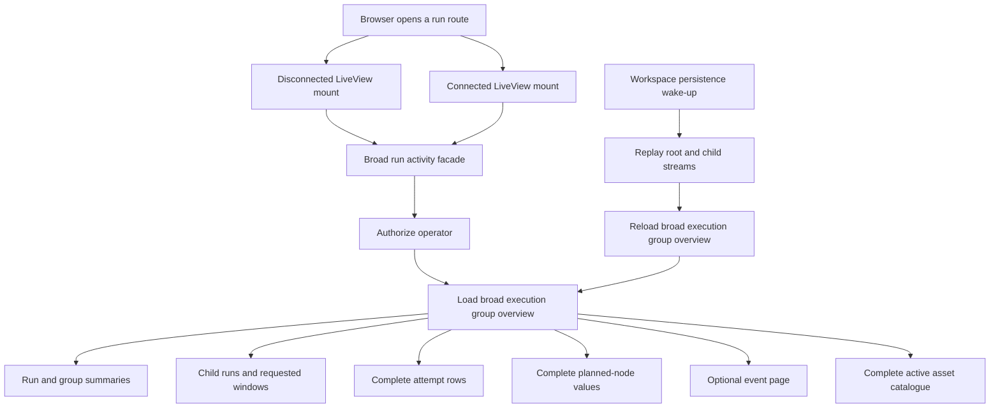
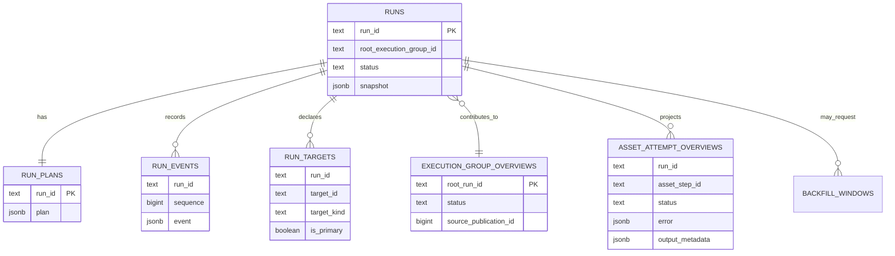
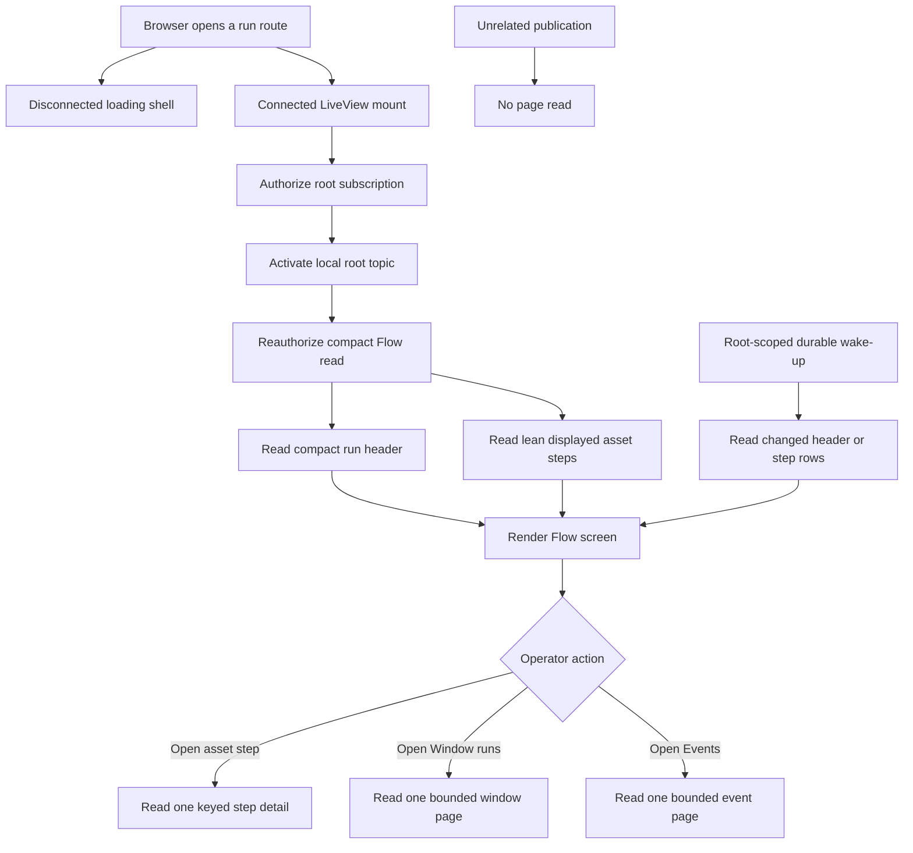
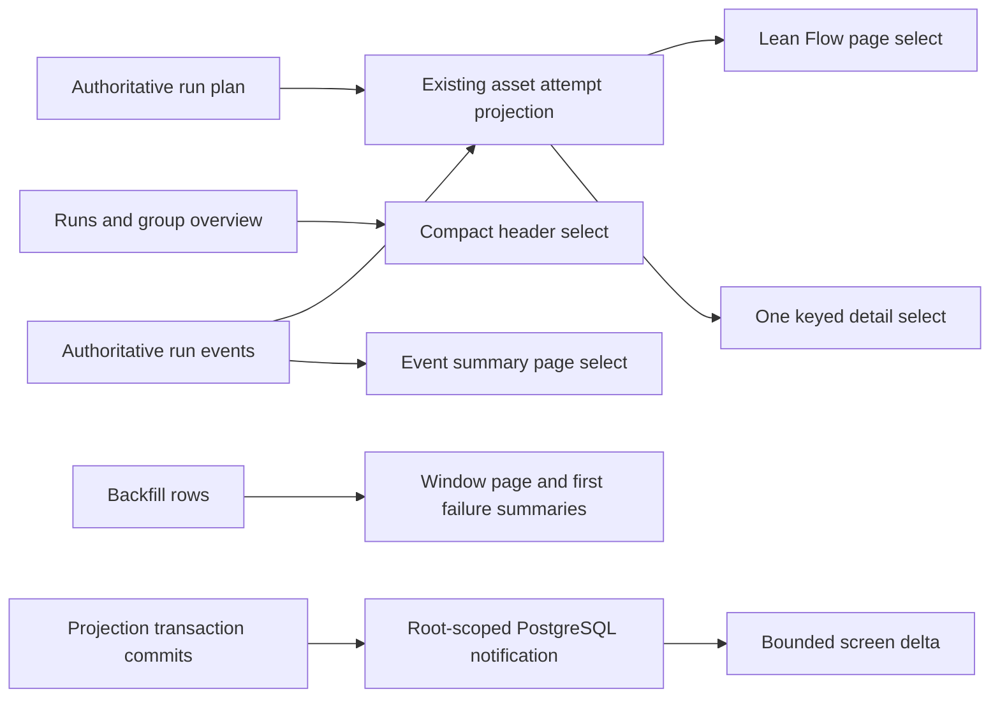

# Change Record: Run Detail Read Performance

| Field | Value |
| --- | --- |
| Status | Implementing |
| Type | Bug fix and cross-application refactor |
| Primary issue | [#658](https://github.com/eirhop/favn/issues/658) |
| Pull request | [#659](https://github.com/eirhop/favn/pull/659) |
| Related work | None |
| Affected areas | Operator run reads in `favn_orchestrator`, PostgreSQL operator-read queries in `favn_storage_postgres`, and `/runs/:run_id` in `favn_view` |
| Approved plan commit | `a588ee304fcb0a7af99f5ef853a48bb12694a904` |
| Last updated | 2026-08-23 |

## One-minute summary

Opening a running pipeline with about 90 assets asks the control plane for a
broad execution-group model instead of the small model rendered by the selected
screen. The initial Flow screen loads child runs, windows, complete attempt
details, planned-node payloads, and a full asset catalogue; disconnected and
connected LiveView mounts can repeat the load, and broad wake-ups can trigger it
again. That makes page cost much larger than the visible UI and spends
PostgreSQL and orchestrator capacity that must remain available for scheduling,
runner coordination, and heartbeats.

This change will replace the broad run-detail read with four bounded operator
use cases: Flow summary, window page, event page, and one keyed asset-step
detail. It will evolve the existing `asset_attempt_overviews` projection in
place so planned and observed steps share one row source, select only fields
rendered by the active screen, load detail only after a click, and refresh only
the affected execution group. It will not create a duplicate table. The change crosses View,
orchestrator, persistence contracts, PostgreSQL queries, and live-update
semantics, so it needs a reviewed change record before implementation.

## Impact

An operator opening a 90-asset running pipeline currently waits while the page
hydrates data for three modes and every attempt drawer. The database can read
large JSONB values and execute a constant but high number of queries before the
operator has requested those details. Every additional viewer and unrelated
persistence publication can repeat that work.

After this change, the default Flow screen will receive one compact run header
and at most 200 lean asset-step rows. Windows, events, and complete attempt
diagnostics will not be read until the operator selects them. Query count will
remain constant as asset or child-run count grows, response size will be bounded,
and an unrelated publication will cause no run-page database read.

The authoritative run lifecycle, scheduling, runner protocol, heartbeat path,
run snapshots, plans, events, and command semantics will not change.

## Problem analysis

The persistence model already separates authoritative run state from derived
operator projections, but the run-detail use case recombines too much of that
model at once:

1. `RunDetailLive` calls one option-driven activity facade for Flow, Windows,
   and Events. Changing modes reloads the same broad base model.
2. `get_operator_run_overview/1` resolves the selected run and then loads the
   execution-group summary, root summary, group runs, requested windows,
   per-run asset counts, attempts, planned nodes, attempt counts, window counts,
   and target references.
3. The attempt query loads complete `asset_attempt_overviews` structs. That
   includes `window`, `error`, and `output_metadata`, although those values are
   used only by an opened detail drawer.
4. Planned steps are returned as complete plan-node JSON values and reduced in
   Elixir, although Flow renders only identity, asset, stage, window, pool, and
   state.
5. The page queries the complete active asset catalogue only to turn one primary
   run target into a back link, even though `run_targets` already stores the
   stable target ID.
6. LiveView performs the data load during mount without excluding the
   disconnected render. A normal LiveView navigation can therefore perform the
   read once for static HTML and again for the connected process.
7. The connected page subscribes to the root and every loaded child run. A
   durable workspace wake-up can replay several streams and then schedule a
   complete broad reload.
8. The one-second Flow clock rebuild is scheduled for an active run even when a
   non-Flow mode is selected.

This is read-boundary drift, not evidence that the authoritative run model is
wrong. The broad domain read was reused as a view DTO, and later compact
projections were placed beneath that DTO without splitting it into
screen-specific contracts.

### Assumptions

- The reported case is an execution group with about 90 planned asset steps and
  no more than the current 200-row initial detail limit.
- The current Flow, Window runs, Events, cancel, retry-remaining, back-link,
  failure, and attempt-drawer capabilities remain available.
- PostgreSQL is the only supported control-plane store.
- `execution_group_overviews` and `asset_attempt_overviews` remain repairable
  projections; `runs`, `run_plans`, and `run_events` remain authoritative.
  `asset_attempt_overviews` may gain planned rows, scalar summary fields, and
  indexes, but it will not become authoritative.
- Large `error` and `output_metadata` values are legitimate detail data. The
  fix is to avoid selecting them for summaries, not to discard them.
- A target ID alone cannot identify one displayed step because an asset can run
  more than once across windows. A detail lookup therefore uses `run_id` plus
  the stable `asset_step_id`; the returned detail includes `target_id` for asset
  navigation.
- Authorization is required on every public read and after every durable
  wake-up. Authorization work is not cached across independent requests.
- 2Ravens and a running local PostgreSQL/Phoenix stack were unavailable during
  planning. Static query counts are lower-bound evidence; runtime baselines must
  be captured before implementation changes the code.
- Protecting the control plane means bounding rows, bytes, query time, refresh
  frequency, and concurrent work. Moving operator reads to a second database or
  adding a cache is not assumed necessary.

### Evidence

| Evidence | What it proves | What it does not prove |
| --- | --- | --- |
| `apps/favn_view/lib/favn_view/run_detail_live.ex` mount, `load_run/5`, and `handle_params/3` | The page loads during mount, uses one broad mode-dependent facade, and reloads the base model on mode changes. | Exact production latency or PostgreSQL buffer usage. |
| `RunDetailLive.detail_from_execution_group/6` and `back_asset_href/2` | The Flow DTO receives attempts, child runs, windows, failures, and optional events, then reads the full active catalogue for one link. | The catalogue size in the reported deployment. |
| `apps/favn_storage_postgres/lib/favn_storage_postgres/operator_reads/store.ex:get_operator_run_overview/1` | The overview composes roughly fifteen store queries before authorization and fallback reads; query count is broad even when Flow alone is visible. | Queries introduced by deployment-specific authentication or telemetry. |
| `compact_attempts/3` calling `Repo.all/1` without a select | Complete attempt rows, including detail JSONB, are materialized for the summary page. | Whether every value is out-of-line TOAST data in the reported database. |
| `add_asset_attempt_overviews_v2.ex` | Each row permits a 64 KiB window, 64 KiB error, and 256 KiB output-metadata payload. Ninety theoretical maximum rows can therefore carry tens of MiB before DTO overhead. | Typical row size in the reported pipeline. |
| `compact_planned_steps/3` | Complete plan-node JSON values are returned to Elixir even though only a few fields are projected. | PostgreSQL CPU cost for the specific 90-node plan. |
| `add_asset_attempt_overviews_v2.ex` and `Projector.project_asset_attempt!/2` | The existing asset-step projection excludes `planned` status and is populated only after attempt-bearing run events, which is why the page falls back to `run_plans`. | The final migration and repair duration. |
| Existing `asset-attempts` projection maintenance | Historical projection rows can already be rebuilt in bounded publication order from authoritative data. | Planned rows until the projector is extended to seed them from `run_plans`. |
| `RunEventRefresh` integration and `subscribed_run_ids/2` | The page subscribes per root/child run and schedules broad refreshes after wake-up or fallback polling. | Cross-node publication rate in production. |
| `assign_flow/1` and `maybe_schedule_flow_tick/1` | Active-run flow geometry can be rebuilt on its clock even when another mode is visible. | Browser render time for the reported machine. |
| Static call-path accounting | A normal disconnected-plus-connected initial Flow load has a lower bound of about 41 page-specific SQL statements and two complete catalogue reads before live-event traffic. | An exact runtime trace; this must be measured in slice 1. |

## Current behavior

The current contract is bounded by row limits, but it is not bounded by the
selected screen. A 200-row limit does not help when every row carries detail
JSONB and several unrelated query families are also executed.

### Current data model

There is no need to add another table for this work. The existing
`asset_attempt_overviews` relation is the intended asset-run read projection,
but it is incomplete before execution starts. The plan will evolve and repair
that relation in place, then remove `run_plans` from the browser read path.

## Approved plan

Adopt one rule for the run route: **one visible screen gets one public use-case
read, and a closed detail panel gets no detail read**.

The disconnected mount will render a loading shell without making a run-detail
call; mandatory session and workspace calls remain. The connected process will
authorize a root subscription, activate it locally, then independently
reauthorize and load the default Flow contract once.
Mode changes will load only the selected mode. Selecting an executed asset step
will issue one keyed detail read; closing or switching modes will not retain
unbounded detail data.

### Public read contracts

The public orchestrator facade will expose stable structs rather than a broad
map whose `view` and `include` options radically change its contents.

| Use case | Required result | Explicitly excluded |
| --- | --- | --- |
| Initial Flow page | Run/root IDs, target label and primary target ID, group status, trigger, start/end, cancel/retry capability, exact progress counts, projection cursor, at most 200 lean step summaries, and the first 10 pre-attempt window failures plus exact failure total | Run snapshot, plan JSONB, event payloads, ordinary child/window rows, complete error, output metadata, complete window JSON, asset catalogue |
| Flow step summary | `run_id`, stable `asset_step_id`, `target_id`, asset ref/display name, status, stage, scalar window label/range fields, start/end, attempt number, and a bounded failure summary only when rendered inline | Complete error, output metadata, runner payloads, logs, physical relation, input generations |
| Window runs page | Exact total plus a keyset page of 50 child/window summaries with ID, state, asset/window label, start/end/duration, total assets, and succeeded/skipped/failed/running/queued/planned counts | Asset-step detail, event payloads, plans, snapshots |
| Events page | A keyset page of 50 event summaries with run ID, sequence, occurrence time, type, asset-step ID when present, and bounded safe summary | Complete event JSON, plans, snapshots, attempts, windows |
| Asset-step detail | One row addressed by authorized workspace, `run_id`, and `asset_step_id`, including complete bounded error and output metadata needed by the drawer | Other attempts, sibling assets, group windows, catalogue |

The facade may return a durable pre-admission submission state instead of Flow
data, preserving the current distinction between an accepted submission and an
admitted run. Missing, forbidden, unavailable, projection-lag, timeout, and
invalid-cursor outcomes remain explicit and have stable UI states.

### PostgreSQL projection and query design

The implementation will evolve `asset_attempt_overviews` in place. It will not
create or rename a table:

- allow the `planned` state in the existing status constraint;
- add nullable, bounded scalar summary columns needed by Flow without decoding
  JSONB: `target_id`, window kind/start/end/timezone, and `failure_summary`;
- cap `failure_summary` at 1,024 encoded bytes and keep existing identifier and
  detail-payload bounds;
- add an initial-page index on workspace/root/stage/asset/window/run/step and a
  delta index on workspace/root/source-publication/run/step;
- when a run's first authoritative event is projected, decode its immutable
  `run_plans` row once and upsert one `planned` row per plan node using
  `AssetStepIdentity.asset_step_id/3`;
- let later attempt events update that same primary-key row under the existing
  publication-order guard; an attempt event without a seed still upserts a
  complete observed row so projection lag cannot lose execution evidence;
- populate scalar window and bounded failure fields in the projector while
  retaining complete bounded `error` and `output_metadata` only for the keyed
  detail read;
- extend the existing bounded `asset-attempts` repair so replaying the first run
  event seeds planned rows before later events update them. Plans plus run events
  remain the rebuild source;
- use one deterministic, versioned `maintenance_jobs` record per workspace for
  `asset_attempts` version 2 readiness. The initial root-resolution statement
  checks that completed marker in the same query; an absent/running/failed marker
  returns the explicit projection state without adding a per-page readiness
  query.

After projection repair, browser reads never select `run_plans.plan`. The Flow
query reads planned and observed rows from one ordered projection using the
cursor `(stage, asset_ref, window_identity, run_id, asset_step_id)`. Exact status
counts are computed in the same statement independently of the 200-row page.
The selected run/root header uses explicit fields from `runs`,
`execution_group_overviews`, `run_targets`, and existing backfill aggregates;
it never selects `runs.snapshot`. The primary target ID comes from
`run_targets`, eliminating the asset-catalogue read.

Window and Event queries use existing authoritative/derived relations with
explicit summary selects and keyset cursors. The Event query selects relational
event columns and a bounded safe summary; it never decodes `run_events.event`.
The asset-step detail query uses the existing `(workspace_id, run_id,
asset_step_id)` index and selects exactly zero or one complete detail.

Every multi-statement screen read runs in one read-only, repeatable-read
transaction and returns the global projection cursor observed in that same
snapshot. PostgreSQL enforces a 750 ms statement timeout and a 1,500 ms
transaction timeout. The View's local composite operation propagates one
monotonic three-second deadline across remote grant authorization/root
resolution, local subscription activation, independent remote read
reauthorization, and storage. It cancels the operation at that deadline and does
not automatically retry. These are initial protective budgets and may be
tightened, but relaxing them requires recorded runtime evidence and plan review.

### Proposed data flow

`B` is the existing `asset_attempt_overviews` table, evolved in place. Planned
rows are a disposable rendering projection, not a second copy of authoritative
run state. A full rebuild deletes/recreates only derived rows from `A` and `C`.

### Read and payload budgets

| Interaction | Facade budget | Store data-query budget | Row and payload budget |
| --- | --- | --- | --- |
| Disconnected mount | Zero run-detail calls | Zero run-detail data queries | Authentication/session setup remains mandatory; run content is a loading shell |
| Connected initial Flow and root subscription | Two remote facade calls and two independent authorization operations: grant, then snapshot | At most four data statements across grant/root resolution and Flow snapshot, independent of asset and child-run count | Header at most 16 KiB; 200 steps at most 1 MiB; 90-step fixture at most 512 KiB; 10 window failures within the same 1 MiB response |
| Select Window runs | One call and one authorization operation | At most two data statements | 50 summaries, exact total, keyset cursor, at most 256 KiB |
| Select Events | One call and one authorization operation | At most two data statements | 50 summaries, 1,024-byte summary each, keyset cursor, at most 256 KiB |
| Open attempt drawer | One call and one authorization operation | One indexed data statement | Exactly zero or one detail; error at most 64 KiB, output metadata at most 256 KiB, total response at most 448 KiB |
| Relevant live delta | One coalesced call and one reauthorization operation | At most two data statements | Only rows newer than the acknowledged projection cursor, capped at 200 and 1 MiB |
| Unrelated publication | Zero run-detail calls | Zero page-owned queries | No socket change |

The budgets count use-case data statements separately from the shared identity
queries so ownership remains clear. Slice 1 will also capture and lock the exact
end-to-end SQL count, including authorization, for the repository's configured
auth mode. No per-asset, per-child-run, or per-event query is permitted.

The initial Flow SQL must have automated evidence that it does not select or
decode `runs.snapshot`, `run_plans.plan`, `run_events.event`,
`asset_attempt_overviews.window`, `error`, or `output_metadata`. A 90-asset page
must not call `active_asset_catalogue/1`.

### Live update design

One connected page subscribes to the resolved root execution group, not to each
member run. Existing durable outbox/publication evidence remains the source of
truth; no event payload is trusted from PubSub and no new persistence table is
introduced.

The initial connection is an explicit local composition owned by
`FavnView.Orchestrator`:

1. a remote facade call reauthorizes the caller, resolves the immutable
   workspace/root identity with one scalar read, and returns a bounded
   non-authoritative subscription grant;
2. the View adapter activates that grant locally in the calling LiveView
   process;
3. a second remote facade call independently reauthorizes the caller and reads
   the repeatable-read Flow snapshot;
4. a read failure deactivates the local subscription before returning the
   error.

A projection committed before local activation is visible in the later
snapshot; a projection committed after activation queues a wake-up. The grant
authorizes wake-ups only and can never authorize or supply a durable read.
Direct `?attempt=` navigation completes this Flow connection first and then
performs one separately authorized keyed detail read.

The existing pre-projection `favn_outbox_published` wake-up remains available to
the projection worker but is no longer consumed by run pages. During the
projection transaction, the projector collects affected
`{workspace_id, root_run_id}` pairs from run and backfill contexts. After it has
written all projections and advanced the global projection cursor, it executes
one bounded `pg_notify` per affected root on a new
`favn_execution_group_projected` channel. PostgreSQL delivers those
notifications only if and after the transaction commits, eliminating a process
crash window between commit and notification.

Every control-plane node's `NotificationListener` listens to that channel,
validates the bounded JSON payload, and broadcasts a node-local root topic with
workspace, root, committed projection cursor, and bounded change classes. Run
events mark header/steps/events; backfill plan/window events mark
header/windows. The change class only narrows the follow-up read and never
supplies display data.

Each screen response carries the global projection cursor read in the same
repeatable-read snapshot as its rows. The LiveView coalesces root wake-ups for
100 ms and calls a reauthorized delta facade:

- a header change reads the compact header and first 10 pre-attempt failures;
- changed `asset_attempt_overviews` rows use the delta index and return current
  lean rows with `source_publication_id` greater than the acknowledged cursor;
- Events reads rows after its durable group event-ID cursor only while Events is
  selected;
- Window runs refreshes its selected keyset page only for a window/member change;
- the socket advances a screen cursor only after every statement in the
  repeatable-read result succeeds;
- a gap, projection lag, or delta truncation performs one bounded reload of the
  active screen, never the old broad overview;
- duplicate or stale notifications at or below the acknowledged cursor are
  ignored.

PostgreSQL notifications may be lost while a listener is disconnected. Listener
restart emits one node-local `persistence_listener_resumed` signal; connected
run pages perform one bounded active-screen reconciliation. While the root
subscription or listener is known unavailable, active runs use a five-second
fallback poll with capped backoff to 30 seconds. Healthy root subscription
cancels that timer, so ordinary unrelated publications cause no page query.

Every durable read reauthorizes. A wake-up is only a hint and cannot grant access
or carry data that bypasses the facade.

### LiveView behavior

- `mount/3` assigns a complete loading state and performs no run-detail read
  until `connected?/1` is true. Existing session introspection and workspace
  assignment remain mandatory on both mount phases.
- One loader owns `{root_run_id, mode, cursor}` so connected mount and
  `handle_params/3` cannot load the same state twice.
- Flow data remains in the socket when opening and closing its attempt drawer,
  but complete detail is dropped when the drawer closes or another step opens.
- Window and Event pages keep only their bounded current page. Returning to Flow
  reuses its current page unless its publication cursor is stale.
- The one-second clock and `RunFlow.build/2` run only while Flow is visible and
  the group is active.
- A detail URL that names a missing or unauthorized step shows an explicit
  drawer error without replacing the successfully loaded Flow page.
- Cancel and retry commands keep existing idempotency and unknown-outcome
  semantics. Their acknowledgement schedules one relevant bounded refresh.

### Contracts and invariants

- `favn_view` uses only the public `FavnOrchestrator` facade and never calls a
  repo, storage adapter, scheduler, runner, projector, or catalogue internal.
- Every query is scoped by the reauthorized workspace before run identity,
  target identity, or detail is returned.
- Per-interaction query count is constant with respect to assets, child runs,
  and events. Aggregate load still grows with connected viewers and is covered
  by concurrency qualification.
- Every collection has a hard maximum, deterministic ordering, and keyset
  cursor. Truncation is visible and can be continued by the user.
- Summary reads never select complete detail payloads. Detail reads never select
  sibling rows.
- `run_id` plus `asset_step_id`, not target ID alone, identifies an attempt
  drawer. This preserves correctness for repeated assets and windows.
- Authoritative run state and derived projections keep current publication
  ordering, repair, and lag semantics.
- A PubSub message is a wake-up only. Missed messages recover from durable
  cursors; duplicate messages are harmless; stale results cannot overwrite a
  newer socket cursor.
- Read timeout or projection failure is shown honestly. The View does not loop,
  hide the failure behind stale data, or retry without a bounded schedule.
- Cancel, retry, persistence writes, materialization, leases, fencing, and
  possibly completed side effects are unchanged and never blindly retried.
- Logs, telemetry, and errors exclude plan/event/error/output payloads and
  customer data.

### Scope

- Split the broad run-detail facade and persistence DTO into screen-specific
  public contracts.
- Evolve `asset_attempt_overviews` in place to represent planned and observed
  step summaries, add exact initial/delta indexes, and repair it from plans plus
  events.
- Add explicit lean SQL selects and keyed detail queries over existing tables.
- Remove the run-detail asset-catalogue lookup.
- Make disconnected mount free of run-detail calls and make mode loading lazy;
  preserve mandatory session/workspace reads.
- Replace per-child subscriptions and broad reloads with one root-scoped,
  cursor-based refresh path.
- Stop Flow clock/render work outside Flow mode.
- Add query-count, selected-column, row-limit, payload-size, refresh, and
  concurrency regression tests.
- Update canonical View, orchestrator, PostgreSQL data-model, and operator-read
  documentation with the implemented contracts.

### Non-goals

- Creating a second run, asset-run, attempt-detail, event, or cache table.
- Renaming `asset_attempt_overviews` or copying it into a replacement table.
- Changing the run list beyond proving it continues to use compact execution
  group summaries.
- Changing planner, scheduler, runner heartbeat, lease, task, materialization,
  cancellation, retry, or recovery behavior.
- Adding a generic GraphQL/data-loader layer, distributed cache, read replica,
  or second Repo pool.
- Loading every row for execution groups above the page limit.
- Adding retry history that the current projection does not preserve.
- Redesigning the visual layout or removing operator-visible capabilities.

### Implementation slices

| Slice | Outcome | Owner or area | Depends on |
| --- | --- | --- | --- |
| 1 | Capture the real 90-asset call graph, SQL count, selected columns, bytes, timings, EXPLAIN plans, and concurrent-view baseline; turn budgets into failing tests | PostgreSQL test fixture, telemetry, and View integration harness | Current `origin/main` behavior |
| 2 | Add an expand-only migration for planned/scalar fields and initial/delta indexes on the existing `asset_attempt_overviews` table | `favn_storage_postgres` migrations and schema authority | Slice 1 evidence |
| 3 | Seed planned rows, update them from observed events, and extend bounded projection repair/parity verification | PostgreSQL projector and maintenance | Slice 2 |
| 4 | Add lean Flow header/step, keyed detail, Window, Event, and delta query/result contracts over the repaired projection and existing tables | `favn_orchestrator` persistence behavior and `favn_storage_postgres` operator reads | Slices 2–3 |
| 5 | Expose small public facade structs with authorization, limits, cursors, total deadlines, subscription activation, and explicit failure shapes; remove the broad run activity contract after callers move | Public orchestrator facade and run read model | Slice 4 |
| 6 | Make connected Flow load once, lazily load modes and drawer detail, and stop off-screen Flow ticks | `favn_view` LiveView and page components | Slice 5 |
| 7 | Emit post-projection transactional root notifications and add bounded delta refresh with gap/reconnect recovery and fallback polling | PostgreSQL projector/listener, orchestrator events, and View refresh helper | Slices 3–6 |
| 8 | Qualify migration/repair, 90/200-asset, backfill, event-burst, projection-lag, authorization, and concurrent-view behavior; update canonical docs and record actual evidence | Storage, orchestrator, View, production-shaped test harness, docs | All prior slices |

Each slice must leave focused tests passing. Slice 2 cannot add a storage table,
and slice 6 cannot reach around the public facade to meet the budget.

### Implementation map

| Concept | Expected code area | Responsibility |
| --- | --- | --- |
| Public use-case API | `apps/favn_orchestrator/lib/favn_orchestrator.ex` and small operator-run modules | Authorize once per call and return stable, bounded, browser-safe structs. |
| Persistence contracts | `apps/favn_orchestrator/lib/favn_orchestrator/persistence/` | Define exact query inputs, results, cursor, limit, timeout, and failure shapes. |
| Asset-step projection | `apps/favn_storage_postgres/lib/favn_storage_postgres/migrations/`, `schemas/`, `projections/projector.ex`, and projection maintenance | Evolve one existing table, seed canonical planned identities, apply observed events, and repair deterministically. |
| Lean SQL | `apps/favn_storage_postgres/lib/favn_storage_postgres/operator_reads/store.ex` or focused sibling modules | Select only visible fields from existing relations with constant statement count and one consistent snapshot. |
| Durable publication scope | PostgreSQL projector transaction, notification listener, and orchestrator event facade | Emit transactional root-scoped projection wake-ups and activate authorized root subscriptions. |
| Page loading | `apps/favn_view/lib/favn_view/run_detail_live.ex` | Own connected loading, mode state, detail state, cursors, and bounded refresh. |
| UI projection | `FavnView.RunFlow` and run-detail components | Build only the active visual model from lean summaries and render explicit loading/error/truncation states. |
| Verification fixture | `apps/favn_test_support` and owning app tests | Provide deterministic 90- and 200-asset execution groups with bounded and large detail payloads. |
| Canonical docs | `docs/structure/favn_view.md`, `docs/structure/favn_orchestrator.md`, `docs/structure/favn_storage_postgres.md`, and `docs/storage/postgresql/data-model.md` | Document the final current behavior once implementation makes it true. |

## Operational design

### Failures and recovery

- Authorization failure returns the existing forbidden/session outcome and
  subscribes to nothing.
- A missing run may resolve to the durable submission contract. A genuinely
  missing identity remains distinct from storage unavailability.
- Statement, transaction, or total-deadline expiry returns
  `:operator_read_timeout` through a bounded public error; LiveView shows a retry
  action and performs no automatic immediate retry.
- Projection lag returns a named temporary state. The UI may wait for a relevant
  wake-up or the bounded fallback poll, but it never reconstructs a full run
  from snapshots as a fallback.
- A delta gap, restart, or reconnect reloads only the active screen from its
  durable current projection. Duplicate or out-of-order wake-ups are ignored by
  publication cursor.
- If root-scoped wake-up activation fails, one fallback timer is owned by the
  socket. It backs off and is cancelled on recovery or termination.
- Projection repair is bounded, cursor-resumable, idempotent, and publication
  ordered. A failure records existing projection-failure/maintenance evidence;
  the new read returns `:projection_rebuilding` or `:projection_unavailable` and
  never falls back to plans or snapshots.
- Rollback first disables the new View/read contract, deletes only derived
  `planned` rows, restores the old status constraint, and drops added scalar
  columns/indexes before the prior application reads the table. Authoritative
  plans and events are unchanged, so the projection remains repairable.

Reads have no unknown write outcome. Cancel and retry commands retain their
existing idempotency keys and explicit partial/unknown outcomes.

### Logs and diagnostics

| Event or state | Level or surface | Safe fields | Rate limit |
| --- | --- | --- | --- |
| Operator read completed | Telemetry | Use-case name, query count, row count, encoded bytes, query/queue/total duration, cache-free refresh reason | Every call; metrics aggregation owns cardinality |
| Budget exceeded | Warning log and telemetry | Use-case, bounded reason, configured budget, observed count/bytes/duration | First and every 100th per node/use case |
| Operator read timeout | Warning log and telemetry | Use-case, statement/transaction/three-second total budget, query class, retryable flag | First and periodic |
| Delta gap or truncation | Info telemetry and debug log | Use-case, cursor relation, bounded row count, recovery action | Every recovery, log rate-limited |
| Subscription fallback active | Warning log and diagnostics | Root-scoped subscription state, poll delay, safe failure class | On transition and periodic |
| LiveView performance | Telemetry | Mode, mount kind, render duration, diff bytes, step count | Every relevant render |

Do not record workspace/run/asset names, plan or event contents, SQL parameters,
errors, output metadata, credentials, private paths, or arbitrary exceptions.
Stable internal IDs may be correlated only where existing telemetry policy
permits them.

### Deployment, migration, and compatibility

The migration changes only the existing derived `asset_attempt_overviews`
relation. It adds nullable scalar columns, replaces the status check to include
`planned`, adds two concurrent/online-safe indexes using the repository's
supported migration pattern, and leaves authoritative tables untouched. No
table is copied, renamed, or introduced.

Rollout order is explicit:

1. capture baseline and verify sufficient index-build/repair capacity;
2. apply the expand-only schema migration while no planned rows are yet written;
3. deploy one application version containing the new projector, read contracts,
   and an explicit `projection_rebuilding` UI state;
4. run/resume the bounded `asset-attempts` maintenance job for every workspace;
5. verify plan-node count, canonical identity, latest observed status, scalar
   fields, source publication, and zero projection failures against sampled and
   aggregate authoritative evidence;
6. complete the deterministic version-2 `maintenance_jobs` marker for each
   workspace; the root-resolution query then enables the new read for that
   workspace. Until readiness, it fails explicitly rather than using the broad
   path;
7. remove the old broad facade and old workspace wake-up consumption after all
   View callers use the new contract.

The current deployment contract does not support a multinode control plane, so
the projector/read activation is a single-version operation. If deployment
topology changes before implementation, mixed-version behavior requires plan
re-review. Projection repair runs in bounded batches under the existing
maintenance ownership/fencing model and yields between batches; resident
scheduling and runner coordination continue. Repair rate is reduced or paused
when Repo queue telemetry exceeds the documented threshold.

The public orchestrator facade change is intentionally breaking inside this
private pre-v1 repository. View, facade, persistence behavior, PostgreSQL store,
and tests move in the same release.

Rollback order is contract-before-code: disable the new View/read activation,
stop the new planned-row writer, delete `status = 'planned'` rows in bounded
batches, restore the previous constraint, drop added indexes/columns, verify the
old projection contract, then deploy the prior application. This removes only
derived data and does not alter plans, events, snapshots, or run outcomes.
Rollback restores the original load risk, so operator query pressure is watched
throughout.

## Verification plan

| Acceptance criterion | Planned evidence | Owning layer |
| --- | --- | --- |
| Static HTML mount performs no run-detail read while preserving auth | LiveView test separates mandatory session/workspace calls from zero run-detail calls on disconnected mount | View and auth boundary |
| Initial connected Flow uses one grant call, one snapshot call, and constant SQL count | Adapter/facade call counters plus SQL-sandbox/telemetry assertions for 1, 90, and 200 assets, including two configured authorization operations | View, orchestrator, PostgreSQL |
| Flow excludes heavy and unrelated data | Query-shape test/asserted selected columns plus result-struct test rejecting snapshot, plan, event, window JSON, error, and output metadata fields | PostgreSQL and persistence contract |
| Flow responses honor absolute payload bounds | Deterministic 90-row result at most 512 KiB and maximum 200-row result at most 1 MiB, including maximum bounded identifiers/summaries | Orchestrator |
| Existing projection represents planned and observed rows exactly once | Migration, new-run projection, direct, repeated asset, multi-window, skipped, retrying, terminal, and event-without-seed cases | Orchestrator and PostgreSQL |
| Historical projection repair is safe and complete | Empty/partial/full reruns, interruption/resume, concurrent projector, publication ordering, failure evidence, plan-node/status/count parity, and per-workspace readiness tests | PostgreSQL maintenance |
| Asset back link needs no catalogue read | Facade spy plus primary `run_targets.target_id` cases | View and PostgreSQL |
| Window mode loads only one 50-row keyset page | Query count, forbidden-field, ordering, next-cursor, exact-total, asset-total, and all outcome-count tests | Orchestrator and PostgreSQL |
| Event mode loads only one 50-row summary page | Query count, event-payload exclusion, ordering, and cursor tests | Orchestrator and PostgreSQL |
| Opening a drawer performs one keyed read and returns no siblings | Authorization, direct `?attempt=` navigation, index/query-plan, missing, forbidden, 448 KiB bound, full-detail, and close/drop tests | View, orchestrator, PostgreSQL |
| Flow preserves pre-attempt window failure evidence without loading windows | Exact total plus first 10 bounded summaries, forbidden full error/window columns, and truncation behavior | View, orchestrator, PostgreSQL |
| Unrelated publication performs no page query | Multi-group LiveView test with store call counters | Events and View |
| Relevant notification exists only after projection commit | Transaction rollback/commit test around `pg_notify`, run/backfill root mapping, payload validation, and cross-listener local broadcast | PostgreSQL and Events |
| Relevant burst is coalesced and delta-bounded | Publication burst, duplicate, stale, consistent-snapshot cursor, gap, truncation, listener restart, and fallback-poll tests | Events, orchestrator, View |
| Flow CPU work stops outside Flow mode | Clock/ref cancellation and `RunFlow.build/2` call-count tests | View |
| Operator load does not starve control-plane duties | Production-shaped PostgreSQL run with 20 concurrent 90-asset page opens; no missed heartbeat/lease transition, no Repo checkout error, and scheduler/heartbeat p95 latency no more than 10% or 25 ms above the no-UI-load baseline, whichever allowance is larger | Acceptance/slow qualification |
| Performance target is met | Warm-cache and cold-cache samples: Flow facade p95 at most 250 ms, DB queue p95 at most 50 ms, and connected page usable within 1 second in the documented local production-shaped environment | Runtime qualification |
| No duplicate table was added | Migration up/down, exact-schema authority, unchanged table inventory, new constraints/indexes, and bounded planned-row cleanup | PostgreSQL |
| Canonical docs describe final contracts | Link/render review and duplicate-contract review | Documentation |

Source and static inspection run first. Focused storage, orchestrator, and View
tests run from their owning apps. The normal repository format, compile,
test-tier guard, fast suite, relevant slow/acceptance tests, and PostgreSQL
production-shaped qualification run before final review. Runtime results will
state hardware, database size, cache state, concurrency, sample count, and every
unverified environment rather than presenting local timing as a universal SLO.

## Risks and open questions

| Risk or question | Impact | Mitigation or decision needed |
| --- | --- | --- |
| Projection seeding increases work on a run's first projected event | Projector batches could take longer for very large plans. | Keep the existing 250-publication batch but bound seeded nodes per run to the supported plan maximum, measure transaction time, and reduce batch size when needed without splitting one run's atomic seed. |
| Planned and observed identity encodings diverge | A step could appear twice or lose its detail link. | Use `AssetStepIdentity.asset_step_id/3` for both seed and runtime events and add parity cases for repeated/windowed nodes. |
| Exact progress counts are derived from a bounded page | A group above 200 steps could show page counts as totals. | Compute exact aggregates in the same bounded query family or a second aggregate statement; never infer totals from a truncated page. |
| Projection migration/repair is incomplete when reads activate | Historical runs could omit planned steps or report wrong totals. | Record version readiness in existing projection/maintenance metadata, gate the new read fail-closed, and require parity verification before activation. |
| Transactional root notification payload is invalid or too large | Affected pages could miss a prompt wake-up. | Emit one bounded payload per root with validated IDs/change classes, reject oversize payloads before commit, and retain listener-resume reconciliation. |
| Root-scoped notification is lost while no listener is connected | A live page can become stale. | Broadcast listener-resumed state and perform one bounded reconciliation; poll only while listener health is unavailable. |
| A bounded failure summary loses diagnostic detail | Flow may show a generic or shortened reason. | Store a safe 1,024-byte summary for the inline row and load the complete bounded error only in the keyed drawer. |
| Removing disconnected data harms first static paint | The shell contains no run content until WebSocket connection. | This is an authenticated operator UI; test loading, reconnect, and no-JS behavior and document the deliberate tradeoff. |
| Query count improves while LiveView DOM diff remains expensive | The page can still feel slow with 200 lanes. | Measure render/diff bytes separately, preserve stable DOM IDs, and optimize Flow computation without broadening data reads. |
| Twenty concurrent viewers still contend with scheduler/heartbeat database work | Control-plane safety goal would not be achieved by query shaping alone. | Enforce timeouts and bounded queries now; if queue isolation is still required, create a separate issue/change record rather than hiding it in this refactor. |
| A rolling restart receives old workspace-wide wake-ups | New pages could refresh too often during transition. | Ignore old broad wake-ups or map them to bounded active-screen reconciliation; never call the removed overview. |

The performance thresholds are acceptance targets, not claims about current
behavior. Slice 1 records the baseline and environment before changes. A target
that is impossible for environmental reasons requires an explicit plan
deviation and independent review, not silent relaxation.

## Plan review

| Field | Result |
| --- | --- |
| Reviewer | Independent agent `issue_658_plan_review` |
| Reviewed against | Issue #658, current code, persistence model, static query evidence, and this plan |
| Findings | Initial review rejected the no-migration plan and found missing post-commit wake-up ownership, a false disconnected-auth budget, incomplete payload/deadline contracts, omitted Window/failure fields, and undefined cross-source identity/pagination. |
| Findings addressed and rechecked | Yes. The record now evolves the existing projection, defines transactional root wake-ups and consistent cursors, separates mandatory auth from run-detail budgets, bounds every response/deadline, preserves rendered fields, and uses a two-call grant/activate/snapshot sequence. The reviewer rechecked all corrections. |
| Verdict | Approved. No blocking findings remain. |

After independent approval, the reviewed planning commit becomes the immutable
baseline. Implementation outcome, deviations, verification evidence, and final
review sections will be appended during implementation without rewriting this
approved plan.
