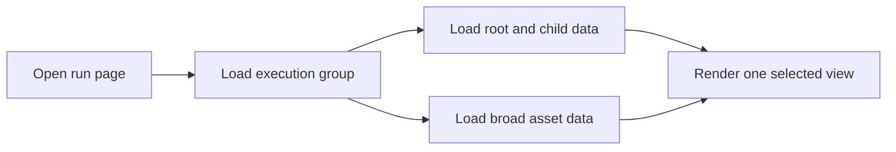
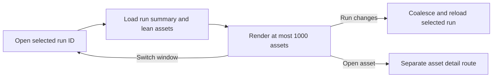
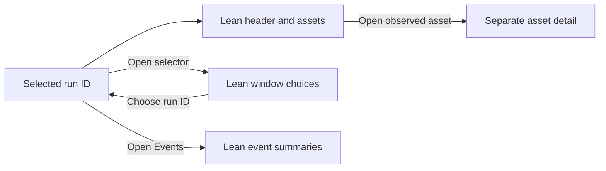

# Change Record: Simple run detail reads

| Field | Value |
| --- | --- |
| Status | Implemented |
| Type | Refactor |
| Primary issue | [#658](https://github.com/eirhop/favn/issues/658) |
| Pull request | [#660](https://github.com/eirhop/favn/pull/660) |
| Related work | [Draft PR #659](https://github.com/eirhop/favn/pull/659), which this simpler approach replaces |
| Affected areas | Run detail UI, orchestrator operator reads, PostgreSQL operator reads |
| Approved plan commit | [`0f053c43`](https://github.com/eirhop/favn/commit/0f053c43) |
| Last updated | 2026-08-24 |

## One-minute summary

Opening a run previously loaded a broad execution-group view with much more data
than the page showed. The replacement loads one selected run, at most 1,000
lean asset rows, and full asset details only on a separate route. Window changes
navigate to another run ID and repeat the same small read. This record is needed
because the change crosses the View, orchestrator, and PostgreSQL boundaries.

## Impact

A monthly window run with 90 assets, or a larger run with several hundred assets,
should open without reading sibling-run assets, complete error payloads, output
metadata, event payloads, or the full asset catalogue. This reduces work on the
control plane that also schedules runs and serves runner heartbeats.

## Problem analysis

The run detail page uses a broad operator execution-group read that describes a
root run and its children. It then reshapes that large response for one selected
screen. This makes the UI depend on data it does not display and causes broad
reloads while a run is active.

Static repository caller inspection shows that the public run-activity entry
point is used by `RunDetailLive`, not by the scheduler or planner. Its overview
projection is UI-only, while its group-run and group-window paging helpers also
serve the separate execution-group operator API. The UI-only stack will be
deleted; shared paging helpers and persisted projection writers will remain.
Orchestration decisions and lifecycle behavior must remain unchanged.

The issue's earlier scale direction proposed asset paging and an asset drawer.
Product review of that prototype replaced both choices with the simpler 1,000-row
bound and a separate asset detail route recorded here. Issue #658 now reflects
this decision.

### Assumptions

- Every windowed pipeline run has its own run ID.
- The page shows one run ID, and therefore one window, at a time.
- A selected run normally has fewer than 1,000 assets.
- UI updates may be coalesced and appear within about one second.
- Window choices are loaded only when the operator opens the selector.
- An exact-run read from the persisted plan and attempt projection will be fast
  enough. This must be measured before adding a migration or changing projection
  writes.

### Evidence

| Evidence | What it proves |
| --- | --- |
| `RunDetailLive` calls the operator run activity read with a 200-row limit | The initial page still enters through the broad read contract. |
| The PostgreSQL activity read loads attempted and planned steps by root run ID | The query can include sibling runs and plan data the selected run does not need. |
| The public run-activity entry point has no repository production caller outside `RunDetailLive` | The UI-specific broad facade can be removed after the page migrates, subject to a transitive caller check. |
| Asset attempt rows already have stable run and asset-step IDs | A separate asset detail route can use a direct keyed lookup. |

## Current behavior

## Approved plan

The View will use one orchestrator-owned run-view contract. The orchestrator will
authorize the request and perform a small fixed number of exact-run queries.

### Contracts and invariants

- The initial read is scoped by workspace and exact run ID.
- The run summary contains only the state, timing, target, window, and aggregate
  counts shown by the page.
- Each asset row contains only its stable ID, display name, state, start time,
  and end time. IDs remain within the stored 255-byte limit; display names are
  safely truncated to 256 bytes at the public boundary.
- The planned and observed list queries each return at most 1,001 candidates.
  The merged result renders at most 1,000 and uses the extra candidate only to
  detect and clearly report overflow.
- Planned assets come from the selected run's persisted plan. Observed state
  comes from the selected run's attempt projection. A planned row derives its
  canonical ID from run ID, decoded node key, and asset reference. Observed state
  replaces a matching planned row; an observed row absent from the plan is still
  shown.
- Rows are ordered by normalized asset reference and canonical asset-step ID
  before the 1,000-row cut. Aggregate counts cover the complete selected run and
  remain exact when the visible list overflows.
- Both sources use that same total order before their 1,001-row cap. Planned IDs
  are derived before the cap is applied, so repeated references and node-key
  identities cannot change which merged rows appear.
- A planned row without an observed attempt is visible but not linked to asset
  run details because no asset run detail exists yet.
- Opening the window selector performs a separate bounded read of lean sibling
  windows: run ID, start, and end only. The orchestrator resolves and authorizes
  the root, storage returns only rows with a run ID, and choices are newest first
  with a 1,001-row overflow probe. The selected window remains labeled even when
  it falls outside the newest 1,000 choices.
- Window overflow shows a notice that only the newest 1,000 choices are listed.
  Older runs remain reachable by their direct run URL; adding selector search or
  paging is future work.
- Switching windows performs full navigation to the sibling run ID. The old
  LiveView is not required to preserve or reconcile state across windows.
- Disconnected mount performs no run read. Connected mount authorizes and
  activates only the selected run subscription before the first read.
- This page's subscription listens only to the selected run topic; it does not
  join the current global persistence topic. Unrelated run or workspace
  publications perform no read.
- Each reload is reauthorized, at most one reload is in flight, and bursts
  coalesce to at most one reload per second. A reconnect or durable sequence gap
  performs one full selected-screen reload.
- While the visible run is active, a five-second fallback reload protects
  against a commit whose final notification was lost. It stops after the page
  observes a terminal run. No fallback Flow read runs behind Windows or Events.
- Full navigation unsubscribes the prior run. Flow does not reload while the
  operator is viewing Windows or Events; only the visible screen reloads.
- Full error, output, and execution detail is queried by run ID and asset-step ID
  only on the separate asset detail route.
- Reserved run IDs that are still queued or preparing keep the existing
  submission state. Existing cancellation and retry controls keep their current
  authoritative targets and authorization.
- Initial, refresh, window-choice, and asset-detail reads authorize independently.
- The summary, complete counts, planned candidates, and observed candidates are
  read atomically in one read-only repeatable-read transaction. A failure returns
  no partial result. The transaction has a two-second timeout and every statement
  has a one-second timeout.
- The View calls only the public orchestrator facade. It never queries storage.
- The UI-specific overview query, result, normalizer, converter, callback, and
  tests are removed after Flow, Windows, and Events use their exact readers.
- `GetExecutionGroup`, `get_execution_group/1`, `page_group_runs/1`,
  `page_group_windows/1`, their public execution-group facade, and their tests
  remain unchanged because they form a separate operator contract.
- Persisted run, plan, event, attempt, execution-group, and backfill tables and
  their projection writers remain unchanged. This PR adds no projection or
  migration.
- A newly discovered orchestration/lifecycle caller or shared-query rewrite is
  outside this amendment and requires a separately approved deviation.
- No duplicate table, asset paging, cursor, delta, retained-range, drawer, or
  prefix-filter contract is introduced.

### Scope

- Replace the run Flow page's broad activity read with the exact-run view.
- Remove the superseded broad run-activity/detail facade and its UI-only
  overview/event read-model branches after Flow, Windows, and Events migrate to
  exact-run contracts.
- Add the lean window selector and full navigation between window run IDs.
- Replace the asset drawer with a separate detail route.
- Keep Windows and Events data lazy: they load only when their own screen is
  selected.
- Reuse the lean contracts elsewhere only when another screen needs exactly the
  same fields. Do not force unrelated screens onto this model.

### Non-goals

- Browsing more than 1,000 assets in this PR.
- Live-updating the open window list.
- Adding a new source-of-truth or projection table.
- Changing planning, scheduling, runner heartbeat, admission, retry,
  cancellation, run execution, shared execution-group reads, or projection
  writes.
- Refactoring unrelated operator pages without measured evidence.

### Implementation slices

| Slice | Outcome | Owner or area |
| --- | --- | --- |
| 1 | Exact-run summary and lean asset read with a 1,000-row display cap | Orchestrator and PostgreSQL |
| 2 | Remove the superseded UI-only overview/event stack while retaining shared execution-group reads and all projection writers | Orchestrator and PostgreSQL |
| 3 | Run page uses the new contract and coalesces refreshes | View |
| 4 | Lazy lean window choices navigate to another run ID | Orchestrator, PostgreSQL, and View |
| 5 | Asset selection navigates to a keyed detail page; drawer code is removed | Orchestrator, PostgreSQL, and View |
| 6 | Events uses an exact selected-run event summary read instead of the execution group | Orchestrator, PostgreSQL, and View |
| 7 | Measure query count, selected columns, response size, orchestration regression behavior, and 1,000-asset behavior | Tests and PostgreSQL qualification |

### Legacy inventory

| Action | Exact baseline entities |
| --- | --- |
| Delete or replace | `FavnOrchestrator.get_operator_run_activity/3`, `get_operator_run_detail/3`, `OperatorRunActivity`, `RunReadModel.get_operator_run_detail/3`, its overview/event loaders and exclusive private converters, `GetOperatorRunOverview`, `OperatorRunOverview`, `OperatorRunOverviewNormalizer`, the `OperatorReadStore.get_operator_run_overview/1` callback, the PostgreSQL implementation and its exclusive private helpers, and their dedicated tests |
| Retain | `GetExecutionGroup`, `get_execution_group/1`, `page_group_runs/1`, `page_group_windows/1`, `get_execution_group_detail/3`, run/event/attempt/backfill schemas, every projector and projection writer, and their tests |
| Replace in tests/fixtures | Existing run-detail tests and design-system fixtures move to the exact Flow, window, event, and keyed-detail public shapes; obsolete overview-normalizer tests are deleted |

### Complexity budget

These are rough Git additions and deletions, not targets to fill. Production and
supporting files are shown separately so tests cannot hide production complexity.
Supporting files are tests, fixtures, examples, and canonical documentation. The
change record itself, generated files, dependency locks, and formatter-only
changes are excluded.

| Slice | Production added | Production deleted | Supporting added | Supporting deleted | Main reason for the size |
| --- | ---: | ---: | ---: | ---: | --- |
| Exact-run read contract and PostgreSQL queries | 450-750 | 0-100 | 400-700 | 0-150 | Public shapes, authorization, deterministic merge, summary, submission state, and storage tests |
| Legacy broad-read removal | 0-80 | 1,500-2,300 | 100-250 | 550-900 | Delete the 619-line normalizer, its 398-line dedicated test, group-shaped query/result/converter code, and obsolete integration cases without touching shared projections |
| Run page and coalesced refresh | 220-350 | 120-250 | 220-400 | 50-150 | Zero disconnected reads, exact subscription lifecycle, refresh coalescing, and active-screen loading |
| Lazy window switching | 120-220 | 0-80 | 120-220 | 0-80 | Authorized bounded window query, selector state, overflow, and full navigation |
| Separate asset detail route | 130-230 | 160-300 | 130-230 | 100-250 | Keyed read, route, page states, and all drawer removal |
| Exact lazy event read | 80-160 | 0-80 | 100-200 | 0-80 | Bounded selected-run event fields and removal of the group-event loader |
| Performance proof and shared documentation | 0-50 | 0 | 300-500 | 0-50 | Query-plan, payload, queue, rendering, concurrency, and related-contract checks |
| **Expected total** | **1,000-1,840** | **1,780-3,110** | **1,370-2,500** | **700-1,660** | Additions stay bounded while deletion of the replaced stack makes the production diff net smaller |

Before final review, the outcome will show actual additions and deletions for
each slice. Any category above its upper estimate by more than 25 percent or 100
lines, whichever is smaller, requires a plain-language explanation and review as
possible scope creep. Materially fewer deletions also require explanation because
the replaced path may still exist. A projection migration would be outside this
budget and must be approved as a plan deviation first.

If one file serves several slices, each diff hunk is assigned once to the slice
whose behavior it implements. Subscription changes belong to the run-page slice;
all drawer removal belongs to the asset-detail slice. Deletions from the old
Flow read belong to the legacy-cleanup slice only when they are not already part
of the run-page or asset-detail replacement.

### Implementation map

| Area | Responsibility |
| --- | --- |
| `favn_orchestrator` | Authorization, bounded public result shapes, read budgets, caller inventory, and removal of superseded read-model code |
| `favn_storage_postgres` | Exact-run queries, removal or tightening of superseded callbacks and helpers, and indexes only when measurements require them |
| `favn_view` | Route selection, one-second refresh coalescing, and rendering |

## Operational design

The page keeps its existing content if a live refresh fails and shows a retryable
error. A first-load failure renders the normal page error state. Missing runs or
asset steps render not found. Queries use a bounded timeout and never retry
silently.

The orchestrator contract must be deployed before the View that calls it, or both
must ship in one coordinated release. Rollback removes the new View first and the
orchestrator contract second. There is no database rollout step unless a reviewed
deviation adds one.

This plan starts without a schema or projection-write change. If the measured
exact-run plan query misses its budget, any migration or projection change is a
plan deviation that must be explained and reviewed before implementation.

### Performance budgets

The values below are acceptance limits for local PostgreSQL qualification, not
production promises. Statement counts include subscription authorization and
read authorization because those queries also load the control plane.

| Read | Maximum work and payload | Timing acceptance |
| --- | --- | --- |
| Connected open at 90, 1,000, and 1,001 assets | At most 12 total Repo statements: authorize and resolve the exact subscription, then reauthorize and execute at most four read statements in one snapshot; at most 1,001 lean candidates from each source; at most 1,000 public rows and 1 MiB encoded | Each data statement warm p95 at most 50 ms and first observation at most 250 ms; complete open at most 2 s |
| Selected-run refresh | At most 8 total Repo statements including reauthorization and the four-statement snapshot; at most 1 MiB encoded | Complete refresh at most 2 s; at most one in flight and one started per second |
| Window choices | At most 6 total Repo statements including reauthorization; at most 1,001 rows containing only run ID, start, and end; at most 512 KiB encoded | Data statements warm p95 at most 50 ms and first observation at most 250 ms; facade at most 1 s |
| Asset run detail | At most 6 total Repo statements including reauthorization; one exact observed asset; existing stored error, window, and output limits remain; at most 512 KiB encoded | Data statements warm p95 at most 50 ms and first observation at most 250 ms; facade at most 1 s |
| Exact selected-run events | At most 6 total Repo statements including authorization and summary; at most 200 rows with only sequence, time, event type, state, asset label, and summary; at most 512 KiB encoded | Data statements warm p95 at most 50 ms and first observation at most 250 ms; facade at most 1 s |
| Database plans | No sibling-run scan; selected-run list plans together touch at most 5,000 buffers; window choices touch at most 2,500 buffers | No statement exceeds its one-second database deadline |
| Connected page | At most one refresh in flight and one refresh per second; connected diff at most 1 MiB | Server render at most 150 ms for 1,000 rows |
| Concurrent viewers | 20 viewers opening or refreshing the same 1,000-asset run while heartbeat and scheduler-style control reads continue | No timeout; database queue-time p95 at most 100 ms; every facade call finishes within 2 s; heartbeat and scheduler probe p95 stays below 100 ms and no more than twice its idle baseline |

## Verification plan

| Acceptance criterion | Planned evidence |
| --- | --- |
| Initial load reads only the selected run | Storage integration test with sibling window runs |
| The broad UI read is actually removed | Repository-wide production caller inventory before migration and an after-migration check proving its facade, unused read-model branches, storage callbacks, queries, tests, and fixtures are gone rather than duplicated |
| Orchestration behavior does not regress | Existing owning-boundary suites for planning, scheduling, admission, retry, timeout, cancellation, submissions, and projection writes pass unchanged; no production caller is moved onto a UI read |
| Shared execution-group reads are unchanged | Diff and caller checks show the retained query structs, callbacks, public facade, paging helpers, schemas, and projection writers were not rewritten |
| At most 1,000 lean assets are rendered | Storage and LiveView tests at 0, 90, 1,000, and 1,001 assets |
| Full asset data is lazy and separately routed | LiveView navigation test and keyed storage test |
| Window switch loads the new run without retained state | LiveView test across two sibling run IDs |
| Notifications cannot cause unbounded reloads | Coalescing test with a burst of run events |
| Subscription lifecycle is race-safe | LiveView tests for activate-before-read, teardown, one in-flight refresh, reconnect, sequence gaps, and a lost final event recovered by the active-run fallback |
| Disconnected mount and unrelated publications cause no reads | LiveView query-count tests, including zero Flow reads while Windows or Events is visible |
| Planned and observed rows merge deterministically | Orchestrator tests covering repeated references, node-key identity parity, observed-only rows, compatible total ordering, and overlap exactly at the cap |
| Queued and preparing submissions remain visible | Facade and LiveView state tests |
| Every read is independently authorized | Boundary tests, including cross-workspace and cross-run keyed-detail rejection |
| Window choices remain bounded and valid | Tests for a closed selector, nullable run IDs, overflow, and a selected window outside the newest 1,000 |
| Existing run actions remain correct | LiveView tests proving cancellation and retry keep their authoritative target IDs |
| Asset detail has complete page states | Component and LiveView tests for loading, content, not found, and backend error |
| The new browser route is qualified | Security catalog check and authenticated security qualification harness |
| The read is safe for the control plane | Query-count, selected-column, response-size, and `EXPLAIN ANALYZE` checks |
| The page remains usable | Design-system examples and browser checks at 390, 768, and 1440 pixels |

The final PR will run focused tests for each owning application, compilation with
warnings as errors, formatting, the test-tier guard, and the relevant broader
suite. Live browser checks and database query-plan evidence will be reported
separately from automated tests.

## Risks and open questions

| Risk or question | Decision |
| --- | --- |
| Exact plan JSON reads may still be slow | Benchmark first; add projection work only with evidence and review. |
| A run or execution group may exceed a 1,000-row bound | Detect with row 1,001 and show an explicit overflow notice rather than silently hiding it. |
| Events may arrive faster than the page should reload | Coalesce refreshes to at most once per second. |
| A very large execution group may have more window choices than the selector bound | Apply the same 1,000-choice overflow rule; pagination or search is future work. |
| Removing the broad UI stack could accidentally remove a shared helper | The explicit retain list is checked in the diff; compilation and existing execution-group/projection suites must pass unchanged. |

## Plan review

| Field | Result |
| --- | --- |
| Reviewer | Independent agent `issue_658_plan_review` |
| Reviewed against | Issue #658, current code, evidence, and this plan |
| Findings | Clarify exact-run recovery, bound public fields, make snapshot failure atomic, make performance budgets end-to-end, and cover lifecycle, authorization, window, detail, and security cases. |
| Findings addressed and rechecked | Issue #658 and the plan now agree; the read, refresh, payload, deadline, and control-plane budgets are explicit; the missing verification cases were added. The reviewer rechecked every correction and `git diff --check`. |
| Verdict | **READY** — no remaining blockers (2026-08-23) |
| Amendment decision | User approved implementation without another plan-review cycle on 2026-08-23. The amendment was narrowed after source inspection to UI-only deletion; shared lifecycle and projection queries are explicitly excluded. |

## Implementation outcome

The run page now reads one exact run. Its first connected Flow load contains a
lean header, exact aggregate counts, and at most 1,000 asset rows containing only
the fields the list renders. It subscribes to that run before reading, ignores the
global persistence topic, coalesces selected-run updates, and keeps the last good
screen if a refresh fails.

Window choices, event summaries, and complete asset-attempt data are three
separate reads. Window choices load only after **Switch window** is opened and
navigate to another persisted run ID. Events load only on the Events screen. An
observed asset links to a separate keyed detail route; planned assets remain
unlinked. No table, migration, projector, planner, scheduler, runner, heartbeat,
retry, or cancellation contract changed.

The old UI-only execution-group overview path was deleted. The separate public
execution-group API and every projection writer remain in place and pass their
existing tests.

### Actual scope and complexity

Git reports 1,926 production lines added and 4,499 deleted. Supporting tests,
fixtures, and examples add 1,170 and delete 1,472. The complete implementation is
therefore 2,875 lines smaller. The table is a manual hunk attribution because
several files implement more than one slice; its totals exactly match Git.

| Slice | Production added | Production deleted | Supporting added | Supporting deleted |
| --- | ---: | ---: | ---: | ---: |
| Exact-run Flow contract and PostgreSQL read | 815 | 104 | 342 | 150 |
| Legacy broad-read removal | 80 | 3,687 | 0 | 900 |
| Run page and coalesced refresh | 367 | 245 | 295 | 149 |
| Lazy window switching | 220 | 80 | 100 | 80 |
| Separate asset detail route | 230 | 300 | 126 | 193 |
| Exact lazy event read | 160 | 80 | 39 | 0 |
| Performance proof | 50 | 0 | 268 | 0 |
| CI security and route-catalog follow-up | 4 | 3 | 0 | 0 |
| **Actual total** | **1,926** | **4,499** | **1,170** | **1,472** |

The exact-read slice is 65 lines above its estimate and total production additions
are 86 lines above theirs. Both are now below the record's 100-line review trigger.
The final CI correction removed a redundant in-memory identity merge after storage
had already joined and capped the rows. Legacy deletion is 1,387 lines above its
estimate:
source inspection showed that replacing the 1,300-line LiveView and deleting the
505-line UI Flow converter was simpler than retaining branches from the broad
execution-group shape. This is deletion of replaced UI code, not added scope.
Supporting additions are lower than estimated because focused public-shape tests
replaced large converter fixtures.

## Deviations from the approved plan

On 2026-08-23, before implementation, product review added a required cleanup
slice. The original baseline replaced the broad Flow read but did not explicitly
require deleting all UI-only layers behind it or tightening directly shared
orchestrator queries. The amended plan now requires a transitive caller inventory,
legacy deletion, exact event/window reads, and proof that retained shared paths
were not changed. It also adds a dedicated line-count budget so cleanup cannot
hide inside the new feature's size. After an independent reviewer found the
first amendment too open-ended, the user asked to proceed without another plan
review; the implementation scope was narrowed to the exact inventory above.

The implementation itself has no product-scope deviation. PostgreSQL tests run
inside SQL Sandbox's existing outer transaction, whose isolation cannot be
changed after fixture setup. Normal request pools set `REPEATABLE READ, READ ONLY`
before the first exact-run statement; sandbox tests retain their atomic outer
transaction. This is a test-environment accommodation, not a production contract
change.

Final review found that two independently capped candidate queries could disagree
at a repeated-reference boundary because existing plans do not persist the
observed asset-step ID. The implementation now joins planned and observed
candidates by normalized reference and occurrence before one 1,001-row cap. This
is stricter and smaller than the approved two-source transfer: observed IDs remain
authoritative, observed-only rows remain visible, aggregate counts use the same
union rule, and no schema or writer changes are needed. Within one selected window,
repeated planned rows have the same displayed fields, so their private ordering
does not leak into the UI.

Subscription authorization now authorizes only the workspace-scoped run topic.
It deliberately does not resolve the run through the old durable `Runs.get/2`
path, which decoded the complete snapshot, manifest, and plan before the lean
read. The subscription happens before Flow to avoid a notification gap; the
independently reauthorized exact read immediately proves whether the run exists.
An absent run produces no messages on that workspace-scoped topic and reveals no
cross-workspace data.

The first complete CI run found three implementation integration gaps: the new
asset-detail route was absent from the production HTTP security catalog, Sobelow
rejected a redundant external-term decode in the public Flow conversion, and
Dialyzer could not see a private submission fallback through the dynamically
selected persistence store. The route is now catalogued, the decode and its
duplicate merge code are deleted, and the private helper has the same narrow
`no_unused` annotation as the other dynamically reached helpers. Separately, the
repository-wide Grype review window expired on 2026-08-22. The exact pinned image
was rebuilt and rescanned with Grype v0.116.0; every existing exception still
matched only `not-fixed` or `wont-fix`, with no unsuppressed high or critical
finding. Its next machine-enforced review is 2026-09-24.

## Decision log

- 2026-08-23: Keep orchestration semantics unchanged, but remove the superseded
  UI-only broad read and reduce unused data in directly related shared queries.
  Evidence, not assumed code history, decides what is deleted or retained.

## Verification evidence

- `mix compile --warnings-as-errors` passes in development and test environments.
- `favn_orchestrator` fast suite: 694 passed, including 6 doctests.
- `favn_view` fast suite: 542 passed, including 104 doctests; one unrelated
  pre-existing excluded test remains excluded.
- PostgreSQL core authority suite: 129 passed.
- The umbrella fast command reaches every app, but cannot be green on this
  Windows host: two unchanged `FavnStoragePostgres.ReleaseCLITest` cases invoke
  a Windows `mix.bat` through POSIX `sh`, which exits with status 1 before the
  release code runs. The affected test file has no branch diff. All tests owned
  by this change pass in the app-scoped suites below.
- Focused public-model and storage tests cover 0, 90, 1,000, and 1,001 assets,
  lean rows, queued submissions, subscription-before-read,
  disconnected mounts, notification coalescing, failed-event retry, direct Events
  loads with zero Flow reads, lazy windows, ordinary-run window metadata, exact
  observed-only counts, repeated-reference cap overlap, and separate asset-detail
  states.
- The slow PostgreSQL Flow qualification creates two sibling runs with 1,001
  planned assets each. The selected read returns 1,000 rows and exact total 1,001,
  never returns the sibling run, uses at most seven storage statements, stays
  below 1 MiB, and uses the run-plan key index. Subscription authorization plus
  the public Flow facade stays within the 12-statement connected-open budget and
  performs no snapshot, manifest, or plan read during subscription. `EXPLAIN
  ANALYZE` remains below the 5,000-buffer and one-second limits. Twenty concurrent
  public-facade viewers finish within two seconds while real scheduler-page and
  runner-capacity control reads continue. Their concurrent p95 remains below
  100 ms and no more than twice a 20-reader idle baseline; database queue p95
  remains below 100 ms and statement p95 below 50 ms. This qualification passed
  five consecutive focused runs after the final review correction.
- Keyed asset detail is tested with the same run ID and asset-step ID in another
  workspace, and with the same asset-step ID in another run.
- Repository inventory confirms the old activity facade, overview query/result/
  normalizer, converter, drawer, window list, and dedicated tests are gone. The
  shared execution-group reads and projection writers remain.
- The restarted umbrella server serves this branch on port 4175. Design-system
  audits for the window selector pass with zero contrast, target-size, clipping,
  or render failures at 390, 768, and 1,440 pixels in dark mode and at 1,440
  pixels in light mode. The separate asset-detail page passes at 390 dark and
  1,440 light.
- No migration or new persistence table was added.
- CI-equivalent Credo, both Sobelow scans, Dialyzer, the 31-browser/66-API route
  catalog check, the Grype deadline check, and an exact-image Grype scan pass
  after the CI follow-up.

## Final review

| Field | Result |
| --- | --- |
| Reviewer | Independent `gpt-5.6-sol` sub-agent with `xhigh` reasoning |
| Reviewed implementation | `f8f53175`, `5d79a19f`, `d396d6ea`, and CI correction `300d87ff` against approved baseline `0f053c43` |
| Verdict | **Approved — no blocking findings** |

The reviewer confirmed the unified refresh cadence, real scheduler and runner
control-plane probes, corrected complexity variance, exact workspace/run
isolation, authorization, retry behavior, joined-before-cap counts, lazy reads,
UI boundaries, and retained orchestrator contracts. The only non-blocking note
is a theoretical malformed-legacy-data edge outside the current one-window and
authoritative-attempt product invariants. The reviewer separately rechecked the
CI correction and confirmed that PostgreSQL owns the bounded union semantics,
the simplified orchestrator conversion preserves them, and the security catalog
and exception-review updates match the actual routes and verified image scan.
