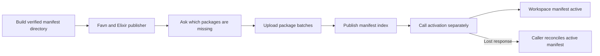
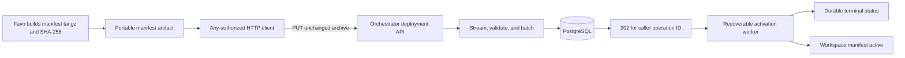
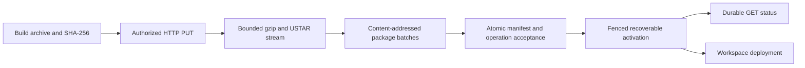

# Change Record: First-party manifest deployment

| Field | Value |
| --- | --- |
| Status | Implemented |
| Type | Feature |
| Primary issue | [#661](https://github.com/eirhop/favn/issues/661) |
| Pull request | [#662](https://github.com/eirhop/favn/pull/662) |
| Related work | Existing manifest publication, activation, and runner-release contracts |
| Affected areas | Manifest build artifacts, private Orchestrator API, manifest activation, service authentication, PostgreSQL control-plane state, production deployment workflow |
| Approved plan commit | `2625f8e4` |
| Last updated | 2026-08-24 |

## One-minute summary

Deploying a manifest currently requires a Favn/Elixir publisher to call separate
package, manifest, and activation operations. Favn will instead build one
deterministic `.tar.gz` file that any authorized HTTP client can upload. The
Orchestrator will validate and ingest the archive as a bounded stream, persist a
durable workspace deployment operation, activate asynchronously, and expose its
status. This change needs a record because it changes the public build artifact,
HTTP and authentication contracts, durable lifecycle, PostgreSQL data, and
production deployment workflow.

## Impact

A deployment uses this contract:

1. Favn builds the manifest archive and reports its SHA-256.
2. The user chooses where the artifact is stored and which authorized HTTP client
   can reach the Orchestrator.
3. That client uploads the unchanged archive to a caller-chosen deployment URL.
4. The Orchestrator owns validation, package registration, publication, activation,
   retries, and durable status.

The HTTP client can be CI itself, a private relay job, or an operator using
`curl`. Uploading requires no Elixir, Mix, Favn dependency, custom publisher
application, or mounted volume. Blob Storage and a private Linux job are one
possible network topology, not part of Favn's deployment contract.

## Problem analysis

Favn already has the important low-level safety contracts, but the caller must
compose them. `mix favn.build.manifest` writes a verified directory containing
`bundle.json`, `manifest-index.json`, and content-addressed execution packages.
`mix favn.publish` then asks which packages are missing, uploads package batches,
and publishes the index. `mix favn.activate` performs a separate synchronous
activation and reconciles an uncertain response.

The private API accepts plain or gzip-compressed JSON on the package and manifest
routes. It does not accept the manifest release directory as one transport
artifact. It also reads the complete JSON request body before decoding it.

Activation has a second scale problem that transport alone would hide. Target
compatibility planning currently inspects persisted SQL targets one by one. Each
inspection can wait up to five minutes for an exact runner. A durable operation
would prevent an HTTP timeout, but it would not make a large activation finish in
bounded time unless this inspection work is also bounded.

### Assumptions

- The build environment has the Favn dependency required to compile and produce
  the manifest archive.
- At least one authorized HTTP client can reach the Orchestrator API. Favn does
  not require that client to run in CI, a private job, or any specific platform.
- The client can preserve the archive bytes and provide a bearer token,
  `X-Favn-Workspace-Id`, the SHA-256 printed by the builder, and a stable
  non-secret operation ID such as a CI deployment ID.
- The first-party operation preserves the current production CLI selection:
  every manifest asset and pipeline is selected as common, workspace-specific
  selections are empty, and validated manifest execution-pool defaults are
  explicitly approved. Custom target whitelists continue to use the existing
  low-level activation contract.
- A missing or older live runner is an availability condition, not a reason to
  reject activation. Existing runs remain pinned to their old manifest and
  release; new work waits for capacity matching the new manifest.
- The Orchestrator may hold one decoded manifest index and one bounded package
  batch in memory. It must never hold the complete expanded archive in memory or
  require a temporary archive file.

### Evidence

| Evidence | What it proves | What it does not prove |
| --- | --- | --- |
| `FavnAuthoring.Deployment.ManifestBuilder.write_bundle/2` writes the index, packages, and verified `bundle.json` into a directory | Favn already owns the canonical files and their integrity metadata | It does not currently produce a deterministic archive |
| `FavnOrchestrator.API.ManifestPublication` accepts plain or gzip JSON and calls `read_body/2` with the complete configured limit | Existing publication authenticates before reading and has compressed/expanded limits | It is not a streaming tar archive parser |
| `Favn.CLI.OrchestratorClient.publish_manifest/4` calls missing-package, package-upload, and index-publication endpoints | Package deduplication and bounded batches already exist | A standard HTTP client cannot use this orchestration without Favn dependencies |
| `FavnOrchestrator.API.ManifestsRouter` exposes publication and synchronous activation as separate requests | Current API behavior is not one durable publish-and-activate operation | It does not provide deployment status after the request ends |
| `TargetCompatibilityPlanner.plan/4` maps persisted targets sequentially and `OperationRunnerTasks` defaults each wait to 300,000 ms | Large SQL activations can be dominated by sequential runner inspections | No live 1,000-target activation timing has been measured |
| PostgreSQL limits execution packages to 4 MiB each, 32 MiB per command, 1,000 per store command, and deployments to 10,000 targets | Internal ingestion must preserve bounded package and target writes | These are not suitable archive-wide memory limits by themselves |
| On updated `main` (`20b367b1`), the current schema-17 1,000-SQL-asset measurement produced a 5,895,332-byte compact index and 159,756-byte gzip index | The compact index is practical at 1,000 assets and SQL remains outside it | This measurement excludes the execution-package bytes and the future tar headers |

## Current behavior

The consumer currently owns transport, the multi-request sequence, operation
identity, and uncertain-response handling. Packaging that publisher into a
deployment image also makes a manifest-only release depend on an image rollout.

## Approved plan

Favn will own one manifest release archive format and one deployment operation.
The upload request ends only after all archive content and the deployment intent
are durable. Activation then continues under a recoverable Orchestrator worker.

### Archive contract

- `mix favn.build.manifest` produces one primary artifact at
  `.favn/dist/manifest/<manifest-version-id>.tar.gz`.
- The archive format is a strict Favn-owned USTAR/gzip subset. File order,
  timestamps, ownership, permissions, path encoding, padding, and gzip metadata
  are fixed so identical input produces identical bytes.
- The first entry is `bundle.json`. It declares the bundle schema, manifest
  identity, runner-release map, every allowed path, byte size, and SHA-256.
- Execution-package entries follow in content-hash order. The final entry is
  `manifest-index.json`, so every referenced package can be durable before the
  index is published.
- Only regular files with known safe relative paths are allowed. Links, devices,
  sparse files, PAX extensions, duplicate paths, undeclared paths, executable
  files, path traversal, concatenated gzip members, trailing compressed bytes,
  and trailing non-zero tar data are rejected.
- The existing verified directory may remain as an internal build product and
  for compatibility with `mix favn.publish`, but the archive is the documented
  transport artifact.
- There is no user-provided chunk size. Favn chooses archive structure, and the
  Orchestrator chooses PostgreSQL batch boundaries.

### HTTP contract

- `PUT /api/orchestrator/v1/manifest-deployments/:operation-id` accepts
  `Content-Type: application/gzip` with no `Content-Encoding`. The operation ID
  is a caller-chosen, non-secret, 1-128 byte identifier matching
  `[A-Za-z0-9][A-Za-z0-9._-]*`. A CI deployment or run ID is the normal value.
- The request requires `Authorization`, `X-Favn-Workspace-Id`, and
  `X-Favn-Archive-Sha256`. Authentication, workspace authorization, operation-ID
  validation, archive-hash validation, replay lookup, and upload admission all
  finish before the first body byte is read.
- An existing operation with the same workspace, operation ID, archive hash, and
  fixed activation selection is returned without reading the body. Reusing the
  ID with a different fingerprint returns
  `409 deployment_operation_conflict` without reading the body.
- A PostgreSQL-backed upload lease admits at most two archive uploads globally,
  one per authenticated service identity, and one per workspace. Saturation
  returns `429 deployment_upload_busy` with `Retry-After` before reading the
  body. Leases are renewed while reading, released on every normal/error path,
  and expire safely after process or node loss.
- The parser reads compressed request chunks, incrementally inflates gzip, and
  processes the strict tar stream one entry at a time. It does not write the
  archive to disk.
- One package is decoded within the per-package limit. Packages are persisted in
  batches of at most 100 and at most 32 MiB expanded, reusing current package
  validation and content-addressed conflict behavior.
- The index is decoded only after every declared package is present and verified.
  One PostgreSQL transaction then verifies all referenced packages, registers
  or replays the immutable manifest and package links, and inserts or replays the
  accepted workspace operation plus its audit identity. The transaction prevents
  a published manifest with no corresponding operation.
- Only after that commit may the API return `202 Accepted`. The response includes
  the operation ID, manifest identity, state, and status URL.
- `GET /api/orchestrator/v1/manifest-deployments/:operation-id` returns the
  durable state, exact manifest and runner releases, timestamps, bounded failure
  classification, and final deployment identity when successful.

Initial protocol budgets are part of the public contract:

| Budget | Limit |
| --- | ---: |
| Compressed request | 256 MiB |
| Total expanded tar entries | 1 GiB |
| `bundle.json` | 4 MiB |
| Manifest index | 64 MiB |
| One execution package | 4 MiB |
| Execution packages | 10,000 |
| Total tar entries | 10,002 |
| Package persistence batch | 100 packages and 32 MiB |
| Compressed request read chunk | 1 MiB |
| Complete upload request | 15 minutes |

The builder enforces the same archive limits. A user therefore receives a build
error instead of having to discover or choose transport packaging. A future
resumable protocol may raise the compressed transport boundary without changing
manifest identity; multipart or resumable upload is not part of this PR.

### Durable operation contract

- The public operation ID is supplied by the caller, stored as non-secret audit
  metadata, and names both `PUT` and `GET`. The caller therefore knows the status
  URL even when the upload response is lost. Raw bearer tokens are never
  persisted or logged.
- The durable request fingerprint covers workspace, operation ID, verified
  archive SHA-256, manifest identity, and the fixed activation selection. Replays
  must match it exactly. The identity that first accepted the operation is stored
  separately for audit, so credential rotation does not change idempotency.
- Operation IDs and their request fingerprints are retained permanently in v1.
  If payload retention is added later, a durable tombstone must still prevent
  reuse of the same workspace and operation ID with a different request.
- Durable states are `accepted`, `activating`, `succeeded`, `needs_attention`,
  `failed`, and `unknown`. `needs_attention` means the manifest is active but one
  or more target paths remain blocked pending an explicit operator decision.
  State payloads are bounded and contain no manifest or package body.
- PostgreSQL stores accepted intent before worker dispatch. A bounded worker
  claims operations with a lease and fencing token. Expired claims are
  recoverable after a process or node restart.
- Activation uses the operation identity as the existing manifest-deployment
  idempotency identity. After an uncertain database or worker outcome, recovery
  first replays or reconciles that identity; it never starts a new activation
  blindly.
- A durable workspace activation lease with a fencing token serializes the new
  worker and the retained low-level activation route. It is not held as an open
  database transaction during runner inspection. A new operation waits and
  retries within its existing worker identity; a conflicting synchronous legacy
  activation returns a stable `409 manifest_activation_in_progress`.
- Different workspaces may progress concurrently within a configured global
  worker limit.
- Package and manifest publication are immutable and idempotent. If an upload
  disconnects before acceptance, already committed packages may remain as safe
  unreferenced content and are eligible for existing retention cleanup. The
  caller reuses the same operation ID after a confirmed `not_found` status.

### Runner and target behavior

- A manifest with an unsupported schema, runner contract, invalid release map,
  or mismatched declared identity fails before an operation is accepted.
- Matching live runners are diagnostic evidence only; their presence is not
  needed to persist the operation.
- Zero live runners does not reject activation. If no persisted target needs
  physical inspection, the operation can still succeed. If target inspection is
  unavailable, the manifest becomes active but the operation ends as
  `needs_attention`; affected target paths remain blocked until a later
  deployment operation can inspect them.
- Older runners and their in-flight work are not stopped. Existing runs remain
  pinned to their old deployment and release. New work uses the new manifest and
  waits for its exact release.
- A different declared runner release does not make activation fail merely
  because its runner is not connected yet.
- Physical target inspection is bounded separately from archive ingestion. When
  no exact inspection runner is registered, inspection is immediately recorded
  as unavailable, matching the current eventual compatibility outcome without a
  five-minute wait per target.
- When exact inspection capacity exists, a fair bounded worker pool attempts
  every target exactly once in deterministic target order, with at most 32 live
  inspections and a 15-second deadline per task. There is no short global cutoff
  that can starve later targets; progress counts remain available through status.
- An inspection timeout durably expires or cancels that runner task before its
  unavailable decision is frozen. Runner-task claims exclude expired deadlines,
  and a completion after expiry is rejected by the stored state/fence. Late work
  therefore cannot change the active deployment.
- `succeeded` is returned only when activation committed without an unresolved
  operator-decision target. `needs_attention` is terminal and actionable, not a
  successful result hidden behind runner availability. Re-running inspection
  after runner capacity is fixed requires a new operation ID, matching the
  existing activation contract.

### Authentication and audit

- Add dedicated `manifest_deployer` credentials through
  `FAVN_ORCHESTRATOR_MANIFEST_DEPLOYER_TOKENS`. Its value is a bounded JSON array
  of objects with exactly `service_identity`, `workspace_ids`, and `token` fields.
  JSON strings preserve every valid workspace ID without delimiter ambiguity.
  Each credential requires a versioned service identity and a non-empty workspace
  allowlist. At most 100 active deployment credentials, 100 workspaces per
  credential, and 512 KiB of encoded configuration are accepted. Startup rejects
  unknown fields, duplicates, invalid IDs, malformed JSON, weak tokens, and
  conflicting token hashes; successful parsing hashes tokens and discards the raw
  values before runtime diagnostics are built.
- Successful authentication creates a deployment-specific context containing
  only service identity, allowed workspace, and request ID. This context is
  accepted only by deployment upload/status commands; it is not promoted to
  `platform_operator`, `workspace_admin`, or another general persistence role.
- Immutable global package/manifest writes and workspace activation are performed
  behind the deployment facade with narrowly named internal `SystemContext`
  purposes. That internal authority is not returned to the API caller, while the
  original service identity remains on the operation and audit record.
- Existing `platform_operator` service credentials may call the endpoint for
  operational compatibility. `manifest_deployer` does not gain access to other
  platform mutations, the old general publication endpoints, or protected
  manifest payload reads.
- Audit and logs may include request ID, service identity, workspace ID,
  operation ID, manifest version, content hash, runner-release IDs, byte counts,
  entry/package counts, duration, state, and bounded failure class.
- Logs, audit rows, status responses, and errors never include bearer tokens,
  archive contents, SQL, arbitrary paths, or exception terms.

### Contracts and invariants

- The manifest release archive is produced by Favn, not assembled by users.
- Uploading the archive requires only a standard HTTP client and has no Favn
  runtime dependency. The build and upload steps may run in the same environment
  or in different environments.
- No persistent or ephemeral mounted volume is required for correctness. The
  upload path does not use a temporary archive file.
- No `202` response is returned until package content, manifest publication, and
  operation intent are durable.
- Manifest registration and operation acceptance are one PostgreSQL transaction;
  only earlier immutable package batches may remain unreferenced after failure.
- A failed or incomplete upload never changes the active workspace deployment.
- A failed activation leaves the previously active deployment unchanged.
- The exact manifest ID, content hash, runner-release map, package hashes, and
  request fingerprint are validated before activation.
- Package and database batches are internal implementation details and cannot be
  selected by the caller.
- Retry, timeout, restart, concurrent request, and uncertain-outcome paths use
  the original caller-known operation identity. After an acceptance timeout or
  lost response, the caller reads that exact status before deciding whether the
  archive must be sent again.
- Status reads are workspace-authorized and cannot expose another workspace's
  operation.

### Scope

- Deterministic `.tar.gz` output from the supported manifest build.
- Strict streaming archive ingestion in the private Orchestrator API.
- Deployment-only workspace authorization, upload admission, and bounded
  redacted audit metadata.
- Atomic manifest acceptance, durable PostgreSQL deployment-operation state,
  workspace activation serialization, and restart recovery.
- One asynchronous publish-and-activate operation plus status read.
- Bounded target compatibility inspection so large SQL manifests and zero-runner
  deployments do not wait sequentially.
- Public deployment guidance for direct CI upload, relayed upload, and manual
  `curl`, all using the same HTTP contract.
- Migration guidance from separate `mix favn.publish` and `mix favn.activate`.

### Non-goals

- Building, publishing, draining, or deploying runner images.
- Provisioning artifact storage, identities, networks, CI runners, relay jobs, or
  other customer infrastructure.
- Giving the Orchestrator cloud-specific object-storage credentials or URLs.
- Requiring the Orchestrator to pull an artifact from a provider.
- Adding a new `mix favn.deploy` command. The supported deployment boundary is
  the HTTP archive operation so every upload environment can remain
  dependency-free. The issue owner explicitly confirmed this API-only choice in
  the 2026-08-24 design discussion after rejecting a Favn-dependent uploader.
- Removing the existing low-level publish and activate APIs or Mix tasks in this
  PR.
- Custom workspace target whitelists in the archive endpoint.
- User-selected archive chunks, multipart upload, or resumable upload.
- Storing manifest archives in PostgreSQL after their contents are ingested.

### Implementation slices

| Slice | Outcome | Owner or area | Depends on |
| --- | --- | --- | --- |
| 1 | Deterministic archive and build-time limit validation | `favn_authoring` and public build task | None |
| 2 | Workspace-scoped deployment authentication, pre-body admission, strict streaming ingest, and internal package batching | Orchestrator private API, authentication, and manifest facade | Slice 1 archive contract |
| 3 | Atomic manifest/operation acceptance, permanent operation identity, activation serialization, claiming, restart recovery, and status | Orchestrator and PostgreSQL | Ingested immutable packages |
| 4 | Fair bounded compatibility inspection, task expiry fencing, and explicit terminal runner/target diagnostics | Orchestrator activation and runner tasks | Durable operation and activation lease |
| 5 | Transport-neutral HTTP workflow, example topologies, compatibility guidance, and qualification | Public and production documentation, cross-boundary tests | Slices 1-4 |

### Complexity budget

The ranges exclude this record, generated files, dependency locks, vendored
code, and formatter-only changes. Supporting files include tests, fixtures,
examples, migrations documentation, and canonical documentation.

| Slice | Production added | Production deleted | Supporting added | Supporting deleted | Main reason for the size |
| --- | ---: | ---: | ---: | ---: | --- |
| Deterministic archive | 160-280 | 0-40 | 180-320 | 0-40 | Strict stable tar/gzip encoding, build results, limits, and byte-for-byte tests |
| Streaming ingest, admission, and deployment authorization | 500-850 | 20-100 | 550-900 | Incremental gzip/tar state machine, hostile-input rejection, distributed upload leases, API responses, and workspace-scoped credentials |
| Durable deployment operation | 800-1,250 | 20-100 | 800-1,250 | Atomic accept command, permanent operation identity, activation lease/fence, recovery worker, status API, and restart/race tests |
| Bounded compatibility inspection | 220-380 | 20-100 | 300-500 | Fair concurrency, durable task expiry, late-result fencing, and zero/old/matching runner cases |
| Public workflow and compatibility | 20-80 | 0-40 | 260-450 | Build output/hash, transport-neutral PUT/GET contract, example topologies, operations, security, ingress, and migration guidance |
| **Expected total** | **1,700-2,840** | **60-380** | **2,090-3,420** | **0-180** | The feature crosses archive, API, lifecycle, security, persistence, and runner-task boundaries |

Before final review, actual additions and deletions will be assigned once to the
owning slice. Any category above its upper estimate by more than 25 percent or
100 lines, whichever is smaller, requires a plain-language explanation and
review. Materially fewer planned deletions also require explanation.

### Implementation map

| Concept | Expected code area | Responsibility |
| --- | --- | --- |
| Archive creation | `apps/favn_authoring/lib/favn_authoring/deployment/` | Stable archive bytes, file order, metadata, and build-time bounds |
| Public build output | `apps/favn/lib/mix/tasks/favn.build.manifest.ex` | Report the primary archive path and actionable build failures |
| HTTP boundary | `apps/favn_orchestrator/lib/favn_orchestrator/api/` | Authenticate before read, stream parse, stable responses, and status route |
| Deployment credentials and admission | `apps/favn_orchestrator/lib/favn_orchestrator/auth/` and deployment API support | Workspace allowlists, deployment-only context, upload leases, and pre-body overload responses |
| Deployment lifecycle | `apps/favn_orchestrator/lib/favn_orchestrator/` | Accept intent, dispatch, recover, reconcile, and expose bounded status |
| Persistence contracts | `apps/favn_orchestrator/lib/favn_orchestrator/persistence/` | Typed commands, queries, results, limits, leases, and fencing |
| PostgreSQL implementation | `apps/favn_storage_postgres/` | Operation table, immutable ingest batches, claims, transitions, and indexes |
| Canonical guidance | `apps/favn/guides/`, `docs/architecture/`, `docs/production/`, `docs/storage/postgresql/`, and `Favn.AI` | Supported workflow, limits, security, lifecycle, and migration |

## Operational design

### Failures and recovery

| Failure | Outcome and recovery |
| --- | --- |
| Missing or invalid credential | Reject before reading the body; no content or operation is stored |
| Oversized, malformed, unsafe, or incomplete archive | Return a stable 4xx response; active deployment is unchanged; retry only after correcting the artifact |
| Client disconnect before atomic acceptance begins | No operation is accepted; immutable packages already stored are harmless; confirm `not_found`, then retry the complete archive with the same operation ID |
| Disconnect or database timeout while atomic acceptance may be committing | Do not claim failure or retry blindly; return or document `deployment_acceptance_unknown` with the caller-known status URL, then query that operation when PostgreSQL is reachable |
| Response lost after acceptance | Read the caller-known operation status; a replay with the same fingerprint returns that operation without reading the body |
| Orchestrator crash during activation | Lease expires; a worker reclaims and reconciles the same operation identity |
| Unsupported manifest or true static incompatibility | Operation fails with a stable actionable class; prior deployment stays active |
| No matching runner | Activation does not wait for registration; affected persisted targets become blocked operator decisions and the active operation ends `needs_attention` |
| Inspection task deadline reached | The task is durably expired/cancelled and fenced before the target receives an unavailable decision; no late completion can mutate the frozen deployment |
| Activation outcome cannot be reconciled | Mark `unknown`; do not blindly retry; status tells the operator to inspect the exact operation and active deployment |

Rolling back the Orchestrator code does not remove the migration. Old control
planes ignore the additive operation table and continue supporting the low-level
publication and activation routes. Roll forward to resume accepted nonterminal
operations. A database downgrade is not part of normal rollback.

### Logs and diagnostics

| Event or state | Level or surface | Safe fields | Rate limit |
| --- | --- | --- | --- |
| Upload accepted or rejected | Structured info or warning | Request, service, workspace, operation, manifest, byte and entry counts, bounded class | Once per request |
| Operation transition | Structured info and status API | Operation, workspace, old/new state, manifest, attempt, duration | Once per transition |
| Recovery claim | Structured info | Operation, prior state, attempt, safe lease age | Once per claim |
| Repeated recovery failure | Warning and diagnostics | Operation, attempt count, bounded failure class | First and periodic |
| Runner availability | Operation status and diagnostics | Pool, exact release ID, available/pending/older state | Once per operation result |

### Deployment, migration, and compatibility

1. Run the additive PostgreSQL migration.
2. Deploy Orchestrator code with the new API disabled until migration readiness
   succeeds.
3. Configure a workspace-scoped `manifest_deployer` credential for each chosen
   uploader.
4. Deploy the public build change so the build environment produces the archive
   and SHA-256.
5. Change the chosen authorized client to use the documented `PUT` upload and
   `GET` status contract. This may be CI directly or a separate relay when network
   boundaries require one.

Existing `mix favn.publish` and `mix favn.activate` remain usable during rollout
and rollback. The new builder continues retaining the verified directory they
consume. No runner image rollout is required merely because the archive API is
enabled.

## Verification plan

| Acceptance criterion | Planned evidence | Owning layer |
| --- | --- | --- |
| Identical source produces identical archive bytes | Rebuild across different directories, mtimes, and process runs; compare SHA-256 | Authoring |
| Archive contains exactly the declared safe files | Unit tests for order, headers, hashes, modes, links, duplicates, traversal, missing and extra entries | Authoring and Orchestrator API |
| Unauthorized requests do not consume a large body | Conn test with a body reader that records whether it was called | Orchestrator API |
| Upload admission is bounded before body read | Multi-node PostgreSQL tests for global, identity, and workspace caps; stable 429/Retry-After; disconnect/crash lease cleanup; and no body read on rejection | Authentication, Orchestrator API, and PostgreSQL |
| Upload memory and time remain bounded | Tests at every compressed, expanded, bundle, index, package, entry-count, batch, gzip-member, trailing-byte, stalled-chunk, and timeout boundary | Orchestrator API |
| More than 1,000 packages deploy without caller chunking | Integration fixture proving internal batches and exact final manifest | Orchestrator and PostgreSQL |
| No archive file or mounted volume is needed | Upload test with no writable temp directory and a read-only application filesystem | Orchestrator API |
| Manifest and operation acceptance are atomic before `202` | Failure-injection tests around the one registration/operation transaction prove no published-manifest orphan; earlier package orphans remain retention-safe | Orchestrator and PostgreSQL |
| Same operation ID and fingerprint is idempotent | Concurrent and sequential replay tests return one operation and do not read a replay body | Orchestrator and PostgreSQL |
| Same operation ID with different content conflicts permanently | API/store tests plus retained-row or tombstone tests | Orchestrator and PostgreSQL |
| Lost response is reconcilable | Accept, discard response, restart, and read terminal status by operation ID | Orchestrator and PostgreSQL |
| Worker crash is recoverable | Lease expiry and reclaim tests on separate worker processes | Orchestrator and PostgreSQL |
| Previous deployment survives failure | Invalid and failed activation tests compare exact active deployment before and after | Orchestrator and PostgreSQL |
| Old and new activation routes cannot race | Cross-route concurrency tests prove one workspace activation lease/fence and exact final deployment identity | Orchestrator and PostgreSQL |
| Zero, old, matching, and changed runner releases are explicit | Focused activation tests distinguish `succeeded`, active `needs_attention`, `failed`, and exact-release demand | Orchestrator |
| Large target inspection is fair and bounded | 1,000-target tests prove every target is attempted once, maximum concurrency, per-task expiry, claim exclusion, late-result rejection, deterministic decisions, and progress counts | Orchestrator and PostgreSQL |
| Workspace authorization is isolated without role promotion | Config-bound tests, cross-workspace upload/status tests, and proofs that deployer credentials cannot call old publication or other mutation routes | Authentication and PostgreSQL |
| Logs and errors are redacted | Capture tests using sentinel token, SQL, path, and exception values | Orchestrator API |
| Existing low-level flow remains supported | Existing publish/activate suites plus archive-output compatibility tests | `favn` and Orchestrator |

Focused application tests run before the broader umbrella checks. Final
qualification will include formatting, compilation with warnings as errors, fast
tests, acceptance tests, slow scale tests, migration readiness, the test-tier
guard, and documentation link/render review. A real end-to-end deployment,
whether direct from CI or relayed across a network boundary, is
environment-specific live proof and will be reported separately from the
transport-neutral API evidence.

## Risks and open questions

| Risk or question | Impact | Mitigation or decision |
| --- | --- | --- |
| A handwritten streaming tar parser can become a security boundary | Malformed input could bypass limits or corrupt parsing | Support one strict generated subset, reject every extension, use property tests and hostile fixtures, and keep parsing separate from lifecycle logic |
| Partial uploads may leave unreferenced packages | Storage can grow after repeated failed uploads | Content-addressed conflicts remain safe; existing unreferenced-package retention must cover these rows and receive a focused test |
| Slow or abandoned uploads can consume scarce connections and capacity | Other deployments could be denied or memory could accumulate | Authenticate and acquire distributed global/identity/workspace leases before body read, use one bounded buffer, renew leases, enforce a 15-minute request limit, and expire abandoned leases |
| The HTTP ingress may impose a smaller body or timeout limit | Valid Favn archives could be rejected before reaching the application | Document required 256 MiB and 15-minute ingress budgets and qualify the deployed ingress separately |
| A 1 GiB expanded archive is finite | A future project may exceed the first protocol | Build fails clearly at the shared bound; add resumable upload only from measured need, without user-selected semantic chunks |
| The new upload endpoint uses the current all-common activation selection | Consumers needing per-workspace whitelists cannot use the one-file path yet | Keep the low-level activation API; design a separate explicit selection contract rather than hiding workspace policy in transport headers |
| Issue #661 mentions a corresponding Favn CLI command | Making a Favn command the deployment boundary would require Favn in every upload environment | The issue owner explicitly selected the HTTP API on 2026-08-24; document direct-CI, relay, and `curl` examples, retain existing low-level Mix tasks, and add no new deploy task |
| A commit response can be lost | The caller cannot tell whether retrying would duplicate activation | The caller chooses the permanent operation ID and always reconciles its known GET URL before retrying; atomic acceptance and fingerprint conflicts prevent a second activation |
| Concurrent new and retained low-level activations can supersede each other | Final active manifest could depend on a race | Route both through one durable workspace activation lease/fence and test cross-route contention |

## Plan review

| Field | Result |
| --- | --- |
| Reviewer | Independent agent `issue_661_plan_review` |
| Reviewed against | Issue #661, current code, evidence, and this plan |
| Findings | Initial review found inspection starvation and late-task risk, incomplete workspace authorization, missing pre-body admission, an ambiguous acceptance/idempotency boundary, an old/new activation race, and an ambiguous workspace-ID allowlist encoding |
| Findings addressed and rechecked | Yes. The reviewer rechecked the full correction set, the bounded JSON credential contract, and the later transport-neutral correction that makes direct CI, relay, and manual HTTP upload examples rather than requirements on 2026-08-24 |
| Verdict | **READY** — no actionable plan blockers remain |

## Implementation outcome

The implementation follows the approved transport-neutral boundary. The build
task now emits a deterministic Favn gzip/USTAR archive and its SHA-256. A caller
uses ordinary HTTP to upload that file. The Orchestrator authenticates and
admits the request before reading it, validates the archive as a bounded stream,
persists packages in internal batches, and atomically accepts the manifest plus
its caller-named durable operation. A fenced worker then activates and records a
terminal status that the same workspace-scoped credential can read.

The Orchestrator never writes the uploaded archive to disk and needs no mounted
volume. The uploader needs no Elixir, Mix, or Favn runtime. The retained
low-level publish and activate routes use the same workspace activation lease,
so they cannot race the new worker.

### Actual scope and complexity

The counts below compare approved baseline `2625f8e4` with the staged final
implementation. They exclude this record as planned. Every changed line is
assigned to one slice exactly once.

| Slice | Production added | Production deleted | Supporting added | Supporting deleted | Comparison with budget |
| --- | ---: | ---: | ---: | ---: | --- |
| Deterministic archive | 341 | 15 | 53 | 0 | Production is 61 lines above the estimate, below the record's material-overrun threshold; archive declarations now force the transport's non-executable mode independently of host filesystem permission behavior |
| Streaming ingest, admission, and deployment authorization | 1,713 | 1 | 674 | 1 | Production exceeds its estimate because the strict incremental gzip/USTAR parser, pre-body Plug, owner-monitored upload heartbeat, and acceptance fence are explicit security boundaries; focused hostile-input, owner-death, and deadline tests account for most supporting growth |
| Durable deployment operation | 1,765 | 12 | 748 | 0 | Typed commands, claim-loss propagation, three fenced lease lifecycles, migration readiness metadata, atomic rollback injection, and two-worker recovery are explicit; this slice remains within the combined planned range |
| Bounded compatibility inspection | 254 | 30 | 299 | 11 | Production is within estimate; supporting evidence now includes all operator-decision classes, 1,000-target fairness/concurrency, nil/future/expired deadline behavior, cancellation after expiry, operation-scoped retry identity, and late-result rejection |
| Public workflow and compatibility | 9 | 2 | 230 | 15 | Nearly all work is canonical guidance, deployment templates, and CI test-tier coverage rather than runtime code |
| **Actual total** | **4,082** | **60** | **2,004** | **27** | **6,086 additions and 87 deletions excluding both names of this record; the combined total is inside the approved 3,790-6,260 range** |

The production/supporting split differs materially from the estimate even though
the combined size is in range. The main reason is that the approved behaviors
became explicit typed state machines and persistence contracts, followed by the
hostile-input, deadline, concurrency, and rollback evidence requested in final
review. Final review must therefore pay particular attention to parser, fencing,
recovery, and store correctness; local PostgreSQL execution was not available,
so final runtime evidence comes from CI's PostgreSQL service.

## Deviations from the approved plan

| Planned | Implemented | Reason | Impact |
| --- | --- | --- | --- |
| Fixed Favn-owned gzip metadata | The valid gzip header includes a fixed `FV` extra field containing the exact raw-deflate byte length | Erlang zlib does not report unused compressed input. Recompressing to detect concatenated members would couple uploads to the Orchestrator's local zlib version. The length field lets the streaming receiver place the footer and reject ordinary trailing members without local recompression | Archive bytes remain standard gzip and curl-compatible, but the exact Favn header is intentionally stricter than arbitrary `.tar.gz` input |
| Existing CI slow-test apps only | `favn_orchestrator` is added to the slow-test alias and tag guard | The 1,001-package archive qualification belongs to the receiver app and must run in CI | Slow CI gains about one minute; no production behavior changes |
| Chunk-arrival renewal as the only upload heartbeat | A dedicated request-owned process renews throughout reads, decode, and package persistence; acceptance also requires the matching currently unexpired lease in the same PostgreSQL transaction | Final review identified that a slow final read or persistence callback could outlive chunk-driven renewal | Acceptance is fenced after takeover or expiry; immutable package writes completed before lease loss remain retention-safe |
| Unmonitored lease-heartbeat owners | Upload and worker-claim heartbeats monitor their owning process; upload renewal stops on request death, while claim-renewal loss terminates the stale worker | Final review demonstrated that an orphan upload heartbeat could renew forever and that ignored worker-claim loss allowed unfenced work to continue | Process death now converges through lease expiry, and a fenced worker cannot continue activation |
| Terminal handling of a live idempotency reservation | `command_in_progress` releases the deployment claim instead of completing the operation as failed | A replacement worker may arrive before the crashed worker's 60-second preparation reservation becomes stale | The durable operation remains accepted and retryable until safe reservation takeover |
| Deadline enforcement applied to every runner task and rejected cancelling inspections | Only finite inspection deadlines gate claim/completion; nil remains unbounded, and an expired inspection accepts only its requested cancelled result | Final-head CI proved that the first implementation made established no-deadline work unclaimable and inverted cancellation completion. Review also found that retry tests still assumed the pre-plan task identity and no capacity admission | Existing runner-task contracts remain compatible while bounded deployment inspections reject expired claims and late success; repeated activation uses fresh operation-scoped work |

The approved API-only choice, fixed activation selection, limits, durable
states, credential model, no-volume receiver, retained low-level operations, and
transport-neutral deployment examples are unchanged.

## Decision log

| Date | Decision | Evidence and reason |
| --- | --- | --- |
| 2026-08-24 | Keep deployment API-only and add no `mix favn.deploy` | The issue owner explicitly rejected requiring Favn dependencies in the upload environment; a direct CI client, private relay, and manual upload all use the same PUT/GET contract |
| 2026-08-24 | Use one archive with internal package batches, not user chunks | A 1,001-package test produces and consumes one archive while the receiver persists ten batches of 100 and one batch of 1 |
| 2026-08-24 | Put exact deflate length in Favn gzip metadata | This rejects normal concatenated members without recompressing with a potentially different zlib implementation |
| 2026-08-24 | Serialize new and legacy activation with a PostgreSQL lease and commit fence | An in-memory lock would not cover multiple Orchestrator nodes or process loss |
| 2026-08-24 | Treat missing exact inspection capacity as immediate operator attention | Waiting sequentially would make large deployments unpredictable; activation stays safe and explicit while old runs remain pinned |
| 2026-08-24 | Count every compatibility `operator_decision` in terminal deployment diagnostics | Final review found that unmanaged relations, inconsistent generation state, and missing active fingerprints could otherwise be reported as `succeeded`; all such active-but-blocked paths now end `needs_attention` |
| 2026-08-24 | Fence archive acceptance with the live upload lease | An independent heartbeat keeps legitimate long work admitted, while the atomic PostgreSQL check prevents an expired or superseded uploader from accepting intent |
| 2026-08-24 | Monitor every lease heartbeat owner | Renewal work must never outlive the request or worker that owns the lease |
| 2026-08-24 | Treat `command_in_progress` as crash-recovery backpressure | A live prior reservation is not a terminal activation failure; release and retry after its safe-takeover window |
| 2026-08-24 | Preserve nil deadlines and cancellation while bounding deployment inspections | Inspection deadlines are opt-in. A finite deadline excludes new claims after expiry and rejects late success, while a requested cancellation may still close the task as cancelled. Retry work is scoped to the deployment operation so late results cannot cross operations |

## Verification evidence

| Evidence | Result | Boundary |
| --- | --- | --- |
| `mise exec -- mix format` and `git diff --check` | Passed | Formatting and whitespace |
| `MIX_ENV=test mise exec -- mix compile --warnings-as-errors` | Passed | Umbrella static compilation |
| Fast owning-app suites | Passed: Core 437, Authoring 140, Orchestrator 717 with 2 slow tests excluded, Runner 238, public `favn` 183 with 3 excluded | Non-database application behavior |
| Archive parser focused suite | Passed: 11 fast tests | 37-byte streaming, exact/near byte batching, strict metadata, non-regular/path-traversal tar rejection, digest/footer/header/member failures, and deterministic final-read/persistence deadlines |
| `:slow` 1,001-package archive test | Passed: 1 in 131 seconds | One-file transport and eleven internal package batches without caller chunking |
| `:slow` 1,000-target inspection test | Passed: 1 in 3.6 seconds | Every target attempted once, deterministic order/progress, and observed concurrency bounded to 32 |
| Upload/claim-heartbeat and activation-diagnostics suites | Passed: 8 tests | Independent renewal, owner-death cleanup, claim-loss worker termination, and all bounded operator-decision reason classes |
| Authoring archive suite | Passed: 2 | Deterministic bytes, stable order, standard extraction, replay, and conflict |
| Manifest build acceptance test | Passed: 1 | Public build output retains the directory and adds archive path/SHA |
| `mise exec -- elixir scripts/check_test_tag_tiers.exs` | Passed | The new slow test is covered by CI |
| PostgreSQL deployment and changed runner-task test files with database tests excluded locally | Compiled successfully | Eight deployment tests, including two-worker reservation recovery, plus nil/future/expired claim, late-success, cancellation-after-expiry, and operation-scoped retry coverage are syntactically integrated; final runtime proof is delegated to CI's PostgreSQL service |
| CI at completion-repair head `315a3a05` | Acceptance, slow, Dialyzer, quick checks, control-plane image, and HTTP security passed. All eight deployment tests passed in Fast. Three Fast attempts consistently exposed branch-caused null-deadline claim, cancelling-completion, and obsolete repeated-activation test-contract regressions | This was causal intermediate evidence, not a flaky-gate waiver. Candidate `1003b506` repairs every exposed path; final-head CI remains required |
| Final implementation CI at `1f83b2a5`: [CI](https://github.com/eirhop/favn/actions/runs/32761043357), [HTTP](https://github.com/eirhop/favn/actions/runs/32761043212), and [images](https://github.com/eirhop/favn/actions/runs/32761043458) | Passed: Fast, Acceptance, Slow, Dialyzer, Quick, aggregate CI, HTTP boundary, and all control-plane image qualification checks; 11 checks succeeded, 2 publication-only checks skipped, and none failed | PostgreSQL runtime proof includes all eight deployment tests and the repaired nil-deadline, cancellation, and operation-scoped retry paths. Live deployment boundaries below remain untested |
| `mise exec -- mix docs --warnings-as-errors` | New guide rendered, command failed on pre-existing broken links in `guides/operator-authentication.md` plus an unrelated `favn_view` development warning | New guide render inspected; repository-wide docs qualification remains incomplete |

Not verified locally:

- PostgreSQL migration and the eight deployment persistence tests on the final
  candidate, because no
  approved `FAVN_DATABASE_URL` is configured in this workspace;
- a real multi-node process-loss test and live ingress lease takeover (the
  PostgreSQL cap, takeover fence, rollback, replay, and worker reclaim paths are
  covered deterministically);
- a deployed ingress with the 256 MiB and 15-minute budgets;
- a real direct-CI or relayed network deployment; and
- property-generated archives beyond the focused hostile type, path, metadata,
  gzip, digest, size, count, and deadline cases.

These limits are explicit review and CI inputs, not claims of live proof.

## Final review

The requested `gpt-5.6-sol` xhigh reviewer returned `NOT READY` on candidates
`13f34eb8` and `b2d6b68b`. Those reviews found incomplete operator-decision
diagnostics, byte-batch overshoot, upload-lease expiry during final work,
permissive bundle metadata, insufficient focused verification, orphan renewal
after request death, and terminal handling of a recoverable idempotency overlap.
The reviewer returned code-level `READY` on `d2407f48`, `a0bf0ea1`,
`a55b04d9`, and `315a3a05` as successive PostgreSQL result-shape and fenced
completion repairs were made.

Final-head Fast evidence then disproved the earlier classification of four
failures as pre-existing races. The same reviewer traced them to this branch:
the new claim predicate rejected nil deadlines, completion rejected cancelling
inspections, and repeated-activation coverage lacked newly required runner
capacity while asserting the old cross-operation task identity. Candidate
`1003b506` preserves unbounded legacy tasks, permits only matching cancellation
after an expired finite deadline, registers exact test capacity, and asserts a
fresh operation-scoped retry task. The reviewer found no remaining code or test
defect in that repair; its final process finding was this stale record, now
corrected. The reviewer returned `READY` with no P0-P3 findings on final
candidate `1f83b2a5`, and all final implementation CI checks passed. This
record-only outcome update was independently accepted and passed the same
final-head gate set before the pull request was marked ready.
