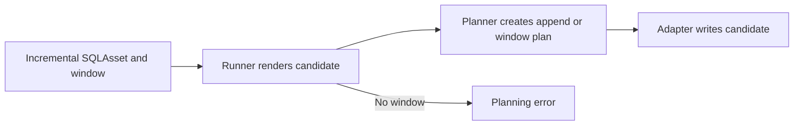
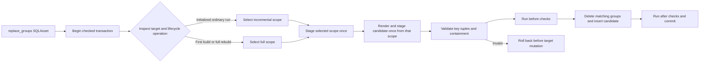

# Change Record: Atomic group-scoped SQLAsset replacement

| Field | Value |
| --- | --- |
| Status | Implemented and independently reviewed |
| Type | Feature |
| Primary issue | [#663](https://github.com/sei-no/favn/issues/663) |
| Pull request | [#664](https://github.com/eirhop/favn/pull/664) |
| Related work | [#532](https://github.com/sei-no/favn/issues/532), [#547](https://github.com/sei-no/favn/issues/547) |
| Affected areas | Public SQLAsset DSL and guides, compiler and manifest contracts, runner materialization planning, SQL runtime adapter contract, DuckDB and DuckLake execution |
| Approved plan commit | `0118904ffd9eb2b1853b21e7da09aeea911238cd` |
| Last updated | 2026-08-24 |

## One-minute summary

Favn can incrementally append rows or replace a time window, but it cannot atomically replace all rows for data-selected groups such as customers, orders, or composite business keys. This change adds an explicit `:replace_groups` strategy in which one SQL query selects the groups to replace and the asset query produces their complete replacement rows. The runner will validate and apply the deletion and insertion in one checked transaction, while reusing the existing first-build, rebuild-generation, target-claim, and unknown-outcome machinery. The feature crosses the public DSL, package identity, runner, and adapter boundaries, so it needs an approved contract before implementation.

## Impact

An author can refresh several complete groups without rebuilding an entire table. For example, a scope query may select customers `12` and `44`; the candidate query may then produce every current order for those customers. Favn deletes the old rows for exactly customers `12` and `44` and inserts the candidate rows atomically. A composite key such as `[:tenant_id, :customer_id]` works the same way, and one execution may contain any number of distinct key tuples.

The explicit scope is important for deletion-only updates. If customer `44` now has no source rows, it can remain in the scope while contributing no candidate rows, so Favn still removes its stale target rows. Deriving the scope only from the candidate would silently miss that deletion.

## Problem analysis

Incremental SQLAssets currently require a scheduler window. The `:delete_insert` strategy deletes rows whose window column falls in that window and then inserts the candidate. Business-key groups are not necessarily time ranges, and using the candidate itself to infer deletion keys cannot represent a group that should now contain zero rows.

The desired capability therefore needs two separate relations:

- the **replacement scope**, containing the complete set of group-key tuples that may be changed;
- the **candidate**, containing the complete new rows for those groups.

The scope is authority to delete, while the candidate is data to insert. Keeping those meanings separate makes empty groups, multiple groups, and composite keys unambiguous.

### Assumptions

- The public form will be `materialized {:incremental, strategy: :replace_groups, replacement_key: [...]}` plus exactly one `:incremental` and one `:full` `replacement_scope` declaration before `query`.
- The two scope declarations will follow existing SQLAsset query forms: an inline SQL block or `file: "...sql"`. The exact macro implementation may be adjusted for idiomatic compile-time diagnostics without changing this contract.
- `replacement_key` is a non-empty ordered list of columns. One column is a simple key; two or more columns form a composite key tuple.
- The incremental scope is used for an initialized ordinary target. The full scope is used when establishing an uninitialized target and when materializing an existing full-rebuild generation.
- An initialized target that happens to contain zero rows is still initialized and uses the incremental scope. Row count is not a lifecycle signal.
- Changing `strategy` or `replacement_key` changes target structure and requires a rebuild under the existing compatibility rules.
- Changing either scope query is treated like changing ordinary transformation SQL: it changes the execution-package identity and makes a rebuild available, but it does **not** require or automatically start a rebuild. Ordinary incremental execution remains allowed.
- DuckDB-backed and DuckLake-backed SQL execution are the only supported adapters in this change.
- Existing target-generation and full-load rebuild workflows remain the lifecycle authority; this feature does not add a second rebuild mechanism.

### Evidence

| Evidence | What it proves | What it does not prove |
| --- | --- | --- |
| `apps/favn_authoring/lib/favn/sql_asset.ex` | Incremental SQLAssets currently require `window` and only compile the existing materialization declarations | Runtime adapter behavior |
| `apps/favn_core/lib/favn/sql_asset/materialization.ex` and manifest execution/target descriptor modules | Strategy, SQL execution content, and structural write semantics cross compiler and manifest boundaries | Correct SQL execution for group replacement |
| `apps/favn_runner/lib/favn_runner/sql/runtime.ex` and `materialization_planner.ex` | The runner resolves SQL, stages checked candidates, selects bootstrap behavior, and owns write planning | A supported adapter's exact deletion SQL |
| `apps/favn_sql_runtime/lib/favn/sql/write_plan.ex` and adapter behavior/capabilities | Writes already use an explicit plan and adapter capability boundary | DuckDB-specific transactional correctness |
| DuckDB ADBC adapter materialization code | Checked writes can run delete and insert statements inside the caller-owned transaction | Support in unrelated adapters |
| `docs/architecture/target-generations-and-rebuilds.md` | Initial generation establishment and shadow full rebuilds already exist, and ordinary SQL changes can make rebuilds available | Live behavior before this implementation is tested |
| [Issue #663](https://github.com/sei-no/favn/issues/663) | Required product semantics and non-goals | Implementation correctness |

## Current behavior

An incremental SQLAsset receives a scheduler window. The runner renders its candidate and plans either an append or a window-bounded delete-and-insert. There is no relation representing a set of business-key groups, so the runner cannot safely authorize group deletions or represent deletion-only groups.



## Approved plan

The author declares the replacement key and two scope queries. On an ordinary initialized run, Favn evaluates the incremental scope; on first build or a full-rebuild generation, it evaluates the full scope. The runner stages the selected scope and candidate, validates their key relationship, and gives a typed group-replacement plan to a capable adapter. The adapter deletes matching target groups and inserts the candidate in the same checked transaction as the existing before/after checks.

Illustrative authoring shape:

```elixir
materialized {:incremental,
              strategy: :replace_groups,
              replacement_key: [:tenant_id, :customer_id]}

replacement_scope :incremental, file: "changed_customers.sql"
replacement_scope :full, file: "all_customers.sql"

query do
  ~SQL"""
  SELECT source.*
  FROM prepared_customer_rows AS source
  JOIN replacement_scope() AS scope
    USING (tenant_id, customer_id)
  """
end
```



### Contracts and invariants

- `:replace_groups` requires exactly one incremental scope, one full scope, and a non-empty `replacement_key`; those declarations are rejected for incompatible strategies.
- Scope SQL participates in the normal SQL template, `defsql`, binding, parameter, dependency, runtime-input, catalog, and execution-package contracts.
- `replacement_scope()` is available to the main candidate query only for `:replace_groups` and resolves to the selected staged scope relation. It is not a general runtime relation for unrelated assets or checks.
- Scope SQL may use declared asset inputs, bindings, parameters, runtime inputs, and `defsql`, but may not contain `query()`, `target()`, or `replacement_scope()`. All runtime relations in either scope fail compilation in this change. This keeps scope evaluation acyclic and makes first-build behavior independent of an existing target.
- Direct `render`, `preview`, and `explain` operations reject `:replace_groups` with an actionable unsupported-operation error in this first version, because those operations do not own a materialization transaction or staged scope. Supporting staged interactive inspection is deferred; normal runner/materialization execution is fully supported.
- Normal execution resolves inputs and validates parameters before opening the session, but does not fully render the candidate at that point. Inside the checked transaction it determines target existence and operation, selects and renders exactly one scope, stages that scope once, binds `replacement_scope()` to that exact stage, then renders and stages the candidate once. It never renders or evaluates both scopes for one run.
- Each staged scope row contains exactly the replacement-key columns in declared order. Every key value is non-null, and every key tuple is unique.
- Candidate replacement-key columns are present and non-null. For every replacement-key position, scope, candidate, and existing target must expose the same non-nil adapter-normalized `Favn.SQL.Column.data_type`; implicit casts are not accepted. A missing target still requires exact scope/candidate type equality. An unknown or uninspectable key type fails before mutation. Candidate tuples may repeat because a group normally contains multiple rows.
- Every distinct candidate key tuple is contained in the scope. A candidate outside the scope fails before target mutation.
- For an existing target, key columns must be present and exactly type-compatible before deletion. A missing target is created from the typed candidate, including when the full scope and candidate are empty.
- An empty scope with an existing target is a successful no-op. It must never become an unbounded delete.
- A non-empty scope with an empty candidate is a successful delete-only replacement, subject to normal before-check behavior.
- The checked transaction begins before staging. It stages the selected scope and candidate, validates them, runs before checks, deletes and inserts, runs after checks, and commits in that order. A before-check skip leaves an existing target unchanged. Validation, statements, or after-check failure roll back.
- Existing `CheckedMaterialization.write_outcome` remains exactly `:written | :no_op`; it is not overloaded with runner delivery outcomes or group detail. Group replacement adds a separate typed result with `operation`, `scope_group_count`, `candidate_row_count`, `inserted_row_count`, and `deleted_row_count` (`non_neg_integer() | :unavailable`). Its exact `operation` enum is `:replaced | :delete_only | :empty_scope_no_op | :before_check_skipped | :bootstrap_created | :bootstrap_empty`.
- `:replaced`, `:delete_only`, `:bootstrap_created`, and `:bootstrap_empty` have `write_outcome: :written`. Existing-target empty scope and before-check skip have `write_outcome: :no_op`. `:bootstrap_empty` still creates a typed empty target. A before-check skip reports staged scope/candidate counts, zero inserted/deleted counts, and leaves the existing target unchanged. Existing authoring rules allow `:skip_materialization` only with `when: :target_exists`; when the target is missing that check is condition-skipped, `:before_check_skipped` is impossible, and bootstrap proceeds.
- Deleted-row count is exact where the adapter can obtain it reliably in the same transaction; otherwise it is `:unavailable`, never estimated. Inserted-row count equals the staged candidate count for a confirmed successful insert. Existing-target empty-scope and before-check-skip counts are zero for deleted/inserted rows.
- The adapter advertises one explicit capability, `group_replacement: :supported | :unsupported`. Unsupported adapters fail during planning, before mutation.
- Existing target claims and admission rules serialize writes. This change adds no group-level concurrent-writer protocol.
- A confirmed failure may be retried only through existing safe execution rules. An unknown commit or connection outcome remains unknown and is never blindly retried.
- Main-query or scope-query changes produce a new execution-package identity. Under existing classification they make a rebuild available but do not force a rebuild. A strategy or replacement-key change is structural and requires rebuilding.
- Initial builds and later full rebuilds use the existing generation lifecycle and reconciliation. No target relation is replaced outside that lifecycle.
- `:replace_groups` is a non-window incremental strategy. It can be scheduled and use ordinary asset-wide freshness policies without a runtime window. Empty-scope no-op, existing-target before-check skip, and delete-only executions publish success/freshness only after the checked transaction has a confirmed commit and normal target reconciliation succeeds. Rollback, planning failure, and unknown outcomes never publish freshness success.

### Scope

- Public SQLAsset declarations, compile-time diagnostics, docs, and `Favn.AI` routing.
- Template support for the candidate-only `replacement_scope()` relation.
- Manifest serialization, hashing, schema/runner contract versions, rehydration, and compatibility classification.
- Runner scope selection, staging, validation, checked execution, bootstrap planning, and results.
- SQL runtime write-plan and adapter capability contracts.
- DuckDB ADBC and DuckLake-backed execution support.
- Focused tests for simple/composite and single/multiple-group behavior, first build, full rebuild, empty/no-op, delete-only, checks, failures, unknown outcomes, and unsupported adapters.
- Clear compile-time rejection of runtime relations in scope SQL and clear runtime rejection of direct render/preview/explain for this first version.
- Canonical feature and authoring documentation.

### Non-goals

- Arbitrary delete predicates or author-supplied delete SQL.
- Merge/upsert, deduplication, or automatic replacement-key inference.
- Deriving deletion scope from candidate rows.
- Replacing the scheduler's time-window model for existing strategies.
- Physical partition changes or partition-driven replacement.
- New PostgreSQL tables, migrations, durable scope-row storage, or group-level locks.
- A new rebuild API, generation lifecycle, UI workflow, or automatic rebuild trigger.
- Cross-target transactions.
- Support for adapters other than DuckDB and DuckLake in this change.
- A generic materialization framework refactor beyond the explicit contracts required by `:replace_groups`.
- Staged direct `render`, `preview`, or `explain` support for `:replace_groups`; these operations return an explicit unsupported error in this version.

### Implementation slices

| Slice | Outcome | Owner or area | Depends on |
| --- | --- | --- | --- |
| 1 | Authors can declare and compile typed incremental/full scopes and use `replacement_scope()` with clear diagnostics | `favn`, `favn_authoring`, `favn_core` SQL template/compiler | None |
| 2 | Packages preserve scope SQL and compatibility distinguishes structural key changes from executable SQL changes | `favn_core` manifests, hashing, rehydration, compatibility | 1 |
| 3 | Runner selects one scope inside the transaction, renders/stages each relation once, validates keys/containment, and plans bootstrap or checked replacement | `favn_runner` | 1, 2 |
| 4 | Capable DuckDB/DuckLake sessions execute the typed plan atomically and return bounded metrics | `favn_sql_runtime`, DuckDB/DuckLake adapters | 3 |
| 5 | Existing first-build/rebuild outcomes, public guidance, feature status, and end-to-end failure semantics are qualified | runner/orchestrator integration tests, guides, `Favn.AI` | 1-4 |

### Complexity budget

This budget separates production code from tests, fixtures, and documentation. It excludes this record, generated files, dependency locks, and formatter-only changes. The runner slice is largest because safe deletion requires independently staging and validating both relations before delegating an exact write plan; folding that work into adapter-specific SQL would weaken the shared correctness boundary.

| Slice | Production added | Production deleted | Supporting added | Supporting deleted | Main reason for the size |
| --- | ---: | ---: | ---: | ---: | --- |
| 1 | 180-320 | 20-80 | 250-450 | 0-80 | Public DSL, two compiled templates, runtime-relation diagnostics, focused authoring tests |
| 2 | 180-320 | 20-80 | 300-520 | 0-100 | Versioned package/descriptor shape, hashing, rehydration, compatibility fixtures |
| 3 | 350-650 | 80-220 | 500-900 | 100-250 | Scope choice, staging, relational validation, bootstrap and checked-write integration |
| 4 | 180-360 | 30-100 | 350-650 | 0-120 | Explicit plan/capability plus atomic DuckDB/DuckLake statements and metrics |
| 5 | 120-260 | 20-100 | 450-800 | 50-180 | Lifecycle qualification, public docs, AI routing, regression coverage |
| **Total** | **1,010-1,910** | **170-580** | **1,850-3,320** | **150-730** | Cross-boundary public feature with transactional safety evidence |

An actual slice outside its approved range requires an explanation when the variance is more than 25% or 100 lines, whichever allowance is smaller. Implementation pauses for renewed review if meeting the contract appears to require a new persistence model, rebuild lifecycle, generic framework, or production additions above the total upper budget.

### Implementation map

| Concept | Expected code area | Responsibility |
| --- | --- | --- |
| Public declarations | `apps/favn_authoring/`, `apps/favn/` | Validate author intent and document the stable DSL |
| SQL templates and manifests | `apps/favn_core/` | Compile, hash, serialize, rehydrate, and classify scopes and replacement keys |
| Execution preparation | `apps/favn_runner/` | Resolve inputs, delay candidate rendering, select one scope in-transaction, render/stage each relation once, validate invariants, and produce a write plan |
| Shared SQL contract | `apps/favn_sql_runtime/` | Carry typed group-replacement fields and advertise adapter capability |
| Concrete execution | DuckDB ADBC and DuckLake adapter code | Perform safe matching delete and candidate insert inside the supplied transaction |
| Lifecycle integration | existing target-generation/rebuild modules and tests | Reuse first-build, rebuild-candidate, activation, reconciliation, and unknown outcomes |

## Operational design

### Failures and recovery

Compile-time declaration mistakes fail asset compilation. Unsupported capabilities, missing keys, type mismatches, duplicate/null scope tuples, or candidate tuples outside scope fail before target mutation. Statement or after-check failures roll back the checked transaction. A confirmed rollback leaves the active target unchanged; an unconfirmed commit or lost connection keeps the existing unknown outcome and reconciliation path and is not automatically replayed.

A normal first build uses the full scope and establishes the initial generation through existing reconciliation. An operator-requested full rebuild writes a separate generation using the full scope while the active generation remains readable, then uses existing activation and recovery. A typed empty bootstrap is still a committed write and can establish an empty initial or rebuilt generation. A `:skip_materialization` before-check applies only when a target exists; a missing target condition-skips that check and continues bootstrap under existing rules. Ordinary failures require no new cleanup beyond existing session-stage and generation cleanup.

### Logs and diagnostics

| Event or state | Level or surface | Safe fields | Rate limit |
| --- | --- | --- | --- |
| Invalid declaration or unsupported adapter | Compile/planning error | Asset ID, strategy, bounded capability/key reason | Once per attempt |
| Scope/candidate validation failure | Execution failure and event diagnostics | Asset/run IDs, validation class, bounded counts and column names | Once per attempt |
| Successful replacement | Structured execution result/event | Asset/run IDs, group operation, existing write outcome, group/candidate/inserted/deleted counts where available | Once per attempt |
| Unknown write outcome | Existing unknown-outcome diagnostic | Asset/run/target IDs and bounded failure class | Existing policy |

Diagnostics never include rendered SQL, scope key values, arbitrary database exception text, credentials, or customer data.

### Deployment, migration, and compatibility

No database migration or operator rollout step is planned. Adding scope fields to `SQLExecution` changes the published execution-package shape, and adding `replacement_key` changes the rigid target-descriptor write-semantics shape. The execution-package schema, runner contract, target-descriptor schema, and parent manifest schema versions will therefore all be bumped. Existing versioned fixtures will prove that old packages and manifests retain their current behavior under the new release. A new package using `:replace_groups` requires a runner/adapter version advertising support and is rejected before execution otherwise. An old release cannot decode or execute the new package or descriptor. Rollback therefore requires selecting an older compatible manifest; targets created by the new manifest remain readable but unmanaged by the old release until a capable release is restored. Existing targets need no data migration.

## Verification plan

| Acceptance criterion | Planned evidence | Owning layer |
| --- | --- | --- |
| DSL accepts simple/composite keys, both scope forms, and multiple groups | Compiler/unit tests plus public examples | `favn_authoring`, `favn` |
| Invalid, late, missing, duplicate, or incompatible declarations fail clearly | Focused compile tests | `favn_authoring` |
| Scope SQL has normal template, dependency, parameter, binding, runtime-input, and catalog behavior | Template/compiler and package round-trip tests | `favn_core` |
| Scope SQL changes do not force rebuild; strategy/key changes do | Target descriptor/package hashing and compatibility tests | `favn_core`, orchestrator compatibility |
| Incremental/full scope is selected from lifecycle state, not row count | Runner tests for initialized empty table, missing first target, and rebuild candidate | `favn_runner` |
| Scope tuples are typed, unique, and non-null; candidate is typed, non-null, and contained | Focused relational validation tests | `favn_runner`, DuckDB test session |
| Empty scope is no-op; non-empty scope with empty candidate is delete-only | Adapter/runtime integration tests | SQL runtime DuckDB/DuckLake |
| Delete and insert are atomic with before/after checks | Commit/rollback and check tests | `favn_runner`, SQL runtime |
| Existing write outcome and exact group-operation/count contracts remain distinct | Result struct, serialization/event, bootstrap-empty, empty-scope, delete-only, and before-skip tests | runner/core |
| First build and full rebuild create correct empty/non-empty generations | Existing lifecycle integration/acceptance tests extended for this strategy | runner/orchestrator |
| Unsupported adapters fail before mutation | Planner/capability tests with a fake unsupported adapter | runner/SQL runtime |
| Unknown outcomes are not retried blindly | Failure-injection regression tests at existing transaction boundary | runner/SQL runtime |
| Result counts and bounded outcomes are stable | Result/event contract tests | runner/core |
| Direct render/preview/explain fail explicitly without executing SQL | Public runtime tests and documented limitation | runner/favn |
| Non-window scheduled runs obey ordinary freshness | Scheduler/run integration tests for confirmed empty-scope, before-skip, delete-only, rollback, and unknown outcomes | orchestrator/runner |
| Public behavior and limits are discoverable | Guide, module docs, feature status, and `Favn.AI` routing tests/static checks | `favn`, docs |
| No unrelated regressions | Format, warnings-as-errors compile, focused app suites, umbrella fast/acceptance/slow/tag-tier checks as applicable, then PR CI | repository-wide |

Source/static inspection and local automated tests will prove contract and implementation behavior. PR CI will provide broader repository qualification. No live production deployment, external database compatibility beyond repository-backed DuckDB/DuckLake tests, or scale/performance limit is claimed by this change.

## Risks and open questions

| Risk or question | Impact | Mitigation or decision needed |
| --- | --- | --- |
| An empty relation can lose useful type information | First build or validation may become ambiguous | Stage scope and candidate through typed SQL relations and test zero-row cases explicitly |
| Composite-key deletion SQL could mishandle nulls or quoting | Wrong rows could be deleted | Reject null keys, use adapter quoting, and test identifiers plus two-column tuples |
| Rendering both possible scopes could require parameters unused by the selected scope | Valid executions could fail unnecessarily | Runner must render/evaluate only the lifecycle-selected scope while preserving normal parameter validation for the asset contract |
| Candidate rendering currently precedes session creation | `replacement_scope()` would be unresolved and preview paths could execute invalid SQL | Split normal materialization preparation from in-transaction selected-scope/candidate rendering; explicitly defer interactive render/preview/explain |
| Exact deleted-row counts may not be portable or reliable | Result metrics could be misleading | Count inside the transaction only where reliable; represent unavailable counts explicitly rather than guessing |
| New package fields could be misclassified as structural | Scope SQL edits might incorrectly force rebuild | Keep scope SQL in execution-package identity and replacement key in structural target semantics; add direct classification tests |
| Broad refactoring could exceed the agreed feature | Scope creep and review risk | Follow the five slices and hard-stop guardrails; record and review any deviation instead of expanding silently |

## Plan review

| Field | Result |
| --- | --- |
| Reviewer | Independent plan-review agent |
| Reviewed against | Issue #663, current code, architecture/change-record guidance, and this plan |
| Findings | Initial review requested exact result semantics, render/preview/explain behavior, in-transaction ordering, strict key-type rules, scope runtime-relation rules, freshness proof, and mandatory version/rollback behavior |
| Findings addressed and rechecked | Yes. The reviewer rechecked exact result semantics, unsupported interactive operations, transaction order, strict key types, runtime-relation limits, freshness, check eligibility, and all required schema/contract bumps |
| Verdict | READY — no remaining findings |

---

## Implementation outcome

The implementation follows the approved contract. Authors declare ordered
replacement keys and separate incremental/full scope SQL. The compiler preserves
both scope templates in the immutable execution package, while the target
descriptor treats only the strategy and replacement key as structural rebuild
identity. The runner chooses one scope from target/generation state, stages the
scope and candidate once inside the checked transaction, validates their exact
key contract, and delegates one typed plan to a capable adapter. DuckDB/DuckLake
then performs the matching delete and candidate insert atomically.

The result keeps the existing write outcome unchanged and adds a separate typed
group-replacement result. Missing targets, explicit rebuild candidates,
initialized empty targets, empty scopes, deletion-only scopes, before-check
skips, after-check rollback, and unknown commit outcomes all retain the approved
explicit meanings.

### Actual scope and complexity

- Files and ownership areas changed: 51 implementation/support files across the
  public authoring surface, Core manifests, Runner, SQL runtime, DuckDB ADBC,
  version fixtures, and canonical guides. No persistence schema, UI, scheduler,
  or deployment code changed.
- Ownership boundaries affected: the public DSL compiles intent; Core owns the
  versioned package and descriptor; Runner owns staging, validation, checks, and
  planning; the SQL runtime carries the typed capability/plan; DuckDB ADBC owns
  concrete delete/insert SQL. Existing application boundaries remain intact.
- Implementation complexity: medium-high but bounded. The production diff is
  `+1,499/-138`, inside the approved total production budget.
- Operational complexity: low. There is no migration or new service/state; an
  unsupported adapter rejects the capability before the transaction.
- Canonical documentation updated: SQLAsset moduledoc, authoring guide,
  `Favn.AI`, feature status, manifest-version guides, public facade docs, and
  DuckDB ADBC capability README.

| Slice | Production | Supporting | Notes |
| --- | ---: | ---: | --- |
| 1. DSL and templates | `+345/-21` | `+182/-2` | Inline/file scopes, candidate-only runtime relation, compile diagnostics |
| 2. Package and compatibility | `+174/-28` | `+244/-40` | Schema bumps, full JSON round trip, package/materialization validation, structural-key rebuild classification |
| 3. Runner execution | `+927/-86` | `+751/-33` | One-transaction staging, validation, checks, manifest-first unknown-outcome diagnostics, metrics, bootstrap/rebuild selection |
| 4. SQL runtime and adapter | `+47/-1` | `+151/-1` | Thin typed plan/capability and DuckDB/DuckLake statements plus real ADBC tests |
| 5. Lifecycle and docs | `+6/-2` | `+112/-9` | Existing lifecycle reused; public routing/status/result/version fixtures updated |
| **Total** | **`+1,499/-138`** | **`+1,440/-85`** | Change record excluded |

The Runner slice is 277 production lines above its planned upper range, while
the adapter slice is 133 lines below its planned lower range. This is an
ownership shift, not scope growth: adapter-neutral staging, exact relational
validation, checked-transaction integration, and bounded result diagnostics
belong in Runner, leaving the adapter with only capability advertisement and
quoted delete/insert statements. Total production remains near the middle of
the approved range. Supporting code is below its estimated lower range because
existing version, lifecycle, checked-write, and unknown-outcome suites were
extended instead of duplicated.

## Deviations from the approved plan

No product-scope or contract deviation was required.

- The planned work mentioned new scheduler/freshness integration cases. No
  scheduler implementation changed: a focused normal `Runtime.run/2` test proves
  the strategy executes without a window, and the existing generic committed
  success/freshness path remains unchanged and passed the broader orchestrator
  suite. This avoids duplicating scheduler tests for a runner-local strategy.
- Exact deleted-row count is available for the supported DuckDB/DuckLake path
  and is computed from the staged scope in the same transaction. The result type
  retains `:unavailable` for a future capable adapter that cannot provide an
  exact count, as approved.

## Decision log

- 2026-08-24: Kept scope SQL outside structural target identity, following the
  user's decision that scope edits should behave like ordinary transformation
  SQL and not force rebuilds.
- 2026-08-24: Reused existing target generations for first build/full rebuild;
  target row count is never used as lifecycle state.
- 2026-08-24: Kept validation and checked-write sequencing adapter-neutral in
  Runner; DuckDB ADBC receives a fully typed plan and remains intentionally thin.
- 2026-08-24: Kept direct render/preview/explain unsupported rather than adding
  a second staged-session lifecycle in this feature.

## Verification evidence

| Check | Result | Evidence boundary |
| --- | --- | --- |
| Group runtime tests | 16 passed | Composite/multiple keys, both scopes, bootstrap/rebuild, empty/delete-only, checks, validation, unsupported adapter, unknown commit, non-window run |
| Authoring tests | 146 passed | Includes 8 focused declaration/template cases |
| Core tests | 445 passed | Includes full materialization JSON round trip, package/hash pairing, Core option invariants, and target compatibility |
| SQL runtime tests | 126 passed | Shared capability/transaction regression coverage |
| Runner tests | 254 passed; focused suite 16 passed | Includes passed-check telemetry retention on unknown commit and exactly one write attempt |
| DuckDB ADBC tests | 52 passed, including 8 real ADBC integration tests | Atomic multiple-group/delete-only execution and rollback proof |
| Public Favn tests | 183 passed, 3 excluded | Manifest/public contract regression coverage |
| Orchestrator tests | 694 passed in umbrella fast run | Generic lifecycle/freshness paths; no live scheduler deployment |
| Warnings-as-errors compile | Passed for every umbrella app | Local static qualification |
| Umbrella fast suite | All non-PostgreSQL apps passed; PostgreSQL app stopped on missing `FAVN_DATABASE_URL` | No PostgreSQL access was attempted or configured for this SQL data-plane feature |
| Acceptance suite | Public Favn acceptance passed; local lifecycle/assets cases could not run without PostgreSQL and the environment's esbuild binary | Environment qualification gap, unrelated to the changed owning layers |
| Diff checks | `git diff --check` passed | Whitespace/static patch check |

### Not verified

- Live production deployment, external data-system behavior, scale, and performance limits are not planned verification boundaries.
- PostgreSQL-backed tests were not run because this environment does not provide
  `FAVN_DATABASE_URL`; the storage app compiles and its only change is a current
  manifest-version fixture literal.

## Final review

| Field | Result |
| --- | --- |
| Reviewer | Independent `gpt-5.6-sol` agent at xhigh reasoning |
| Compared | Approved plan, implementation, tests, diagnostics, and docs |
| Deviations complete | Yes |
| Findings | Initial review found manifest enum/key rehydration, unknown-commit tuple diagnostics, package/materialization pairing, Core option-combination validation, and public result-contract evidence gaps |
| Findings addressed and rechecked | Yes. The same reviewer rechecked package/materialization validation, full JSON rehydration, Core invariants, quoting, public result evidence, and manifest-first unknown-commit check/contract preservation |
| Verdict | **PASS — no remaining findings** |
