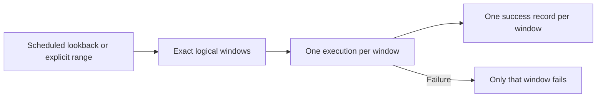
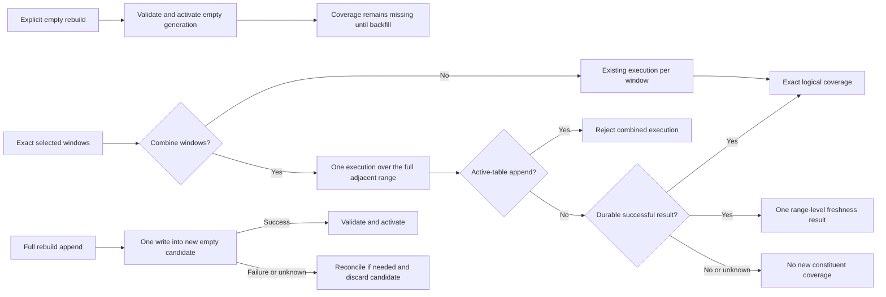

# Change Record: Combine adjacent pipeline windows

| Field | Value |
| --- | --- |
| Status | Plan reviewed |
| Type | Feature |
| Primary issue | [#666](https://github.com/eirhop/favn/issues/666) |
| Pull request | Pending |
| Related work | [#168](https://github.com/eirhop/favn/issues/168), [#531](https://github.com/eirhop/favn/issues/531), [#532](https://github.com/eirhop/favn/issues/532), [#538](https://github.com/eirhop/favn/issues/538) |
| Affected areas | Public pipeline DSL and guides, manifest/window contracts, planner, runner execution, freshness and coverage evidence, backfills, rebuilds, operator API/CLI, and View forms |
| Approved plan commit | Pending independent review |
| Last updated | 2026-08-25 |

## One-minute summary

Favn currently executes every selected logical window separately. That is useful
for small repairs, but it creates unnecessary runner work when a scheduled
lookback, historical backfill, or rebuild selects many adjacent windows. This
change lets a pipeline author or operator combine those windows into one wider
execution range while keeping the original daily, monthly, hourly, or yearly
coverage records. Freshness remains one conservative range-level result rather
than pretending one execution produced independent per-window lineage. It also
lets an operator activate a schema-valid empty rebuild generation and fill the
active table later with ordinary backfills. The feature crosses public,
execution, persistence, recovery, and UI boundaries, so its failure and coverage
rules need an independently reviewed plan.

## Impact

For a monthly pipeline selecting January through December:

- separate mode runs the pipeline once for each of the 12 monthly windows;
- combined mode runs one pipeline execution for `[January 1, next January 1)`;
- after that execution succeeds, coverage still shows 12 exact monthly periods.

An operator can use separate mode when small failure and retry units matter, and
combined mode when reducing repeated planning and setup work matters more. The
operator remains responsible for choosing a range the data engine and source can
handle. Favn will not invent an automatic number of batches in this change.

For a table that is too large to rebuild in one operation, an operator may
explicitly activate an empty replacement generation. The active table is then
empty and its expected windows are visibly missing until normal backfills fill
them.

## Problem analysis

The current pipeline selection already preserves all requested and effective
logical anchors. The planner then expands each anchor into one runtime node per
windowed asset. Operational backfills add one ledger window and one child run per
anchor, and rebuilds add one work item per expected window. A large exact range
therefore repeats pipeline and runner setup even when all selected assets can
safely read and write one contiguous range.

The required change is smaller than a general batching system. Favn needs one
boolean decision: either retain the current separate windows, or combine all
adjacent selected windows into one physical execution. Exact logical windows
remain the authority for coverage and later repair.

### Assumptions

- The public pipeline option is `combine_windows: true | false` inside the
  existing `window` declaration. It defaults to `false` so existing manifests
  keep their current behavior.
- `combine_windows: true` is an author promise that every selected windowed
  asset interprets the wider `start_at` and `end_at` correctly. This PR does not
  add a second per-asset capability DSL.
- A manual pipeline backfill may explicitly override the authored default. An
  omitted override uses the pipeline value.
- Scheduled lookback uses the authored pipeline value. A normal exact
  single-window run is unchanged because there is only one window to execute.
- A combined range is one freshness unit. Exact constituent coverage is
  published after success, but freshness and consumed-input lineage are recorded
  for the complete physical range. A later exact-window request may therefore
  run conservatively even when coverage already exists.
- Scheduled runs and targeted backfills reject combined mode when any planned
  asset uses `append`. Separate-window append remains unchanged.
- A full rebuild may combine `append` only when the item writes once into a new,
  empty, rebuild-owned candidate generation. A failed, cancelled, or unknown
  combined append candidate is never retried in place. Unknown outcomes are
  reconciled first; then the candidate is discarded and a new rebuild creates a
  new candidate.
- Rebuild planning defaults to combined mode for efficiency, but the operator
  may request separate windows.
- Empty rebuild is an explicit rebuild mode. It has no execution windows, so
  the combine choice has no effect in that mode.
- The View does not edit authored pipeline definitions. It only exposes
  operator choices on the existing pipeline-backfill and rebuild-plan forms.
- Combined mode is accepted only for a non-empty, contiguous pipeline selection
  with one kind and timezone. Each selected asset's expanded runtime windows
  must also form one contiguous range in that asset's authored grain. Existing
  exact missing-coverage asset backfills may be non-contiguous and remain
  separate in this PR.
- DuckDB and DuckLake are expected to stream or spill a large query according to
  their own execution behavior. Favn does not promise that every chosen range
  fits the available resources.
- Empty rebuild activates an empty root generation. Existing downstream targets
  may remain readable but become stale against the new root generation until an
  operator backfills the affected pipeline. The plan and UI must say this
  before activation.

### Evidence

| Evidence | What it proves | What it does not prove |
| --- | --- | --- |
| `apps/favn_core/lib/favn/window/policy.ex` | Pipeline window policy currently owns anchor, timezone, lookback, and full-load behavior, with no combine choice | How a wider runtime range should publish evidence |
| `apps/favn_core/lib/favn/assets/planner.ex` | Every effective anchor currently expands into separate per-asset runtime nodes | Safe SQL or Elixir behavior for an authored wider range |
| `apps/favn_orchestrator/lib/favn_orchestrator/backfills.ex` and `backfill_dispatcher.ex` | Backfills persist exact windows and dispatch one child run for each window | The final smallest persistence adaptation for one shared execution |
| `apps/favn_orchestrator/lib/favn_orchestrator/rebuilds.ex` | Windowed rebuilds currently create one item per expected anchor; an empty-generation item already exists when expected coverage is naturally empty | Operator-requested empty rebuild semantics |
| `apps/favn_runner/lib/favn/sql_asset/runtime.ex` | Existing empty-generation execution creates a typed candidate by wrapping the query with `WHERE FALSE` | Correct operator authorization and activation for a requested empty rebuild |
| `apps/favn_storage_postgres/lib/favn_storage_postgres/projections/projector.ex` and orchestrator coverage reads | Coverage is persisted and queried by exact logical window key, while freshness is keyed to one planned node and its consumed-input lineage | Safe exact coverage fan-out without inventing exact freshness lineage |
| `apps/favn_orchestrator/lib/favn_orchestrator/freshness/decider.ex` | `:missing` and manifest freshness currently decide one exact planned node at a time | Constituent decisions after several windows become one range node |
| Existing target-operation lock and rebuild candidate lifecycle | Combined active writes can exclude exact writes asymmetrically; rebuild candidates are isolated from the active generation | Lock renewal for a long combined write and no-reuse behavior for failed append candidates |
| `apps/favn_view/lib/favn_view/ui/field.ex` | The design system already provides an accessible checkbox input | Server-side validation and command semantics |
| Existing pipeline-backfill and rebuild-plan View forms | Both choices can be added to current screens without a new page or UI concept | Rendered accessibility and responsive behavior until tested |

## Current behavior

A trigger selects exact anchors. Backfill and rebuild orchestration keep those
anchors separate, the planner creates one windowed node for each asset and
anchor, and each successful materialization proves one exact coverage period.



## Approved plan

This section is the proposed baseline. It is not approved until the independent
plan review below has a passing verdict.

Favn will preserve the exact selected anchors and make one explicit execution
choice. Separate mode follows the existing path. Combined mode builds one
canonical range from the first selected start to the last selected end, plans
one DAG over that range, and retains the compact logical range description
needed to derive each constituent anchor. After a successful durable
materialization, Favn publishes exact coverage for each constituent window and
one freshness result for the complete physical range.

Illustrative authored default:

```elixir
window :monthly,
  anchor: :current_period,
  lookback: 1,
  combine_windows: true
```

For a July schedule occurrence, the effective monthly windows are June and
July. Separate mode executes `[June 1, July 1)` and `[July 1, August 1)`.
Combined mode executes `[June 1, August 1)` once and records June and July as
two exact logical coverage outcomes.



### Contracts and invariants

- Combining changes physical execution only. It never changes the authored
  window kind, timezone, selected bounds, expected-window count, or coverage
  keys.
- A combined execution range is half-open: `[first.start_at, last.end_at)`.
- The physical range identity includes both bounds, kind, and timezone. It must
  not collide with the first exact window's identity.
- Each combined asset node stores a compact immutable logical mapping in that
  asset's authored grain: kind, timezone, first bound, last bound, and logical
  count. Constituent windows are derived with the existing time-period rules
  rather than storing an unbounded duplicate list.
- That combined node owns one range-level freshness key and one consumed-input
  lineage. Exact coverage fan-out must not manufacture separate freshness
  versions or downstream input lineages for constituent windows.
- Planning rejects a non-contiguous, mixed-kind, mixed-timezone, empty, or
  otherwise incompatible combined selection before any run or rebuild mutation.
- The pipeline option is the authored promise of range-safe behavior. Favn can
  validate graph and window compatibility, but it cannot prove that arbitrary
  user SQL or Elixir code handles a wider range correctly.
- A combined SQL `delete_insert` replaces the complete selected range in one
  checked transaction. A confirmed rollback publishes no new constituent
  coverage. An unknown commit outcome is never blindly retried or projected as
  success before reconciliation confirms it.
- Combined `append` is unsupported for scheduled, ordinary, and targeted
  backfill writes into an active generation. Planning returns a bounded error
  naming the append asset and instructing the operator to use separate windows
  or a range-replacing strategy. Favn does not warn-and-continue or silently
  fall back.
- Full rebuild is the only combined-append exception. The action must own a new
  empty candidate generation, execute the complete range once, validate it, and
  activate it only after confirmed success. A failed or cancelled candidate is
  discarded. For an unknown outcome, reconciliation first proves the worker is
  no longer active or fences it from further writes, then always enters candidate
  cleanup—even if the append may have committed. It does not resume that action
  or activate that candidate. Retry cannot reset the failed item against the same
  candidate; the persisted combined-append plan makes generic retry return a
  conflict and set cleanup pending. After cleanup, the operator creates a new
  immutable rebuild plan and candidate.
- `:missing`, `:auto`, and manifest freshness apply to the combined range as one
  unit. Favn does not prune individual constituent windows or silently split or
  fall back. This may rerun a safely range-replaceable covered window; active
  append is rejected.
- One failed asset execution publishes no new logical-window successes for
  that asset. Existing evidence remains. Other assets that already completed
  successfully may retain their exact evidence under the existing partial-run
  semantics.
- Except for combined full-rebuild append, retry repeats the complete combined
  execution. This PR does not split a failed range automatically or after
  failure. Combined rebuild append requires cleanup followed by a new plan and
  candidate.
- A combined write and an overlapping exact write to the same target generation
  must serialize by extending both paths to participate in the existing coarse
  target-operation protocol. A combined active write acquires and renews the
  existing coarse lock for its complete asset lifecycle. Existing exact claims
  already reject an active lock, and combined lock acquisition rejects active
  exact claims, so exact writes do not also acquire the coarse lock. The public
  lock command/store contract gains the already schema-supported
  `:materialization` operation type; this PR adds no range-aware lock or
  lock-table migration.
- Combined backfill keeps the existing exact ledger rows but gives them one
  stable execution-group/leader identity in bounded metadata. Claim/restart uses
  that identity to submit at most one child run, and confirmed child completion
  transitions the complete group idempotently rather than one claimed row at a
  time. No new batch table or lifecycle is introduced.
- An explicit one-window repair remains available and behaves as it does today.
- Rebuild mode and combine choice are immutable inputs to the plan hash. Start
  and retry use the reviewed plan; they cannot silently change the mode. Existing
  idempotency matching treats different combine or empty-mode inputs as a
  conflict rather than returning an older incompatible plan.
- Empty rebuild creates and validates the candidate schema without copying
  historical rows, then activates it through the existing generation lifecycle.
  It never fills an inactive candidate through ordinary backfill. Schema and
  target-contract checks still run. Checks that require data rows are explicitly
  skipped with a bounded auditable reason instead of passing against no rows.
- After empty activation, ordinary backfills target the new active generation.
  Root coverage is `0 / expected` until successful backfills publish exact
  window evidence. Retained downstream generations are reported stale rather
  than falsely current.
- Empty activation remains an explicit, confirmed destructive operator choice.
  Failure before activation leaves the old active generation unchanged;
  activation with an unknown outcome uses existing reconciliation.
- UI controls are presentation only. The orchestrator validates authorization,
  booleans, defaults, plan immutability, and incompatible combinations for every
  caller.

### Scope

- Add `combine_windows` to the public pipeline window policy, manifest encoding,
  validation, rehydration, public docs, and `Favn.AI` routing.
- Make scheduled lookback plan either one range DAG or the existing per-window
  nodes based on the authored value.
- Add a nullable operator override to pipeline backfill API/CLI/View requests;
  omission uses the manifest default.
- Keep exact logical backfill window progress while associating all combined
  windows with one physical child execution.
- Make rebuild planning combined by default, with an explicit separate override.
- Add explicit empty rebuild planning, warning, validation, activation, and
  later active-generation backfill behavior.
- Publish exact coverage rows for every logical window proven by a successful
  combined asset materialization, plus one conservative range-level freshness
  result.
- Reject combined append for scheduled and targeted active-generation work.
  Permit it only for full rebuild work into a new empty candidate, with no
  in-place candidate retry after failure, cancellation, or unknown outcome.
- Keep the coverage summary/calendar at authored grain. A daily asset still
  shows days and a monthly asset still shows months; no physical-batch view is
  added.
- Add simple checkboxes to the existing pipeline-backfill and rebuild-plan View
  forms by reusing `FavnView.UI.input/1`. The backfill checkbox follows the
  authored default; the rebuild checkbox starts checked. Empty rebuild is an
  explicit rebuild-form choice, and selecting it disables the irrelevant
  combine control.
- Update operator CLI/API output with logical-window count, execution mode, and
  physical execution count (`1` when combined, otherwise the logical count).

### Non-goals

- No `N`-batch or maximum-windows-per-batch setting.
- No random, adaptive, size-based, or automatic batching.
- No automatic splitting of a failed combined execution.
- No automatic fallback to separate execution when active append is rejected.
- No separate historical-operation or historical-scope framework.
- No complete-history request without explicit start and end bounds.
- No per-asset range-capability declaration.
- No special execution-once pinning for non-windowed dependencies beyond what
  naturally happens in one combined DAG.
- No range-aware lock manager.
- No new coverage chart, batch-progress screen, or physical-batch lifecycle.
- No combined mode for non-contiguous missing-coverage asset repair in this PR.
- No promise that one very large range is the best operational choice. An
  operator may submit several explicit yearly ranges or choose separate mode.

### Implementation slices

| Slice | Outcome | Owner or area | Depends on |
| --- | --- | --- | --- |
| 1 | Authors can set and persist a validated `combine_windows` default | `favn`, `favn_authoring`, `favn_core` manifests/window policy | None |
| 2 | Planner creates a stable one-range DAG while preserving exact logical anchors | `favn_core` planner and plan/runtime contracts | 1 |
| 3 | Runs publish exact constituent coverage plus one truthful range freshness result; active append is rejected and long combined writes renew one coarse lock | orchestrator run planning, runner/materialization evidence, PostgreSQL projection | 2 |
| 4 | Pipeline backfill uses authored default or operator override and maps one physical execution to exact window progress | orchestrator backfill request, persistence, dispatcher | 2, 3 |
| 5 | Rebuild defaults to combined execution and supports reviewed empty-generation activation | orchestrator rebuild plan/dispatcher, runner generation execution | 2, 3 |
| 6 | CLI and public API carry, validate, and display the two boolean choices | `favn` CLI/Mix tasks, orchestrator facade/API | 1, 4, 5 |
| 7 | Existing View forms expose accessible checkbox choices without owning backend rules | `favn_view` LiveViews, page components, examples, tests | 6 |
| 8 | Canonical guides and cross-boundary scenarios explain and prove the final operator model | public guides, architecture/features docs, integration/acceptance tests | 1-7 |

### Complexity budget

The budget includes production code separately from tests, fixtures, examples,
and canonical documentation. It excludes this record, generated files,
dependency locks, vendored code, and formatter-only changes. Exact coverage
fan-out is intentionally smaller than inventing grouped exact freshness; the
range node retains one truthful freshness and input-lineage result.

| Slice | Production added | Production deleted | Supporting added | Supporting deleted | Main reason for the size |
| --- | ---: | ---: | ---: | ---: | --- |
| 1 | 120-220 | 10-50 | 180-300 | 0-40 | Public DSL, policy/manifest round trips, version fixtures, docs/types |
| 2 | 250-450 | 30-100 | 300-500 | Stable range identity, one-range planning, logical mapping and graph tests |
| 3 | 220-420 | 30-120 | 350-600 | Range freshness, exact coverage fan-out, active-append validation, renewable combined lock |
| 4 | 250-450 | 40-150 | 350-600 | Resumable one-execution/many-window dispatch and exact progress |
| 5 | 330-600 | 40-160 | 480-760 | Combined rebuild items, empty plan/activation, one-shot append candidate, stale downstream behavior |
| 6 | 120-240 | 20-80 | 180-320 | Request normalization, facade/HTTP payloads, CLI switches and output |
| 7 | 60-120 | 10-60 | 100-180 | Reused checkbox element, form defaults, events, component/LiveView examples |
| 8 | 30-80 | 0-30 | 250-400 | Canonical documentation and cross-boundary acceptance evidence |
| **Total** | **1,380-2,560** | **180-750** | **2,190-3,660** | **0-430** | One bounded cross-boundary feature, roughly 3,570-6,220 added lines including proof |

An actual slice outside its approved range requires an explanation when the
variance is more than 25% or 100 lines, whichever allowance is smaller.
Implementation pauses for renewed review if the contract requires a new generic
batch framework, a range-lock service, a per-asset capability DSL, a new
physical-batch persistence model, or production additions above the total upper
budget.

### Implementation map

| Concept | Expected code area | Responsibility |
| --- | --- | --- |
| Authored default | `apps/favn_authoring/`, `apps/favn_core/lib/favn/window/`, manifest modules | Validate, serialize, rehydrate, and version `combine_windows` |
| Physical range and logical mapping | `apps/favn_core/lib/favn/assets/` and plan/window contracts | Build one stable DAG without losing constituent windows |
| Safe execution evidence | runner results, orchestrator materialization/freshness code, PostgreSQL projector | Publish exact coverage and one range freshness only after confirmed success; reject active append; renew combined lock |
| Backfill choice | operator request, `Backfills`, dispatcher, persistence adapter | Resolve default/override and use a stable group leader to share one child execution across exact ledger windows |
| Rebuild and empty mode | `Rebuilds`, dispatcher, target-generation runner contracts | Freeze mode in plan, execute combined or empty candidate, activate/reconcile safely |
| Public operator surfaces | orchestrator facade/API, `apps/favn` CLI and Mix tasks | Normalize booleans and show mode/counts |
| Browser surface | `apps/favn_view` | Reuse checkbox input and send intent through the public facade |
| Canonical behavior | public authoring/operations guides, feature and rebuild architecture docs | Explain defaults, examples, limits, and recovery |

## Operational design

### Failures and recovery

Invalid booleans, incompatible logical windows, and unsupported combined graph
shapes fail during planning before work is persisted or dispatched. A confirmed
execution failure or rollback records no new constituent success for the failed
asset. The operator may retry the same complete range, choose separate mode in a
new operation, or manually divide a large historical job into several explicit
ranges. Combined full-rebuild append is the exception: it must clean up and use
a new plan and candidate rather than retrying the same operation. Successful
evidence from earlier independent operations remains valid.

Active-generation combined append fails during planning before dispatch. The
error names the bounded asset and selected range; Favn does not auto-fallback
because that would silently change the reviewed execution. Full rebuild append
writes once into its isolated empty candidate. Any non-success prevents
activation and makes that candidate non-retryable in place. For an unknown
outcome, reconciliation fences or confirms the worker inactive and always moves
to cleanup rather than resuming or activating. A new attempt starts from a new
immutable plan and candidate.

Combined active writes serialize with exact writes to the same target generation
by owning and renewing the existing coarse target lock through materialization.
Exact writes retain their current claim path and reject an active lock. A lost
write reply keeps the existing unknown-outcome behavior: do not fan out coverage
and do not retry blindly. Reconciliation must first determine whether the
materialization committed.

An empty rebuild uses the existing candidate-generation, validation, activation,
and reconciliation lifecycle. Before activation, failure leaves the old active
generation readable. After confirmed activation the root table is intentionally
empty, and rollback means another reviewed rebuild; normal backfills fill only
the active generation. The operator-facing plan and confirmation state that
downstream data may be stale until the affected pipeline is backfilled.

### Logs and diagnostics

| Event or state | Level or surface | Safe fields | Rate limit |
| --- | --- | --- | --- |
| Combined planning rejected | Planning/API error | Manifest, target, mode, bounded reason, logical count | Once per request |
| Active combined append rejected | Planning/API error | Target ID, range bounds, strategy | Once per request |
| Rebuild append candidate abandoned | Rebuild state, audit event, structured log | Operation/target/candidate IDs, bounded outcome class | Once per action |
| Combined execution started/completed | Run event and structured log | Run/target IDs, range bounds, kind, timezone, logical count | Once per asset attempt |
| Constituent evidence withheld | Run diagnostic | Run/target IDs, failure class, logical count | Once per failed or unknown attempt |
| Empty rebuild planned/activated | Immutable plan, View/CLI warning, audit event | Operation/target/generation IDs, empty mode, expected count | Once per command |
| Overlapping write waits or conflicts | Existing claim/lock diagnostic | Stable operation, target, and generation IDs | Existing contention policy |

Diagnostics never include rendered SQL, query parameters, credentials, customer
data, or arbitrary database exception text. They summarize a combined range
instead of logging one line per logical window.

### Deployment, migration, and compatibility

The pipeline window policy is part of the versioned manifest contract, so its
schema/version fixtures and canonical hashes must be updated. Old manifests
rehydrate with `combine_windows: false`. A manifest authored with the new option
requires a release that understands the new schema. Rollback uses a prior
compatible manifest and release; it must not reinterpret a persisted combined
operation as separate work.

No PostgreSQL schema migration is planned. Existing backfill metadata, rebuild
plan payloads/items, materialization payloads, target-level claims, renewable
locks, and candidate cleanup state carry the mode, logical range, and one-shot
append-rebuild rule. If implementation proves a new table or generic batch
lifecycle is required, that is a material plan deviation and requires renewed
review rather than silent expansion.

## Verification plan

| Acceptance criterion | Planned evidence | Owning layer |
| --- | --- | --- |
| Omitted authored option preserves separate behavior | Policy/manifest round-trip and old-fixture tests | `favn_authoring`, `favn_core` |
| Authored `true` makes a scheduled lookback one physical DAG | Planner tests for monthly, daily, hourly DST, and one-window selections | `favn_core` |
| Range identity includes both bounds and cannot collide with an exact window | Canonical identity and codec tests | `favn_core`, orchestrator snapshots |
| Operator omission uses pipeline default; checkbox/CLI override wins | Request/facade/backfill tests | orchestrator |
| Separate backfill still dispatches one child per logical window | Existing dispatcher regression tests | orchestrator/storage |
| Combined backfill dispatches one child while retaining exact window progress | Persistence/dispatcher restart and idempotency tests | orchestrator/PostgreSQL |
| One confirmed combined success proves every exact constituent window | Materialization/projector/coverage tests for monthly and daily grains | runner/orchestrator/storage |
| Combined success records one range freshness result and no invented exact input lineage | Freshness key, materialization claim, staleness, and projection tests | orchestrator/storage |
| Scheduled and targeted combined append are rejected before dispatch | Planner/request tests for pipeline and backfill paths | core/orchestrator |
| Full rebuild combined append writes once into a new empty candidate and may activate | Rebuild item, runner, validation, and activation tests | runner/orchestrator/PostgreSQL |
| Failed or cancelled rebuild append candidate is not retried in place | Retry conflict and cleanup tests | orchestrator/PostgreSQL |
| Unknown rebuild append outcome reconciles before candidate discard | Lost-reply reconciliation test | orchestrator/runner/PostgreSQL |
| Failed or unknown asset execution proves no new constituent windows | Transaction and lost-reply fault tests | runner/orchestrator/storage |
| Partial pipeline success remains asset-specific and truthful | Multi-asset run test | orchestrator |
| Overlapping exact and combined writes serialize safely | Claim/lock concurrency test | orchestrator/PostgreSQL |
| Combined lock renews beyond the original lease while exact claims remain excluded | Clock/lease ownership test | orchestrator/PostgreSQL |
| Rebuild defaults combined and explicit false retains separate items | Plan hash, item, dispatch, and restart tests | orchestrator |
| Rebuild idempotency conflicts when combine or empty mode differs | Same-key plan/retry tests | orchestrator/PostgreSQL |
| Empty rebuild activates an empty typed generation with `0 / N` root coverage | Runner plus rebuild lifecycle/coverage tests | runner/orchestrator/storage |
| Empty rebuild runs schema checks and explicitly skips data-dependent checks | Runner result and audit diagnostic tests | runner/orchestrator |
| Empty activation leaves retained downstream data explicitly stale until repair | Generation/freshness and operator read-model tests | orchestrator |
| Ordinary backfill after empty activation fills the active generation | End-to-end rebuild/backfill test | orchestrator/runner |
| CLI/API show mode and logical versus physical counts | Parser, payload, DTO, and output tests | `favn`, orchestrator API |
| View uses existing accessible checkbox controls and server defaults | Component, LiveView event, authorization, and design-system example tests | `favn_view` |
| Public behavior and limits are discoverable | Guide, module docs, `Favn.AI`, feature/rebuild architecture checks | docs and `favn` |
| No unrelated regressions | Format, warnings-as-errors compile, focused app suites, umbrella tests, then PR CI | repository-wide |

Source/static inspection and focused automated tests will prove the contracts.
PostgreSQL tests will prove persistence, idempotency, fan-out, and concurrency.
PR CI will provide broader qualification. Scale, memory use, spill behavior, and
live production operation are not proven by repository tests and must not be
claimed.

The View change will be rendered through `/design-system`, audited with
`window.favn.audit()`, and inspected at 390, 768, and 1440 widths. Dark and light
themes are checked if implementation changes any surface, border, or tone; none
is planned.

## Risks and open questions

| Risk or question | Impact | Mitigation or decision needed |
| --- | --- | --- |
| Authored SQL or Elixir handles one window but not a wider range | Missing or incorrect data despite a successful run | Treat `combine_windows: true` as an explicit author promise, document with examples, and keep default false |
| One combined range is too large | Slow execution, disk pressure, or timeout | Operator chooses separate mode or submits several explicit ranges; no automatic batching in this PR |
| Evidence is fanned out before a write is known committed | Coverage lies | Project constituent windows only from confirmed durable success; unknown outcomes require reconciliation |
| Exact coverage is mistaken for exact freshness | Downstream work may be skipped against lineage it did not consume | Store one range freshness/input lineage; accept conservative extra execution for later exact requests |
| Append writes into an active or reused candidate generation | Duplicate rows | Reject active combined append; permit rebuild append only into a new empty candidate that is never retried in place |
| Existing identity assumes one exact window | Exact and combined executions could collide | Add a canonical physical range identity containing both bounds and qualify all codecs/hashes |
| Coarse target serialization reduces concurrency | Exact repair waits behind a long combined run | Accept the simpler safe lock for v1 and expose the waiting/conflict diagnostic |
| Empty activation surprises an operator | Active table is intentionally empty and downstream may be stale | Explicit immutable plan mode, warning, checked confirmation, and visible `0 / N` coverage |
| Large logical counts create oversized payloads | Persistence or event limits could be exceeded | Persist compact range metadata and derive bounded exact anchors with the existing 10,000-window limit |
| A pipeline finishes partially | Different assets have different coverage | Keep evidence asset-specific; failed assets publish nothing new and operator views retain partial status |

No product decision remains open in this planning draft. Independent review must
still challenge whether the existing persistence and target-claim contracts can
meet the plan without a new generic batching model.

## Plan review

| Field | Result |
| --- | --- |
| Reviewer | Independent sub-agent (`plan_review`) |
| Reviewed against | Issue #666, current code, architecture/change-record guidance, and this plan |
| Findings | Initial review stopped on unsafe exact-freshness fan-out and undefined append behavior. Re-review stopped because an overlap guard based on asynchronously projected coverage could miss a committed append. Small findings requested explicit grouped backfill persistence, renewable lock ownership, asymmetric exact-write locking, empty-rebuild checks, idempotency inputs, and a smaller budget. |
| Findings addressed and rechecked | Exact constituent evidence is coverage-only; freshness and input lineage stay range-level. Active combined append is rejected. Full rebuild append is isolated to a new empty candidate that is never retried in place. Combined active writes renew the coarse lock while exact writes keep their current claim protocol. The remaining small contracts and reduced budget are recorded. The reviewer re-read the corrected issue and record and reported no remaining findings. |
| Verdict | Approved on 2026-08-25 |

---

The sections below are completed during implementation and before final review.

## Implementation outcome

Pending.

### Actual scope and complexity

- Files and ownership areas changed: Pending.
- Ownership boundaries affected: Pending.
- Implementation complexity: Pending.
- Operational complexity: Pending.
- Canonical documentation updated: Pending.
- Actual additions, deletions, and supporting lines per approved complexity-budget slice: Pending.

## Deviations from the approved plan

Pending implementation.

## Decision log

Pending implementation.

## Verification evidence

| Check | Result | Evidence boundary |
| --- | --- | --- |
| Focused tests | Pending | Automated qualification, not live proof |

### Not verified

- Implementation, tests, CI, live scale, and production behavior are not yet verified.

## Final review

| Field | Result |
| --- | --- |
| Reviewer | Pending independent person or agent |
| Compared | Approved plan, implementation, tests, diagnostics, and docs |
| Deviations complete | Pending |
| Findings | Pending |
| Findings addressed and rechecked | Pending |
| Verdict | Pending |
