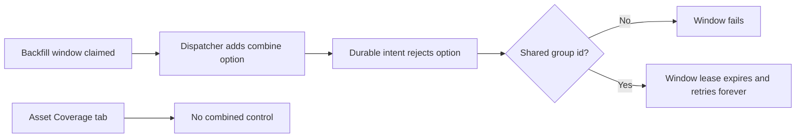
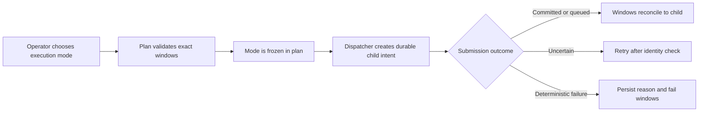

# Change Record: Combined backfill regression repair

| Field | Value |
| --- | --- |
| Status | Plan reviewed |
| Type | Bug fix |
| Primary issue | [#670](https://github.com/eirhop/favn/issues/670) |
| Pull request | Pending |
| Related work | [Issue #666](https://github.com/eirhop/favn/issues/666), [PR #667](https://github.com/eirhop/favn/pull/667) |
| Affected areas | Durable run submissions, backfill recovery, asset coverage backfills, pipeline and asset backfill forms |
| Approved plan commit | Pending independent review |
| Last updated | 2026-08-25 |

## One-minute summary

Current main rejects every child submission created by the backfill dispatcher
because the dispatcher sends the new `combine_windows` option but the durable
submission intent does not allow it. Separate-window backfills fail immediately,
while combined backfills keep reclaiming their grouped windows and appear queued
forever. This repair aligns the durable option contract, terminally records
deterministic submission failures, proves both separate and combined dispatch
against PostgreSQL, and finishes the operator forms with one shared Combine
windows control on pipeline and asset coverage backfills.

## Impact

No backfill window can currently create its durable child submission on current
main. For example, a three-month combined pipeline backfill remains pending with
idle runners because every attempt fails before a run or runner task exists. A
normal one-window asset backfill is also affected even when combined mode is off.

## Problem analysis

The dispatcher always includes `combine_windows`, defaulting to `false`.
`RunSubmissions` correctly retains that semantic option, but the durable intent
codec rejects it because its option allowlist was not updated. Recovery then
uses only the presence of a shared execution-group id to choose retry, so the
known validation error loops for combined windows instead of becoming durable
failure evidence.

The asset Coverage tab has a second gap: it has no combined-mode control, and
the exact missing-window backend path currently rejects combined execution.
Because selected missing windows may be non-contiguous, combined mode must use
the existing planner validation and fail clearly for an incompatible selection.

### Assumptions

- `combine_windows` is semantic run-planning input and belongs in the durable
  intent allowlist.
- A persistence error explicitly marked retryable is a transient or uncertain
  outcome; a validation atom such as `:invalid_run_submission_intent` is
  deterministic.
- Asset coverage combined mode is supported only when the selected exact windows
  satisfy the existing combined planner rules, including contiguity and append
  restrictions.
- Asset coverage defaults to separate execution (`combine_windows: false`).
  Changing the checkbox after a plan was reviewed invalidates that plan and
  requires planning again.
- The chosen coverage execution mode is part of the reviewed immutable plan and
  cannot change only at submission time.

### Evidence

| Evidence | What it proves | What it does not prove |
| --- | --- | --- |
| `BackfillDispatcher.submission_options/4` always includes `combine_windows` | Every child submission carries the option | Whether the durable codec accepts it |
| `RunSubmission.Intent.@option_keys` omits `:combine_windows` | `Intent.new/3` deterministically rejects the dispatcher options | Persistence and UI symptoms by itself |
| Current dispatcher disposition retries every proven-missing grouped identity | A deterministic grouped error is reclaimed indefinitely | Whether a write actually committed |
| Asset coverage submits through `Backfills.submit_asset_windows/5`, which rejects combined mode | A View-only checkbox would be a dead control | Whether a selected set is safe to combine |
| Existing asset planner rejects non-contiguous combined anchors and combined append | The core validation already exists and can be reused | End-to-end coverage wiring |

## Current behavior

## Approved plan

Add the missing boolean to the durable intent contract and prove both values
round-trip. Pass the original submission error into recovery classification:
unknown recovery reads and explicitly retryable persistence outcomes retry;
deterministic errors terminally fail the window and persist a bounded reason,
regardless of grouping.

For asset coverage, freeze `combine_windows` into the immutable plan and its
hash. Revalidate the same mode on submission and route exact anchors through the
existing asset planner. Non-contiguous selections or append materializations are
rejected before a backfill ledger is created. The View uses one shared styled
checkbox component, labeled `Combine windows`, in both forms, with concise help
available on hover and keyboard focus.

### Contracts and invariants

- Both `combine_windows: false` and `combine_windows: true` round-trip through
  the durable submission intent.
- A deterministic child-submission error never loops because windows share an
  execution-group id: every grouped row becomes terminal with the same bounded
  reason, no child submission exists, and later claims find no retryable rows.
- An unavailable recovery read remains unknown and is not converted into a safe
  terminal failure.
- A transient persistence result retries only when it is explicitly marked
  retryable.
- Separate mode creates one child submission per logical window; combined mode
  creates one shared child submission and every grouped row references it.
- The coverage plan hash includes execution mode, so plan review and submission
  cannot disagree.
- Combined asset coverage reuses existing contiguity and append safety checks.
- View code calls only the public orchestrator facade.

### Scope

- Durable intent option allowlist and round-trip tests.
- Backfill submission failure classification and durable error evidence.
- PostgreSQL-backed dispatcher tests for a normal asset backfill and a combined
  pipeline backfill.
- Combined exact-window asset coverage planning and submission.
- Public orchestrator facade documentation for the coverage execution option,
  its separate default, and its contiguity and append restrictions.
- Shared Combine windows checkbox, asset Coverage integration, and pipeline form
  layout cleanup.

### Non-goals

- Automatic batch splitting or parallel batch-count controls.
- Supporting non-contiguous combined selections.
- Changing rebuild behavior or append safety rules.
- New persistence tables or migrations.
- Automatic retry of deterministic validation or admission failures.

### Implementation slices

| Slice | Outcome | Owner or area | Depends on |
| --- | --- | --- | --- |
| 1 | Durable child intents accept combined mode and failures classify by reason | `favn_orchestrator` submission and dispatcher | None |
| 2 | Asset coverage freezes and validates combined mode | `favn_orchestrator` coverage/backfills | 1 |
| 3 | Both operator forms use one polished checkbox and clear layout | `favn_view` | 2 |
| 4 | Real PostgreSQL dispatch proves exact child cardinality and reconciliation | `favn_storage_postgres` tests | 1, 2 |

### Complexity budget

| Slice | Production added | Production deleted | Supporting added | Supporting deleted | Main reason for the size |
| --- | ---: | ---: | ---: | ---: | --- |
| 1 | 10-35 | 5-25 | 35-90 | 0-20 | Allowlist plus explicit deterministic/uncertain classification |
| 2 | 35-90 | 10-40 | 70-170 | Immutable plan hashing, revalidation, and asset planner reuse |
| 3 | 45-120 | 20-100 | 60-160 | Shared accessible control and two form flows |
| 4 | 0 | 0 | 80-180 | PostgreSQL lifecycle integration proof |

A slice requires explanation if it exceeds its upper addition estimate by more
than 25 percent or 100 lines, whichever is smaller. The record itself and
formatter-only changes are excluded.

### Implementation map

| Concept | Expected code area | Responsibility |
| --- | --- | --- |
| Durable intent | `favn_orchestrator/run_submission/intent.ex` | Allow and round-trip the semantic boolean |
| Dispatcher recovery | `favn_orchestrator/backfill_dispatcher.ex` | Separate uncertain retry from deterministic failure |
| Coverage plan | `favn_orchestrator/coverage.ex`, `backfills.ex` | Freeze mode and validate exact asset anchors |
| Public facade | `favn_orchestrator.ex` | Document the coverage option, default, and validation errors |
| Operator forms | `favn_view/ui`, asset and pipeline detail | Reuse one accessible styled control and clean layout |
| Integration proof | `favn_storage_postgres/test/storage_v2` | Exercise real child submission persistence and grouped reconciliation |

## Operational design

### Failures and recovery

An unavailable recovery read remains retryable because the system cannot prove
whether the child identity exists. An explicitly retryable persistence error may
be retried after the identity lookup. All other errors are treated as
deterministic: the claimed window transitions to failed with a bounded safe
reason. Repeated transition commands remain fenced and idempotent through the
existing backfill store.

### Logs and diagnostics

| Event or state | Level or surface | Safe fields | Rate limit |
| --- | --- | --- | --- |
| Deterministic child submission failure | Backfill window error/read model | Bounded stable reason | Once per window terminal transition |
| Unknown recovery read | Existing dispatch telemetry | Workspace id, operation, persistence error kind | Once per dispatch attempt |
| Invalid combined coverage selection | Existing operator form error | Stable mapped error label | Once per operator request |

### Deployment, migration, and compatibility

No migration is required. The new intent option is additive to the existing v1
allowlist and already exists in current-main backfill metadata. Rollback restores
the regression, so the safe rollback is the prior release only after outstanding
backfills are stopped or this fix remains deployed.

## Verification plan

| Acceptance criterion | Planned evidence | Owning layer |
| --- | --- | --- |
| Both boolean values survive intent encoding | Focused intent round-trip tests | Orchestrator |
| Deterministic grouped error stops the backfill | Dispatcher unit and PostgreSQL test proving all rows terminal with the bounded reason, no child submission, and no later reclaim | Orchestrator/storage |
| Uncertain reads and explicitly retryable writes still retry | Dispatcher classification tests | Orchestrator |
| Normal asset backfill creates one child submission | PostgreSQL dispatcher integration test | Storage/orchestrator |
| Combined pipeline creates exactly one child and all rows reference it | PostgreSQL dispatcher integration test | Storage/orchestrator |
| Coverage mode is frozen, revalidated, and rejects non-contiguous selection | Coverage and backfill tests | Orchestrator |
| Asset and pipeline forms share the control and submit the selected mode | Component and LiveView tests for default unchecked, checked, and mode change invalidating an existing plan | View |
| Form remains usable at mobile and desktop widths | `/design-system` audit and visual inspection | View |
| No broader regression | App suites, warnings-as-errors compile, Dialyzer, CI | Repository |

Static and automated evidence does not prove behavior in the user's external
project. That remains a post-merge deployment check.

## Risks and open questions

| Risk or question | Impact | Mitigation or decision needed |
| --- | --- | --- |
| Coverage selection contains gaps | One physical range would imply work the operator did not select | Reject through existing planner contiguity validation |
| Submission write returns an ambiguous persistence error | Blind retry could duplicate work | Re-read run and submission identities before retrying |
| UI exposes a mode backend does not honor | Misleading operator control | Freeze mode in plan and prove facade calls in LiveView tests |
| Form cleanup grows into a redesign | Delays urgent regression repair | Reuse existing elements and limit changes to the backfill form |

## Plan review

| Field | Result |
| --- | --- |
| Reviewer | Independent `regression_plan_review` agent |
| Reviewed against | Issue #670, the supplied regression report, current main, source evidence, and this plan |
| Findings | A new issue was required; Coverage default and plan invalidation were unspecified; grouped deterministic proof covered only one row; public facade docs were omitted |
| Findings addressed and rechecked | Yes; issue #670 now owns the repair and every plan omission was corrected and rechecked |
| Verdict | Approved with no remaining findings |

---

The implementation outcome, deviations, verification evidence, and final review
will be completed before the pull request is marked ready.
