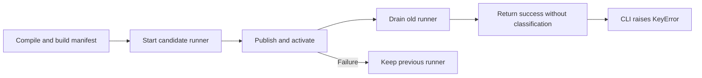
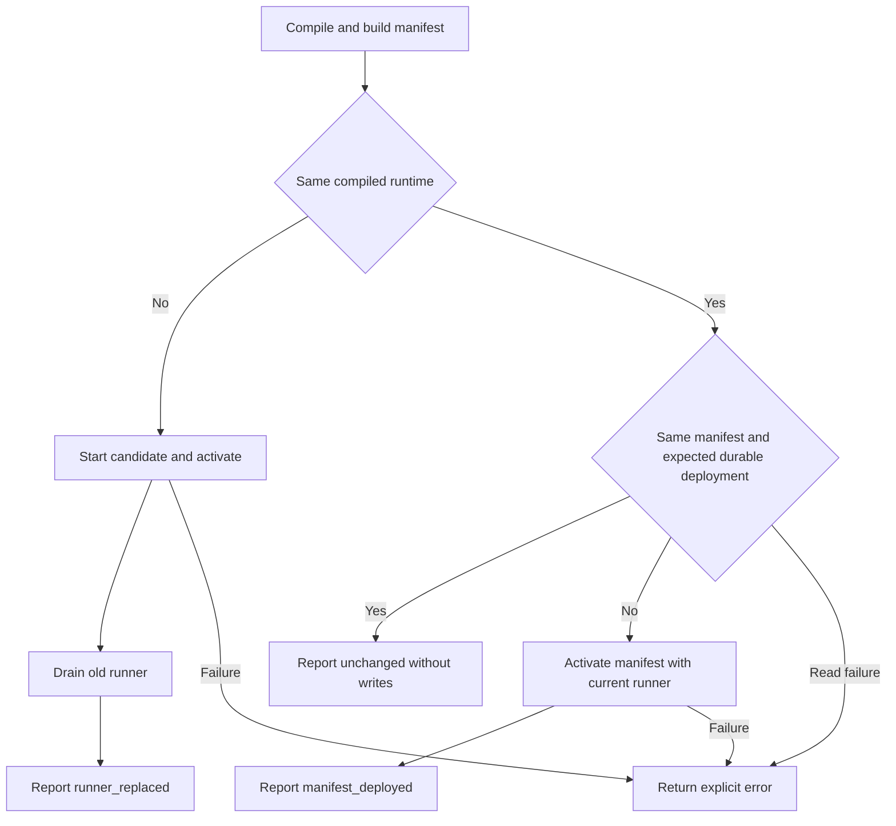

# Change Record: Reliable incremental local reloads

| Field | Value |
| --- | --- |
| Status | Implemented |
| Type | Bug fix |
| Primary issue | [#691](https://github.com/eirhop/favn/issues/691) |
| Pull request | [#698](https://github.com/eirhop/favn/pull/698) |
| Related work | #648 covers production release planning, outside this change |
| Affected areas | favn_local lifecycle and favn Mix task |
| Approved plan commit | `d36081ee160c453b0207d1edab595783d296aa3b` |
| Last updated | 2026-09-04 |

## One-minute summary

Local reload currently finishes deployment and drains the old runner, then the
command crashes while printing a missing result field. The runtime also replaces
the runner on every reload, including unchanged input. Restore the documented
three outcomes and make successful command reporting reliable. This changes
lifecycle decisions across the local runtime and CLI boundary.

## Impact

Developers see a failure after a successful state change and pay for unnecessary
starting a new runner and manifest activation. Reload must report what changed
without rerunning assets or discarding the active development session.

## Problem analysis

Commit `dfe235ce` removed the incremental branches and `reload_status` from the
runtime while the command continued requiring it. This remains in rc.13 and
current main. Acceptance coverage calls the lower-level reload function and
does not exercise the command's success output.

### Assumptions

- Dependency, environment, plugin, and configuration changes still need stop/start.
- The compiled BEAM closure remains the source runner identity.
- Only one reload request may change local lifecycle state at a time.
- Durable active deployment identity must qualify an unchanged result.

### Evidence

| Evidence | What it proves | What it does not prove |
| --- | --- | --- |
| `apps/favn/lib/mix/tasks/favn.reload.ex:28` | Successful output requires a missing field | Current user process health |
| `apps/favn_local/lib/favn_local/development_runtime.ex` | Every reload launches a candidate; completion omits classification | Cost at customer scale |
| `apps/favn_local/test/acceptance/docker_free_local_lifecycle_test.exs` | Existing test exercises replacement and failure below the CLI | All command outcomes |

## Current behavior

## Approved plan

Classify reload from compiled runtime identity, manifest content, and the durable
active deployment. Keep the last successful publication and deployment separate
from the requested publication until activation succeeds. Perform durable checks
and deployment in the existing supervised task so the lifecycle process remains
responsive. Use one typed successful result contract with all three outcomes.

### Contracts and invariants

- Success includes `reload_status`, deployment/manifest/runner identities,
  readiness, package counts, phase timings, and total elapsed time.
- Unchanged means no publication, activation, or runner launch; package,
  publication, activation, and deployment timings are zero.
- Manifest-only changes preserve the runner and use normal deployment validation.
- Replacement preserves current candidate registration and exact-release draining.
- Only successful activation updates the cached successful publication/deployment.
- A durable read failure returns an error rather than starting a speculative write.
- Concurrent reloads are rejected while work is pending. While any previous runner is still retiring, reject all reloads so its exit
  cannot complete a different request.
- RPC/task failure is not permission to retry a possibly completed deployment.
- Abort/stop detaches the superseded task monitor and request. Late task results
  cannot update another request or crash the ready runtime. Aborting during an
  in-flight deployment reports an explicit unknown outcome and leaves lifecycle
  failed, blocking further reloads until explicit stop/start. Detaching a monitor
  does not cancel the durable write; no later reload may race it.
- CLI rendering tolerates the reported legacy successful map without inventing a
  classification; current producers must return the full contract.

### Scope and non-goals

Local development only. No production release planning, persistence schema
changes, asset invalidation, automatic reruns, generalized lifecycle rewrite, or
arbitrary performance threshold.

### Implementation slices and complexity budget

| Slice | Outcome and owner | Production added | Production deleted | Supporting added | Supporting deleted |
| --- | --- | ---: | ---: | ---: | ---: |
| 1 | Runtime classification, successful state, and typed result in favn_local | 140-260 | 15-70 | 100-220 | 0-35 |
| 2 | CLI reporting and actual command acceptance coverage in favn/favn_local | 10-45 | 0-20 | 150-300 | 0-30 |
| 3 | Canonical local guide, AI routing, and ownership map | 0 | 0 | 20-55 | 5-30 |

Supporting counts include tests, fixtures, and canonical docs, excluding this
record, generated files, locks, and formatting-only changes. Explain overruns
above 25 percent or 100 lines, whichever is smaller, and materially fewer
deletions. Lifecycle failure coverage and actual CLI execution account for most
of the supporting budget.

### Implementation map

| Concept | Area | Responsibility |
| --- | --- | --- |
| Reload decision and successful state | `favn_local/development_runtime.ex` | Serialize lifecycle transitions |
| Durable deployment check | `favn_local/publication.ex` | Use public orchestrator manifest facade |
| Successful result | `favn_local/reload_result.ex`, `favn_local.ex` | Typed result and elapsed/build timing |
| CLI output | `mix/tasks/favn.reload.ex` | Report success and phases |

## Operational design

Existing candidate failure preserves the prior runner. Manifest-only failure
must also preserve the previous successful baseline. Unknown activation outcomes
remain explicit errors; a later explicit reload checks durable state. Reject any
new reload while a previous runner still drains so retirement cannot complete
an unrelated deployment request. A fallback success message handles an older running operator
that omits the classification; it does not retry or restart anything.

No migration or production rollout is needed. Stop/start is required when
upgrading Favn itself so the operator loads the new lifecycle implementation.
Rollback restores the previous code after stop/start; durable data is unchanged.
CLI diagnostics contain classification, existing IDs, phase milliseconds, and
the total duration once per request. No new credentials or payload logging.

## Verification plan

| Acceptance criterion | Planned evidence | Owning layer |
| --- | --- | --- |
| Missing status no longer crashes output | Exact reported successful-map regression | CLI |
| All three command outcomes succeed | Execute actual Mix task; an already-compiled provider reads fixture input for manifest-only changes, and a separate BEAM edit proves replacement | Acceptance |
| No-op does no deployment work | Same durable deployment and runner; zero write phases | Local runtime |
| Manifest-only keeps runner | Changed durable deployment, same runner | Acceptance |
| External drift is restored | Deploy another identity, reload, inspect durable identity | Acceptance |
| Failure does not corrupt successful baseline | Failed publication then unchanged reload; existing candidate failure coverage | Acceptance |
| Retiring and stale task messages cannot complete another request | Deterministic callback tests for retirement overlap, abort/stop, late replies, and admission blocked after an unknown outcome | Local runtime |
| Runtime/UI stays usable | Readiness and HTTP checks after success | Acceptance |
| Timing interpretation | Record controlled fixture output, no global speed threshold | Acceptance and guide |

Run the narrow owning checks first, then relevant fast/acceptance coverage,
format, warnings-as-errors compilation, tag guard, Credo and Dialyzer. Use a
disposable PostgreSQL test database. Report CI separately from local tests and
do not claim verification of the user's running workspace.

## Risks and open questions

| Risk | Impact | Mitigation |
| --- | --- | --- |
| Cached state hides external activation | Incorrect no-op | Read durable active identity on no-op candidates |
| Failed request poisons manifest cache | Later reload misclassified | Commit baseline only after success |
| Reload overlaps a retiring runner | Lost ownership or completion of the wrong request | Reject all reloads until retirement completes; deterministic callback regression |
| In-process tests skip CLI compile/output | Regression escapes | Exercise real command plus focused rendering regression |
| Concurrent external activation | Durable state can change after read | No-op qualifies at read time; ordinary deployment retains orchestrator conflict checks |

## Plan review

| Field | Result |
| --- | --- |
| Reviewer | Independent agent `review_reload` |
| Reviewed against | Issue #691, source, lifecycle handlers, supervisor ownership, and tests |
| Findings | Retirement overlap could complete the wrong request; detached tasks could still activate; manifest-only fixture must avoid BEAM changes |
| Corrections | Reject all reloads while retiring; fail and require stop/start after interrupted activation; ignore stale messages; use an external-input fixture |
| Recheck | Reviewer re-read both corrections and confirmed the ownership policy |
| Verdict | Approved, no remaining blocking plan findings |

## Implementation outcome

Reload now returns one typed successful map with the expected classification,
identities, timings, and runtime summary. Unchanged input checks the durable
active deployment and skips writes. Manifest-only input deploys with the current
runner, and compiled changes preserve candidate registration and release draining.
The CLI prints all three outcomes and tolerates the originally reported successful
map without a classification.

Only successful completion advances the local publication/deployment baseline.
Retirement blocks reload admission. Interrupted activation, task death, and
returned unknown activation errors require stop/start. Read-only check errors
remain ordinary failures. Stale task results cannot complete a later request or
replace the shutdown task. The resulting flow matches the approved diagram.

### Actual scope and complexity

Production changes are confined to the local runtime/publication/result boundary
and the public Mix command. Persistence and runner protocol owners are unchanged.
Implementation complexity is moderate because reload has three paths and must
preserve asynchronous ownership. Operational complexity is low: no migration,
new configuration, dependency, or production deployment step is introduced.
Canonical updates are the local-development guide, its AI router pointer, and
the local app ownership map.

| Slice | Production added | Production deleted | Supporting added | Supporting deleted |
| --- | ---: | ---: | ---: | ---: |
| 1: local runtime/result and focused fixtures | 197 | 16 | 127 | 0 |
| 2: command and end-to-end acceptance | 20 | 6 | 188 | 4 |
| 3: canonical documentation and AI pointer | 0 | 0 | 27 | 3 |

Counts are from the implementation diff against baseline, excluding this record.
All additions are within the approved ranges; no material complexity overrun.
The documentation needed three deleted lines rather than the estimated five
minimum; the stale lifecycle and runner ownership statements were still removed.

## Deviations from the approved plan

No behavior deviations. Review refined the explicit unknown-outcome cases and
made stale-message proof deterministic without changing scope or the approved
lifecycle policy. The Impact paragraph was reworded after CI rejected a legacy
phrase in ordinary prose; its meaning and the approved baseline remain unchanged.

## Decision log

| Date | Decision | Reason | Review |
| --- | --- | --- | --- |
| 2026-09-04 | Reword the Impact paragraph after the legacy-symbol CI guard matched ordinary prose | Documentation terminology only; no semantic plan change | Confirmed no semantic change |
| 2026-09-04 | Wrap only activation-stage persistence errors of kind internal/unavailable as unknown | The orchestrator already classifies these errors as unknown; a failed durable read must not imply a write occurred | Independently reviewed |
| 2026-09-04 | Use a compiled fixture provider reading a text file and compile a separate fixture BEAM for replacement | Proves manifest-only and compiled-runtime changes independently through the actual command | Independently reviewed |
| 2026-09-04 | Combine real stop/interruption acceptance with direct stale-message callbacks | Supervisor teardown can precede a delayed task reply; callbacks make shutdown task ownership proof deterministic | Independently reviewed |

## Verification evidence

| Check | Result | Evidence boundary |
| --- | --- | --- |
| Format and warnings-as-errors compile | Passed | Local static/build qualification |
| `favn_local` fast tests | 40 passed, 2 excluded | Includes new lifecycle error, retirement, and shutdown task ownership cases |
| `favn` fast tests | 184 passed, 3 excluded | Includes exact missing-status success rendering regression |
| Docker-free lifecycle acceptance | Passed in 44.5 seconds | Real PostgreSQL, runner processes, actual Mix command subprocesses, durable deployment identity, UI HTTP readiness, failed publication recovery, and stop interruption |
| Credo warning checks, strict | Passed, 1397 files, no issues | Same Credo gate as CI |
| Test tier and legacy architecture/DSL guards | Passed | Same source guards as CI; new acceptance coverage is in a CI-covered app |
| Git diff whitespace | Passed | Local diff check |
| GitHub Mermaid rendering | Both diagrams rendered without errors in the pushed approved plan and renamed record | Browser-verified before implementation |
| Dialyzer | Passed, exit 0, three configured skips | Local type analysis with cached test PLT; no new unignored errors |
| GitHub CI and image qualification | Acceptance and generic runner qualification passed for `397bff4e`; Quick checks rejected prose in this record, now corrected locally | Remaining jobs and the final documentation update need their own hosted result |

The test database was disposable and isolated from normal development data.
Setup used repository PostgreSQL tooling and the restricted runtime grants from
CI. An initial bootstrap-role acceptance attempt was rejected by runtime
preflight; applying the CI runtime-role setup resolved that environment mismatch.
A concurrent build attempt caused transient missing BEAM files; subsequent
compilation and runtime verification ran sequentially. The local legacy guard
was checked with two pre-existing ignored crash dumps temporarily moved out of
its scan roots, then restored; those artifacts are absent from Git and CI.

### Controlled fixture timings

All values are milliseconds from the successful 44.5-second acceptance run.
Totals exclude the preceding Mix compilation and are observations for a small
fixture, not customer-scale performance claims.

| Outcome | Build | Packages | Publish | Activate | Total |
| --- | ---: | ---: | ---: | ---: | ---: |
| Unchanged | 120 | 0 | 0 | 0 | 604 |
| Manifest deployed | 193 | 3 | 23 | 50 | 839 |
| Runner replaced | 177 | 3 | 16 | 36 | 2279 |

### Not verified

- The user's running workspace and workload were not changed or rerun.
- No production deployment, scale benchmark, or asset rematerialization was performed.
- Hosted CI and container qualification are separate from the completed local checks.

## Final review

| Field | Result |
| --- | --- |
| Reviewer | Independent agent `review_reload` |
| Compared | Approved baseline `d36081ee160c453b0207d1edab595783d296aa3b`, implementation `397bff4e`, final record, tests, logs, diagnostics, and canonical docs |
| Deviations complete | Yes; no behavior deviations, nonsemantic Impact wording correction confirmed |
| Findings | Returned unknown activation errors and deterministic shutdown ownership proof needed correction |
| Findings addressed and rechecked | Both corrections and every prior finding rechecked; stale-result/DOWN callback regression resolves final test finding |
| Complexity | Production and supporting changes remain within approved budgets |
| Verdict | Approved; no remaining actionable findings. Approval covers implementation and local verification; hosted CI remains separate qualification |
