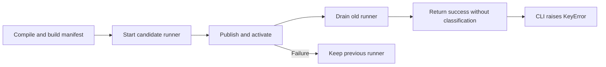
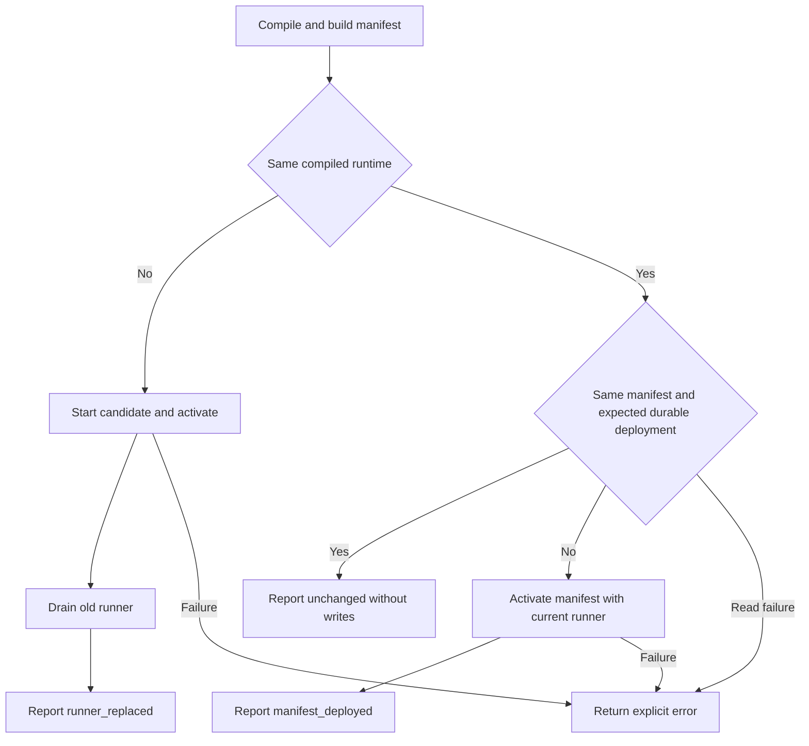

# Change Record: Reliable incremental local reloads

| Field | Value |
| --- | --- |
| Status | Implementing |
| Type | Bug fix |
| Primary issue | [#691](https://github.com/eirhop/favn/issues/691) |
| Pull request | [#698](https://github.com/eirhop/favn/pull/698) |
| Related work | #648 covers production release planning, outside this change |
| Affected areas | favn_local lifecycle and favn Mix task |
| Approved plan commit | `d36081ee160c453b0207d1edab595783d296aa3b` |
| Last updated | 2026-09-04 |

## One-minute summary

Local reload currently finishes deployment and drains the old runner, then the
command crashes while printing a missing result field. The runtime also replaces
the runner on every reload, including unchanged input. Restore the documented
three outcomes and make successful command reporting reliable. This changes
lifecycle decisions across the local runtime and CLI boundary.

## Impact

Developers see a failure after a successful state change and pay for unnecessary
runner replacement and manifest activation. Reload must report what changed
without rerunning assets or discarding the active development session.

## Problem analysis

Commit `dfe235ce` removed the incremental branches and `reload_status` from the
runtime while the command continued requiring it. This remains in rc.13 and
current main. Acceptance coverage calls the lower-level reload function and
does not exercise the command's success output.

### Assumptions

- Dependency, environment, plugin, and configuration changes still need stop/start.
- The compiled BEAM closure remains the source runner identity.
- Only one reload request may change local lifecycle state at a time.
- Durable active deployment identity must qualify an unchanged result.

### Evidence

| Evidence | What it proves | What it does not prove |
| --- | --- | --- |
| `apps/favn/lib/mix/tasks/favn.reload.ex:28` | Successful output requires a missing field | Current user process health |
| `apps/favn_local/lib/favn_local/development_runtime.ex` | Every reload launches a candidate; completion omits classification | Cost at customer scale |
| `apps/favn_local/test/acceptance/docker_free_local_lifecycle_test.exs` | Existing test exercises replacement and failure below the CLI | All command outcomes |

## Current behavior

## Approved plan

Classify reload from compiled runtime identity, manifest content, and the durable
active deployment. Keep the last successful publication and deployment separate
from the requested publication until activation succeeds. Perform durable checks
and deployment in the existing supervised task so the lifecycle process remains
responsive. Use one typed successful result contract with all three outcomes.

### Contracts and invariants

- Success includes `reload_status`, deployment/manifest/runner identities,
  readiness, package counts, phase timings, and total elapsed time.
- Unchanged means no publication, activation, or runner launch; package,
  publication, activation, and deployment timings are zero.
- Manifest-only changes preserve the runner and use normal deployment validation.
- Replacement preserves current candidate registration and exact-release draining.
- Only successful activation updates the cached successful publication/deployment.
- A durable read failure returns an error rather than starting a speculative write.
- Concurrent reloads are rejected while work is pending. While any previous runner is still retiring, reject all reloads so its exit
  cannot complete a different request.
- RPC/task failure is not permission to retry a possibly completed deployment.
- Abort/stop detaches the superseded task monitor and request. Late task results
  cannot update another request or crash the ready runtime. Aborting during an
  in-flight deployment reports an explicit unknown outcome and leaves lifecycle
  failed, blocking further reloads until explicit stop/start. Detaching a monitor
  does not cancel the durable write; no later reload may race it.
- CLI rendering tolerates the reported legacy successful map without inventing a
  classification; current producers must return the full contract.

### Scope and non-goals

Local development only. No production release planning, persistence schema
changes, asset invalidation, automatic reruns, generalized lifecycle rewrite, or
arbitrary performance threshold.

### Implementation slices and complexity budget

| Slice | Outcome and owner | Production added | Production deleted | Supporting added | Supporting deleted |
| --- | --- | ---: | ---: | ---: | ---: |
| 1 | Runtime classification, successful state, and typed result in favn_local | 140-260 | 15-70 | 100-220 | 0-35 |
| 2 | CLI reporting and actual command acceptance coverage in favn/favn_local | 10-45 | 0-20 | 150-300 | 0-30 |
| 3 | Canonical local guide, AI routing, and ownership map | 0 | 0 | 20-55 | 5-30 |

Supporting counts include tests, fixtures, and canonical docs, excluding this
record, generated files, locks, and formatting-only changes. Explain overruns
above 25 percent or 100 lines, whichever is smaller, and materially fewer
deletions. Lifecycle failure coverage and actual CLI execution account for most
of the supporting budget.

### Implementation map

| Concept | Area | Responsibility |
| --- | --- | --- |
| Reload decision and successful state | `favn_local/development_runtime.ex` | Serialize lifecycle transitions |
| Durable deployment check | `favn_local/publication.ex` | Use public orchestrator manifest facade |
| Successful result | `favn_local/reload_result.ex`, `favn_local.ex` | Typed result and elapsed/build timing |
| CLI output | `mix/tasks/favn.reload.ex` | Report success and phases |

## Operational design

Existing candidate failure preserves the prior runner. Manifest-only failure
must also preserve the previous successful baseline. Unknown activation outcomes
remain explicit errors; a later explicit reload checks durable state. Reject any
new reload while a previous runner still drains so retirement cannot complete
an unrelated deployment request. A fallback success message handles an older running operator
that omits the classification; it does not retry or restart anything.

No migration or production rollout is needed. Stop/start is required when
upgrading Favn itself so the operator loads the new lifecycle implementation.
Rollback restores the previous code after stop/start; durable data is unchanged.
CLI diagnostics contain classification, existing IDs, phase milliseconds, and
the total duration once per request. No new credentials or payload logging.

## Verification plan

| Acceptance criterion | Planned evidence | Owning layer |
| --- | --- | --- |
| Missing status no longer crashes output | Exact reported successful-map regression | CLI |
| All three command outcomes succeed | Execute actual Mix task; an already-compiled provider reads fixture input for manifest-only changes, and a separate BEAM edit proves replacement | Acceptance |
| No-op does no deployment work | Same durable deployment and runner; zero write phases | Local runtime |
| Manifest-only keeps runner | Changed durable deployment, same runner | Acceptance |
| External drift is restored | Deploy another identity, reload, inspect durable identity | Acceptance |
| Failure does not corrupt successful baseline | Failed publication then unchanged reload; existing candidate failure coverage | Acceptance |
| Retiring and stale task messages cannot complete another request | Deterministic callback tests for retirement overlap, abort/stop, late replies, and admission blocked after an unknown outcome | Local runtime |
| Runtime/UI stays usable | Readiness and HTTP checks after success | Acceptance |
| Timing interpretation | Record controlled fixture output, no global speed threshold | Acceptance and guide |

Run the narrow owning checks first, then relevant fast/acceptance coverage,
format, warnings-as-errors compilation, tag guard, Credo and Dialyzer. Use a
disposable PostgreSQL test database. Report CI separately from local tests and
do not claim verification of the user's running workspace.

## Risks and open questions

| Risk | Impact | Mitigation |
| --- | --- | --- |
| Cached state hides external activation | Incorrect no-op | Read durable active identity on no-op candidates |
| Failed request poisons manifest cache | Later reload misclassified | Commit baseline only after success |
| Reload overlaps a retiring runner | Lost ownership or completion of the wrong request | Reject all reloads until retirement completes; deterministic callback regression |
| In-process tests skip CLI compile/output | Regression escapes | Exercise real command plus focused rendering regression |
| Concurrent external activation | Durable state can change after read | No-op qualifies at read time; ordinary deployment retains orchestrator conflict checks |

## Plan review

| Field | Result |
| --- | --- |
| Reviewer | Independent agent `review_reload` |
| Reviewed against | Issue #691, source, lifecycle handlers, supervisor ownership, and tests |
| Findings | Retirement overlap could complete the wrong request; detached tasks could still activate; manifest-only fixture must avoid BEAM changes |
| Corrections | Reject all reloads while retiring; fail and require stop/start after interrupted activation; ignore stale messages; use an external-input fixture |
| Recheck | Reviewer re-read both corrections and confirmed the ownership policy |
| Verdict | Approved, no remaining blocking plan findings |

## Implementation outcome

Implementation has not started.

## Deviations from the approved plan

None at planning time.

## Verification evidence

Source and Git history inspected; runtime tests have not run.

## Final review

Required after implementation and verification.
