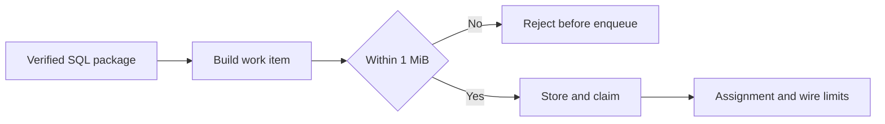
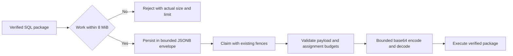

# Change Record: Raise asset runner task payload limits

| Field | Value |
| --- | --- |
| Status | Implementing |
| Type | Bug fix and migration |
| Primary issue | [#694](https://github.com/eirhop/favn/issues/694) |
| Pull request | [#696](https://github.com/eirhop/favn/pull/696) |
| Related work | SQL compaction #695 remains separate |
| Affected areas | Core runner contracts, PostgreSQL storage, runner assignment |
| Approved plan commit | `d1b36009` |
| Last updated | 2026-09-04 |

## One-minute summary

A valid published SQL package can exceed the runner task's 1 MiB limit and fail
before execution. Raise asset work to a bounded 8 MiB of uncompressed Erlang term,
with separate assignment and storage headroom. Keep package verification, claim
fencing, and conservative unknown outcomes intact. This changes a cross-process
contract and database constraint, so it requires coordinated deployment.

## Impact and problem analysis

Issue #694 reports a 1,267,440-byte task containing a 1,175,012-byte SQL package.
The complete work item is embedded in the assignment; changing persistence alone
still leaves assignment validation and wire decoding too small.

### Assumptions and evidence

| Evidence | Proves | Does not prove |
| --- | --- | --- |
| `PersistenceCodec` at main `5f3c163e` | Payload and result terms share a 1 MiB bound | Every published 4 MiB JSON package fits a particular Erlang term budget |
| `RunnerTask.Message` and `Codec` | Assignment defaults to 1 MiB; wire decoding to 2 MiB base64 | Larger payload execution |
| Latest orchestration-context migration | Stored task JSONB remains limited to 2 MiB; context is 8 MiB | Live database version |

The budget applies to complete work, including the package and task metadata.
Publication JSON and execution term sizes differ; this is bounded headroom, not
a guarantee that every legal published package fits. Tests use synthetic data.

## Current behavior

## Approved plan

Use one Core limits owner for an 8 MiB asset payload budget, a 64 KiB assignment
envelope allowance, and exact base64 sizing: `4 * ceil(raw_bytes / 3)`.
Assignment validation checks both the payload's kind-specific budget and the
complete assignment budget of 8,454,144 bytes. Wire encoding and decoding enforce
the corresponding 11,272,192-byte base64 budget for assignments, with raw checks
before term decoding. Other message limits remain unchanged.

Persisted asset envelopes receive a 12 MiB JSONB storage bound through a new
registered migration. The 8 MiB raw payload expands to 11,184,812 base64 bytes,
leaving over 1 MiB for JSONB envelope overhead. Existing payloads need no rewrite.
Non-asset payloads and results retain their existing 1 MiB raw bounds; result,
log, error, and orchestration-context database bounds stay unchanged.

### Contracts, scope, and non-goals

- Maintain protocol 13 shapes, immutable package identities, pool/release binding,
  assignment fences, and unknown-outcome classifications.
- Retain uncompressed safe term decoding and reject oversized encoded input
  before allocation-heavy decoding.
- No SQL compaction, package-fetch protocol, retries, scheduling, or new tuning
  options. HTTP body limits are unrelated to distributed BEAM task transport.

### Implementation slices and complexity budget

| Slice | Owner and outcome | Production added | Production deleted | Supporting added | Supporting deleted |
| --- | --- | ---: | ---: | ---: | ---: |
| 1 | Core limits, payload/assignment/wire validation and boundaries | 60-130 | 10-45 | 130-250 | 0-20 |
| 2 | PostgreSQL migration and actual claim-to-execution regression | 35-75 | 0-5 | 140-300 | 0-20 |
| 3 | Canonical size and rollout documentation | 0 | 0 | 25-60 | 0-10 |

Supporting lines include tests, fixtures, and canonical docs, excluding this
record. Explain overruns exceeding 25 percent or 100 lines, whichever is smaller.
The actual assignment regression must include real PostgreSQL persistence and
claim, wire round trip, and SQL execution through the runner; reuse existing test
fixtures and SQL adapters where practical.

## Operational design

Oversized work remains a deterministic pre-enqueue error with byte count and
limit. Do not log task bodies. No new retries or recovery behavior are introduced.
Apply the migration first, then deploy matching updated control plane and runner
builds before publishing work relying on the new limit. Protocol 13 data shapes
are unchanged, but old binaries cannot process larger work; mixed builds are not
supported for that work. Rebuild runner release identities as usual. Before
rollback, drain larger tasks and handle retained oversized rows; old codecs cannot
read them and migration down must fail rather than truncate incompatible rows.

## Verification plan

| Acceptance criterion | Evidence |
| --- | --- |
| Larger SQL task executes | Synthetic package above 1 MiB persisted, claimed through orchestrator, assignment wire round trip, runner SQL execution |
| Raw and envelope bounds | Exact-limit and one-byte-over tests for payload and assignment, encoded expansion, malformed/compressed decode rejection |
| Storage consistency | Migration up/down and database constraint tests, with payload above old storage limit |
| Unrelated limits unchanged | Non-asset payload, result, and log boundary assertions |
| Identity and fencing retained | Existing package identity, assignment fence, cancellation/unknown tests plus relevant large-task checks |
| Compatibility documented | Canonical runner architecture and migration rollout instructions |

Run focused owning-layer tests first, then relevant compile/format/tag checks and
ordinary PR CI. Use a disposable bootstrap-owned PostgreSQL database. Local tests
and CI do not establish live deployment or constrained-memory performance.

## Risks

Larger terms increase per-assignment memory; the finite limit is deliberate.
A valid package may still exceed the full-task budget. PostgreSQL constraint
replacement takes a table lock. Rollback may be blocked by retained larger rows.

## Plan review

Independent agent `/root/review` compared issue #694, source, storage constraints,
transport, budget arithmetic, and this plan. Verdict: accepted with no blocking
findings. The review confirmed preservation of the latest 8 MiB context bound,
final struct validation after wire-map decoding, and the real claim-to-execution
regression requirement. Implementation has not started.
