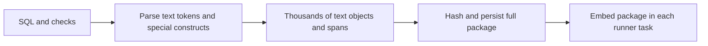
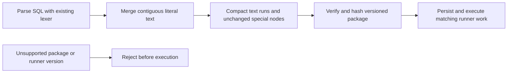

# Change Record: Compact SQL execution packages

| Field | Value |
| --- | --- |
| Status | Implemented |
| Type | Bug fix and execution-format transition |
| Primary issue | [#695](https://github.com/eirhop/favn/issues/695) |
| Pull request | [#697](https://github.com/eirhop/favn/pull/697) |
| Related work | [#694](https://github.com/eirhop/favn/issues/694), payload limits, remains independent |
| Affected areas | Core SQL templates, immutable packages, manifest compatibility, runner rendering tests |
| Approved plan commit | `a57e42b9` |
| Last updated | 2026-09-04 |

## One-minute summary

Ordinary SQL currently becomes thousands of text objects, each carrying six source
positions. Merge adjacent literal text after parsing so packages grow mainly with
SQL bytes and the number of meaningful template constructs. Preserve literal SQL,
bindings, relation resolution, helper calls, checks, and useful source locations.
Qualify the representation with generic fixtures and quantify how much SQL is
needed to reach a 1 MiB package. This changes immutable content and compatibility,
so the change needs a reviewed plan and coordinated release.

## Impact and problem analysis

Issue #695 reports a 1,175,012-byte package for one asset, including its checks and
helpers. `Template.parse_nodes/3` emits separate objects for words, punctuation,
and individual whitespace; `text_node/3` adds a six-field span to each. The
orchestrator includes the complete package in each runner task.

Prior isolated measurements across 59 archived packages reduced uncompressed
Erlang package terms by 84.3% and canonical JSON by 80.7%. A generic 41,839-byte
query went from 3,672,637 to 127,321 package-term bytes. These measurements were
independently reproduced; they establish the approach, not production acceptance.
All new committed fixtures and reports must be generic and contain no customer
SQL, identifiers, private paths, or populated environment values.

### Assumptions and evidence

| Evidence | Proves | Does not prove |
| --- | --- | --- |
| Parser and `Renderer.render_node/2` | Literal nodes retain exact text and have no rendering side effects | Every diagnostic or nested template remains correct after a change |
| Generated-check validation | Expected templates are recompiled and compared exactly | Old packages remain compatible with a new compiler |
| Isolated size experiment | Large retained-size reduction without compression | Lower parser peak memory, live runtime speed, or universal package size ceiling |

The user's 1 MiB goal is a measurable headroom objective for ordinary literal SQL,
not a promise that arbitrary SQL/check/helper combinations cannot exceed it. JSON
bytes, uncompressed Erlang package bytes, and full runner task bytes are separate
measurements. This PR does not change any task limit.

## Current behavior

## Approved plan

Normalize each parsed node list into maximal contiguous literal-text runs. Join
literal chunks once, retain the first span start and last span end, and flush at
every non-text node or source-position discontinuity. Recursively compiled helper
arguments receive the same normalization. The lexer and its context tracking do
not change. Special nodes and their source spans remain explicit and unchanged.

### Contracts, scope, and non-goals

- Preserve every SQL byte, including comments, quotes, Unicode, and whitespace.
  Preserve binding order, relation resolution, nested calls, check policies, and
  replacement-scope semantics. Offsets remain Unicode codepoint offsets.
- The same compiler normalization must apply to authored SQL, reusable definitions,
  generated/authored checks, helper arguments, and replacement scopes.
- Hashes cover the complete new representation; round trips remain deterministic
  and tampering is rejected. Never mutate previously accepted package bytes/hashes.
- Bump execution-package schema from 4 to 5 and manifest runner contract from 14
  to 15. Keep manifest schema 19 and task protocol 13, whose shapes are unchanged.
  Reject unsupported package schema before rehydrating generated templates.
- Existing lifecycle, retries, cancellation, publication limits, storage, and task
  attachment remain unchanged. No helper pruning, source maps, compression,
  runner fetch/cache protocol, or direct parser buffering.
- Post-parse merging reduces retained objects but still constructs the original
  parser tree transiently. Do not claim reduced parser peak memory.

### Implementation slices and complexity budget

Supporting lines include tests, fixtures, measurement script, and canonical docs;
they exclude this record, generated data, dependencies, and formatting-only work.

| Slice | Owner and outcome | Production added | Production deleted | Supporting added | Supporting deleted |
| --- | --- | ---: | ---: | ---: | ---: |
| 1 | Core contiguous-text normalization and exact source-location coverage | 35-75 | 0-5 | 110-200 | 0-15 |
| 2 | Package/runner format gate, integrity and renderer equivalence | 10-35 | 3-15 | 180-330 | 20-100 |
| 3 | Generic size/memory/codec measurements, regression budgets, canonical docs | 0 | 0 | 300-550 | 0-20 |

The normalization belongs in `apps/favn_core/lib/favn/sql/template.ex`; package
version handling in `manifest/execution_package.ex` and runner compatibility in
`manifest/contract_versions.ex`. Core owns fixture and serialization assertions;
Runner owns renderer and execution qualification. Update the manifest-first
guide/architecture for the compatibility transition and a point-in-time generic
measurement report. Explain overruns above 25 percent or 100 lines, whichever is
smaller, without rewriting this approved budget.

## Operational design

Unsupported versions must fail explicitly before package execution. Preserve
existing bounded error surfaces and never log SQL or task bodies. No new recovery
or automatic retry path is introduced.

This is a coordinated pre-v1 breaking transition. Release matching authoring,
control-plane, and runner builds, rebuild runner identities, and publish newly
built manifests. There is no database migration or package rewrite. Before the
upgrade, operators must finish or explicitly retire old active, queued, deferred,
and paused work. Retained schema-4 packages and runner-contract-14 manifests remain
stored but cannot be loaded/executed by the new package/manifest boundaries; this
also affects historical source retrieval, retry, replay, and rollback. Submitting
new work requires a new manifest. Old binaries may execute old retained work only
in a deliberately restored compatible deployment; never dispatch new packages to
old runners. Document this limitation rather than silently migrating identities.

## Verification plan

| Acceptance criterion | Planned evidence |
| --- | --- |
| Exact SQL and diagnostics | Literal bytes/span endpoints, Unicode and nonzero offsets, quotes/comments, special-node positions, nested arguments; renderer output and binding/error locations |
| Execution semantics | Existing SQL runner tests plus a focused compact-package round trip exercising rendering/execution and authored/generated checks where existing test adapters permit |
| Integrity and compatibility | New schema/runner gates, old/future schema rejection, deterministic new hashes, round trips, tampered text/span/check rejection |
| Generic scope coverage | Ordinary/large/whitespace-heavy queries, authored/generated checks, helper definitions/nested calls, replacement scopes |
| Hard-to-reach 1 MiB objective | Ordinary fixture with at least 200 KiB of source and 5,000 projection columns stays below 768 KiB package ETF; report JSON separately and include full task/envelope overhead where a valid fixture permits |
| Honest scaling boundary | Report first 1 MiB crossing bracket for ordinary text and a parameter/helper-heavy fixture; no universal bound inferred from ordinary SQL |
| Regression budget | Small and large package byte ceilings plus maximal-text-run node assertions, run in ordinary CI without timing-based pass/fail assertions |
| Cost evidence | Reproducible script reports all SQL source bytes (including scopes), node counts, canonical JSON/ETF, optional gzip, process memory, and median encode/decode/full verify costs; compare with baseline lexer in isolated processes |

Run focused Core and Runner tests, format, compile with warnings as errors, tier
guard, and ordinary PR CI. The memory experiment measures an isolated process and
states whether peak sampling or retained memory is reported; it does not establish
container RSS or live infrastructure safety. Do not introduce a long stress-test
CI gate. Read-only local archive remeasurement is optional private corroboration;
the public acceptance evidence comes from generic fixtures.

## Risks and decisions

| Risk | Decision |
| --- | --- |
| Many special nodes or many checks still reach 1 MiB | Measure and publish the boundary; retain explicit nodes and existing finite limits |
| New lexer output invalidates old generated-check comparison | Enforced package and runner version transition; no implicit compatibility claims |
| A post-parse merge creates temporary allocations | Use buffered chunks for joining and report memory honestly; direct parser optimization deferred |
| Prior historical packages become unsupported | Explicit coordinated breaking rollout and clear pre-execution version errors |
| Task metadata independently uses remaining headroom | Distinguish package, work, and encoded envelope sizes in results |

## Plan review

| Field | Result |
| --- | --- |
| Reviewer | Independent agent `/root/review_695_xhigh`, GPT-5.6 xhigh |
| Reviewed against | Issue #695, baseline source, measurements, and this plan |
| Findings | No blocking findings; approved post-parse scope, version gates, historical retirement, and falsifiable size budgets |
| Findings addressed and rechecked | No revisions required. Reviewer emphasized both schema entry paths, successful baseline/candidate verification timing, checked execution round trips, and separate task overhead |
| Verdict | Approved on 2026-09-04; proceed to reviewed-plan commit and draft PR |

## Implementation outcome

The existing lexer now returns coalesced literal runs. The implementation joins
chunks once, checks all three span coordinates for continuity, and leaves special
nodes unchanged. Recursively compiled helper arguments use the same return path.
Package schema 5 rejects unsupported published maps before generated-check
rehydration; struct verification already performs that gate first. Manifest runner
contract 15 is required. The implemented flow matches the approved diagram.

Generic measurements move the ordinary 1 MiB boundary from 291 columns / 12,059
source bytes to 7,980 columns / 348,959 source bytes, about 29 times more SQL.
The 5,000-column fixture has 217,839 source bytes, a 655,340-byte package, and a
656,622-byte work term. Its package budget is 768 KiB. Parameterized helper calls
still cross 1 MiB at 889 calls / 34,527 source bytes; this limitation is explicit.
The [generic report](../../report/sql_package_compaction.md) contains every
size, crossing, codec, memory, and proof-boundary detail, with raw measurements.

### Actual scope and complexity

Core owns the only production changes: 57 additions and 4 deletions across the
template, package, and compatibility-version modules. Supporting updates cover
the compiler/renderer/execution tests, current-version fixtures, generic
measurements, and manifest-first documentation. Implementation complexity is low
to moderate; operational complexity is moderate because of the explicit breaking
compatibility transition. No storage or scheduling code changed.

Upstream PR #696 merged during qualification. Integration commit `ff2538688`
merges main `c4abd29c` without changing this implementation or its approved plan.
The statements above about unchanged task limits/storage and no database
migration describe #695 only: the combined release also contains #696's separate
payload-limit change and database migration. The 768 KiB package and 800 KiB work
regressions remain independent of the newly increased task limit.

| Slice | Production added | Production deleted | Supporting added | Supporting deleted |
| --- | ---: | ---: | ---: | ---: |
| 1 | 53 | 1 | 61 | 1 |
| 2 | 4 | 3 | 146 | 45 |
| 3 | 0 | 0 | 559 | 4 |

Counts exclude this record and generated JSON evidence/legacy fixture. Existing
checked-execution and renderer coverage reduced new test code. Slice 3 is nine
supporting lines above its estimate, below the required variance-explanation
threshold; the reproducible report includes the dynamic-case limitation and
codec/memory boundaries. No unexplained material budget overruns remain.

Canonical docs updated: the manifest-first architecture and public guide, plus the
current feature inventory. The change record diagrams were visually verified on
GitHub before implementation; no diagram corrections were needed.

## Deviations from the approved plan

None. The implementation matched the approved plan. The 1 MiB goal is qualified
for ordinary literal SQL, with the measured dynamic-heavy limitation retained.

## Decision log

| Date | Decision | Reason | Review needed |
| --- | --- | --- | --- |
| 2026-09-04 | Replace an existing assertion that packages exceed ten times index size with a 4 MiB total package ceiling for its 300-asset fixture | The old assertion required the bloat this fix removes; compact-index checks are retained | Accepted in implementation review |
| 2026-09-04 | Run checked-execution fixture packages through canonical JSON round trips | Existing adapter regressions then exercise the actual compact loaded representation, generated/custom checks, exact SQL and bindings | Accepted in implementation review |
| 2026-09-04 | Merge current main after upstream PR #696 | Qualify compact packages together with the independently changed task limits; keep the reviewed plan history intact | Accepted in integration review |

## Verification evidence

| Check | Result | Evidence boundary |
| --- | --- | --- |
| Core complete fast suite | 464 passed, including 2 doctests, on integrated `ff2538688` locally and in CI | Package/manifest integrity, locations, size budgets, old/future version rejection; no live database |
| Runner complete fast suite | 256 passed | Includes canonical package round trips through existing checked-execution adapter and group replacement tests; test adapters, not a production SQL backend |
| Authoring complete fast suite | 148 passed | DSL compilation and generated/authored checks |
| Public manifest generator tests | 11 passed | Current manifest and runner-version contract |
| Compile, format, tier guard | Passed locally | Warnings-as-errors compile; normal formatter plus measurement-script formatter; CI tag coverage |
| Before/after generic measurement | Completed against baseline parser/package code and candidate | Successful package verification on both sides; process memory and warm codecs, not RSS or end-to-end infrastructure |
| Package/task headroom | 5,000 columns below 768 KiB package and 800 KiB work budgets; persistence codec round trip passed | Modest task metadata; no database persistence or claim/dispatch exercised by the size fixture |
| CI fast suite | Passed on integrated `ff2538688`, including 367 PostgreSQL storage tests | Includes upstream's large-SQL database enqueue, claim, wire decode, runner execution, and completion regression; isolated CI PostgreSQL, not production infrastructure |
| Ordinary PR CI | [Passed on integrated `ff2538688`](https://github.com/eirhop/favn/actions/runs/33848347359) | Quick checks, fast tests, acceptance, Dialyzer, slow tests, and aggregate CI all passed |
| Production-shaped HTTP boundary | [Passed on integrated `ff2538688`](https://github.com/eirhop/favn/actions/runs/33848347369) | Existing isolated CI qualification, not a live deployment |
| Image qualification | [Blocked by Grype's high-or-higher vulnerability gate](https://github.com/eirhop/favn/actions/runs/33848347357) | Both PR images built and reached scanning; [current main's runner image fails the same gate](https://github.com/eirhop/favn/actions/runs/33847917496/job/100943893943). No image, dependency, workflow, or security-exception changes belong to this PR |

### Not verified

Live deployment, historical-work retirement, production SQL adapter execution,
production rollback, and constrained-container memory survival are not proven.
The local size fixture only exercises the persistence codec; actual database
dispatch/persistence and transaction-local SQL execution are covered separately
by the integrated CI storage suite. Image security qualification remains blocked.

## Final review

Independent GPT-5.6 xhigh reviewer `/root/review_695_xhigh` accepted implementation
`ea6a9b558` against approved baseline `a57e42b9`, including code, tests,
measurements, canonical docs, and actual complexity, with no actionable findings.
The reviewer independently ran 62 focused Core and 68 Runner tests successfully
and accepted the integration at `ff2538688` without code changes. All ordinary CI
and HTTP checks passed on that integrated implementation. The final evidence
record was accepted on 2026-09-04 with no actionable findings. The PR remains
draft while image security qualification is blocked.
