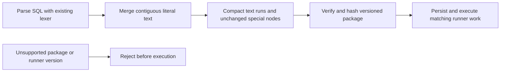

# Change Record: Compact SQL execution packages

| Field | Value |
| --- | --- |
| Status | Plan reviewed |
| Type | Bug fix and execution-format transition |
| Primary issue | [#695](https://github.com/eirhop/favn/issues/695) |
| Pull request | Pending |
| Related work | [#694](https://github.com/eirhop/favn/issues/694), payload limits, remains independent |
| Affected areas | Core SQL templates, immutable packages, manifest compatibility, runner rendering tests |
| Approved plan commit | Pending independent review |
| Last updated | 2026-09-04 |

## One-minute summary

Ordinary SQL currently becomes thousands of text objects, each carrying six source
positions. Merge adjacent literal text after parsing so packages grow mainly with
SQL bytes and the number of meaningful template constructs. Preserve literal SQL,
bindings, relation resolution, helper calls, checks, and useful source locations.
Qualify the representation with generic fixtures and quantify how much SQL is
needed to reach a 1 MiB package. This changes immutable content and compatibility,
so the change needs a reviewed plan and coordinated release.

## Impact and problem analysis

Issue #695 reports a 1,175,012-byte package for one asset, including its checks and
helpers. `Template.parse_nodes/3` emits separate objects for words, punctuation,
and individual whitespace; `text_node/3` adds a six-field span to each. The
orchestrator includes the complete package in each runner task.

Prior isolated measurements across 59 archived packages reduced uncompressed
Erlang package terms by 84.3% and canonical JSON by 80.7%. A generic 41,839-byte
query went from 3,672,637 to 127,321 package-term bytes. These measurements were
independently reproduced; they establish the approach, not production acceptance.
All new committed fixtures and reports must be generic and contain no customer
SQL, identifiers, private paths, or populated environment values.

### Assumptions and evidence

| Evidence | Proves | Does not prove |
| --- | --- | --- |
| Parser and `Renderer.render_node/2` | Literal nodes retain exact text and have no rendering side effects | Every diagnostic or nested template remains correct after a change |
| Generated-check validation | Expected templates are recompiled and compared exactly | Old packages remain compatible with a new compiler |
| Isolated size experiment | Large retained-size reduction without compression | Lower parser peak memory, live runtime speed, or universal package size ceiling |

The user's 1 MiB goal is a measurable headroom objective for ordinary literal SQL,
not a promise that arbitrary SQL/check/helper combinations cannot exceed it. JSON
bytes, uncompressed Erlang package bytes, and full runner task bytes are separate
measurements. This PR does not change any task limit.

## Current behavior

## Approved plan

Normalize each parsed node list into maximal contiguous literal-text runs. Join
literal chunks once, retain the first span start and last span end, and flush at
every non-text node or source-position discontinuity. Recursively compiled helper
arguments receive the same normalization. The lexer and its context tracking do
not change. Special nodes and their source spans remain explicit and unchanged.

### Contracts, scope, and non-goals

- Preserve every SQL byte, including comments, quotes, Unicode, and whitespace.
  Preserve binding order, relation resolution, nested calls, check policies, and
  replacement-scope semantics. Offsets remain Unicode codepoint offsets.
- The same compiler normalization must apply to authored SQL, reusable definitions,
  generated/authored checks, helper arguments, and replacement scopes.
- Hashes cover the complete new representation; round trips remain deterministic
  and tampering is rejected. Never mutate previously accepted package bytes/hashes.
- Bump execution-package schema from 4 to 5 and manifest runner contract from 14
  to 15. Keep manifest schema 19 and task protocol 13, whose shapes are unchanged.
  Reject unsupported package schema before rehydrating generated templates.
- Existing lifecycle, retries, cancellation, publication limits, storage, and task
  attachment remain unchanged. No helper pruning, source maps, compression,
  runner fetch/cache protocol, or direct parser buffering.
- Post-parse merging reduces retained objects but still constructs the original
  parser tree transiently. Do not claim reduced parser peak memory.

### Implementation slices and complexity budget

Supporting lines include tests, fixtures, measurement script, and canonical docs;
they exclude this record, generated data, dependencies, and formatting-only work.

| Slice | Owner and outcome | Production added | Production deleted | Supporting added | Supporting deleted |
| --- | --- | ---: | ---: | ---: | ---: |
| 1 | Core contiguous-text normalization and exact source-location coverage | 35-75 | 0-5 | 110-200 | 0-15 |
| 2 | Package/runner format gate, integrity and renderer equivalence | 10-35 | 3-15 | 180-330 | 20-100 |
| 3 | Generic size/memory/codec measurements, regression budgets, canonical docs | 0 | 0 | 300-550 | 0-20 |

The normalization belongs in `apps/favn_core/lib/favn/sql/template.ex`; package
version handling in `manifest/execution_package.ex` and runner compatibility in
`manifest/contract_versions.ex`. Core owns fixture and serialization assertions;
Runner owns renderer and execution qualification. Update the manifest-first
guide/architecture for the compatibility transition and a point-in-time generic
measurement report. Explain overruns above 25 percent or 100 lines, whichever is
smaller, without rewriting this approved budget.

## Operational design

Unsupported versions must fail explicitly before package execution. Preserve
existing bounded error surfaces and never log SQL or task bodies. No new recovery
or automatic retry path is introduced.

This is a coordinated pre-v1 breaking transition. Release matching authoring,
control-plane, and runner builds, rebuild runner identities, and publish newly
built manifests. There is no database migration or package rewrite. Before the
upgrade, operators must finish or explicitly retire old active, queued, deferred,
and paused work. Retained schema-4 packages and runner-contract-14 manifests remain
stored but cannot be loaded/executed by the new package/manifest boundaries; this
also affects historical source retrieval, retry, replay, and rollback. Submitting
new work requires a new manifest. Old binaries may execute old retained work only
in a deliberately restored compatible deployment; never dispatch new packages to
old runners. Document this limitation rather than silently migrating identities.

## Verification plan

| Acceptance criterion | Planned evidence |
| --- | --- |
| Exact SQL and diagnostics | Literal bytes/span endpoints, Unicode and nonzero offsets, quotes/comments, special-node positions, nested arguments; renderer output and binding/error locations |
| Execution semantics | Existing SQL runner tests plus a focused compact-package round trip exercising rendering/execution and authored/generated checks where existing test adapters permit |
| Integrity and compatibility | New schema/runner gates, old/future schema rejection, deterministic new hashes, round trips, tampered text/span/check rejection |
| Generic scope coverage | Ordinary/large/whitespace-heavy queries, authored/generated checks, helper definitions/nested calls, replacement scopes |
| Hard-to-reach 1 MiB objective | Ordinary fixture with at least 200 KiB of source and 5,000 projection columns stays below 768 KiB package ETF; report JSON separately and include full task/envelope overhead where a valid fixture permits |
| Honest scaling boundary | Report first 1 MiB crossing bracket for ordinary text and a parameter/helper-heavy fixture; no universal bound inferred from ordinary SQL |
| Regression budget | Small and large package byte ceilings plus maximal-text-run node assertions, run in ordinary CI without timing-based pass/fail assertions |
| Cost evidence | Reproducible script reports all SQL source bytes (including scopes), node counts, canonical JSON/ETF, optional gzip, process memory, and median encode/decode/full verify costs; compare with baseline lexer in isolated processes |

Run focused Core and Runner tests, format, compile with warnings as errors, tier
guard, and ordinary PR CI. The memory experiment measures an isolated process and
states whether peak sampling or retained memory is reported; it does not establish
container RSS or live infrastructure safety. Do not introduce a long stress-test
CI gate. Read-only local archive remeasurement is optional private corroboration;
the public acceptance evidence comes from generic fixtures.

## Risks and decisions

| Risk | Decision |
| --- | --- |
| Many special nodes or many checks still reach 1 MiB | Measure and publish the boundary; retain explicit nodes and existing finite limits |
| New lexer output invalidates old generated-check comparison | Enforced package and runner version transition; no implicit compatibility claims |
| A post-parse merge creates temporary allocations | Use buffered chunks for joining and report memory honestly; direct parser optimization deferred |
| Prior historical packages become unsupported | Explicit coordinated breaking rollout and clear pre-execution version errors |
| Task metadata independently uses remaining headroom | Distinguish package, work, and encoded envelope sizes in results |

## Plan review

| Field | Result |
| --- | --- |
| Reviewer | Independent agent `/root/review_695_xhigh`, GPT-5.6 xhigh |
| Reviewed against | Issue #695, baseline source, measurements, and this plan |
| Findings | No blocking findings; approved post-parse scope, version gates, historical retirement, and falsifiable size budgets |
| Findings addressed and rechecked | No revisions required. Reviewer emphasized both schema entry paths, successful baseline/candidate verification timing, checked execution round trips, and separate task overhead |
| Verdict | Approved on 2026-09-04; proceed to reviewed-plan commit and draft PR |

## Implementation outcome

Pending implementation after plan approval and draft PR creation.

## Deviations from the approved plan

None yet.

## Decision log

None yet.

## Verification evidence

Pending implementation. Live rollout, historical retirement, and constrained
container memory are not verified by this plan.

## Final review

Pending independent comparison of the approved baseline, implementation, tests,
measurements, canonical docs, and actual complexity.
