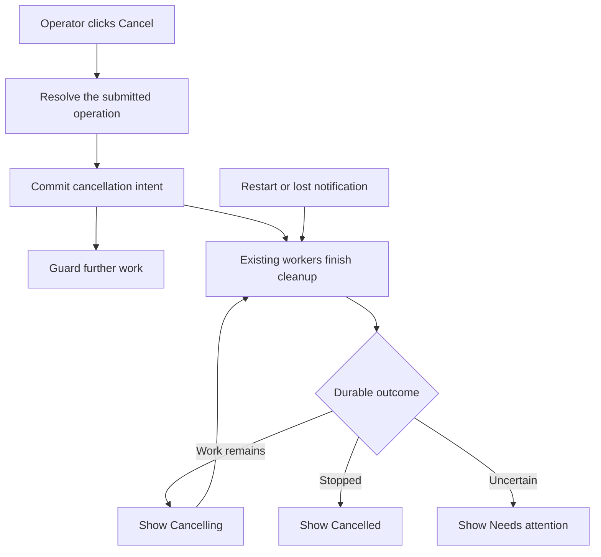
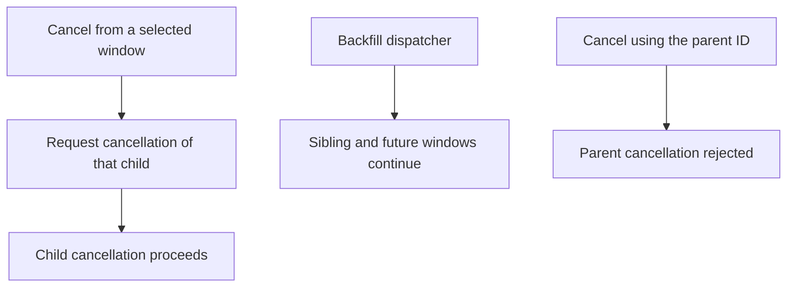
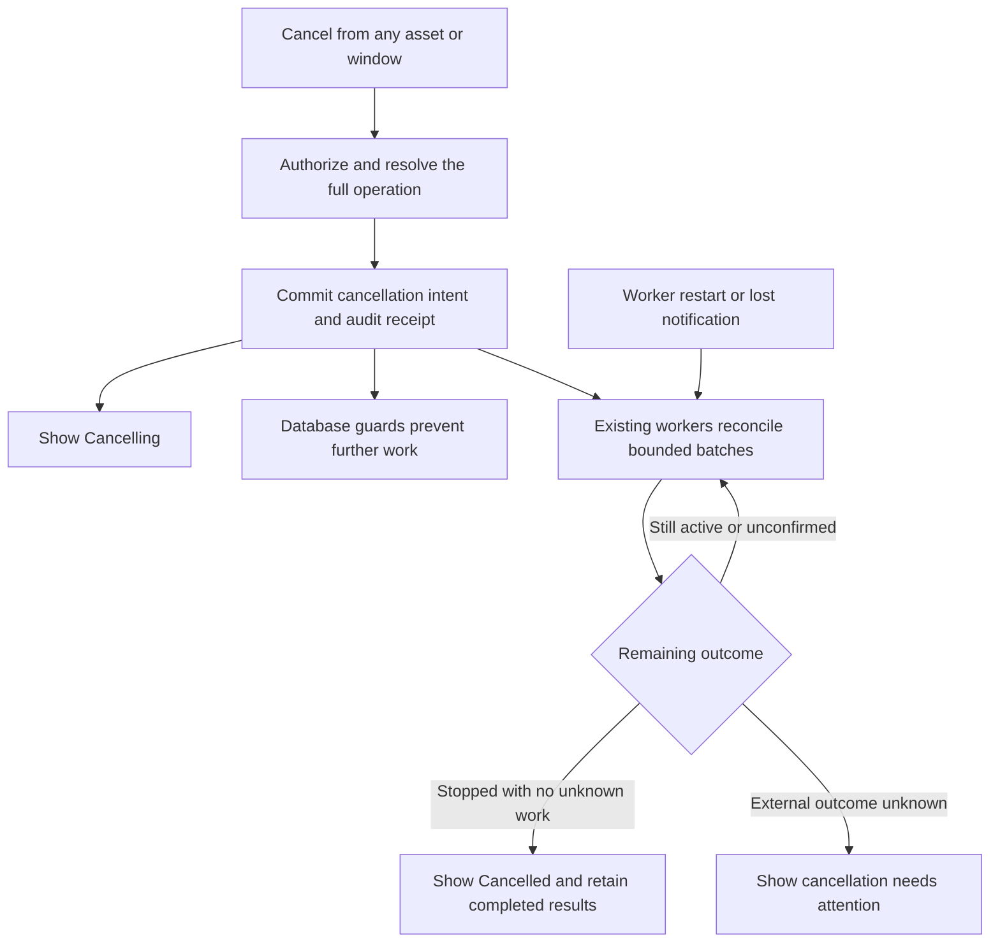

# Change Record: Cancel the full submitted run

| Field | Value |
| --- | --- |
| Status | Implementation accepted after complexity reduction and deterministic CI correction; release qualification pending |
| Type | Bug fix |
| Primary issue | [#699](https://github.com/eirhop/favn/issues/699) |
| Pull request | [Draft PR #702](https://github.com/eirhop/favn/pull/702) |
| Current plan | Revision 1 below; approved after fresh independent review |
| Original approved baseline | [`9fa85c38`](https://github.com/eirhop/favn/commit/9fa85c3883ce220cffcdc8551df09cfe4d7d19cc), preserved below |
| Approved revision commit | [`2548ae6e`](https://github.com/eirhop/favn/commit/2548ae6ed4ccd4dd79658cf02f8a96e6b5b30737) |
| Source baseline | `8a129956b3f571e9db6f8e345b243b14a90b9983` |
| Related work | [#700: persisted task and crash recovery](https://github.com/eirhop/favn/issues/700) |
| Last updated | 2026-09-04 |

## Current plan — revision 1

The operator's **Cancel run** action cancels the submitted operation, including
all backfill windows, regardless of the selected detail. Save intent, prevent
more work, and let the existing dispatcher and cancellation paths finish cleanup.
Show **Cancelling**, **Cancelled**, or an explicit **Needs attention** outcome;
keep completed results. Implementation has not started.

The initial plan prescribed broader API changes, historical-lineage handling and
progress diagnostics than the reported problem required. This revision narrows
those choices without dropping the issue's race, restart, authorization or
unknown-outcome requirements. The original approved text and budget remain intact
in the collapsed baseline below; the revision/deviation table records what changed.

### Evidence and scope

The [UI action](../../../apps/favn_view/lib/favn_view/run_detail_live.ex) targets
the selected run. [Parent cancellation](../../../apps/favn_orchestrator/lib/favn_orchestrator/run_cancellation.ex)
is explicitly rejected, and the [dispatcher](../../../apps/favn_orchestrator/lib/favn_orchestrator/backfill_dispatcher.ex)
has no operation-level cancellation gate. [Submission cancellation](../../../apps/favn_orchestrator/lib/favn_orchestrator/run_submissions.ex)
also rejects the `admitting` phase. These are source findings; the incident has
not been reproduced in this planning work.

Use one ownership rule: backfill windows and system-created continuations belong
to their original submission; a separately requested rerun is a new operation.
Historical `root_run_id` or `parent_run_id` alone does not establish cancellation
ownership. The [resource recovery worker](../../../apps/favn_orchestrator/lib/favn_orchestrator/resource_recovery.ex)
records `submission_source: :recovery` and a durable source/candidate relationship.
The operator's retry action uses a separate submission. Validate those records
inside the workspace; never accept caller metadata or a source tag alone as proof.
Combined windows can share one child and must be deduplicated.

### Smallest complete implementation

1. **Resolve scope in `cancel_operator_run/3`.** Return that same scope and label
   through the operator header so the selected asset/window does not change the
   action. Reauthorize/revalidate on click. Broader scope applies to the operator
   action; retain exact-run semantics in `cancel_run/4` and its HTTP/CLI callers.
   Its cancellation mechanics may need the admission-race fix, but its target
   does not silently expand. Document this distinction in the owning contracts.
2. **Save one cancellation intent on the owner.** For backfills, add request
   time/reason and `cancelling` support to the existing record, with an atomic
   command receipt and outbox event. For ordinary operations, reuse existing
   submission/run intent. A terminal source with outstanding automatic recovery
   needs an intent-only transition that preserves its terminal result. Resolve
   ordinary automatic descendants through verified continuation membership, not
   a general traversal of historical reruns. Repeated requests converge on the
   same intent; `:ok` means persisted acceptance, never proof that work stopped.
3. **Close the actual dispatch races.** Apply the transaction guards in the table
   below. A preflight read is insufficient. Cancellation and the guarded commit
   share the existing identity/row serialization point for the resolved owner.
   Lock the owner before the affected member rows in these touched paths; adjust
   candidate-first claims only where needed to preserve that order. Do not
   redesign unrelated lease, result, projection or domain-task locking.
4. **Extend existing cleanup.** `BackfillDispatcher` reconciles cancelled windows
   and distinct children in bounded batches. It must discover cancelling backfills
   even when dispatch is disabled. Reuse pending-submission and leaf-run/task
   cancellation; page durable run-owned tasks rather than trusting one snapshot's
   active task list. Existing submission/run recovery resumes unfinished cleanup,
   including terminal ordinary sources with automatic descendants. This cleanup
   cannot require execution capacity or admission to be enabled. Keep acknowledgement
   waits off the dispatcher's mailbox and leave shared target tasks under their
   existing owner.
5. **Render the result simply.** The operator DTO carries scope, cancellation
   availability and the three presentation outcomes above. Existing error detail
   explains uncertainty. No new per-stage counters, progress dashboard, telemetry
   inventory or parallel read model. Derive status through existing projections,
   preserving intent through replay and late window events. Confirmed cancellation
   requires all owned submissions, automatic recovery candidates and run tasks
   resolved; an ACK or terminal-window count alone is insufficient.

| Guarded boundary | Required behavior |
| --- | --- |
| Backfill activation and child enqueue, including a previously claimed window | After intent commits, no new eligible child is created; reconcile stable reserved IDs created before cancellation won. |
| Submission claim/preparation and final run admission | Prevent new preparation; stop an active preparation worker. Persist intent during `admitting` and either prevent run creation or reconcile/cancel the already committed run. Preserve intent across that handoff. |
| Automatic recovery candidate creation, claim, return-to-pending and enqueue | Stop future retries belonging to the cancelled operation. Retire pending/claimed candidates durably as cancelled so a rejected enqueue does not become an endless retry loop. Late outcome settlement cannot create a new eligible candidate, and a stale worker cannot return a cancelled candidate to pending. Already-created automatic runs join cleanup. Explicit later reruns remain independent. |
| Run-owned task enqueue, claim and in-place requeue | Prevent additional asset work and queued task starts after cancellation wins, including `release(:requeue)` after lease expiry. Resolve the owned task durably as cancelled or unknown according to existing outcome evidence; do not just reject it into repeated recovery attempts. Already assigned work may still require cancellation/unknown-outcome reconciliation. |

The [resource-circuit store](../../../apps/favn_storage_postgres/lib/favn_storage_postgres/resource_circuits/store.ex)
creates candidates through both `record_recovery_candidate/1` and outcome
settlement, and can return claimed candidates to pending. Serialize those
eligibility changes with cancellation: add the missing transaction around the
standalone candidate write and observe the owner-before-member/circuit order in
the touched paths. Preserve outcome and permit settlement; suppress or terminally
cancel only the new recovery candidate belonging to the cancelled operation.
Cleanup must not finalize while a concurrent eligible candidate can still appear.

The [runner-task store](../../../apps/favn_storage_postgres/lib/favn_storage_postgres/runner_tasks/store.ex)
can requeue an existing run-owned task through `release(:requeue)` without enqueue.
Include that path in the cancellation guard and terminal reconciliation. Its
current `retry/1` caller serves shared operation tasks: preserve shared-task retry
and guard only applicable run-owned retry/requeue instances. This adds no shared
operation cancellation or general task-lifecycle redesign.

Use existing indexed ledger, reserved-run and task relationships first. The
submission intent is an encoded payload, so it is not itself an indexed ownership
lookup. Where the existing relations cannot resolve pending/automatic work in a
bounded query, add a normalized cancellation-owner field/index to the existing
submission records, populated from verified source/ledger relationships and carried
through admission. That is a narrow membership contract, not a new operations table.
Finalize the exact query/index in slice 1 against these access patterns. Cancellation
must not scan all history or decode arbitrary task payloads to find its work.

Shared post-step inspections/marker reconciliation are deliberately outside the
run-owned task sweep. Preserve [the existing stop-post-step contract](../../../apps/favn_orchestrator/lib/favn_orchestrator/run_server/execution.ex):
detach the cancelled run's continuation, ignore late replies, and let shared target
reconciliation finish under its owner. Keep unresolved materialization/marker
outcomes visible. Killing a waiter never proves that external effects stopped.

### Verification and delivery

| Required proof | Focused evidence |
| --- | --- |
| Same operation from root, window or asset | Backfill, completed selected child and combined-window tests; normal multi-asset run; automatic recovery child versus separately requested rerun. |
| No new work after cancellation wins | Separate-connection PostgreSQL barriers at the four guarded boundaries; test both winners, including lost admission acknowledgement and queued-task claim during partial cleanup. Hold late candidate creation/outcome settlement, return-to-pending and run-owned task requeue until after intent or aggregate finalization; verify no revival, no recovery loop and preserved outcome/permit settlement. |
| Durable convergence | Duplicate commands/keys, lost response/notification, restart during partial cleanup, expired claims and disabled admission/exhausted capacity; terminal ordinary source with pending or active automatic recovery. |
| Preserved outcomes and isolation | Completion racing cancellation, completed assets unchanged, cross-workspace/forged membership rejected, unrelated same-target recovery survives; late shared-task reply cannot resume the run. |
| Truthful UI | LiveView confirmation/label and Cancelling/Cancelled/Needs attention; unknown task or marker result remains explicit; late events and projection replay cannot erase intent. |
| Public contract | Update operator cancellation docs and runtime guide, facade docs and relevant `Favn.AI` routing. Describe exact-run callers accurately; no unrelated API redesign. |

Run narrow owning-app tests first; real database transactions are required for the
race proof. Use the repository's disposable PostgreSQL setup and required test
tiers. Keep restart tests for #699, but leave #700's codec/reconnect implementation
separate and qualify fresh-VM recovery against its repaired baseline. Report any
blocked release-shaped checks; warm-VM results do not prove fresh-VM recovery.
For this record-only revision, validate links, whitespace and diagrams; no runtime
or test execution is claimed.

Migrate the new fields/status values/indexes through the existing PostgreSQL
bootstrap contract. Validate legacy ownership before backfilling; ambiguous rows
need explicit diagnostics rather than guessed membership. Quiesce old
orchestrators before enabling the new behavior: they ignore intent. Do not
roll back to old code while cancellations remain outstanding. Reuse existing
audit/error surfaces with bounded, redacted reasons; preserve fences and demand
accounting. A failure to read cancellation authority blocks new work and surfaces
an error. Unknown external effects are never automatically replayed.

### Revised complexity budget

This is an estimate to challenge during implementation, not a minimum or a target.
It removes broad API migration, detailed progress counters and historical rerun
traversal. Race safety and bounded automatic-recovery cleanup remain real work.
The original budget below stays unchanged for comparison.
Most savings come from the reduced API/UI surface; the transactional core remains
necessary. The lower end of slice 1 is optimistic until the membership query and
claim ordering are mapped. Reassess from that concrete work rather than assuming
the lower estimate is achievable.

| Slice | Required addition | Production added | Production deleted | Supporting added | Supporting deleted |
| --- | --- | ---: | ---: | ---: | ---: |
| 1 | Operator scope, owner intent/membership, minimal schema and guarded commits | 220-380 | 30-75 | 250-420 | 15-45 |
| 2 | Existing dispatcher/submission/run and automatic-recovery cleanup | 150-260 | 25-65 | 250-400 | 15-45 |
| 3 | Existing DTO/UI states and canonical documentation | 70-120 | 25-60 | 120-200 | 20-50 |
| Total | One implementation PR | 440-760 | 80-200 | 620-1,020 | 50-140 |

Supporting lines include tests, fixtures and canonical docs. Exclude this record,
generated/vendor files, dependency locks and formatter-only edits. Apply the
[existing variance rule](../README.md): explain an upper-range overrun exceeding
25% or 100 lines, whichever is smaller, and materially fewer deletions. Before
adding scope, identify the required cancellation failure that the addition fixes
and obtain re-review for a material change. Smaller output is welcome if it
preserves the required proof; do not write toward the estimate.

## Implementation decisions

Implementation started after user approval on 2026-09-04. The approved revision
and original baseline below remain unchanged. Membership is normalized on both
reserved submissions and admitted runs so direct/legacy runs and pending work
share indexed owner lookup. Admission copies immutable ownership. Ordinary run
intent keeps a separate cancellation outcome from the execution status, preserving
terminal results and timestamps. Backfills retain intent on their existing ledger.
These choices avoid a new operations table or worker.

## Revision and deviation record

The user requested a tighter plan and a new review on 2026-09-04. Revision 1
supersedes the following choices from the preserved original plan; other safety
invariants are retained. No implementation deviations have occurred.

| Original approved choice | Revision 1 | Reason and impact |
| --- | --- | --- |
| Expand every public cancellation entry point | Expand `cancel_operator_run/3`; exact-run API/CLI targeting stays exact | The issue concerns the operator action; avoid unrelated command-contract changes. Shared cancellation correctness fixes still apply. |
| Follow linked reruns generally; terminal-root cleanup | Include only automatic continuations; keep terminal-source cleanup for those | Historical execution-group lineage also includes separately requested reruns. Avoid cancelling independent submissions without dropping automatic recovery. |
| Prescribe operation-first changes across cancellation/dispatch machinery | Specify the four guarded boundaries and adjust their ordering only | Retain serialization proof; avoid an unrelated locking refactor. |
| Detailed remaining-work counts/telemetry | Three truthful presentation outcomes using existing error/projection surfaces | Counters are not necessary to show cancellation progress or uncertainty. |
| 620-1,070 production and 830-1,400 supporting additions | 440-760 production and 620-1,020 supporting additions | Reduced surface, not reduced race/restart test coverage; still estimates. |

## Revision 1 review

| Field | Result |
| --- | --- |
| Reviewer | Fresh independent agent `/root/review_cancel_revision` |
| Compared | Issue #699, current source, original approved baseline and revision/deviation table |
| Review focus | Smallest complete scope; no hidden weakening of cancellation, membership, recovery or uncertainty |
| Findings and recheck | One P2 finding: name all existing candidate-creation/return-to-pending and run-owned task requeue paths. The guard table, settlement-preservation rule and barrier tests now cover them; independently rechecked on 2026-09-04. The reviewer found the narrowed product scope sound and the budget provisional, with slice 1's lower end optimistic. |
| Verdict | Approved for implementation planning; no blocking findings remain. Fresh source/plan review only, not runtime qualification. |

## Original approved baseline

The following text is preserved verbatim from the original approved commit,
from its one-minute summary through its plan-review result. Its implementation
choices and budget are historical where the revision table above supersedes them.

Original plan and independent review — 9fa85c38

## One-minute summary

Clicking **Cancel run** should stop the full operation the user submitted,
regardless of which asset or backfill window is selected. Today the action
cancels the selected child; its siblings and future windows can continue.
The smallest complete solution is to persist cancellation on the owning operation,
prevent further work at the database boundaries, and extend the existing workers
to cancel and reconcile the remaining work. The UI shows **Cancelling…** until
work stops or an explicit unresolved outcome needs attention. This needs a change
record because it changes persistence, concurrency, recovery, and public behavior
across application boundaries.

## Impact

For a backfill of ten windows, cancelling while viewing window three must also
stop the unfinished work in windows one through ten. Finished assets keep their
results. Another independently submitted run continues. An operator should not
need to stop the service to prevent the next window from starting.

## Problem analysis

The verified defect is cancellation scope and missing operation-wide enforcement.
It is not evidence that the selected child's request was lost. Durable leaf-run
and runner-task cancellation already exist and remain the execution mechanism.

### Assumptions

- The issue's acceptance criteria define the scope. This record plans the change;
  it does not claim implementation or runtime verification.
- A backfill's durable ledger identifies the submitted operation. Resolve member
  runs and pending submissions through that ledger and validated persisted lineage,
  including linked retries; do not infer ownership from the current UI selection
  or caller-provided metadata.
- A normal run is its own cancellation target unless durable lineage places it
  inside an existing submitted operation. Automatically continued work remains
  in that operation. Starting a fresh independent run is a separate action;
  cancellation never clears itself to allow a retry to resume the old operation.
- An interrupted external write can have an unknown outcome. Killing a BEAM
  process or receiving a cancellation acknowledgement does not prove that the
  external write was rolled back.

### Evidence

Paths below are relative to the repository root; observations refer to the source
baseline above. The issue supplies the incident report; live incident state was
not re-examined for this record.

| Evidence | What it proves | What it does not prove |
| --- | --- | --- |
| [Run detail](../../../apps/favn_view/lib/favn_view/run_detail_live.ex), `run_from_header/3` and `handle_event("cancel_run", ...)` | The action uses `header.run_id` for the selected run. | That the request was lost or that siblings share a leaf cancellation. |
| [Run cancellation](../../../apps/favn_orchestrator/lib/favn_orchestrator/run_cancellation.ex), `request/3` | Backfill parents are explicitly rejected; ordinary runs persist intent. | Support for operation-wide cancellation. |
| [Backfills](../../../apps/favn_orchestrator/lib/favn_orchestrator/backfills.ex), `create_root_run/1` | A backfill root run is stored as `:ok` with an accepted result. | That the backfill workload is complete. |
| [Backfill dispatcher](../../../apps/favn_orchestrator/lib/favn_orchestrator/backfill_dispatcher.ex), `submit_child/3`; [store](../../../apps/favn_storage_postgres/lib/favn_storage_postgres/backfills/store.ex), `claim_new_windows!/1` | Window claiming/submission has no operation cancellation guard. Child IDs are stable, including combined-window groups. | Safety of a read-before-submit check against a concurrent cancellation. |
| [Submission cancellation](../../../apps/favn_orchestrator/lib/favn_orchestrator/run_submissions.ex), `cancellable_submission?/1`; [store](../../../apps/favn_storage_postgres/lib/favn_storage_postgres/run_submissions/store.ex), `request_cancellation!/1` | Queued/preparing cancellation exists; admitting cancellation is rejected. | Coverage of the admission handoff race. |
| [Run manager](../../../apps/favn_orchestrator/lib/favn_orchestrator/run_manager.ex), `enforce_active_cancellation/2`; [task store](../../../apps/favn_storage_postgres/lib/favn_storage_postgres/runner_tasks/store.ex) | Existing task cancellation, receipts, fences and demand accounting can be reused. | That a snapshot of active task IDs includes every queued or concurrently created task. |
| [Projector](../../../apps/favn_storage_postgres/lib/favn_storage_postgres/projections/projector.ex), backfill window projection | Cancelled windows count toward completion; a backfill without failed windows can become `completed`. | Truthful aggregate cancellation presentation. |
| [Task executor](../../../apps/favn_runner/lib/favn_runner/task_executor.ex), `interrupted_asset_result/2` | Interrupted native work explicitly reports an unknown outcome. | Confirmation that external effects stopped. |
| [Run execution](../../../apps/favn_orchestrator/lib/favn_orchestrator/run_server/execution.ex), `stop_post_step_workers/1` | Post-step inspection identities are shared with activation/target recovery; cancelling a run drops its continuation without cancelling shared tasks. | Permission to cancel every task mentioning the same target or materialization. |
| [Run recovery](../../../apps/favn_orchestrator/lib/favn_orchestrator/run_recovery.ex) and leaf cancellation | Existing recovery/cancellation cannot by themselves cancel active descendants of a terminal ordinary root. | An operation-intent-only transition on that root or capacity-independent cleanup discovery. |

## Current behavior

The selected run determines the command target. The backfill dispatcher continues
independently, and replacing the selected ID with the parent ID only reaches an
explicit unsupported-operation error.

## Approved plan

This section becomes the immutable baseline once independently reviewed and
committed. Use the outcome and deviation sections for later changes.

### 1. Resolve and record the request

The public orchestrator cancellation facade resolves an operation from a run ID
inside the authorized workspace. The same resolution serves the operator header
and confirmation. A completed selected child must not disable cancellation of an
active backfill. Revalidate the target when executing the command; the browser's
preview is not authority.

Keep the existing public `:ok | {:error, reason}` cancellation result shape.
`:ok` means durable acceptance, including an idempotent repeat. The receipt and
audit identify the original selection and resolved operation. A conflicting reuse
of an idempotency key remains an error. A completed operation with no prior
cancellation retains its outcome and returns an explicit terminal result.

For a backfill, add explicit cancellation intent fields to the existing backfill
record: request time and bounded reason/actor information, plus the `cancelling`
status. Record the intent, command receipt and outbox event atomically. The
backfill record remains authoritative; do not repurpose the root run's accepted
`:ok` result as a workload status or introduce a second cancellation database.
For ordinary runs and pending submissions, reuse their existing durable intent.
The handoff from a submission to its run must retain that intent.

An ordinary root may already be terminal while a linked retry is active. Add an
operation-intent-only transition that can persist cancellation on that root without
changing its execution status, result or terminal event. The leaf cancellation
guard must continue to reject terminal execution; the operation command checks
durable descendant membership before deciding that all work is complete. Existing
`RunRecovery` gains bounded discovery of ordinary roots with outstanding intent,
independent of the root's execution status, and reconciles their active member
submissions/runs/tasks. Provide an indexed query for that discovery. Do not try to
restart the terminal root or acquire execution capacity to perform cleanup.

### 2. Prevent new work at the owning transaction

Cancellation and work creation must share a short, workspace-scoped database
ordering point. Reuse the existing run-identity locking mechanism where suitable,
keyed by the validated operation root, then lock the affected leaf rows. Use the
same order for cancellation, child enqueue, admission, retry/requeue and task
enqueue/claim; do not acquire these locks around network calls or runner waits.
Where existing claim queries lock a candidate first, rework that boundary to avoid
the inverse lock order and revalidate the candidate under the operation guard.

Every commit which makes new work eligible checks authoritative cancellation.
If cancellation commits first, the work cannot become eligible. If work commits
first, it is durable, belongs to the operation, and must be included in cleanup.
This applies to plan activation, already-claimed windows, pending preparation,
the final durable admission of a run, automatic retries and subsequent asset-task
dispatch. Task claiming also respects cancellation so a queued task cannot start
while the dispatcher is still visiting other windows. Already assigned external
work may take time to stop; acceptance does not promise instantaneous termination.

For a submission already `admitting`, record intent rather than reject it. Under
the same ordering point, either prevent creation of the run and acknowledge the
submission, or find the committed run and cancel it through the leaf lifecycle.
Lost admission acknowledgements must reconcile the reserved identity; they must
not create a replacement run or blindly repeat preparation side effects.

Use validated, indexed operation membership for bounded queries. Persist the
resolved root on pending submissions if their existing intent cannot provide a
bounded indexed lookup; include that small schema addition in this slice. Do not
scan every run or decode every task payload to discover membership. Preserve task
fences, ownership, queue demand and capacity accounting through existing stores.

Task membership means exclusive run ownership, not merely a shared target or
materialization. `AssetRunnerTasks` already persists its `run_id`; use that and
the existing task index. Shared inspection and marker work in
`InitialTargetGenerationReconciler`/`OperationRunnerTasks` retains its target/domain
owner and `operation_id`. Do not stamp a selected run ID onto those shared tasks
or sweep them by target, manifest or pool. Submission preparation uses local
processing and PostgreSQL plan pinning; guard and interrupt its worker/handoff
without conflating it with deployment inspection tasks.

### 3. Reuse workers to finish cancellation

Extend `BackfillDispatcher` with a cancellation branch. It discovers persisted
cancelling backfills even after all ordinary dispatch claims have been disabled,
and resumes in bounded batches using existing leases/fences. Never rely solely on
a notification, a caller-owned task or an in-memory list of children.

- Mark planned/ready windows cancelled only when they cannot produce more work.
  Claimed windows must first reconcile their stable child submission/run identity.
- For each distinct child, cancel its pending submission or durable run using the
  existing leaf paths. Do not recursively call the full-operation public facade.
- Include all durable nonterminal tasks for member runs/reserved submissions,
  scoped by proven exclusive ownership. Page by persisted identity rather than relying on
  `active_runner_task_ids` in a run snapshot.
- Deduplicate combined-window children and reconcile every ledger window they
  cover. Follow validated linked retries without cancelling unrelated operations.
- Keep bounded continuation and error backoff. Do not block the dispatcher's
  mailbox with per-task acknowledgement waits multiplied across a backfill.
  Use supervised bounded work and return results through messages where needed.

Reuse submission workers and run recovery for ordinary-run cancellation, including
an owner crash after intent is saved. Their recovery paths must observe intent
before resuming preparation, admission or execution. No new general-purpose
cancellation service, runner protocol, or scheduling framework is planned.

Preserve `stop_post_step_workers/1`: detach the cancelled run's post-step waiter
and invalidate its continuation so a late reply cannot dispatch more assets.
Already-started shared target reconciliation may finish under its own domain
owner to preserve a completed materialization and serve unrelated activation or
recovery. It is not remaining run execution. A killed waiter alone proves nothing
about remote effects; retain any unresolved completed-write/marker outcome in the
operator diagnostics. Do not add a generic task-consumer registry or cancel
shared target work to make the run look stopped.

### 4. Project truthful progress

The operator DTO supplies the resolved scope, label, cancellation availability
and progress independently of the selected child's execution status. View only
renders it and sends commands through the public orchestrator facade.

| Durable situation | Operator presentation |
| --- | --- |
| Intent saved; children, submissions or tasks remain active/unconfirmed | `Cancelling…`, with bounded remaining-work counts |
| All remaining work is durably stopped; no unknown external outcomes | `Cancelled`, preserving completed/failed asset and window results |
| External outcome is durably unknown or cleanup requires intervention | Explicit cancellation-needs-attention detail; never claim everything stopped |
| Operation completed before cancellation won the transaction | Preserve completion and report that it was already complete |

Use `cancelled` as the final backfill status only when the stop is confirmed.
Use the existing failure disposition with cancellation-specific diagnostics when
terminal unknown work requires attention; do not invent a successful cancellation
for it. Projection must derive this from authoritative intent and durable child,
submission and task outcomes, not just window counts. It must remain rebuildable
and must not overwrite `cancelling` with ordinary `ready`/`completed` events.

### Contracts and invariants

- Authorization, membership, idempotency and auditing remain orchestrator-owned
  and workspace-scoped. Forged parents, cross-workspace IDs and metadata cannot
  enlarge the cancellation target.
- Completed work and unrelated operations retain their outcomes. A selected
  terminal child does not make an active operation terminal.
- Cancellation intent is monotonic. Duplicate commands and worker retries do not
  restart execution or duplicate terminal events/accounting effects.
- Cleanup waits for durable results or explicit uncertainty. A cancellation ACK
  alone cannot erase an unknown native result. Never replay an uncertain write.
- Existing public cancellation entry points use the full submitted-operation
  contract; exact-child cancellation remains an internal lifecycle primitive.
- New work stops through authoritative transaction checks. Reads that cannot
  establish authority fail closed for dispatch and surface a retryable error.

### Scope and non-goals

Include ordinary multi-asset runs, backfill parents/children, combined windows,
pending submission and admission races, automatic continuation/retry, queued and
active tasks, crash recovery, operator DTO/UI and canonical documentation.

Do not implement #700's persistence codec migration or reconnect-loop repair,
native database rollback/kill guarantees, a new manual retry product, a public
cancel-one-window action, or a generic workflow-tree engine. Fresh independent
submissions remain possible; resuming the cancelled operation does not.

### Implementation slices and complexity budget

These estimates count additions and deletions separately. Supporting lines include
tests, shared fixtures and canonical docs. Exclude this record, generated files,
locks, vendored code and formatter-only changes. The race proof drives the budget;
simple UI retargeting cannot satisfy the contract.

| Slice | Outcome and owner | Depends on | Production added | Production deleted | Supporting added | Supporting deleted |
| --- | --- | --- | ---: | ---: | ---: | ---: |
| 1 | Scope resolution, durable intent, migration and transaction guards in Orchestrator/PostgreSQL | None | 300-500 | 40-100 | 350-600 | 20-60 |
| 2 | Bounded cancellation/recovery through dispatcher, submission and run lifecycle owners | 1 | 200-350 | 30-80 | 300-500 | 20-60 |
| 3 | Aggregate read models, operator confirmation/progress and canonical docs | 1-2 | 120-220 | 40-90 | 180-300 | 30-70 |
| Total | One focused implementation PR | | 620-1,070 | 110-270 | 830-1,400 | 70-190 |

Keep this budget unchanged after approval. Explain any category exceeding its
upper estimate by more than 25% or 100 lines, whichever is smaller, and materially
fewer deletions, following the [change-record rules](../README.md). Material scope
or design expansion requires plan re-review, not silent budget inflation.

### Implementation map

| Concept | Expected code area | Responsibility |
| --- | --- | --- |
| Operation command and scope | `FavnOrchestrator`, `RunCancellation`, `Backfills`, persistence commands/queries | Authorized resolution, bounded DTOs, idempotency and intent |
| Database ordering and lookup | PostgreSQL backfill, submission, run and runner-task stores; schemas/migrations | Membership, atomic guards, fenced transitions and indexed pages |
| Cleanup | `BackfillDispatcher`, submission worker, `RunManager`, run recovery, post-step continuations and existing runner-task APIs | Bounded cancellation and durable convergence; shared target tasks retain their domain owner |
| Progress | PostgreSQL projections/operator reads, `OperatorRunView` | Repairable operation status and counts |
| UI | `RunDetailLive` and owning run-detail components | Confirmation, full-scope label and truthful progress |
| Documentation | [Runtime model](../../../apps/favn/guides/runtime-model.md), [operator contract](../../operators/runs-and-schedules.md), public facade docs | Cancellation semantics and limits; update `Favn.AI` routing and feature status if affected |

## Operational design

### Failures and recovery

Before the intent transaction commits, return a failure without claiming acceptance.
After commit, the receipt allows safe replay even if the response or notification
is lost. Persisted intent drives cleanup after worker restart or ownership expiry.
Retry transient persistence/transport failures with bounded backoff; never replay
execution merely because cleanup failed. Expose permanent/unknown dispositions
and keep cancellation enforced even when user attention is required.

Cancellation reconciliation must still run when new admissions are disabled or
capacity is exhausted. A cancelling operation cannot depend on starting more
pipeline work to make progress. Cleanup queries and batches need stable cursors
and fairness across operations, so one unresponsive runner cannot block others.

### Logs and diagnostics

| Event/state | Surface | Safe fields | Frequency |
| --- | --- | --- | --- |
| Cancellation accepted | Existing audit/outbox | Workspace, actor, selected run, resolved operation, command ID, request time | Once per command receipt |
| Cancellation progress | Operator DTO and telemetry | Pending windows/submissions/tasks, active work, unknown outcomes, elapsed time | State changes and bounded reconciliation cadence |
| Cleanup failure or unknown outcome | Warning and operator diagnostic | Stable task/run IDs and bounded error class | First occurrence and backed-off repeats |

Use bounded/redacted reasons. Do not log arbitrary payloads, runtime inputs,
credentials, SQL text or raw exception terms as cancellation diagnostics.

### Deployment, migration, and compatibility

Add cancellation fields/status support and indexes through the normal PostgreSQL
migration/bootstrap contract. Existing backfills have no requested cancellation;
do not reinterpret historical `completed` rows as cancelled. If adding indexed
submission membership, derive it from validated stored identities and reject or
report ambiguous legacy rows rather than guessing another operation's scope.

This pre-v1 change does not support mixed old/new orchestrators: an old dispatcher
would ignore cancellation. Quiesce old orchestrators, apply the schema upgrade,
then start the new control plane. Keep the existing runner protocol unless a
specific incompatible requirement is established and reviewed. Do not downgrade
to code that ignores outstanding cancellation intent; finish/reconcile the
operations first or roll forward. No manual history deletion is a recovery step.

## Verification plan

| Acceptance criterion | Planned evidence | Owner |
| --- | --- | --- |
| Normal multi-asset cancellation | Queued, running, retry-delayed and preparation tasks all stop or retain explicit unknown outcomes; completed assets unchanged | Orchestrator/PostgreSQL |
| Root and selected child/asset cancel the same operation | Multi-window test, completed selected child, combined-window shared child and terminal ordinary root with a live linked retry; unrelated operation continues and original terminal result stays unchanged | Facade/dispatcher |
| No work slips through after acceptance | Deterministic barriers at window claim/enqueue, preparation, admitting/run commit, retry, task enqueue/claim; exercise both transaction winners on separate database connections | PostgreSQL integration |
| Duplicate/lost commands and restart converge | Repeated clicks/keys, new-key duplicate requests, lost response/notification, crash after intent and during partial fan-out, expired claims and restart with admission disabled/capacity exhausted; no duplicate execution or accounting | Persistence-backed lifecycle |
| Post-step cancellation respects ownership | Hold a run's shared post-step task and unrelated same-target recovery at barriers; cancel the run, verify its continuation cannot resume, shared target work survives and unresolved marker outcomes remain visible | Orchestrator/PostgreSQL |
| Completed work and tenancy preserved | Completion racing cancellation, cross-workspace forged IDs/lineage, stale UI target and malformed membership | Facade/storage |
| Truthful UI and projection | Same confirmation from root/child; `Cancelling…`, cancelled and unknown states; projection replay/rebuild and late terminal events cannot restore dispatch | LiveView/read models |
| Documentation matches the contract | Public cancellation docs and operator guide updated; remove unsupported-parent guidance and distinguish receipt from confirmed stop | Docs/API |

Start with focused owning-app tests using the documented app-scoped `cmd mix test`
form. Use the disposable PostgreSQL fixture and real transactions for concurrency
proof; in-memory mocks or sleeps are insufficient. Then run relevant formatting,
warnings-as-errors compilation, fast tests, acceptance/slow tiers and the tag guard
required by the repository. Add browser coverage only for behavior LiveView tests
cannot establish.

Release-shaped stop/restart verification must cover queued, assigned, running and
cancelling work in a fresh VM. #700 owns failures of persisted task decoding and
reconnect behavior; coordinate qualification against its repaired baseline and
state any blocked coverage explicitly. Warm-VM tests do not prove fresh-VM recovery.

For this planning-only change, review links, render both diagrams and run
`git diff --check`. These checks do not prove implementation or live behavior.

## Risks and open questions

| Risk | Impact | Mitigation or decision |
| --- | --- | --- |
| Cancellation/claim lock order | Deadlocks or new work after acceptance | One explicit operation-first ordering contract and deterministic race tests; assess existing candidate-first claim paths before coding |
| Membership before run admission or in combined/retry children | Missed work or cancellation outside the operation | Durable indexed membership and reserved identity reconciliation; fail on ambiguous scope |
| Worker waits grow with the backfill | Cancellation blocks other operations | Bounded supervised work, stable paging and fair continuation |
| Projection terminalizes from counts alone | UI says stopped while a task remains active/unknown | Reconcile tasks/submissions and preserve cancellation intent during projection/rebuild |
| #700 affects cleanup in a fresh VM | Restart proof can fail independently of the scope fix | Separate implementation ownership; require joint release-shaped qualification |
| Additional schema/runner changes become necessary | Minimal plan or budget no longer fits | Record the evidence and obtain independent plan re-review before expanding |

## Plan review

| Field | Result |
| --- | --- |
| Reviewer | Independent agent `/root/review_cancel_plan` |
| Reviewed against | Issue #699, source baseline, evidence and this plan |
| Findings | Clarify operation intent on a terminal ordinary root with live descendants, and distinguish exclusive run tasks from shared post-step target reconciliation. |
| Findings addressed and rechecked | Both corrections added to the plan, implementation map and verification matrix, then independently rechecked on 2026-09-04. The review's initial suggestion to attach run ownership to post-step tasks was withdrawn after inspecting the explicit shared-task contract. |
| Verdict | Approved for implementation planning; no blocking findings remain. Approval is based on issue/source inspection and does not qualify runtime behavior. |

## Implementation outcome

Implemented on `codex/issue-699-full-run-cancellation`. The approved revision above
and the collapsed original plan are preserved as historical baselines; their
planning-time statements do not describe the current implementation.

The operator action resolves the original submitted owner from any selected
asset/window. Cancellation persists intent, blocks new owned work at commit,
and uses the existing `RunRecovery` worker to drain bounded pages. Completed
results remain intact; unresolved external work produces **Needs attention**.
Explicit reruns stay independent. API/CLI `cancel_run/4` still targets exactly
one run. The queued/preparing detail now exposes the same action.

The preserved plan's phrase **legacy migration** meant inferring cancellation
ownership for rows written before this schema existed. It did not mean retaining
an old cancellation implementation. That inference was still unnecessary
compatibility work for this private pre-v1 baseline and has been removed. A
populated deployment cannot apply the schema incrementally; rollout requires an
empty, coordinated control-plane and Favn-owned data-plane baseline.

### Implementation deviations and review decisions

| Baseline choice | Actual implementation and reason | Review disposition |
| --- | --- | --- |
| Indexed ownership where needed on reserved submissions | Store immutable ownership on both submissions and runs; admission copies the owner. The migration only adds the required non-null fields, constraints and indexes. It rejects populated deployments rather than inferring compatibility ownership; rollout requires a coordinated fresh baseline. | Accepted in fresh independent re-review after removing compatibility inference. |
| Ordinary run/submission intent; preserve terminal source results | Add an operation cancellation outcome alongside the original run execution status. A terminal source with outstanding automatic recovery keeps its result and terminal timestamp. A separate outbox aggregate avoids reusing execution sequence identities. | Independently reviewed during implementation. |
| Backfill dispatcher plus existing run/submission recovery | The existing `RunRecovery` worker reconciles both kinds, outside admission. Workspace discovery runs inside its supervised task, includes newly provisioned workspaces, and uses per-kind/per-workspace cursors. No new process/service is introduced. | Independently reviewed; avoids split cleanup ownership and a dispatcher mailbox stall. |
| Reuse leaf cancellation mechanics | Add no-ACK background delivery; repeated cancellation reuses the first durable intent. A pending acknowledgement is accepted work, not a cleanup error. | Required to avoid per-task one-second waits and duplicate command writes. |
| Preserve completed outcomes during cancellation/recovery | Live cancellation retains awaits, stops future retry/admission and post-step work, and drains authoritative task results. An inactive cancelled run with a completed task is claimed through existing ownership/recovery, including when admission is disabled. Live leases and plan memory limits remain enforced. | Independently reviewed design correction: immediate await cleanup could fail a completed write's claim and erase its node result. |
| Existing result and recovery paths | Fix sequential restoration to wait for the existing task. Separate cancellation intent from final cancellation when settling/persisting results. A conflicting intent stops an unconsumed settlement for fenced recovery. Start conflicts also stop cleanly. A conflicting terminal save retains the built aggregate result and refreshes only the rejected snapshot commit against newer intent with the same ownership fence. Cancelled terminal snapshots retain node results. | Required by the approved completion-versus-cancellation race invariant; first review identified missing start/terminal conflicts and these were corrected with regression tests. |
| Preserve unresolved post-step and task outcomes | Failed tasks also retain their authoritative unknown error/retry classification; taskless uncertain recovery stays Needs attention. Keep the existing attention flag and check durable successful materializations whose initial generation is still building, excluding rebuild generations. This retains uncertainty after the waiter/process is lost. Shared tasks keep `run_id = nil` and their original domain owner. | Independently reviewed; tested without the in-memory flag and with ready/unrelated controls. |
| Existing performance budgets | Cancellation scope is one indexed SELECT, adding one read to the detail budget (12 to 13). Backfill claim adds the owner serialization lock (5 to 6 queries). No transaction wrapper is needed for the scope read. | Independent review accepted the owner-lock cost and requested removal of avoidable read transaction overhead; applied. |
| Existing test fixtures | Synthetic owned task fixtures now create real runs. A pure event test moved into the existing persistence-backed test harness. Cancellation recovery waits use authoritative capacity-waiter checkpoints; refill and serial lease recovery kill the old owner at a durable enqueue barrier. | Required by fail-closed ownership and deterministic recovery tests. |
| Original line estimates | Guarded stores and result-draining fixes still exceed the estimate below. The 270-line compatibility portion of the migration and its 311-line test were removed after user review. No expanded public targeting, progress counters, operations table or new runner protocol was added. | Fresh independent review accepted the remaining overrun after the reduction. |

### Actual complexity

Counts use `git diff origin/main --numstat`, including the working implementation.
Exclude this record and generated files. Assign each file to one primary slice:
all PostgreSQL files and persistence/domain cancellation contracts to slice 1;
remaining orchestration lifecycle files/tests to slice 2; public facade, operator
DTO, View, AI routing and canonical guides to slice 3. Thus storage-based lifecycle
proof is counted in slice 1 rather than twice. Test relocation is included; no
formatter-only file or dependency change is included.

| Slice | Production added | Production deleted | Supporting added | Supporting deleted |
| --- | ---: | ---: | ---: | ---: |
| 1: ownership, schema and guarded persistence | 1,585 | 192 | 1,473 | 47 |
| 2: existing cancellation and recovery lifecycle | 444 | 145 | 258 | 60 |
| 3: facade, DTO/UI and canonical docs | 62 | 14 | 120 | 16 |
| Total | 2,091 | 351 | 1,851 | 123 |

The unchanged revision estimated 440–760 production additions and 620–1,020
supporting additions. Both totals still exceed its variance threshold. The first
implementation was too defensive: it added compatibility inference for old rows
despite the pre-v1 reset policy, and the previous review accepted that overrun too
readily. Removing it reduced the change by 270 production and 302 supporting
additions; the deterministic CI correction then added 33 supporting lines. The
remaining size is mainly the durable ownership boundary, transaction
guards, bounded cleanup and completion-versus-cancellation result handling required
by issue #699. Deletions are smaller than additions because the old system only
cancelled one run; there was no existing full-operation implementation to replace.
This remaining overrun must be reassessed in fresh independent review.

### Verification evidence and limits

| Check | Result and proof boundary |
| --- | --- |
| PostgreSQL transaction races | 48 submission tests passed in the final storage suite, including both winners for child/task enqueue and candidate eligibility, nonblocking task claim under cancellation's owner lock, assigned task retirement, and late candidate outcome settlement. Real separate database connections and lock barriers are used. |
| Completed work and recovery | Focused persisted tests pass for a completed task recovered while admission is disabled, retaining its result without new tasks or leases, and refusing takeover of a live owner. The live cancellation test also retains a completed write and prevents refill. These are warm-VM process recovery tests. |
| Post-step and leaf lifecycle | 35 focused review regressions passed, including successful sibling claims, no new post-step worker after intent, start/step/terminal-save conflicts, terminal-save retry preserving results, and explicit ownership loss. Earlier leaf/sequential/no-ACK checks also passed. |
| Owning application suites | Orchestrator: 850 passed (6 doctests), two excluded; View: 832 passed (135 doctests), one browser-tier exclusion. On the final test revision, Storage: 394 passed with 20 exclusions using a fresh disposable database and `--max-cases 1`; the changed recovery test also passes five seeded runs. At `--max-cases 4`, an existing 100 ms connection-guard test timed out and passed immediately in isolation. |
| Schema migration | Fresh disposable database applies the schema-only migration. Existing run data is rejected with an explicit coordinated-baseline error; no compatibility ownership is inferred. |
| Slow storage checks | All 12 query-budget/query-plan, restore and schedule-reference migration checks pass against a fresh disposable database. Restore used PostgreSQL 18 tools from the task-owned container (host client 16 cannot dump server 18). An earlier populated-database run chose an alternative existing index; the isolated plan fixture passes. |
| UI rendering | Actual component HTML and compiled CSS rendered in Edge at 390×844, 768×1024 and 1440×1024 for all four cancellation presentations: no horizontal overflow. This is static rendered fixture coverage, not authenticated full-app/browser qualification. |
| Compilation and test tiers | Warnings-as-errors compilation and test-tag CI guard pass. Final format check, `git diff --check` and all 30 relative documentation links pass. Approved Mermaid diagrams are unchanged from the verified GitHub render. |
| CI failure correction | CI exposed a random task-order assumption in the cancellation claim test; it now drains the second claim explicitly and passes 10/10 seeded runs. The next run exposed a sleep-based recovery checkpoint that could observe one or two tasks; a durable first-enqueue barrier now fixes the checkpoint and passes five seeded runs. Mint 1.9.3 was newly reported vulnerable after `main` last passed, so the lock is updated to 1.10.0 and `mix hex.audit` passes. |
| Security catalog | Catalog check passed: 31 browser routes and 66 API routes. Full harness blocked before application startup: existing builder validation expects single-quoted TOML, while current BuildKit emits the correct 2/12/20 GiB GC policy with double quotes. The guard was not bypassed. |
| Fresh-release restart qualification | Not completed. Issue #700 owns persisted codec/reconnect fixes and the approved plan requires joint qualification against that repaired baseline. Queued/assigned/running/cancelling kill-and-restart coverage in a fresh release VM remains a merge/release gate. Warm-VM tests do not replace it. |

Tests used only task-owned disposable PostgreSQL databases on port 5433; no
`favn_dev` or project application data was used. The branch was rebased onto
`origin/main` before updating the draft PR; the final source revision and review
verdict are recorded below. Keep the PR draft while required qualification is
outstanding. Rollout requires stopping old orchestrators before establishing an
empty, coordinated control-plane and Favn-owned data-plane baseline, then applying
the migration before starting new code. A populated deployment cannot take this
upgrade incrementally. Preserve verified paired backups and never drop or truncate
only control-plane rows or schemas; that can orphan data-plane ownership.

## Revision verification evidence

| Check | Result | Boundary |
| --- | --- | --- |
| Source/issue comparison | Confirmed scope and admission gaps; inspected automatic recovery source/candidate provenance | Static evidence, no incident reproduction |
| Original baseline preservation | Original plan and review text retained unchanged below the revision | Historical comparison remains available |
| Revised links, whitespace and diagrams | All 25 relative links resolve after corrections; `git diff --check` passes; all three diagrams render locally with Mermaid 11 and on GitHub at the approved revision, including the preserved diagrams after expanding the baseline | Documentation only; no runtime qualification |
| Implementation/runtime tests | Not run; no implementation | No release or live recovery qualification |

## Final implementation review

| Field | Result |
| --- | --- |
| Reviewer | Independent agent `/root/review_cancel_revision` |
| Implementation commit | [`ada5bc68`](https://github.com/eirhop/favn/commit/ada5bc68); subsequent changes address review bookkeeping only. |
| Compared against | Preserved approved revision `2548ae6e`, original baseline `9fa85c38`, issue/source invariants and the complete implementation diff against `origin/main` (`2f26d586`). |
| Initial findings | Start/terminal cancellation conflicts could retry stale snapshots indefinitely or drop the aggregate result. Uncertainty classification missed valid failed-but-unknown task outcomes and taskless uncertain recovery. |
| Corrections and recheck | Added start/step recovery handoff, terminal-only rejected-save refresh retaining results/fence, broader durable uncertainty checks and targeted regression tests. After CI exposed a timing-dependent recovery fixture, its sleep-based checkpoint was replaced with a durable first-enqueue barrier. Reviewer inspected the fixes and the final outcome/deviation record on 2026-09-04. |
| Complexity and deviations | The previous reviewer accepted 2,361/351 production and 2,120/115 supporting additions/deletions. User review rejected the compatibility inference; after its removal and the deterministic CI correction, the implementation is now 2,091/351 and 1,851/123. |
| Complexity recheck | Reviewer first blocked control-plane-only reset wording. Migration diagnostics, the canonical operator guide and rollout record now require a coordinated fresh baseline, preserve paired backups and forbid clearing control-plane state alone. Recheck found no further large simplification that preserves issue #699's required guarantees. |
| Verdict | **Accepted after complexity reduction and CI recheck; no blocking code findings remain.** Keep the PR draft until #700 fresh-release restart qualification and the full security harness gate pass. |
