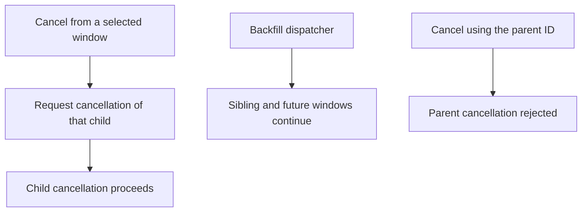
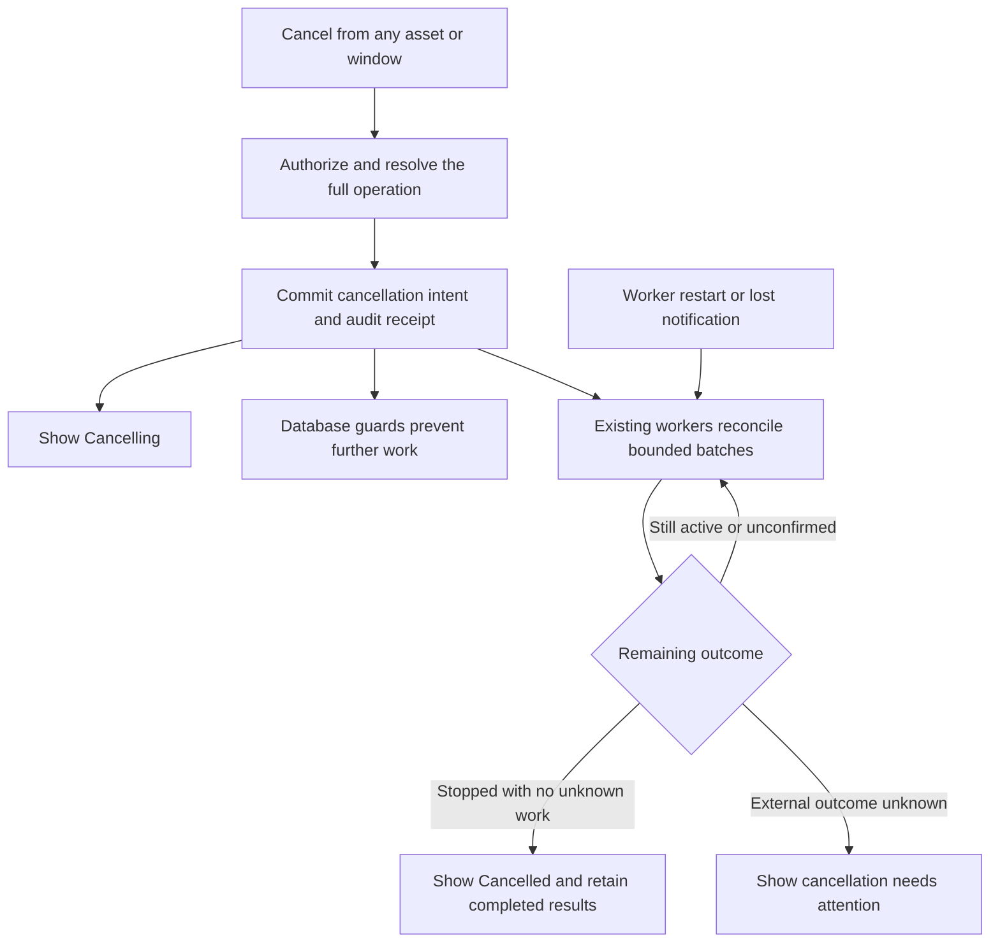

# Change Record: Cancel the full submitted run

| Field | Value |
| --- | --- |
| Status | Plan reviewed |
| Type | Bug fix with an expanded cancellation contract |
| Primary issue | [#699](https://github.com/eirhop/favn/issues/699) |
| Pull request | Pending |
| Related work | [#700: persisted task and crash recovery](https://github.com/eirhop/favn/issues/700) |
| Affected areas | Orchestrator cancellation, backfill dispatch, submission/admission, PostgreSQL, operator read models and View |
| Approved plan commit | Reviewed baseline; commit ID will be recorded in the PR-number update |
| Source baseline | `8a129956b3f571e9db6f8e345b243b14a90b9983` on `origin/main` |
| Last updated | 2026-09-04 |

## One-minute summary

Clicking **Cancel run** should stop the full operation the user submitted,
regardless of which asset or backfill window is selected. Today the action
cancels the selected child; its siblings and future windows can continue.
The smallest complete solution is to persist cancellation on the owning operation,
prevent further work at the database boundaries, and extend the existing workers
to cancel and reconcile the remaining work. The UI shows **Cancelling…** until
work stops or an explicit unresolved outcome needs attention. This needs a change
record because it changes persistence, concurrency, recovery, and public behavior
across application boundaries.

## Impact

For a backfill of ten windows, cancelling while viewing window three must also
stop the unfinished work in windows one through ten. Finished assets keep their
results. Another independently submitted run continues. An operator should not
need to stop the service to prevent the next window from starting.

## Problem analysis

The verified defect is cancellation scope and missing operation-wide enforcement.
It is not evidence that the selected child's request was lost. Durable leaf-run
and runner-task cancellation already exist and remain the execution mechanism.

### Assumptions

- The issue's acceptance criteria define the scope. This record plans the change;
  it does not claim implementation or runtime verification.
- A backfill's durable ledger identifies the submitted operation. Resolve member
  runs and pending submissions through that ledger and validated persisted lineage,
  including linked retries; do not infer ownership from the current UI selection
  or caller-provided metadata.
- A normal run is its own cancellation target unless durable lineage places it
  inside an existing submitted operation. Automatically continued work remains
  in that operation. Starting a fresh independent run is a separate action;
  cancellation never clears itself to allow a retry to resume the old operation.
- An interrupted external write can have an unknown outcome. Killing a BEAM
  process or receiving a cancellation acknowledgement does not prove that the
  external write was rolled back.

### Evidence

Paths below are relative to the repository root; observations refer to the source
baseline above. The issue supplies the incident report; live incident state was
not re-examined for this record.

| Evidence | What it proves | What it does not prove |
| --- | --- | --- |
| [Run detail](../../../apps/favn_view/lib/favn_view/run_detail_live.ex), `run_from_header/3` and `handle_event("cancel_run", ...)` | The action uses `header.run_id` for the selected run. | That the request was lost or that siblings share a leaf cancellation. |
| [Run cancellation](../../../apps/favn_orchestrator/lib/favn_orchestrator/run_cancellation.ex), `request/3` | Backfill parents are explicitly rejected; ordinary runs persist intent. | Support for operation-wide cancellation. |
| [Backfills](../../../apps/favn_orchestrator/lib/favn_orchestrator/backfills.ex), `create_root_run/1` | A backfill root run is stored as `:ok` with an accepted result. | That the backfill workload is complete. |
| [Backfill dispatcher](../../../apps/favn_orchestrator/lib/favn_orchestrator/backfill_dispatcher.ex), `submit_child/3`; [store](../../../apps/favn_storage_postgres/lib/favn_storage_postgres/backfills/store.ex), `claim_new_windows!/1` | Window claiming/submission has no operation cancellation guard. Child IDs are stable, including combined-window groups. | Safety of a read-before-submit check against a concurrent cancellation. |
| [Submission cancellation](../../../apps/favn_orchestrator/lib/favn_orchestrator/run_submissions.ex), `cancellable_submission?/1`; [store](../../../apps/favn_storage_postgres/lib/favn_storage_postgres/run_submissions/store.ex), `request_cancellation!/1` | Queued/preparing cancellation exists; admitting cancellation is rejected. | Coverage of the admission handoff race. |
| [Run manager](../../../apps/favn_orchestrator/lib/favn_orchestrator/run_manager.ex), `enforce_active_cancellation/2`; [task store](../../../apps/favn_storage_postgres/lib/favn_storage_postgres/runner_tasks/store.ex) | Existing task cancellation, receipts, fences and demand accounting can be reused. | That a snapshot of active task IDs includes every queued or concurrently created task. |
| [Projector](../../../apps/favn_storage_postgres/lib/favn_storage_postgres/projections/projector.ex), backfill window projection | Cancelled windows count toward completion; a backfill without failed windows can become `completed`. | Truthful aggregate cancellation presentation. |
| [Task executor](../../../apps/favn_runner/lib/favn_runner/task_executor.ex), `interrupted_asset_result/2` | Interrupted native work explicitly reports an unknown outcome. | Confirmation that external effects stopped. |
| [Run execution](../../../apps/favn_orchestrator/lib/favn_orchestrator/run_server/execution.ex), `stop_post_step_workers/1` | Post-step inspection identities are shared with activation/target recovery; cancelling a run drops its continuation without cancelling shared tasks. | Permission to cancel every task mentioning the same target or materialization. |
| [Run recovery](../../../apps/favn_orchestrator/lib/favn_orchestrator/run_recovery.ex) and leaf cancellation | Existing recovery/cancellation cannot by themselves cancel active descendants of a terminal ordinary root. | An operation-intent-only transition on that root or capacity-independent cleanup discovery. |

## Current behavior

The selected run determines the command target. The backfill dispatcher continues
independently, and replacing the selected ID with the parent ID only reaches an
explicit unsupported-operation error.

## Approved plan

This section becomes the immutable baseline once independently reviewed and
committed. Use the outcome and deviation sections for later changes.

### 1. Resolve and record the request

The public orchestrator cancellation facade resolves an operation from a run ID
inside the authorized workspace. The same resolution serves the operator header
and confirmation. A completed selected child must not disable cancellation of an
active backfill. Revalidate the target when executing the command; the browser's
preview is not authority.

Keep the existing public `:ok | {:error, reason}` cancellation result shape.
`:ok` means durable acceptance, including an idempotent repeat. The receipt and
audit identify the original selection and resolved operation. A conflicting reuse
of an idempotency key remains an error. A completed operation with no prior
cancellation retains its outcome and returns an explicit terminal result.

For a backfill, add explicit cancellation intent fields to the existing backfill
record: request time and bounded reason/actor information, plus the `cancelling`
status. Record the intent, command receipt and outbox event atomically. The
backfill record remains authoritative; do not repurpose the root run's accepted
`:ok` result as a workload status or introduce a second cancellation database.
For ordinary runs and pending submissions, reuse their existing durable intent.
The handoff from a submission to its run must retain that intent.

An ordinary root may already be terminal while a linked retry is active. Add an
operation-intent-only transition that can persist cancellation on that root without
changing its execution status, result or terminal event. The leaf cancellation
guard must continue to reject terminal execution; the operation command checks
durable descendant membership before deciding that all work is complete. Existing
`RunRecovery` gains bounded discovery of ordinary roots with outstanding intent,
independent of the root's execution status, and reconciles their active member
submissions/runs/tasks. Provide an indexed query for that discovery. Do not try to
restart the terminal root or acquire execution capacity to perform cleanup.

### 2. Prevent new work at the owning transaction

Cancellation and work creation must share a short, workspace-scoped database
ordering point. Reuse the existing run-identity locking mechanism where suitable,
keyed by the validated operation root, then lock the affected leaf rows. Use the
same order for cancellation, child enqueue, admission, retry/requeue and task
enqueue/claim; do not acquire these locks around network calls or runner waits.
Where existing claim queries lock a candidate first, rework that boundary to avoid
the inverse lock order and revalidate the candidate under the operation guard.

Every commit which makes new work eligible checks authoritative cancellation.
If cancellation commits first, the work cannot become eligible. If work commits
first, it is durable, belongs to the operation, and must be included in cleanup.
This applies to plan activation, already-claimed windows, pending preparation,
the final durable admission of a run, automatic retries and subsequent asset-task
dispatch. Task claiming also respects cancellation so a queued task cannot start
while the dispatcher is still visiting other windows. Already assigned external
work may take time to stop; acceptance does not promise instantaneous termination.

For a submission already `admitting`, record intent rather than reject it. Under
the same ordering point, either prevent creation of the run and acknowledge the
submission, or find the committed run and cancel it through the leaf lifecycle.
Lost admission acknowledgements must reconcile the reserved identity; they must
not create a replacement run or blindly repeat preparation side effects.

Use validated, indexed operation membership for bounded queries. Persist the
resolved root on pending submissions if their existing intent cannot provide a
bounded indexed lookup; include that small schema addition in this slice. Do not
scan every run or decode every task payload to discover membership. Preserve task
fences, ownership, queue demand and capacity accounting through existing stores.

Task membership means exclusive run ownership, not merely a shared target or
materialization. `AssetRunnerTasks` already persists its `run_id`; use that and
the existing task index. Shared inspection and marker work in
`InitialTargetGenerationReconciler`/`OperationRunnerTasks` retains its target/domain
owner and `operation_id`. Do not stamp a selected run ID onto those shared tasks
or sweep them by target, manifest or pool. Submission preparation uses local
processing and PostgreSQL plan pinning; guard and interrupt its worker/handoff
without conflating it with deployment inspection tasks.

### 3. Reuse workers to finish cancellation

Extend `BackfillDispatcher` with a cancellation branch. It discovers persisted
cancelling backfills even after all ordinary dispatch claims have been disabled,
and resumes in bounded batches using existing leases/fences. Never rely solely on
a notification, a caller-owned task or an in-memory list of children.

- Mark planned/ready windows cancelled only when they cannot produce more work.
  Claimed windows must first reconcile their stable child submission/run identity.
- For each distinct child, cancel its pending submission or durable run using the
  existing leaf paths. Do not recursively call the full-operation public facade.
- Include all durable nonterminal tasks for member runs/reserved submissions,
  scoped by proven exclusive ownership. Page by persisted identity rather than relying on
  `active_runner_task_ids` in a run snapshot.
- Deduplicate combined-window children and reconcile every ledger window they
  cover. Follow validated linked retries without cancelling unrelated operations.
- Keep bounded continuation and error backoff. Do not block the dispatcher's
  mailbox with per-task acknowledgement waits multiplied across a backfill.
  Use supervised bounded work and return results through messages where needed.

Reuse submission workers and run recovery for ordinary-run cancellation, including
an owner crash after intent is saved. Their recovery paths must observe intent
before resuming preparation, admission or execution. No new general-purpose
cancellation service, runner protocol, or scheduling framework is planned.

Preserve `stop_post_step_workers/1`: detach the cancelled run's post-step waiter
and invalidate its continuation so a late reply cannot dispatch more assets.
Already-started shared target reconciliation may finish under its own domain
owner to preserve a completed materialization and serve unrelated activation or
recovery. It is not remaining run execution. A killed waiter alone proves nothing
about remote effects; retain any unresolved completed-write/marker outcome in the
operator diagnostics. Do not add a generic task-consumer registry or cancel
shared target work to make the run look stopped.

### 4. Project truthful progress

The operator DTO supplies the resolved scope, label, cancellation availability
and progress independently of the selected child's execution status. View only
renders it and sends commands through the public orchestrator facade.

| Durable situation | Operator presentation |
| --- | --- |
| Intent saved; children, submissions or tasks remain active/unconfirmed | `Cancelling…`, with bounded remaining-work counts |
| All remaining work is durably stopped; no unknown external outcomes | `Cancelled`, preserving completed/failed asset and window results |
| External outcome is durably unknown or cleanup requires intervention | Explicit cancellation-needs-attention detail; never claim everything stopped |
| Operation completed before cancellation won the transaction | Preserve completion and report that it was already complete |

Use `cancelled` as the final backfill status only when the stop is confirmed.
Use the existing failure disposition with cancellation-specific diagnostics when
terminal unknown work requires attention; do not invent a successful cancellation
for it. Projection must derive this from authoritative intent and durable child,
submission and task outcomes, not just window counts. It must remain rebuildable
and must not overwrite `cancelling` with ordinary `ready`/`completed` events.

### Contracts and invariants

- Authorization, membership, idempotency and auditing remain orchestrator-owned
  and workspace-scoped. Forged parents, cross-workspace IDs and metadata cannot
  enlarge the cancellation target.
- Completed work and unrelated operations retain their outcomes. A selected
  terminal child does not make an active operation terminal.
- Cancellation intent is monotonic. Duplicate commands and worker retries do not
  restart execution or duplicate terminal events/accounting effects.
- Cleanup waits for durable results or explicit uncertainty. A cancellation ACK
  alone cannot erase an unknown native result. Never replay an uncertain write.
- Existing public cancellation entry points use the full submitted-operation
  contract; exact-child cancellation remains an internal lifecycle primitive.
- New work stops through authoritative transaction checks. Reads that cannot
  establish authority fail closed for dispatch and surface a retryable error.

### Scope and non-goals

Include ordinary multi-asset runs, backfill parents/children, combined windows,
pending submission and admission races, automatic continuation/retry, queued and
active tasks, crash recovery, operator DTO/UI and canonical documentation.

Do not implement #700's persistence codec migration or reconnect-loop repair,
native database rollback/kill guarantees, a new manual retry product, a public
cancel-one-window action, or a generic workflow-tree engine. Fresh independent
submissions remain possible; resuming the cancelled operation does not.

### Implementation slices and complexity budget

These estimates count additions and deletions separately. Supporting lines include
tests, shared fixtures and canonical docs. Exclude this record, generated files,
locks, vendored code and formatter-only changes. The race proof drives the budget;
simple UI retargeting cannot satisfy the contract.

| Slice | Outcome and owner | Depends on | Production added | Production deleted | Supporting added | Supporting deleted |
| --- | --- | --- | ---: | ---: | ---: | ---: |
| 1 | Scope resolution, durable intent, migration and transaction guards in Orchestrator/PostgreSQL | None | 300-500 | 40-100 | 350-600 | 20-60 |
| 2 | Bounded cancellation/recovery through dispatcher, submission and run lifecycle owners | 1 | 200-350 | 30-80 | 300-500 | 20-60 |
| 3 | Aggregate read models, operator confirmation/progress and canonical docs | 1-2 | 120-220 | 40-90 | 180-300 | 30-70 |
| Total | One focused implementation PR | | 620-1,070 | 110-270 | 830-1,400 | 70-190 |

Keep this budget unchanged after approval. Explain any category exceeding its
upper estimate by more than 25% or 100 lines, whichever is smaller, and materially
fewer deletions, following the [change-record rules](../README.md). Material scope
or design expansion requires plan re-review, not silent budget inflation.

### Implementation map

| Concept | Expected code area | Responsibility |
| --- | --- | --- |
| Operation command and scope | `FavnOrchestrator`, `RunCancellation`, `Backfills`, persistence commands/queries | Authorized resolution, bounded DTOs, idempotency and intent |
| Database ordering and lookup | PostgreSQL backfill, submission, run and runner-task stores; schemas/migrations | Membership, atomic guards, fenced transitions and indexed pages |
| Cleanup | `BackfillDispatcher`, submission worker, `RunManager`, run recovery, post-step continuations and existing runner-task APIs | Bounded cancellation and durable convergence; shared target tasks retain their domain owner |
| Progress | PostgreSQL projections/operator reads, `OperatorRunView` | Repairable operation status and counts |
| UI | `RunDetailLive` and owning run-detail components | Confirmation, full-scope label and truthful progress |
| Documentation | [Runtime model](../../../apps/favn/guides/runtime-model.md), [operator contract](../../operators/runs-and-schedules.md), public facade docs | Cancellation semantics and limits; update `Favn.AI` routing and feature status if affected |

## Operational design

### Failures and recovery

Before the intent transaction commits, return a failure without claiming acceptance.
After commit, the receipt allows safe replay even if the response or notification
is lost. Persisted intent drives cleanup after worker restart or ownership expiry.
Retry transient persistence/transport failures with bounded backoff; never replay
execution merely because cleanup failed. Expose permanent/unknown dispositions
and keep cancellation enforced even when user attention is required.

Cancellation reconciliation must still run when new admissions are disabled or
capacity is exhausted. A cancelling operation cannot depend on starting more
pipeline work to make progress. Cleanup queries and batches need stable cursors
and fairness across operations, so one unresponsive runner cannot block others.

### Logs and diagnostics

| Event/state | Surface | Safe fields | Frequency |
| --- | --- | --- | --- |
| Cancellation accepted | Existing audit/outbox | Workspace, actor, selected run, resolved operation, command ID, request time | Once per command receipt |
| Cancellation progress | Operator DTO and telemetry | Pending windows/submissions/tasks, active work, unknown outcomes, elapsed time | State changes and bounded reconciliation cadence |
| Cleanup failure or unknown outcome | Warning and operator diagnostic | Stable task/run IDs and bounded error class | First occurrence and backed-off repeats |

Use bounded/redacted reasons. Do not log arbitrary payloads, runtime inputs,
credentials, SQL text or raw exception terms as cancellation diagnostics.

### Deployment, migration, and compatibility

Add cancellation fields/status support and indexes through the normal PostgreSQL
migration/bootstrap contract. Existing backfills have no requested cancellation;
do not reinterpret historical `completed` rows as cancelled. If adding indexed
submission membership, derive it from validated stored identities and reject or
report ambiguous legacy rows rather than guessing another operation's scope.

This pre-v1 change does not support mixed old/new orchestrators: an old dispatcher
would ignore cancellation. Quiesce old orchestrators, apply the schema upgrade,
then start the new control plane. Keep the existing runner protocol unless a
specific incompatible requirement is established and reviewed. Do not downgrade
to code that ignores outstanding cancellation intent; finish/reconcile the
operations first or roll forward. No manual history deletion is a recovery step.

## Verification plan

| Acceptance criterion | Planned evidence | Owner |
| --- | --- | --- |
| Normal multi-asset cancellation | Queued, running, retry-delayed and preparation tasks all stop or retain explicit unknown outcomes; completed assets unchanged | Orchestrator/PostgreSQL |
| Root and selected child/asset cancel the same operation | Multi-window test, completed selected child, combined-window shared child and terminal ordinary root with a live linked retry; unrelated operation continues and original terminal result stays unchanged | Facade/dispatcher |
| No work slips through after acceptance | Deterministic barriers at window claim/enqueue, preparation, admitting/run commit, retry, task enqueue/claim; exercise both transaction winners on separate database connections | PostgreSQL integration |
| Duplicate/lost commands and restart converge | Repeated clicks/keys, new-key duplicate requests, lost response/notification, crash after intent and during partial fan-out, expired claims and restart with admission disabled/capacity exhausted; no duplicate execution or accounting | Persistence-backed lifecycle |
| Post-step cancellation respects ownership | Hold a run's shared post-step task and unrelated same-target recovery at barriers; cancel the run, verify its continuation cannot resume, shared target work survives and unresolved marker outcomes remain visible | Orchestrator/PostgreSQL |
| Completed work and tenancy preserved | Completion racing cancellation, cross-workspace forged IDs/lineage, stale UI target and malformed membership | Facade/storage |
| Truthful UI and projection | Same confirmation from root/child; `Cancelling…`, cancelled and unknown states; projection replay/rebuild and late terminal events cannot restore dispatch | LiveView/read models |
| Documentation matches the contract | Public cancellation docs and operator guide updated; remove unsupported-parent guidance and distinguish receipt from confirmed stop | Docs/API |

Start with focused owning-app tests using the documented app-scoped `cmd mix test`
form. Use the disposable PostgreSQL fixture and real transactions for concurrency
proof; in-memory mocks or sleeps are insufficient. Then run relevant formatting,
warnings-as-errors compilation, fast tests, acceptance/slow tiers and the tag guard
required by the repository. Add browser coverage only for behavior LiveView tests
cannot establish.

Release-shaped stop/restart verification must cover queued, assigned, running and
cancelling work in a fresh VM. #700 owns failures of persisted task decoding and
reconnect behavior; coordinate qualification against its repaired baseline and
state any blocked coverage explicitly. Warm-VM tests do not prove fresh-VM recovery.

For this planning-only change, review links, render both diagrams and run
`git diff --check`. These checks do not prove implementation or live behavior.

## Risks and open questions

| Risk | Impact | Mitigation or decision |
| --- | --- | --- |
| Cancellation/claim lock order | Deadlocks or new work after acceptance | One explicit operation-first ordering contract and deterministic race tests; assess existing candidate-first claim paths before coding |
| Membership before run admission or in combined/retry children | Missed work or cancellation outside the operation | Durable indexed membership and reserved identity reconciliation; fail on ambiguous scope |
| Worker waits grow with the backfill | Cancellation blocks other operations | Bounded supervised work, stable paging and fair continuation |
| Projection terminalizes from counts alone | UI says stopped while a task remains active/unknown | Reconcile tasks/submissions and preserve cancellation intent during projection/rebuild |
| #700 affects cleanup in a fresh VM | Restart proof can fail independently of the scope fix | Separate implementation ownership; require joint release-shaped qualification |
| Additional schema/runner changes become necessary | Minimal plan or budget no longer fits | Record the evidence and obtain independent plan re-review before expanding |

## Plan review

| Field | Result |
| --- | --- |
| Reviewer | Independent agent `/root/review_cancel_plan` |
| Reviewed against | Issue #699, source baseline, evidence and this plan |
| Findings | Clarify operation intent on a terminal ordinary root with live descendants, and distinguish exclusive run tasks from shared post-step target reconciliation. |
| Findings addressed and rechecked | Both corrections added to the plan, implementation map and verification matrix, then independently rechecked on 2026-09-04. The review's initial suggestion to attach run ownership to post-step tasks was withdrawn after inspecting the explicit shared-task contract. |
| Verdict | Approved for implementation planning; no blocking findings remain. Approval is based on issue/source inspection and does not qualify runtime behavior. |

## Implementation outcome

Not started. This PR currently contains the planning record only. Before final
implementation review, record actual scope, production/supporting additions and
deletions per slice, canonical documentation changes and operational limitations.

## Deviations from the approved plan

No implementation deviations yet; no implementation has started.

## Decision log

No implementation decisions yet. Planning choices are recorded above.

## Verification evidence

| Check | Result | Evidence boundary |
| --- | --- | --- |
| Issue and source inspection | Scope and enforcement gaps confirmed at the recorded baseline | Static evidence; incident not reproduced |
| Markdown links and whitespace | All 16 relative links resolve after corrections; `git diff --no-index --check /dev/null <record>` passes | Documentation quality only |
| Mermaid diagrams | Both diagrams rendered to SVG using Mermaid 11 in headless Edge | Local render proof; GitHub render check follows the reviewed-plan push |
| Implementation tests and live stop/restart | Not run; implementation has not started | No runtime or release qualification claimed |

## Final review

Not applicable yet. A different reviewer must compare implementation, outcome,
deviations and actual complexity against the approved planning commit before the
implementation PR becomes ready for review.
