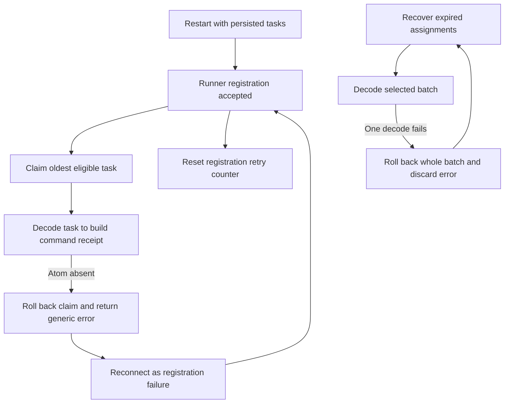
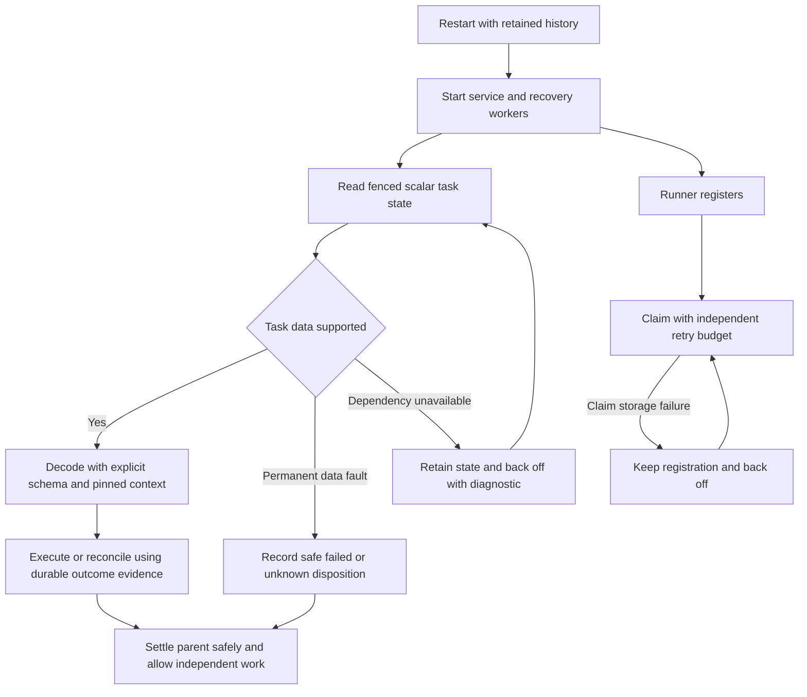

# Change Record: Recover persisted runner tasks after a crash

| Field | Value |
| --- | --- |
| Status | Implementing |
| Type | Recovery and persistence bug fix |
| Primary issue | [#700](https://github.com/eirhop/favn/issues/700) |
| Pull request | [#703](https://github.com/eirhop/favn/pull/703) (draft; planning only) |
| Related work | [#699](https://github.com/eirhop/favn/issues/699), whole-submission cancellation |
| Affected areas | Core task contracts, PostgreSQL task and write-scope storage, orchestrator recovery/admission/settlement, runner claim lifecycle, local startup |
| Investigated revision | `8a129956b3f571e9db6f8e345b243b14a90b9983` on `origin/main` |
| Approved plan commit | `82732b32bfd0caa512a8f3cd6534d8d7a10ec5ee` |
| Last updated | 2026-09-04 |

## One-minute summary

A task written successfully by one VM can become unreadable after restart because
its stored Erlang term contains atoms that do not exist in the new VM. Claims,
cancellation, and recovery all decode the task, so one such row can stop queue
progress; the runner then repeatedly reconnects without retaining its backoff.
This change introduces explicit persistence formats, a safe reader for existing
records, and recovery that can isolate unusable task data through durable scalar
state. The service must regain readiness and process independent work while any
possibly completed external write remains unknown and protected from replay.
This record is the implementation plan; no production fix has been implemented.

## Impact

A restarted service can accept runner registration but fail every subsequent
claim. The oldest eligible task stays at the front of its compatible queue, and
an unreadable expired task can prevent a whole recovery batch from committing.
Operators see registration failures or an opaque local startup timeout instead
of the persistence failure. Deleting history, retrying an interrupted write, or
merely increasing startup timeouts would sacrifice correctness without fixing
the cause.

Successful service recovery does not promise that every interrupted run succeeds.
It means durable outcomes are preserved, unsupported work has an explicit
disposition, unrelated work proceeds, and unresolved external effects are visible.

## Problem analysis

### Assumptions and evidence limits

- The linked object is an issue, not an existing PR. This work prepares and
  independently reviews a plan, then opens a draft PR under the repository process.
- PostgreSQL and retained pinned manifests are the recovery authority. No
  production database, consumer dataset, or running server is changed here.
- The supported upgrade starts from the investigated task protocol, version 13.
  Unsupported older formats fail explicitly; no history deletion is required.
- A production control-plane VM need not load consumer authoring modules. A
  runner needs the correct pinned release before executing consumer code.
- The issue contains the historical incident evidence. The original claim error
  was discarded, so attributing that exact historical claim to the codec remains
  unproved. The codec defect and failure loop are independently established below.
- No umbrella development server/Tidewave endpoint was available. Inspection was
  static plus isolated BEAM processes, without starting application supervisors.

### Evidence

Paths below refer to the investigated revision, not a production deployment.

| Evidence | What it proves | What it does not prove |
| --- | --- | --- |
| [PersistenceCodec](../../../apps/favn_core/lib/favn/contracts/runner_task/persistence_codec.ex), `encode/5`, `encode_private/2`, `decode_uncompressed_term/1` | Payloads, results, and context contain deterministic ETF, read with `binary_to_term(..., [:safe])`; size and compression checks do not remove atom-table dependence | The original incident's discarded claim error |
| Two separate Elixir processes using the current codec source, described below | A valid synthetic payload/context succeeds in the writer, fails in a fresh reader, then succeeds on identical bytes after introducing only the synthetic reference atoms | Production crash recovery or all task kinds |
| [Task store](../../../apps/favn_storage_postgres/lib/favn_storage_postgres/runner_tasks/store.ex), `claim/1`, `encode_command_result/5`, `recover_expired/1`, `to_result/1` | Claim receipt construction decodes inside the transaction; failure rolls back assignment and demand changes. Recovery decodes all selected rows inside one transaction, so one bad row rolls back the batch | Measured production backlog or recovery duration |
| Same store, `request_cancellation/1`, `persist_task_snapshots!/5`, `rehydrate_task_snapshot!/1` | Scalar cancellation still depends on full task decoding through receipt construction. Replay rehydrates current immutable fields and historical outcome rows, and separately safe-decodes ETF snapshots | That changing payload encoding alone fixes replay |
| [ErrorMapper](../../../apps/favn_storage_postgres/lib/favn_storage_postgres/error_mapper.ex) and task decode helpers | Raised decode errors become generic `internal persistence failure` | Permission to log raw payloads or exceptions |
| [RunnerAgent](../../../apps/favn_runner/lib/favn_runner/runner_agent.ex), claim handler, accepted registration, `reconnect/1` | Every claim error reconnects; accepted registration resets the counter; the error is relabelled registration unavailable | An actual registration or network defect |
| [RunnerTaskRecovery](../../../apps/favn_orchestrator/lib/favn_orchestrator/runner_task_recovery.ex), `recover/1`, `recover_task/3` | Batch and release errors are discarded. Existing assignment budget cannot help a claim that rolls back before assignment | That the existing safe/unknown disposition rules should be weakened |
| [OperationRunnerTasks](../../../apps/favn_orchestrator/lib/favn_orchestrator/operation_runner_tasks.ex), `ensure/6`, and [task schema](../../../apps/favn_storage_postgres/lib/favn_storage_postgres/schemas/runner_tasks.ex) | Healthy inspection/generation tasks may have neither run nor operation ID; the existing task has no scalar manifest pin | That a missing parent means corrupt data |
| [Materialization store](../../../apps/favn_storage_postgres/lib/favn_storage_postgres/materialization/store.ex), admission/reclaim paths, and [target locks](../../../apps/favn_storage_postgres/lib/favn_storage_postgres/target_operation_locks/store.ex), `acquire_existing!/4` | Existing target exclusions expire and can be reclaimed; task status unknown alone does not protect a target after lease expiry | A durable nonexpiring write exclusion already exists |
| [Local runtime](../../../apps/favn_local/lib/favn_local/development_runtime.ex), `await_ready/1`, probe and deployment handlers; [FavnLocal](../../../apps/favn_local/lib/favn_local.ex), `await_startup/2` | Caller timeout and registration/deployment work have separate budgets; a `GenServer.call` exit is not converted into a useful startup result | The precise phase responsible for the incident's 60-second timeout |

The reproduction used OTP 29 / Elixir 1.20.2 through `mise exec -- elixir`.
The writer created a `GenerationCapabilitiesRequest` with a `Manifest.Version`
and two unique consumer reference atoms, plus `%{asset_ref: ref}` context. It
encoded both with the current source and wrote the JSON envelopes. A separate
reader verified the name did not exist with `String.to_existing_atom/1`, then
decoded them. Both processes reloaded the investigated codec and request source;
existing Core BEAM files supplied the supporting contract modules. No consumer
module, Mix application, database, or unrestricted ETF decoder was invoked.

```text
writer: {:ok, :ok}
consumer_atom_absent: true
fresh_payload: {:error, :invalid_runner_task_persistence_envelope}
fresh_context: {:error, :invalid_runner_task_orchestration_context}
same_bytes_after_explicit_synthetic_atoms: {:ok, :ok}
```

Introducing the two test atoms is diagnostic proof only, not the proposed fix.
Existing same-VM round trips cannot detect this failure.

## Current behavior

The same payload-dependent read sits underneath execution and cleanup.



## Approved plan

### 1. Define explicit task persistence and compatibility contracts

Core owns a versioned, deterministic, tagged data representation for each of the
eight task payload/result kinds. The orchestrator owns the task-local settlement
context schema; PostgreSQL owns receipt snapshots. These formats are versioned
independently of the live runner protocol. Do not move orchestrator structures
or persistence access into Core.

Use explicit fields and a finite registry of supported Favn structs and enums.
Encode consumer references as module/name strings. Represent tuples, binary
data, exact date/time values, maps with typed keys, and permitted domain values
without arbitrary ETF. Validate complete shapes and semantic field types on
both write and read; reject unknown struct tags/fields and duplicate map keys.
Do not substitute lossy `JsonSafe` conversion for a lossless execution contract.

Persist an immutable task-local pin on every new task at enqueue: workspace,
manifest version ID, manifest content hash, and exact runner pool/release binding.
Retain the existing task/domain identity and optional run/operation linkage;
parentless inspection and generation tasks are valid. Admission verifies the pin
against the retained manifest record before writing the task. Include the pin in
new-format immutable hashes, and reject attempts to change it on replay.

Legacy tasks have no scalar pin. First parse their payload as bounded inert data
without creating atoms and extract the exact kind-specific identity:

| Task kind | Legacy identity location |
| --- | --- |
| `asset_attempt` | Flat `RunnerWork.manifest_version_id` and `manifest_content_hash` |
| `relation_inspection`, `generation_marker_initialize`, `generation_activate`, `generation_discard` | Flat request `manifest_version_id`, `manifest_content_hash`, and `required_runner_release_id` |
| `generation_capabilities`, `generation_marker_read` | Embedded `manifest` (`Manifest.Version`), including `manifest_version_id`, `content_hash`, and `runner_releases` |
| `generation_reconcile` | Nested `activation` request's flat manifest version/content hash/release fields |

Resolve that identity within the task's workspace, verify the retained manifest content
hash and exact pool/release binding, and cross-check any parent pin that exists.
Payload names never authorize their own atom inventory. Persist the verified
scalar pin as additive metadata using a compare-and-set on the original row's
identity/hash; keep these new columns out of the legacy immutable hash field set.
Missing identity, a confirmed missing retained manifest, or a binding mismatch
is a permanent unsupported/corrupt-binding fault; unavailable storage or manifest
fetch is a retryable dependency failure. A nil parent is neither failure.

Consumer reference hydration is an explicit step using this validated task-local
pin and the authoritative retained manifest. Consumer identifiers may be
restored through the existing validated manifest reference rules; arbitrary task
strings, parameter keys, metadata, and struct tags cannot introduce atoms. Core
receives a validated decode context from the orchestrator, never reads storage.
Loading consumer modules or using unrestricted `binary_to_term/1` is not a
fallback. Existing `PayloadCodec` and `RunSnapshotCodec` are useful design
precedents, but their existing-atom behavior is not a sufficient task decoder.

Before switching writes, inventory executable payloads, results, and both the
current and supported previous continuation shapes. Fixed contract atoms and
manifest-declared references are supported; unregistered arbitrary atoms,
consumer structs, PIDs, ports, references, functions, and improper lists fail
at admission before work is dispatched. Do not silently change a parameter's
type or discard a settlement field. Canonical documentation must state this
boundary. Valid previously stored records within that schema remain usable;
unsupported legacy values follow the safe disposition in section 2.

Retain the existing semantic ceilings: 8 MiB asset payloads, 1 MiB other
payloads/results, 4 MiB context, and 256 KiB receipt snapshots. Add explicit
encoded-byte, depth, collection-count, and scalar-length limits before allocating
decoded collections. Proposed structural limits are depth 64 and 100,000 total
nodes per envelope, with encoded-byte ceilings derived for the chosen tags and
checked against PostgreSQL constraints. The fixture inventory must validate
those limits before rollout; changes to accepted data or limits require review.

For existing version-13 ETF envelopes and receipt snapshots, add a narrow,
bounded compatibility parser that reads data tags into the same inert
representation, retaining atom names as strings. It must reject compression,
executable/process terms, unsupported tags, duplicate keys, trailing bytes,
invalid lengths, excessive nesting, and oversized collections before hydration.
Validate the result with the same field schemas. This parser has a substantial
security test obligation; do not build a general-purpose ETF runtime.

Keep legacy task envelopes, payload hashes, outcome rows, and receipt hashes
unchanged. Supported legacy reads reconstruct exact typed values so original
immutable and outcome hash checks still work. New receipts use an explicit
snapshot format and versioned canonical hashes. Replaying an old command must
verify its original request and return its historical status/assignment fence,
not the latest mutable task state. When a new encoder reissues the same logical
enqueue against a legacy row/receipt, compare a validated legacy-normalized
request using the original deterministic hash recipe; preserve every original
identity and immutable field. Changed input must still conflict. Never bypass
hash verification or clear command receipts to permit progress.

### 2. Recover through scalar state and isolate unusable data

Introduce an explicit storage result for task lifecycle state: identity,
run/operation link, status, assignment/session fences, timestamps, retry class,
cancellation evidence, and bounded persistence-failure metadata. Claims,
cancellation, expiry selection, terminal routing, and command receipt creation
must not require decoding an execution payload to manipulate that state.
Full execution/settlement decoding remains a separate validated operation.

Permanent data faults are distinct from unavailable storage, missing manifest
availability, and transient contention. Only a verified permanent fault may
isolate a task. Persist its affected field, format, safe reason code, timestamp,
and original-data digest alongside the task; retain the original bytes. Use a
schema migration for this metadata, task-local pins, independent write-scope
records, and format/size constraints needed by the new representations. No new
public task status is needed.

| Durable evidence for an unusable task | Disposition |
| --- | --- |
| Queued, assignment generation zero, never dispatched | Terminal failed, non-retryable persistence-data error |
| Previously assigned, preparing, running, or cancelling; external outcome not proven | Terminal unknown with automatic replay disabled, after the current owner is fenced |
| Already terminal with a durable outcome | Preserve the existing outcome/status; expose unavailable details without rewriting success into failure |
| Healthy, readable expired assignment | Preserve current safe-requeue, cancellation-acknowledgement, assignment-budget, and unknown rules |
| Storage/manifest temporarily unavailable | Retain state and ownership; retry with bounded backoff, never classify it as corrupt |

For a currently live assignment, do not seize its lease merely because a reader
failed to decode it. Persist the diagnostic, request fenced cancellation where
appropriate, and reconcile after durable completion or expiry. Cancellation
acknowledgement alone is not proof that an external write was rolled back.

When claiming, validate a bounded number of eligible rows under the existing
claim locks. Atomically record a bad queued row's disposition and demand change,
then continue to another eligible row. Examine at most 50 rows per invocation;
if the batch contains only unusable rows, return a typed continuation/backoff
result and allow the next invocation to advance. Never return a bad row as an
executable assignment. Concurrent claimers must not decrement demand twice.

Expiry claiming returns scalar recovery records, so a bad execution field no
longer rolls back the batch. Apply each release with its own command identity and
assignment fence. A failed release retains recoverable ownership until expiry;
retry with the same command identity when the outcome is uncertain. Reconciler
iterations and per-task work have finite time budgets and report failures.

Terminal routing and RunServer/operation recovery must explicitly handle an
unrecoverable task state. A scalar terminal record can deliver a bounded
unrecoverable-result event even when `fetch` cannot produce an executable task.
Recovering the parent then records an explicit failure/unknown reason through
its existing fenced lifecycle; it must not subscribe forever or re-enqueue the
same operation under another identity. An unavailable historical receipt
returns a permanent, typed replay error; it never reruns the command.

Release queue demand exactly once in the task transaction. Settle run-owned
execution leases, materialization claims, circuit permits, and operation state
through their existing owners using durable identities/checkpoints. Missing
settlement context must not erase write uncertainty. Post-commit notifications
are advisory; restart and missed-notification scans must rediscover disposition
and unfinished settlement.

#### Durable protection for an unresolved write

Existing materialization and target-operation leases are not sufficient: they
expire, and normal failure cleanup releases them. Add an orchestrator-owned,
nonexpiring write-scope record in PostgreSQL, separate from queue demand and
temporary execution capacity. Record its task ID, immutable manifest pin,
target/generation scope, assignment fence, and resolution evidence. Derive the
bounded write set from the pinned execution package/operation at enqueue, storing
it independently of payload and context. Use the existing target conflict scope;
do not unnecessarily serialize writes to independent targets.

Before acknowledging `Started` for a potentially effectful task, atomically
activate its write exclusion with the running transition. Use the same target
identity locks as materialization/target-operation admission, with a documented
lock order. Both admission and the start transition must check unresolved scopes,
so already-admitted competing work cannot slip through. A read-only task needs
no write exclusion. A runner cannot execute before this durable acknowledgement.

Retain the exclusion through runner/control-plane loss, lease expiry,
cancellation, generic failure cleanup, and terminal unknown disposition. Release
temporary queue/run capacity independently. Clear the exclusion only in a fenced
transition backed by a committed successful outcome, explicit proof of no effect,
or an authorized reconciliation result that also establishes the old writer can
no longer mutate the target. Mere task failure, cancellation acknowledgement,
lease expiry, or stale late result cannot clear it. Record clearing evidence and
make duplicate clearing idempotent; inspection/reconciliation must have a narrow
authorized path that does not enable ordinary writes past the exclusion.

The upgrade must establish protection for legacy potentially effectful active
and unresolved-unknown tasks before accepting conflicting writes, including
failed tasks whose retry class still expresses an unknown outcome. Use bounded
indexed batches with a durable cursor and per-workspace write-admission gate
until that workspace's inventory is complete. Backfill scopes from validated
inert payload/manifest data or durable run/operation/materialization identities.
If attribution is unavailable, keep an explicit workspace write hold requiring
operator reconciliation rather than guess a target or classify it as read-only.
This rare hold limits same-workspace write availability; other workspaces and
safe reads remain available. Ordinary restarts use the already durable scopes,
so there is no post-startup gap before a recovery scan discovers an unknown write.

This protection covers Favn-declared write scopes. Arbitrary external effects
inside consumer code cannot be inferred; preserve their task's unknown outcome,
disable automatic replay, and require the consumer's reconciliation protocol.
Do not claim distributed exactly-once execution or physical exclusion for an
undeclared external resource.

### 3. Separate claim health from connection health

Keep successful registration intact on a data/storage claim failure. Give the
runner a separate claim-failure counter, last safe failure category, and one
tokenized retry timer. Start at 200 ms, exponentially back off with bounded
jitter to 30 seconds, and reset only after a successful claim or healthy no-work
response. Successful registration must not reset this counter. Queue wakeups,
connection notifications, and stale timers must not bypass a pending backoff.

Reconnect only for transport/session failures. Preserve the pending claim's
command ID and `issued_at` across an uncertain response in the same session;
reconcile any existing assignment before creating a claim for a replacement
session. Do not turn an unknown claim result into permission for another effect.
Permanent authentication/protocol rejections remain explicit failures.

The runner stays responsive to drain, cancellation, and health queries while a
claim is waiting or failing. Move claim I/O through the existing monitored
control-operation mechanism if necessary; do not add blocking sleeps or an
unowned retry process. Preserve existing active-result delivery/fencing logic.

### 4. Bound readiness and make the cause visible

Production control-plane readiness requires working dependencies and available
recovery workers, not an empty queue, a runner in every pool, or successful
completion of every historical run. Isolated records are a degraded diagnostic,
not a permanent service-start barrier. Database/schema/auth failures remain
unready. Runner registration and claim health are separately observable.

Local startup gets one explicit overall deadline covering registration and
deployment. The coordinator replies before the caller's timeout with the
current phase and last sanitized failure class, cancels/monitors its startup
worker, and cleans up owned child processes. `await_ready`/`await_startup` also
translate a coordinator exit/timeout into a bounded error. Increasing the
timeout is not the fix. Verify the restart branch and fresh-deployment branch.



### Contracts and invariants

- Never replay a possibly completed external effect on the strength of a crash,
  decode failure, expired lease, or missing response.
- Durable `Started` acknowledgement precedes executor startup. All transitions,
  terminal dispositions, cancellation races, and late results remain fenced.
- A command retry preserves its identity and historical receipt; a row becoming
  unreadable does not authorize a second command or change immutable history.
- A single invalid record cannot poison unrelated claim/recovery batches.
- State, demand, terminal evidence, and recovery metadata commit atomically;
  dependent settlement is idempotent and rediscoverable after restart.
- Unresolved declared writes retain durable admission exclusion across lease
  expiry and repeated restarts; ordinary failure cleanup cannot clear it.
- No raw task/context/result, customer paths, exception text, or credentials
  appear in logs. No arbitrary atom or consumer struct creation during decode.
- Existing run checkpoint compatibility and fail-closed recovery remain intact.

### Scope and non-goals

The four behaviors above and their crash/upgrade qualification belong in this
PR. It does not implement #699's whole-run/backfill cancellation feature,
promise exactly-once external writes, introduce a second storage backend, repair
customer data, broadly rewrite run snapshots, or redesign runner transport.
If the production restart test exposes another directly blocking decoder in the
same recovery chain, record that finding and re-review the necessary extension
before adding it; do not declare production safety from the codec test alone.

### Implementation slices and complexity budget

Production includes implementation and migrations. Supporting includes tests,
fixtures, release harnesses, and canonical documentation. Exclude this record,
generated files, locks, vendored code, and formatter-only edits.

| Slice | Outcome and owner | Depends on | Production added | Production deleted | Supporting added | Supporting deleted |
| --- | --- | --- | ---: | ---: | ---: | ---: |
| 1 | Explicit Core/context/receipt formats, bounded legacy parser, schema inventory | None | 700-1,050 | 110-190 | 650-950 | 30-80 |
| 2 | PostgreSQL scalar pins/recovery, isolation, hash-compatible replay, parent settlement, durable write exclusion and migration | 1 | 800-1,200 | 150-270 | 1,000-1,450 | 50-140 |
| 3 | Runner claim retry classification and observable recovery failures | 2 | 180-300 | 45-90 | 280-450 | 20-60 |
| 4 | Local bounded startup, canonical docs, production release crash/upgrade harness | 1-3 | 80-150 | 20-50 | 450-700 | 20-60 |
| Total | One recovery change across five owners | | 1,760-2,700 | 325-600 | 2,380-3,550 | 120-340 |

The largest costs are enumerating existing execution shapes, safe legacy parsing,
durable write exclusion, and proving transactional replay and crash boundaries.
The second slice includes the scalar manifest/write-set backfill, admission/start
interlock, and authorized exclusion clearing identified during independent review;
existing expiring locks cannot supply those guarantees. Reuse existing fixtures,
fencing commands, monitored operations, and manifest reference rules. A generic
serializer framework or queue rewrite is outside this budget. Explain category
overruns greater than 25 percent or 100 lines, whichever is smaller, and
materially fewer deletions under the [change-record process](../README.md).

### Implementation map and canonical documentation

| Concept | Owner and expected change |
| --- | --- |
| Task payload/result formats | Core `RunnerTask.PersistenceCodec`, task-kind contract modules, `Limits` |
| Context schema and parent recovery | Orchestrator `AssetRunnerTasks`, `OperationRunnerTasks`, pipeline continuation/checkpoint codecs, RunServer recovery/settlement |
| Scalar lifecycle and replay | Orchestrator persistence commands/results/behaviour; PostgreSQL `RunnerTasks.Store`, `Codec`, schemas and migrations |
| Write uncertainty and admission | Orchestrator materialization/target-operation and reconciliation contracts; PostgreSQL materialization/target-operation stores, task write-scope schema, bootstrap inventory and admission gate |
| Recovery delivery | `RunnerTaskRecovery`, `RunnerTaskResultRouter`, existing run/operation lifecycle owners |
| Claim health | Runner `RunnerAgent`, existing control-operation and operational-event facilities |
| Startup | `FavnLocal`, `DevelopmentRuntime`, launcher diagnostics |
| Current contract | [Elastic runner architecture](../../architecture/elastic-runners.md), [storage architecture](../../storage/postgresql/architecture.md), [data model](../../storage/postgresql/data-model.md) |
| Operator procedure | [Upgrade and rollback](../../production/upgrade_and_rollback.md), [elastic runner operations](../../production/elastic_runners.md), [local development guide](../../../apps/favn/guides/local-development.md) |

## Operational design

### Logs and diagnostics

| Event | Surface and safe fields | Rate limit |
| --- | --- | --- |
| Permanent task-data rejection | Durable task diagnostic plus warning: task/workspace IDs, field, format, reason code, assignment generation, disposition | Once per durable fault/disposition |
| Unresolved write / unattributed legacy write | Durable target exclusion or workspace write hold with reason code, task ID, scope, fence, and reconciliation action | Once per state transition |
| Claim failure | Runner health and warning: operation, fixed category, retry count, next delay | First/category change, then at most once per 30 seconds |
| Recovery batch/release failure | Warning and metric: operation, fixed category, batch size, count, task ID when scoped | First/category change, then at most once per 30 seconds |
| Recovery resumed | Info/metric with recovered count and elapsed time | Once on transition back to health |
| Startup deadline | CLI structured error: phase, elapsed budget, last fixed failure category | Once per startup attempt |

Use stable low-cardinality metric labels; task/workspace IDs belong in bounded
logs and durable records, not metric dimensions. Transient recovery failures
remain visible even if the database cannot persist a diagnostic.

### Deployment, migration, and rollback

1. Qualify a production-shaped control-plane release and separate runner release
   against a disposable PostgreSQL database containing version-13 history.
2. Back up the database and retain the exact old releases and pinned manifests.
   Pause new submissions and stop all old control-plane writers for the upgrade;
   do not mix old/new control planes against new task formats. Stop/drain old
   runners without pretending an interrupted write completed, then migrate the
   schema through the normal bootstrap/upgrade owner.
3. Start the new control plane with new readers and scalar recovery, then matching
   runner releases. Establish the bounded legacy write-scope inventory and keep
   each affected workspace's write gate closed until its protection is durable.
   Other legacy fields are read lazily; write only the new format. No all-history
   rewrite blocks service readiness. Upgrade constraints must permit the
   documented new format and retained old rows.
4. Check readiness, claim/recovery failure categories, demand totals, dispositions,
   and unknown-target protection. Restore submission admission only after a
   smoke run on an independent target completes and recovery makes progress.

This is a coordinated upgrade, not a rolling backward-compatible format change.
After new-format writes, rolling back only the executable is unsupported. Prefer
a forward repair. A database/release restore is an operator-controlled disaster
recovery procedure: reconcile external effects since the backup before allowing
dispatch, because database rollback cannot undo a data-plane write. Never make
history deletion or an unsafe down-conversion part of ordinary restart recovery.

## Verification plan

| Acceptance criterion | Required evidence | Owning layer |
| --- | --- | --- |
| Fresh-VM supported task, context, and receipt reads | Writer/reader OS processes; all eight kinds; consumer refs absent initially; exact binary/tuple/time/map fidelity; current and supported old context shapes; no consumer code loaded in control plane | Core, orchestrator, storage |
| Existing records remain recoverable | Version-13 fixtures and new writes, including parentless inspection/generation tasks; bounded verified pin backfill; absent versus unavailable manifest and mismatched binding; restart without warming atoms; historical receipt replay after later state changes; same logical enqueue through new encoder; changed input conflicts; old immutable/outcome hash recipes exclude added columns | PostgreSQL |
| Bounded safe decoder | Unknown atoms/structs, executable ETF tags, compressed terms, malformed/truncated/trailing data, depth/count/byte exhaustion, duplicate keys, arbitrary user terms; reject before dispatch | Core and compatibility reader |
| Crash/restart readiness | Kill separate control-plane and runner OS processes at queued, assigned, preparing, running, cancelling, post-side-effect/pre-result, committed-result/pre-ack, post-disposition/pre-notification, and post-parent-settlement/pre-ack barriers | Production-shaped release integration |
| Interrupted write never duplicates | External fixture persists a write counter outside the BEAM; kill after effect before acknowledgement; assert one effect and unknown disposition. Advance beyond every task/claim/operation lease, restart again, and attempt both new and pre-admitted conflicting work: declared target remains blocked while an independent target succeeds. Stale late results and generic cleanup cannot clear protection; fenced reconciliation can | Release integration and PostgreSQL |
| No gap before legacy reconciliation | Populate old active/unknown/failed-unknown rows; restart before inventory and between inventory batches; block workspace writes until verified scope coverage, persist cursor, preserve unattributable-workspace hold, then allow independent targets | Migration and release integration |
| Bounded claim failures despite registration success | Repeated data/storage failures with successful registrations; verify independent increasing delays, exact categories, timer/wakeup coalescing, no reconnect for data errors, drain responsiveness, uncertain-response command reuse | Runner behaviour tests |
| Invalid task cannot poison queue | Corrupt oldest queued task plus healthy successor, more than 50 corrupt rows, bad member of expiry batch, two concurrent claimers, and missing/corrupt context/result/receipt | PostgreSQL and orchestrator |
| Cleanup and accounting converge | Cancel/complete/recover races; crash each transactional boundary; exactly-once demand decrement; parent terminal evidence; execution leases and circuit permits; preserve unknown materialization exclusion; lost notification rediscovery | PostgreSQL and orchestrator |
| Diagnostic startup failure | Never-registering runner, repeated claim failure, stalled deploy worker, coordinator exit, deadline racing success, configured registration budget larger than caller budget; bounded error and owned-process cleanup | Local |
| Production scale-to-zero remains ready | Healthy control plane with queued work and zero runners; isolated legacy row does not gate readiness; unavailable PostgreSQL/auth/schema does | Release integration |

Use deterministic barriers or injected clocks for fault points, not sleep-based
race tests. Begin with owning-app checks using `mise exec -- mix do --app ... cmd
mix test`; use the dedicated disposable PostgreSQL 18 setup and credentials from
the [storage test guide](../../storage/postgresql/testing.md), never `favn_dev`.
Run formatting, warnings-as-errors compilation, affected fast/acceptance/slow
tiers and the tag guard as required by the final diff. Put release crash tests
in a CI-covered container/acceptance tier, with process cleanup on failure.

Source inspection and synthetic reproduction establish the defect. Focused tests
establish codec/lifecycle behavior. Release crash and upgrade tests qualify
restart safety. A live deployment smoke test is separate evidence and requires
the operator's deployment authorization; none has been performed for this plan.

## Risks and decisions

| Risk | Decision or mitigation |
| --- | --- |
| Merely preload modules or remove `:safe` | Rejected: accidental initialization ordering or unrestricted atom/executable-term decoding does not provide a bounded persistence contract |
| Rewrite all historic bytes into a new format | Rejected: breaks hashes/receipts unless migrated together and increases upgrade risk; retain original bytes and explicit legacy decoding |
| Atom limits pass per record but grow without bound over many manifests | No arbitrary per-task atom creation; validate identifiers through the existing manifest admission authority and test repeated payloads with disjoint unapproved names; do not treat a task-supplied atom inventory as authority |
| Legacy values were accepted by shallow struct/map validation | Inventory actual owning-layer fixtures; support concrete domain types explicitly; unusable values get a retained, non-retryable disposition, not a silent conversion |
| Missing context hides a materialization claim | Independent scalar write scope survives new-format corruption; legacy attribution failure retains a visible workspace write hold. Test claim expiry, repeated restart, guarded reconciliation and independent workspace progress |
| New data representation exceeds SQL size constraints | Assert worst-case encoded size and limits in migration/codec tests; do not silently enlarge semantic payload budgets |
| A receipt proves success but the payload is unreadable | Preserve authoritative success and immutable outcome history; report unavailable detail separately and never execute again |
| A separate run/manifest decoder still depends on atom state | Production fresh-VM recovery is a release gate; a newly established blocker requires a recorded, independently reviewed plan extension |

## Plan review

| Field | Result |
| --- | --- |
| Reviewer | Independent agent `review_crash_recovery_plan` |
| Reviewed against | Issue #700, investigated source revision, synthetic reproduction, current tests, and this plan |
| Findings | Two P1 findings: expiring target leases do not preserve unknown-write exclusion; parentless tasks cannot obtain a manifest pin from a nonexistent parent. Recheck found one P2: legacy extraction must name the actual per-kind identity shapes |
| Findings addressed and rechecked | Independent recheck accepted both P1 corrections: task-local pins, durable write exclusion, legacy gate, clearing rules, tests and budget. Final recheck verified the kind-to-identity table against current contracts; all findings resolved |
| Verdict | Plan approved on 2026-09-04; no remaining findings. Approval covers the plan only, not implementation or production safety |

## Implementation outcome

Not started. This PR currently contains a planning record only. Implementation,
actual complexity, deviations, and final implementation review will be recorded
without rewriting the approved baseline.

## Verification evidence

| Check | Result | Evidence boundary |
| --- | --- | --- |
| Issue and current source inspection | Verified at the revision above | Historical production causality remains limited by discarded claim errors |
| Separate fresh-VM codec reproduction | Reproduced payload and context failures; unchanged bytes decode after only the two synthetic atoms are introduced | One synthetic kind; supporting Core BEAM files already built; no application startup or database |
| Documentation links, whitespace, diagrams | All 19 relative links resolve; whitespace check passed; both diagrams parsed/rendered with Mermaid 11.12.0 and rendered successfully on GitHub in the approved baseline | Documentation validation only; PR-number rename leaves diagram content unchanged |

### Not verified

No implementation, PostgreSQL migration, production-shaped kill/restart,
compatibility matrix, live deployment, or external-effect reconciliation has
been tested in this planning phase. Plan approval is not a production safety
verdict. Final implementation review is required before this draft can be ready.
