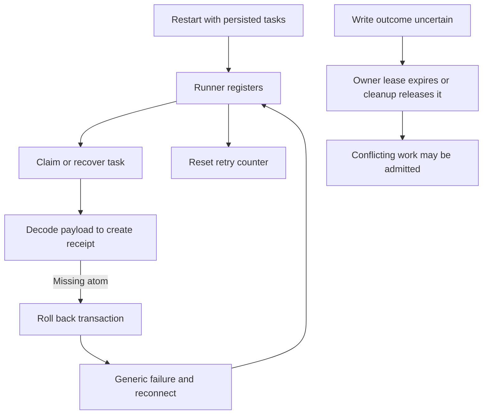
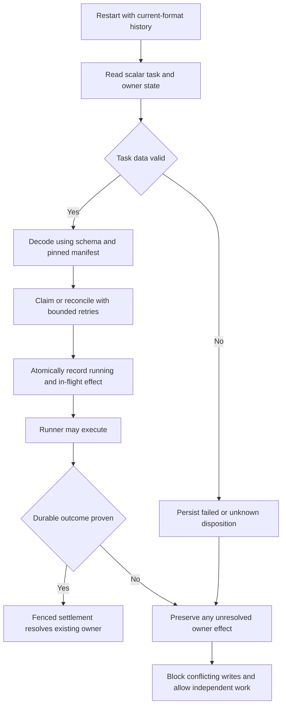
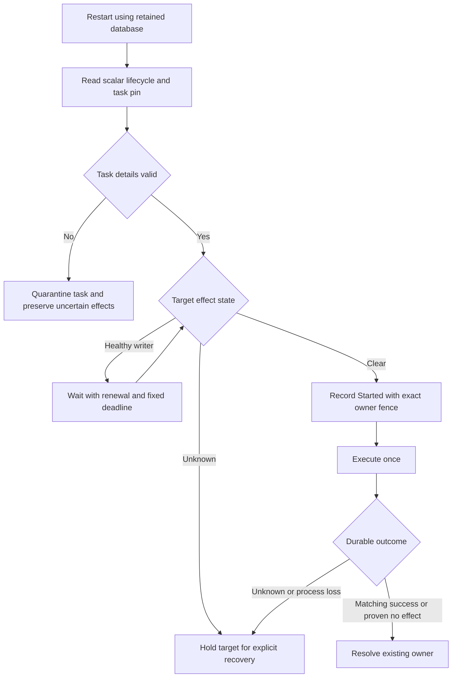

# Change Record: Recover persisted runner tasks after a crash

| Field | Value |
| --- | --- |
| Status | Implemented |
| Revision | 2; implementation authorized on 2026-09-04 |
| Type | Recovery and persistence bug fix |
| Primary issue | [#700](https://github.com/eirhop/favn/issues/700) |
| Pull request | [#703](https://github.com/eirhop/favn/pull/703) |
| Related work | [#699](https://github.com/eirhop/favn/issues/699), whole-submission cancellation |
| Affected areas | Core task contracts; PostgreSQL task/claim/lock storage; orchestrator recovery, admission and settlement; runner claims; local startup |
| Investigated revision | `8a129956b3f571e9db6f8e345b243b14a90b9983` |
| Original reviewed baseline | [82732b32](https://github.com/eirhop/favn/blob/82732b32bfd0caa512a8f3cd6534d8d7a10ec5ee/docs/change-records/2026/issue-700-pr-pending-crash-recovery.md), preserved unchanged and superseded by this revision |
| Revised baseline | `c6f51b015d4b9f983f5fbe1054aa75086a6619c7` |
| Last updated | 2026-09-04 |

## One-minute summary

Valid persisted tasks can fail decoding in a fresh VM. That can roll back claims
and recovery, while the runner repeatedly reconnects and resets its backoff.
Replace the task persistence format, make cleanup independent of executable
payloads, and prove recovery in separate processes. Strengthen existing
materialization claims and target-operation locks so an unresolved write remains
protected after its owner lease expires. Do not introduce a parallel exclusion
system or maintain readers for the old development format.

## Revision decision and assumptions

The user confirmed that none of this is in production and explicitly requested
no legacy compatibility code. This changes the original plan's deployment and
compatibility requirements. The old reviewed plan and its budget remain in the
immutable baseline above; this is an explicit replanning decision, not an
implementation outcome or a silent rewrite of that baseline.

| Original plan | Revised decision | Reason and effect |
| --- | --- | --- |
| Safe ETF compatibility parser, per-kind old identity extraction and old receipt hash recipes | Remove all of them; one current format and hash recipe | No installed production history to preserve; removes an entire parser and compatibility test matrix |
| Dual-format rollout, old-task pin/write-scope backfills, durable inventory cursor and workspace upgrade gates | Fresh pre-production control-plane database when adopting the breaking format | No data conversion or mixed-version support; adoption is explicit, never an automatic startup reset |
| Separate durable write-scope records and exclusion lifecycle | Extend existing materialization claims and target-operation locks | These owners already hold target identity, fences, acquisition, release and reconciliation boundaries |
| Support old embedded pipeline freshness context | Remove the replaced task-continuation fallback | Current task continuations use the existing checkpoint reference |
| Current-format crash recovery, receipt replay, unknown outcomes and failure diagnostics | Retain | These are required for future safe production use |

The issue's old-format compatibility criterion is superseded by the user's
clarification. Records written by the new release must survive every subsequent
restart without reset, module preloading or manual repair. Existing development
data is not deleted by this planning change. There is no authorization here to
reset a database, remove data-plane files, or deploy anything.

## Verified problem and evidence boundary

| Primary evidence at the investigated revision | Finding |
| --- | --- |
| [Task persistence codec](../../../apps/favn_core/lib/favn/contracts/runner_task/persistence_codec.ex) | Payload, result and context are ETF, decoded with `binary_to_term(..., [:safe])`; an absent atom makes valid bytes unreadable |
| [Task store](../../../apps/favn_storage_postgres/lib/favn_storage_postgres/runner_tasks/store.ex), claim, receipt and recovery paths | Receipt construction decodes whole tasks inside transactions; one decode failure can roll back a claim, cancellation or recovery batch |
| [RunnerAgent](../../../apps/favn_runner/lib/favn_runner/runner_agent.ex) and [RunnerTaskRecovery](../../../apps/favn_orchestrator/lib/favn_orchestrator/runner_task_recovery.ex) | Claim errors become reconnects; registration resets backoff; recovery errors are discarded |
| [OperationRunnerTasks](../../../apps/favn_orchestrator/lib/favn_orchestrator/operation_runner_tasks.ex) | Valid inspection/generation tasks can have neither run nor operation parent, so every new task needs its own manifest identity |
| [Materialization store](../../../apps/favn_storage_postgres/lib/favn_storage_postgres/materialization/store.ex), `ensure_target_operation_admission!/1`, `resolve_existing_claim!/3` | Admission ignores expired ownership and can reclaim the same claim after expiry |
| [Target-operation locks](../../../apps/favn_storage_postgres/lib/favn_storage_postgres/target_operation_locks/store.ex), acquire/release paths | Expired locks can be overwritten; release deletes the row |
| [MaterializationClaims](../../../apps/favn_orchestrator/lib/favn_orchestrator/materialization_claims.ex), `fail_v2/2` | Generic failure settlement marks failed and releases the operation lock, without preserving unknown-write exclusion |
| [DevelopmentRuntime](../../../apps/favn_local/lib/favn_local/development_runtime.ex), `await_ready/1`, and [FavnLocal](../../../apps/favn_local/lib/favn_local.ex), `await_startup/2` | Registration/deployment and the caller have different timeout budgets; an exit can escape instead of returning useful startup diagnostics |

The initial investigation reproduced the codec defect using two separate OTP 29 /
Elixir 1.20.2 processes. The writer encoded a typed capabilities request and
context with two unique consumer reference atoms. The reader loaded the current
codec/request source with supporting Core BEAM files, but no consumer application
or supervisors. It verified the name was absent, observed both decode failures,
then introduced only those two synthetic atoms and decoded the same bytes:

```text
writer: {:ok, :ok}
consumer_atom_absent: true
fresh_payload: {:error, :invalid_runner_task_persistence_envelope}
fresh_context: {:error, :invalid_runner_task_orchestration_context}
same_bytes_after_explicit_synthetic_atoms: {:ok, :ok}
```

The independent reviewer repeated that reproduction. No live database or
production release restart was exercised. Tidewave was unavailable during the
investigation. The exact historical claim error was discarded, so the original
incident's full causal chain remains unproved; the code defects are established.

## Current behavior



## Revised implementation plan

### 1. One explicit persistence format

Replace task payload/result/context ETF and receipt snapshot ETF with one
versioned, deterministic data format for each owning boundary. Core owns the
eight task-kind payload/result schemas; the orchestrator owns its settlement
context; PostgreSQL owns bounded scalar receipt snapshots. Reuse existing
JSON/canonicalization and exact date/time primitives where their contracts fit.
Do not build a general serialization framework or move orchestrator state into
Core.

Use fixed field/struct/enum registries and explicit representations for binary
data, tuples, dates/times, lists and maps with typed keys. Preserve exact supported
values and reject unsupported types before dispatch. Consumer module/name
references are strings in storage. Arbitrary strings, parameter keys and
metadata cannot create atoms. Hydration accepts only fixed contract atoms or
references validated against the retained pinned manifest; it does not load
consumer authoring code or depend on a previously populated atom table.

Every new task persists workspace, manifest version ID/content hash and exact
runner pool/release identity at enqueue, including parentless operations. Verify
this pin before accepting the task and pass a validated context into the Core
decoder. No identity is extracted from an old payload and there is no fallback
decoder. Keep the task pin independent of payload/context for recovery reads.

Enforce current semantic byte ceilings (8 MiB asset payload, 1 MiB other
payload/result, 4 MiB context, 256 KiB receipt), plus explicit encoded-byte,
depth and node-count limits. Start with depth 64 and 100,000 nodes, qualified
against actual owning-layer fixtures. Reject unknown/extra fields, duplicate
keys, invalid references and malformed values with fixed error categories.
Changing accepted domain types or raising budgets requires review.

Keep only the current pipeline checkpoint-reference continuation. Delete the
displaced task ETF readers/writers, old task-continuation fallback and their
compatibility-only tests. Do not perform an unrelated repository-wide cleanup.

Use one canonical request/payload/outcome hash recipe. Receipts still preserve
the original command's historical status and assignment fence, refer to immutable
outcomes, and detect changed input. Keep normal current-format receipt retention
and idempotency rules; remove old-version hash reconstruction and dual writes.

### 2. Separate lifecycle state from executable data

Use an explicit bounded scalar task-state result for cancellation, expiry
selection, result routing and receipt creation. It includes task/parent identity,
the immutable manifest pin, task/session/assignment fences, status, timestamps,
retry classification and a fixed persistence-failure category. Decode payload
and settlement context only when the caller actually needs them.

Claim up to 50 eligible candidates under existing claim locks. If a candidate has
a permanent decode/validation fault, persist its safe disposition and demand
change atomically, then continue to another candidate. Never return an invalid
assignment. Batch exhaustion produces bounded continuation, not a busy loop.
Expiry selection returns scalar records and releases them individually with
stable command identities. Cancellation and cleanup must remain possible even
when executable data is unreadable.

| Evidence | Disposition |
| --- | --- |
| Invalid queued task, assignment generation zero, never dispatched | Failed, non-retryable data error |
| Unusable previously assigned task whose external outcome is unproved | Unknown after owner fencing; no automatic replay |
| Already terminal task with unreadable detail | Preserve its committed status/outcome; report detail unavailable |
| Healthy expired task | Retain existing safe-requeue, assignment-budget and cancellation/unknown rules |
| Database/manifest temporarily unavailable | Retain state, back off and report dependency failure; do not quarantine |

Do not seize a live assignment merely because a read fails. Its owner may still
finish; cancellation/completion races remain fenced. Parent run/operation
recovery must consume an explicit unusable-task result rather than wait forever
or re-enqueue under a new identity. Preserve bytes for diagnosis within the
current format. Unreadable receipt data cannot authorize executing the command
again.

Demand changes commit once with task state. Run execution leases, permits and
materialization settlement remain behind their existing owners. Notifications
are advisory; persisted state must allow rediscovery and idempotent cleanup
after a crash between commit, notification and parent settlement.

### 3. Strengthen existing write ownership; do not replace it

**Recommendation: retain materialization claims and target-operation locks and
extend their recovery semantics. Do not add the separate write-exclusion
subsystem proposed in revision 1.**

| Choice | Assessment |
| --- | --- |
| Keep only today's expiring leases | Insufficient: lease expiry proves loss of authority, not that an external write stopped or failed |
| Extend existing claim/lock records | Recommended: preserves existing target identities, locking, fences and lifecycle owners while closing the unknown-outcome gap |
| Replace them or add a parallel write-scope ledger | Not justified by current evidence; duplicates ownership, cleanup and reconciliation state |

The existing records gain explicit effect state separate from owner lease state:
`not_started`, `in_flight`, `outcome_unknown`, or `resolved`, with exact task/start
assignment linkage and durable resolution evidence. Use typed persistence
commands/results and indexed queries in the existing stores. A lease may expire
while the effect remains unresolved. No third ownership table, startup inventory
cursor, or workspace upgrade-hold mechanism is needed for the clean format.

- Asset materializations link the scalar task record to the existing claim key
  and original claim fence. Claims already carry target/generation/partition,
  run and optional operation identity. Each child materialization keeps its own
  claim; a shared operation lock must not replace that with an unbounded list of
  task IDs or clear while any linked child effect remains unresolved.
- Mutating generation tasks use the target-operation lock with their stable
  operation/task identity. Parentless marker initialization obtains a task-owned
  operation lock through the existing owner. Serialize mutating generation tasks
  on the same target; inspection, capabilities, marker-read and read-only
  reconciliation need no writer claim. Keep target recovery's explicit authority.
- A shared operation lock's direct task linkage is only for its serialized
  generation mutation. Release/takeover checks both that mutation and all
  unresolved child materialization claims with indexed `EXISTS` queries, not an
  in-memory list. Add only indexes for unresolved claims by workspace/target and
  operation, and exact task linkage; reuse the lock's workspace/target key.
- Before acknowledging `Started`, validate the exact claim/lock fence and mark
  its effect in-flight in the same transaction as task status running. Take the
  existing target identity locks in a documented order. Both ordinary admission
  and `Started` recheck conflicting unresolved effects, including competitors
  already admitted before the first task started.
- Keep the original started assignment fence separate from the newer recovery
  fence. An expired or replaced pre-start claim cannot start execution, and
  recovery ownership is not evidence that the earlier external writer stopped.
- Admission, reclaim, release and generic failure cleanup must respect in-flight
  and unknown effects without an expiry predicate. Same-operation identity must
  not permit a different task to bypass an unresolved effect. Safe pre-start
  expiry can still release/requeue when durable state proves no execution began.
- A committed successful outcome or explicit proof of no effect can resolve the
  matching effect through fenced idempotent settlement. Unknown errors and
  cancellation acknowledgement cannot resolve it. A stale late result must not
  clear protection; authorized reconciliation must establish both the outcome
  and that the old writer can no longer mutate the target before clearing.

Compare the existing target/generation/partition conflict scope, not only the
claim key (which also includes input/producer identity). Preserve parallel work
only where disjointness is proven. Combined windows retain their existing
whole-target lock. If metadata cannot prove disjointness, conservatively block
the target; do not introduce a range-overlap framework in this fix.

Because the effect is recorded before execution, protection exists immediately
after restart and survives repeated restarts and all lease expiries. Release
temporary execution capacity independently; unrelated targets can proceed.
Missing/corrupt payload or context cannot hide the independent claim/lock link.
Reconciliation reads need a narrow allowed path while ordinary writes remain
blocked; reuse existing target-recovery/operation contracts and record evidence.

This covers Favn-declared target mutations. Favn cannot infer arbitrary external
effects inside consumer code: those tasks remain unknown and are not replayed
automatically, but this is not a claim of physical exclusion for undeclared
resources or exactly-once external execution.

### 4. Independent retries and bounded startup

Give claim failures their own counter, fixed failure category and one tokenized
timer. Back off from 200 ms to 30 seconds with bounded jitter; reset only after a
successful claim/healthy no-work response. Registration success cannot reset
claim failures; wakeups and stale timers cannot bypass a pending delay. Retain
registration on data/storage errors; reconnect for transport/session failures.
An uncertain same-session claim response retries the same command ID/issuance;
replacement sessions reconcile existing assignments before requesting new work.

Use the existing monitored control-operation mechanism for claim I/O so drain,
cancellation and health queries remain responsive. Surface batch/release failures
instead of discarding them. Log fixed category/operation/count/delay fields, never
raw tasks, arbitrary exceptions or credentials; log first/category change and
then at most once per 30 seconds. Keep task IDs out of metric dimensions.

Local startup has one overall registration/deployment deadline and returns a
phase plus last sanitized failure before the caller's timeout. Cover coordinator
exit, stalled deployment workers and owned-child cleanup. Production readiness
requires working dependencies/recovery workers, not an empty queue or runners in
every pool. A bad current-format task must not prevent service readiness.



## Invariants and scope limits

- New-format queued/running/cancelling/terminal records and receipts survive a
  fresh VM without incidental atom loading or deleting history.
- A crash, missing response, expiry or decode fault never proves a write safe to
  repeat. `Started` remains durably acknowledged before executor startup.
- Claim/task/owner fences and request identity remain authoritative. An unreadable
  detail does not erase a committed outcome or let a stale writer settle.
- One invalid task cannot roll back unrelated recovery work or poison its queue.
- Expired owner authority does not clear unresolved target effects; successful
  service recovery and unknown task outcomes can coexist.

No implementation of #699's whole-submission cancellation, generic serializer
framework, replacement ownership system, old-format converter/reader, dual
schema operation, broad run-snapshot rewrite, or automatic database reset is in
scope. A newly proven blocker beyond these boundaries requires a recorded plan
deviation and review.

## Implementation decisions requiring comparison with the baseline

| Planned | Implementation decision | Reason and proof boundary | Review |
| --- | --- | --- | --- |
| Explicit scalar lifecycle result | Keep one task result struct with `data_state` (`not_loaded`, `available`, `unavailable`) and scalar pin/failure fields | Lifecycle commands and receipts omit executable data; detail reads return availability explicitly. The result router performs bounded asynchronous reads and periodic rediscovery after lost notifications. | Source and scope accepted; final verification review below |
| Resolve unknown effects through authorized reconciliation | Add an explicit administrator task-write resolution to existing target recovery and owner records | Existing cancellation, session fences, SQL disconnect and marker reads cannot prove that an external backend writer stopped. Require an administrator attestation of runner/backend quiescence, exact task/start generation and original owner fence, a stop time and bounded evidence reference; collect fresh outcome evidence after that stop. Generic asset writes support only administrator-attested verified no-effect; ordinary matching committed task success already settles automatically. No invented successful task/freshness history or automatic retry. | Independent reviewer accepted the implementation and deviation on 2026-09-04; final verification review below |
| Permit disjoint scopes when proven | Hold every declared writer for the same workspace and logical target while any effect is in flight or unknown | Existing freshness window labels, generation IDs and physical partition layouts do not enforce confinement of the rendered SQL write. There is no sound same-target disjointness exception in the current contract. This also serializes healthy concurrent windows on one target; unrelated targets continue. Adding adapter-enforced write-range proofs is outside this repair. | Independent reviewer accepted the implementation and deviation on 2026-09-04; final verification review below |
| Deterministic supported values | Use the typed current format for persisted data and deterministic term fingerprints only for exact semantic byte accounting and full retained-manifest equality | Fingerprints do not decode ETF or retain a legacy reader. Separate-process tests compare exact reconstructed values. | Source and scope accepted; final verification review below |

Task decoding also accepts one separately retained execution package as atom
provenance. Runtime-input resolver module names exist in the package, while the
manifest contains only its hash. A fixed bounded current-format path extracts
that hash without hydrating atoms. The verified task pin authorizes only the
manifest's exact linked package, checked against the manifest asset and stored
identity. The embedded task package cannot authorize atoms. Missing/corrupt
packages make task details unavailable; database failures remain retryable.
The reviewer independently approved this narrow deviation on 2026-09-04, with
fresh-process and malformed/wrong-package coverage required.

Inspection persistence also moves the pure `Favn.SQL.Relation` and `Column` DTOs
from SQL runtime into Core, keeping their module names. `SQL.Result` stays in
runtime because inspection already lowers samples to maps. Inspection adapter
identity is stored as the exact full module-name string: this preserves physical
fingerprint identity without allowing persisted data to authorize adapter atoms.
The independent reviewer confirmed this boundary and required fingerprint
equivalence coverage; final results and implementation verdict are recorded below.

Sequential claims now declare `purpose: ownership_only`. Matching durable task
completion releases them atomically without publishing materialization/freshness
history; unresolved effects remain held. The reviewer recommended this explicit
purpose and `released` status instead of key-prefix inference or a separate
parent settlement retry path. Materialization-purpose claims retain ordinary
publication, with lease-independent settlement allowed only for the exact
already-committed task/effect/result and unchanged owner fence. Final review and
verification cover both paths.

The explicit task-write resolution accepts one task and one stable command identity.
The public facade reauthorizes the administrator and uses existing operator command
audit. The proof identifies the original started assignment and owner fence, the
stop time, an enumerated stop mechanism, and bounded reason/evidence reference.
It attests that both the runner and backend writer can no longer mutate; this is
trusted administrator evidence, not machine-verified quiescence.

For generation mutations, outcome observations are read-only tasks with identities
scoped to that resolution command and original start generation. They must be
issued after the attested stop and match the original request: exact marker and
physical fingerprint for initialization, activation reconciliation, or candidate
absence plus marker exclusion for discard. An asset write instead requires an
explicit `verified_no_effect` attestation; schema/row-count inspection cannot
establish that historical fact.

Settlement takes the target advisory before task/owner rows, requires the task to
be terminal/fenced, and rechecks exact start/owner linkage. Existing command
receipts retain immutable resolution proof; the existing owner records resolution
without clearing any sibling effect. Task/run outcomes stay unchanged and nothing
is retried automatically. Ordinary target recovery may then acquire its usual
lock and continue. Same-target disjoint/combined-window tests must prove exclusion,
while independent-target tests prove continued admission.

## Complexity budget and implementation map

Production includes contracts, codecs, store/lifecycle changes and schema DDL.
Supporting includes tests, fixtures, release harnesses and canonical docs. Exclude
this record, generated files, dependency locks and formatter-only edits.

| Slice | Owner and outcome | Production added | Production deleted | Supporting added | Supporting deleted |
| --- | --- | ---: | ---: | ---: | ---: |
| 1 | Core/context/receipt current-format codecs and required task pin | 450-700 | 170-270 | 450-700 | 70-130 |
| 2 | Orchestrator/PostgreSQL scalar task recovery and isolated disposition | 220-360 | 90-160 | 350-550 | 40-90 |
| 3 | Existing materialization/target-operation effect state, start interlock and settlement | 220-380 | 60-120 | 300-500 | 30-70 |
| 4 | Runner retries/recovery diagnostics and local startup deadline | 160-260 | 50-100 | 300-450 | 30-70 |
| Total | One current contract; reuse existing owners | 1,050-1,700 | 370-650 | 1,400-2,200 | 170-360 |

Slices 2 and 3 depend on the scalar contracts in slice 1; end-to-end qualification
depends on all slices. The old approved estimate was 1,760-2,700 production
additions and 2,380-3,550 supporting additions. These remain rough planning
ranges, not a demonstrated minimum. The remaining cost is concrete schema
coverage and transactional fault handling across owners. Explain overruns above
25 percent or 100 lines, whichever is smaller, and materially fewer deletions
under the [change-record process](../README.md).
The reviewer identified slice 3 as the least certain estimate: DDL, both owner
contracts, the atomic start interlock and evidence-based settlement must fit the
actual design. Re-review a material overrun; do not weaken safety to fit a number.

Canonical updates belong in [elastic runner architecture](../../architecture/elastic-runners.md),
[PostgreSQL architecture](../../storage/postgresql/architecture.md),
[data model](../../storage/postgresql/data-model.md),
[upgrade guidance](../../production/upgrade_and_rollback.md),
[runner operations](../../production/elastic_runners.md), and the
[local development guide](../../../apps/favn/guides/local-development.md).
Do not document a proposal as implemented behavior before the code changes.

## Adoption and operation

Adopt this pre-production breaking change with a freshly bootstrapped disposable
control-plane database and aligned control-plane/runner artifacts. Use normal
schema bootstrap/version checks; an old database or unsupported task encoding
returns a bounded incompatibility error and instructions for explicit developer
reinitialization. There is no old-data migration, automatic reset or startup
deletion. Before discarding old development coordination state, stop its writers
and reconcile any uncertain external effects; a database reset cannot undo them.
Do not delete consumer data-plane files as part of this change.

After adoption, ordinary crashes always reuse that database and retained manifests.
Restart must not require another reset or manual task repair. Rolling back to
the previous development version requires its separate compatible database;
do not claim mixed-version support. Logs and operator diagnostics distinguish
data faults, unavailable dependencies, unresolved writes and startup phases.

## Verification plan

| Requirement | Focused proof |
| --- | --- |
| Fresh-VM codec correctness | Separate writer/reader OS processes for all eight task kinds, context and receipts; initially absent consumer refs; no consumer modules loaded; exact binary/tuple/date/time/key fidelity; parentless operation pins |
| Strict current-format contract | Reject old format rather than decode it; reject malformed/oversized/deep/duplicate/unknown values before dispatch; repeated unapproved names cannot grow atoms |
| Idempotent current-format replay | Replay after later state changes returns original command fence/status; changed input conflicts; canonical payload/outcome hashes remain checked; committed-result/pre-ack restart does not execute again |
| Queue and cleanup isolation | Invalid oldest task then healthy successor; more than 50 invalid rows; bad expiry-batch member; cancellation with unreadable context/result; two claimers; failure between commit/notification/settlement; exact demand convergence |
| No unsafe write after a crash | Kill at queued/assigned/preparing/running/cancelling and after external effect before durable result. A counter outside the BEAM proves no duplicate effect. Advance beyond all leases, restart twice, try new and pre-admitted competitors: affected target stays blocked and independent targets proceed |
| Existing-owner coverage | Shared operation with multiple child claims; marker initialization without parent; activation/discard locks; same-operation different-task competitor; claim replaced/expired before Started; different claim keys for the same write scope; disjoint versus combined partitions; generic failure/release/reclaim cannot clear unresolved state; stale result rejected; evidence-backed reconciliation and duplicate settlement succeed |
| Bounded runner and startup behavior | Successful registration plus permanent claim failure retains independent backoff; wakeup coalescing, drain responsiveness, uncertain command reuse; stalled deploy/coordinator exit/deadline race returns useful error and cleans up owned children |
| Production-shaped restart | Separate control-plane and runner release processes on disposable PostgreSQL; zero-runner readiness; database/auth/schema failure unready; malformed task does not gate readiness |

Use deterministic barriers/injected clocks, not sleep-based race tests. Run the
narrowest owning-app checks first with `mise exec -- mix do --app ... cmd mix test`.
PostgreSQL tests use the disposable PostgreSQL 18 setup in the
[storage test guide](../../storage/postgresql/testing.md), never `favn_dev`.
Run formatting, warnings-as-errors compilation, affected fast/acceptance/container
tiers and the tag guard for implementation. Keep release crash tests in a
CI-covered tier and clean up their processes on failure.

## Review and verification evidence

| Item | Result and boundary |
| --- | --- |
| Original plan review | Approved at the original baseline after two P1 and one P2 corrections; that approval does not approve this revision |
| Revised recommendation review | Independent agent `review_crash_recovery_plan` verified existing-owner reuse, direct-mutation/child-claim cardinality, the original start fence, expiry-independent guards and pre-admitted competitors against source |
| Revised plan verdict | Revision 2 approved on 2026-09-04 with no remaining findings; estimate uncertainty recorded above. Approval covers the revised plan only |
| Source and synthetic reproduction | Verified/repeated during the initial investigation; establishes defects, not production restart safety |
| Current revision doc validation | All 18 relative links resolve; whitespace passes; both Mermaid diagrams parse and render locally and on GitHub at the revised baseline |

## Actual implementation

The implementation replaces the development task encoding with one closed typed
format. Verified retained manifests and their exact linked execution packages
provide consumer-name authority. Scalar pins, lifecycle transitions and command
receipts remain readable when executable task details are corrupt. Invalid queue
entries are quarantined in bounded batches, and transient storage failures remain
retryable. No old-format reader or parallel write-exclusion service remains.

Existing claims and target-operation locks now retain the task, original Started
assignment and owner fence that may have caused an external effect. Started and
settlement share one target transaction interlock. Expiry, cancellation and process
loss cannot clear an uncertain effect. Matching committed success or proven
no-effect settlement resolves it; administrator recovery requires explicit
quiescence attestation and the operation-specific evidence described above.

Healthy same-target writers wait without consuming an execution attempt. Runner
preparation remains cancellable while both the task assignment and manifest lease
renew. Sequential admission retains one absolute deadline in the existing durable
retry checkpoint, records an admission queue event, and preserves that deadline
through restart and eventual dispatch. Unknown outcomes remain excluded without
automatic replay. Unrelated targets and read-only inspections can progress.

The branch was first rebased on `origin/main` at `2f26d586` during implementation.
It was rebased again on `f5c530a7` after PR #702 merged whole-run cancellation.
The second rebase had three overlapping conflicts in runner-task storage, the
migration registry and runner-task fixtures. Cancellation ownership is now taken
before blocking target/task ownership. Queue selection takes the cancellation
lock before the task row and uses a nonblocking target lock after that row, so a
busy writer is skipped instead of creating the reverse-order wait. Release and
retry preserve cancellation outcomes while retaining unknown write exclusion.
Cancellation migration `20260904010000` precedes crash recovery migration
`20260904020000`; diagnostics pin the definition produced by both migrations.

Local startup cleanup was reconciled with the new incremental reload
implementation: the startup deadline cleans up owned startup children, while an
unknown reload outcome retains the upstream recovery semantics.



Additional implementation decisions:

| Planned contract | Actual decision | Reason and verification |
| --- | --- | --- |
| Closed task values | Fixed error classifications retain atoms; custom error type/phase labels become bounded strings | Exception module names must not depend on incidental atoms in the reader VM. Retry and outcome classifications remain unchanged; fresh-process failure fixtures cover this. |
| Workspace-authorized manifest pins | Pre-activation relation inspection accepts explicit platform deployment authority plus workspace administration, with every write link absent | Compatibility planning must inspect the new retained manifest before a deployment exists. Subsequent reads trust only the immutable persisted task row, then reverify retained hash/release/package identity. Negative role/write-link/pin tests and a fresh reader cover this exception. |
| Exact pinned manifest identity | Compare immutable identity fields, excluding insertion time | Registering an artifact adds a database timestamp. That timestamp cannot invalidate the same verified manifest. |
| Same-target exclusion | Distinguish healthy contention from unknown outcomes and retain bounded waiting | The stricter guard exposed fixtures that started concurrent writes on the same target. Queue/capacity tests now preserve concurrent assignment and serialize Started/completion; dedicated tests cover pre-admitted contention. |
| Runner preparation lease | Register the deterministic manifest lease identity with the agent before preparation | The agent must renew and clean it up during a long admission wait. No additional coordinator or protocol was introduced. |
| Sequential waiting | Reuse the existing persisted sequential retry checkpoint with an absolute admission deadline and unchanged attempt | Restart cannot reset an admission timeout; successful admission clears the wait checkpoint in durable task intent. Snapshot decoding preserves the checkpoint keys, and enqueue errors retain the already-persisted event sequence. |
| Immutable task identity | Validate scalar run/write/context linkage both at enqueue and every hydration | Hash verification alone does not reject a coherently replaced payload from another valid task under the same manifest. Swapped payload/context tests prove rejection and quarantine. |
| Scalar command replay | Require exact receipt fields, closed enum values, bounded identifiers and valid counters/hashes | A receipt cannot override immutable task fields or replay an invalid assignment. Malformed receipt regressions retain successful original replay. |
| Missing ownership | Return an explicit invalid-owner error if the claimed owner row is absent at enqueue | A strict boolean guard avoids raising on a missing row. The regression deletes only its sandboxed fixture claim, then verifies explicit rejection. |
| CI crash qualification | Place the seven-phase SIGKILL probe in the existing PostgreSQL slow tier | This tier already provisions PostgreSQL and executes storage tests; no new CI service or test job is needed. |

## Actual complexity and variance

The following counts use the formatted implementation diff against the rebased
planning head, excluding this change record. Pure DTO moves contribute zero;
there are no generated files or dependency changes. Counts include formatting
within edited code conservatively: new formatted code is still implementation
cost. No formatting discount is used to claim compliance with the estimate.

Each file is assigned to its main slice to avoid double counting. The shared
PostgreSQL runner-task store and migration are charged entirely to slice 2,
including their codec/owner integration. Shared crash fixtures and the process
probe are also in slice 2. Sequential admission and its checkpoint tests belong
to slice 3. The per-file ledger was retained with the verification output.

| Slice | Production added/deleted | Supporting added/deleted | Explanation against the approved range |
| --- | ---: | ---: | --- |
| 1: current-format contracts and pins | 1,317 / 103 | 818 / 42 | Closed struct/atom/value coverage across eight request/result types, bounded decoding, exact result identity, context restoration, retained-package verification and pre-activation authorization were substantially underestimated. The old ETF reader is removed; there is no compatibility layer. |
| 2: scalar recovery and disposition | 1,316 / 303 | 1,910 / 124 | Includes all shared store/DDL integration: immutable pins and hashes, scalar receipts, isolated hydration/quarantine, historical claim fencing, bounded rediscovery and the merged cancellation lock order. Fresh-process, corruption and cancellation-race probes add more fixtures than estimated. Existing lifecycle behavior stays in place and gains explicit validation. |
| 3: existing owner effect state | 1,148 / 71 | 1,039 / 16 | Exact owner/start settlement, administrator quiescence evidence and audit replay, read-only generation evidence, healthy contention and persisted sequential deadlines require explicit branches and transaction tests. This extends existing owners; it does not add a second lock service or scheduler. |
| 4: runner and local lifecycle | 196 / 46 | 381 / 21 | Additions remain within budget. Fewer deletions preserve current upstream reload behavior and existing runner state transitions; focused retry, cancellation and long-wait lease tests extend their existing fixtures. |
| Total | 3,977 / 523 | 4,148 / 203 | Production additions exceed the 1,700 upper estimate by 2,277 (134%); supporting additions exceed 2,200 by 1,948 (89%). Both deletion counts are within the planned ranges. |

The estimate understated the cost of enforcing the existing safety contract.
The earlier unformatted production checkpoint already exceeded its upper estimate
by about 33%; formatting is not the root explanation. Supporting deletions are
lower because existing recovery/queue tests remain useful and are corrected for
the current typed contract, while process-failure and evidence tests are additive.
No legacy task decoder or duplicate exclusion system is retained to reduce churn.

The independent reviewer challenged this variance and found no substantial
unnecessary subsystem to remove. The reviewer recommended retaining the closed
validation and evidence checks, and identified two small duplicate/unreachable
helpers, which were removed. Final acceptance of the recorded variance accompanies
the implementation verdict below.

The estimate was materially wrong. It was prepared without a prototype or a
per-file inventory and did not price the closed typed registry, the integration
through both existing owner stores, or the failure-process fixtures required by
the approved plan. The author should have stopped when the implementation first
crossed the review threshold and requested a renewed scope decision. Recording
and reviewing the overrun after implementation did not substitute for that
checkpoint.

Implementation also expanded within the crash-recovery problem. Healthy-writer
waiting, manifest-lease renewal during that wait, one durable admission deadline,
pre-activation inspection authorization, and stricter payload/context/receipt
identity checks were added after correctness findings. These are recorded
decisions with focused tests, but they are real scope growth. The diff does not
add UI work, a legacy reader, or a replacement exclusion subsystem. About half
the additions are production code and half are tests and fixtures. The largest
remaining opportunities to reduce review cost are consolidating repeated crash
fixtures and organizing the static typed-data registry. The flat 45-field scalar
lifecycle result also deserves a later design pass, although splitting it may add
mapping code instead of reducing the system. Removing owner fences, identity
checks, or unknown-outcome handling would weaken the safety contract.

## Verification outcome and limits

Verification uses a task-owned PostgreSQL 18 container and disposable test
databases. A separate bootstrap exercised restricted runtime and migrator roles.
The database was never a consumer development or production database. The new
migration rejects nonempty incompatible coordination state rather than converting
or deleting it.

Focused tests exercise all eight task kinds in separate writer/two-reader OS
processes, initially absent consumer and resolver atoms, typed SQL success/failure
metadata, exact result identity, corrupt retained packages, scalar receipt replay,
queue quarantine, expiry, stale ownership, administrator authorization/audit,
claim retention and committed-result settlement after lease expiry.

The SIGKILL process probe in the CI-covered PostgreSQL slow tier uses real
PostgreSQL lifecycle commands and a durable SQL counter outside the killed BEAM.
It covers queued, assigned, preparing,
running, cancelling, external-effect-committed and durable-result-committed phases,
then performs two fresh-process recoveries. The counter is a controlled effect
probe; it is not a qualified production data-system adapter.

The local lifecycle acceptance exercise starts separate control-plane and runner
BEAM processes from this source checkout. It covers startup, release overlap,
failed reload and restart using the retained database. Neither this exercise nor
the protocol probe qualifies a packaged production release, an Azure deployment,
a real data-plane transaction killed mid-write, or backup/PITR restoration.
Those remain explicit release-qualification boundaries.

The affected fast suites passed: Core 470 checks (including 2 doctests),
Orchestrator 846 (including 6 doctests), Runner 260, Local 42, and PostgreSQL 397
(21 explicitly tiered tests excluded). These total 2,015 checks. The PostgreSQL
suite ran against a freshly migrated disposable database; its deliberate
connection/authentication and killed-worker diagnostics are expected fault tests.
The final missing-owner regression and SIGKILL probe are recorded separately
below because they run after that full-suite checkpoint.

The final source-local lifecycle acceptance passed with a fresh bootstrap and
restricted runtime/migrator roles, then reused that database within its restart
scenario. An earlier rerun against the previously used fixture database retained
an unfinished synthetic drain run and timed out during shutdown. A concurrent
Mix dependency build also removed test-support modules during an earlier storage
run; final Mix checks run serially. Neither failed run is counted as a pass.

The first GitHub CI run for implementation head `da8881f7` failed Quick checks,
Dialyzer, and the slow tier, and the pull request was returned to draft. The
author had not run the exact whole-umbrella Dialyzer and complete slow-tier gates
before marking the pull request ready. Quick checks found an unregistered fixed
logger field and the deliberately flat scalar lifecycle result over the default
struct-size threshold. Dialyzer found three closed-contract defensive branches,
one existing dynamic-authorization analysis limitation, and one incomplete retry
map type. The slow migration test still asserted superseded development bounds
and attempted to downgrade through the new intentionally irreversible schema.
The corrections keep the fixed logger field registered, scope the static-analysis
exceptions to the affected validation module/function and struct, complete the
retry type, and test the current migration's exact bounds and explicit downgrade
refusal. Final gate results passed locally as recorded below; independent
re-review approved the corrections with no findings.

A later GitHub run at the pre-rebase head failed Quick checks because Mint 1.9.3
received two security advisories while PR #702 simultaneously moved `main`. The
second rebase takes `main`'s Mint 1.10.0 lock entry; the exact local Quick sequence,
including both dependency audits, passes. The rebase integration initially found
29 runner-task fixture failures because ordinary inspection tasks still invented
run IDs without cancellation authority. It also found seven cancellation fixtures
that lacked the current manifest/content fields and one runner-session fixture
that redeployed run authority twice. The corrected fixtures use shared identity
only for genuinely parentless work and exact durable run authority for run-owned
work. All eight merged cancellation cases pass. A 50-task recovery test now
clears its synthetic active leases after the assertion so the global recovery
scan is independent of test order.

The first local full-slow requalification inherited an absolute isolated Mix
build path into the nested consumer project, so its asset-location assertion was
not meaningful. The CI-shaped rerun passed every test except the restore drill,
where the host's PostgreSQL 16 client correctly refused the PostgreSQL 18 test
server. A final full run used the repository CI image's PostgreSQL 18 client
tools but reused the repeatedly exercised database. Favn and Orchestrator passed;
PostgreSQL was 20/21 because the planner chose the platform status index instead
of the asserted workspace index after prior suites changed the database state and
statistics. That result is not counted. The definitive run uses a fresh migrated
and provisioned database, consistent with the disposable-database test contract,
and passed all 25 slow tests.

All 18 relative links in this record resolve; the canonical-document links resolve
including their two generated HexDocs destinations. All three Mermaid diagrams
render locally and on GitHub. The final static gates and independent
implementation review are recorded below.


| Final gate | Actual result |
| --- | --- |
| Affected fast suites | 2,015 passed across Core, Orchestrator, Runner, Local and PostgreSQL |
| Final crash/ownership regression run | 29 passed, including missing-owner rejection, all seven SIGKILL phases with two fresh recoveries per phase, payload/context swaps, scalar receipt corruption and sequential deadline restoration/unblock |
| Final operation fixture check | 6 passed; all required store behavior callbacks are present |
| Local lifecycle acceptance | 1 passed; separate source BEAM processes and restricted PostgreSQL roles, retained-database restart |
| Complete slow tier after CI correction and rebase | 25 passed after the rebase: Favn 2, Orchestrator 2 and PostgreSQL 21, using a fresh combined schema and matching PostgreSQL 18 client/server tools |
| Static checks | Exact whole-umbrella Dialyzer, CI quick checks, repository-wide format, warnings-as-errors compilation, CI test-tag guard and whitespace check passed after correction |
| Post-rebase cancellation integration | 8 focused cancellation/session cases and all 425 PostgreSQL fast checks passed on the combined #699/#700 schema. The whole Orchestrator app passed 857 checks under seed `108959`. Its unrelated 100 ms `ManifestMemoryTest` assertion passes alone but reproduces under seed `442099`; no crash-recovery or cancellation source participates in that test. |
| Post-rebase independent review | Approved by `review_crash_recovery_plan` on 2026-09-04 with no findings. The reviewer checked cancellation/target/task lock ordering, requeue-to-cancelled versus unknown disposition, both migration versions and the combined fingerprint, fixture ownership, demand-preserving cleanup, and independently reproduced the 3,977/523 production and 4,148/203 supporting counts. Leaving the unchanged timing-sensitive `ManifestMemoryTest` outside this fix was accepted as the narrower scope. |
| Independent source and scope review | Accepted by `review_crash_recovery_plan` on 2026-09-04. Reported hydration/receipt linkage and long-wait lease findings were corrected and independently rechecked; per-slice budget variance accepted. |
| Final evidence review | Approved by `review_crash_recovery_plan` on 2026-09-04 against baseline `c6f51b0` after the first CI failure and full correction audit. The reviewer independently reproduced the production/support counts, accepted the existing-owner design and recorded deviations, and verified the captured fresh PostgreSQL 18 slow result. No remaining findings. Approval covers the documented source-process/PostgreSQL behavior; release, real adapter interruption and PITR limits remain unqualified. |
