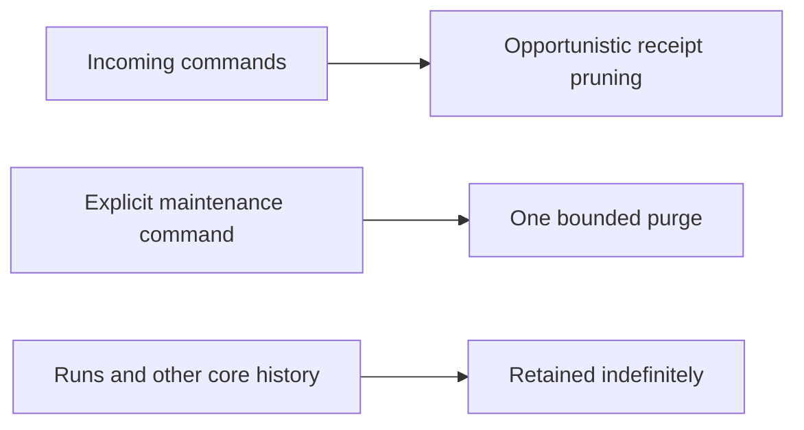
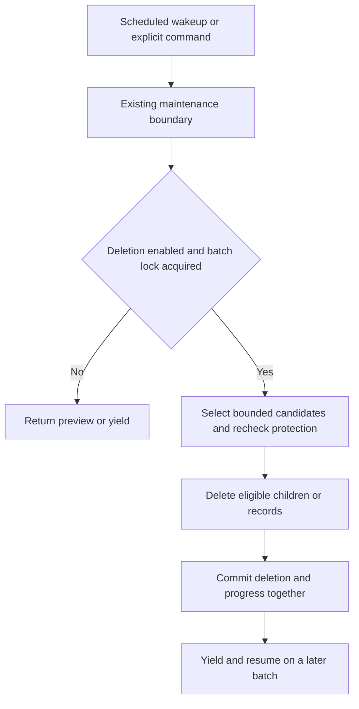
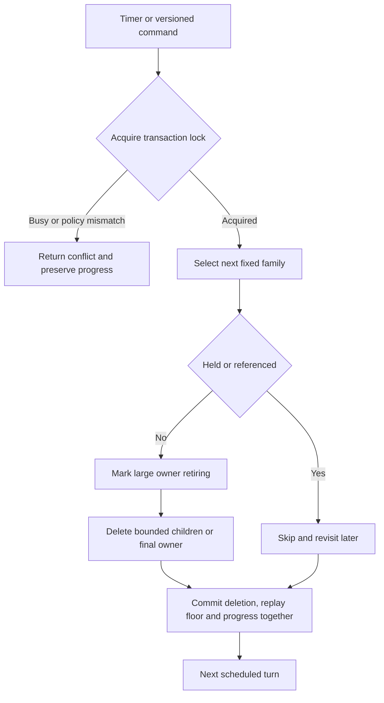

# Change Record: Bounded PostgreSQL history retention

| Field | Value |
| --- | --- |
| Status | Implemented; approved for PR review |
| Type | Feature and migration |
| Primary issue | [#704: Built-in retention policies and scheduled PostgreSQL cleanup](https://github.com/eirhop/favn/issues/704) |
| Pull request | [#714](https://github.com/eirhop/favn/pull/714) |
| Related work | #703 crash-safe runner tasks; #708 bounded runner recovery |
| Affected areas | `favn_orchestrator`, `favn_storage_postgres`, maintenance CLI, event/log reads, operator documentation |
| Approved plan commit | `896eb78d` |
| Last updated | 2026-09-15 |

## One-minute summary

Favn keeps execution history indefinitely and currently cleans only selected
record families through explicit commands or opportunistic pruning. Add one
scheduled worker that uses the existing PostgreSQL maintenance operations to
remove eligible history in small transactions. Age alone never permits deletion:
active work, unresolved effects, command replay, retained dataset evidence, and
projection repair remain protected. Optional history retention defaults to
disabled, with a read-only preview before operators enable it. Mandatory receipt
cleanup runs through the same worker.

This record plans one implementation PR with four sequential slices. It covers
the complete issue, not just scheduling the existing six purge targets. Creating
this record does not start implementation; the reviewed baseline and draft PR
must exist before implementation begins.

## Impact and simplicity boundary

An old failed execution with no remaining dependencies can eventually disappear.
A run that proves the contents of a retained dataset can remain, even if older
than the configured period. Operators see eligible backlog separately from that
protected growth; this feature does not promise a fixed total database size.

The simplest complete design is a fixed set of owner-specific SQL operations,
one coordinator, and existing maintenance job state. Do not build a general
garbage collector, dependency graph engine, workflow framework, policy service,
new queue, partitioning scheme, archive store, or adaptive scheduler.

Keep the safeguards that solve demonstrated problems: transactional reference
checks, bounded child deletion, replay boundaries, and durable progress. Remove
abstractions before weakening those safeguards to meet the budget.

## Problem analysis

### Assumptions

- PostgreSQL control-plane history is the scope. No consumer database deletion.
- No production installations require backward compatibility. The user can reset
  all environments for this change. Target a fresh schema and one matching release;
  do not build legacy-data backfills, compatibility branches, or rolling-upgrade
  support. Environment reset is a deployment prerequisite, not part of this
  documentation task.
- Operators select durations. No universal execution-history period is supplied.
- One platform policy with per-family periods is sufficient initially. Workspace
  policy overrides and per-record policy editing are not required by #704.
- Audit records are intentionally retained. A configured workspace hold excludes
  that workspace from destructive cleanup; there is no new per-record hold UI.
- Dataset provenance is reference-protected rather than compacted. If it dominates
  measured growth, report that limitation instead of silently deleting evidence.
- Existing command replay windows remain mandatory minimums, even when a user
  requests a shorter retention period.

### Evidence

Source inspected at `046f59d5733125e97525b06cf8ef0f8f3231f0a3`.

| Evidence | What it proves | What it does not prove |
| --- | --- | --- |
| [Maintenance store](../../../apps/favn_storage_postgres/lib/favn_storage_postgres/maintenance/store.ex) | Six purge targets, transactional jobs, bounded queries; no preview | Complete history cleanup or safe aggregate retirement |
| [Backend supervisor](../../../apps/favn_storage_postgres/lib/favn_storage_postgres/backend_supervisor.ex) | No general scheduled retention worker | Runtime load or production configuration |
| [Runner-task store](../../../apps/favn_storage_postgres/lib/favn_storage_postgres/runner_tasks/store.ex), [submission store](../../../apps/favn_storage_postgres/lib/favn_storage_postgres/run_submissions/store.ex) | Seven-day receipt windows and indexed opportunistic pruning | Suitability of shortening those windows |
| [Missing-row backfiller](../../../apps/favn_storage_postgres/lib/favn_storage_postgres/projections/missing_row_backfiller.ex) | Projection repair replays outbox publications | Safety of deleting every processed publication |
| [Run/event migrations](../../../apps/favn_storage_postgres/lib/favn_storage_postgres/migrations/create_storage_v2.ex) | Circular run/event references and restrictive foreign keys | A complete deletion ordering across later migrations |
| [Runs store](../../../apps/favn_storage_postgres/lib/favn_storage_postgres/runs/store.ex) | Publication cursors reject values ahead of durable state | Detection of a deleted replay prefix |
| [Package retention](../../../apps/favn_storage_postgres/lib/favn_storage_postgres/migrations/optimize_execution_package_retention_v2.ex) | Current candidate index covers never-linked packages | Cleanup of formerly linked packages after manifest retirement |

Tidewave returned HTTP 404 at the local development endpoint during investigation.
These findings are static evidence, not live database or performance qualification.

## Current behavior

There are also separate log and runner-session purge entry points. Reuse their
owning deletion logic rather than adding a third interpretation of eligibility.

## Approved plan

Independently reviewed on 2026-09-15. Preserve this plan when implementation
begins; record material changes under deviations and obtain re-review.

### Retention matrix

`Expire` always means older than the configured cutoff **and** free of the listed
protections. A family may be configured as `retain_forever`. Protected families
are classified explicitly; they do not need speculative deletion implementations.

For execution history, age starts at durable terminal/settled time, never creation
time. An aggregate's window starts no earlier than its last required descendant
settlement; a long-running execution gets its full history window after finishing.
Use database ingestion time for logs and `published_at` for publications. Receipt
age follows the existing issued-at/insertion-time/clock-skew contract. A cutoff is
exclusive: records exactly at it stay. Missing settlement evidence protects the
record. Do not reuse mutable `updated_at` unless its owning contract proves that
it represents the required settlement boundary.

| Family and tables | Eligibility and protection |
| --- | --- |
| Task receipts: `runner_task_commands`, `runner_task_command_tasks` | Expire after the accepted command window, including clock-skew safety. Delete receipt children within the batch budget. |
| Task results: `runner_task_outcomes`, `runner_task_runtime_input_errors` | Expire obsolete versions only after receipt references and recovery requirements end. Preserve authoritative unresolved effects. |
| `runner_tasks`, `runner_task_log_batches` | Task deletion requires terminal state, settled effects, expired command replay, and no retained run/operation/checkpoint dependency. Runner logs have a separate duration but retain replay/diagnostic dependencies. |
| `log_entries`, `log_batches` | Explicit log window, workspace holds, and delivery/replay safety. Keep batch deduplication until stale delivery is rejected. Both existing log purge entry points use these rules. |
| `runs`, `run_events`, `run_plans`, `run_targets`, `run_execution_checkpoints` | Retire coherent execution history only after terminal descendants and all retained replay, materialization, retry, operation, and projection dependencies permit it. |
| `run_submissions`, `run_submission_commands` | Submitted is not proof that its run has finished. Preserve accepted work, linked retries, and command replay; retire eligible submission history with its execution history. |
| `backfills`, `backfill_plan_batches`, `backfill_windows` | Terminal parent and children, no recovery/retained-history references. Bounded child-first cleanup. |
| `materializations`, `coverage_baselines`, `asset_target_generations`, `asset_target_bindings`, `asset_evidence_bindings` | Intentionally reference-protected in this PR. Dataset evidence and its required source runs/publications remain. No automatic physical generation retirement. |
| `rebuild_operations`, `rebuild_plan_actions`, `rebuild_windows`, `target_recovery_operations` | Retain while outcomes or cleanup are unresolved, or generations/materializations/other retained operations refer to them. Only unreferenced terminal operation history may expire. |
| `runtime_input_pins`, `runtime_input_key_versions` | Pins expire only with their last retained replay/provenance owner. Retain key inventory; use existing explicit key compaction for key removal. |
| `manifest_versions`, `workspace_deployments`, `workspace_deployment_targets`, `manifest_execution_packages`, `execution_packages` | Active deployments, tasks, runs, schedules, generations, operations, and pins protect their exact content. Only unreferenced retired registry history expires; global shared content is platform-scoped. Never infer ownership from absence of one workspace reference. |
| `manifest_deployment_operations`, `workspace_provisioning_operations` | Intentionally retain durable operation identities in this PR; no new expiry for their current permanent reconciliation contracts. |
| `manifest_deployment_upload_leases`, `manifest_activation_leases` | Lifecycle-owned coordination. Release/settle before considering cleanup; preserve live ownership and reusable fencing identities. |
| `outbox_events`, `outbox_publication_state` | Delete only published, sufficiently old, fully consumed events no retained owner or repair requires. Keep publication sequence state permanently. |
| `projection_cursors`, `projection_failures` | Keep cursors. Failures remain while unresolved; only resolved/superseded diagnostics expire. An offline projector still protects its required input. |
| `execution_group_overviews`, `backfill_overviews`, `asset_attempt_overviews`, `target_statuses`, `asset_window_states`, `asset_freshness_states` | Retire obsolete rows with their owner. Preserve current target/freshness/coverage state and the authoritative publications needed to repair it. |
| `runner_sessions` | Closed and older than its session window, with no unresolved task attribution or retained diagnostic dependency. Open sessions stay. |
| `auth_sessions`, `auth_operator_commands`, `idempotency_records` | Expired/closed sessions and resolved commands only. Pending/unknown intents and unexpired replay continue protecting records and referenced results. |
| `auth_audit_entries`, `auth_platform_audit_entries` | Intentionally retained; no audit deletion in this PR. Workspace holds additionally prevent history cleanup in held workspaces. |
| `schedule_activations`, `schedule_activation_commands`, `schedule_cursors`, `schedule_occurrences` | Retain live scheduling/deduplication identities and their required receipts. Terminal unreferenced occurrence history may expire after its scheduling replay horizon. Do not reset a cursor to reclaim space. |
| `execution_leases`, `execution_lease_scopes`, `admission_waiters`, `run_ownerships`, `materialization_claims`, `target_operation_locks` | Lifecycle owners settle expired work first. Remove only settled history no retained owner or stale-command fence requires. Reusable fence identities are retained. |
| `resource_circuits`, `resource_circuit_outcomes`, `resource_recovery_candidates` | Keep current circuit/probe state and unresolved recovery candidates. Terminal outcome history expires only after source/recovery and idempotency dependencies end. |
| `capacity_scopes`, `runner_capacity_demands`, `workspaces`, `workspace_runtime_state` | Intentionally retained current operational state. |
| `auth_actors`, `auth_credentials`, `auth_external_identities`, `auth_workspace_memberships`, `auth_platform_grants` | Intentionally retained identity/configuration; ordinary lifecycle commands remain their owner. |
| `maintenance_jobs` | Keep active progress and scheduler state; expire completed historical jobs after their maintenance window. Do not create a job or audit row for every empty tick. |
| `schema_migrations` | Retain migration authority. |

During implementation, compare this inventory with a freshly migrated database,
including every foreign key and logical reference used by writers/readers. A
schema-coverage test requires every Favn table to have a classification. Document
logical references explicitly beside the owning family, including task contexts,
retry lineage, operation payloads, and replay result identities. Do not introduce
a generic runtime dependency graph to implement this inventory.

### Policy and scheduling

- One typed policy, validated at the orchestrator boundary: `enabled?`, per-family
  periods, excluded workspace IDs (holds), interval, row/scan limits, and time
  budget. Optional history cleanup is disabled by default. Seven-day receipt
  cleanup remains an always-on family of the same worker, subject to workspace
  holds and the shared budgets. Command expiry validation is always enforced,
  including when holds or cleanup failures delay physical receipt deletion.
- Preview is a separate read command, not a second persisted operating mode.
- Reuse one stable `maintenance_jobs` scheduler row for effective configuration,
  policy fingerprint, due time, and family rotation. Do not add a policy table.
  Initialization uses insert-on-conflict and then validates the existing policy.
  A node with a different policy must report the mismatch and perform no cleanup.
- Changing policy uses an explicit platform maintenance command with the expected
  policy version, under the same batch lock. It must not be an automatic
  last-writer-wins boot update. Workers use the persisted effective policy; there
  is no policy editor, live override hierarchy, or separate activation service.
- One small GenServer schedules one supervised task at a time. It does not run a
  sweep or wait on database work in its mailbox. Use jitter and one timer; no
  catch-up queue of missed ticks and no dependency on normal run scheduling.
- Each batch takes a nonblocking PostgreSQL transaction advisory lock for
  retention, then locks its existing maintenance job. This serializes destructive
  scheduled/manual maintenance across replicas and manual entry points. Do not
  add distributed leader election, worker leases, or a second fencing protocol: all deletion and
  progress occur inside this one transaction, and crash rollback releases locks.
- Remove opportunistic receipt deletion from command transactions. Keep command
  window validation there; perform physical receipt and obsolete-outcome cleanup
  through the coordinated worker. All receipt deletion now shares the same holds,
  policy lock, and total-row budget. Delete children explicitly in bounded phases
  only after the receipt can no longer be replayed, then delete the parent. Do not
  hide an unbounded snapshot cascade behind a parent-row limit.
- A sweep pins its cutoff and selection cursor in job state. Rotate families and
  revisit skipped/protected candidates on subsequent sweeps. A short or empty
  `SKIP LOCKED` result means no available work in that batch, not proof that all
  eligible rows are gone. A new sweep also revisits previously protected records.

Initial tuning values for qualification: 250 total deleted rows per transaction,
1,000 candidate rows examined, 100 ms lock timeout, 1 s statement timeout, and a
5 s maximum worker turn every 60 s. They are starting values, not throughput
promises. SQL predicates/indexes and transaction deadlines must bound expensive
reference checks too; limiting returned rows alone is insufficient.

### Deletion and reference safety

Use explicit family queries through `MaintenanceStore`. Preview and deletion
share the predicate construction, but deletion always rechecks current state
inside its own transaction. Preview takes no deletion locks and writes no jobs.

The maintenance lock only coordinates cleaners. Writers that can introduce a
reference must use the same owner/lifecycle guard as retirement. Prefer existing
composite foreign keys and run identity/cancellation authority locks. Acquire
those authority locks before target/task row locks, consistently with writers.
For a reference without an FK, make the owning writer check retirement under
that guard. A `NOT EXISTS` check alone is not concurrency protection.

For execution history, use the execution group as the retirement owner: its
overview accumulates child events. Preserve all source history required to repair
a retained group; do not retire child runs independently and silently change its
reconstructed overview. Prefer one group retirement marker and indexed child
traversal over per-child retirement machinery.

For small independent records, delete atomically. For a run, backfill, or operation
with many children, use a minimal owner retirement marker and a versioned phase
cursor in `maintenance_jobs`:

1. Under owner guards, establish that its history window and all obligations have
   ended. Mark the owner retiring. A retained descendant/provenance reference
   blocks retirement; do not discover eligibility through an unbounded tree scan.
2. All historical readers/replay writers recognize retiring owners. Return an
   explicit expired-history result rather than partial history, and reject new
   references. A newly applied workspace hold pauses subsequent destructive
   batches; it cannot restore already removed history.
3. Remove child rows in bounded phases, committing the phase/cursor with deletion.
   Include cascaded children in the work budget or explicitly delete them first.
4. Remove the small remaining owner envelope and required event pointers in the
   final transaction. Do not add a permanent per-deleted-record tombstone ledger;
   after owner removal normal missing-resource reads return not-found.

Define the necessary internal run/event references as deferrable `NO ACTION`
in the fresh schema instead of `ON DELETE RESTRICT`. Preserve foreign-key
integrity at commit; do not disable constraints or add blanket cascades. Keep
submitted/latest events until the final envelope deletion. External references
continue to block retirement. Cover the equivalent operation/generation cycles
before enabling any affected family.

Registry cleanup must distinguish never-linked from formerly linked packages.
Keep a scalar unreferenced-since timestamp only if needed to express the selected
publication grace rule; maintain it under the package/link transaction lock.
Deletion checks all current references and never rewrites immutable content.

### Replay and projection contract

- Share receipt expiry logic with existing callers, preserving issued-at,
  insertion-time, and accepted-clock-skew safety. Old commands remain rejected
  after receipts disappear. Never reset assignment/claim generations.
- Log retention must not allow delayed batch delivery to resurrect deleted logs.
  Define and validate the accepted batch replay horizon before removing its
  deduplication row. Protect recent ingestion even when event timestamps are old.
- Persist a small replay floor per workspace/stream, updated atomically with
  source deletion. Use commit-safe publication IDs and `published_at`; never use
  sequence allocation time or `MIN(remaining_id)` as evidence of complete replay.
  Preserve the publication counter. A sparse deletion can advance the floor only
  outside the guaranteed replay window, even if protected older rows remain.
- Use one new log cursor contract in both directions: publication ID plus batch
  position, ordered by those values. Keep `occurred_at` for display/filtering;
  historical pages no longer sort by event time. Update callers, indexes, and
  public cursor types together, removing the old `{occurred_at, log_id}` shape
  without a compatibility decoder. Define the floor in the same cursor domain,
  including the first retained position when deletion splits a batch.
- Check floors on every event/log replay page, including connected streams. Use
  explicit cursor expiry (HTTP 410 before streaming; reset/close after streaming
  begins). The floor/owner check and page fetch must share one database snapshot:
  use one statement or a short read-only REPEATABLE READ transaction for global
  events, logs, and per-run pages. A default READ COMMITTED transaction with two
  statements is insufficient: deletion could commit between the check and fetch.
  Once an entire run is removed, reads return not-found, not a false successful
  empty replay. A page read before retirement may complete from its old snapshot;
  the next page must observe the new floor or retirement state.
- Keep publications required to rebuild retained projections. Projector progress
  alone is insufficient. No snapshot/checkpoint replacement for authoritative
  history, no new shadow projector, and no provenance compaction in this PR.
- Repair operations participate in source-retirement coordination. Existing
  missing-row repair skips intentionally expired owners explicitly, while fully
  rebuilding retained owners. Normal projectors must have consumed an owner's
  publications before retirement; unsequenced publications block retirement.
- A retained publication must not lose a source row required by repair. Delete
  eligible source rows and their publications together in each bounded phase,
  or retain both until that is possible. Test repair after partial retirement
  and after completion, not only the happy-path projector cursor.

### Implementation slices and complexity budget

| Slice | Outcome | Owner | Depends on |
| --- | --- | --- | --- |
| 1 | Table/reference inventory, typed policy, shared preview/eligibility contracts | Orchestrator and PostgreSQL | None |
| 2 | Scheduled bounded transactions, existing job progress, metrics; unify existing purge paths | Orchestrator and PostgreSQL | 1 |
| 3 | Eligible task/execution/operation/registry retirement and writer guards | PostgreSQL lifecycle stores | 1-2 |
| 4 | Replay floors, protected projection repair, docs, sustained-load qualification | Persistence reads and API; operator docs | 1-3 |

| Slice | Production added | Production deleted | Supporting added | Supporting deleted | Main reason for size |
| --- | ---: | ---: | ---: | ---: | --- |
| 1 | 150-300 | 20-60 | 200-350 | 20-50 | Typed contracts and explicit inventory |
| 2 | 300-500 | 100-220 | 350-600 | 40-100 | Existing maintenance reuse and worker failure tests |
| 3 | 800-1,300 | 80-180 | 900-1,500 | 40-100 | Fixed family queries, migrations, bounded retirement, writer races |
| 4 | 300-550 | 30-80 | 600-1,000 | 30-70 | Replay/repair proof and load harness |
| Total | 1,550-2,650 | 230-540 | 2,050-3,450 | 130-320 | Full #704 scope with conservative retained families |

Supporting lines include tests, fixtures, benchmark code, examples, and canonical
documentation. Exclude this record, generated files, locks, vendored content, and
formatter-only edits. These are estimates, not permission to fill the budget.
Explain overruns above a category's upper bound by more than 25 percent or 100
lines, whichever is smaller, and materially fewer deletions. Keep this baseline
unchanged; report actuals and justified deviations separately.

**Review gates against overengineering:** no new dependency; no generic handler
registry; no new durable queue; no policy/lease/leader tables; one destructive
transaction at a time; no View feature. Add only the replay-floor persistence and
owner retirement fields actually required by deletion contracts. If slice 3
needs a broad lifecycle rewrite, stop and re-review the scope/budget rather than
building a framework or silently reducing coverage.

### Implementation map

| Concept | Expected area | Responsibility |
| --- | --- | --- |
| Policy and coordinator | `favn_orchestrator` runtime config/application and a focused retention module | Validate config, supervise timer/batch, call persistence |
| Commands and results | `FavnOrchestrator.Persistence.MaintenanceStore` and command/result modules | Bounded preview, execution, policy update, status |
| SQL and progress | `favn_storage_postgres/maintenance` and owning stores | Shared eligibility, transaction lock, job progress, family deletion |
| Writer and reader guards | Existing run/task/submission/operation/registry stores and read facades | Prevent new references and partial/false historical reads |
| Migration | Storage migrations, schema authority, privileges and readiness tests | Required indexes, replay floors, retirement fields, targeted FK changes |
| Operator entry point | Existing `favn.postgres.maintenance` task | Preview, configure, execute/resume, status; no separate CLI family |
| Canonical docs | PostgreSQL data model/architecture, operator runbook, public replay guide, features | Exact retention/replay contract and operational instructions |

## Operational design

### Failures and recovery

Lock contention yields to the next tick. Statement/transaction timeout rolls back
deletion and progress together. A database error stops the current turn and is
retried with bounded delay; it must not restart an unbounded loop or bring down
normal execution. Enforce an overall transaction deadline in addition to each
statement timeout. A cancelled client is not proof its transaction rolled back.

After a lost acknowledgement, read the persisted job version/phase before
resuming; use an expected-version batch command so a repeated call cannot apply
the next batch accidentally. Retention only changes PostgreSQL state and never
retries an external materialization. Existing unknown effects remain protected.
Disabling optional history retention prevents new batches for those families;
mandatory receipt cleanup continues unless protected by a workspace hold. An
already committed retirement marker remains visible and resumes when its family
is enabled again; disabling cannot undo it.

Policy updates and holds serialize with batches. No new retirement may use an
obsolete policy; already retired history cannot be promised a longer retention
window retroactively. Completed job history itself has a retention policy.

### Preview and diagnostics

Preview returns effective policy/cutoff, bounded eligible counts, protected counts
by stable reason, oldest eligible age, and a continuation cursor. Mark incomplete
counts as lower bounds and byte estimates as estimates. Do not run an unbounded
COUNT over history at every tick, or expose arbitrary payloads as samples.

| State | Surface | Safe fields | Frequency |
| --- | --- | --- | --- |
| Batch completed | Telemetry and job status | Family, scope, rows scanned/deleted, duration, cursor/version | Once per batch |
| No work or lock unavailable | Telemetry only | Family, reason, duration | No persisted row per empty tick |
| Failure or policy mismatch | Bounded warning and job diagnostic | Error class, family, policy fingerprint, job ID | First and rate-limited repeats |
| Backlog/protected growth | Bounded preview/status | Eligibility/protection reason, count completeness, oldest age | Scheduled low-frequency measurement |

Record both last successful check and last deletion progress. A quiet empty
database is healthy; an increasing eligible backlog without progress is not.
Keep metric labels bounded; avoid run/task IDs and raw exception payloads.

### Fresh-schema deployment

Use the existing explicit bootstrap path to create the target schema, never
runtime startup. Update schema definitions and authority checks together. Add
indexes aligned with actual candidate and reverse-reference queries. Validate
fresh bootstrap, constraints, privileges, and schema readiness; an in-place
upgrade of existing history and its migration lock duration are out of scope.

Stop the old deployment, reset its control-plane database, bootstrap the target
schema, and deploy matching control-plane and runner builds. Republish required
manifests and recreate configuration through the normal setup flow. Do not carry
old receipts, replay cursors, or maintenance jobs into the new environment. No
dual-format readers, legacy defaults, or mixed-version deployment support are
required. Resetting the control plane does not reset external datasets; operators
must stop active execution and explicitly reconcile those datasets before
resuming work.

Roll out with preview, then enable explicitly selected optional family periods
under small budgets. Mandatory receipt cleanup and command expiry remain active
when optional history retention is disabled.
Pausing cleanup takes effect after the current transaction. Release rollback may
also require an environment reset; preserving old-release compatibility is not a
requirement. Pausing cleanup cannot recreate deleted history. After bootstrap,
normal command replay, concurrent-writer safety, and projection repair guarantees
still apply to all new history.

Document autovacuum, dead tuples, index/TOAST growth, and storage reuse. Normal
deletion need not shrink allocated files; ordinary retention must not invoke
`VACUUM FULL`.

## Verification plan

| Issue acceptance criterion | Planned evidence | Owning layer |
| --- | --- | --- |
| Every family classified, including logical references | Fresh-schema inventory coverage plus owner-reference review and fixtures for each deletable family | PostgreSQL |
| Active/unknown/replay/held/provenance history protected | Boundary tests and durable fixtures for active descendants, held workspace, unknown effects, receipts, pins, materializations and generations | Lifecycle stores |
| Safe against concurrent new references | Independent PostgreSQL transactions with barriers for reference creation, retry, deployment linking, hold/policy update and cleanup | PostgreSQL concurrency |
| Replay and historical guarantees | Cutoff/clock-skew tests, old-created/recently-finished executions, expired commands after receipt removal, delayed log delivery, cursor expiry during pagination/SSE, retained projection rebuild after deletion | Stores, orchestrator reads, API |
| Interrupted/resumed bounded work and multiple instances | Crash/timeout/lost-ack tests; two workers; skipped rows revisited; huge single owner with bounded children; policy mismatch | Worker and PostgreSQL |
| Sustained cleanup keeps up | Repeatable seeded workload and benchmark below, including query plans and protected growth | PostgreSQL performance/slow tier |
| Operational defaults and rollout clear | CLI preview/status tests, configuration validation, runbook review, link checks | CLI/docs |

Use the existing PostgreSQL test fixtures and deterministic transaction barriers,
not sleeps. Test commands arriving during a workspace hold change, always-on
receipt cleanup with optional history disabled, and a receipt with more children
than one batch permits. Test reverse log pagination with delayed old-timestamp
logs and deletion between pages, including a partially deleted batch. Check FK child indexes and anti-join query plans with many old
protected rows. Verify cyclic final deletion and cascaded row counts explicitly.
Hold a reader between cursor validation and page retrieval while a cleaner
commits; each event/log path must return a complete pre-delete snapshot or an
explicit expired result, never a successful page with silently missing history.

The load harness compares identical execution/read workloads with optional history
cleanup disabled and enabled; mandatory receipt cleanup runs in both. It includes
at least two retention-window turnovers using accelerated
test policy, and starts with an eligible backlog. Include large payloads, a very
large execution group, active long-running work, held/provenance history, and
projector lag. Require cleanup throughput greater than eligibility arrival rate,
backlog recovery after a worker interruption, and stable eligible live-row growth.
Report permanently retained growth separately. Record p95/p99 execution admission,
write and history-read latency, database CPU/I/O, WAL, dead tuples and allocated
table/index/TOAST bytes. Agree numerical latency limits from the baseline before
claiming qualification; raising cleanup throughput alone is not success.

Run narrow owning-app checks first using `mise exec -- mix` and umbrella
`mix do --app ... cmd mix test`. Before final code review run the relevant format,
warnings-as-errors compile, fast, acceptance/slow and tag-tier checks from
`AGENTS.md`. This documentation-only planning step needs link/render review and
`git diff --check`, not application tests or a live database mutation.

## Risks and decisions

| Risk | Decision |
| --- | --- |
| Retained datasets protect most successful runs | Report measured benefit and protected growth; provenance compaction is a separate proposal |
| Large graphs defeat bounded eligibility checks | Use indexed scalar ownership/reference queries and persisted bounded inspection where necessary; re-review if a broad graph redesign is required |
| Manual cleanup bypasses worker safeguards | All physical receipt and history deletion shares family rules, holds, budgets, and retention coordination; commands only validate receipt windows |
| Drift between replica configuration | Existing scheduler job stores effective policy; mismatches fail closed |
| Extending a period after deletion | No retroactive guarantee; apply to new retirements only |
| Retaining audit/permanent operation identities grows storage | Explicitly intentional, visible in protected-growth reporting |
| Broad issue tempts a generic framework | Fixed queries and sequential slices; enforce budget and deletion targets in independent review |

## Plan review

| Field | Result |
| --- | --- |
| Initial reviewer | Independent agent `/root/review_retention_record` |
| Initial findings | P1: cursor validation and page retrieval must share one snapshot. P2: history age must start at durable settlement, not creation. Both corrected and rechecked on 2026-09-15. |
| Requested reviewer | Astra (`gpt-6-astra`), xhigh; independent agent `/root/astra_review_retention` |
| Reviewed against | Issue #704, owning stores/migrations at the evidence revision, complete revised record, simplicity constraint, and user-approved fresh-schema/reset scope |
| Astra findings | P1: opportunistic receipt deletion bypassed hold coordination and total-row budgets. P2: historical event-time log cursors could not be checked against publication replay floors. |
| Corrections | Removed opportunistic receipt deletion in favor of one coordinated always-on receipt family. Specified publication-position cursors in both log directions, including partial-batch floors. Added execution-group retirement ownership and focused regression scenarios. Removed old-data upgrade and mixed-version compatibility requirements. |
| Recheck | Astra independently rechecked all revised design sections on 2026-09-15. |
| Verdict | Approved; no remaining actionable design findings. Fixed family operations, one worker, existing maintenance state, and one transaction lock are appropriately constrained. |
| Evidence boundary | Plan review only; no implementation, database/concurrency tests, benchmark, or live deployment proof. |

## Implementation outcome

Implementation is complete in the isolated issue worktree; final qualification and independent review are recorded below.
The approved baseline remains commit `896eb78d`.

The implementation uses one PostgreSQL worker, the existing maintenance-job row,
a fixed family rotation, five owner retirement fields, and one replay-floor table.
The old purge/prune APIs are removed. Run groups own their backfill cleanup;
rebuilds own their operation tasks; registry owners reject new references while
their children are removed. Readers use a consistent snapshot and report expired
history during retirement. The canonical contract and operator commands are in
[PostgreSQL retention](../../storage/postgresql/retention.md).

There is no new dependency, queue, generic collector, policy table, or View feature.
The package age index covers formerly linked packages as well as never-linked
ones; retained manifest links and runtime-input pins still prevent deletion.

The final ownership path uses the same coordinator for automatic and explicit work:

Run groups include their backfills; rebuilds, standalone tasks, manifests and
deployments each have their own bounded child phases. Simple row families skip
the owner marker. Any failure rolls the whole transaction back.

## Deviations from the approved plan

The reviewed baseline is commit `896eb78d`.

| Planned | Actual decision | Reason | Review |
| --- | --- | --- | --- |
| Publish a planning draft before implementation | Keep implementation local until final Astra xhigh review, then create the PR | Explicit user instruction on 2026-09-15 overrides the repository default sequence | Final review pending |
| Independent backfill retirement | Retire backfills with their execution group under the existing group marker and execution-history period | Independent backfill deletion could otherwise expose incomplete window history through a retained group; one owner removes a second lifecycle and marker | Final review pending |
| Reuse existing purge entry points | Remove separate purge and session-pruning commands; one versioned retention command owns deletion | User-approved breaking change avoids duplicate retry and policy semantics | Final review pending |
| Settled claim cleanup | Retain reusable materialization-claim fencing identities | Keys are reused across runs; deleting their counters can make stale writers appear current | Final review pending |
| Registry reference guards in lifecycle stores | Fixed PostgreSQL triggers check exact manifest/deployment reference columns under row locks | Covers logical references and foreign keys consistently without a runtime graph or per-writer copies | Final review pending |
| Broad deferred foreign-key adjustment | Change only the three circular run/event constraints to deferred `NO ACTION` | Other references retain their existing restrictive behavior | Final review pending |
| Preview continuation and full protection breakdown | One bounded preview with completeness flags; owner counts include aggregate reference/unsettled protection, while row families report eligible counts | Avoid a second durable scan lifecycle or CLI cursor protocol; incomplete previews are explicitly not whole-database totals | Final review pending |
| Persist failed-job diagnostics | Rate-limited warnings and telemetry with bounded error categories; durable last-check/deletion progress only on committed batches | A failed transaction cannot commit diagnostics; avoid a separate failure-write transaction that could obscure its rollback | Final review pending |
| Physical scan budgets | Bound returned candidates, deleted rows, lock waits, SQL statements and total transaction duration | PostgreSQL reference checks can inspect more pages than returned candidates; no claim of a physical-page bound | Final review pending |
| Standalone terminal tasks | One task retirement field and four fixed child phases, alternating with group cleanup | Tasks without a run or rebuild owner otherwise never become removable; the marker prevents partial task reads while removing large log histories | Final review pending |
| Target-recovery cleanup | Retain recovery operations and their task history as dataset evidence | The schema requires materialization and generation links; conservative evidence retention avoids losing recovery proof | Final review pending |
| Retry/supersession chains | Conservatively retain execution groups containing linked submission history | Avoid rewriting retained retry identities or introducing a second lineage cleanup lifecycle | Final review pending |
| Main advanced during implementation | Rebase onto `b98fed79`, preserving #712 lifecycle log messages and #713 compact task package references | Requested by the user; the combined feed checks event and diagnostic floors in one snapshot, and the retention migration follows the package reset migration | Final review pending |
| Full production workload benchmark | A repeatable concurrent log-write, enqueue and read fixture plus separate owner/concurrency tests | This is local pre-v1 qualification. It does not measure full run admission, database CPU/physical I/O, or production-scale growth; these remain unverified | Final review pending |
| Unadmitted submission cleanup | One bounded atomic header cleanup under execution history; no retirement marker | Safe/permanent preparation failures and queued cancellations otherwise have no run-group owner and never expire. Existing cancellation/run authority and submission locks protect replay and concurrent retries | Final recheck pending |

The entries below document
pre-baseline review history, not a rewrite of the committed baseline.

Before establishing that commit, the user removed the backward-compatibility
requirement on 2026-09-15: no production installations exist and environments can
be reset. The earlier reviewed proposal required an in-place upgrade and its
qualification. The revised proposal uses a fresh schema and matching deployment,
removing legacy-data and mixed-version support. Astra at xhigh requested two
corrections: coordinate all receipt deletion, and replace event-time log cursors
with publication-position cursors. Both are incorporated and independently
rechecked. Astra approved the revised plan on 2026-09-15; this supersedes the
earlier approval for the changed sections.

## Decision log

The initial plan simplifies the investigation proposal: one policy and existing
job state replace a separate policy registry; a transaction lock replaces worker
leases; conservative evidence retention avoids a projection/provenance redesign.
The user-approved environment reset removes backward-compatibility work. Astra
review further simplified receipt deletion into one coordinated path and log
pagination into one cursor shape. These are the pre-implementation plan decisions. Later changes are recorded in
the deviation table above.

## Actual complexity

Git additions/deletions are measured against rebased `origin/main` (`b98fed79`).
Each file is assigned once to its primary slice; the change record is excluded.
Policy/contracts and inventory belong to slice 1; coordinator/worker/CLI and
coordinator tests to slice 2; retirement SQL, migrations, lifecycle guards and
owning tests to slice 3; publication reads, repair, API, load test and runbook to
slice 4. Mixed files are counted entirely in their primary slice.

| Slice | Production added | Production deleted | Supporting added | Supporting deleted |
| --- | ---: | ---: | ---: | ---: |
| 1 | 181 | 26 | 224 | 0 |
| 2 | 448 | 347 | 494 | 11 |
| 3 | 2,008 | 145 | 1,082 | 69 |
| 4 | 504 | 226 | 389 | 45 |
| Total | 3,141 | 744 | 2,189 | 125 |

Slice 3 exceeds the production estimate by 708 lines. The additional code is
explicit retirement phases, references and reader/writer guards across existing
owners, including standalone tasks and atomic unadmitted-submission cleanup identified
during final review; it adds no general graph, queue or policy
framework. The reviewer must assess whether those guards can be simplified while
preserving bounded deletion and concurrent reference safety. Slices 2 and 4 remove
more production code than estimated because the old purge/prune implementations
and historical cursor branch are removed completely.

Supporting deletions are below the estimate because the inventory and policy are
new, existing lifecycle tests stay, and obsolete purge assertions are replaced in
place. Slice 4 supporting additions are below the estimate because the benchmark uses a
narrow fixture workload; the unmeasured production workload is explicitly listed
as a limitation, rather than covered by additional tests that merely repeat SQL.

## Verification evidence

Local checks ran on 2026-09-15 against disposable PostgreSQL 18 databases, after
rebasing onto `b98fed79`. No user environment was reset. App-scoped commands use
`MIX_ENV=test mise exec -- mix do --app <app> cmd mix test ...` with the documented
database URLs and fixed test pin key.

| Check | Result | Evidence boundary |
| --- | --- | --- |
| PostgreSQL fast suite and review regressions | 461 cases exercised; all five initial failures corrected and passed in a 286-case affected-layer follow-up (284 plus two focused reruns) | Three older fixtures now create registry parents; the durable task fixture respects its persisted enqueue timestamp; the connected SSE fixture starts PubSub and waits for the actual ready event. |
| Retention, runner tasks, concurrency, package migration and package query-plan checks | 97 passed before final review, including the relevant slow cases | Package age index, worker restart, receipts/holds, real runner recovery and compact package references; post-review owning tests cover the added reference guards and submission cleanup |
| Orchestrator fast suite | 867 passed: 861 tests and six doctests | Current orchestration and public contract regressions |
| Log View support/model/component tests | 15 passed | Existing mixed lifecycle/diagnostic rendering and replay integration; no browser changes |
| Clean-schema retention load fixture | Passed; numbers below | Concurrent local fixture, not production scale |
| Fresh schema and drift diagnostics | Exact 79-table inventory; no missing/unexpected columns; fingerprint `c1bd5d700242f66fb221e058d61719949ea29f92d7be2fe2feba40e09e57dafe` | Disabled registry trigger is detected; reset-only package migration and restart passed |
| CLI status, preview, configure and run | Passed; stale expected version rejected | Actual Mix task against disposable PostgreSQL |
| Formatting, compile, whitespace and tag guard | Passed | `mix format --check-formatted`, `mix compile --warnings-as-errors`, `git diff --check`, `elixir scripts/check_test_tag_tiers.exs` via mise |
| Documentation | All changed relative links resolve; balanced fences and simple flowcharts checked | GitHub rendering must be checked after PR publication, per the user's review-before-PR sequence |
| Independent plan review | Astra xhigh approved after two corrections and recheck | Design review; final implementation review below |

The 97-test selection includes `retention_test.exs`, `runner_tasks_test.exs`,
`concurrency_authority_test.exs`, `task_package_migration_test.exs`, and the
execution-package case in `performance_contract_test.exs`. The focused View
selection is `logs_live_support_test.exs`, `logs_view_model_test.exs`, and
`components/log_viewer_test.exs`. The post-review owning selection is `core_authority_test.exs`,
`run_submissions_test.exs`, `manifest_deployments_test.exs`,
`operator_reads/coverage_test.exs`, `retention_test.exs` and `runner_tasks_test.exs`.
Earlier five-second admission timing failures passed unchanged in a focused
`write_resolution_test.exs` rerun.

### Load fixture results

Run `retention_load_test.exs --only slow` on a fresh disposable schema. Set
`FAVN_RETENTION_BENCHMARK_OUTPUT` to save the raw JSON. Each mode starts with 500
eligible log rows and adds 1,000 more in 40 rounds. Cleanup overlaps writes,
enqueueing and reads, pauses for six rounds, and resumes for a bounded recovery
tail. Fixture timestamps accelerate the seven-day window without changing the
production clock or weakening command expiry. Both modes retain mandatory receipt
cleanup and preserve 40 queued tasks.

| Measurement | Optional cleanup disabled | Logs cleanup enabled |
| --- | ---: | ---: |
| Remaining log rows | 1,500 | 0 |
| Deleted rows, including batch/outbox pairs | 0 | 1,620 |
| Protected queued tasks | 40 | 40 |
| Elapsed seconds including recovery tail | 4.36 | 3.22 |
| Log write p95 / p99, milliseconds | 10.55 / 11.92 | 11.62 / 12.37 |
| Task enqueue p95 / p99, milliseconds | 26.39 / 45.26 | 17.46 / 27.67 |
| History read p95 / p99, milliseconds | 6.63 / 10.40 | 6.89 / 9.82 |
| WAL bytes during fixture | 82,573,952 | 8,304,376 |
| Allocated control-plane bytes, before → after | 4,825,088 → 59,359,232 | 60,874,752 → 66,199,552 |
| Estimated dead tuples, before → after | 0 → 37,071 | 43,267 → 49,018 |

All enabled p99 observations are below the fixture's predeclared 250 ms regression
ceiling. The workload recovers its eligible backlog while preserving queued work.
The two modes run sequentially on one fresh database with the other workspace
held, so cache, vacuum and fixture-aging updates affect comparisons. WAL and space
numbers include those artificial updates and are database-wide; they do not prove
cleanup reduces production WAL or latency. The dead-tuple values are PostgreSQL
statistics estimates, not immediate exact counts. Normal deletion need not shrink
allocated files.

### Not verified

No live-environment reset, deployment, production-load qualification, database CPU
or physical-I/O measurement has been performed. The accelerated workload does not
measure full run admission, external writes or a production latency SLO. Large
execution groups, holds, replay and reference races are covered by separate focused
tests, not by the load fixture. Unrelated umbrella acceptance/browser tiers were
not run; the affected storage slow, owning lifecycle and View checks were run.
GitHub rendering remains pending until publication.

## Final review

Astra (`gpt-6-astra`) xhigh reviewed `d23151ac` against baseline `896eb78d` and
requested changes. It accepted the fixed-family design and found the complexity
overrun substantially justified by required guards, with no generic framework or
unnecessary dependency to remove. The reduced benchmark remains a limitation of
acceptance evidence, not a production execution-load qualification.

| Finding | Correction | Recheck |
| --- | --- | --- |
| P1: evidence-only manifest could lose package links | Add the initial evidence-manifest reference predicate, indexed writer guard, and schema-wide FK guard coverage; prove all package links remain | Passed |
| P1: logical references could point to deleted registry owners | Reject missing owners; use real registry fixtures; test missing manifests and deployments | Passed |
| P1: late child-task commands could create receipts after parent retirement | Nonblocking parent locks in the shared task-command lock path; prove late cancellation creates no receipt for retiring runs/rebuilds | Passed |
| P2: unadmitted terminal submissions never expired | Atomic fixed cleanup with unknown/retry/result/receipt protections; check every ID in multi-submission receipts | Passed |
| P2: connected SSE stalled after run deletion | Treat not-found as terminal during delivery; exercise an open stream across complete deletion | Passed |

Standalone task and submission reference checks also use a new statement after
acquiring the row lock, so a reference committed just before lock acquisition is
visible. Initial SSE error behavior stays unchanged. All review reproductions
rolled back; corrections are qualified on another disposable database.

The recheck found one further liveness edge: a cancelled uncreated child of a
retiring run reached the submission guard and rolled back family rotation. The
initial candidate query now excludes existing run/owner rows; the fresh post-lock
reference check remains. A regression proves the child survives and rotation
advances from submissions back to groups.

Final submission owning suite exercised 50 cases: 49 passed initially, including
the new rotation regression; the existing worker-recovery test hit its 100 ms
message timeout and passed unchanged in isolation (1 passed, 49 excluded).
Evidence: `/tmp/favn-704-final-submissions.log` and
`/tmp/favn-704-final-submission-retry.log`.

### Final verdict at `5933fb7a`

Astra (`gpt-6-astra`, xhigh) approved PR creation with no remaining actionable
findings. All five original corrections and the submission-rotation correction
passed recheck, including the independent rollback reproduction. The reviewer
confirmed the approved baseline is unchanged and accepted the documented
complexity overrun: no simpler structural change preserves the reference guards
and bounded cleanup. The reduced benchmark does not block PR review, but the
original representative execution-load/CPU/I/O acceptance criterion remains
incomplete and must not be claimed complete. Final formatting and
warnings-as-errors compilation passed.
