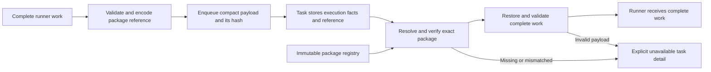

# Change Record: Store SQL task packages by reference

| Field | Value |
| --- | --- |
| Status | Implemented |
| Type | Breaking storage refactor |
| Primary issue | [#705: Normalize persisted execution packages and results](https://github.com/eirhop/favn/issues/705) |
| Pull request | Not opened; user requested implementation review before PR creation |
| Related work | Subsequent outcome and run-result phases of #705 |
| Affected areas | `favn_core` persistence codecs; orchestrator persistence contract; `favn_storage_postgres` task storage, registry lookup, and schema bootstrap |
| Approved plan commit | `93296df7` |
| Last updated | 2026-09-15 |

## One-minute summary

SQL asset-attempt tasks previously stored an execution package that already
exists in the immutable package registry. This PR replaces that stored copy with
a verified reference using one current persistence format and one payload hash.
Adoption requires an explicit environment reset; no old-data conversion or
backward-compatible reader is included. It reuses the existing package
lookup and task decoding boundaries. The first delivery is limited to package
storage; outcome consolidation and run-result compaction require separate records
and measured justification before implementation.

## Impact

Executing the same SQL asset across many windows currently repeats its package
in every task payload. After this change, each task will store execution-specific
facts and a small package reference. The package body remains in the registry.
The expected benefit is lower task storage and write volume. The runner still
receives complete work. This PR makes no performance promise about enqueue CPU
or runner assignment size.

The approved plan below is preserved from `93296df7`. The implementation outcome
and verification evidence distinguish completed qualification from live adoption.

## Problem analysis

### Assumptions

- There are no production users, and environment resets are acceptable for
  adoption. Old tasks, runs, and receipts need not survive this breaking upgrade.
  This is the agreed deployment contract, not authorization to reset environments
  during planning or review.
- Once the new format is adopted, retained tasks, runs, and receipts must survive
  ordinary restarts and subsequent deployment changes without another reset.
- This change must preserve execution, retry, cancellation, and unknown-outcome
  behavior. It must not broaden which work recovery may safely replay.
- Package identities and published bytes remain immutable.
- Work is based on the source investigation at commit `046f59d5`; implementation
  must recheck any intervening changes.

### Evidence

Paths below are relative to the repository root via this record's directory.

| Evidence | What it proves | What it does not prove |
| --- | --- | --- |
| [AssetRunnerTasks](../../../apps/favn_orchestrator/lib/favn_orchestrator/asset_runner_tasks.ex) and [StageAdmission](../../../apps/favn_orchestrator/lib/favn_orchestrator/run_server/execution/stage_admission.ex) | The package is attached before the complete work is encoded for enqueue. | The physical storage saving at realistic cardinality. |
| [PersistenceCodec](../../../apps/favn_core/lib/favn/contracts/runner_task/persistence_codec.ex) and [PersistenceData](../../../apps/favn_core/lib/favn/contracts/runner_task/persistence_data.ex) | Task data uses bounded typed encoding; the package hash can already be extracted. | Correctness of the proposed reference encoding. |
| [RunnerTasks.Store](../../../apps/favn_storage_postgres/lib/favn_storage_postgres/runner_tasks/store.ex) | Reads already load a retained package; command request hashes and receipt identity include payload identity. | Replay correctness after changing the current encoding. |
| [Registry.Store](../../../apps/favn_storage_postgres/lib/favn_storage_postgres/registry/store.ex) and [Maintenance.Store](../../../apps/favn_storage_postgres/lib/favn_storage_postgres/maintenance/store.ex) | Verified retained-package lookup and linked-package retention already exist. | Concurrent-retention qualification of the new reference path. |

## Current behavior

The orchestrator attaches a package and submits complete work. PostgreSQL stores
the encoded work, including the package. Task restoration also fetches the
registry package to validate the persisted data.

## Proposed plan

This section becomes the approved baseline only after independent review and a
planning commit, following the [change-record process](../README.md).

### Smallest implementation

Change the existing payload encoder to persist the SQL execution-package field
as a typed immutable reference. `AssetRunnerTasks` continues calling that encoder
with complete `RunnerWork`; its enqueue command now contains the compact envelope
and the hash of that envelope. Verify the attached package's actual content and
hash before discarding its body, so a forged hash cannot conceal different SQL.
Resolve the reference through the existing registry lookup before decoding and
validating complete executable work.

The reference and existing task/work fields together identify the exact manifest
version, manifest content hash, asset, and package content hash. A globally valid
package hash alone does not authorize execution for a task.

Use the existing `payload_hash` for the canonical compact envelope. The package
reference uses the package's existing content hash. There is no second payload
checksum, old command hash, conversion ledger, or legacy-envelope reconstruction.

Make the format boundary explicit:

- The outer payload envelope uses `encoding: "runner-task-payload-v2"` and an
  explicit `execution_package_hash` field. Use one `PersistenceCodec` payload
  version accessor returning `2` for task-row insertion and duplicate comparison;
  the migration pins the same literal and a contract test checks alignment.
- The wire `protocol_version` stays `13`. `PersistenceData` stays `task-data-v1`;
  result, orchestration-context, and receipt formats stay unchanged.
- Validate complete work and its attached package first. Encode the existing
  `RunnerWork` struct with `execution_package: nil` through unchanged
  `PersistenceData`, placing the verified hash in the outer payload envelope.
  Non-SQL payloads use a nil reference and retain their work semantics.
- Read the hash from that fixed bounded outer field, verify the envelope hash,
  and resolve the package through the existing lookup. Decode stripped work with
  the trusted manifest/package atom dictionary, require its package field to be
  nil, attach the verified package, and apply complete-work schema, identity,
  and expanded-size checks.
- Reject old payload envelopes and full packages embedded inside the new
  envelope. Remove the replaced payload reader. No new generic serialization
  tag, reference DTO, or alternate result/context reader is needed.

### Contracts and invariants

- New-format equivalent enqueue commands have deterministic payload/request
  hashes and task identities. Issuance and exact receipt replay remain stable
  after retry, reassignment, cancellation, and restart within the new format.
  Old-format command replay across the reset is unsupported.
- All payload consumers use the same encode/resolve boundary, including enqueue
  validation, duplicate comparison, claim hydration, completion validation,
  historical detail reads, and recovery. No direct reader may assume `payload`
  still contains a complete package.
- Resolution uses the pinned manifest and asset, never the active deployment's
  newer package. Preserve workspace authorization at enqueue and reads.
- Verify the compact envelope against `payload_hash`, and verify the resolved
  package content hash and its binding to the pinned manifest and asset.
- Both the compact envelope and expanded work remain bounded. Reference encoding
  must not bypass the existing raw-work and assignment limits.
- Preserve safe typed decoding and manifest/package-derived atom validation;
  do not introduce unrestricted term decoding.
- Windows, runtime-input references, generation bindings, effective policies,
  deadlines, and recovery context remain execution-specific facts.
- Scalar lifecycle operations and receipts remain usable when executable detail
  is unavailable. Missing data does not erase evidence of an unknown write.
- Existing manifest foreign keys and package links protect package lifetime.
  Prove this with tests before adding any new retention relationship.
- Persistence codecs stay pure. PostgreSQL lookup stays behind the existing
  orchestrator-owned persistence boundary. Runners do not access storage.

### Scope and non-goals

Include package reference encoding, verified restoration, breaking schema adoption, focused
qualification, a repeatable benchmark, and canonical documentation updates.

Explicitly exclude:

- Changes to runner wire protocol, `RunnerWork`, or enqueue command fields.
  The encoded enqueue payload intentionally changes.
- Backward-compatible payload readers, old-data migration, reverse expansion,
  dual writes/hashes, or automatic resets.
- A package cache, fetch service, blob store, generic deduplication framework,
  reference-counting service, or new background worker.
- Task outcome normalization, run snapshot compaction, or public result changes.
- Recovery timer changes, scheduled retention, log deduplication, or wider cleanup.
- Silent package rewriting, weaker verification, or increasing execution limits.

### Implementation slices and complexity budget

| Slice | Outcome | Owner | Production added | Production deleted | Supporting added | Supporting deleted |
| --- | --- | --- | ---: | ---: | ---: | ---: |
| 1 | One current reference encoding and verified restoration | Existing Core persistence codec boundary | 80-150 | 30-70 | 100-180 | 20-50 |
| 2 | Integrated task reads/writes and empty-state schema guard | Existing PostgreSQL task store, registry, and schema tooling | 70-150 | 20-50 | 100-180 | 20-50 |
| 3 | Repeatable benchmark and canonical documentation | Existing test/support and documentation areas | 0 | 0 | 80-180 | 10-20 |

Totals: 150-300 production lines added, 50-120 deleted, 280-540 supporting
lines added, and 50-120 deleted. Supporting lines include tests, fixtures,
benchmark code, and canonical documentation. Exclude this record, generated
files, dependency locks, and formatting-only changes.

Reference verification and fresh-process/replay proof drive the size. Do not split modules merely to meet
line counts. Prefer existing codec/store modules plus the required migration;
extract a module only if it owns a concrete contract that cannot remain clear
there. Explain any category exceeding its upper estimate by more than 25 percent
or 100 lines, whichever is smaller, and materially fewer deletions. Preserve the
approved budget and report actuals separately.

### Simplicity gates

1. Prove deterministic compact encoding, verified restoration, and malformed
   package rejection before changing task writes.
2. Measure the baseline before implementation and rerun the same workload after
   the change. Do not claim SQL package size equals physical PostgreSQL savings.
3. Keep one payload hash and one current format. Do not restore compatibility
   machinery to preserve data explicitly discarded during adoption.
4. Reuse the existing retention chain unless a test demonstrates a gap.
5. Do not add caching or dispatch optimization without measured read regression.
6. Complete this slice before designing the next PR in detail. The full issue
   remains open after the package-reference PR.

## Operational design

### Failures and recovery

Missing, mismatched, or corrupt references prevent execution and use the current
unavailable-detail/failure-category path. Preserve existing task fencing,
write-owner evidence, cancellation ordering, and safe-versus-unknown recovery
classification. A transient storage error remains a storage error, not evidence
that an external write failed safely.

Use existing bounded diagnostics with task/manifest identity and a fixed failure
category. Never include SQL text, package bodies, runtime-input values, or arbitrary
exception terms in diagnostics. No new recurring logs or telemetry stream is
required for this storage-only change.

### Breaking deployment and reset

Adoption uses a new, empty control-plane database and matching deployed builds.
Use the existing migration/bootstrap mechanism to install current schema checks
and fingerprint. Before applying this migration's schema changes, reject if any
row exists in `workspaces`, `runner_task_commands`, `runner_capacity_demands`, or
`runner_sessions`. The workspace predicate covers previously provisioned
environments even when no task rows remain; workspace foreign keys cover their
run/task/ownership state. The other predicates cover independently retained
platform runner state and empty-command receipts. Immutable registry packages
and manifests do not need a separate rejection predicate because their storage
format is unchanged.

Raise a reset-required error and roll back this migration's schema/application
data transaction. Neither startup nor migration may erase existing state
automatically. This guarantee does not cover identity/role/database-policy
preparation that the existing bootstrap performs before migrations. Reject old
payload formats rather than guessing how to decode them. No new storage columns
are justified solely for compatibility. A later restart of the adopted schema
must not rerun the one-time empty-state guard against newly provisioned workspaces.

The operator adoption sequence is:

1. Stop control-plane dispatch and all runners/writers for the environment.
   Stop or reconcile any outstanding backend execution; a reset cannot undo an
   external write or prove that a disconnected writer has stopped.
2. Explicitly reset the environment's control-plane state and the corresponding
   Favn-owned data-plane state that relies on its generation/ownership records.
   Do not reset only PostgreSQL and then silently adopt leftover managed targets.
   Unrelated source/consumer data is outside this reset.
3. Bootstrap the new schema, register packages/manifests, and deploy matching
   builds. Rebuild/reingest the environment's managed outputs through its normal
   workflow. Verify a run and an ordinary process restart without another reset.

Use existing environment setup tools; do not build a generic reset service.
The implementation must document the concrete environment-specific commands and
affected managed state before adoption. No reset or deployment is part of this
planning task. Downgrade requires a separately compatible environment or another
explicit coordinated reset; an old binary cannot consume new-format state.

## Verification plan

| Acceptance criterion | Planned evidence | Owning layer |
| --- | --- | --- |
| No package copy per SQL task | Repeated-window and repeated-attempt fixture; inspect compact stored envelopes and total size | PostgreSQL integration |
| Immutable reference identity | Wrong asset/hash/manifest, forged attached package, and changed-deployment tests | Core and PostgreSQL |
| Historical command replay | Replay new-format enqueue and lifecycle receipts after retry/reassignment/cancellation and restart; exact historical fence preserved | PostgreSQL |
| Fresh-process recovery | Separate BEAM restores a new-format SQL task from retained registry data, without warm authoring modules | Existing crash-recovery harness |
| Failure semantics | Missing/corrupt package, transient lookup error, cancellation, and unresolved-write cases | Orchestrator/storage |
| Retention safety | Retained task survives deployment replacement and package cleanup; concurrent lookup/enqueue/cleanup | PostgreSQL |
| Breaking adoption | Empty bootstrap succeeds; provisioned but task-empty environment and each independent platform-state predicate reject; migration schema/data changes roll back; old payloads reject; adopted-schema restart works | Schema and deployment qualification |
| Bounds | Small compact reference to oversized or invalid restored work is rejected; non-SQL unchanged | Core |
| Measured benefit | Same deterministic workload before and after; retained bytes, write volume, read latency, query counts | Disposable PostgreSQL benchmark |

The benchmark should include thousands of tasks sharing a bounded package set,
small and large packages, varied metadata, retries, multiple windows, and data
older than receipt expiry. Record task payload, result, snapshot, receipt, and
outcome sizes even though this PR changes only payload storage. Report inclusive
table/index/TOAST totals without double counting and workload WAL bytes, along
with enqueue, claim, recovery, and historical-read costs. Hold PostgreSQL settings,
workload seed, and checkpoint conditions constant. Run baseline and new-format
workloads in separate disposable databases; old-data conversion is not tested
because it is unsupported.

Use the existing disposable PostgreSQL setup and
[testing guidance](../../storage/postgresql/testing.md). Do not use a normal
development database. Extend focused codec, runner-task, and fresh-process tests;
run applicable compile, format, fast, acceptance, slow, and test-tier checks as
required by the affected code. Timing-sensitive tests must use durable barriers.
Record automated qualification separately from live deployment proof.

Canonical updates belong in [elastic runners](../../architecture/elastic-runners.md),
[PostgreSQL architecture](../../storage/postgresql/architecture.md),
[data model](../../storage/postgresql/data-model.md), and the relevant deployment
runbook. Change only the owning contract descriptions; avoid duplicating this
record across overview pages.

## Remaining delivery of issue #705

These are follow-up boundaries, not additional implementation slices in this PR.
Each requires its own measured plan and record under the repository process.
They use the same pre-production, reset-based adoption policy; no backward
compatibility layer is required. Resets between slices are acceptable and do not
justify combining the work into one large PR. Retention and exact replay within
each adopted format remain correctness requirements.

| Follow-up | Smallest intended design | Required gate before implementation |
| --- | --- | --- |
| Authoritative task outcomes | Reuse `runner_task_outcomes`; task and receipts point to immutable bodies. Centralize outcome persistence in all terminal transitions. | Prove outcome identity across failure, retry-queue, and cancellation before the next assignment; generation alone is insufficient. Protect current, receipt, and retained-run references before changing pruning. |
| Compact run results | Keep bounded node/window summaries and exact task-outcome references; preserve small run-owned detail for nodes with no task. | Preserve asset/node ordering, assurance evidence, the 128-entry bound, truncation, and retry refusal. Batch detail reads; no full history reconstruction or per-node queries. |

Do not create a generic outcome service or result blob store. Do not globally
deduplicate execution-specific results. Preserve existing small indexed fields
and useful bounded projections unless measurements show a worthwhile saving.
The package benchmark establishes the comparison point for these later phases;
their additional complexity must be justified by their own measured benefit.

## Risks and open questions

| Risk or question | Impact | Mitigation or implementation decision |
| --- | --- | --- |
| A reference hides inconsistent attached package content | Different SQL could be accepted under a valid hash | Validate package content before encoding its reference and reverify manifest/asset binding on resolution. |
| Additional hydration work increases latency | Storage saving could hurt dispatch/read performance | Reuse existing lookup; measure before adding optimization. |
| A direct reader assumes a full stored payload | Claim, completion, or recovery fails | Inventory every payload consumer and route through one restoration boundary. |
| Old writers encounter compact rows | Incompatible deployment | Explicit cutover barrier and fingerprint qualification. |
| Partial environment reset leaves managed targets without ownership history | Unsafe adoption or repeated external effects | Coordinate control-plane and Favn-owned data-plane reset after writers stop; document affected managed state. |
| Physical savings are smaller than logical savings | Added complexity may not be worthwhile | Review total retained size and WAL results, not only serialized payload length. |

## Plan review

Independent reviewer: `gpt-6-astra` at `xhigh`. The initial static review required
two P2 clarifications. The reviewer rechecked the revised record against source
and approved it on 2026-09-15, with no material findings remaining. Approval
covers the plan only. Follow the [record lifecycle](../README.md) for the planning
commit, draft PR, and baseline before implementation.

| Finding | Resolution | Recheck |
| --- | --- | --- |
| P2: Payload-only format boundary was unspecified and allowed shared-format changes. | Specify the v2 outer payload envelope, payload version 2, stripped work plus explicit hash, and unchanged wire13/typed-data-v1/result/context/receipt formats; reject embedded package bypasses. | Approved by Astra xhigh on 2026-09-15 |
| P2: Reset guard and rejection guarantee were underspecified. | Guard provisioned workspaces and independent runner state; define migration transaction rollback separately from prior bootstrap role/policy preparation; test task-empty provisioned environments and ordinary restart. | Approved by Astra xhigh on 2026-09-15 |

### Planning decision

The original unapproved draft proposed backward compatibility and bounded data
conversion. On 2026-09-15, adoption was explicitly clarified as pre-production
with environment resets available. This revision removes old-data conversion,
dual-format readers, the extra payload checksum, and old-hash reconstruction.
It reduces the production additions estimate from 250-500 to 150-300 lines.
This decision preceded independent plan approval. Commit `93296df7` established
the reviewed baseline before implementation.

## Implementation outcome

The existing Core codec now writes `runner-task-payload-v2`, strips the verified
package body and restores it through the existing retained-package lookup. The
store uses payload version 2 and verifies the compact hash before lookup. Shared
typed encoding, wire protocol, results, context, receipts, task identity and
retention relationships are unchanged by this PR. A nil reference is rejected
when the pinned manifest identifies a SQL asset. The old embedded-payload reader was
removed; no compatibility path, cache, new service or storage column was added.

The new migration guards all four agreed empty-state predicates, replaces the
payload-version constraint and updates the schema fingerprint. The operator
runbook documents reset scope and the existing local reset/bootstrap command.
Project-specific managed-output reset commands remain an operator adoption
prerequisite because the repository does not own those locations. No existing
environment was reset or deployed during implementation.

### Baseline deviations and decisions

| Deviation | Reason and effect |
| --- | --- |
| Implementation and final review precede PR creation. | The user explicitly requested this order on 2026-09-15. The reviewed baseline was committed locally first; the author delayed its first push until the reviewed implementation was ready. The PR is created only after Astra xhigh accepts the implementation. |
| Main advanced after the approved baseline. | Merged `4abf4fbf` (PR #711) before final qualification, keeping `93296df7` reachable as the original plan baseline. Final PR complexity excludes upstream serialization/security changes. |
| Performance qualification uses a storage-format microbenchmark rather than a complete execution/lifecycle workload. | It directly measures the changed representation without building a second orchestration workload framework. It stores 2,000 rows using actual payload/result codecs and bounded synthetic snapshot/receipt fields. It does not run receipt expiry, real retries, or full enqueue/claim/recovery transactions. Those lifecycle paths are covered by integration tests; their end-to-end performance is not qualified. |
| No environment-specific hosted reset commands were executed or invented. | The repository provides local infrastructure commands; consuming projects own managed catalogs and output locations. The runbook requires an explicit command/target inventory before adoption. This is an adoption prerequisite, not migration automation. |

### Measured storage benefit

Same deterministic script, two new databases in a dedicated PostgreSQL 18.4
instance, 2,000 rows, 256-byte/16-KiB SQL comments, three attempt labels and old
fixed timestamps, and the current shared fixture's pipeline/schedule context.
Both runs used 8-KiB blocks, pglz TOAST, full-page writes on,
WAL compression off, a pre-workload checkpoint and autovacuum disabled on the
benchmark tables/TOAST. Global autovacuum remained on. No other client wrote to
that database instance during the final measurements.

The baseline codec was loaded from `93296df7` in a fresh BEAM; every other module
and the benchmark script was identical. Both restoration paths extract the
reference through `package_hash/1`; no extra reference column is added to the
benchmark task table. The process used two schedulers. Timings are one pair on
a shared development host, not statistical latency qualification or a
dispatch/recovery performance result.

| Measurement | Embedded baseline | Package reference |
| --- | ---: | ---: |
| Stored payload bytes | 68,125,685 | 9,713,116 |
| Stored result bytes | 3,106,000 | 3,106,000 |
| Synthetic snapshot bytes | 106,000 | 106,000 |
| Synthetic receipt bytes | 130,000 | 130,000 |
| Stored outcome bytes | 3,114,000 | 3,114,000 |
| Inclusive tables/indexes/TOAST bytes | 78,913,536 | 20,914,176 |
| Workload WAL bytes | 80,400,112 | 17,792,744 |
| Encode and insert 2,000 rows | 21.636 s | 17.004 s |
| Restore 200 rows | 2.266 s | 2.031 s |
| SQL queries per restoration in this script | 2 | 2 |

Payload storage fell 85.7%, inclusive storage 73.5%, and workload WAL 77.9%.
These are fixture-specific measurements, not promised savings for every SQL
package. Earlier measurements were superseded after integrating the richer
upstream fixture and removing an unnecessary benchmark-only reference column.
Runs contaminated by shared-instance writes or baseline-table autovacuum were
also discarded. The checked-in script disables benchmark-table maintenance
explicitly and documents the evidence boundary.

### Actual complexity

Counts compare the PR against `4abf4fbf`, excluding this record and upstream
changes. The reviewed estimates above remain unchanged.

| Slice | Production added/deleted | Supporting added/deleted |
| --- | ---: | ---: |
| Codec | 92 / 66 | 77 / 43 |
| Store, migration and qualification | 50 / 9 | 238 / 1 |
| Benchmark and canonical documentation | 0 / 0 | 252 / 1 |
| **Total** | **142 / 75** | **567 / 45** |

Production is below the additions estimate because existing package verification,
lookup and retention could be reused. Store deletions are fewer than estimated
because its authorization/retention paths remain necessary; the replaced reader
was removed in Core. The second supporting slice exceeds its 180-line upper
estimate by 58 lines to exercise fresh-BEAM restoration, real deployment
replacement, cleanup and all four reset guards. The third exceeds by 72 lines
because the repeatable PostgreSQL script and canonical adoption/testing guidance
needed explicit setup and measurement limits. Overall supporting additions exceed
the upper estimate by 27 lines; fewer supporting deletions reflect retaining
useful existing lifecycle coverage. No production framework or dependency was
introduced to reduce test setup code.

## Verification evidence

All commands ran with `mise exec --`, `MIX_ENV=test` and the documented test
runtime-input pin. PostgreSQL qualification used newly created disposable
databases. Final owning files ran separately to avoid unrelated global-fixture
state from other files. The table includes only final qualification after
integrating PR #711.

| Check | Result | Evidence boundary |
| --- | --- | --- |
| `mix compile --warnings-as-errors` | Passed | Test build of the umbrella. |
| Core fast suite | 478 passed | Includes 8-kind fresh writer/two-reader BEAM round trips, invalid/missing/embedded references, forged content, and expanded bounds. |
| Orchestrator fast suite | 859 passed, 2 excluded | Includes admission, claim, retry, cancellation and recovery contracts. |
| PostgreSQL runner-task file | 55 passed, 2 slow cases excluded | Includes real large-SQL claim/wire/execution, exact historical enqueue replay, fresh-BEAM SQL restoration, deployment replacement and concurrent cleanup. |
| PostgreSQL write-resolution file | 14 passed | Missing/corrupt package handling and unresolved write fencing. |
| PostgreSQL crash-recovery file, including slow | 15 passed | Includes SIGKILL at seven durable lifecycle barriers and two fresh recoveries. |
| PostgreSQL runner-session file | 8 passed | Run in its own disposable database. |
| Package and checkpoint migration files | 2 passed | All reset predicates, constraint/version agreement, rejection rollback, fresh adoption and ordinary restart. |
| Deployment-artifact acceptance | 1 passed | Current published release-map artifact contract. |
| Storage-format benchmark | Completed; final figures above | Representation/storage/WAL and restoration only; no end-to-end performance claim. |
| Formatting, test-tier guard, local links and whitespace | Checked before review | GitHub diagram rendering awaits PR creation. |

Wider storage runs are **not reported as green**. Before integrating PR #711,
one whole-app candidate run passed 433/436 tests and failed two five-second
admission fixtures and the global session busy-time assertion. These admission
cases passed unchanged on focused recheck. The unchanged current-main baseline
`4abf4fbf`, rebuilt in a separate worktree and fresh database with seed `921389`
and four cases, passed 433/437 tests and failed four existing cases, including
the same session assertion. The other baseline failures involved submission
claim/recovery and a pipeline cancellation fixture. Inspection confirmed synthetic
negative-duration task rows can affect the global session total. These tests and
production calculations were not changed in this PR. CI and live deployment
remain separate evidence; no full umbrella or hosted-environment pass is claimed.

## Final review

**Approved** by independent reviewer `gpt-6-astra` at `xhigh` on 2026-09-15.
The reviewer compared implementation `bea6d2f33547081ae90dc3d424776a7b04d74b1c`
against current-main `4abf4fbf` and the preserved approved plan at `93296df7`.
No actionable findings remained.

The review confirmed package verification, pinned manifest/asset binding,
trusted atom decoding, expanded work bounds, exact receipt replay and unknown-write
evidence. It accepted the documented microbenchmark, reset-command, PR-order
and supporting-code budget deviations without requiring additional machinery.

The reviewer independently ran the Core persistence file: **16 passed** (seed
`728506`), and `git diff --check` passed. PostgreSQL, migration, crash-recovery,
acceptance, broader-suite and benchmark logs were inspected, not independently
rerun. Broader storage qualification remains not green; baseline failures do not
prove every candidate failure pre-existing. CI, GitHub diagram rendering and
live adoption remain unverified. Subsequent record status/PR-link updates are
administrative and do not change the reviewed implementation.
