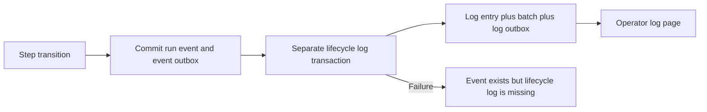
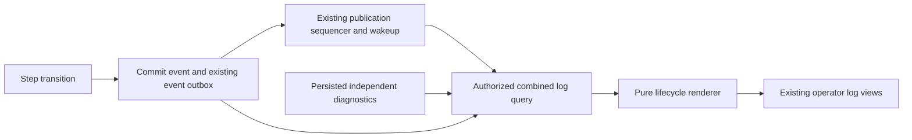

# Change Record: Derive lifecycle messages from run events

| Field | Value |
| --- | --- |
| Status | Implemented |
| Implementation state | Implemented and independently reviewed |
| Type | Persistence and operator read-path change |
| Primary issue | [#706](https://github.com/eirhop/favn/issues/706) |
| Pull request | [#712](https://github.com/eirhop/favn/pull/712) |
| Related work | [#704 retention](https://github.com/eirhop/favn/issues/704); [#705 normalization](https://github.com/eirhop/favn/issues/705) |
| Affected areas | favn_orchestrator, favn_storage_postgres, shared log DTOs in favn_core, log consumers in favn_view |
| Prior reviewed plan commit | `89705bd493da5722d0e974884db7951ee8fd93ad`; superseded by the reset-only scope below |
| Revised plan baseline | `28952509`; approved reset-only plan preserved in Git |
| Last updated | 2026-09-15 |

## One-minute summary

Every routine step transition already has an authoritative run event, but Favn
also writes a lifecycle log, a log batch and another outbox row. New transitions
will render their lifecycle message from the event instead. All environments
start from a reset baseline, so there is no legacy lifecycle representation to
support. Independent diagnostics keep their existing storage path. Reuse the
existing log facade, PostgreSQL queries and publication sequencer;
this change does not need another logging service or materialized timeline.

## Impact

An execution with submitted, running and finished events avoids nine additional
row inserts and three log-specific outbox publications. This is a count from the
current write path, not a measured percentage of total execution cost. It also
removes the interval in which an event has committed but its separate log write
can fail. Actual retained-byte savings and read cost must be measured.

## Problem analysis

### Assumptions

- Source baseline is origin/main at `046f59d5733125e97525b06cf8ef0f8f3231f0a3`.
- This request updates the record in its separate worktree. Runtime implementation,
  deployment and environment resets have not started. The user will reset the
  environments; permission to design for a reset is not an instruction to perform it.
- Preserve existing lifecycle wording, severity and execution meaning. In
  particular, submitted work is not yet running, and cancellation does not prove
  an external write stopped safely.
- On 2026-09-15 the user explicitly removed backward compatibility: there are no
  production users, and every environment can be reset for this change. Require a
  fresh database/runtime baseline rather than preserving old-format history.
- No in-place data conversion, old command/cursor support, mixed-version runtime
  or old-data restore is supported. Ordinary history and recovery within the new
  build remain required.
- The user selected lifecycle retention with run history on 2026-09-15. A shared
  log/event visibility cutoff is a different policy requiring additional design.
- The local Tidewave endpoint returned 404 during investigation. Findings are
  from current source and tests; no live database measurement is claimed.

### Evidence

| Evidence | What it proves | What it does not prove |
| --- | --- | --- |
| [TransitionWriter](../../../apps/favn_orchestrator/lib/favn_orchestrator/transition_writer.ex), `publish_committed/2` and `safe_emit_transition_log/2` | Each non-replayed step event triggers a separate log write after the authoritative commit | Its cost in a deployed workload |
| [Logs.Store](../../../apps/favn_storage_postgres/lib/favn_storage_postgres/logs/store.ex), `insert_batch!/3` | One lifecycle log adds a log row, batch row and outbox row | Net byte savings after new indexes |
| [RunEventCodec](../../../apps/favn_orchestrator/lib/favn_orchestrator/storage/run_event_codec.ex) and [Log.Identity](../../../apps/favn_core/lib/favn/log/identity.ex) | JSON representations need deliberate normalization for log identity/filter compatibility | That every decoded runtime value can be hashed as though it were its original tuple |
| [Replay concurrency tests](../../../apps/favn_storage_postgres/test/storage_v2/concurrency_authority_test.exs) | Publication IDs, not allocated row IDs, prevent missed late commits; filters precede limits | Correctness of the proposed combined query |
| [LogsLiveSupport](../../../apps/favn_view/lib/favn_view/logs_live_support.ex) and [LogsViewModel](../../../apps/favn_view/lib/favn_view/logs_view_model.ex) | Initial replay currently depends on visible entries; an empty page has no replay cursor | A safe handoff for the new event-backed source |
| [RunnerTasks.append_logs/1](../../../apps/favn_orchestrator/lib/favn_orchestrator/runner_tasks.ex) and [runner task store](../../../apps/favn_storage_postgres/lib/favn_storage_postgres/runner_tasks/store.ex) | Runner batches persist separately; the current operator log query does not read them | Operator visibility of all runner diagnostics |

## Current behavior

## Revised plan

The user superseded the compatibility requirement on 2026-09-15. The original
reviewed record is preserved in commit `89705bd493da5722d0e974884db7951ee8fd93ad`.
Independent reviewer `review_706_plan` approved this reset-only revision on
2026-09-15. It is the active plan; the original remains available for comparison.

### 1. Derive every step lifecycle message from its event

Every persisted step event in the fresh environment supplies its lifecycle entry.
Delete the routine transition-log write. Stored log rows are reserved for
independent diagnostics. There is no lifecycle mode, version marker, cutover
flag, legacy fallback, historical matching or dual-write period.

Reuse existing event fields for run, step, task, attempt, time, stage, status and
error/reason context. Persist only the missing canonical node/asset identity
strings needed for correct filters, using the existing identity normalizers
before lossy JSON conversion. Keep raw node data intact for other consumers.
Do not add a versioned descriptor, formatted message text, another copy of the
error, or a whole log entry. Prove that these small identity fields survive the
bounded event codec and produce the same public identities after restart.

Identity fields commit and hash with their event through the existing persistence
path. Keep exact replay and changed-content conflict checks for commands created
by the new build. There is no representation selection or special handling for
commands written before the reset. Existing event-codec validation/versioning
remains in place; do not introduce a separate lifecycle compatibility protocol.

### 2. Extract one pure lifecycle renderer

Use one small orchestrator module, `Logs.Lifecycle`, for event-to-entry mapping
and event-type/severity classification. SQL filters can use its event-type sets
rather than independently duplicating severity rules.

| Event types | Level | Behavior |
| --- | --- | --- |
| `step_queued`, `step_started`, `step_retry_started`, `step_running` | Info | Preserve queued, submitted and running distinctions |
| `step_finished`, `step_skipped_fresh` | Info | Preserve completion and freshness messages |
| `step_retry_scheduled` | Warning | Preserve retry and attempt context |
| `step_failed`, `step_timed_out`, `step_cancelled`, `step_blocked` | Error | Preserve existing severity and bounded error/reason context |

Retain the current generic step-event message fallback rather than silently
dropping an otherwise valid step event. Malformed required event data returns an
explicit bounded read error with stable event identity.
Keep warnings/errors with independent information persisted. Similar text from
a runner is not proof that it duplicates a control-plane event.

Derived entries have source `orchestrator`, stream `system`, and deterministic
identity from workspace, run and event sequence. Stored entries retain their
existing log identity. Preserve distinct attempts/windows and advisory events
with different event sequences. No lookup of the run's current task, authoring
modules or latest manifest is needed to render history.

Apply the existing log redaction, identity validation and size bounds to derived
output. Never expose the entire event payload as log metadata.

### 3. Extend the existing bounded log query

Keep `list_logs`, `replay_logs` and `subscribe_logs` on the public orchestrator
facade. Extend the existing persistence log-page contract to return tagged stored
log or lifecycle-event rows; a derived row must not fabricate a log ID or batch.
The orchestrator renders those rows into the existing public entry shape.

Use one SQL statement/snapshot combining stored diagnostic logs and step events
with `UNION ALL`. Apply workspace, run, step, runner task, node, asset, level,
source, stream, time and cursor predicates before bounded branch limits, then
apply the final ordered limit. Keep the existing default of 200 and maximum of
500 entries; fetch one additional matching row to determine `has_more?`.
Do not fetch two arbitrary pages and then filter or sort an unbounded history.

Normalize an omitted diagnostic stream to `system` on new writes, matching the
public entry default and derived lifecycle stream. Use that same meaning in
filters. This remains necessary for new diagnostic inputs; it is not a legacy-row
backfill or a change to stdout/stderr semantics.

- Historical key: occurrence time, source discriminator and stable row identity.
  The historical cursor also retains the snapshot publication upper bound.
- Replay key: existing commit-safe publication ID and batch offset. A lifecycle
  event uses its existing event outbox publication with offset zero. Stored
  batches retain their positions and existing 1,000-offset sequence encoding.
- Initial history captures the sequencer watermark in the same SQL snapshot and
  only includes published entries at or below it. Committed entries awaiting
  sequencing appear through replay afterward; this is a deliberate consistency
  boundary, not an assertion of immediate publication.
- Return an explicit replay cursor even when no entries match. A full replay
  page continues after its last returned item; when caught up, it can advance to
  the captured watermark. Never advance past matching entries not yet returned.
- `replay_logs` changes from a bare list to a bounded page carrying entries,
  continuation and `has_more?`. Update its types, docs and callers together.
  Replace the old historical cursor shape directly and validate the current
  shape only; no legacy parser or translation layer. Discard existing browser
  sessions/cursors during reset. Keep publication IDs as the replay primitive.

Add only indexes needed by these queries. Prefer partial expression indexes over
the required event identity fields before adding duplicate filter columns.
Measure real query plans for workspace, run, step and selective identity filters;
introduce scalar columns only if the measured query or codec contract requires
them. Neither a generic JSON index nor a new projection table is the default.

### 4. Reuse publication wakeups and drain pages

Reuse `Events.subscribe_persistence_publications/0`, the existing
`:favn_persistence_published` notification, and the established paged-drain
pattern in [API.SSE](../../../apps/favn_orchestrator/lib/favn_orchestrator/api/sse.ex).
The existing subscription owner forwards wakeups; it does not reconstruct events
or add another durable delivery path. Data is fetched through the authorized
facade, including after a membership change.

Subscribe before the initial snapshot, then replay from its watermark. On each
wakeup fetch a bounded page; if more remain, schedule the next mailbox turn.
Keep the existing periodic reconciliation as a missed-notification backstop.
Preserve owned subscription cleanup. Payload broadcasts must not bypass the
unified read path or advance the replay cursor ahead of unseen entries.

Keep replay progress separate from the View's trimmed display buffer. Merge
duplicate deliveries by stable entry identity and retain the existing presentation
order explicitly. Changing a backend filter reloads a matching snapshot; existing
local text filtering remains local. Do not add a streaming framework, another
GenServer, a new dispatcher, or a new SSE endpoint.

### Scope and complexity limits

Included: event-backed lifecycle rendering, history within the new build, bounded
combined reads, fresh-schema identity/index changes, live handoff and documentation.

Explicit non-goals: a timeline table, generic projection engine, new background
worker, configurable formatter registry, lifecycle representation markers, legacy
readers or cursor adapters, historical event/log conversion, dual-write rollout,
arbitrary producer deduplication, runner transport redesign, new logging
API for user code, SQL/result normalization, recovery changes, or scheduled
retention. Preserve `LogWriter` for independent logs; remove its routine transition
call and replace the private transition formatter with the single renderer.

### Implementation slices

| Slice | Outcome | Owner | Depends on |
| --- | --- | --- | --- |
| 1 | Canonical event identities, renderer and removal of routine log writes | Orchestrator and event persistence boundary | Reviewed plan; activate only with slices 2-3 |
| 2 | Combined history/replay page and required indexes | Orchestrator log contract; PostgreSQL; shared DTOs | 1 |
| 3 | Existing log views follow event publications without gaps | Orchestrator facade/subscriptions; View | 2 |
| 4 | Behavior, fresh-bootstrap and performance evidence; canonical docs | Owning app tests and documentation | 1-3 |

### Complexity budget

| Slice | Production added | Production deleted | Supporting added | Supporting deleted | Reason |
| --- | ---: | ---: | ---: | ---: | --- |
| 1 | 80-140 | 75-115 | 100-170 | 0-20 | Identity fields and extracted renderer; no representation compatibility |
| 2 | 230-360 | 40-100 | 220-340 | 20-60 | Two-source SQL, indexes and one current page DTO |
| 3 | 90-160 | 60-120 | 140-220 | 20-60 | Snapshot/replay handoff and existing consumers |
| 4 | 0-30 | 0-10 | 160-260 | 0-20 | Measurement fixture and fresh-bootstrap documentation |
| **Total** | **400-690** | **175-345** | **620-990** | **40-160** | Reuse current storage and publication machinery |

The original approved budget remains in the preserved commit: production additions
480-840, deletions 175-345; supporting additions 840-1,300, deletions 40-160. The
revised ranges remove compatibility work, not ordinary recovery or bounded-read
proof. They are estimates, not a reason to omit correctness tests. Supporting lines
include tests, fixtures and canonical documentation; exclude this record,
generated files, locks, dependencies and formatting-only changes. Explain each
category exceeding its upper budget by more than 25 percent or 100 lines,
whichever is smaller, and materially fewer deletions. Re-review added behavior
before proceeding. Preserve the approved budget when reporting actuals.

## Operational design

### Failures and recovery

An event and its required identity fields commit atomically or neither does.
Removing a log write must not change run ownership, fencing, cancellation or
retry decisions.
After lost acknowledgement, replay the original committed event. After a process
exit or lost PubSub notification, the existing sequenced outbox remains the replay
authority. Readers retain their last successful cursor on transient errors and
use the existing bounded retry/backstop path; no tight retry loop is added.

Unsupported data produces a visible read failure rather than an apparently empty
page. Report only event identity and a bounded error class in existing diagnostic
logging; do not log payloads on every poll or introduce a new diagnostic ledger.

### Retention policy

User-selected policy: lifecycle entries follow run-event retention, currently
indefinite. Independent stored logs keep the existing bounded log-purge policy.
Purging diagnostic logs does not erase lifecycle history. Document that distinction
and prove it using events and diagnostics created by the new build. There are no
pre-reset lifecycle logs to retain or resurrect.

Do not add a shared retention cutoff, tombstones or a retention worker in #706.
Event/outbox deletion remains the separate #704 design and must establish replay
watermarks before it is enabled. Current log replay is replay of retained logs,
not a guarantee to recover diagnostics already purged. Do not claim new detection
of every historical purge gap. A requirement for a common visibility window is a
scope decision to review before implementation, not an incidental enhancement.

### Independent diagnostic availability

Keep the existing `LogWriter`/log-store behavior and runner batch acceptance,
fencing, acknowledgement and payload retention intact. Tests must show independent
entries already exposed by the public log facade remain visible and unchanged,
including warnings/errors, and accepted runner batches are preserved.

There is a pre-existing availability gap: the current log query does not consume
`runner_task_log_batches`, which can also contain runner-event wrappers. This
record does not disguise that gap as solved and does not add a second copy pipeline
to this write-reduction change. Before claiming all of #706's diagnostic-availability
criterion complete, demonstrate the intended operator path or agree a separately
scoped prerequisite for that gap. Storage-row preservation alone is not proof of
operator visibility. Do not create or publish a new issue without user direction.

### Reset, fresh bootstrap and rollback

- The user performs a coordinated environment reset before deploying this change.
  Stop old control planes, Views and runners first; clear old durable execution
  state, pending runner delivery and browser sessions/cursors. No old task,
  command or log batch may be replayed into the new environment.
- Follow the existing [reset-only ownership contract](../../production/upgrade_and_rollback.md): coordinate control-plane
  state with Favn-owned data-plane state. Do not clear ownership records and
  silently reuse the managed outputs they described. This record does not execute
  deletion or introduce a new reset tool.
- Update the current schema/bootstrap definitions, necessary query indexes and
  schema qualification through the repository's established reset-only process.
  Test a fresh bootstrap. Add no historical data migration or compatibility
  shim. Existing environments are reset rather than upgraded in place.
- Bootstrap and publish the manifest into the fresh environment, then start the
  matching candidate control plane and View plus compatible runners. No feature
  flag or mixed-version period is supported. No runner wire change is planned.
- Rollback is another coordinated fresh-baseline deployment of the chosen build.
  Do not run old readers against new event history or restore incompatible data.
- Before runtime implementation, complete the repository's reviewed-baseline,
  commit/push, draft PR and rendered-diagram workflow. This request updates the
  record only; environment reset and implementation remain unexecuted.

## Verification plan

| Issue acceptance criterion | Planned evidence | Owner |
| --- | --- | --- |
| No duplicate routine writes | Count new log entries, log batches and log-specific outbox rows for each transition; event and event outbox still commit once | PostgreSQL transition integration |
| Independent diagnostics remain available | Existing facade diagnostic round-trip and runner-batch preservation tests; explicitly resolve or report the availability gap above | Orchestrator and PostgreSQL |
| Equivalent history, filters, ordering and cursors | Every mapped type plus generic fallback, level/source/stream/time/identity filters, equal timestamps, attempts and repeated windows; filter before limit | Renderer and combined-query tests |
| History and mixed sources after reset | New-build events and independent diagnostics in one page; exact command replay and changed-content conflicts; system-stream defaults; diagnostic purge preserves lifecycle history | PostgreSQL |
| Live delivery and reconnect | Empty bootstrap, out-of-order commits on separate connections, unsequenced rows, process exit after commit, lost/duplicate wakeups, multi-page drain, filter changes and authorization loss | PostgreSQL and View boundary |
| Before/after writes, bytes and read cost | Same success, retry and cancellation fixtures on baseline and implementation; actual generated-query plans | Owning performance tier |
| Documentation and fresh deployment | Fresh bootstrap; update facade/DTO docs, storage architecture/data-model docs, reset/retention/rollback guidance and FEATURES only when implemented | PostgreSQL and documentation |

**User-directed acceptance change:** the original issue asks for historical and
new lifecycle representations to coexist. The user superseded that requirement
with mandatory environment reset. Do not mark legacy compatibility as tested or
implemented. Ordinary persisted history, diagnostics/event coexistence and live
reconnect within the new build remain required. Record this scope change in the
later PR; do not edit the GitHub issue as part of this record-only request.

Use deterministic messages and database barriers rather than timing sleeps. Cover
a full 1,000-entry stored batch and replay ending mid-batch, many unrelated rows
before a matching row, zero-match progress, malformed required event data,
redaction, truncation, subscription cleanup and invalid current cursor rejection.
Preserve distinct-event behavior after repeated runner-start notifications.

Measure inserted/updated rows and SQL/transaction counts by table, heap/index/TOAST
bytes and WAL per representative execution. Include identity-field/index overhead
in net savings. EXPLAIN the actual combined queries with ANALYZE and BUFFERS at
representative cardinality for history and replay; record latency and examined
rows. Do not substitute a hand-written similar query or forced-index-only plan
for evidence of the production query's normal plan. No percentage or immediate
database-file shrinkage claim is made in advance.

Start with the narrow owning-layer checks under `mise exec -- mix`, using
umbrella `cmd mix test` dispatch. Code completion requires relevant format,
warnings-as-errors compilation, fast/acceptance/slow checks and the tag guard.
Use a disposable PostgreSQL database per the storage testing guide. This
documentation-only request needs link/diagram review and `git diff --check`;
runtime tests, migration runs and benchmarks are not executed merely to write it.

## Risks and open questions

| Risk or question | Decision or guard |
| --- | --- |
| Scope expands into a general logging platform | Explicit non-goals, four small slices and separate added/deleted budgets |
| Lossy event JSON changes identity filters | Persist only missing canonical identity values before encoding; round-trip tests |
| Old state accidentally enters a fresh deployment | Coordinated reset and matching builds; no import, upgrade or old runner replay |
| Empty history or display trimming loses replay progress | Snapshot watermark and paged replay state independent of visible entries |
| Two-source query scans growing history | Filter before limit; measured production query plans; targeted partial indexes |
| Different lifecycle and diagnostic retention | User-selected policy; common cutoff requires a reviewed scope change |
| Existing runner diagnostics cannot be shown in operator logs | Explicit acceptance gap, not permission to build another ingestion pipeline |
| Downgrade uses incompatible history | Rollback requires another coordinated fresh-baseline deployment |

## Plan review

| Field | Result |
| --- | --- |
| Reviewer | Independent agent `review_706_plan` |
| Reviewed against | Issue #706, current source/tests, prior plan and the user's reset-only simplification |
| Prior review | Compatibility plan approved on 2026-09-15; preserved in `89705bd493da5722d0e974884db7951ee8fd93ad` |
| Revised findings and recheck | Complete revised plan, prior baseline and all four deviations independently checked on 2026-09-15; no blocking findings |
| Revised verdict | Approved for the reset-only scoped plan. Runner diagnostic visibility remains an explicit issue-completion gate. No reset, implementation or performance qualification claimed. |

## Implementation outcome

Implemented the reset-only design in the issue worktree:

- `Logs.Lifecycle` renders step events; `TransitionWriter` no longer writes logs.
- The event codec preserves canonical identities across its bounded JSON passes.
- PostgreSQL returns tagged lifecycle/diagnostic rows with one filtered, bounded
  SQL snapshot, independent replay progress, and validated current cursors.
- Four partial indexes cover history and event identity filters. The exact catalog
  fingerprint was regenerated from a freshly bootstrapped PostgreSQL 18 database.
- Publication wakeups replace log-payload delivery. The existing subscription
  forwarder remains owned by its caller. View replay drains pages and retains
  progress independently of display trimming; level/source changes reset history.
- Canonical storage, retention, and feature documentation describe the new behavior.

No existing development, staging, or production environment was reset. Verification
uses a separate PostgreSQL Compose project and disposable databases created for
this task. Runner transport batch storage remains unchanged; its pre-existing
operator-visibility gap remains outside this implementation. The PR must reference
#706 without claiming that outstanding criterion is complete.

Final validation, measurements, complexity counts, and review follow below.

## Deviations from the approved plan

This is a user-directed planning revision before implementation. The complete
previous plan and its budgets remain in commit
`89705bd493da5722d0e974884db7951ee8fd93ad`; it has not been rewritten in Git.

| Prior reviewed plan | Revised plan | Reason | Reviewer verdict |
| --- | --- | --- | --- |
| Preserve unmarked lifecycle logs and mark new events | Derive every step event; retain only independent diagnostic logs | User permits mandatory reset and rejects backward compatibility | Approved; justified |
| Representation-aware replay of old commands and legacy cursor handling | Ordinary exact replay and current cursor shape only | No old commands, sessions or data survive reset | Approved; justified |
| In-place reader upgrade and compatible-reader rollback | Fresh bootstrap for deployment and rollback | Reset-only environment contract | Approved; justified |
| Production additions 480-840; supporting additions 840-1,300 | Production additions 400-690; supporting additions 620-990 | Remove compatibility code and its test matrix | Approved; justified |

### Implementation deviations

| Approved plan | Actual change | Reason |
| --- | --- | --- |
| Push reviewed plan and open a draft before coding | PR creation follows implementation and final independent review | User explicitly requested this order on 2026-09-15 |
| Retain independent diagnostic writes | Retain writes and remove unused payload-broadcast helpers | All log consumers now wake from committed publications; keeping a second, unused delivery API would add stale code |
| Historical query implementation left open within SQL design | Small `Logs.Query` module builds the two-source statement | Keeps the store's mutation/validation code separate from the real, directly measurable SQL; no additional read service |

## Decision log

- On 2026-09-15 the user authorized implementation, asked the primary agent to do
  the work without implementation sub-agents, and requested Astra at xhigh for
  final review before PR creation. This supersedes the usual draft-first order.

- On 2026-09-15 the user removed backward compatibility and accepted environment
  resets. Remove lifecycle markers, legacy reads and cross-upgrade replay paths.
- Keep canonical identities, exact replay within the new build, redaction and
  commit-safe bounded pagination: resets do not remove these correctness needs.
- Reuse the existing publication sequencer and paged-drain mechanism.
- The user selected lifecycle retention with run history on 2026-09-15; retain
  existing diagnostic log retention without a new shared cutoff mechanism.
- Keep the runner diagnostic visibility gap explicit and separately scoped;
  resetting environments does not solve it.

## Verification evidence

### Behavior and schema

- Warnings-as-errors compilation passed. The final renderer/codec/subscription
  checks passed (17 tests before review; 18 with the review regression). Whitespace and test-tier checks passed.
- Orchestrator fast suite: 862/863 checks passed; the remaining unchanged
  slot-owner monitor race passed on isolated rerun (5 tests). An earlier parallel
  attempt had four 100 ms timing failures, all covered by the sequential run.
- View fast suite: all 837 checks passed, including 135 doctests. This includes
  empty bootstrap, page draining, duplicate wakeups, failed authorization/read,
  backend-filter snapshot reset, local search, and periodic reconciliation tests.
- PostgreSQL fast suite: 436/440 checks passed. The four failures involved existing
  admission deadlines and runner-task timestamp fixtures; all passed on isolated
  rerun (16 tests). No unrelated production or fixture changes were made for them.
- New concurrency tests prove mixed history, every filter dimension, current
  cursor validation, exact replay/conflicts, zero duplicate writes, unsequenced
  events, late event/log commits, snapshot stability, 1,000-entry batch drainage,
  empty-page progress, and diagnostic purge preserving lifecycle history.
- The fast storage suite includes independent diagnostic redaction and accepted
  runner-batch preservation, and fresh bootstrap/schema qualification. The new
  catalog fingerprint is `d32ef8a8d9aea4e56cee626a41cb7918ab57e057e6790b13cf0c247929ab091b`.
- After merging upstream PR #711, compilation and 78 focused PostgreSQL
  concurrency/runner-task checks passed (4 excluded).
- Both record diagrams were rendered with Mermaid and visually inspected locally.
  GitHub rendering is checked after PR creation under the user-directed workflow.

The broad suites were not clean on their first invocation. Compilation during an
initial parallel run also caused transient missing-module failures; verification
was repeated sequentially after compilation. The results above retain the actual
suite failures and isolated recheck boundaries rather than claiming one entirely
green broad-suite invocation.

### Measured write cost

The slow `lifecycle_measurement` test uses the real transition store and
`TransitionWriter.publish_committed/2`. It creates 100 run fixtures for each of
three step-transition sequences: success (3 events), retry (6 events), and
cancellation (3 events). These are persistence fixtures, not runner/SQL workload
benchmarks. Run-state updates, event writes, canonical identities and indexes are
included. Both benchmark runs passed.

Baseline: source commit `046f59d5` in a temporary checkout with the same measurement
test copied in. Candidate: this implementation. Each ran sequentially, with four
BEAM schedulers, on its own freshly bootstrapped PostgreSQL 18 database in the
isolated task container. No other task database writes ran during these final
measurements. Earlier overlapping/timeout attempts were discarded.

| Per 100 fixtures | Step events | Transactions before → after | SQL statements before → after | WAL bytes before → after |
| --- | ---: | ---: | ---: | ---: |
| Success | 300 | 700 → 400 | 6,900 → 4,800 | 4,631,528 → 3,472,744 |
| Retry | 600 | 1,300 → 700 | 11,400 → 7,200 | 8,195,096 → 5,781,256 |
| Cancellation | 300 | 700 → 400 | 6,900 → 4,800 | 4,487,432 → 3,591,640 |

Each routine transition removes exactly three inserts (entry, batch, log outbox),
one transaction and two SELECTs. Event/run UPDATE counts are unchanged. Across
all 300 fixtures, log entries and batches each go from 1,200 new rows to zero;
outbox rows go from 2,700 to 1,500. Both builds retain 1,500 run events.

| Relation | Added rows before → after | Heap bytes before → after | Index bytes before → after | Total bytes before → after |
| --- | ---: | ---: | ---: | ---: |
| `runs` | 300 → 300 | 1,269,760 → 851,968 | 1,785,856 → 1,818,624 | 3,088,384 → 2,703,360 |
| `run_events` | 1,500 → 1,500 | 1,622,016 → 1,622,016 | 868,352 → 1,720,320 | 2,514,944 → 3,375,104 |
| `log_entries` | 1,200 → 0 | 1,384,448 → 0 | 1,515,520 → 0 | 2,924,544 → 0 |
| `log_batches` | 1,200 → 0 | 671,744 → 0 | 753,664 → 0 | 1,449,984 → 0 |
| `outbox_events` | 2,700 → 1,500 | 1,400,832 → 622,592 | 696,320 → 344,064 | 2,121,728 → 999,424 |

All measured TOAST deltas were zero. Totals include PostgreSQL relation auxiliary
storage, so they need not equal heap plus indexes. Event/log/outbox total growth
fell from 9,011,200 to 4,374,528 bytes, including the additional event indexes.
Page allocation, dead tuples, checkpoints and timing affect these small local
samples; they do not establish a production savings percentage or file shrinkage.
WAL covers the write phase before sequencing; it does not claim downstream
sequencer/projector cost. SQL counts include transaction-control statements.

### Measured reads and tradeoff

The same test captures the actual SQL and bound parameters emitted by `Logs.page`,
then runs `EXPLAIN (ANALYZE, BUFFERS, FORMAT JSON)` after ANALYZE with ordinary
planner settings. No index is forced. Dataset: 300 runs, 1,200 step events; the
baseline also has 1,200 lifecycle log rows. Each call requests 200 entries plus
one for continuation. This establishes local query behavior, not a large-scale
latency SLO or a benchmark with maximum-size event payloads.

| Filter | History ms before → after | Replay ms before → after |
| --- | ---: | ---: |
| workspace | 2.951 → 6.054 | 2.102 → 3.371 |
| run | 0.138 → 0.306 | 0.252 → 0.266 |
| step | 1.036 → 0.425 | 1.133 → 0.492 |
| task | 0.203 → 0.281 | 0.222 → 0.226 |
| node | 0.119 → 1.297 | 0.102 → 6.164 |
| asset | 1.776 → 1.557 | 2.326 → 4.952 |

The candidate's broad workspace plan scans 1,500 event rows (1,200 step matches)
and 1,502 outbox rows, then bounds the returned page; it hits 289 shared buffers.
Run/step/task queries use their targeted indexes, returning three matching rows
with 20–53 buffer hits. Node/asset history uses the new partial indexes and reads
201 matching events. Their broad first replay pages inspect 1,200 matching events;
selective replay and larger retained histories still require workload monitoring.
All recorded plans used warm shared buffers (zero shared reads).

The baseline node query returned **zero** rows because its post-codec node identity
was different from the canonical filter; its small time is not a valid performance
comparison. The candidate returns the expected 201 rows. This is covered by the
canonical-identity round-trip and filter tests.

The chosen tradeoff is fewer writes and less retained storage in exchange for
some slower broad reads. No additional projection table or worker was introduced
to chase small-fixture query timings. Full JSON EXPLAIN outputs and per-scenario
sizes were inspected locally; reproduce them with the slow tagged test and
`FAVN_LOG_MEASUREMENT_PATH` pointing at a local JSON artifact.

### Complexity and remaining boundaries

Final counts against the merged upstream base, excluding this record:

| Slice | Production added | Production deleted | Supporting added | Supporting deleted |
| --- | ---: | ---: | ---: | ---: |
| 1 | 158 | 95 | 146 | 1 |
| 2 | 287 | 127 | 235 | 12 |
| 3 | 108 | 227 | 187 | 12 |
| 4 | 0 | 0 | 227 | 2 |
| **Total** | **553** | **449** | **795** | **27** |

Allocation uses whole files except the 183-line measurement fixture/helper block,
which belongs to slice 4. Slice 1 owns the renderer, codec and both former write
modules. Slice 2 owns page DTOs, persistence/query/schema changes. The intertwined
public `Logs` facade is allocated entirely to slice 3 with subscriptions and View;
this allocation avoids pretending its shared functions have independent costs.
Remaining concurrency/core-authority tests belong to slice 2; measurement and
canonical documentation belong to slice 4.

Total additions remain within the approved ranges. Slice 1's 158 production
additions exceed its 140-line estimate by 18 lines, below the material variance
threshold, because the renderer also validates malformed identities and bounded
metadata. Slice 3's extra deletions remove obsolete broadcast/topic helpers;
its additions remain in budget. Fewer supporting deletions reflect adding coverage
to the small existing log test surface; no legacy compatibility tests were added.

No reset of an existing
environment, production workload test, mixed-version rollout or legacy-history
conversion was performed. Runner diagnostic operator visibility remains the
explicit pre-existing acceptance gap; this PR must not auto-close all of #706.

## Final review

Astra at xhigh independently reviewed the code, baseline comparison and raw
measurement artifacts before PR creation. Its initial verdict requested one
correctness fix: generic historical messages depended on the VM atom table.
Message classification now uses strings, with a regression that renders the same
persisted payload before and after its event atom is created. A minor subscription
warning issue was also fixed and tested across failed and successful polling.
The requested per-slice complexity accounting is included above.

Review fixes passed warnings-as-errors compilation, 18 orchestrator
renderer/codec/subscription tests and 6 focused View tests. Astra at xhigh
approved commit `f9efafd4` with no remaining findings and independently reran both
groups successfully. The reviewer confirmed the per-slice counts and justified
deviations. Approval covers the reset-only implementation, with the documented
runner-diagnostic gap and deployment/measurement limits.
