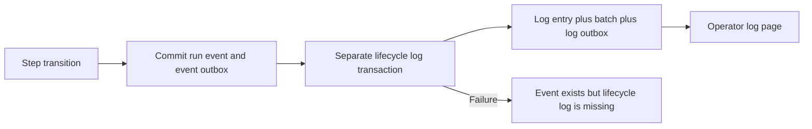
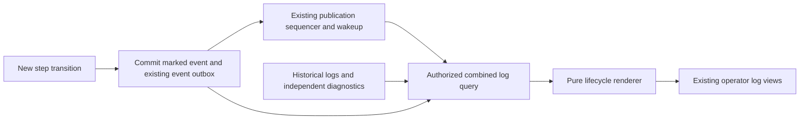

# Change Record: Derive lifecycle messages from run events

| Field | Value |
| --- | --- |
| Status | Plan reviewed |
| Implementation state | Record only; implementation has not started |
| Type | Persistence and operator read-path change |
| Primary issue | [#706](https://github.com/eirhop/favn/issues/706) |
| Pull request | Pending implementation workflow |
| Related work | [#704 retention](https://github.com/eirhop/favn/issues/704); [#705 normalization](https://github.com/eirhop/favn/issues/705) |
| Affected areas | favn_orchestrator, favn_storage_postgres, shared log DTOs in favn_core, log consumers in favn_view |
| Approved plan commit | Not established; record reviewed locally, publication precedes implementation |
| Last updated | 2026-09-15 |

## One-minute summary

Every routine step transition already has an authoritative run event, but Favn
also writes a lifecycle log, a log batch and another outbox row. New transitions
will render their lifecycle message from the event instead. Existing lifecycle
logs remain readable, and independent diagnostics keep their existing storage
path. Reuse the existing log facade, PostgreSQL queries and publication sequencer;
this change does not need another logging service or materialized timeline.

## Impact

An execution with submitted, running and finished events avoids nine additional
row inserts and three log-specific outbox publications. This is a count from the
current write path, not a measured percentage of total execution cost. It also
removes the interval in which an event has committed but its separate log write
can fail. Actual retained-byte savings and read cost must be measured.

## Problem analysis

### Assumptions

- Source baseline is origin/main at `046f59d5733125e97525b06cf8ef0f8f3231f0a3`.
- This request authorizes a planning record in a separate worktree. Runtime
  implementation, deployment and historical data repair have not started.
- Preserve existing lifecycle wording, severity and execution meaning. In
  particular, submitted work is not yet running, and cancellation does not prove
  an external write stopped safely.
- Support a coordinated stop/start upgrade of the control plane and View. Mixed
  old/new control-plane binaries and transparent downgrade are not requirements.
- Existing historical logs remain their original representation. Reconstructing
  historical logs that previously failed or expired is separate repair work.
- The user selected lifecycle retention with run history on 2026-09-15. A shared
  log/event visibility cutoff is a different policy requiring additional design.
- The local Tidewave endpoint returned 404 during investigation. Findings are
  from current source and tests; no live database measurement is claimed.

### Evidence

| Evidence | What it proves | What it does not prove |
| --- | --- | --- |
| [TransitionWriter](../../../apps/favn_orchestrator/lib/favn_orchestrator/transition_writer.ex), `publish_committed/2` and `safe_emit_transition_log/2` | Each non-replayed step event triggers a separate log write after the authoritative commit | Its cost in a deployed workload |
| [Logs.Store](../../../apps/favn_storage_postgres/lib/favn_storage_postgres/logs/store.ex), `insert_batch!/3` | One lifecycle log adds a log row, batch row and outbox row | Net byte savings after new indexes |
| [RunEventCodec](../../../apps/favn_orchestrator/lib/favn_orchestrator/storage/run_event_codec.ex) and [Log.Identity](../../../apps/favn_core/lib/favn/log/identity.ex) | JSON representations need deliberate normalization for log identity/filter compatibility | That every decoded runtime value can be hashed as though it were its original tuple |
| [Replay concurrency tests](../../../apps/favn_storage_postgres/test/storage_v2/concurrency_authority_test.exs) | Publication IDs, not allocated row IDs, prevent missed late commits; filters precede limits | Correctness of the proposed combined query |
| [LogsLiveSupport](../../../apps/favn_view/lib/favn_view/logs_live_support.ex) and [LogsViewModel](../../../apps/favn_view/lib/favn_view/logs_view_model.ex) | Initial replay currently depends on visible entries; an empty page has no replay cursor | A safe handoff for the new event-backed source |
| [RunnerTasks.append_logs/1](../../../apps/favn_orchestrator/lib/favn_orchestrator/runner_tasks.ex) and [runner task store](../../../apps/favn_storage_postgres/lib/favn_storage_postgres/runner_tasks/store.ex) | Runner batches persist separately; the current operator log query does not read them | Operator visibility of all runner diagnostics |

## Current behavior

## Approved plan

Independent reviewer `review_706_plan` approved this scoped plan after recheck on
2026-09-15. Approval covers the plan, not implementation or full issue acceptance.

### 1. Make historical and new sources disjoint

Add one small, explicit versioned lifecycle descriptor to newly created step
events. Version 1 identifies an event-backed lifecycle message and carries only
the canonical log identities that the existing event fields cannot safely
reproduce after JSON encoding. Store the descriptor inside the existing event
payload and hash, in the same transaction as the event. Do not store formatted
message text, another copy of the error, or a whole log entry in the descriptor.

Create it before lossy serialization, using the existing identity normalizers.
Keep raw node data intact for other consumers. Reuse existing event fields for
run, step, task, attempt, time, stage, status and error/reason context. Test that
all required descriptor fields survive the bounded event codec.

- Unmarked historical event: read its stored lifecycle log; never derive a
  second entry from that event.
- New marked event: derive its lifecycle entry; never write its routine log.
- A run may contain both kinds of event. The mode belongs to the individual
  immutable event, not the run, deployment timestamp or current presence of logs.
- A replayed command retains the event originally committed. Do not add a marker
  to an old event during replay, change its hash or produce a new log.

Choose the representation at the existing durable new-write/replay boundary.
The current run store compares event hashes during replay: adding a descriptor
before that comparison would incorrectly conflict with an old committed event.
Prepare canonical identities before JSON conversion, but include the descriptor
in the persisted encoding only for a new event. For a replay, build the comparison
candidate using the stored representation and retain all existing event, snapshot,
command-identity and changed-content conflict checks. Do not bypass validation or
accept changed semantic content merely because a command ID already exists.

The coordinated writer cutover makes the two sources disjoint. Consequently this
plan does not add legacy matching, text-based deduplication, a backfill, or an
anti-join over all historical logs. If implementation finds a real supported
path producing both representations for one event, resolve that write path or
obtain a reviewed plan deviation before adding reconciliation machinery.

### 2. Extract one pure lifecycle renderer

Use one small orchestrator module, `Logs.Lifecycle`, for the descriptor contract,
event-to-entry mapping and event-type/severity classification. SQL filters can
use its event-type sets rather than independently duplicating severity rules.

| Event types | Level | Behavior |
| --- | --- | --- |
| `step_queued`, `step_started`, `step_retry_started`, `step_running` | Info | Preserve queued, submitted and running distinctions |
| `step_finished`, `step_skipped_fresh` | Info | Preserve completion and freshness messages |
| `step_retry_scheduled` | Warning | Preserve retry and attempt context |
| `step_failed`, `step_timed_out`, `step_cancelled`, `step_blocked` | Error | Preserve existing severity and bounded error/reason context |

Retain the current generic step-event fallback for version 1 rather than silently
dropping an otherwise valid step event. Unknown descriptor versions or malformed
required data return an explicit bounded read error with stable event identity.
Keep warnings/errors with independent information persisted. Similar text from
a runner is not proof that it duplicates a control-plane event.

Derived entries have source `orchestrator`, stream `system`, and deterministic
identity from workspace, run and event sequence. Stored entries retain their
existing log identity. Preserve distinct attempts/windows and advisory events
with different event sequences. No lookup of the run's current task, authoring
modules or latest manifest is needed to render history.

Apply the existing log redaction, identity validation and size bounds to derived
output. Never expose the entire event payload as log metadata.

### 3. Extend the existing bounded log query

Keep `list_logs`, `replay_logs` and `subscribe_logs` on the public orchestrator
facade. Extend the existing persistence log-page contract to return tagged stored
log or lifecycle-event rows; a derived row must not fabricate a log ID or batch.
The orchestrator renders those rows into the existing public entry shape.

Use one SQL statement/snapshot combining stored log rows and marked step events
with `UNION ALL`. Apply workspace, run, step, runner task, node, asset, level,
source, stream, time and cursor predicates before bounded branch limits, then
apply the final ordered limit. Keep the existing default of 200 and maximum of
500 entries; fetch one additional matching row to determine `has_more?`.
Do not fetch two arbitrary pages and then filter or sort an unbounded history.

Treat a missing stored stream as `system` in query predicates, matching the
existing public-entry normalization. Historical lifecycle rows currently have a
NULL stream column; literal equality would exclude them while including derived
entries under the same system-stream filter. This is a narrow read correction,
not a data backfill or change to stdout/stderr semantics.

- Historical key: occurrence time, source discriminator and stable row identity.
  The historical cursor also retains the snapshot publication upper bound.
- Replay key: existing commit-safe publication ID and batch offset. A lifecycle
  event uses its existing event outbox publication with offset zero. Stored
  batches retain their positions and existing 1,000-offset sequence encoding.
- Initial history captures the sequencer watermark in the same SQL snapshot and
  only includes published entries at or below it. Committed entries awaiting
  sequencing appear through replay afterward; this is a deliberate consistency
  boundary, not an assertion of immediate publication.
- Return an explicit replay cursor even when no entries match. A full replay
  page continues after its last returned item; when caught up, it can advance to
  the captured watermark. Never advance past matching entries not yet returned.
- `replay_logs` changes from a bare list to a bounded page carrying entries,
  continuation and `has_more?`. Update its types, docs and callers together.
  Historical cursors need a versioned new shape; reject incompatible cursors
  with a reload result. Keep publication IDs as the existing replay primitive.

Add only indexes needed by these queries. Prefer partial expression indexes over
the small descriptor/existing fields before adding duplicate filter columns.
Measure real query plans for workspace, run, step and selective identity filters;
introduce scalar columns only if the measured query or codec contract requires
them. Neither a generic JSON index nor a new projection table is the default.

### 4. Reuse publication wakeups and drain pages

Reuse `Events.subscribe_persistence_publications/0`, the existing
`:favn_persistence_published` notification, and the established paged-drain
pattern in [API.SSE](../../../apps/favn_orchestrator/lib/favn_orchestrator/api/sse.ex).
The existing subscription owner forwards wakeups; it does not reconstruct events
or add another durable delivery path. Data is fetched through the authorized
facade, including after a membership change.

Subscribe before the initial snapshot, then replay from its watermark. On each
wakeup fetch a bounded page; if more remain, schedule the next mailbox turn.
Keep the existing periodic reconciliation as a missed-notification backstop.
Preserve owned subscription cleanup. Payload broadcasts must not bypass the
unified read path or advance the replay cursor ahead of unseen entries.

Keep replay progress separate from the View's trimmed display buffer. Merge
duplicate deliveries by stable entry identity and retain the existing presentation
order explicitly. Changing a backend filter reloads a matching snapshot; existing
local text filtering remains local. Do not add a streaming framework, another
GenServer, a new dispatcher, or a new SSE endpoint.

### Scope and complexity limits

Included: event-backed lifecycle rendering, historical compatibility, bounded
combined reads, required identity/index migration, live handoff and documentation.

Explicit non-goals: a timeline table, generic projection engine, new background
worker, configurable formatter registry, historical event/log rewrite, dual-write
rollout, arbitrary producer deduplication, runner transport redesign, new logging
API for user code, SQL/result normalization, recovery changes, or scheduled
retention. Preserve `LogWriter` for independent logs; remove its routine transition
call and replace the private transition formatter with the single renderer.

### Implementation slices

| Slice | Outcome | Owner | Depends on |
| --- | --- | --- | --- |
| 1 | Event descriptor, renderer and removal of routine log writes | Orchestrator and event persistence boundary | Reviewed plan; activate only with slices 2-3 |
| 2 | Combined history/replay page and required indexes | Orchestrator log contract; PostgreSQL; shared DTOs | 1 |
| 3 | Existing log views follow event publications without gaps | Orchestrator facade/subscriptions; View | 2 |
| 4 | Behavior, migration and performance evidence; canonical docs | Owning app tests and documentation | 1-3 |

### Complexity budget

| Slice | Production added | Production deleted | Supporting added | Supporting deleted | Reason |
| --- | ---: | ---: | ---: | ---: | --- |
| 1 | 120-200 | 75-115 | 160-240 | 0-20 | Small descriptor and extracted renderer |
| 2 | 260-420 | 40-100 | 300-460 | 20-60 | Two-source SQL, indexes and page DTO |
| 3 | 100-180 | 60-120 | 160-260 | 20-60 | Snapshot/replay handoff and existing consumers |
| 4 | 0-40 | 0-10 | 220-340 | 0-20 | Measurement fixture and canonical documentation |
| **Total** | **480-840** | **175-345** | **840-1,300** | **40-160** | Reuse current storage and publication machinery |

These are estimates, not a reason to omit correctness tests. Supporting lines
include tests, fixtures and canonical documentation; exclude this record,
generated files, locks, dependencies and formatting-only changes. Explain each
category exceeding its upper budget by more than 25 percent or 100 lines,
whichever is smaller, and materially fewer deletions. Re-review added behavior
before proceeding. Preserve the approved budget when reporting actuals.

## Operational design

### Failures and recovery

An event and its descriptor commit atomically or neither does. Removing a log
write must not change run ownership, fencing, cancellation or retry decisions.
After lost acknowledgement, replay the original committed event. After a process
exit or lost PubSub notification, the existing sequenced outbox remains the replay
authority. Readers retain their last successful cursor on transient errors and
use the existing bounded retry/backstop path; no tight retry loop is added.

Unsupported data produces a visible read failure rather than an apparently empty
page. Report only event identity and a bounded error class in existing diagnostic
logging; do not log payloads on every poll or introduce a new diagnostic ledger.

### Retention policy

User-selected policy: derived lifecycle entries follow run-event retention,
currently indefinite. Historical lifecycle logs and independent stored logs keep
the existing bounded log-purge policy. Purging logs does not erase marked event
history, and an expired unmarked legacy log never reappears as a derived entry.
Consequently a new lifecycle message can remain visible longer than an old stored
lifecycle message. Document that operator-visible distinction explicitly.

Do not add a shared retention cutoff, tombstones or a retention worker in #706.
Event/outbox deletion remains the separate #704 design and must establish replay
watermarks before it is enabled. Current log replay is replay of retained logs,
not a guarantee to recover diagnostics already purged. Do not claim new detection
of every historical purge gap. A requirement for a common visibility window is a
scope decision to review before implementation, not an incidental enhancement.

### Independent diagnostic availability

Keep the existing `LogWriter`/log-store behavior and runner batch acceptance,
fencing, acknowledgement and payload retention intact. Tests must show independent
entries already exposed by the public log facade remain visible and unchanged,
including warnings/errors, and accepted runner batches are preserved.

There is a pre-existing availability gap: the current log query does not consume
`runner_task_log_batches`, which can also contain runner-event wrappers. This
record does not disguise that gap as solved and does not add a second copy pipeline
to this write-reduction change. Before claiming all of #706's diagnostic-availability
criterion complete, demonstrate the intended operator path or agree a separately
scoped prerequisite for that gap. Storage-row preservation alone is not proof of
operator visibility. Do not create or publish a new issue without user direction.

### Deployment, migration and compatibility

- Add the required event-query indexes and storage schema qualification entries.
  Existing event payloads/hashes and historical logs are unchanged; there is no
  data backfill or bulk deletion.
- Use a coordinated control-plane/View stop/start upgrade. New readers and the
  no-log-write event marker ship together. No runtime feature flag or supported
  mixed-binary period is introduced. Runners retain their current wire contract.
- Do not alter the representation of commands already durably committed before
  the upgrade. Test acknowledgement loss across this boundary.
- Old readers cannot show new event-backed logs. Roll back only to a build that
  understands this representation; do not silently remove marker/index support
  or regenerate logs on downgrade. This restriction belongs in the operator docs.
- Before runtime implementation, complete the repository's reviewed-baseline,
  commit/push, draft PR and rendered-diagram workflow. Creating this record alone
  is not authorization to execute the runtime plan.

## Verification plan

| Issue acceptance criterion | Planned evidence | Owner |
| --- | --- | --- |
| No duplicate routine writes | Count new log entries, log batches and log-specific outbox rows for each transition; event and event outbox still commit once | PostgreSQL transition integration |
| Independent diagnostics remain available | Existing facade diagnostic round-trip and runner-batch preservation tests; explicitly resolve or report the availability gap above | Orchestrator and PostgreSQL |
| Equivalent history, filters, ordering and cursors | Every mapped type plus generic fallback, level/source/stream/time/identity filters, equal timestamps, attempts and repeated windows; filter before limit | Renderer and combined-query tests |
| Historical/new compatibility without duplication or loss | Unmarked legacy plus marked new events in the same run; upgraded code replays old commands without enrichment and still rejects changed content; mixed system-stream filtering; purge old logs without resurrection | PostgreSQL |
| Live delivery and reconnect | Empty bootstrap, out-of-order commits on separate connections, unsequenced rows, process exit after commit, lost/duplicate wakeups, multi-page drain, filter changes and authorization loss | PostgreSQL and View boundary |
| Before/after writes, bytes and read cost | Same success, retry and cancellation fixtures on baseline and implementation; actual generated-query plans | Owning performance tier |
| Documentation and safe rollout | Update public facade/DTO docs, storage architecture/data-model docs, operator retention/rollback guidance and FEATURES only when implemented | Documentation review |

Use deterministic messages and database barriers rather than timing sleeps. Cover
a full 1,000-entry stored batch and replay ending mid-batch, many unrelated rows
before a matching row, zero-match progress, malformed/unsupported descriptor,
redaction, truncation, subscription cleanup and stale cursor reload. Preserve
the existing distinct-event behavior after repeated runner-start notifications.

Measure inserted/updated rows and SQL/transaction counts by table, heap/index/TOAST
bytes and WAL per representative execution. Include descriptor/index overhead
in net savings. EXPLAIN the actual combined queries with ANALYZE and BUFFERS at
representative cardinality for history and replay; record latency and examined
rows. Do not substitute a hand-written similar query or forced-index-only plan
for evidence of the production query's normal plan. No percentage or immediate
database-file shrinkage claim is made in advance.

Start with the narrow owning-layer checks under `mise exec -- mix`, using
umbrella `cmd mix test` dispatch. Code completion requires relevant format,
warnings-as-errors compilation, fast/acceptance/slow checks and the tag guard.
Use a disposable PostgreSQL database per the storage testing guide. This
documentation-only request needs link/diagram review and `git diff --check`;
runtime tests, migration runs and benchmarks are not executed merely to write it.

## Risks and open questions

| Risk or question | Decision or guard |
| --- | --- |
| Scope expands into a general logging platform | Explicit non-goals, four small slices and separate added/deleted budgets |
| Lossy event JSON changes identity filters | Persist only missing canonical identity values before encoding; round-trip tests |
| Historic log purge changes representation | Never derive unmarked events or switch source according to log existence |
| Empty history or display trimming loses replay progress | Snapshot watermark and paged replay state independent of visible entries |
| Two-source query scans growing history | Filter before limit; measured production query plans; targeted partial indexes |
| Different lifecycle and diagnostic retention | User-selected policy; common cutoff requires a reviewed scope change |
| Existing runner diagnostics cannot be shown in operator logs | Explicit acceptance gap, not permission to build another ingestion pipeline |
| Downgrade hides new lifecycle messages | Coordinated deployment and reader-compatible rollback only |

## Plan review

| Field | Result |
| --- | --- |
| Reviewer | Independent agent `review_706_plan` |
| Reviewed against | Issue #706, current source/tests, this record and the user's instruction to avoid overengineering |
| Findings | Require representation-aware legacy replay without weakening changed-content conflicts; normalize missing stored stream to system for equivalent filters |
| Findings addressed and rechecked | Both corrections and the full revised record independently rechecked on 2026-09-15 |
| Verdict | Approved for the scoped plan; no blocking plan findings. Runner diagnostic visibility remains an explicit issue-completion gate. No implementation or performance qualification claimed. |

## Implementation outcome

Not started. This request creates the planning record only. Runtime behavior,
canonical product documentation and historical data are unchanged.

## Deviations from the approved plan

No implementation baseline or deviations exist yet. Record material changes here
after the independently reviewed plan is published; do not rewrite that baseline.

## Decision log

- Prefer disjoint historical/new representations over retrospective matching.
- Reuse the existing publication sequencer and paged-drain mechanism.
- The user selected lifecycle retention with run history on 2026-09-15; retain
  existing diagnostic log retention without a new shared cutoff mechanism.
- Keep the runner diagnostic visibility gap explicit and separately scoped.

## Verification evidence

| Check | Result | Evidence boundary |
| --- | --- | --- |
| Issue and source inspection | Complete at origin/main `046f59d5` | Static findings; not live database behavior |
| Independent plan review | Approved after both findings were corrected and rechecked | Plan only; diagnostic visibility gate remains explicit |
| Links, diagrams and whitespace | Ten local links resolve; fences and flowchart node references checked; Mermaid syntax/meaning manually reviewed; whitespace check passed | Documentation only; rendered GitHub diagram verification remains before implementation |

### Not verified

Implementation correctness, migration execution, database query plans, net byte
savings, live deployment behavior and runner diagnostic operator visibility.

## Final review

Not applicable yet. After implementation, a different reviewer must compare the
actual change, evidence and complexity counts with the approved planning baseline.
