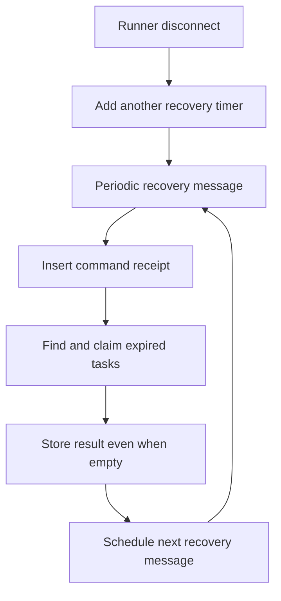
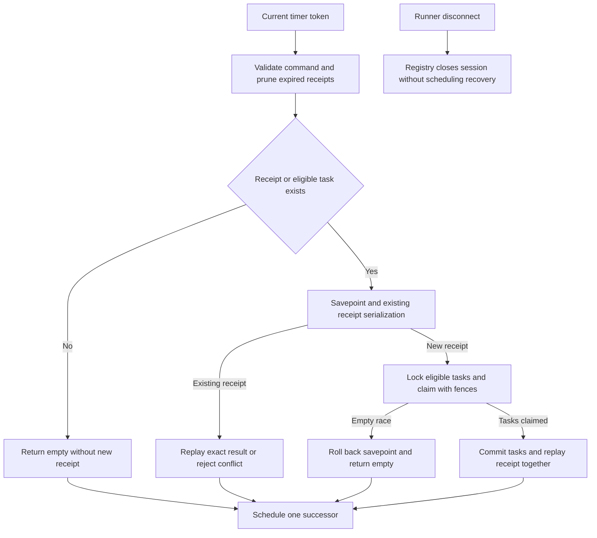

# Change Record: Bound runner recovery checks and suppress empty receipts

| Field | Value |
| --- | --- |
| Status | Implementing |
| Implementation state | Implemented; final qualification and independent review in progress |
| Type | Bug fix; persistence replay contract refinement |
| Primary issue | [#707](https://github.com/eirhop/favn/issues/707) |
| Pull request | [#708 (draft)](https://github.com/eirhop/favn/pull/708) |
| Related work | [#704 retention](https://github.com/eirhop/favn/issues/704), [#705 normalization](https://github.com/eirhop/favn/issues/705), [#706 lifecycle logs](https://github.com/eirhop/favn/issues/706); preserve merged [#703 recovery safeguards](https://github.com/eirhop/favn/pull/703) |
| Affected areas | favn_orchestrator recovery scheduling and persistence contract; favn_storage_postgres runner-task receipts |
| Approved plan commit | `0e1e64bf0eb68a5eef2d5581919900ce56bda8d1` |
| Last updated | 2026-09-14 |

## One-minute summary

Recovery checks look for unfinished tasks whose runner lease has expired. Each
runner disconnect currently adds another self-repeating timer, and every empty
check writes a durable receipt. This change keeps one recurring timer per
orchestrator and makes an empty scan create no new history. Actual recovery
continues to claim tasks atomically and replay the exact recorded result. This
requires a reviewed plan because timer concurrency and persistent command replay
are correctness boundaries.

## Impact

An idle deployment can spend more storage on receipts saying that no recovery
was needed than on useful execution history. Removing those inserts reduces
retained rows, index growth, and write traffic. Fixing the timer prevents runner
connection churn from increasing the check frequency over process lifetime.
This is not a claim that PostgreSQL files immediately shrink after rollout.

## Problem analysis

### Assumptions

- Source baseline is current origin/main at `5b8a1124`, including the cancellation
  and recovery safeguards merged in PR #703. The earlier investigation checkout
  was older; implementation must preserve the newer safeguards.
- PostgreSQL is the only control-plane backend. Recovery remains owned by the
  orchestrator; no runner or View access to storage is introduced.
- The five-second fallback interval and maximum batch of 50 stay unchanged.
  Each orchestrator may have its own loop; cluster-wide leader election is not
  required for this correction.
- The supplied deployment evidence is read-only user-reported evidence, not a
  reproduced local benchmark. Exact deployed revision and instance count are
  not yet verified. Public records omit consumer identifiers and raw payloads.
- The local Tidewave endpoint was unavailable during investigation. Source and
  user-supplied aggregates support planning; live runtime behavior is not claimed.

### Evidence

| Evidence | What it proves | What it does not prove |
| --- | --- | --- |
| `RunnerTaskRecovery.handle_info/2`: runner-down adds a timer; each recovery message adds its successor | Disconnects add recurring timer chains until process restart | How many chains or instances ran in the downstream deployment |
| `RunnerTasks.Store.idempotent_transact/3` inserts a receipt before `recover_expired/1` discovers an empty task list | Empty recovery checks create rows and indexes | Their byte cost in every workload |
| Downstream operation/age aggregates identify empty recovery receipts as almost all command receipts, with no receipts beyond the seven-day window | Receipt creation is the immediate problem; observed expiry works | Sustainable per-asset cost or a continuous-workload forecast |
| Existing recovery tests exercise exact replay, fenced claiming, maximum batches and expiry | Contracts the fix must preserve | Timer fan-out and no-write empty-scan behavior, which need new tests |

## Current behavior

Each recovery message starts a bounded database recovery and then schedules
another message. Runner-down notifications schedule the same message without
cancelling or replacing the existing timer. All scans enter the generic durable
receipt path, including scans that return an empty list.

## Approved plan

Astra xhigh independently approved this planning baseline on 2026-09-14.

### One recurring timer

Keep one unique current tick token in recovery process state. Start one
immediate tick. Accept only the current token; clear it before running recovery
and schedule exactly one successor afterward. Ignore stale, duplicated or
untagged tick messages so an already delivered old message cannot establish
another chain. Do not introduce timer deadlines, cancellation/replacement logic
or another scheduler abstraction.

Remove the registry's runner-down notification to recovery: the production
five-second fallback already precedes the redundant 30-second disconnect check.
Any already queued legacy runner-down notification is an inert message, with no
scan or timer scheduling. Registry session cleanup and all other disconnect
behavior stay unchanged. Persisted lease expiry remains the authority for
recoverability. Keep recovery serial within its current GenServer and retain
existing bounded error reporting.

### No receipt for an empty recovery scan

Keep the existing receipt-before-task-lock ordering and normal replay machinery.
Add a recovery-specific fast path inside the storage transaction, after validating
the command and performing the existing bounded pruning:

1. Validate authority, command identity, owner, bounds, timestamps, and the
   seven-day issued-at window before allowing an empty return.
2. Use one read-only SQL statement/snapshot to ask whether either an existing
   receipt with this scope/command ID or an eligible expired task exists. The
   task predicate must match the real scan, but this probe takes no task locks.
3. If neither exists, return `{:ok, []}` without inserting a receipt or task
   snapshot. Looking up receipt and eligibility in one snapshot avoids missing
   a concurrent committed recovery between two separate reads.
4. Otherwise enter the existing insert-or-replay path inside a savepoint created
   after pruning. The unique receipt key serializes equal command identities
   before task locks. Existing receipts, including old empty receipts and
   conflicting operation/hash identities, use the existing replay/conflict path.
5. For a newly inserted receipt, run the existing bounded ordered
   `FOR UPDATE SKIP LOCKED` scan and fenced task updates. If this discovers no
   tasks because eligibility changed or another caller locked them, roll back
   to the real SQL savepoint and return `{:ok, []}`. This removes the provisional receipt
   transactionally while preserving pruning before the savepoint. Release the
   savepoint on success. Do not substitute a nested `Repo.transaction` or
   `Repo.rollback`, which would not provide this partial SQL rollback contract.
   SQL/storage failures still roll back normally.
6. Nonempty results retain their receipt and per-task snapshots in the same
   transaction as assignment generation changes. No external work is performed
   in this transaction. All other command types retain their current behavior.

The steady idle path performs no receipt insert/update/delete. A competing
positive-probe race can still generate rolled-back physical writes; that rare
case is measured separately and does not retain a new empty receipt. A routine
insert followed by delete is explicitly not the solution. Prefer small private
functions in the existing store; do not add a second general idempotency framework.

### Contracts and invariants

- At most one current recovery timer token exists per process. Stale delivered
  tokens are harmless. Startup and process restart establish only one chain.
- A disconnect is not proof that a database write stopped. Lease expiry,
  assignment budgets, cancellation ownership, write ownership and unknown-outcome
  behavior remain those of the current implementation.
- `recover_expired/1` keeps `{:ok, list}` / `{:error, Error}` return shapes and its
  limit. No schema or runner wire-format change is expected.
- A previously empty, unrecorded scan does not reserve command identity. Reusing
  it may inspect again and claim newly eligible work. Once a nonempty recovery
  commits, its identity is bound to its request hash and exact result throughout
  the receipt window. Changed `occurred_at` retains existing hashing semantics.
- Existing stored empty receipts replay empty until normal expiry. Existing
  conflicting receipts are not bypassed by the no-work path. Invalid/expired
  commands must not be accepted just because there is no work.
- Same-command competitors cannot claim a second batch after one commits.
  Different commands retain SKIP LOCKED coordination. A returned empty list
  means no tasks were claimed by that call, not that the whole cluster is idle.
- No new command/snapshot/outcome rows remain after an empty new scan. A failed
  transaction leaves neither claimed tasks nor a successful receipt.
- Existing seven-day incremental pruning still runs during valid empty checks.
  Fewer checks also mean less pruning capacity; backlog behavior is measured and
  not presented as an immediate seven-day wall-clock deletion guarantee.

### Scope and non-goals

Includes timer lifecycle, recovery-specific empty-result handling, narrow metrics,
contract documentation and regression qualification. Excludes changes to lease
length, fallback interval, batch size, generic command semantics, retention
periods, cluster leader election, task-result routing, SQL normalization, a new
cleanup scheduler, blanket receipt deletion and production maintenance commands.
Follow-ups remain in issues #704, #705 and #706.

### Implementation slices

| Slice | Outcome | Owner | Depends on |
| --- | --- | --- | --- |
| 1 | One token-checked timer; remove redundant disconnect scheduling | favn_orchestrator | None |
| 2 | Read-only empty fast path; exact nonempty replay; race rollback | favn_storage_postgres and persistence behaviour docs | None |
| 3 | Narrow diagnostics, contract docs and combined idle/recovery qualification | Both owning layers | 1 and 2 |

### Complexity budget

| Slice | Production added | Production deleted | Supporting added | Supporting deleted | Reason |
| --- | ---: | ---: | ---: | ---: | --- |
| 1 | 20-45 | 10-25 | 90-160 | 0-15 | Token handling, removal of registry notification and deterministic process tests |
| 2 | 70-150 | 10-40 | 180-320 | 0-30 | Recovery-specific probe/savepoint and transaction/replay tests |
| 3 | 10-30 | 0-10 | 60-140 | 0-15 | Low-cardinality telemetry, documentation and idle qualification |

Supporting lines include tests, fixtures and canonical docs. Exclude this record,
generated files, locks and formatting-only changes. Explain a category exceeding
its upper bound by more than 25 percent or 100 lines, whichever is smaller, and
materially fewer deletions, as required by the change-record process.

### Implementation map

| Area | Responsibility |
| --- | --- |
| `apps/favn_orchestrator/lib/favn_orchestrator/runner_task_recovery.ex` | Timer state, accepted tick handling, preserved failure diagnostics |
| `apps/favn_orchestrator/lib/favn_orchestrator/runner_registry.ex` | Remove only the redundant recovery notification; retain session cleanup |
| `apps/favn_orchestrator/lib/favn_orchestrator/persistence/runner_task_store.ex` | Empty-scan versus committed-recovery replay contract |
| `apps/favn_storage_postgres/lib/favn_storage_postgres/runner_tasks/store.ex` | Validated same-snapshot probe, existing receipt serialization, savepoint handling |
| `apps/favn_orchestrator/test/runner_task_recovery_test.exs` | Timer lifecycle and existing disposition regressions |
| `apps/favn_storage_postgres/test/storage_v2/runner_tasks_test.exs` | Atomicity, no empty history, replay, locking and expiry regressions |
| `docs/architecture/elastic-runners.md` crash-recovery section | Canonical scheduling and recovery semantics |
| `docs/production/postgresql_operator_runbook.md` | Interpreting receipt/scan metrics and post-rollout space reuse; link to canonical contract |

## Operational design

### Failures and recovery

Retain current rate-limited recovery failure reporting and serial bounded scans.
A database timeout/deadlock/connection failure returns the existing error shape;
the loop survives and schedules its next tick. No blind task execution retry is
introduced. The store can resolve an uncertain commit through exact replay if a
caller resubmits the same command. The actual recovery loop generates a new
command ID each tick and retains no failed command identity; after an ambiguous
claim acknowledgement, an unreleased recovery assignment becomes eligible again
when its recovery lease expires. This change does not introduce automatic
same-command retries in that loop. Committed tasks remain fenced. Keep all PR #703
write-resolution, requeue-safety and result-routing safeguards intact.

### Logs and diagnostics

Emit one low-cardinality telemetry measurement per executed recovery tick with
elapsed duration, recovered-task count and error count. Distinguish successful
empty scans, nonempty scans and failures without logging a row per empty scan.
Use existing warning throttling for storage/recovery failures. Do not persist
telemetry as run events or receipts, include task payloads, or use unique command
IDs as metric labels. Stale tick messages do not increment the executed-scan count.

### Rollout and compatibility

No migration, destructive cleanup or retention-window change is planned. A normal
orchestrator stop/start upgrade discards old in-memory timer chains and retains
durable receipts. This follows the supported deployment contract; it does not
introduce or qualify multi-control-plane availability or mixed-version rolling
clusters. Existing receipts preserve replay compatibility. A targeted regression
may exercise old/new storage call paths to protect unique-key serialization,
but that is not deployment support. Rolling back restores unnecessary writes
but does not invalidate nonempty receipts. Pruning removes old rows incrementally and normal
vacuum permits space reuse; allocated volume shrinkage is not an acceptance test.

## Verification plan

- Timer tests use controlled messages/timer tokens and a deterministic recovery
  stub or established test fixture, not long sleeps or assumptions about scheduler
  timing. Exercise runner disconnect churn and confirm session cleanup still
  occurs without scheduling recovery. Deliver stale/duplicate tick tokens and
  queued legacy messages; hold a scan while messages arrive, then verify one
  successor plus no parallel scans. Check startup, failure and restart.
- PostgreSQL tests run against a disposable database per the storage testing
  guide. Repeated empty scans with no pruning backlog cause zero increases in
  command/snapshot/outcome inserts or retained row counts; no normal empty path
  inserts then deletes a receipt. Use query instrumentation or committed table
  insert counters, not table-size changes alone.
- Exercise a positive probe followed by completion/renewal or SKIP LOCKED
  contention so the locked scan returns empty. Verify savepoint rollback leaves
  no receipt/task mutation and pruning before that savepoint remains committed.
- Use independent database connections and explicit barriers for equal-command
  and distinct-command races. Verify exact replay after a committed claim, no
  second batch under the same identity, and fenced disjoint claims for different
  commands. Cover concurrent old/new storage call paths as a serialization
  regression, not as qualification of unsupported mixed-version deployments.
- Exercise old stored empty receipts, request-hash/operation conflicts,
  invalid authority/identity/timestamps, expiry boundaries, and empty-then-later
  nonempty calls. Preserve existing maximum-batch and global expiry-index tests.
  Separately EXPLAIN the actual new combined probe SQL at representative task and
  receipt cardinality for idle, existing-receipt and eligible-work cases; verify
  indexed/bounded access rather than assuming the old locking-query test proves it.
- Verify rollback before commit and store-level same-command replay after lost
  acknowledgement. Preserve the loop's new-command/lease-expiry behavior. Test pruning
  with an expired backlog on an otherwise idle scan, safe requeue, cancellation,
  and unknown outcomes. Existing PR #703 recovery qualification remains required.
- Run the narrow owning-layer tests first using `mise exec -- mix` and umbrella
  `cmd mix test` dispatch. Before code completion run formatting, compilation
  with warnings as errors, relevant fast/acceptance/slow checks and tag guard
  according to affected tiers. Documentation-only planning needs link/diagram
  review and `git diff --check`, not the umbrella runtime suite.
- Before/after qualification reports scans per instance, empty receipt insert
  counts, nonempty recovery behavior, pruning progress, and table/index/TOAST
  bytes separately. A sustained idle test with disconnect churn must keep the
  scan cadence bounded and add no empty receipts. Live deployment verification
  remains separate from automated tests and requires the deployed revision and
  orchestrator count to be recorded.

## Risks and open questions

| Risk | Mitigation or decision |
| --- | --- |
| Probe misses concurrent receipt/eligibility transition | One SQL snapshot for both predicates; exact concurrency regression tests |
| Savepoint accidentally rolls back pruning or a replayed result | Savepoint follows pruning; empty rollback applies only to a newly created recovery receipt; preserve old receipt path |
| Empty optimization weakens validation | Validate before probe; test invalid calls with no candidates |
| New receipt path changes lock order | Keep existing receipt insertion before task locks; avoid new cross-operation advisory-lock ordering |
| Stale or duplicate tick messages reach the mailbox | Unique token comparison; stale-message tests; no timer cancellation/replacement path |
| Reduced scans slow existing backlog cleanup | Measure pruning throughput and report residual backlog; independent scheduling stays in #704 |
| Requiring zero WAL in a positive-probe race over-expands design | Guarantee no retained empty history; zero routine idle receipt writes; measure rare rolled-back writes separately |

## Plan review

| Field | Result |
| --- | --- |
| Reviewer | Independent Astra (`gpt-6-astra`), xhigh reasoning; agent `astra_plan_review` |
| Reviewed against | Issue #707, origin/main at 5b8a1124, current code/tests, supplied aggregate evidence and this record |
| Findings | First review requested timer simplification, supported rollout wording and precise lost-acknowledgement semantics; also requested query-plan coverage for the new probe |
| Findings addressed and rechecked | All findings corrected and the full revised record independently rechecked on 2026-09-14 |
| Verdict | Approved: no remaining actionable findings. Approval covers the plan only, not implementation or runtime behavior. |

## Implementation outcome

The recovery process now accepts only its current tagged tick, keeps one serial
chain and ignores old ticks and legacy disconnect messages. Registry session
cleanup remains in place without sending redundant recovery notifications.
Each executed tick emits duration, claimed-task count and error count telemetry.

The store validates empty calls and retains incremental pruning. One SQL snapshot
probes receipt identity and task eligibility. Idle calls create no receipt. Positive
probes keep receipt insertion before task locks; a real SQL savepoint removes a
new provisional receipt when the locked scan loses its candidates. Existing empty
receipts and operation/hash conflicts use the existing serialization/replay path.
Nonempty results and fences commit together. No migration or configuration change
is required. Deployment remains a normal orchestrator stop/start upgrade.

## Deviations from the approved plan

The approved proposed-behavior diagram also describes the final implementation.
No production design or scope deviations. Tests reproduce the old empty-receipt
insert/commit protocol on a separate connection; they do not boot an old release
or qualify a mixed-version deployment. Separate deterministic timer and real
PostgreSQL tests establish the idle behavior; no deployed sustained-load benchmark
is claimed.

### Complexity accounting

| Slice | Production added/deleted | Supporting added/deleted | Explanation |
| --- | ---: | ---: | --- |
| 1: timer and its tick telemetry | 31 / 17 | 141 / 1 | Includes the telemetry implementation and process tests budgeted across slices 1 and 3; counted once here |
| 2: storage and callback contract | 94 / 44 | 449 / 10 | Extra supporting lines cover controlled concurrent receipt/eligibility races, rollback, legacy protocol and the actual probe plan at 5,000 extra tasks and 10,000 extra receipts |
| 3: canonical operational documentation | 0 / 0 | 34 / 0 | Tick telemetry and its tests are counted in slice 1 |

Counts exclude this record. Slice 2 supporting additions exceed the approved
320-line upper estimate by 129 lines. The overrun is verification for the planned
concurrency, replay and query-planning guarantees, not additional product behavior.
Production remains within the combined approved additions budget. No replaced
production path was retained; slice 3 has no separate production deletions because
its telemetry is integrated into slice 1.

## Decision log

- Planning uses current origin/main rather than the earlier investigation branch
  to preserve the merged recovery/cancellation safeguards.
- Astra xhigh requested removing unsupported long-interval deadline logic;
  use token-only periodic ticks and remove the registry notification.
- Astra xhigh requested restricting rollout to supported stop/start upgrades and
  distinguishing store-level replay from the loop's eventual lease-based recovery.
- Add EXPLAIN coverage for the actual combined probe, and explicitly use a real
  SQL savepoint instead of nested Ecto transaction rollback.
- Preserve receipt-before-task lock ordering with a no-work fast path and a
  narrowly scoped savepoint rather than introducing another advisory-lock
  protocol across all runner commands.

## Verification evidence

| Check | Result | Evidence boundary |
| --- | --- | --- |
| PostgreSQL setup | Repository setup completed against isolated PostgreSQL 18 container; tests use separate bootstrap-owned `favn_test` database | No consumer database touched |
| Orchestrator fast suite | 859 passed, including 16 recovery/session tests | Deterministic timer, disconnect, failure and telemetry coverage |
| Actual combined probe planning | Passed with 5,000 extra task rows and 10,000 extra receipts; idle, existing receipt and eligible-work cases use indexes with no sequential scan | Local representative-cardinality query plan; not downstream throughput |
| Storage fast suite | Running after focused regressions | Full outcome will be recorded before review completion |
| Crash-recovery slow qualification | Still to run | No new crash-test claim yet |
| Compilation / formatting / test tag guard | Test compilation with warnings as errors, format check and CI tag guard passed | Local checks |
| Documentation | Both original approved diagrams visually rendered on GitHub before implementation; links and whitespace checked | Diagrams unchanged; final GitHub recheck still to run |

### Not verified

Exact downstream deployed revision, orchestrator count, contribution of disconnect
churn to observed cadence, savings after rollout, and live vacuum/space reuse.
No production rollout, bulk deletion or file compaction has been performed.

## Final review

Independent Astra xhigh implementation review is requested against approved
baseline `0e1e64bf0eb68a5eef2d5581919900ce56bda8d1`. Qualification in progress is
explicitly listed above and must be completed before the final verdict is recorded.
