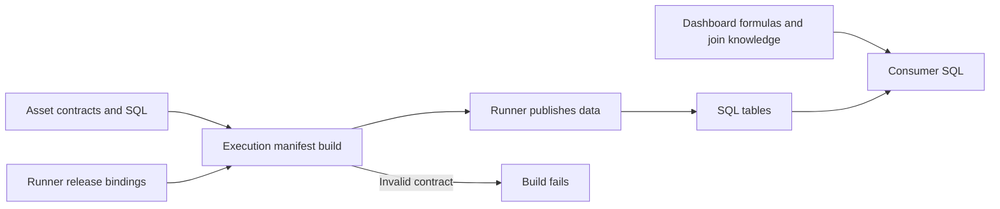
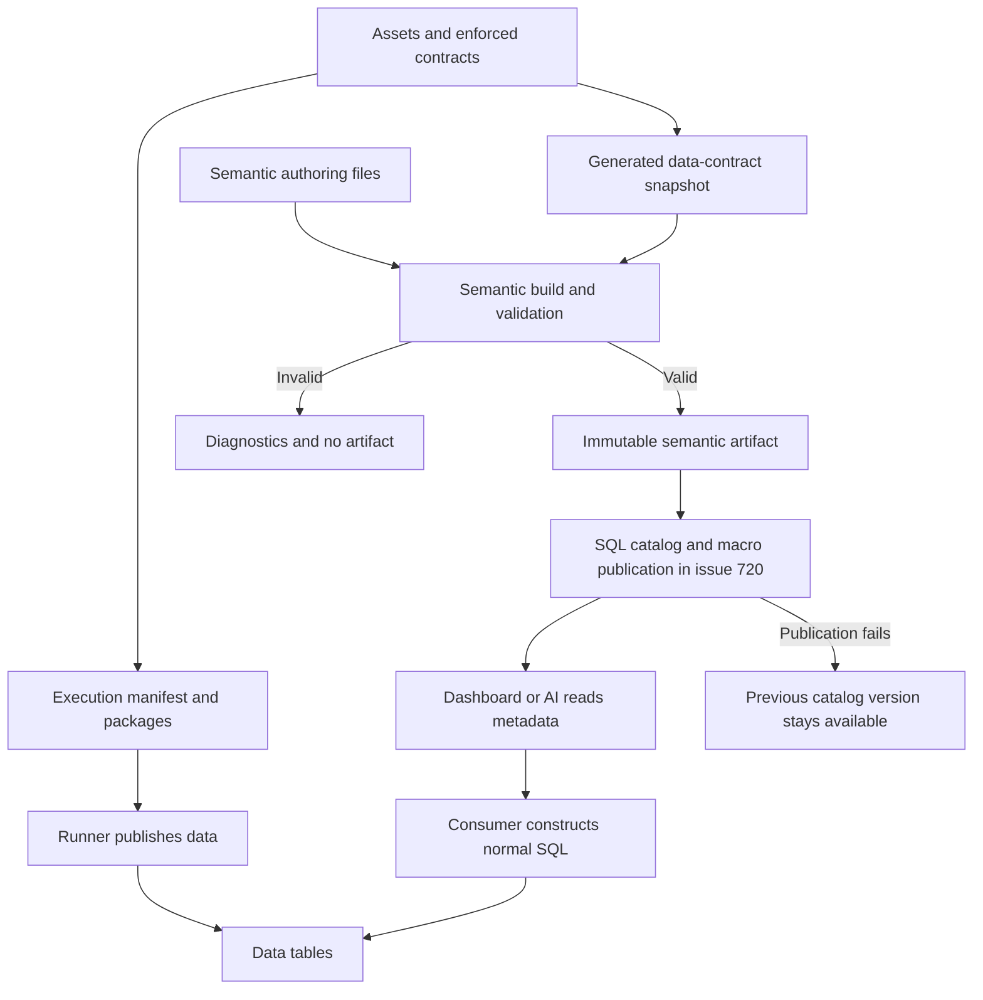

# Change Record: SQL-native semantic models with independent releases

| Field | Value |
| --- | --- |
| Status | Plan reviewed |
| Type | Feature |
| Primary issue | [#718](https://github.com/eirhop/favn/issues/718) |
| Pull request | [#723](https://github.com/eirhop/favn/pull/723) (draft; planning only) |
| Related work | [#720 catalog publication](https://github.com/eirhop/favn/issues/720), [#721 runtime state](https://github.com/eirhop/favn/issues/721), [#719 AI/MCP](https://github.com/eirhop/favn/issues/719) |
| Affected areas | Public authoring, Core contracts/compiler, local build tooling, DuckDB integration, generated relationship checks |
| Source baseline | `8d2b8e1f1e574dabb4670ef0e56f46e073f51f8d` on `origin/main` |
| Approved plan commit | [`00fe02f8c56b35d808bd4ca3fc4419097a0529dd`](https://github.com/eirhop/favn/commit/00fe02f8c56b35d808bd4ca3fc4419097a0529dd) |
| Last updated | 2026-09-17 |

## One-minute summary

Define a metric once as ordinary SQL and publish its formula, exact column
bindings, usage rules, and dependency graph as an independently versioned
artifact. Dashboards construct ordinary DuckDB macro calls from that metadata;
they query their existing SQL connection directly. Contracts continue to own
columns, grain, and enforced relationships. Semantic models own analytical
meaning and can change without rebuilding or redeploying a runner. This record
specifies the proposed implementation; none of these new APIs exists yet.

The current delivery is the reviewed plan and draft PR only. Implementation
starts in a later task. Examples in this record are design examples, not files
installed in a consumer project.

## Impact and problem analysis

Today dashboards repeat business formulas and relationship knowledge. The same
quantity can become `SUM(net_value) / SUM(units)` in one dashboard and an average
of row-level prices in another. Contracts describe the data but do not give a
consumer the approved calculation or how to invoke it.

The intended consumer experience is: discover `sales.net_revenue`, read its
ordered column bindings, construct a macro call using the query's table alias,
and choose filters and grouping in normal SQL. An AI consumer receives the same
metadata and generated examples. Metadata reduces mistakes; it does not prove
that arbitrary SQL, joins, or AI output are correct.

### Assumptions and decisions

- DuckDB is the first formula dialect. DuckLake remains a storage/catalog
  integration, not a Favn query service.
- Consumers own SQL generation and execution. No Favn API wrapper, metric
  request language, or interception of dashboard queries is introduced.
- Explicit column arguments are accepted. A macro cannot verify that a numeric
  argument came from the intended source column.
- One source relation per semantic model; metrics compose within that model.
- A semantic-only change must leave execution packages, execution manifest
  identity, runner identity, and freshness/rebuild decisions unchanged.
- Relationship checks affect publication and therefore belong in the execution
  contract. Editing them is intentionally an execution change.
- Time selection and minimum grain are machine-readable usage requirements.
  A formula macro does not enforce them.
- The DSL and limits below settle implementation choices that were illustrative
  in #718. Departures from the issue are listed explicitly later in this record.

### Evidence

| Evidence | What it establishes | Limit |
| --- | --- | --- |
| [`Favn.SQL`](../../../apps/favn_authoring/lib/favn/sql.ex) and [`Template`](../../../apps/favn_core/lib/favn/sql/template.ex) | Existing function-style `defsql`, literal `~SQL`, expression templates, and local arguments can be reused. | Templates alone do not prove that SQL reads only declared inputs. |
| [`Contract`](../../../apps/favn_core/lib/favn/sql/contract.ex), [`Check`](../../../apps/favn_core/lib/favn/sql/check.ex), [`SQLAsset`](../../../apps/favn_authoring/lib/favn/sql_asset.ex) | Contracts generate bounded checks; checked publication already supports checks before and after mutation within a transaction. | Relationship resolution and incremental cardinality checks need new behavior. |
| [`ManifestBuilder`](../../../apps/favn_authoring/lib/favn_authoring/deployment/manifest_builder.ex) | Building the existing deployable manifest requires runner release bindings. | It cannot simply become the semantic-only build entrypoint. |
| [`SourceRelease`](../../../apps/favn_local/lib/favn_local/source_release.ex) | Local runner identity hashes compiled BEAM files. | Moving formulas into another ordinary `.ex` module would still couple releases. |
| [`Manifest.Asset`](../../../apps/favn_core/lib/favn/manifest/asset.ex), [`TargetCompatibility`](../../../apps/favn_core/lib/favn/target_compatibility.ex) | Runtime descriptors and package hashes drive execution compatibility. | The existing field `semantic_generation_id` is a data/execution concept, not the analytical artifact proposed here. |
| DuckDB 1.5.4 in-memory probes during design | Aggregate expressions work inside scalar macros; compatible but wrong numeric arguments bind; a synthetic relation does not prevent a subquery from reading another relation. | This is feasibility evidence, not adapter, production, or load qualification. |
| [DuckDB macro documentation](https://duckdb.org/docs/current/sql/statements/create_macro), [SQL-to-JSON documentation](https://duckdb.org/docs/current/data/json/sql_to_and_from_json) | Native macro and parser facilities exist. | Parser representation and macro persistence must be qualified against supported runtime pins. |

Static source inspection is sufficient for this plan. No development-server
runtime inspection or live data access is claimed.

## Current behavior

The execution manifest binds authored assets to runner releases. Dashboards
maintain formulas and joins independently. There is no analytical artifact with
its own build or release identity.



## Approved plan

Keep two independent release paths. The execution build exports a generated
snapshot of its public data contracts. Semantic authoring consumes that snapshot
without building a runner release. #718 ends at an immutable local artifact and
inspection/diff surfaces; #720 adds publication and activation of that artifact.



### 1. Data contract DSL

Existing `Favn.SQLAsset` declarations remain the source of physical schema,
grain, explicit asset dependencies, and validation. The new declaration is
`relationship` inside `contract do`:

```elixir
defmodule MyApp.Mart.Store do
  use Favn.SQLAsset

  relation connection: :analytics, schema: "mart", name: "dim_store"
  materialized :table

  contract do
    grain by: [:store_id], description: "One row per store"
    column :store_id, :integer, null: false
    column :store_name, :string, null: false
    column :region, :string, null: false
  end

  query file: "dim_store.sql"
end

defmodule MyApp.Mart.Sales do
  use Favn.SQLAsset
  alias MyApp.Mart.Store

  depends Store
  relation connection: :analytics, schema: "mart", name: "fct_sales"
  materialized :table

  contract do
    grain by: [:sale_line_id], description: "One row per sale line"
    column :sale_line_id, :integer, null: false
    column :sale_date, :date, null: false
    column :store_id, :integer, null: false
    column :gross_value, :decimal, null: false
    column :discount_value, :decimal, null: false
    column :units_sold, :integer, null: false

    relationship :store, Store,
      on: [store_id: :store_id],
      cardinality: :many_to_one,
      on_violation: :fail
  end

  query file: "fct_sales.sql"
end
```

These examples assume an existing configured `:analytics` connection and SQL
query files; #718 does not change connection configuration or query authoring.

| Relationship field | Contract |
| --- | --- |
| First argument | Unique role name on the source, such as `:store`, `:billing_store`, or `:shipping_store`. |
| Target | SQL asset explicitly listed in `depends`; its compiled contract has structured grain. No semantic dimension declaration is required for execution. |
| `on:` | Required ordered, nonempty mapping of local columns to the complete target grain in target-grain order. Composite keys are supported. No SQL predicates. |
| `cardinality:` | Required `:many_to_one` or `:one_to_one`, from source to target. |
| `on_violation:` | Required `:fail` or `:warn`; invalid schema or execution errors always fail. |
| Nullability | Derived from the source contract, without a second `required:` option. A composite foreign key is either entirely required or entirely nullable; mixed declarations fail the build. |

For example, `on: [country: :country_code, store: :store_id]` maps a composite
target grain `[:country_code, :store_id]`. Local and target key types must match
under existing normalized contract type equality. Duplicate roles, columns in
one mapping, missing `depends`, missing structured grain, or unresolved targets
are build errors. Several roles may target the same asset. Snowflake relations
use the same declaration on a dimension asset; no implicit dependency expansion
or hidden join planning is added.

Required keys use existing non-null checks. An optional composite key with all
columns null has no reference; a partially null tuple violates the relationship.
The relationship check verifies every non-null candidate key exists and verifies
the referenced target key is unique. `:one_to_one` additionally checks uniqueness
on the complete transaction-visible source target after mutation, excluding
all-null optional keys. Checking only the incremental candidate would miss
collisions with retained rows.

Checks use the existing transaction engine and `origin: :contract`, with stable
relationship claim IDs. A failing before-check prevents mutation; a failing
after-check rolls the mutation back. A warning commits with a quality warning.
Checks require table/incremental publication and a target readable in the same
SQL session with the required transaction guarantees; unsupported materialization
or adapter capabilities fail before writing. Reads resolve the actual pinned
dependency generation, not a reconstructed unversioned table name.

This verifies publication at its transaction snapshot. It is not a permanent
database foreign-key constraint and cannot prevent a later independent dimension
publication from invalidating old facts. Cardinality metadata is a declared rule;
consumers must also consider check state, especially with `:warn`.

### 2. Semantic model DSL

Semantic models live in `semantics/**/*.exs`, outside normal `elixirc_paths`.
They are loaded by a dedicated authoring build, never written to the runner's
BEAM directory or included in its release application module list. File loading
and model validation happen in a fresh build process, avoiding stale modules
between builds. A model accidentally placed in normal compiled sources is a
build diagnostic, not silently accepted deployment coupling.

```elixir
# semantics/store.exs
defmodule MyApp.Analytics.Store do
  use Favn.SemanticModel, name: :store

  source MyApp.Mart.Store
  dimension :store, label: :store_name
  hierarchy :geography, [:region, :store_id]
end

# semantics/sales.exs
defmodule MyApp.Analytics.Sales do
  use Favn.SemanticModel, name: :sales

  source MyApp.Mart.Sales
  time :sale_date, grain: :day, timezone: "Europe/Oslo"

  metric net_revenue(gross_value, discount_value),
    unit: {:currency, "NOK"},
    time_aggregate: :aggregate,
    description: "Sales revenue after discounts" do
    ~SQL"SUM(@gross_value - @discount_value)"
  end

  metric units_sold(units_sold),
    unit: :count,
    time_aggregate: :aggregate,
    description: "Units sold during the selected period" do
    ~SQL"SUM(@units_sold)"
  end

  metric average_unit_price(gross_value, discount_value, units_sold),
    unit: {:custom, "NOK/unit"},
    description: "Net revenue divided by total units sold" do
    ~SQL"""
    net_revenue(@gross_value, @discount_value)
      / NULLIF(units_sold(@units_sold), 0)
    """
  end
end
```

There is one formula declaration, `metric`. A simple sum and a derived ratio
are both metrics. No second `measure` grammar, `divide/2` arithmetic DSL, or
`inputs:` list duplicates the function signature. In SQL, `@gross_value` means
the named formula argument bound to the source contract's `gross_value` column.
It is not a variable supplied by a Favn server, setting, secret, or parameter.

| Declaration | Exact v1 contract |
| --- | --- |
| `use Favn.SemanticModel, name: :sales` | Required stable model name, unique in one artifact. Lowercase ASCII identifier. Module name is authoring provenance, not the public metric ID. |
| `source AssetModule` | Exactly one SQL asset reference resolved against the supplied contract snapshot, without loading its runtime module. At most one semantic model per source in v1. |
| `dimension name, label: column` | At most one dimension per model; structured source grain supplies the ordered key. Label is a source column; no duplicate key declaration. |
| `hierarchy name, [columns]` | Named ordered drill path on a dimension, coarse to fine. Columns must exist and be distinct; the final levels contain the complete ordered dimension key. No related-dimension paths in v1. |
| `time column, grain:, timezone:` | At most one. Required non-null source `:date` column; grain is `:day` or `:month`; timezone is a validated IANA name describing the business calendar. A DATE is already a business date and is not timezone-converted. Timestamp columns and hourly grain are rejected in v1. |
| `metric name(args...), opts do ~SQL"..." end` | One aggregate SQL expression. At least one distinct argument; each argument names an exact source column. Signature order is the public macro argument order. |
| `metric name(args...), file: "formula.sql", ...` | Equivalent file form, relative to the semantic file. The file contains the same SQL expression with `@` arguments. Literal inline and file forms are mutually exclusive. |
| `unit:` | Required `:count`, `:ratio`, `:percent`, `{:currency, "NOK"}`, or `{:custom, "NOK/unit"}`. Currency uses an explicit uppercase three-letter code; no conversion or dimensional algebra is inferred. |
| `description:` | Required nonempty business definition. |
| `format:` | Optional declarative map: `decimals: 0..12`, `style: :number | :percent | :currency`. Compatible with the unit; no executable formatter. |
| `time_aggregate:` | Required on a leaf metric; derived for composed metrics as specified below. No implicit assumption that all inputs are additive. |
| `minimum_grain:` | Optional list of source relationship roles, for example `[:store]`. Grouping must preserve each role's full key, or a filter must fix that key to one member. Labels alone do not establish grain. |

Names cannot be overloaded by arity. Unknown options and duplicate declarations
fail explicitly. `format` is display metadata: `:percent` stores fractional
values, so `0.2` displays as 20%; it does not alter SQL. No namespace defaults,
automatic currency assumptions, or localized labels are introduced.

Hierarchy ordering is a declared drill path, not proof of a functional
dependency between labels. Consumers retain ancestor columns in grouping to
avoid combining identically named members under different parents.

Timestamp support needs an explicit representation contract first. Existing
`:datetime` can describe both naive and timezone-aware native timestamps, and a
business timezone alone does not say whether a naive value represents UTC or
local wall time. V1 avoids guessing: authors publish a business-date column in
the source asset when time semantics are needed. Timestamp interpretation, DST,
and hourly buckets are deferred together.

### 3. Formula composition and validation

A metric can call another metric in its model using normal function syntax.
Calls resolve to named metric dependencies before SQL validation; the compiler
inlines their expressions into the canonical expanded formula. Calls must pass
the referenced metric's exact source columns in its declared order. Thus
`net_revenue(@discount_value, @gross_value)` fails during authoring even though
DuckDB alone would accept it. Cross-model calls, cycles, ambiguous built-in
function names, unused signature inputs, and undeclared inputs fail the build.

The public dependency graph is `metric -> metric -> source column`. It retains
direct edges and a flattened ordered input binding list, so consumers need not
parse either Elixir or SQL. Expansion preserves parentheses, null behavior, and
aggregate placement; nesting one aggregate around an aggregate metric fails.

V1 permits ordinary arithmetic, comparisons, Boolean expressions, `CASE`,
literal constants, casts, `COALESCE`, `NULLIF`, `ABS`, `ROUND`, and the aggregates
`SUM`, `MIN`, `MAX`, `AVG`, and `COUNT`, including `COUNT(DISTINCT @column)` and
aggregate `FILTER`. At least one aggregate must occur after expansion. Only
declared `@` arguments may supply column references; the compiler's synthetic
column names are not another authoring escape hatch. Other functions require a
deliberate extension of the supported set and tests.

Reject subqueries, table reads/functions, CTEs, windows, ordering inside
aggregates, stars, SQL statements, settings/parameters, external helpers,
user-defined functions, dynamic identifiers, and volatile/context functions.
`COUNT(@sale_line_id)` expresses row count for the non-null source grain. String
columns are valid inputs to `COUNT(DISTINCT ...)`; numeric-only validation on all
inputs would be wrong.

Reuse the existing SQL template handling for literals, source spans, and `@`
arguments. The DuckDB integration parses a generated one-expression SELECT
through its native parser, validates a closed expression tree, then binds it
against a zero-row synthetic relation using an explicit native type profile for
the logical contract types. Validate the
tree before binding to exclude independent reads, even when they would bind
successfully. The integration owns the version-sensitive parser representation;
Core receives a closed, dialect-neutral validation result and diagnostics.

Use a local isolated DuckDB session inside a separately owned OS process, with no
attached user catalogs, credentials, extension autoload, or network access. The
build worker protocol and termination rules are specified under failures below.
No production database is queried. Missing
compiler capability or an unsupported parser/runtime pin fails the build; do not
emit an unvalidated artifact. The build records its validator/dialect version.
Binding verifies aggregate legality for the recorded native type profile. Record
that profile and its native `validation_result_type` as validation evidence, not
as the guaranteed result type of an arbitrary consumer query. Publish a logical
result family only when sound across supported physical variants; otherwise
report `unknown`. Native precision, scale, width, and output nullability remain
query-bound or conservatively unknown. Do not insert narrowing casts to manufacture
an exact result-type guarantee. Units and business meaning remain author claims.

For example, both `DECIMAL(18,2)` and `DECIMAL(38,10)` satisfy a `:decimal`
contract, but the same sum expression can return `DECIMAL(38,2)` or
`DECIMAL(38,10)`. The consumer obtains the actual native type from its query
result. V1 does not expand the physical column-contract DSL or prove absence of
data-dependent overflow.

SQL empty-set and null semantics remain DuckDB's. For example, `SUM` can return
null and division uses explicit `NULLIF` in the formula. Authors write
`COALESCE` when zero is the intended business rule; Favn does not insert it.

### 4. Time and grain: formulas do not select rows

`time_aggregate` describes the rows on which a formula is meaningful. It does
not direct Favn to generate a dashboard query or reaggregate already calculated
metric results.

| Value | Consumer obligation |
| --- | --- |
| `:aggregate` | Evaluate the formula over all selected source rows in each output group. Ratios remain ratios of aggregates; never sum or average precomputed ratios by default. |
| `:first` | Within each requested time bucket, select the earliest observed row per entity before evaluating the formula across entities. |
| `:last` | Within each requested time bucket, select the latest observed row per entity before evaluating the formula across entities. |
| `:none` | Each output group must contain at most one business-time value. Combining several dates is not defined by this metric. |

`:first`, `:last`, and `:none` require `time`. First/last also require the time
column in structured source grain; the remaining grain columns identify the
entity. An empty remaining key describes a single global entity. The compiled
requirements contain the time column, timezone, source grain, entity key, and
selection direction. Duplicate rows at the contract grain are a data-quality
failure, not silently resolved with an arbitrary tie breaker.

First/last select observed rows inside the consumer's requested interval and
bucket. They do not carry values forward from before that interval, invent
missing observations, or imply that every entity has complete coverage. Missing
entities contribute no row; null values follow the formula. A point-in-time
query filters to the chosen date explicitly.

A composed metric is scalar SQL over metric calls, constants, and the permitted
scalar operators/functions; it cannot mix raw aggregate inputs with metric
calls. All child metrics must have the same effective row-selection rule and
time/entity coordinates. The compiler inherits that rule and unions minimum
grain requirements. An explicit option may repeat the inferred rule or add
minimum-grain requirements, but cannot weaken them. Mixed flow/snapshot or
opening/closing dependencies are rejected in v1: they need separately selected
and aggregated inputs, which a single scalar macro cannot express correctly.

This is the deliberate simplification behind one formula DSL. A future
multi-stage metric is a separate design, not an implicit feature of this macro.

For a second fact, the existing `MyApp.Mart.Product` SQL asset has structured
grain `[:product_id]` and a non-null integer `product_id`. The inventory contract
declares the following alongside `depends Store` and `depends Product`:

```elixir
contract do
  grain by: [:inventory_date, :store_id, :product_id],
    description: "One product in one store at the daily boundary"

  column :inventory_date, :date, null: false
  column :store_id, :integer, null: false
  column :product_id, :integer, null: false
  column :opening_units, :integer, null: false
  column :closing_units, :integer, null: false
  column :units_delta, :integer, null: false

  relationship :store, Store,
    on: [store_id: :store_id], cardinality: :many_to_one, on_violation: :fail

  relationship :product, Product,
    on: [product_id: :product_id], cardinality: :many_to_one, on_violation: :fail
end
```

Its semantic file is explicit about the three different time rules:

```elixir
defmodule MyApp.Analytics.Inventory do
  use Favn.SemanticModel, name: :inventory

  source MyApp.Mart.Inventory
  time :inventory_date, grain: :day, timezone: "Europe/Oslo"

  metric opening_units(opening_units),
    unit: :count, time_aggregate: :first,
    description: "Opening stock at each entity's first observation in the period" do
    ~SQL"SUM(@opening_units)"
  end

  metric closing_units(closing_units),
    unit: :count, time_aggregate: :last,
    description: "Closing stock at each entity's last observation in the period" do
    ~SQL"SUM(@closing_units)"
  end

  metric units_delta(units_delta),
    unit: :count, time_aggregate: :aggregate,
    description: "Total unit movement during the period" do
    ~SQL"SUM(@units_delta)"
  end
end
```

The original issue's `:sum` becomes `:aggregate`: a formula may be a distinct
count, minimum, or weighted ratio, so the usage rule must not prescribe summing
its outputs. `:first` incorporates the issue's subsequent opening-balance
request. `minimum_grain: [:store]` can restrict a metric to store-or-finer output;
region grouping alone fails that usage rule unless the selection fixes one store.
Favn validates these declarations, while the consumer applies them to its query.

### 5. Canonical SQL and native macros

Canonical expressions refer to positional internal arguments derived from the
public signature. Store authored SQL, expanded canonical SQL, typed ordered
bindings, direct dependencies, and effective usage rules together. Expanded
macro bodies are self-contained; they do not rely on a different metric's
mutable database definition.

For readability the examples below call the immutable release schema
`metrics_v1`. Production names are `metrics_<full semantic content digest>`;
`v1` is not an instruction to overwrite one schema for every release. The build
rejects collisions after DuckDB identifier normalization, including collisions
from joining model and metric names with underscores.

```sql
CREATE SCHEMA metrics_v1;

CREATE MACRO metrics_v1.sales_net_revenue(gross_value, discount_value) AS
    SUM(gross_value - discount_value);

CREATE MACRO metrics_v1.sales_average_unit_price(
    gross_value, discount_value, units_sold
) AS
    SUM(gross_value - discount_value) / NULLIF(SUM(units_sold), 0);

CREATE MACRO metrics_v1.inventory_closing_units(closing_units) AS
    SUM(closing_units);
```

These are DuckDB **scalar macros containing aggregate expressions**, not a new
native aggregate-macro kind. Metadata uses `kind: scalar` and
`evaluation: aggregate_expression`. The artifact includes the unbound macro
definition and a structured namespace binding; its content digest does not
hash SQL that already embeds that same digest. Rendering the qualified DDL is
a deterministic projection after hashing.

#718 builds and verifies the definitions. #720 installs macros when supported,
or publishes their definitions for consumers to instantiate in a writable local
session/catalog. Do not assume DuckLake itself persists arbitrary DuckDB macros.
Macro availability and serving data are separate capabilities.

### 6. Structured invocation metadata

The following is a readable projection of one compiled record. Version tokens
are illustrative. Wire values use strings, closed field sets, and explicit
schema versions; consumers do not deserialize Elixir modules or evaluate code.

```yaml
schema_version: 1
semantic_version: sm_example
contract_snapshot: dc_example
metric: sales.net_revenue
source_asset: MyApp.Mart.Sales.asset
source_relation:
  connection_ref: analytics
  catalog: null
  schema: mart
  name: fct_sales
macro:
  schema: metrics_v1
  name: sales_net_revenue
  kind: scalar
  evaluation: aggregate_expression
inputs:
  - position: 1
    parameter: gross_value
    source_asset: MyApp.Mart.Sales.asset
    column: gross_value
    contract_type: decimal
    nullable: false
  - position: 2
    parameter: discount_value
    source_asset: MyApp.Mart.Sales.asset
    column: discount_value
    contract_type: decimal
    nullable: false
unit: {kind: currency, code: NOK}
time_aggregate: aggregate
minimum_grain: []
source_grain: [sale_line_id]
time: {column: sale_date, grain: day, timezone: Europe/Oslo}
```

The real record also includes the native validation profile/result, the logical
result family or `unknown`, conservative nullability, formula digest, canonical
expression, description, optional display format,
compatibility requirements, and dependency edges. Input bindings are ordered,
typed references to source columns, not loosely formatted SQL strings.

A dashboard reads this once per pinned semantic version, selects its own alias
`sales` for the source, and emits the arguments by position. It quotes identifiers
through its SQL library and binds filter values normally. Required relationship
key mappings provide join metadata. The client must choose a relationship role
when several roles reach the same table and must not invent a join on a label.

Documentation, CLI inspection, and copyable invocation examples are generated
from these same records. Alias substitution is structured identifier binding,
not text replacement in arbitrary SQL. No separate handwritten parameter
registry is maintained in Favn or the dashboard.

### 7. End-user dashboard SQL

After #720 publishes the artifact and makes its macros available, a dashboard
can generate this exact query through its existing SQL connection:

```sql
SELECT
    store.region,
    metrics_v1.sales_net_revenue(
        sales.gross_value, sales.discount_value
    ) AS net_revenue,
    metrics_v1.sales_average_unit_price(
        sales.gross_value, sales.discount_value, sales.units_sold
    ) AS average_unit_price
FROM mart.fct_sales AS sales
JOIN mart.dim_store AS store ON store.store_id = sales.store_id
WHERE sales.sale_date >= DATE '2026-01-01'
  AND sales.sale_date < DATE '2026-02-01'
GROUP BY store.region;
```

With sale rows `(gross=100, discount=10, units=3)` and
`(gross=140, discount=20, units=2)` in one region, net revenue is `210` and
average unit price is `42`. Averaging the row prices would incorrectly give `45`.
Grouping changes normally; the consumer does not sum previously computed ratios.
Optional relationships generally need a left join to retain unknown members;
the example's required store relationship permits the shown inner join when
the served data satisfies the contract.

A closing-balance query first selects the last observation per store/product:

```sql
WITH closing AS (
    SELECT inventory.*
    FROM mart.fct_inventory AS inventory
    WHERE inventory.inventory_date >= DATE '2026-01-01'
      AND inventory.inventory_date < DATE '2026-02-01'
    QUALIFY ROW_NUMBER() OVER (
        PARTITION BY inventory.store_id, inventory.product_id
        ORDER BY inventory.inventory_date DESC
    ) = 1
)
SELECT
    store.region,
    metrics_v1.inventory_closing_units(closing.closing_units) AS closing_units
FROM closing
JOIN mart.dim_store AS store ON store.store_id = closing.store_id
GROUP BY store.region;
```

For monthly output spanning several months, the consumer also includes the
business-month bucket in that partition and output grouping. Opening stock uses
ascending order and the opening metric. Flow totals and closing totals require
separate row selections; aggregate each at the desired output keys, then join
those grouped results. Joining raw fact tables can multiply rows and is never
implied by metric metadata.

Native macro expansion leaves ordinary SQL for DuckDB to optimize. Acceptance
compares expanded formula results and projection plans against handwritten SQL.
This does not promise identical plans, constant-time macros, or a latency target
for all data layouts and joins. There is no Favn service call per dashboard query.

### 8. SQL discovery and AI context

#718 supplies the typed records and their relational projection specification;
#720 owns physical tables, migrations, and publication. The intended normalized
tables include `semantic_release`, `metric`, `metric_input`, `metric_dependency`,
`dimension`, `relationship`, `relationship_key`, `hierarchy_level`, and
`time_dimension`, alongside the broader asset/contract/column/lineage catalog.
All semantic rows carry `semantic_version`. There is no separate `measure` table.

These SQL examples describe the future #720 consumer contract, not tables
created by this PR. A client obtains an immutable release token once and binds
the same token in every catalog read:

```sql
SELECT metric_ref, source_asset_ref, description, unit, time_aggregate,
       minimum_grain, macro_schema, macro_name, canonical_sql
FROM meta.metric
WHERE semantic_version = $semantic_version
  AND metric_ref = 'sales.net_revenue';

SELECT position, parameter_name, source_asset_ref, column_name,
       contract_type, nullable
FROM meta.metric_input
WHERE semantic_version = $semantic_version
  AND metric_ref = 'sales.net_revenue'
ORDER BY position;

SELECT relationship_ref, source_asset_ref, target_asset_ref,
       cardinality, on_violation
FROM meta.relationship
WHERE semantic_version = $semantic_version
  AND source_asset_ref = 'MyApp.Mart.Sales.asset';
```

The relationship's ordered key rows give `sales.store_id = store.store_id`.
Asset/column rows give physical identifiers and types. Dependencies give, for
example, `sales.average_unit_price -> sales.net_revenue -> sales.gross_value`.
An AI can read these tables directly; #719 later provides compact discovery and
context tools over the same records, with generated examples and usage rules.

#721 adds actual publication, quality, coverage, and freshness context. Formula
provenance does not prove arbitrary query lineage or data freshness. Consumers
report the semantic version separately from the data publication/generation or
storage snapshot actually read. Pinning a formula does not freeze changing data.

### 9. Artifact and deployment boundaries

Use explicit Core contracts for a generated `DataContractSnapshot` and a
`SemanticManifest`. Do not add analytical definitions to `Manifest.Asset`, SQL
execution packages, runner registration, or execution-manifest hashing.

| Artifact | Contents and identity | Lifecycle |
| --- | --- | --- |
| Existing execution manifest/packages | Executable assets, enforced contracts/checks, runtime requirements, runner release map. Existing `mv_` identity remains. | Existing execution deployment and data publication. |
| Data-contract snapshot | Exported asset refs, resolved relation descriptors, contracts, relationships, asset dependencies, column lineage, and source contract fingerprints. No settings values, secrets, executable code, or runner release requirement. `dc_` plus full SHA-256 of canonical payload. | Generated build input and provenance, not a third deployed service. Can be exported with an execution build or independently from its same canonical compilation. |
| Semantic manifest | Snapshot reference, required contract projection, dimensions/time/hierarchies, metric records, dependencies, canonical expressions, macro projections, compiler/dialect versions. `sm_` plus full SHA-256 of canonical payload. | Independent build now; publication, activation, retention, and rollback in #720. |

The semantic artifact includes the public snapshot content required for catalog
projection, so a publisher does not need customer authoring modules. Referenced
upstream asset/column rows needed for lineage are included as data. It records
the exact snapshot used and separately the compatibility requirements for its
consumed fields. Build timestamps, machine paths, and presentation ordering do
not affect content identity. Description/display edits do change semantic
identity, but never execution identity.

Proposed local commands, with paths chosen by the caller:

```sh
# Run when exporting an authored data model, without requiring runner releases.
mix favn.build.contracts --output dist/contracts

# Use the exported immutable snapshot, even in a separate build checkout.
mix favn.build.semantics \
  --contracts dist/contracts/dc_<digest>/contracts.json \
  --source semantics --output dist/semantics

mix favn.semantic.inspect --artifact dist/semantics/sm_<digest>/semantic.json \
  --metric sales.net_revenue --format json

mix favn.semantic.diff --from previous/semantic.json --to current/semantic.json
```

These are proposed public task names. The implementation must resolve them
against existing task naming conventions and update the record if names change.
The semantic build does not call the deployable `ManifestBuilder`, start the
orchestrator/runner, or regenerate release bindings. It resolves source module
names as snapshot IDs rather than requiring the source project's BEAM files.
The DuckDB plugin supplies an explicitly selected build-time compiler capability
through a small Core behaviour; there is no new mandatory Core-to-runtime or
Authoring-to-runner dependency. V1 defaults to DuckDB and fails clearly when its
compiler plugin is unavailable.

Closed serialization validates versions, required fields, references, limits,
and content digests on read. Unknown fields or enum values fail; external strings
must not create atoms. Write a complete validated artifact to a temporary path,
then atomically rename it into its immutable content-addressed directory.
Identical content is idempotent. An existing path with different bytes is an
integrity error; never overwrite it. Interrupted builds leave no selectable
partial artifact. Semantic builds do not modify the input snapshot.

#### Independent deployment test

Build an execution release and a semantic artifact. Change only a formula in
`semantics/`, rebuild the semantic artifact against the unchanged snapshot, then
recheck the existing execution artifact and a clean execution rebuild. The
semantic version must change while SQL package digests, execution version,
runner source identity, target compatibility result, and freshness/generation
identity stay equal. Compare clean and incremental builds and ensure no semantic
BEAM file leaked into `_build` or the release inventory.

The existing `semantic_generation_id` is not renamed or reused for analytical
versions. Keeping those identities distinct avoids changing execution freshness
semantics as a side effect of this feature.

#### Compatibility and the later publisher

Compatibility compares consumed columns, exact normalized types and nullability,
grain, time/key fields, relationship mappings, and referenced physical relation
descriptors. Additional unrelated columns are compatible. Removing an input,
changing its logical type, or changing a required grain/key is incompatible.
This comparison does not establish native precision/scale equivalence: those
details are absent from today's logical contracts. Native query binding/result
types remain the consumer engine's authority. A same-type business
reinterpretation cannot be detected mechanically and needs an explicit new
definition/version and owner review.

#720 must compare against the contract of the **served data generation**, not
merely the newest active execution manifest. A rebuilt target may still be
unpublished. The exact snapshot is build provenance; equality with its entire
hash or its runner release is not required for a compatible semantic deployment.
If served-contract evidence is unavailable, report compatibility as unknown and
do not automatically activate that semantic release.

Future publishing may use an already deployed compatible runner to execute a
bounded metadata task. It must not require a new runner release for a formula
edit. Initial installation of this Favn capability is naturally a platform
upgrade; subsequent semantic authoring changes are independent.

For #720, retain complete versioned rows/macros for the previous release until a
new release is complete and its pointer is activated. Replacing individual tables
and writing a pointer last is insufficient if it destroys rows the old pointer
still needs. Consumers capture one release ID and use it throughout a request;
rollback selects a retained compatible release. Macro namespaces are immutable
and retained with their releases. #718 specifies this handoff but implements no
activation store, scheduler, publisher, remote mutation, or retention job.

### 10. Inspection, diffs, and limits

Inspection exposes dimensions, relationships, hierarchy levels, time rules,
metric SQL, ordered inputs, output types, dependencies, and generated invocation
examples from the decoded artifact. V1 offers CLI text/JSON and pure bounded
Core inspection functions. UI integration is deferred until #720 provides a
durable catalog owner/read facade; View must not read authoring internals.

Diffs use stable model/metric IDs. Formula, input order/bindings, output type,
unit, time rules, minimum grain, removal, and rename are breaking semantic
changes. Description/format-only changes are informational; additions are
additive unless they introduce a rejected collision. Dependency changes propagate
to affected composed metrics. Relationship/key changes are reported with their
execution-contract impact. Diff classification informs review; it does not stop
independent immutable versions from coexisting.

| Boundary | Initial limit and failure behavior |
| --- | --- |
| Semantic artifact | 16 MiB encoded, 256 models, 256 metrics per model; reject before writing on overflow. Existing data snapshot/manifest size limits still apply; cap the standalone snapshot at 64 MiB. |
| Metric | 32 arguments, 16 KiB authored SQL, 64 KiB expanded SQL, dependency depth 32; check expansion size during traversal, not after allocating an unbounded expansion. |
| Names/text | 64-byte author names, 1,024-byte descriptions, 128-byte custom units; reject rather than truncate definitions. |
| Model metadata | One source, one dimension, one time declaration, 32 hierarchies, 16 levels per hierarchy. |
| Relationships | 32 per source; at most two grouped checks per relationship. Preserve the existing 50 authored-check budget and 18 non-relationship contract checks; explicitly extend the generated-check cap to 82. |
| Build validation | One local session in a separately owned OS worker; 10-second startup, 5-second per-expression and 5-minute total build deadlines. Shutdown escalates from terminate after 2 seconds to kill, then waits at most 3 seconds for confirmed exit. No automatic extension download. |
| Inspection/diff | Deterministic ordering, limit default 100/max 1,000, explicit continuation cursor; CLI may stream pages rather than accumulate unbounded output. |
| Diagnostics | At most 100 diagnostics per build plus a count of omitted diagnostics; each message at most 1,024 bytes. |

These are initial closed contract limits, not a new configuration framework.
Keep source spans separate from serialized release identity. Authoring files are
trusted project code, like the existing DSL; isolated formula validation is not
a sandbox for malicious Elixir source.

### Scope, issue reconciliation, and non-goals

| Issue proposal | Final plan and reason |
| --- | --- |
| `semantic do` embedded in a SQL asset and its execution manifest | Separate `Favn.SemanticModel` authoring and semantic manifest so formula edits do not alter runner deployment or execution decisions. |
| `measure` plus structured/SQL `metric` | One function-style `metric` with ordinary SQL and named composition; avoids duplicate concepts and expression languages. |
| Metric/measure/column graph | Metric/metric/column graph with the same explicit transitive provenance and ordered consumer inputs. |
| `relationship` targets a semantic dimension, with `required:` | Execution contract references the target's structured grain; source nullability is authoritative. |
| Candidate-only one-to-one check | Check the resulting source relation after mutation so incremental collisions are detected and rolled back. |
| Synthetic binding proves dependency isolation | Parse and reject non-expression access first, then bind declared typed inputs. A subquery can otherwise bypass that assumption. |
| `time_aggregate: sum` and later `first` request | `aggregate`, `first`, `last`, `none`, with explicit per-entity observed-row selection and inherited composition rules. |
| Dimension attributes inside formulas and related-dimension hierarchy levels | Deferred; v1 hierarchies use local attributes and metrics use one fact's columns. Cross-grain denominator/deduplication needs a separate design. |
| General time column | V1 requires a business DATE with day/month grain. Timestamp representation and DST/hourly behavior need a later explicit contract; logical `:datetime` alone is insufficient. |
| UI inspection in #718 | CLI/typed artifact inspection now; UI integration after the durable catalog owner exists in #720. |
| One example with all measures in a daily-inventory fact | Complete example application with Store/Product dimensions, a Sales flow fact, and an Inventory snapshot fact, making the different time rules unambiguous. |

#718 implements authoring, contract export, validation, artifact build/decode,
inspection/diffs, generated macro definitions/docs, and enforced relationships.
It does not implement SQL target sync (#720), publication/freshness state (#721),
AI discovery/MCP (#719), query planning, runtime metric evaluation, dashboards,
result caches, row-level authorization, multiple dialects, or cross-fact metrics.
The later issues need their own records reconciled with these release boundaries;
their existing execution-manifest-trigger wording is not an immutable constraint.

### Implementation slices and complexity budget

Implement each slice with its owning tests before moving outward. The total is
substantial because the feature adds an independent artifact contract and runtime
relationship checks; it does not justify a new query engine or catalog service.

| Slice | Outcome and owner | Depends on | Production added/deleted | Supporting added/deleted |
| --- | --- | --- | --- | --- |
| 1 | Core snapshot/semantic types, canonical codec, dependency and compatibility contracts | None | +300–500 / -0–30 | +250–400 / -0–20 |
| 2 | Contract relationship capture/resolution and transactional generated checks in Authoring/Core/Runner | 1 | +300–500 / -20–60 | +300–500 / -10–40 |
| 3 | Semantic file loader and small DSL, formula composition, validation result boundary | 1 | +300–500 / -0–30 | +300–450 / -0–20 |
| 4 | DuckDB native parse/bind compiler, closed expression validation, macro rendering | 3 | +300–500 / -0–20 | +350–550 / -0–20 |
| 5 | Independent artifact build/export, owned OS-worker lifecycle, inspection/diff and public Mix tasks | 1, 3, 4 | +450–700 / -10–40 | +400–650 / -10–30 |
| 6 | Complete example, canonical public guides/moduledocs, Favn.AI routing and deployment-isolation acceptance | 2–5 | +20–60 / -0–20 | +350–550 / -20–60 |

Total expected production additions: 1,670–2,760 lines; supporting additions:
1,950–3,100. The native worker adds a real lifecycle constraint: existing ADBC
session close/caller cancellation cannot guarantee stopping a blocked native
call. Supporting includes tests, shared fixtures, examples, and canonical
documentation. Exclude this record, generated files, locks, vendored code, and
formatter-only changes. Explain an overrun above an upper estimate by more than
25% or 100 lines, whichever is smaller, and materially fewer planned deletions.
Preserve this budget as the baseline and report actuals per slice at final review.

| Concept | Owning code area and responsibility |
| --- | --- |
| Public API | `favn` package, guides and Mix tasks; DSL implementation follows existing placement under `favn_authoring/lib/favn/`. |
| Canonical values/compiler | `favn_core`: closed relationship/snapshot/semantic types, dependency graph, canonical hashing, compatibility, diff, inspection and validator behaviour. No database session ownership. |
| Authoring | `favn_authoring`: capture, snapshot export from canonical asset compilation, semantic file loading and build orchestration. Reuse SQL templates; no dependence on runner runtime. |
| DuckDB integration | `favn_duckdb_adbc`: native parser validation, synthetic binding, type mapping and dialect rendering behind the build-time behaviour. Uses the shared SQL runtime boundary for its owned local session. |
| Execution | Existing `favn_runner` SQL check flow; consume compiled relationship checks with pinned dependency relation bindings. No formula loading. |
| Local workflow | `favn_local`: explicit independent semantic build commands and clean-process integration. Do not broaden source-release hashing exclusions to hide arbitrary code changes. |
| Orchestrator/storage/View | No new analytical deployment persistence or UI in #718. Only required shared execution-contract/codec compatibility updates for relationships. |

## Operational design

### Failures, diagnostics, and recovery

Invalid declarations, references, SQL, types, collisions, usage-rule composition,
limits, or serialization block artifact creation. Diagnostics name the model,
metric/relationship, source location, and stable failure class. The build reports
safe expected/actual types or missing column names, never credentials, row values,
full native exception terms, or complete arbitrary SQL in logs. An explicit local
inspection command may show the authored formula because that is its purpose.

There is no service loop or retry worker in #718. A one-shot authoring owner
launches a separate OS process for DuckDB compilation; Core defines only the
typed request/result behaviour. Use bounded framed messages, a startup handshake,
and the limits above. The owner controls the worker/process group, terminates it
on timeout/cancellation, escalates to kill, and waits for confirmed exit. Worker
owner-loss monitoring must also stop native work after a parent crash, using an
independent watchdog or OS parent-death facility; an Elixir query task alone is
insufficient. Reuse a proven subprocess facility if available, rather than a new
general-purpose worker framework.

Only successful validation followed by confirmed worker exit permits artifact
publication. A cleanup failure reports `compiler_cleanup_unconfirmed`, produces
no artifact, and identifies the owned process for operator cleanup without
claiming it stopped. Unsupported process-control environments fail preflight.
Test startup failure, blocked native calls, caller cancellation, owner crash,
forced termination, and unconfirmed cleanup. Remove temporary outputs on known
failure; stale temporary paths are never selectable as artifacts. A new explicit
invocation can rebuild the same deterministic artifact. Parser/extension failures
do not trigger downloads or silently skip validation. Bound native errors before
presenting them.

Relationship checks inherit existing publication failure, cancellation, and
unknown-commit handling. Do not retry a possibly committed transaction on the
basis of a new check error category. Invalid check results are failures regardless
of `on_violation: :warn`. Logs use stable claim IDs and bounded counts, not failing
business keys. Emit one build outcome and a bounded set of diagnostics, not a
log per input column or scanned row.

### Migration and rollout

Favn is pre-v1: extend the closed execution contract and bump its appropriate
schema/package/runner compatibility versions for relationships, with explicit
rejection of incompatible envelopes. Register every new reachable contract type
in persisted execution codecs and prove decoding in a fresh process. Do not
add analytical models to that persistence codec or execution package.

There is no PostgreSQL schema migration or deployed semantic activation in #718.
Existing assets without semantics/relationships keep their behavior. Contracts
with newly enforced relationships need data qualification before adoption. The
initial platform release provides the new compiler/check capability; semantic-only
releases thereafter require neither a runner rebuild nor data republication.
Rollback of a relationship deployment follows normal execution/data-generation
compatibility; semantic rollback is separately owned by #720.

## Verification plan

| Acceptance criterion | Required proof | Owner |
| --- | --- | --- |
| DSL is one clear SQL formula interface | Inline/file parity; duplicate/unknown options; names, source refs and descriptions; examples compile. | Authoring |
| Exact bindings and provenance | Reject missing/unused arguments, swapped child-call bindings, cycles, cross-model refs and collisions; traverse metric/metric/column paths without parsing SQL. | Core/Authoring |
| SQL isolation and type correctness | Reject undeclared bare/placeholder columns, scalar subqueries, table reads/functions, windows, nested aggregates, UDFs and multiple statements. Accept distinct string count, CASE/FILTER/casts, null and zero-denominator examples. Compare DECIMAL(18,2)/DECIMAL(38,10) bindings under one logical contract: native result types may differ and must be labeled validation evidence. | DuckDB plugin |
| Canonical formula and macro agree | Fixed Sales fixture yields revenue 210 and weighted price 42; compare inline SQL, macro and composition; empty/null inputs retain documented behavior. | Plugin integration |
| Projection remains narrow | EXPLAIN against a table with unrelated columns; explicit-argument macro scans the same required input columns as equivalent inline SQL. No assertion about all optimizer plans. | Plugin integration |
| First/last semantics are precise | Ragged entity dates: A=10 then 12, B=20 only earlier; closing is 32, not 42 or 12. Opening is 30. Test multiple months, missing entities, point-date selection and duplicate grain failure. Reject :datetime and hourly time declarations in v1. | Consumer example/integration |
| Usage rules cannot be weakened | Composed metrics inherit compatible selectors/minimum grain; reject aggregate/last, first/last, and unsupported direct-aggregate/composition mixtures. Metadata distinguishes query requirements from macro enforcement. | Core |
| Relationship publication is correct | Required/optional/composite/snowflake roles, orphan and duplicate target keys, full-table and incremental one-to-one collisions; fail rolls back, warn persists bounded quality result, unsupported capability fails before writing. Use different keys in active and pinned dependency generations and prove the check reads the pinned generation. | Authoring/Runner/plugin |
| Execution uses no authoring code | Compiled check packages execute after unloading authoring modules; persisted populated relationships decode in a fresh BEAM. | Core/Runner |
| Artifact is deterministic and closed | Reordered file discovery has same digest; meaningful input order differs; corrupt/oversized/unknown records fail; interrupted write leaves no artifact; repeated build is idempotent. | Core/build tooling |
| Semantic deployment is independent | Formula-only edit changes only semantic artifact; clean/incremental execution builds retain release/package/manifest/generation/freshness identities; source asset modules absent from standalone semantic build. | Local acceptance |
| Compatibility uses consumed shape | Extra unreferenced column accepted; missing/type-changed input, key/time/grain/relation changes rejected; unknown served contract stays unknown. | Core |
| Consumers do not guess arguments | Example dashboard emitter reads artifact metadata, chooses aliases and emits the documented SQL; generated docs use same input records; negative same-type manual argument swap is demonstrably not blocked by DuckDB. | Example/acceptance |
| Diff is meaningful | Added/removed/renamed/formula/unit/input order/time/minimum-grain changes classified; description/format changes informational; transitive effects included. | Core |
| Limits and cleanup work | Budget boundary and one-over cases, expansion blowup/depth, OS-worker startup failure, blocked native call, timeout/cancellation, parent crash, terminate/kill/reap, and cleanup failure. Confirm process exit and no artifact on failure; unconfirmed cleanup must never report success. | Owning layers |

Start with owning app tests using `mise exec -- mix do --app APP cmd mix test`
and the repository's tier flags. During implementation run formatting,
warnings-as-errors compilation, relevant fast/acceptance/slow integration checks,
the tag-tier guard, public docs/examples, and independent final review. Any native
DuckDB qualification must use the repository-supported runtime pin, not only the
developer CLI. Keep tests that protect behavior; avoid mirroring every struct.

The current documentation-only delivery needs relative-link checks, Elixir/SQL
example syntax review, Mermaid rendering review, and `git diff --check`. It does
not warrant running the umbrella implementation suite. No live deployment,
production load result, metadata publication, or MCP operation is claimed.

## Risks and settled tradeoffs

| Risk | Decision and limit |
| --- | --- |
| Wrong same-type macro arguments | Publish exact ordered bindings and generated examples. Direct SQL remains flexible; catalog metadata cannot enforce provenance at arbitrary call sites. |
| Semi-additive data produces plausible wrong totals | Require explicit selectors and reject mixed-selector composition. First/last are observed-within-period semantics, not carry-forward accounting. |
| Native parser representation changes | Keep version-sensitive validation in the DuckDB plugin; pin and qualify supported versions, fail closed on unknown expression shapes. |
| Expanding the allowed SQL set grows a query compiler | Support one bounded aggregate expression; reject full queries and automatic dashboard planning. Extensions must justify new grammar with real examples. |
| Relationships create expensive scans or become stale later | Reuse transactional checks, expose policy/quality state, qualify representative incremental plans, and state the snapshot-only guarantee. No permanent FK promise. |
| Separate files still leak into execution identity | Explicit authoring-only path and fresh-process build with clean/incremental release-inventory proof. Do not hash-filter ordinary runtime modules. |
| Target cannot store macros or served version is uncertain | #720 publishes definitions for local installation and gates automatic activation on served-contract evidence. |

## Plan review

| Field | Result |
| --- | --- |
| Reviewer | Independent agent `review_semantic_plan`; read-only review, separate from the author. |
| Reviewed against | #718 including comments, #719–#721, current compiler/contract/runner/generation-binding/ADBC source, and this record. |
| Initial verdict | Changes requested: synthetic native result type overstated contract guarantees; timestamp interpretation was ambiguous; native cleanup lacked an OS-process boundary. |
| Corrections | Separate native validation evidence from query result types; require business DATE for v1 time dimensions; specify owned OS-process lifecycle and failure tests, with increased complexity budget. Add a pinned dependency-generation check scenario. |
| Recheck verdict | Approved after recheck on 2026-09-17; no remaining blocking findings. Approval covers this plan, not unimplemented runtime guarantees. |

Status remains `Plan reviewed` when the draft PR opens because the user requested
this planning-only delivery. The reviewer confirmed that this accurately records
the task boundary; implementation has not started.

## Implementation outcome

Implementation has not started. This delivery creates the worktree and planning
record only. No canonical guide claims the proposed API is already available.
There are no implementation deviations or actual complexity figures yet.

## Verification evidence

| Check | Result | Evidence boundary |
| --- | --- | --- |
| Current source and issue inspection | Completed against the source baseline above and issues #718–#721. | Static design evidence. |
| Relative Markdown links | All targets exist. | Repository paths only. |
| Elixir examples | All four blocks parse with Elixir 1.20.2 through `Code.string_to_quoted/1`. | Syntax, not compilation of unimplemented APIs. |
| Documented SQL macros and dashboard queries | DuckDB 1.5.4 in-memory fixture returns revenue 210, weighted price 42, and ragged closing stock 32. | Native SQL feasibility, not Favn integration or live data. |
| Mermaid rendering | Both approved-baseline diagrams render as visible SVGs on GitHub: current flow 8 nodes/7 edges, proposed flow 13 nodes/13 edges. No diagram corrections required. | Browser verification of the pushed plan; final renamed record is checked again before handoff. |
| Whitespace/diff | `git diff --cached --check` passes; only this record is staged. | Documentation-only change. |

The full planned acceptance suite, supported-adapter runtime behavior, release
independence, and production performance have not been verified because the
feature is not implemented. No live target or catalog was changed.

## Final implementation review

Not applicable to this planning-only delivery. A later independent reviewer must
compare implemented behavior, canonical documentation, test evidence, actual
complexity, and any deviations against the recorded baseline before readiness.
