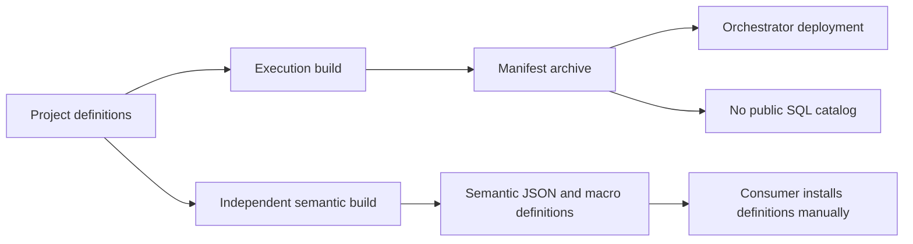
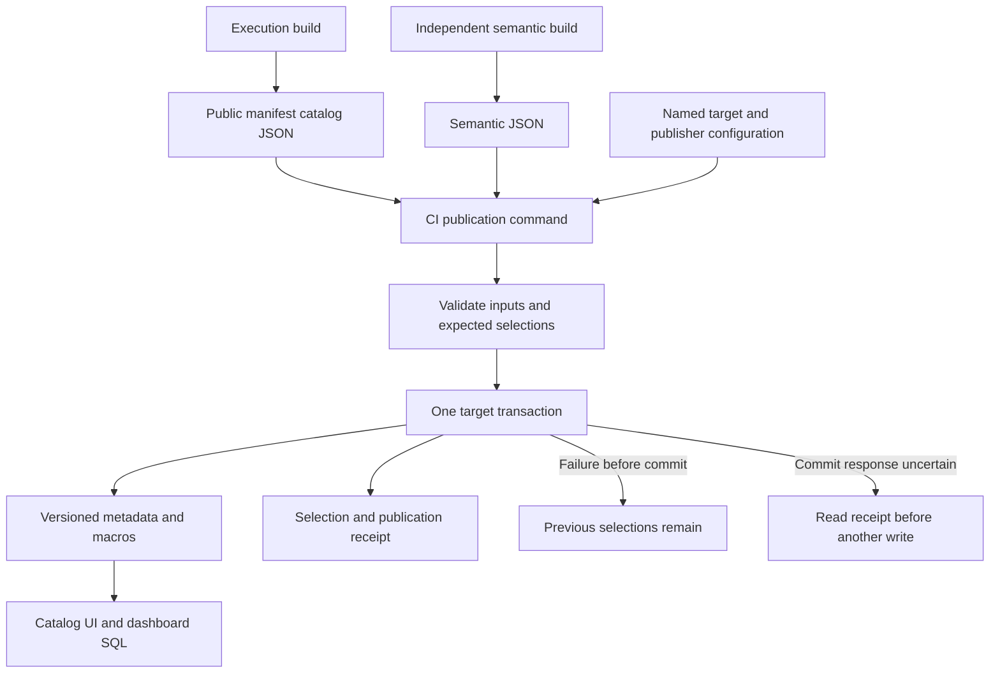

# Change Record: Publish the manifest catalog and semantic model from CI

| Field | Value |
| --- | --- |
| Status | Implemented; independently reviewed |
| Type | Feature |
| Primary issue | [#720](https://github.com/eirhop/favn/issues/720) |
| Pull request | [#724](https://github.com/eirhop/favn/pull/724) |
| Related work | [#723](https://github.com/eirhop/favn/pull/723), [#721](https://github.com/eirhop/favn/issues/721), [#719](https://github.com/eirhop/favn/issues/719) |
| Affected areas | Public CLI, Authoring build output, Core catalog contracts, SQL runtime, DuckDB ADBC plugin, consumer documentation |
| Approved plan commit | [`2320d9db788cdc88997066714fe006099c6e7f30`](https://github.com/eirhop/favn/commit/2320d9db788cdc88997066714fe006099c6e7f30) |
| Source baseline | `ce2729e7` on `origin/main` |
| Last updated | 2026-09-17 |

## One-minute summary

Publish the complete public description of a Favn project and its independent
semantic model as SQL metadata tables. Consumers can build their own catalog UI
and use the published metric macros in dashboards through the same database
connection. One short-lived command in an existing CI environment publishes
either artifact or both to a named target, without starting an orchestrator or
runner. This record plans the new public SQL/deployment contract and its atomic
publication behavior; it does not authorize implementation in this planning task.

## Impact

A developer changes net revenue from `SUM(gross_value)` to
`SUM(gross_value - discount_value)`, with both columns already present in the
served sales contract. CI builds semantic artifact `sm_B`, publishes its metadata
and macros, and selects it instead of `sm_A`. The selected manifest catalog
`mv_A` and running execution deployment remain unchanged. A dashboard explicitly
pinned to `sm_A` continues using the retained definition.

A separate manifest-catalog publication exposes assets, columns, lineage,
pipelines, schedules, and declared policies for a consumer-owned UI. A daily
schedule describes intended behavior; last successful execution and actual
freshness are observations supplied by later runtime projection work.

## Problem analysis

The execution build has a compact manifest and content-addressed SQL execution
packages. PR #723 builds an independent semantic artifact and can inspect it or
produce native macro SQL. Neither build publishes a SQL catalog for consumers.
The missing capability is deterministic artifact publication, not another
execution service or an analytical query compiler.

### Assumptions and agreed scope

- The user approved the simplified design after the current issue body was
  written. This record is the proposed implementation baseline for that narrower
  scope; the issue remains the broader feature inventory.
- Both the complete public manifest catalog and semantic catalog are in scope.
  Pipelines and schedules are included; catalog publication never activates them.
- CI already has a precompiled Favn project, its SQL plugin, native driver, and
  required extensions. It can reach the existing target database. A private CI
  agent or short-lived deployment job can supply network access if necessary.
- Inputs come from the deployment's trusted CI/build artifacts. Hash and schema
  checks establish integrity and supported structure, not authorship or safe
  execution of arbitrary uploaded SQL. Publication executes canonical macro
  expressions and is not an endpoint for untrusted artifact submissions; no new
  signing infrastructure is introduced by this plan.
- Connection and catalog provisioning remain deployment prerequisites. The
  publisher creates its own metadata and macro schemas/objects.
- The first implementation supports qualified native DuckDB and DuckLake through
  the existing DuckDB ADBC plugin. Remote transports need their own qualification
  and must not inherit support merely because they speak SQL.
- Selected versions mean published definitions. Served compatibility is
  `unknown` in this slice. No result or UI may relabel that as runtime activation,
  freshness, successful data publication, or verified semantic readiness.
- Customer catalog readers use an appropriate read-only data connection. The
  publisher does not implement consumer authorization or a query service.

### Evidence

| Evidence | What it proves | What it does not prove |
| --- | --- | --- |
| [Manifest build](../../../apps/favn_authoring/lib/favn_authoring/deployment/manifest_builder.ex), [archive writer](../../../apps/favn_authoring/lib/favn_authoring/deployment/manifest_archive.ex) | Existing build owns the exact manifest/package set and can emit a public catalog artifact beside it. | There is no existing catalog export or standalone archive importer. |
| [Manifest](../../../apps/favn_core/lib/favn/manifest.ex), [asset](../../../apps/favn_core/lib/favn/manifest/asset.ex), [pipeline](../../../apps/favn_core/lib/favn/manifest/pipeline.ex), [schedule](../../../apps/favn_core/lib/favn/manifest/schedule.ex) | Compiled definitions include platform structure and declared operational policies. | Those declarations do not describe live execution. |
| [Semantic artifact](../../../apps/favn_core/lib/favn/semantic/artifact.ex), [snapshot](../../../apps/favn_core/lib/favn/semantic/snapshot.ex), [catalog](../../../apps/favn_core/lib/favn/semantic/catalog.ex) | Immutable source-free semantics, ordered inputs, macro generation, and explicit unknown compatibility exist. | The semantic snapshot is not a full manifest catalog; it omits pipelines and schedules. |
| [Connection loader](../../../apps/favn_sql_runtime/lib/favn/connection/loader.ex), [SQL client](../../../apps/favn_sql_runtime/lib/favn/sql/client.ex), [SQL application](../../../apps/favn_sql_runtime/lib/favn_sql_runtime/application.ex) | SQL sessions can run without the runner application. | Current loader/client paths do not guarantee that unrelated configured connections are never loaded or resolved. |
| [HTTP archive reader](../../../apps/favn_orchestrator/lib/favn_orchestrator/api/manifest_deployment_archive.ex) | Existing transport validation is integrated with orchestrator admission. | Calling it from the publisher would preserve the wrong ownership/deployment dependency. |
| [DuckLake macros](https://ducklake.select/docs/stable/duckdb/advanced_features/macros), [transactions](https://ducklake.select/docs/stable/duckdb/advanced_features/transactions) | The documented backend supports persistent macros and transactional DDL. | Every installed version or remote transport supports this complete publication contract. |

Earlier investigation in this task used temporary synthetic databases on DuckDB
`2.0.0-alpha41771`, with installed DuckLake extension `eb7b95df82`. Both native
DuckDB and DuckLake passed fresh read-only macro consumption, ratio-of-sums,
rollback of metadata/macros/pointer after a failing statement, retained-version
reads, and read-only mutation rejection. These were disposable exploratory
checks, not committed regression tests or Favn publisher/Quack qualification.

## Current behavior

Build outputs stop before consumer SQL publication. Execution archive deployment
is a separate existing operation and must remain so.



## Approved plan

The independent reviewer accepted this plan on 2026-09-17. Use one artifact
publisher and two independently selected definition versions.



### Build inputs and public coverage

The existing execution build additionally emits
`.favn/dist/catalog/mc_<full public content digest>/catalog.json` in a separate
immutable output directory. Generate it from the exact validated manifest and
execution packages before discarding build context. Do not put it inside the
manifest bundle or its archive: their existing exact file inventory and repeated
build verification must remain unchanged. This refines the earlier illustrative
`--manifest manifest.tar.gz` example: a ready-built public artifact avoids adding
another archive parser or extracting the orchestrator's HTTP importer.

The public artifact has a closed JSON schema, manifest version/content hash,
its own canonical `mc_` content identity, and the public definition graph. It carries
public contracts projected from the execution packages, not package SQL or
executable templates. Reads reject unknown versions, malformed references,
duplicate IDs, invalid identities, and oversized content before opening a target
session. Use existing canonical encoding and content-addressed artifact writing
patterns. Build timestamps and target credentials do not affect content identity.
If catalog export fails, the build command reports that failure without deleting
an already valid execution bundle; repeating the build verifies/reuses the bundle
and completes the export. Identical export content is idempotent. The semantic
input remains the existing `semantic.json`; do not change its
meaning or require an execution archive for semantic-only publication.

Publish these concepts when declared, without inventing missing metadata:

| Public surface | Contents and identity |
| --- | --- |
| Manifest release | Exact source manifest identity and immutable public document; distinct from active runtime deployment. |
| Assets and namespaces | Stable refs, types, descriptions, tags, logical relations, namespace hierarchy derived from declared refs. |
| Columns and contracts | Ordered columns, types, nullability, descriptions, grain, keys, declared checks, relationships and contract fingerprints. |
| Dependencies and lineage | Asset edges, declared column lineage, and declared external-source references. |
| Pipelines and schedules | Selectors, dependency policy, named/inline schedule links, cron/timezone and declared policies. Only publish membership when statically resolved; never invent runtime plans. |
| Declared operational details | Materialization, partitioning, window, coverage, freshness, retry/concurrency policies, non-secret runtime requirement names and release provenance. |
| Semantics | Models, dimensions, relationship keys, hierarchies, time rules, metrics, exact ordered inputs, dependencies, units, formatting, and canonical macro SQL. |

Store the complete public document once per artifact version. Provide relational
projections for assets, columns, contracts, edges, pipelines, schedules, models,
metrics and ordered inputs. Less frequently queried policy detail may be JSON
with a documented shape. This is one generated consumer model, not independently
maintained definitions. Publish descriptions already present in the inputs;
arbitrary full source files, compiled code, resolved secrets, private source
locations, and executable package contents are excluded.

Every projection carries its immutable context (`manifest` or `semantic`, plus
artifact version). All joins include that context. Semantic source/contract rows
come from its embedded snapshot, never from the currently selected manifest.
The snapshot identity is retained; shared immutable documents can be stored once
by hash, while relational projections remain rebuildable read models.

Initial scope is the whole public artifact. Permission-aware filtering, selective
catalog exports, and automatically inferring equivalence of serving copies are
follow-ups. A relation identifier describes an authored source; it is not an
assertion that the publisher's connection exposes that source. Consumers can map
an explicit query alias/relation, but that mapping establishes no compatibility
claim. Clearly distinguish declared references from physically verified objects.

### Named target and isolated configuration

The agreed target selects one already available connection and catalog:

```elixir
config :favn, :catalog_targets,
  analytics: [
    connection: :warehouse,
    catalog: "mart",
    schema: "meta"
  ]
```

Use the same logical target name in Test and Production, with environment-specific
connection values. Neither destination credentials nor the selected target
becomes part of the immutable build artifact. A target's physical
catalog/schema is its metadata ownership boundary; reject conflicting named
configurations claiming the same boundary in one invocation.

A dedicated `config/catalog_publish.exs` is the default publisher configuration.
It declares `catalog_targets`, explicit `connection_modules`, and only the
required entries in `config :favn, :connections`, using the existing connection
configuration contract. `--config` can select another trusted publisher config.
It must not import the application's general `runtime.exs`. This file is trusted
deployment code, just like ordinary Elixir configuration; it is not an artifact
or a sandbox for arbitrary user code.

The task uses precompiled dependencies in an isolated CI checkout/build output.
It does not run `app.start`, `app.config`, compile tasks, customer discovery, or
customer application startup. Mix itself loads project build configuration before
a task runs, so this guarantee requires a precompiled project whose build config
is suitable for CI; publication cannot undo arbitrary side effects in that file.
A fresh-process acceptance fixture must prove the documented invocation.

Normalize target names from CLI strings against configured names without creating
atoms. Resolve only the selected connection definition and runtime values; narrow
existing resolution as needed and use an invocation-owned registry passed to the
SQL client. Do not mutate or reuse the runner's registry. Start only SQL runtime
and the selected plugin's required libraries, with bounded shutdown in `after`.
Native startup resources must also be scoped to the chosen catalog. Missing an
unrelated connection's credentials must not affect publication.

### Public command and selection

The following commands are planned APIs, not available behavior:

```sh
mix favn.catalog.publish \
  --manifest .favn/dist/catalog/mc_EXAMPLE/catalog.json \
  --target analytics --expect-manifest mv_PREVIOUS:7

mix favn.catalog.publish \
  --semantics dist/semantics/sm_EXAMPLE/semantic.json \
  --target analytics --expect-semantics sm_PREVIOUS:12
```

One invocation may supply both artifacts and both expectations. Each expectation
contains the version and monotonic selection revision; `none:0` means an explicit
empty previous selection. Expectation flags apply only to the changed
catalog. A manifest-only operation never changes the semantic selection, and
vice versa. Selection updates and receipts are committed with all new content.
Republishing a retained artifact with a fresh expected-current value performs an
explicit rollback; it does not imply rollback of underlying data.

Expected prior versions are required when changing a selection. This adds a
small safeguard to the earlier input/target-only examples. CI captures them for
the intended deployment before competing publications, or supplies them from the
reviewed deployment input; it must not silently reread a new expectation after
conflict. Content hashes have no chronological ordering. The command cannot
infer which commit or formula the user considers newer. A command that merely
reads whatever is current when it eventually starts cannot protect against an
older CI job finishing late.

There is no separate automatic activation state machine. `selected` means the
published definition selected for discovery. Compatibility remains `unknown`,
including when a physical relation has matching column names. Dashboards can pin
a semantic version, or capture the selected version once at request start.
Macro SQL does not enforce caller grouping, relationship correctness, time
selection, authorization, or data freshness. Automatic readiness gating, served
contract receipts, and ongoing schema-change coordination belong with #721.
This explicitly narrows the earlier issue's runtime-readiness acceptance items.

### SQL objects and macro placement

The target owns `meta` (or the configured schema), immutable release documents
and projections, independent manifest/semantic selection rows, and operation
receipts. Projection keys include context and version; version hashes remain
full length. Catalog schema version is separate from either artifact's version.

Install macros under `metrics_<full semantic digest>` in the selected catalog.
Current macro generation uses two-part schema/name identifiers; introduce
structured catalog-aware rendering so the publisher never accidentally writes
to the connection's default database. Quote all catalog/schema/object identifiers
and bind metadata values. Preserve canonical expression text and ordered inputs.
The metadata gives both the authored source relation and installed macro catalog,
schema, and name. Publish definitions even where a consumer chooses local macro
installation; this first publisher requires persistent-macro capability when a
semantic artifact is supplied and rejects unsupported destinations explicitly.

An adapter must not assume primary-key or unique-constraint enforcement in
DuckLake. Bootstrap the two selection rows (manifest and semantic, revision zero)
using one transactional named-table creation populated at creation, not an
unprotected check-then-insert. Subsequent publications verify exactly one row per
kind and conditionally update the affected rows using version plus revision,
in a fixed order when both are supplied. Receipts and content writes occur only
inside that guarded transaction. Exactly one concurrent bootstrap may commit;
backend DDL conflicts or automatic conflict retries must preserve these
invariants under native tests before the capability can be enabled. Unexpected
duplicate state/receipt rows are integrity failures, not repair opportunities.

Macro namespaces can be shared by identical semantic artifacts across metadata
schemas in the same catalog. Existing definitions must match the expected
artifact/compiler identity; do not overwrite a same-named different definition.
This slice retains all published versions and does not delete shared macros.

### Contracts and invariants

- Artifact decoding and projection are pure, bounded, and independent of customer
  assets, runtime manifests in PostgreSQL, or running BEAM nodes.
- Public facade/CLI lives in `favn`; pure catalog artifact/projection DTOs live in
  Core; session/publication mechanics live in SQL runtime; dialect specifics live
  in the DuckDB ADBC plugin. No new umbrella application or service is needed.
- Use one owner-exclusive fresh session, explicit catalog/resource admission,
  finite operation deadline, and one catalog transaction. Runner-local admission
  is not a distributed writer lock. A server-owned native database is accessed
  through its supported connection, never concurrently opened as a second writer.
- Qualified publication capability explicitly covers metadata DDL, persistent
  macro DDL, atomic conditional selection, and marker reconciliation. A generic
  `transactions: :supported` flag alone is insufficient.
- Write immutable new rows/macros while retained versions remain readable. A
  transaction validates expectations, installs the complete content, conditionally
  advances affected selections, records the receipt, and commits.
- Conditional changes must report exactly one selected row for each changed
  catalog (or one successful initial insertion). Concurrent initial bootstrap and
  update conflicts fail explicitly; no blind overwrite or automatic rebasing.
- The durable operation identity binds target scope, artifact identities and
  selection expectations. Exact completed replay returns its receipt without
  rewriting rows or switching a selection that has since advanced.
- An ambiguous commit is an unknown outcome. Read its receipt on a fresh session
  before permitting another write; missing/inaccessible evidence is not success
  and is not permission to retry while the old operation may still be running.
- Metadata publication touches only publisher-owned objects; it does not read
  business rows, perform materialization, or claim runtime/data deployment.

### Scope and non-goals

Included: full public manifest export, existing semantic-artifact consumption,
named targets, one Mix task, isolated target connection setup, SQL projections,
native macros, version selection, receipts, replay/reconciliation, and explicit
rollback by selecting retained definitions.

Excluded: orchestrator APIs/tasks/store migrations, runner application changes,
View changes, server provisioning, a dedicated publisher image/release command,
automatic sync on manifest activation, CI path-based change detection, general
nontransactional backends, background retention, runtime receipts/compatibility
tracking (#721), serving-copy certification, scoped metadata authorization, MCP
(#719), query generation, dashboard frontend, and end-user access enforcement.

### Implementation slices

| Slice | Outcome | Owner or area | Depends on |
| --- | --- | --- | --- |
| 1 | Closed public manifest catalog export; source-free validation and common relational projection for both inputs | Core and Authoring | Existing #723 artifacts |
| 2 | Named targets and isolated precompiled Mix command with bounded result contract | `favn` and SQL connection loading | 1 |
| 3 | One-target transactional metadata/macro installation, conditional selection and receipts | SQL runtime and DuckDB ADBC | 1, 2 |
| 4 | Replay/unknown-outcome handling, independent version rollback, consumer examples and native qualification | Owning layers and test support | 3 |

### Complexity budget

Ranges count additions/deletions against the approved source baseline. Exclude
this record, generated files, dependency locks, vendored code, and formatter-only
changes. Supporting lines include tests, fixtures, examples and canonical docs.

| Slice | Production added | Production deleted | Supporting added | Supporting deleted | Main reason for the size |
| --- | ---: | ---: | ---: | ---: | --- |
| 1 | 350-550 | 0-30 | 300-450 | 0-20 | Complete public projection, closed input validation, exact immutable context |
| 2 | 180-300 | 10-40 | 180-300 | 0-20 | Scoped configuration/connection loading and fresh-process command proof |
| 3 | 300-500 | 0-20 | 300-450 | 0-20 | Explicit schema, ordered bulk writes, atomic selection, macro qualification |
| 4 | 120-220 | 0-20 | 350-550 | 0-30 | Ambiguous outcomes, retained-version behavior, documentation and native evidence |
| Total | 950-1,570 | 10-110 | 1,130-1,750 | 0-90 | One publisher, without archive parser or lifecycle service |

Explain any category exceeding its upper estimate by more than 25 percent or
100 lines, whichever is smaller, and materially fewer deletions. Preserve these
estimates after approval; record actuals and justified changes separately.

### Implementation map

| Concept | Expected code area | Responsibility |
| --- | --- | --- |
| Public artifact and projection | `apps/favn_core/lib/favn/catalog/` | Closed data, stable identity, versioned relational rows; no connection ownership |
| Manifest export | Existing `FavnAuthoring.Deployment.ManifestBuilder` | Emit catalog JSON from the exact build into separate immutable catalog output; preserve bundle/archive inventory |
| Public command | `apps/favn/lib/mix/tasks/favn.catalog.publish.ex` and public `Favn.Catalog` facade | Parse command/config, return documented bounded result, public types/docs |
| Publication runtime | `apps/favn_sql_runtime/lib/favn/sql/catalog/` | Own scoped session, operation, deadline, selection and receipt/reconciliation contract |
| Connection selection | Existing `Favn.Connection.Loader` / registry boundary | Resolve explicitly requested definitions without unrelated initialization |
| Backend implementation | `apps/favn_duckdb_adbc/lib/` | Qualified publication capability, dialect/schema rendering and backend-specific failure classification |
| Canonical documentation | New `apps/favn/guides/sql-catalog-publication.md`, configuration/semantic guides, `Favn.AI`, relevant structure docs, Features/Roadmap | Implemented public workflow and explicit proof boundaries |

Exact module names may follow existing owning conventions; extracting unrelated
helpers or introducing an application is a plan deviation, not routine cleanup.

## Operational design

### Failures and recovery

The command has a five-minute overall default deadline (positive override capped
at fifteen minutes), including input validation, connection, publication and
reconciliation. Keep native SQL operation budgets within that remaining deadline.
Use existing archive-derived limits for the public manifest projection (64 MiB
maximum artifact, 10,000 assets/packages); semantic artifacts retain their existing
16 MiB bound. Store each full document individually under its artifact byte limit.
Bound relational projection batches to both 500 rows and 1 MiB of encoded values;
reject a single oversized projection row with a stable diagnostic. Full-document
rows are explicitly exempt from the smaller projection-row limit.

| Condition | Result and recovery |
| --- | --- |
| Invalid artifact/config/unsupported target | Fail before publication writes with bounded reason and unchanged selections. |
| SQL failure with proven rollback | Fail with previous versions intact; a later explicit invocation may retry the same request. |
| Selection expectation or concurrent bootstrap conflict | Report conflict and observed versions; CI does not silently adopt newer expectations. |
| Existing immutable identity has different content | Integrity failure; never overwrite it. |
| Commit response or process outcome uncertain | Report `publication_outcome_unknown` unless a fresh read finds the matching committed receipt. Preserve operation identity for reconciliation. |
| Exact completed replay | Return the original receipt; do not regress any subsequently changed selection. |
| Old version requested deliberately | Publish/select using current explicit expectation and retain other catalog selection. Compatibility remains unknown. |

The CLI returns one small JSON result with outcome, target alias, artifact IDs,
selection versions, operation identity, schema version, compatibility `unknown`,
and bounded diagnostics; exit zero only for proven committed/completed replay.
Expose an explicit read-only reconciliation mode using the same operation identity
and inputs, so operators can inspect an interrupted publication without resubmitting
writes. Do not introduce an automatic write retry loop. Reconciliation reads are
bounded and use a fresh connection; native cancellation uncertainty is preserved.

### Logs and diagnostics

| Event or state | Level or surface | Safe fields | Rate limit |
| --- | --- | --- | --- |
| Prepared/committed/replayed publication | CLI result and structured info | Logical target, full artifact/operation IDs, schema version, row counts, duration | Once per phase |
| Input/selection/integrity failure | Error result | Finite reason code, bounded public object refs and expected/observed versions | Once per failed invocation |
| Ambiguous outcome | Error result | Operation identity, bounded category, reconciliation result | Once after bounded reconciliation |

No full documents, formulas, arbitrary exception terms, credentials, resolved
connection options, or private endpoint/file paths enter diagnostics. Logs are
not authoritative commit evidence; the target receipt is.

### Deployment, migration, and compatibility

The first successful publication transaction creates the selected metadata
schema and version-one tables. An existing schema must be empty of conflicting
publisher objects or contain a recognized publisher schema marker. Reject unknown
schema versions or unexpected objects at reserved names before altering them.
Initial-bootstrap concurrency must be qualified on each supported backend.
Future incompatible catalog-schema changes need their own migration plan.

CI builds the execution catalog export only when that workflow is requested, or
publishes an already-built export. Semantic-only CI uses the dedicated build path
required by #723 and does not rebuild execution artifacts. The same artifacts can
be promoted to Test and Production with different named-target connection values.
An earlier formula can be selected without deleting newer immutable definitions.
No background cleanup is added: initial releases are retained, their size/count
is reported, and bounded cleanup with explicit reference protection is follow-up
work. Storage growth is a stated operational cost of this smaller scope.

Two metadata schemas in one database share versioned macro names for identical
semantic artifacts. Their selections and receipts remain schema-local. Retention
must not be added later without tracking cross-schema references. Multi-target
atomicity and certified serving-copy relation bindings are not promised.

## Verification plan

| Acceptance criterion | Planned evidence | Owning layer |
| --- | --- | --- |
| Full consumer catalog from immutable build output | Fixture includes SQL/Elixir/source assets, contracts, external lineage, pipelines, inline/named schedules, policies; projection works after authoring modules are unavailable | Core/Authoring |
| Existing execution build remains valid | Fresh and repeated builds preserve bundle/archive inventory and verification; export failure leaves existing valid execution output reusable; identical catalog export reuses immutable bytes | Authoring |
| Closed, bounded artifact validation | Corrupt hashes/versions, missing/dangling refs, duplicate IDs, malformed policies, size/row limits; no atom creation from input | Core |
| Explicit artifact trust boundary | Docs and tests distinguish corrupt/unsupported records from authenticated provenance; a valid hash is never presented as SQL sandboxing or author approval | Public contract/docs |
| Independent publications and complete semantic context | Publish either first; update either; joins still resolve the original snapshot; no implicit rebuild or other-selection update | Core/SQL runtime |
| Named target controls placement | Non-default catalog, custom/quoted schema, same logical target across environment configs, identical semantic artifact in two catalogs | SQL runtime/native plugin |
| No runtime boot or unrelated connections | Fresh OS process with precompiled task, inaccessible orchestrator/PostgreSQL, application-start tripwires and unrelated missing secrets/side-effecting connection module; only chosen connection invoked | Public CLI/connection tests |
| Consumer UI and metric query | SQL lists assets/pipelines/schedules and metric inputs; new read-only connection calls installed ratio-of-sums macro yielding 42 from net values 90/120 and units 3/2 | Native plugin/example |
| Atomic first install and updates | Inject failure after metadata, after macro creation, after conditional selection, before commit; no selected partial version | Native plugin |
| Concurrent and late CI operations | Competing connections, simultaneous initial bootstrap, same previous expectation, independent manifest/semantic updates; losing operation fails without overwriting winner | Native plugin |
| Replay and recovery | Lost commit acknowledgement, process interruption before/after commit, unavailable receipt, completed replay after another selection; no blind write retry | SQL runtime/native plugin |
| Retained versions and explicit rollback | Old request context/macros remain readable; rollback changes only requested selection; same-hash different-content corruption rejected | SQL runtime/native plugin |
| Honest runtime boundary | Compatibility remains unknown; definitions/policies never become active-deployment/freshness claims; unsupported transport fails | Public contract/tests/docs |

Run owning-layer checks first using `mise exec -- mix ...` and umbrella app-scoped
`cmd mix test`, as required by the contributor rules. Implementation qualification
includes format, warnings-as-errors compilation, relevant fast/native tests,
fresh-process acceptance, test-tier guard, and ordinary final-head CI. Broaden
checks only for owning failures or changed boundaries. This planning-only change
requires link checks, Markdown/Mermaid rendering, and `git diff --check`.

## Risks and open questions

| Risk or question | Impact | Mitigation or decision |
| --- | --- | --- |
| Current issue lists broader work than the accepted simplified scope | An implementer could reintroduce runner mode, readiness coordination or automated retention | This record explicitly narrows those items; keep the issue/draft PR honest about remaining follow-ups. |
| Arbitrary Mix/project config can have side effects | A no-runtime claim could be false before the task starts | Precompiled isolated checkout plus dedicated publisher config and fresh-process boundary tests; do not claim arbitrary code is sandboxed. |
| Backend/transport atomicity differs | Partial selection or unsafe replay | Explicit capability and native concurrency/failure evidence; unsupported until qualified. |
| Catalog availability is mistaken for served compatibility | Dashboard may query a definition before compatible data exists | Explicit unknown readiness, version context and consumer obligations; #721 owns actual evidence. |
| Large metadata or long history | Memory/transaction pressure and storage growth | Explicit input/batch/deadline bounds and reported retained sizes; background pruning is deferred. |
| Whole public artifact exposes upstream model names | Consumers learn more metadata than their application needs | Document full-artifact exposure and target access prerequisites; selective export needs a separate reviewed scope. |
| Versions can cycle during deliberate rollback | Version-only comparison can miss an intervening selection change | CLI expectations, conditional updates and receipts include monotonic revision as well as version. |

## Plan review

| Field | Result |
| --- | --- |
| Reviewer | Independent agent `review_catalog_plan` |
| Reviewed against | Issue #720, current primary source, user-approved simplified scope, and this record |
| Findings | Two blocking findings: catalog export must stay outside the exact execution-bundle inventory; artifacts must explicitly come from trusted builds. Feasibility review also checked scoped boot, expectation revisions, catalog-qualified macros and DuckLake uniqueness limits. |
| Findings addressed and rechecked | Both corrections were applied, independently reread and accepted on 2026-09-17. Fresh/repeated build verification and the trust boundary are explicit. |
| Verdict | Approved for the planning baseline; no blocking findings remain. Implementation behavior still requires the planned tests. |

---

## Implementation outcome

The public manifest export, source-free projections, dedicated CI command,
transactional native publisher, version selections and receipt reconciliation are
implemented. The execution build prints the separate `catalog.json` path; its
archive inventory remains unchanged. `Favn.Catalog` resolves one explicitly named
connection provider and passes an invocation-owned registry to SQL runtime.
The DuckDB adapter opts into the separate publication backend contract.

Consumers can query public asset/contract/pipeline/schedule tables and semantic
models/metrics/ordered inputs, with explicit installed macro coordinates.
Definitions and receipts remain independent of runtime deployment and report
served compatibility as unknown. No runner, orchestrator, storage or View lifecycle
was added. Canonical usage is documented in the new SQL catalog publication guide.

### Complexity accounting

The current implementation diff, excluding this record, groups files by their
owning slice. Native qualification tests are counted in slice 4 because they
exercise installation and recovery together; shared build fixtures count in 1.
The independent reviewer reconciled these counts after the final corrections.

| Slice | Production added | Production deleted | Supporting added | Supporting deleted |
| --- | ---: | ---: | ---: | ---: |
| 1 | 699 | 2 | 451 | 0 |
| 2 | 456 | 5 | 207 | 0 |
| 3 | 544 | 1 | 0 | 0 |
| 4 | 130 | 0 | 869 | 13 |
| Total | 1,829 | 8 | 1,527 | 13 |

Slice 1 exceeds its 550-line upper estimate and 650-line review threshold.
The complete manifest envelope and relational projection require 422 lines;
typed, closed policy validation adds a 242-line schema. Validation reuses the
existing domain constructors and verifies exact canonical round trips, rather
than maintaining a second set of policy semantics. Non-secret runtime declarations
and ISO date/time projection complete the approved public coverage.

Slice 2 exceeds its 300-line upper estimate and 375-line review threshold.
The 130-line request contract owns expectation parsing and deterministic operation
identity. A 60-line invocation owner survives deadline termination and cleans up
only the applications it started, including late startup. A same-BEAM admission
lock prevents two invocations from stopping each other's dependencies. This is a
short-lived command resource owner, not a new running platform service.

Slice 3 remains within its review threshold. Slice 4 supporting lines exceed the
550-line estimate and 650-line threshold because all 586 native qualification
lines are counted there, including installation cases budgeted partly in slice 3.
The combined slice-3/4 support is 869 lines against a combined 1,000-line upper
estimate. Total supporting lines stay within the approved budget.

Total production additions exceed the 1,570-line upper estimate by 259 lines.
The closed schema and explicit lifecycle/recovery contracts above explain the
variance; they preserve the planned behavior and introduce no product scope.
Fewer deletions are intentional: there was no old publisher to retire. Existing
runner connection-loading behavior remains intact; the new entry point resolves
one provider explicitly. The independent reviewer accepted these variances after rechecking the corrections.

## Deviations from the approved plan

| Planned | Implemented | Reason | Reviewer verdict |
| --- | --- | --- | --- |
| Explicit connection modules, resolved without unrelated initialization | Dedicated publisher config uses a name-to-module mapping; ordinary runtime module-list/discovery behavior is unchanged | Finding a name in a module list requires invoking unrelated providers; explicit association avoids those side effects | Accepted in initial Astra xhigh implementation review |
| Bootstrap selection rows through one named table creation | Transaction creates the named selection table, then inserts its two initial rows before commit | Native DuckDB and DuckLake concurrency tests establish exactly one bootstrap winner; no uniqueness constraint or check-then-insert race is relied upon | Accepted in initial Astra xhigh implementation review |
| Exploratory native checks used DuckDB 2.0 alpha | Committed qualification uses the existing CI-supported DuckDB 1.5.5 and checksum-pinned DuckLake `d8a1881e` | Qualifies the feature against Favn's supported CI runtime; no platform version promotion is needed | Accepted in initial Astra xhigh implementation review |

The approved planning commit remains unchanged. Budget variance above and these
implementation choices were accepted by the requested independent reviewer.

## Decision log

| Date | Decision | Reason | Review needed |
| --- | --- | --- | --- |
| 2026-09-17 | Emit ready-built public catalog JSON instead of parsing the runtime deployment archive in the publisher | Reuses the build's verified package set and avoids coupling to HTTP import/admission | Included in initial plan review |
| 2026-09-17 | Keep runtime readiness, runner-image wrapping and background retention outside this first slice | Matches the user's accepted simpler CI design | Included in initial plan review |
| 2026-09-17 | Require expected selection identity for publication | Content hashes cannot order competing CI deployments | Included in initial plan review |

## Verification evidence

Results below distinguish completed local checks from remote CI and live
qualification. The PR checks page records CI against the exact pushed head.

| Check | Result | Evidence boundary |
| --- | --- | --- |
| Source/issue inspection | Completed against `ce2729e7` and issue #720 | Establishes current capabilities and missing publication work; no implementation proof |
| Earlier synthetic native exploration | Passed the bounded cases described above | Disposable native databases only; not the new publisher or a remote deployment |
| Record links and whitespace | All 13 relative source links resolve; staged diff check passed | Documentation qualification only |
| GitHub Markdown/Mermaid rendering | Both diagrams render as flowchart SVGs in the initial pushed baseline after draft creation; no diagram corrections | Verified rendered labels and 8 current/13 proposed nodes; no implementation proof |
| Independent plan review | Approved after corrections and recheck, 2026-09-17; reviewer confirmed PR-number metadata preserves the plan | Plan review only; no implementation acceptance |
| Core fast suite | 523 passed (including 6 catalog tests) | Closed artifacts, typed policies, full public graph, corruption and row bounds |
| Authoring fast suite and export regressions | 158 passed; separate export checks 2 passed | Existing archive remains valid and repeated builds reuse output |
| SQL runtime, public and local fast suites | 126 / 192 / 42 passed | Existing owning-app behavior; optional tiers excluded |
| Fresh-process public command acceptance | 3 passed, including full-manifest input and timeout cleanup | Dedicated config, no customer/runtime boot, selected provider only; restored application set after deadline |
| Native catalog and semantic qualification | 15 passed (13 catalog, 2 existing semantic integration tests) | DuckDB 1.5.5 and DuckLake d8a1881e; real CI command, two catalogs, quoted schemas, read-only macros returning 42, concurrency, rollback and recovery |
| Format, compilation, lint and security | Passed warnings-as-errors compilation, explicit formatting of changed Elixir files, root format check, Credo warning checks, Sobelow and test-tier guard | Static qualification, not a live deployment |
| Dialyzer | Passed; 3 existing exclusions, no new exclusions | Existing repository analysis configuration |
| Updated documentation links and whitespace | 36 relative links resolve; diff check passed | Static Markdown qualification |

### Not verified

No live customer database or production infrastructure has been changed.
Remote Quack publication, sustained load, end-user authorization and end-to-end
dashboard integration are outside this native publication qualification.
A missing receipt after process interruption does not prove native work has
stopped; recovery remains read-only until the previous outcome is established.

## Final review

Independent Astra review at xhigh reasoning effort approved the implementation
on 2026-09-17 against baseline `2320d9db`. Its four initial findings were corrected
and independently rechecked: timeout application cleanup, native conflict
classification, typed policy validation, and non-secret runtime requirements.

The reviewer independently passed 6 artifact tests, 3 public command tests and
13 native publication tests, then reran the two catalog-isolation cases after
the last edits. No actionable findings remain. The approved plan is unchanged;
all deviations and the 1,829 production / 1,527 supporting additions were accepted.
The reviewer found no simpler design preserving the lifecycle and validation
guarantees. Implementation review is complete; remote CI must also qualify the
exact pushed PR head before readiness for merge.
