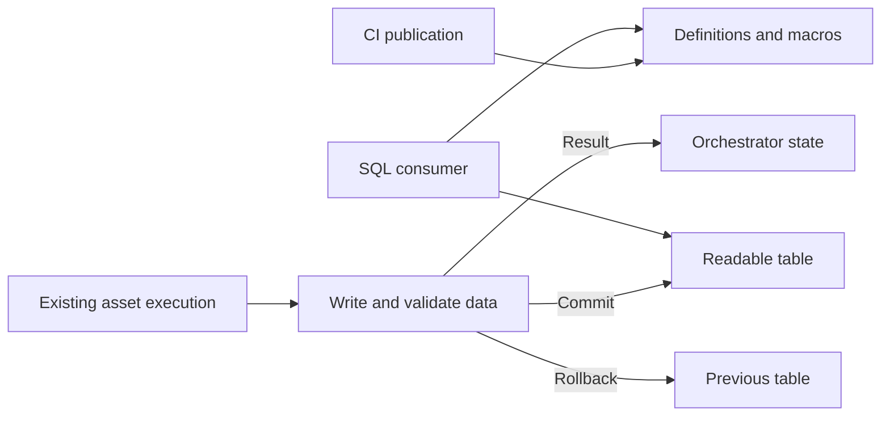
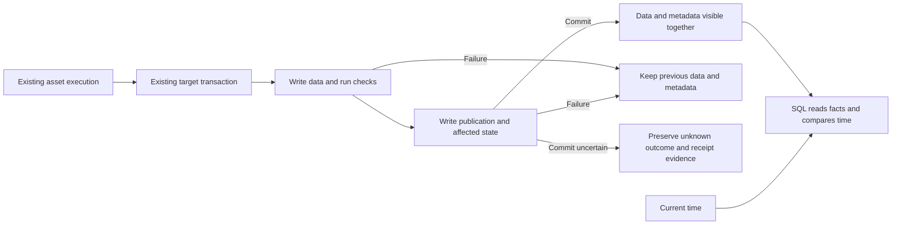
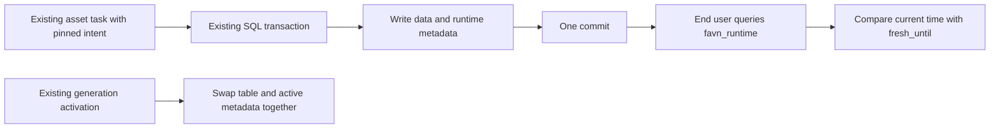

# Change Record: Publish runtime metadata with each SQL asset

Reader: contributors reviewing and implementing the first runtime SQL catalog.
Documentation type: implementation plan and review evidence.

| Field | Value |
| --- | --- |
| Status | Implemented; approved by independent review |
| Type | Feature |
| Primary issue | [#721](https://github.com/eirhop/favn/issues/721) |
| Pull request | [#727](https://github.com/eirhop/favn/pull/727) |
| Related work | [#723](https://github.com/eirhop/favn/pull/723), [#724](https://github.com/eirhop/favn/pull/724), [#720](https://github.com/eirhop/favn/issues/720) |
| Affected areas | Core contracts, Authoring manifest generation, Orchestrator runner-work construction, PostgreSQL activation/write-start guards, Runner SQL execution, SQL runtime, DuckDB adapter, public catalog guide |
| Approved plan commit | `f7aa6ac985953257819593b471a112ae53bc0f9c` |
| Last updated | 2026-09-17 |

## One-minute summary

SQL consumers can discover Favn's definitions and metric macros, but cannot yet
read evidence about the data that was actually published. Every supported SQL
table will automatically write publication metadata in the same transaction as
its data, using the connection and execution already doing that work. Consumers will
compare a stored `fresh_until` deadline with the current time and inspect exact
successful windows; no scheduled freshness updater, summary run, or background
exporter is introduced. Favn uses the reserved `favn_runtime` schema in the
asset's existing catalog; no asset list or runtime configuration is required.
This is a bounded extension to materialization, with cross-app work needed to preserve pinned identity, rollback and recovery.

## Impact

A table published at 02:00 with a six-hour age policy carries an 08:00 deadline.
At 09:00 a SQL query reports that its age limit has expired without Favn running
anything at 08:00. If a later refresh fails validation, the previous publication,
its successful checks, and its deadline remain unchanged. A partial backfill
can expose January and March successes without claiming February was covered.

The main cost is bounded extra SQL inside an existing data transaction. When
a supported asset publishes, a metadata-write failure rolls back the data write
too: consumers must not receive new data with old metadata.

## Problem analysis

The issue originally proposed both transactional receipts and separately
scheduled state projections. The user explicitly chose a simpler first version:
update metadata per asset; derive time-based freshness when queried; introduce
no separate runs for metadata. This approved direction supersedes the issue's
illustrative `catalog_sync`, polling interval, stored stale flag, and run-summary
projection proposal. This first slice does not close every acceptance item in
#721; run/failed-attempt exports, automatic retention, remote serving, upstream
freshness evaluation and full semantic readiness remain follow-ups.

### Assumptions

- Start automatically with managed SQL tables on the native DuckDB and DuckLake paths
  already qualified by #724. Remote Quack publication requires separate native
  transport qualification. A server-owned file is never opened as a second writer.
- Favn controls writes to the supported managed relations. External mutation invalidates the
  guarantee; ordinary existing drift checks remain in force.
- Metadata describes a committed publication under its pinned policy. It does
  not claim an independently published CI catalog is the active execution
  manifest, or that a later policy deployment retroactively changed that receipt.
- PostgreSQL remains authoritative for control-plane lifecycle. A target receipt
  proves its target write committed, not that the entire run succeeded.
- Implementation follows the approved automatic-default amendment below; the original
  opt-in plan is preserved only as the review baseline.

### Evidence

Paths below are relative to this record and refer to the inspected base
`ba3fa194580f6b159535b4a15c143a93c039c2b6`.

| Evidence | What it proves | What it does not prove |
| --- | --- | --- |
| [Catalog guide](../../../apps/favn/guides/sql-catalog-publication.md) | CI installs independent definitions; compatibility remains unknown | Runtime data readiness or remote transport support |
| [Checked materialization](../../../apps/favn_runner/lib/favn/sql_asset/runtime.ex) | Checks and contracted table writes share a transaction; unchecked and group-replacement paths also exist | Existing runtime metadata writes |
| [Freshness decider](../../../apps/favn_orchestrator/lib/favn_orchestrator/freshness/decider.ex), [state writer](../../../apps/favn_orchestrator/lib/favn_orchestrator/freshness/state_writer.ex) | Calendar/window keys, max-age and upstream versions already have owners | A pre-commit SQL receipt or a universal expiry timestamp |
| [Expected windows](../../../apps/favn_core/lib/favn/coverage/expected.ex) | Coverage is generation- and calendar-aware; logical windows are explicit | Physical row completeness from an execution success alone |
| [Runner work](../../../apps/favn_core/lib/favn/contracts/runner_work.ex), [task codec](../../../apps/favn_core/lib/favn/contracts/runner_task/persistence_schema.ex) | Durable work is explicit, bounded and closed-world | New fields becoming valid without codec changes |
| [Generation design](../../architecture/target-generations-and-rebuilds.md) | Candidate writes and readable-generation activation are separate | Candidate metadata being safe to expose as current |
| [Catalog request](../../../apps/favn_sql_runtime/lib/favn/sql/catalog/request.ex) | Current configuration accepts exactly connection, catalog and schema | The proposed runtime options already being supported |

The development Tidewave endpoint was unavailable during investigation. Evidence
is source and existing tests, not a live deployment experiment.

## Current behavior

CI publishes public definitions independently. SQL execution publishes tables
and reports results to the orchestrator, whose PostgreSQL state drives operator
freshness and coverage. A data-platform SQL reader cannot join those results to
the table it reads.



## Plan amendment: automatic runtime metadata

This amendment replaces the original opt-in configuration below at the user's
request on 2026-09-17. It is the current implementation direction. The original
approved baseline is preserved for comparison; its manual asset selection and
runtime-schema configuration are superseded, not additional setup requirements.
Independent Astra xhigh review approved this amendment after one correction
for removal/reintroduction safety; no blocking findings remain.

### No runtime configuration

Every supported Favn-managed SQL table automatically publishes metadata in its
existing write transaction. There is no `runtime` block, asset allowlist,
per-asset flag, metadata destination declaration or schema override in this
first version. Newly added supported assets receive the same behavior without
configuration changes. Hundreds of assets require no maintained selection list.

Use the reserved schema `favn_runtime` in each asset's existing write catalog.
Resolve it from the pinned managed target descriptor and the same runner session
that writes the data. When the existing relation omits its catalog, resolve the
actual write catalog once through that session and use it for data and metadata;
do not assume `main`, reject supported unqualified relations, or redirect writes.
For example, a table at `mart.sales.daily` publishes its metadata into `mart.favn_runtime`; a table in `core` uses `core.favn_runtime`.
Assets in one catalog share these metadata tables, keyed by workspace and target.
The first normal write installs/verifies the schema transactionally. Existing
non-Favn objects or incompatible schema versions cause a bounded error before
data mutation; there is no fallback to a second schema or untracked write.

The existing `catalog_targets` configuration remains only for standalone CI
publication of definitions and semantic macros. It is not required for runtime
metadata, is not extended, and does not select tracked assets. The CI publisher's
existing `schema` setting is outside this amendment. Runtime publication starts
with normal asset execution, even when definitions have never been published by CI.

### Automatic scope and honest unsupported cases

Automatically derive the eligible targets from the manifest's existing SQL target
descriptors, including their adapter, relation and materialization. Core owns the
versioned internal tracking contract; Authoring emits it without user settings;
the orchestrator pins it into normal work. Keep credentials and native transport
resolution runner-local. A qualified native execution verifies that contract
before mutation, rather than inferring an optional flag from application config.

The first version includes every managed native DuckDB/DuckLake table using
full replacement, append, delete/insert or group replacement, whether or not it
has checks, freshness policy or a coverage declaration. Missing declarations
retain the baseline's explicit `not_checked`, unknown expiry and no coverage
claim; they never exclude an otherwise supported asset.

Group replacement always publishes receipts, checks and time-policy facts for
real writes. When its group scope cannot prove logical window coverage, expose
`coverage_support = 'unsupported'` and do not add successful window rows. An
asset without window coverage uses `not_applicable`; the qualified exact-window
strategies use `supported`. Do not report unsupported coverage as zero gaps or
as complete. This replaces the baseline's group-window opt-in rejection without
inventing an entity-to-time-window mapping or a second coverage engine. Existing
full-replacement and generation rules still prevent old coverage from surviving
an incompatible mutation; a transition to group-based coverage marks the affected
generation's window coverage unsupported and clears its current window evidence.
Historical publication receipts remain intact.

Views, Elixir assets, arbitrary SQLClient writes and unqualified adapters or
remote transports remain outside this first SQL publication contract. Mixed
projects may continue executing those assets using their existing behavior;
the existing bounded planning/result diagnostics report the unsupported runtime-catalog
capability, and consumer documentation makes the gap explicit. Do not claim
that a missing receipt proves a never-run or failed asset. Ordinary incremental
`replace`/`merge` remain unsupported by the existing execution planner.

An already tracked target cannot silently become untracked by changing asset
kind, adapter or transport. Keep the baseline's durable activation/write-start
fencing and reject an unsupported change before its data mutation. A runner
transport mismatch for a tracked task is an explicit capability failure, not
permission to publish data alone.

### Upgrade and transaction guarantees

Default-on publication changes the supported SQL execution contract when the
feature is deployed. Update the existing manifest/runner compatibility versions
and closed codecs together; old work does not acquire metadata policy by reading
new runtime configuration. The deployment guard compares old and new required
publication-contract versions and *derived* target contracts under the existing target locks. Its durable
running barrier still excludes queued/assigned/preparing untracked tasks;
in-flight or unknown old writes block activation as specified in the original
baseline. Apply that requirement to every qualified target-mutating task kind,
including generation activation; an old queued swap must not bypass metadata
selection. New tracked work uses the fixed schema through its pinned contract.

All original atomicity, adoption, generation, bounded payload, unknown-outcome,
clock and failure rules remain. Automatic inclusion adds no runs, tasks, timers,
background bootstrap, scanning of all assets during each write, or history
backfill. Each normal execution updates only its actual affected asset/scope.
Operators must provision the normal runner principal to create and write the
reserved schema as part of upgrade readiness. Insufficient permissions fail the
publication; they do not silently disable metadata.

There is no disable option or schema-move workflow to implement. Removing an
asset from a manifest is allowed: retained metadata describes its last committed
data under the recorded policy, and does not claim current manifest membership.
Such removal must not weaken legacy-task fencing. The durable running barrier
checks the workspace's active required publication-contract version and the
task's pinned target/contract, even if that target is absent from the new manifest.
This requirement is part of the existing deployed-manifest authority, not a new
registry or table. Reject a downgrade to an untracked execution contract, an
unqualified writer for an already tracked target, or an incompatible destination
change; supporting those transitions remains outside this slice. On removal
and reintroduction, consult the retained workspace target binding and its last
pinned descriptor as well as the old/new manifests. Resolve logical target
identity for reintroduced assets even when their new kind lacks a SQL table
descriptor. Reject unsupported reuse before activation or work construction;
an intermediate removal must not erase tracking history or let a task with no
write-target ID bypass the guard. Reuse the existing retained binding; no new
table or lifecycle is required.

### Changes to the implementation and verification plan

| Baseline element | Amended requirement |
| --- | --- |
| Public `catalog_targets.runtime`, schema and asset allowlist | Remove from the planned API; derive all eligible targets and reserve `favn_runtime` |
| Never-enabled target stays untracked when configuration is omitted | Supported targets are tracked automatically under the new execution contract |
| Authoring validates opt-in settings and resolves listed assets | Authoring derives a deterministic contract from existing target descriptors; no new public settings |
| CI request accepts runtime settings | No change to CI request configuration or artifact bytes for this purpose |
| Admission and activation compare user-selected policies | Compare derived, versioned tracking contracts with the same durable guards for asset writes and generation activation |
| Removal of a listed asset is forbidden | Manifest removal is allowed; last-publication facts remain, and workspace contract-version fencing still rejects legacy writes |
| Group-window opt-in rejection | Publish group receipts automatically; expose unsupported coverage and invalidate incompatible current window evidence |
| Enabled-versus-disabled execution comparison | Compare ordinary execution before/after the contract upgrade; identical run/task counts and zero expiry-driven work |
| No behavior change when metadata is disabled | Supported writes always include metadata; unsupported asset classes retain existing execution behavior |

Keep the original five ownership slices and their numerical budgets as ceilings.
Replace selection/configuration tests with a mixed-manifest fixture containing
hundreds of supported assets across catalogs, a newly added asset and assets with
no checks/freshness/coverage. Assert automatic inclusion, deterministic derived
contracts, no CI configuration dependency and only the executed asset's metadata
writes. Test default schema creation/collision/permissions, supported-versus-
unsupported capability reporting, group-window unsupported coverage and
invalidation, unqualified catalog resolution, manifest asset removal with queued
old work, tracked-SQL → removed → unsupported-reintroduced asset reuse, and
upgrade races against old asset and generation-activation work.
No extra lifecycle, scheduler, service, storage table or public configuration
framework is added by this amendment.

<details>
<summary>Original approved baseline: preserved for comparison; the amendment above supersedes opt-in configuration and the listed consequences.</summary>

## Approved plan

This section is the independently approved baseline. Preserve it and record
material implementation changes under deviations.



### Configuration and scope

Extend the existing named `catalog_targets` shape; do not add another target
registry. The proposed public shape is:

```elixir
config :favn,
  catalog_targets: [
    analytics: [
      connection: :warehouse,
      catalog: "mart",
      schema: "meta",
      runtime: [
        schema: "meta_runtime",
        assets: ["Example.Mart.Sales.daily"]
      ]
    ]
  ]
```

This is future syntax. A never-enabled target with omitted `runtime` is untracked;
removal after enabling is rejected as described below. Use an explicit
asset allowlist initially; no selector language, automatic all-catalog export,
custom schedules or user-defined finalizer assets. The destination must match
the asset's existing symbolic connection and write catalog. Metadata lives in a
separate schema in that catalog; no cross-catalog transaction or second connection.
Reject duplicate destinations, reserved-name collisions, unsupported assets and
multiple runtime writers claiming the same asset before execution.

Normalize the non-secret runtime policy into the immutable execution manifest
and pin it through the existing run/work flow. Credentials stay runner-local.
Do not reread application configuration during each write or pass a whole
manifest in a task. Standalone CI publication accepts the extended configuration
but uses only its existing definition-publication fields; enabling runtime
metadata neither starts runtime services nor changes semantic artifact bytes.

Include table materialization and the actually supported incremental strategies:
append, delete/insert and group replacement. Although authoring accepts the names
`replace` and `merge`, the ordinary runtime planner rejects them; this change
must not implement those strategies. Views, Elixir assets, arbitrary SQLClient
writes and unsupported adapters are outside the first contract. A mixed catalog
can enable only its supported table assets. Windowed coverage support is narrower
than publication support, as specified in the matrix below.

### Small SQL contract

Use four physical tables plus query views, rather than separate continuously
maintained freshness, quality, coverage-gap, run and attempt projections.
All identities include workspace and logical target; generation and exact
window/freshness scope are included where applicable. Names below are the
planned public SQL surface, with a separately versioned runtime schema marker.

| Object | Purpose and essential content |
| --- | --- |
| `publication` | Immutable receipt keyed by publication ID: run/step/attempt, execution manifest/hash, runner release, target generation, actual relation, strategy, publication timestamp, contract reference, policy/key, `fresh_until`, deadline semantics, optional affected counts, bounded check JSON, optional existing input-provenance JSON, and exact mutation scope |
| `contract_snapshot` | Immutable, content-addressed public contract records using the existing semantic snapshot representation; store once, reference from receipts |
| `asset_state` | One current receipt per generation and freshness scope, plus the readable-generation selection needed by consumer views; updates share the publication/activation transaction |
| `window_state` | Latest successful receipt for each exact logical window in that generation; window kind, timezone and half-open UTC bounds remain explicit |
| `check_result`, `freshness`, `coverage` views | Expand bounded receipt fields and expose current generation-scoped facts; compute `time_freshness` when queried; no stored time-driven stale boolean |

The schema marker is a small version record, not another publication stream.
Store checks and optional existing input provenance as bounded canonical JSON as in #724's catalog;
do not copy execution packages, SQL text, raw results or the full run into rows.
The contract reference is immutable public content, not a pointer to whichever
CI version happens to be selected. Distinguish execution manifest `mv_`, public
catalog `mc_`, semantic `sm_` and contract snapshot identities.

No persisted semantic compatibility verdict is introduced. Existing pure
compatibility comparison can consume these contract records in a later change.
The current CI publisher continues reporting `compatibility: "unknown"`.

### Transaction and result flow

1. The orchestrator attaches a compact typed publication context to the existing
   SQL work: workspace/target, publication operation identity, effective policy
   and freshness key, and exact logical windows. Existing input-provenance fields
   may be included unchanged when available; do not add upstream join identities
   or a new dependency evaluator. Persist this with the ordinary runner task.
2. The runner opens the normal asset session and validates the opt-in target and
   adapter capability before data mutation. Reuse the existing attempt deadline,
   catalog admission and owner-exclusive session.
3. Run the existing data mutation and checks. Opted-in unchecked assets also use
   the transaction path; instrumentation cannot depend on a user having checks.
4. For an actual write, store the contract if absent, insert the immutable
   receipt and update affected current/window records before commit. Batch the
   metadata statements. Receipt failure is materialization failure.
5. Return the committed receipt identity and bounded publication fields through
   the existing runner result. Persist them through normal settlement. The
   runner never writes the orchestrator's PostgreSQL database directly.

Allocate operation identity before dispatch from the existing workspace,
run/step/attempt identity, with canonical request integrity. The metadata writer
rejects an already recorded operation before invoking its data mutation, using a
bounded `already_published` diagnostic; the same identity with different input is
an integrity error. A uniqueness/conditional-write conflict rolls back the whole
transaction, including a racing data write. Do not synthesize a successful
`RunnerResult` from a receipt. Existing durable task-result replay remains the
only automatic replay of a successful execution result. A new authorized attempt
is distinct. Do not use timestamps or a control-plane outbox cursor as a target
publication identity or ordering authority.

Ordinary asset tasks retain `unknown_do_not_retry`. After a lost result or
uncertain commit, the receipt is passive target evidence available through SQL;
it does not cause automatic task retry, reconstructed control-plane settlement,
or a new reconciliation task. Receipt-driven recovery is explicitly deferred.

Current-state changes must follow actual target serialization. Concurrent
transactions use a target-side conditional update of the same scoped state row;
bootstrap conflicts and lost comparisons abort the entire transaction. Cover
the actual DuckDB and DuckLake behavior, including disjoint window writes. Do
not add a global lock, a distributed coordinator, or a blind write retry.

Successful skip/no-op paths do not advance receipts, expiry or coverage. An empty
full replacement or a non-empty group scope that deletes all matching data is
an actual publication even when inserted-row count is zero. Failed check details
remain in the existing operator surfaces; committed check rows must not be
fabricated for a rolled-back attempt. Zero evaluated checks is `not_checked`,
distinct from `passed`, and condition-skipped/not-run outcomes remain visible.

### Time-based freshness

Derive expiry from existing policy and calendar helpers. Factor only the small
shared policy calculation needed by both paths; do not build a second engine.

| Existing policy | Export and query behavior |
| --- | --- |
| Max age | `fresh_until = publication_at + duration`; preserve the decider's inclusive exact-boundary comparison |
| Calendar day | Deadline is the end of the period named by the pinned freshness key, exclusive, using its timezone and DST rules |
| Window success with refresh cadence | Per-window deadline is the end of its pinned refresh period, exclusive |
| Window success without cadence | Successful exact-window evidence has no time expiry; export `expiry_kind = 'none'` |
| No policy | Export `expiry_kind = 'unknown'`; NULL never silently means fresh |
| Always run | Export the explicit `always` policy; do not claim a time-valid reuse period |

`expiry_kind` and the deadline boundary distinguish no deadline, an unknown
deadline and an actual instant. Use UTC instants for storage and retain the
policy timezone. Long work crossing midnight must not acquire a new calendar
key simply because the runner finished later.

Capture `publication_at` once late in the successful transaction body. It becomes
visible only on commit; it is not the database's exact commit wall-clock timestamp.
The SQL age deadline uses this publication instant. The orchestrator continues
using its existing settlement-time basis; this feature does not change scheduling
or freshness settlement. A slow commit or delayed settlement can therefore make
SQL time expiry earlier than the operator's max-age result. Document and test that
conservative difference rather than adding clock synchronization to the scope.

Query views expose time freshness under the receipt's pinned policy. Selecting
new definitions or deploying a new policy does not relabel old data. This is
deliberately not a promise to mirror every future orchestrator planning decision.

### Freshness boundary and coverage

`time_freshness` answers whether the publication satisfies its stored time policy.
It does not claim to be Favn's complete planning freshness decision. Direct and
transitive upstream-version comparisons are deferred. Optional existing consumed
input provenance may be exported as facts, with its original shape and missing
values intact; it is not a physical database snapshot claim or a new SQL join
contract. No upstream state is replicated into this catalog.

`window_state` records successful logical window publications, including each
logical window of a coalesced execution. It does not infer windows from run
counts, timestamps, row counts or a single maximum end date. Coverage denotes
Favn's successful execution evidence, not per-row or business-source completeness.

| Actual mutation | Publication metadata | Current window evidence |
| --- | --- | --- |
| Full table replacement, including bootstrap/full-refresh writes | Record the actual full-relation mutation, not merely the requested incremental strategy | Clear old window evidence and add only the exact logical windows carried by this replacement; no-window output has no window coverage claim |
| Append | Record the actual committed append | Preserve prior windows and update the exact logical windows in the work context; successful execution does not prove uniqueness or row completeness |
| Delete/insert | Record exact runtime window bounds and configured window column | Accept canonical windows at one declared kind/timezone per generation; a coalesced scope must be exactly their union. Replace those window records and retain disjoint windows. Reject partial overlaps or scope mismatch before mutation |
| Group replacement | Record group-replacement provenance/checks, including real delete-only and no-op semantics | Admit only non-windowed assets with no coverage declaration initially. Reject an opted-in window/coverage configuration before mutation; do not infer windows from replacement keys |
| Ordinary incremental replace or merge | Unsupported by the current planner | Remain unsupported; no execution feature added |

Pin the coverage kind/timezone with the generation's first coverage evidence.
Changing that scope requires a new generation; do not silently mix incompatible
window keys. Validate target state and the actual write plan before mutation,
including full-refresh/bootstrap overrides of an incremental declaration.

Consumers compare recorded windows with an explicit requested expected-window
set. The first version includes documented SQL for supported calendar ranges
with exact timezone and exclusive-end behavior, tested against Favn's existing
expected-window evaluator. No background process inserts missing windows as
time passes. Export the pinned coverage declaration for interpretation; do not
label an old computed gap list as current. A newly expected window absent from
the successful set is missing when the consumer evaluates that range.

### Generation lifecycle and adoption

Candidate writes store candidate-scoped receipts and window state. They never
replace the readable generation's metadata. Extend the existing generation
activation transaction to switch the metadata selection alongside the table
swap; reconcile the same marker after an uncertain activation. Candidate discard
must preserve active evidence. There is no extra activation task or new generation
lifecycle. An ordinary initial materialization's receipt is already evidence of
the physical commit even while existing control-plane initialization is pending.

Enable metadata for an existing table only through a full replacement or a
verified existing Favn generation binding. Incremental adoption does not claim
history before the first exported write. Mark its coverage baseline as unknown
until evidence exists; do not backfill receipts from today's table shape.
The first version has no disable/invalidation operation. During manifest
activation, the orchestrator compares the previous pinned runtime policy with the
proposed policy under its existing serialized deployment activation authority.
Reject removal of a previously enabled target/asset or changes to its runtime
destination with `runtime_catalog_policy_removal_unsupported` or
`runtime_catalog_destination_change_unsupported`. Reject before activating the
new manifest or dispatching data-plane work. The previous deployment remains
active. Compare the union of old and new targets so an omitted asset or entire
runtime configuration cannot bypass the guard.

Already accepted tracked work continues with its pinned policy and the same
destination. Initial enablement must also exclude older untracked work. Implement
this through the existing orchestrator persistence boundary and PostgreSQL
transactions, not just a process-local pre-dispatch check:

- In `Registry.Store.deploy_manifest!`, acquire the existing
  `WriteOwnership.lock_target!/2` advisories for affected targets in sorted order,
  before runtime-state or target-owner/task row locks. Recheck the expected active
  deployment and the old/new policy union after locking; reject a stale plan.
  Use the existing `guard_target!/3` effect check before committing enablement.
  An untracked in-flight effect rejects with
  `runtime_catalog_untracked_write_in_flight`; an unresolved native outcome
  retains the existing unknown-write conflict and is never assumed safe because
  a lease expired.
- At `RunnerTasks.Store.transition(:running)`, under the same target advisory and
  before `WriteOwnership.start!` marks the effect in flight, check the active
  tracking policy against the pinned task policy. Reject an untracked old-manifest
  write with `runtime_catalog_tracking_required`. This covers queued, assigned
  and preparing tasks; an earlier pre-dispatch check is only an optimization.
- Whichever transaction acquires the target lock first determines the safe result:
  a started untracked write blocks enablement, or committed enablement prevents
  that untracked task from starting. Do not cancel or replay the old mutation.

Keep validation and new fields behind existing orchestrator-owned deployment and
runner-task persistence contracts. PostgreSQL implements their atomic checks;
no new table or worker is needed. Existing enabled entries remain monotonic for
this slice; additions are allowed. A deliberate disable, destination move or
rollback to an older untracked manifest requires a separate reviewed workflow
and is rejected here, rather than invented as an unspecified target operation.

### Non-goals

- No new runs, task kinds, periodic jobs, polling loop, finalizer asset or outbox
  exporter for publication, freshness or coverage.
- No run history, failed-attempt/check export, upstream freshness evaluator,
  continuous health badge or alerting.
- No receipt-driven control-plane recovery, successful-result reconstruction or
  automatic retry of an uncertain mutation.
- No runtime metadata disable/destination-move workflow; activation rejects it.
- No automatic retention, history reconstruction, cross-catalog atomicity or
  coherent multi-table release. Retained receipt history is initially unpruned.
- No new query service, UI feature, authorization system or infrastructure.
- No Quack serving-copy provenance, transport qualification or automatic semantic
  readiness. Those need their own focused plans; source and serving times differ.
- No changes to default materialization behavior when runtime metadata is disabled.

### Implementation slices and complexity budget

Ranges exclude this record, generated files, locks and formatting-only edits.
Supporting lines include focused tests, fixtures, examples and canonical docs.

| Slice | Outcome and owner | Production added | Production deleted | Supporting added | Supporting deleted |
| --- | --- | ---: | ---: | ---: | ---: |
| 1 | Core/Authoring: validated opt-in policy, compact publication context, wire codec and shared expiry calculation | 180-280 | 10-40 | 170-270 | 10-30 |
| 2 | Orchestrator/Runner: context propagation, activation guards, admitted materialization paths and receipt result | 140-230 | 10-40 | 180-290 | 10-30 |
| 3 | PostgreSQL: atomic activation and durable write-start policy guards using existing target locks | 60-100 | 0-20 | 100-170 | 0-10 |
| 4 | SQL runtime/DuckDB: schema, transactional receipts/state, duplicate rejection, generation activation and read views | 300-480 | 10-40 | 280-430 | 0-20 |
| 5 | Public docs/examples and native acceptance for consumption, coverage and failure cases | 0-40 | 0-10 | 160-260 | 10-30 |
| Total | Focused materialization extension; no new service | 680-1130 | 30-150 | 890-1420 | 30-120 |

The SQL slice includes the real cost of atomicity and generation safety. Prefer
existing session, catalog-DDL, result and generation primitives. Do not introduce
generic event/export/plugin frameworks to meet this budget. Under the record
process, explain any category exceeding its upper estimate by more than 25% or
100 lines, whichever is smaller, and materially fewer deletions. Preserve these
estimates and record actual additions/deletions before final review.

### Implementation map

| Area | Responsibility |
| --- | --- |
| `favn_core` | Shared typed policy/context/receipt and expiry data; closed codecs and appropriate contract version changes |
| `favn_authoring` | Normalize public opt-in configuration into manifest data; resolve allowlisted assets |
| `favn_orchestrator` | Pin work context from existing authority, retain generation/admission ownership, persist receipt results |
| `favn_storage_postgres` | Extend deployment and durable task-start transactions with shared target-lock policy checks; no direct SQL from other apps |
| `favn_runner` | Integrate receipt writes into ordinary checked, unchecked and group-replacement transactions |
| `favn_sql_runtime` | Narrow optional adapter contract, owner-exclusive transaction operations, generation hooks |
| `favn_duckdb_adbc` | Qualified native DDL/DML, views, conflict handling and read-only receipt inspection |
| `favn` | Document configuration and consumer SQL in the catalog guide; update public routing/docs/types as needed |

## Operational design

### Failures and recovery

| Situation | Required outcome |
| --- | --- |
| Unsupported capability, bad config, oversized context or schema mismatch | Reject before data mutation with a bounded reason |
| Check failure or metadata SQL error | Roll back data and all new metadata; preserve prior current state |
| Failed/cancelled sibling later in the run | Keep already committed assets and their receipts; do not rewrite their outcome |
| Commit acknowledgement lost, timeout or native cancellation uncertain | Preserve unknown outcome; never resubmit a mutation automatically |
| Receipt found through a read-only SQL diagnostic | Matching identity proves the target commit only; preserve unknown run/task state until existing operator recovery resolves it. No reconstructed result or automatic settlement |
| Receipt absent while an operation might still execute | Absence is not proof of rollback; retain unknown and require existing recovery fencing |
| Orchestrator crashes after target commit | Target metadata remains usable; current task recovery preserves unknown when the original result was not durably recorded. No receipt-driven replay |
| Conflicting publication/bootstrap/current-state update | Entire transaction aborts; preserve explicit conflict and existing retry classification |
| Clock advances or no runs occur | Query-time time expiry changes; no job, task, write or runner wakeup |

Bound metadata batches to the existing catalog writer's 500 rows/1 MiB shape,
with a maximum 64 KiB publication context (excluding the separately referenced
contract) and existing plan limits on logical windows/checks. Do not truncate
identities, windows or check outcomes. Timeouts use the current attempt deadline;
no new timeout/retry configuration matrix. Schema verification precedes each
opted-in mutation, with safe invocation/session caching only if identity is exact.

### Logs and diagnostics

Use existing materialization telemetry/result surfaces. Add only bounded
publication ID, target, generation, metadata-row count/duration and reason code.
Emit once per existing attempt; use existing generation diagnostics for
activation. No per-window logs,
new polling logs, SQL parameters, exception dumps, customer values or secrets.
Check metrics are public only through an explicit scalar allowlist; omit free
text and string/date measured values by default. Size bounds alone are not
redaction. Existing operator diagnostics remain unchanged.

### Deployment, migration, and compatibility

This is opt-in and pre-v1: update affected manifest/runner wire versions and
closed persistence codecs together. Do not add a legacy compatibility layer.
Use the existing deployment compatibility gates and document supported rollout
order. No new PostgreSQL tables, scheduler state or background worker are planned.
If evidence proves a PostgreSQL migration is necessary, record and re-review that
scope change before implementation.

The first enabled transaction installs/verifies its runtime SQL schema under
the adapter's qualified transactional DDL behavior. Concurrent bootstrap must
not partially install tables or hide collisions. Existing CI definition tables
and selections remain untouched. Runtime metadata enabling is an execution-policy change, not a formula-only
semantic publication. Unknown/downgraded runtime schema versions fail closed.
Disabling, destination changes and rollback to an untracked manifest are rejected
by the explicit activation guards above; retained history alone does not permit
an untracked writer. Document this limitation before users opt in.

## Verification plan

| Acceptance criterion | Planned evidence | Owning layer |
| --- | --- | --- |
| No extra runs, dispatches or timed metadata activity | Compare run/task counts for enabled versus disabled normal execution; advance test clock past expiry and assert reads change with zero dispatched work | Orchestrator/Runner |
| Data and metadata commit or roll back together | Native table and incremental strategies, before/after checks, metadata failure injection, no checks, empty replacement and group delete-only/no-op | Runner/DuckDB/DuckLake |
| Stable operation identity and honest unknown outcomes | Duplicate operation rejected before mutation, integrity mismatch, concurrent duplicate rollback, lost acknowledgement, late commit, killed worker and restart; target receipt can exist while task remains unknown; no reconstructed settlement or automatic retry | Core/Runner/native |
| Freshness matches the intended policy | Max-age equality boundary, UTC/DST daily bounds, cadence windows, midnight crossing, no policy, always, no expiry, skipped/failed write, slow commit and documented difference from unchanged settlement time | Core/Orchestrator/SQL view |
| Time freshness stays within its scope | Upstream changes do not create a claimed complete-freshness verdict; optional input provenance preserves existing fields and unknowns; no extra dispatch or query-time dependency engine | Core/SQL view |
| Coverage does not hide gaps or invent data | January/March success, empty success, partial backfill, coalesced logical windows, timezone boundaries, full replacement invalidation, strategy matrix, partial-overlap and group-window opt-in rejection | Core/Runner/native |
| Generation changes preserve current evidence | Candidate success remains hidden; activation swap and metadata selection atomic; activation rollback/unknown/reconciliation; initial/adopted target | Generation/native |
| Policy removal cannot leave untracked writes | Omitted runtime config, asset/target removal, destination rename, rollback to old manifest, concurrent activation, old tracked work, in-flight untracked/unknown writes and queued old-manifest writes; guard fails before activation/dispatch | Orchestrator/PostgreSQL |
| Enablement and write start serialize | Deterministic barrier test for both lock orderings; already assigned/preparing task; lease expired with unknown native outcome; no effect starts after rejected tracking policy | PostgreSQL integration |
| Concurrency never regresses current state | Simultaneous bootstrap, same target/scope and disjoint windows, separate workspaces/catalogs; verified native conflict behavior | DuckDB/DuckLake |
| Public SQL is independently usable | Read-only consumer reads provenance, checks, age expiry and requested-window gaps; no orchestrator connection; CI manifest/semantic selections unchanged | Native acceptance |
| Bounded and safe payloads | Limit boundaries, canonical JSON, no raw check text/secrets, and fresh-BEAM populated task/result codec round trips | Core/Runner |

Start with the narrow owning-layer checks using `mise exec -- mix ...` and the
repository's app-scoped `cmd mix test` pattern. The admitted mutation matrix,
rollback, uncertain commit, initial publication and generation activation must
pass on **both native DuckDB and DuckLake**. Existing #724 catalog tests prove
definition publication only; they are fixtures to reuse, not qualification of
this new data-plus-metadata contract. During implementation run format,
warnings-as-errors compile, affected fast/native/acceptance tiers and the tier
guard; then qualify the final implementation head in CI. This documentation-only
planning task needs link review, Mermaid render review and `git diff --check`,
not an umbrella test run.

## Risks and open questions

| Risk | Decision or limit |
| --- | --- |
| A small feature becomes an export subsystem | Four data tables, bounded views, existing lifecycle only; no job or service |
| Metadata writes add catalog contention | Batch within the owned transaction, measure added statements/duration; do not raise write concurrency |
| Receipt time differs from completion time | SQL age uses a pre-commit publication instant and can expire earlier after slow commit; orchestration clocks/decisions stay unchanged |
| Complete freshness is inferred from age alone | Public column is `time_freshness`; complete upstream-aware freshness is deferred |
| Coverage evidence is mistaken for complete source rows | Exact logical execution windows and mutation invalidation; no per-row completeness claim |
| Old history grows without cleanup | Initial retention is explicit retain-forever; automatic reference-aware pruning remains a separate issue slice |
| A serving copy is mistaken for its source | Remote copy binding and source-snapshot evidence deferred; this receipt describes its actual written relation |

There are no unresolved product choices required to begin the first slice.
Adapter behavior, performance and end-to-end recovery are qualification work,
not assumptions of success. If any invariant cannot be met inside the stated
budget and existing lifecycle, narrow the supported surface and seek plan
re-review rather than adding a scheduler or exporter.

</details>

## Plan review

| Field | Result |
| --- | --- |
| Reviewer | Independent Astra (`gpt-6-astra`), xhigh reasoning; agent `astra_plan_review` |
| Reviewed against | User-approved scope, #721, merged #723/#724, current code/tests, record process and this plan |
| Findings | Initial Astra xhigh review: three P1 corrections (recovery, actual strategy/coverage scope, disable guard) and two simplifications (upstream evaluation, shared clocks) |
| Findings addressed and rechecked | All initial findings and simplifications accepted on recheck; final PostgreSQL activation/write-start correction rechecked and accepted on 2026-09-17 |
| Amendment review | Astra xhigh approved automatic inclusion and fixed schema after rechecking retained-binding protection across removal/reintroduction on 2026-09-17 |
| Verdict | Baseline and amendment approved. No remaining blocking findings. Approval covers the plan only; implementation and native behavior remain unverified |

## Implementation outcome

Implemented automatic publication intent on dispatched native managed SQL work,
transactional metadata in the existing runner materialization transaction, fixed
`favn_runtime` tables/views, and generation selection in the existing activation
transaction. The PostgreSQL deployment/start boundary fences old execution
contracts and retained native target reuse. No scheduler, exporter, run type,
background process, control-plane table or migration was added.

The runner exports immutable contract snapshots, publication identity, pinned
freshness policy/key, exact window evidence, and sanitized check outcomes.
Freshness views compare deadlines at query time. Failed checks and metadata
failures roll back the data write; unknown commit outcomes remain unknown.



### Actual complexity

Implementation diff counts below exclude the record; supporting includes tests,
fixtures and canonical docs. Protocol-version fixture updates are included.

| Slice | Production added | Production deleted | Supporting added | Supporting deleted |
| --- | ---: | ---: | ---: | ---: |
| Core/Authoring | 243 | 12 | 176 | 39 |
| Orchestrator/Runner | 215 | 20 | 268 | 42 |
| PostgreSQL | 169 | 1 | 379 | 3 |
| SQL runtime/native adapter | 832 | 2 | 952 | 0 |
| Public docs/build wiring | 4 | 0 | 117 | 7 |

The SQL and PostgreSQL slices exceed their estimates: native schema/shape
validation, immutable identity checks, per-target and first-introduction CAS,
and retained-binding/start guards need explicit code. Native fixtures also
cover two real engines, raw failure injection and concurrent sessions. This is
still a four-data-table extension plus schema marker and views, with no new
service. Fewer deletions reflect extending existing transaction boundaries;
there was no old runtime catalog implementation to remove. Review added explicit
native catalog resolution and deterministic owner-level deployment/start races,
which account for the additional SQL and test growth.

## Deviations from the approved plan

Initial plan review corrections are part of the preserved approved baseline.
Implementation deviations and the user-requested amendment are explicit below:

| Baseline | Amendment | Reason | Review |
| --- | --- | --- | --- |
| Opt-in asset list and configured runtime schema | Automatic supported-asset inclusion with reserved `favn_runtime`; CI configuration stays independent | User rejected maintaining hundreds of asset references or choosing a runtime schema | Approved by Astra xhigh after retained-binding correction |
| Unique immutable inserts on both backends | CAS the existing schema marker only when introducing a missing stable target anchor or contract; CAS the stable target anchor on every publication | DuckLake has no unique constraints; concurrent insert-if-absent alone is unsafe | Astra xhigh approved this bounded design deviation; native absence-barrier tests pass on both engines |
| Existing ordinary materialization path for unchecked window writes | Reuse the existing temporary candidate table for tracked delete/insert | Native zero-row query results do not expose source-column names for the planner; staging supplies column metadata and supports delete-only commits | Included in final implementation review |
| Implicit native target binding | Resolve the actual catalog before data/metadata writes; reject ambiguous search paths and catalog-only references | A session default database is not necessarily the bound write catalog; native introspection already requires a schema for explicit catalogs | Native attached-catalog, case/quote and ambiguity tests; included in final review |
| Estimated slice sizes | Larger SQL/PG implementations and native tests, fewer deleted lines | Explicit conflict/shape/retained-binding enforcement and two-engine failure tests, without a new service | Actual counts above; final implementation review pending |

## Decision log

| Date | Decision | Reason | Review |
| --- | --- | --- | --- |
| 2026-09-17 | Per-asset transactional publication and query-time expiry | User explicitly selected this simpler approach and rejected extra freshness runs | Included in initial independent review |
| 2026-09-17 | Defer run exports, automatic retention and remote serving | Keep the first implementation bounded; no claim to finish all of #721 | Included in initial independent review |
| 2026-09-17 | Preserve unknown outcomes, reject unsupported strategies/group-window coverage and policy removal, defer upstream evaluation, keep separate clocks | Initial Astra xhigh findings remove implied new recovery/lifecycle machinery and unimplemented features | Original corrections accepted on recheck |
| 2026-09-17 | Name PostgreSQL target locks and durable running barrier for tracking enablement | Close the race with assigned/preparing old work using existing authority; add owner, budget and deterministic tests | Accepted by Astra xhigh final plan review |
| 2026-09-17 | Automatically track supported SQL tables in `favn_runtime` without user configuration | User correction removes selection-list maintenance and unnecessary schema choice | Approved by Astra xhigh after retained-binding correction |

## Verification evidence

| Check | Result | Evidence boundary |
| --- | --- | --- |
| Source and issue inspection | Inspected base `ba3fa194` and current #721 | Static behavior/evidence only |
| Independent plan review | Astra xhigh approved the baseline after two correction rounds and the automatic-default amendment after one correction; no remaining blocking findings | Plan approval only, not implementation approval |
| Local link review | All nine relative links resolve | Local paths, not remote rendering |
| Local Mermaid rendering | Both revised diagrams parsed and rendered with Mermaid 11 in headless Chrome; visually inspected | Local syntax and layout only |
| GitHub Mermaid rendering | Both diagrams in approved baseline `f7aa6ac9` rendered successfully on GitHub and were visually inspected; diagram source is unchanged in the PR-number rename | Document rendering, not runtime behavior |
| Whitespace and baseline preservation | `git diff --check`, all nine relative links and block structure passed; comparison with `f7aa6ac9` confirms the original approved plan body is unchanged inside the historical baseline | Documentation checks only |
| Compilation | `mix compile --warnings-as-errors` passed | Local pinned toolchain |
| Umbrella fast tests | All 12 owning slices passed, 3,613 total reported checks | Includes existing generation/storage/runner suites; later focused additions are qualified separately |
| Native owning tests | 35 passed on DuckDB 1.5.5 and its DuckLake extension | Runtime metadata plus existing native generation and relationship publication tests |
| Native concurrency | Deterministic first-target/contract races have one winner on both engines. Established independent targets committed 2/2 on DuckDB and 1/2 on DuckLake, with unchanged schema revision and atomic rollback for the loser | DuckLake may conflict on different rows in shared metadata tables; existing catalog admission remains important. No retries or production load claim |
| Native failure paths | Metadata failure and schema conflict rollback; lost acknowledgement leaves committed data/receipt with an error; duplicate blocks mutation | No automatic settlement or mutation retry added |
| Fresh-process codec | 45 codec/message tests passed, including 26 persistence tests with populated publication intent and receipt in the shared fixture | Fresh reader processes and retained atom reconstruction |
| PostgreSQL owning tests | Final clean-database run: 83 task/deployment tests passed (2 slow tests qualified separately), including retained assigned/preparing tasks, both deployment/start lock orders and expired unknown effects | Real owner APIs and observed database lock blocking; removal/reintroduction and downgrade rejection included |
| Review corrections | Sequential dispatch, read-only rebuild input freezing, candidate-first rollback recovery, exact window bounds, reserved-schema casing and native target resolution qualified | Focused native/runner/Core and owner-level PostgreSQL tests |
| Final owning fast checks | Core 528, Runner 273 passed. Orchestrator 888/890 on first run; both existing 100ms timing failures plus sequential regression passed unchanged in a 14-test rerun | No timing thresholds relaxed |
| Acceptance/browser | 2 local acceptance tests and 1 browser test passed against a fresh restricted-role database | Earlier reused-database startup/shutdown and role failures were local setup issues |
| Static checks | Format, tag tiers, whitespace, Credo and Sobelow passed | No issues from the configured quick checks |
| Slow/CI | Distributed slow tests passed (2 tests, 333 runners, p95 3,255ms); hosted checks pending | Local restore needs PostgreSQL 18 client (host client 16). A 50,000-row performance fixture hit its database statement timeout; no production threshold changed |

### Not verified

- No production/customer deployment or production load measurement.
- SQL behavior is qualified against the pinned native driver and extension;
  remote serving, other engines and automatic history retention remain excluded.
- Target history grows until an explicit future retention design is implemented.
- Hosted final-head CI and GitHub rendering are tracked by the pull request checks;
  local evidence does not substitute for them.
- PostgreSQL tests used an isolated local test database; no customer infrastructure
  was modified.

## Final review

Astra xhigh requested corrections to sequential intent attachment, actual target
binding, read-only input freezing, candidate-first anchor adoption, non-windowed
window-success policies, reserved-schema casing and partial-window validation. Native identifier resolution
uses ASCII-only case folding so Unicode names cannot redirect writes.
Those corrections and the missing owner-level race tests are implemented. The
broader distributed test also exposed an incomplete protocol bump; all message
structs/codecs/registration now consistently use protocol 14 and the round-trip
test asserts the shared version. The scale test's 3,000 queued fixtures expired
before the first runner registered (deadline 19:47:43; registration 19:47:50 UTC).
Their deadline now matches that test's existing 360-second budget; its claim
latency assertions are unchanged.

**Final verdict: approved by Astra (`gpt-6-astra`), xhigh reasoning, on 2026-09-17.**
No remaining actionable findings. The reviewer compared the implementation with
the preserved baseline and amendments and accepted the documented complexity,
CAS/staging/binding deviations and qualification limits. Hosted final-head CI
and final GitHub rendering remain delivery gates recorded on the pull request.


### Integration with PR #726

Main advanced during final CI with the runner persistence simplification. The
runtime publication receipt now belongs to `RunnerAssetEvidence`, alongside
other framework SQL evidence, rather than application metadata. Compaction
retains the bounded receipt and the shared fresh-process fixture exercises it.
The new publication intent and evidence field use message protocol **15**;
protocol 14 is already owned by PR #726. Manifest schema 21 and runner contract
17 remain unchanged. This integration adds no service, table, or lifecycle path.
The previous implementation head passed every hosted CI check; the rebased head
requires renewed independent review and CI qualification before delivery.


Astra xhigh independently approved the PR #726 integration on 2026-09-17 with
no remaining actionable findings. Rebased Core 532, Runner 275,
lifecycle/sequential 19, native DuckDB/DuckLake 35, and PostgreSQL 251 checks
passed (3 slow tests excluded from the PostgreSQL rerun). Compilation with
warnings as errors and formatting passed. Renewed final-head CI is the remaining
delivery gate recorded in the PR.
