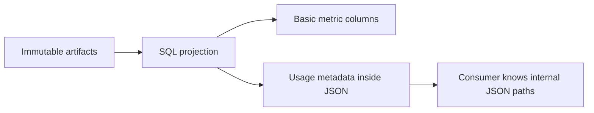
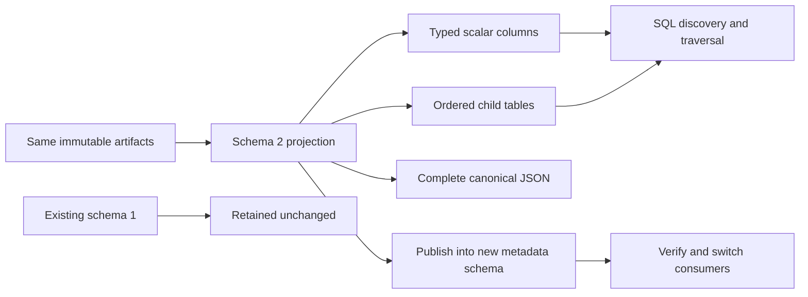
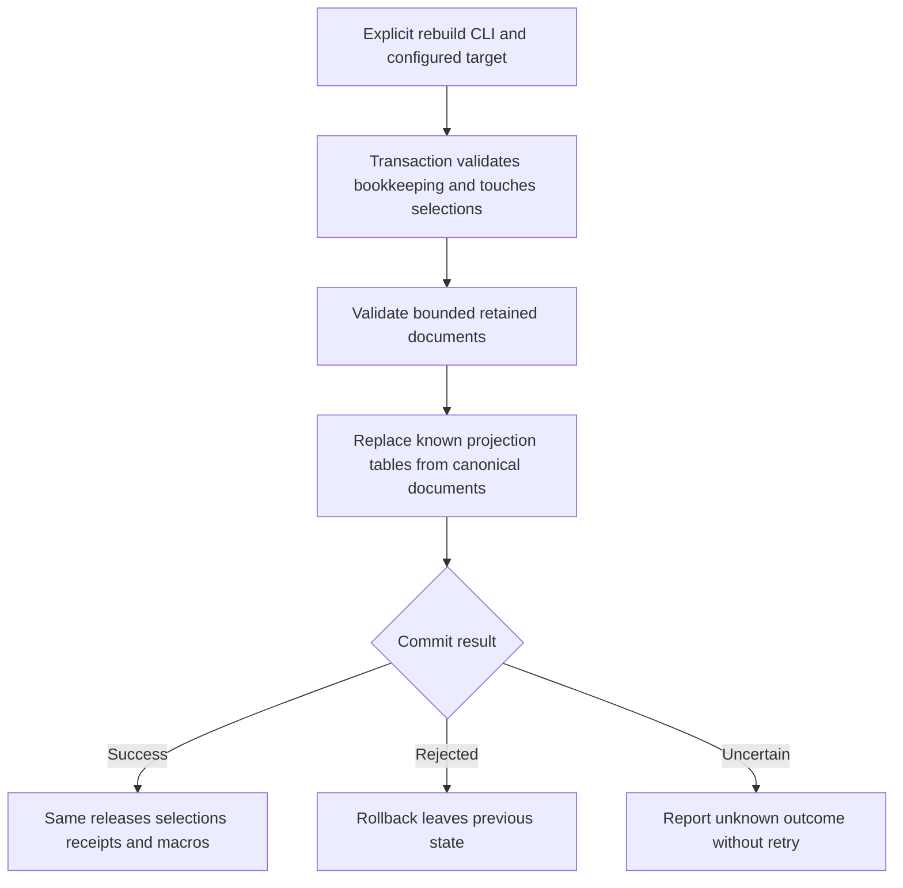

# Change Record: Make semantic discovery metadata directly queryable

| Field | Value |
| --- | --- |
| Status | Implementing |
| Type | Feature and SQL schema upgrade |
| Primary issue | [#728](https://github.com/eirhop/favn/issues/728) |
| Pull request | [#730](https://github.com/eirhop/favn/pull/730) |
| Related work | [#724](https://github.com/eirhop/favn/pull/724), [#729](https://github.com/eirhop/favn/issues/729) |
| Affected areas | Core SQL projection, SQL publication request, native DuckDB/DuckLake publisher, public guides and Favn.AI |
| Approved plan commit | `bae61ec2e8fd69d30f043c65cebbfd9f250c41f3` |
| Source baseline | `ba3fa194` |
| Last updated | 2026-09-17 |

## One-minute summary

Metric descriptions and usage rules already exist in immutable semantic artifacts.
The current SQL catalog leaves most of them inside JSON, so a consumer must know
internal JSON paths to discover them. Publish typed columns and small child tables
so ordinary SQL can search descriptions, inspect grouping rules, and follow
hierarchies and dependencies. Preserve the complete JSON, artifact identities,
versioned snapshots, existing input bindings and native macro behavior.

## Impact and assumptions

A dashboard author should be able to write `WHERE m.description ILIKE '%revenue%'`
and then follow relationship keys without decoding JSON. No new DSL declarations,
query service, runtime readiness observations, or business metadata are introduced.

This is private pre-v1 software. Prefer an explicit parallel-schema upgrade over
an automatic in-place migration of arbitrary retained history. Existing catalogs
remain readable; switching consumers to the new schema is an explicit deployment
step. The implementation does not modify a live customer database.

## Problem analysis and evidence

| Evidence | Finding | Limit |
| --- | --- | --- |
| `Favn.Catalog.Projection` | Metric descriptions, unit/format/time rules and model dimensions/hierarchies are only in detail JSON | Existing JSON is complete, not lost data |
| `Favn.Semantic.Schema` | Closed artifacts already validate dimension keys, hierarchy levels, relationships, ordered inputs, minimum grain and entity keys | These are declarations, not verified served compatibility |
| Native catalog publisher | Schema 1 is verified before publication; all rows/macros/selections/receipts commit together | No existing catalog migration mechanism |
| #728 | Requires SQL-visible fields, ordered relations, upgrade path and native tests | #729 and #721 remain separate work |

## Current behavior

## Approved plan

### Projection contract

Every versioned row retains `context` and `version`. All joins must include both;
semantic relationship and column metadata always comes from the artifact's own
snapshot, never the selected manifest. Existing columns remain with the same names
and types; new scalar columns append to `metric` and `model`.

| Surface | New columns or child row fields, excluding context/version | Source |
| --- | --- | --- |
| `metric` columns | `description`, `unit_kind`, `unit_value`, `format_style`, `format_decimals` BIGINT, `time_aggregate` | Corresponding metric fields |
| `model` columns | `time_column`, `time_grain`, `time_timezone` | Model time declaration |
| `metric_minimum_grain` | `metric_ref`, `ordinal` BIGINT, `relationship_name` | Ordered minimum-grain role names |
| `metric_entity_key` | `metric_ref`, `ordinal` BIGINT, `column` | Existing first/last entity key; needed to interpret time selection |
| `metric_dependency` | `metric_ref`, `dependency_ref` | Existing metric dependency edges |
| `dimension` | `model`, `name`, `label_column` | Model dimension declaration; source asset is joined through model |
| `dimension_key` | `model`, `ordinal` BIGINT, `column` | Dimension key derived from contract grain |
| `hierarchy_level` | `model`, `hierarchy`, `ordinal` BIGINT, `column` | Ordered hierarchy levels; hierarchy names scoped by model |
| `relationship` | `asset_ref`, `name`, `target_asset_ref`, `cardinality`, `on_violation` | Contract relationship, for both contexts |
| `relationship_key` | `asset_ref`, `relationship_name`, `ordinal` BIGINT, `source_column`, `target_column` | Ordered relationship key pairs |

All other new scalar columns are VARCHAR. Ordinals are one-based and preserve
artifact order. Missing optional scalar metadata becomes SQL NULL; missing lists
or declarations produce no child rows. There are no invented labels, time rules,
keys, or default formatting. Relationships are not dimensions: the two contracts
remain distinct and are joined using existing asset/model bindings. Named
hierarchies need only their level table because artifacts require nonempty levels.

The complete canonical JSON and immutable artifact versions remain unchanged.
This is SQL catalog schema version 2, not a new semantic artifact schema.

### Scope and ownership

Core remains pure data projection and owns the catalog schema version constant.
SQL runtime includes that version in the operation identity. The native plugin
creates/verifies schema 2 and emits schema-2 receipts. The public command/config
shape is unchanged. Macro namespaces, definitions, and input order are unchanged.
Guides, module/function docs and Favn.AI explain the new consumer surface.

### Non-goals

No in-place migration, automatic history copy, artifact/DSL changes, new platform
service, search index, runtime readiness, serving mappings, or automatic retention.

### Complexity budget

| Slice | Production added | Production deleted | Supporting added | Supporting deleted | Reason |
| --- | ---: | ---: | ---: | ---: | --- |
| 1: Typed projection | 150-240 | 10-30 | 170-270 | 0-15 | Scalar mappings, eight small child projections and focused fixture/assertions |
| 2: Version and upgrade boundary | 20-60 | 8-25 | 130-230 | 0-15 | One schema constant, native compatibility checks, safe parallel-schema upgrade tests |
| 3: Consumer examples and docs | 0-20 | 0-10 | 140-230 | 5-30 | Executable SQL examples, schema reference and AI routing |
| Total | 170-320 | 18-65 | 440-730 | 5-60 | Extends the existing publisher rather than introducing migration orchestration |

Exclude this record and generated output. Explain variance exceeding the upper
estimate by 25 percent or 100 lines, whichever is smaller, and materially fewer
deletions. Preserve this baseline after review.

## Operational design

### Explicit upgrade path

1. Keep the old metadata schema and its consumers intact. Retain the old publisher
   version for reconciliation of any interrupted schema-1 publication.
2. Configure a new empty metadata schema, for example `meta_v2`, on the same catalog.
3. Publish the desired original immutable manifest/semantic artifacts into that
   new target with `none:0` expectations. Publish both together when adopting both.
4. Verify discovery queries and selections, then explicitly repoint consumers.
5. Retain the old schema for rollback and old pinned readers. No automatic deletion.

Selections, revisions, receipts and retained history are schema-local. Existing
schema-1 history is not silently copied or reset; it remains in the old schema.
Additional retained artifacts can be explicitly published into the new schema,
then the desired version reselected with the current revision. Macro namespaces
remain catalog-scoped and are safely reused when the identical artifact already
exists. Do not copy selection rows or receipts between schemas.

Schema 1, future versions, corrupt version markers, and mismatched schema-2 column
layouts fail with `catalog_schema_conflict` before any mutation. Explicit receipt
reconciliation must verify schema compatibility too; an unavailable receipt still
cannot prove a prior write failed. No DDL/DML is added to reconciliation. Schema-2
publication, rollback, replay and conflict semantics remain those of #724. One
transaction covers the new child rows as well as prior metadata and selection.

### Diagnostics

Continue existing bounded machine-readable errors, operation identity and
`compatibility: unknown`. The guide maps `catalog_schema_conflict` to the explicit
parallel-schema upgrade. Do not print artifact contents, connection details or
arbitrary native exceptions. No new background logging or service is added.

## Verification plan

| Acceptance | Evidence |
| --- | --- |
| Existing fields only; scalar types and ordering | Rich valid artifact fixture with composite dimension/relationship keys, reordered levels and grain, composed metrics, time and entity keys; pure exact row assertions |
| Missing values stay absent | Artifact without dimension/time/format; NULL scalar and empty-child assertions |
| Version context remains independent | Native selected semantic snapshot differs from manifest; every example joins context/version and still resolves its original keys |
| Ordinary SQL consumer experience | Execute shared example SQL for description search, grouping keys, dependency traversal and hierarchy traversal against both native backends; document the same examples |
| Upgrade and incompatible schema rejection | Create legacy schema-1 layout/history/receipt fixture, reject writes and reconciliation without changes, then publish same artifacts to new schema and preserve old data/macros |
| Atomicity, replay and selection | Rich rows survive completed replay without duplicates or regression; new semantic selection preserves old rows; inject failure after child-row installation and verify rollback |
| Native/version boundaries | DuckDB 1.5.5 and pinned DuckLake qualification; unknown/corrupt schema marker and wrong columns fail safely |
| Documentation/distribution | Public guide, moduledocs, Favn.AI, formatting, link/render checks, warnings-as-errors compile, owning tests, final-head CI |

## Risks and decisions

| Risk | Decision |
| --- | --- |
| Eight tables appear larger than a JSON-only solution | They represent repeated ordered metadata and are needed for joins without JSON paths; no redundant input or source tables |
| Operators expect an in-place upgrade | Explicitly document new target/schema and consumer switch, old history and reconciliation behavior |
| A minimum-grain name is mistaken for a dimension | Resolve through the metric source's contract relationship and ordered key mappings; do not fabricate a matching dimension |
| Future artifact additions outgrow this projection | Canonical JSON remains complete; new visible fields require their own SQL schema decision |

## Plan review

Independent agent `review_728_plan` approved the plan on 2026-09-17 after comparing
#728 and the current Core/native source. No blocking findings or corrections.
The reviewer accepted the parallel-schema upgrade, entity-key table, mapping
semantics, tests and complexity. Implementation must retain the macro-catalog
column position and test absent formatting separately from present formatting
with unspecified decimals. No implementation changes preceded approval.

---

## Implementation outcome

Implemented typed metric/model fields and eight ordered child tables in the
existing schema, with no new DSL or artifact format. Semantic rows come from
their retained snapshot. Four canonical SQL examples are executed by native tests.

The user-requested rebuild command restores all retained projection versions from
validated canonical release documents in one transaction. Stable bookkeeping,
macros and unrelated tables are preserved. Publication continues to reject
incompatible layouts until explicitly rebuilt. No customer database was changed.

The rebuild deviation below supersedes the earlier reset guidance. The original
planning baseline is intentionally retained for review.

## Deviations from the approved plan

The user explicitly rejected backwards compatibility and the proposed `meta_v2`
upgrade after planning approval. This instruction supersedes the upgrade sections
of the preserved baseline above.

| Planned | Revised implementation | Reason | Review |
| --- | --- | --- | --- |
| SQL schema 2 in a new metadata namespace with retained schema-1 history | Clean breaking layout in the existing configured metadata schema; retain the current schema marker and artifact formats; no parallel namespace, migration framework or legacy support | User instruction: "We do not need backwards compatibility so no new schema_v2 here" | Accepted by independent reviewer after user correction |

Fresh publication creates the new layout in the configured schema. Strict column
layout verification rejects an old or corrupt layout before writes or replay.
Existing installations need an operator-managed rebuild of publisher-owned
metadata before publication; history, receipts and selections are reset by that
explicit rebuild. No automatic destructive reset is added. Business relations
and catalog-scoped immutable macros are outside the metadata rebuild. Quiesce
publishers and readers before rebuilding; no compatibility or online-upgrade
promise is made.

The upgrade fixture and parallel-schema adoption tests are removed. Keep tests
for wrong/missing columns and unknown schema markers rejecting without mutation,
and keep all metadata, ordering, snapshot, atomicity and replay criteria.
No consumer-facing versioned schema name is introduced.

## Verification evidence

Local verification on the rebased `97ac8657` baseline:

- Warnings-as-errors compilation and repository formatting pass.
- Core fast suite: 530 passed; SQL runtime fast suite: 126 passed; public Favn
  fast suite: 193 passed (4 excluded by tier).
- Public catalog tests including fresh-process acceptance: 4 passed. An initial
  run under concurrent whole-repository analysis exceeded an existing 500 ms
  fresh-process startup deadline; the isolated rerun passed without changing it.
- Native DuckDB 1.5.5 and pinned DuckLake catalog/semantic qualification: 26 passed.
  The final retained-macro assertion is qualified on both backends separately.
- CI-equivalent warning-only strict Credo: no issues. Full all-category strict
  Credo also ran but reports repository-wide existing style suggestions; it is
  not the project's configured warning gate.
- Test-tag tier guard, local guide links and `git diff --check` pass.
- The initial reviewed plan's two diagrams rendered on GitHub before code edits.
  Final outcome diagram render and final-head CI are delivery gates.

These are synthetic local/native checks, not customer environment proof. No
customer database was changed. Remote/cloud DuckLake, grants and workload-scale
qualification remain outside this issue. CI results belong to the PR checks.

## Final review

Independent implementation review and final-head CI are required before readiness.

### User-requested rebuild command (superseding reset guidance)

The user requested a rebuild CLI and then authorized continuing. Add
`mix favn.catalog.rebuild --target analytics`, using the same dedicated config,
connection resolution, isolated runtime and deadline as publication. It requires
no artifact files and rebuilds **all retained versions** from the canonical
`release.document` values already stored in that target. This supersedes the
reset/history-loss paragraph above: preserve release documents, selections and
revisions, receipts, the schema marker, macros and unrelated/business tables.
Only the named `Projection.columns/0` tables are replaced, without CASCADE.
There is no new schema version or old-layout decoder.

Introduce an explicit rebuild request constructor and backend callback. Validate
the stable bookkeeping table layouts and marker, bound retained inputs to 10,000
releases / 128 MiB, validate each artifact and its stored context/version/identity,
reject duplicates or selected versions missing from releases, then recreate the
projection tables in one native transaction. A failed decode, DDL or insertion
rolls back everything. Touch selection rows without changing revisions so a
concurrent writer conflicts rather than silently losing derived rows. Operators
must quiesce publishers during this maintenance action; no online upgrade claim.

Rebuild is not publication: it never advances selections, installs macros or
replays a publication receipt. An uncertain commit returns an explicit unknown
rebuild outcome, never an automatic write retry. An operator may explicitly rerun
the deterministic rebuild after stopping writers. Rebuild returns counts and the
unchanged selections, not a durable publication receipt.

Additional budget: 160–260 production lines added / 10–35 deleted and 160–260
supporting lines added / 0–15 deleted. Native tests on DuckDB and DuckLake cover
missing/outdated projections, retained versions, unchanged bookkeeping/macros,
corrupt release rollback and unrelated table preservation. CLI fresh-process tests
prove dedicated config and no customer runtime boot; fault tests prove unknown
commit is surfaced without retry. Independent plan re-review precedes this slice.

### Rebuild plan review

Independent `review_728_plan` approved the rebuild deviation before implementation
on 2026-09-17. It required bounds before loading, validated selection values,
rollback after actual table replacement, native overlapping-write tests, and a
rebuild-specific unknown result on the outer timeout. These checks are included.
DuckDB rejects the overlapping publication immediately; DuckLake can commit the
publication and reject the rebuild at commit. The test accepts either winner,
requires one conflict, and verifies retained metadata and selected revisions.

### Actual complexity comparison

Counts below exclude this change record and compare implementation files with the
rebased main baseline. Supporting means tests, fixtures and canonical guides;
AI routing and HexDocs registration count as production. Shared native tests are
assigned by hunk: 70 added lines exercise discovery/examples; remaining additions
exercise rebuild/CLI/failure paths.

| Slice | Production added/deleted | Supporting added/deleted | Compared with baseline |
| --- | --- | --- | --- |
| 1: Typed projections | 131 / 5 | 288 / 1 | Appending fields needs fewer deletions; complete contract fixture adds modestly beyond supporting estimate |
| 2: Schema boundary/native discovery | 1 / 0 | 70 / 0 | User removed schema-2/parallel-upgrade implementation and fixtures; only reconciliation guard remains |
| 3: Consumer reference and routing | 5 / 1 | 166 / 2 | Within additions budget; existing guide remains the workflow so fewer deletions |
| Added rebuild slice | 312 / 54 | 322 / 7 | Explicit public/CLI timeout handling, retained-input validation, concurrent-writer and actual DDL rollback tests extend the estimate; extracting shared table creation/insertion accounts for extra deletions |
| Total | 449 / 60 | 846 / 10 | Original plus user-requested rebuild; no compatibility framework or new authoring DSL |

The rebuild additions exceed their estimates by 52 production / 62 supporting
lines, below the material-variance threshold of 65 for each category. Rebuild
deletions exceed the estimate by 19 because existing insertion/table creation is
shared rather than duplicated. This is a justified implementation deviation,
not removal of existing publication behavior. Review must assess these actual
counts and the preservation/unknown-outcome tests before readiness.
