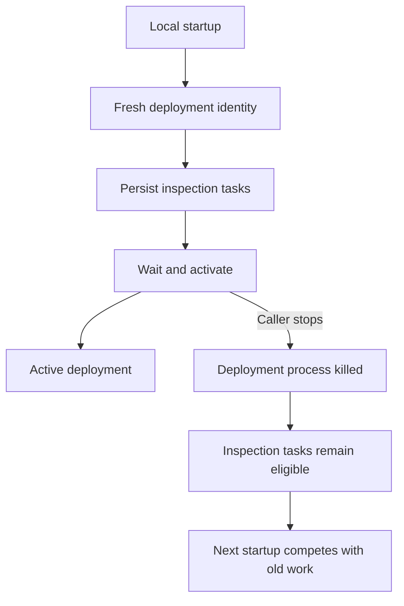
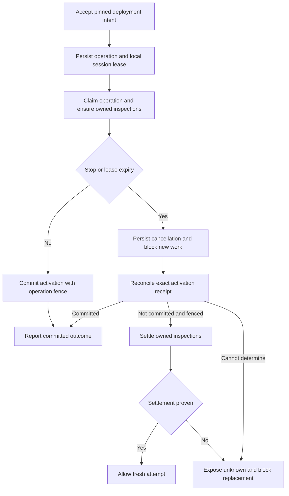
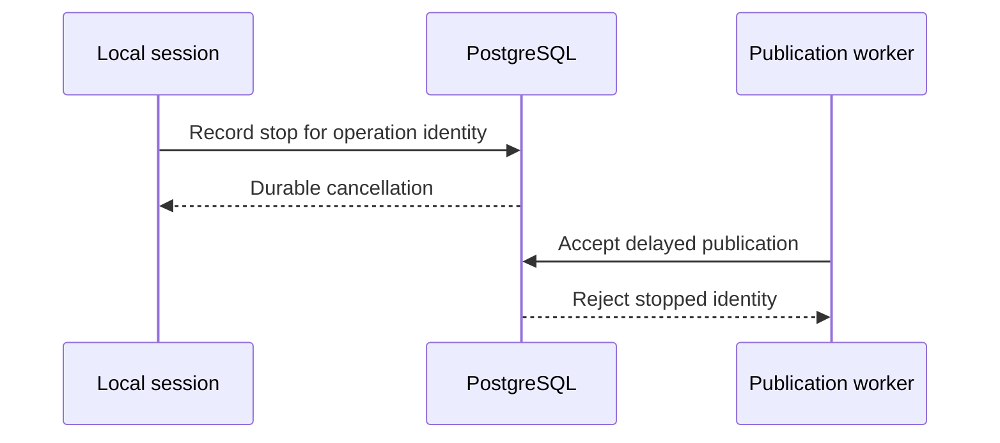

# Change Record: Own and settle deployment inspections

| Field | Value |
| --- | --- |
| Status | Implemented |
| Type | Lifecycle and persistence bug fix |
| Primary issue | [#733](https://github.com/eirhop/favn/issues/733) |
| Pull request | [#735](https://github.com/eirhop/favn/pull/735) |
| Related work | [#734](https://github.com/eirhop/favn/pull/734), merged timeout-budget repair |
| Affected areas | Local startup/reload, orchestrator deployment operations, PostgreSQL task ownership and activation |
| Approved plan commit | `dcae9eb78a77d66de4d880f066aee3196ce82ed9` |
| Last updated | 2026-09-18 |

## One-minute summary

Stopping local development can kill the process waiting for deployment without
settling its durable inspections. A new startup then competes with abandoned
work. Make the orchestrator persist the deployment owner before dispatch, use
that owner to fence and settle inspections, and reconcile activation before
reporting failure or admitting a replacement. Extend the existing deployment
operation machinery rather than introduce a second local deployment engine.
This record plans implementation; it does not claim the behavior exists yet.

## Impact

A startup with many tables can stop with inspections still queued. Repeating
startup creates another attempt, while the runner first services older tasks.
Longer startup budgets reduce this trigger but do not repair crash recovery.
An activation transaction may also commit just before its caller disappears;
reporting that as a failed deployment would be incorrect.

## Problem analysis

### Assumptions

- Scope is issue #733, including local startup and reload plus the shared
  persistence contracts they use. No implementation is authorized by this plan.
- PostgreSQL remains the durable authority. Process monitors and local files
  are useful notifications, never proof that deployment rolled back.
- Local sessions are ephemeral: explicit stop, startup timeout, or expiration
  of the local session lease abandons an uncommitted attempt. A new local
  session does not resume that attempt's physical observations.
- A worker restart within a still-live local session, or recovery of an archive
  deployment, may resume the same compatible attempt within its original
  deadline. Archive client disconnect continues to mean detached observation,
  not cancellation.
- Existing inspection results can produce an activated deployment with
  unresolved target diagnostics. Preserve that `needs_attention` behavior;
  activation success and target readiness are separate facts.

### Evidence

Source was inspected at `aaad9332` (main after #734).

| Evidence | What it proves | Limit |
| --- | --- | --- |
| [Local publication](../../../apps/favn_local/lib/favn_local/publication.ex) | Local calls `Manifests.deploy` with a fresh random deployment ID and no durable operation acceptance | Does not establish live timing |
| [Development runtime](../../../apps/favn_local/lib/favn_local/development_runtime.ex) | Startup shutdown terminates the deployment task; #734 now separates timeout budgets | Does not settle submitted task ownership |
| [Compatibility planner](../../../apps/favn_orchestrator/lib/favn_orchestrator/target_compatibility_planner.ex) | Task identity includes attempt and target; cancellation inside the planner depends on its execution surviving | Process death can bypass cleanup |
| [Deployment dispatcher](../../../apps/favn_orchestrator/lib/favn_orchestrator/manifest_deployment_dispatcher.ex) | Archive deployments already have durable claims, progress, stable operation identity and an original inspection deadline | Local publication bypasses that path |
| [Operation tasks](../../../apps/favn_orchestrator/lib/favn_orchestrator/operation_runner_tasks.ex) | Existing `operation_id` denotes rebuild/recovery ownership | Cannot reuse that field for deployment ownership without changing its contract |
| [Registry store](../../../apps/favn_storage_postgres/lib/favn_storage_postgres/registry/store.ex) | Activation has a transaction, command replay and workspace activation lease; operation completion is separate | Existing checks do not establish atomic ordering with proposed cancellation |
| [Task store](../../../apps/favn_storage_postgres/lib/favn_storage_postgres/runner_tasks/store.ex) | Queued cancellation is terminal; assigned cancellation requests runner settlement | A cancellation request is not proof execution stopped |
| #733 incident investigation | A retry serviced abandoned inspections before its own work | Historical evidence; no consumer restart or database changes in this planning task |

## Current behavior

## Approved plan

This section is the independently approved baseline. The record lifecycle
status means the draft PR exists; implementation has not started.

### Contracts and invariants

1. **One deployment owner.** Extend `ManifestDeployments` with a typed local
   acceptance command for an already published immutable manifest. Reuse the
   operation table, dispatcher and claim heartbeat. Keep archive authorization,
   upload leases and archive hashes specific to archive acceptance; do not
   fabricate an archive hash or relax HTTP authority for local callers.
2. **Pinned request.** Persist source (`local` or `archive`), manifest ID/hash,
   runner releases, selection, configuration/policy and request fingerprint.
   Local acceptance fixes the same supported selection as today. Reusing an
   operation ID with different pins is a conflict. Use a generated identifier
   satisfying the existing operation-ID constraints, not the old colon-delimited
   local deployment ID. Persist one absolute
   inspection deadline on first activation and never extend it on reclaim.
3. **Explicit inspection ownership.** Add a nullable, workspace-scoped
   `deployment_operation_id` reference to runner tasks, separate from rebuild
   `operation_id`. Set it atomically with enqueue. Add indexed, bounded owner
   lookup and aggregate counts; never scan task payloads or decode hashes to
   infer ownership. Limit ownership to deployment relation inspections.
4. **Race-safe admission.** Enqueue, retry and claim must reject an owner that
   is cancelling, expired or terminal. Serialize acceptance of new work and
   cancellation on the operation row. Settlement processes at most 100 tasks
   per transaction, with a stable task-ID cursor; a closed owner prevents new
   tasks appearing behind that cursor. Use one documented lock order: operation
   row before owned task rows. Audit result, lease expiry and retry paths for
   that ordering rather than adding inverse locks to existing transactions.
5. **Local liveness.** Persist a local session ID and a 45-second lease, renewed
   every 15 seconds by the local runtime while its operation is wanted. This
   is distinct from the dispatcher's worker claim. Renewal cannot revive an
   expired/cancelling session. A restarted local session finds the predecessor
   by indexed workspace/source lookup; it reports busy while that session is
   live and requests reconciliation once expired. Concurrent starts must not
   both accept a replacement. Serialize local admission per workspace.
6. **Cancellation is intent.** Store cancellation reason/time before stopping
   a worker. Queued inspections cancel immediately through task contracts;
   assigned work remains cancelling until runner settlement or existing lease
   recovery proves it terminal. Prevent requeue after abandonment. Unknown
   execution remains visible and blocks automatic replacement until runner
   session termination or explicit reconciliation proves no execution remains.
7. **Commit wins only when proven.** Activation and cancellation lock the same
   operation row. In the activation transaction, verify the operation claim
   fence, cancellation state, local lease when applicable, and existing
   workspace activation fence before writing. Persist the exact activation
   receipt with the operation in that transaction. If cancellation committed
   first, an old worker cannot activate. If activation committed first,
   cancellation returns its receipt rather than changing success to failure.
8. **Exact outcome.** Reconciliation reads the operation receipt and command
   replay evidence plus current workspace revision. Content reuse can return
   an existing deployment ID, so record the actual ID and revision, not an
   assumption that operation ID equals activated deployment ID. A committed
   deployment that has since been superseded stays committed but is not locally
   ready. Missing current active pointer alone never proves non-commit.
9. **Bounded observer.** Local startup/reload observes operation state through
   the orchestrator facade and retains #734's timeout budgets. The GenServer
   stays responsive; supervised waits and renewal are asynchronous. The startup owner
   deadline requests durable cancellation. The reload CLI observer timeout
   (60 seconds by default) or disconnect only detaches the observer: return the
   operation ID and pending/unknown observation while the live runtime keeps
   renewing ownership. Neither blindly retries activation. Explicit stop,
   owner lease expiry, or the actual operation deadline applies the lifecycle
   policy independently of the CLI wait. Runtime cleanup is a
   best effort accelerator; durable reconciliation survives its failure.
10. **No stale observations across attempts.** Resume only the same live attempt
    with identical pins, original deadline and unchanged expected workspace
    revision/target-binding versions. A changed base requires settlement and a
    fresh attempt. No succeeded physical inspection is copied to a new attempt.
    Existing terminal evidence remains readable after deadline for reconciliation.

### States and policy

Retain `accepted`, `activating`, `succeeded`, `failed`, `unknown`,
`needs_attention` and add
`cancelling`, `cancelled`. Represent an unproven activation/settlement as explicit
outcome and cleanup fields, not a false terminal failure. `needs_attention`
alone must not decide whether activation committed or cleanup finished.
Persist `cleanup_state` (`pending`, `settling`, `settled`, `unknown`) separately
from activation outcome. Even terminal operations with pending cleanup remain
eligible for reconciliation. Replacement requires proven settlement of the
predecessor and no unresolved activation outcome.

| Trigger | Policy |
| --- | --- |
| Explicit local stop or startup deadline | Persist cancellation, reconcile commit, settle tasks; bounded shutdown may finish with cleanup pending |
| Local process/host crash | Session lease expiry triggers durable cancellation on the next running control plane |
| Reload CLI timeout or disconnect | Detach observer; live runtime keeps the same operation and session lease, with no new attempt |
| Dispatcher worker crash | Reclaim same operation only while source policy and original deadline allow it |
| Control-plane restart | Reconcile receipts/cancellation/expired local leases before dispatching new owned work |
| Runner loss | Existing task lease recovery; retry read-only inspection only for a live owner within deadline |
| Late result | Preserve fenced task evidence; never reopen abandoned owner, activate it, or complete a different local request |
| Database unavailable | Return unknown with operation ID, retain intent where committed, block replacement until reconciliation |
| Inspection deadline | Stop new inspections, settle outstanding tasks, retain existing unresolved-target activation semantics only while owner still permits activation |
| Archive caller disconnect | Continue its durable operation; do not apply the local session lease policy |

### Scope and non-goals

Include local startup, manifest-only reload and reload that starts a new runner,
durable ownership, cleanup, activation reconciliation, migrations, diagnostics,
and regression coverage of shared archive behavior. Preserve local no-op reload,
candidate retirement and maintenance admission; an unproven outcome must not
retire the runner required by a possibly active deployment.

Exclude inspection batching, runner concurrency increases, broad scheduler
redesign, automatic data repair, and a claim of production readiness for all
deployment or generation workflows. Public archive cancellation endpoints and
new operator UI pages are not required for this issue.

### Alternatives and decisions

| Alternative | Decision |
| --- | --- |
| Only add cleanup to local `terminate` | Rejected: does not survive process kill, host crash or failed cleanup |
| Raise timeouts again | Rejected: #734 already fixes budgets; does not establish ownership |
| Share inspections by manifest hash | Rejected: stale physical observations can cross fresh attempts |
| New local-only operation engine | Rejected: duplicates claims, progress, deadlines and recovery |
| Extend existing archive acceptance directly | Use a distinct local acceptance command with shared operation execution; avoid fake upload data and authority widening |

### Implementation slices and complexity budget

Supporting lines include tests, fixtures, examples and canonical docs. Exclude
this record, generated artifacts, locks and formatting-only changes. These
ranges reflect real transaction/concurrency work, not a small timeout patch.

| Slice | Owner and outcome | Depends on | Production added | Production deleted | Supporting added | Supporting deleted |
| --- | --- | --- | ---: | ---: | ---: | ---: |
| 1 | Orchestrator/PostgreSQL typed local acceptance, operation fields, migration and indexed task ownership | None | 250–450 | 20–80 | 250–450 | 10–40 |
| 2 | Orchestrator/PostgreSQL admission fences, bounded settlement, activation receipt and recovery | 1 | 300–550 | 60–150 | 450–750 | 30–100 |
| 3 | Local runtime durable submission/observation, session renewal, stop and reload integration | 1, 2 | 150–280 | 100–220 | 200–350 | 50–120 |
| 4 | Cross-layer acceptance, diagnostics and canonical docs | 1–3 | 40–90 | 10–30 | 250–450 | 20–60 |

Reuse the dispatcher and task cancellation transitions. Extract a module only
for a named ownership/settlement contract, not generic lifecycle utilities.
Explain category overruns above 25 percent or 100 lines, whichever is smaller,
and materially fewer deletions. Preserve this budget after review.

### Implementation map

| Area | Responsibility |
| --- | --- |
| `favn_orchestrator`: `ManifestDeployments`, dispatcher, `Manifests`, compatibility planner | Acceptance, policy, cancellation/reconciliation, scoped diagnostics and pinned planning |
| `favn_orchestrator`: persistence commands/results/behaviours, `OperationRunnerTasks` | Typed ownership and bounded storage contracts |
| `favn_storage_postgres`: registry/task stores, schemas, migrations | Atomic fences/receipt, owner index, bounded settlement and referential integrity |
| `favn_local`: publication, development runtime, reload result | Session liveness, submit/observe/stop and exact local readiness |
| `favn_runner` | Retain execution/cancellation contracts; only change if tests reveal a necessary gap, with plan re-review |
| Canonical docs | Local development guide; target-generations architecture; PostgreSQL data model; local structure map; affected public API docs |

## Operational design

### Diagnostics

Expose a bounded workspace/operation status read with source, phase, activation
outcome, cleanup state, deadlines, expected/actual revision and task counts
(pending, assigned, completed, cancelled, unknown). Counts are database
aggregates; task detail pages use stable cursors with a default/max of 100.
Emit transition logs immediately and repeated stuck-state warnings at most once
per operation per minute. Use safe reason codes, operation/task IDs and counts;
exclude SQL, credentials, paths, payloads and arbitrary exception terms.

### Deployment, migration and compatibility

Use the standard bootstrap migration flow; local startup must not migrate the
database. Add source/local lease/cancellation/cleanup/receipt fields, explicit
request pins, task ownership FK and indexes matched to owner/status/task-ID and
workspace/source/nonterminal recovery reads. Backfill existing archive
operations as `archive`; archive hash remains required for that source and
nullable only for validated local acceptance. Preserve HTTP request fingerprints
and replay behavior. Update closed persistence codecs and result decoders.

Quiesce deployment acceptance and drain active deployments before upgrading
control planes; mixed old/new ownership writers are unsupported. Legacy tasks
have hashed identities without a reversible owner link: do not guess ownership.
Before admitting the first new local attempt, report legacy unowned nonterminal
relation inspections in that workspace. A scoped operator command must fence
legacy dispatch under quiescence, request cancellation through existing task
contracts, and verify settlement; it must never delete rows or cancel unrelated
generation/rebuild work by broad task-kind matching. Where provenance cannot be
proved, require operator-supplied verified task IDs and preserve the blocker.
This migration/preflight behavior needs a fixture representing old queued and
assigned tasks.

Update `FavnStoragePostgres.Maintenance.TaskRetention` standalone-task
eligibility to account for `deployment_operation_id`, not only `run_id` and
rebuild `operation_id`. Add retention tests proving that tasks needed for
deployment recovery, replay and authoritative counts cannot be pruned.
Retain operation receipts and owner relationships while child tasks, replay or
recovery need them; no cascading deletion of active work. Rollback requires
settling new local operations and stopping new writers first. Prefer a forward
fix; do not run old code against unresolved new lifecycle states.

## Verification plan

| Acceptance criterion | Planned evidence | Owner |
| --- | --- | --- |
| Persist owner before dispatch, bounded reads | Real PostgreSQL FK/index/query tests; fresh-process codec roundtrip; maximum-page fixtures | Storage/orchestrator |
| Every interruption has policy | Crash before dispatch, after enqueue and after assignment; local stop; host/session expiry; dispatcher/control-plane restart | Orchestrator/local |
| Abandoned work cannot compete | Concurrent cancel/enqueue/claim/retry barriers; repeated startup; replacement remains blocked until settlement | Storage/local acceptance |
| Settle queued and assigned work | Queued cancellation; runner acknowledgement; lease expiry; no requeue after cancel; unknown remains visible | Task storage/runner integration |
| Compatible resume only | Same-attempt worker reclaim; pin/base-revision change rejection; unchanged deadline; fresh attempt uses fresh task identity | Orchestrator |
| Exact activation outcome | Transaction barriers for cancel-before-commit and commit-before-cancel; lost commit response; content reuse; later supersession; stale claim worker | Storage integration |
| Preserve unknown | Database loss during acceptance/cancel/commit; runner cancellation unknown; no optimistic failure or replacement | Orchestrator/local |
| Late results and cleanup recovery | Late result after cancellation or claim change; crash between cleanup pages; duplicate messages; terminal operation with pending cleanup | Storage/orchestrator |
| Useful safe diagnostics | Exact counts and state transitions; tenant isolation; bounded pages; redaction and warning coalescing | Orchestrator |
| Preserve existing workflows | Local startup, no-op/manifest/runner reload; failed candidate; reload exceeding 60 seconds and CLI disconnect still complete exactly once; archive detached client, zero-runner demand, reclaim and needs-attention activation | Acceptance |
| Retain recovery evidence | Deployment-owned terminal tasks survive standalone retention while their owner still needs recovery/replay/count evidence | Storage retention |
| Upgrade existing backlog | Quiesced legacy task preflight, verified scoped settlement, no unrelated cancellation, rollback guard | Migration/acceptance |

Run owning tests first using app-scoped `cmd mix test`. Use disposable PostgreSQL
18 per the storage testing guide. Then format/compile, tag guard, relevant
acceptance/slow tests and CI against the exact implementation head. Use barriers
and injected clocks for race tests rather than fragile short sleeps.

Separately qualify a disposable consumer with many tables: interrupt startup
with queued and assigned inspections, restart repeatedly, then verify exact
activation and no abandoned eligible work. This is live proof only when actually
run; CI and source inspection do not substitute for it.

## Risks and implementation gates

| Risk | Mitigation or gate |
| --- | --- |
| Operation row locking conflicts with existing task locks | Review all touched transaction lock orders and exercise PostgreSQL contention before integration |
| Lease expiry during slow local process | Asynchronous renewal independent of planner waits; expiry is conservative and cannot be silently revived |
| Unknown task execution blocks progress | Explicit diagnostics and scoped reconciliation; do not trade correctness for an automatic new attempt |
| Shared dispatcher accidentally bypasses local maintenance admission | Carry admission through the supported lifecycle boundary; test maintenance and shutdown ordering |
| Legacy unowned tasks cannot be attributed | Quiesced, explicit preflight/settlement gate rather than invented backfill |
| Scope exceeds budget | Re-review the plan or split into dependent records before implementation expands |

## Plan review

| Field | Result |
| --- | --- |
| Reviewer | Independent agent `review_startup_timeout` |
| Reviewed against | Issue #733, current primary code at `aaad9332`, this record and architecture/storage skill checks |
| Findings | Separate reload observer timeout from startup-owner cancellation; explicitly protect deployment-owned evidence from standalone task retention |
| Addressed | Contract 9, trigger table and regression matrix now preserve detached reload observation; migration and verification sections name the retention guard |
| Verdict | Approved for planning baseline and draft PR after recheck; no remaining blocking findings |

The reviewer checked ownership, atomic commit/cancel ordering, original
deadlines, observation reuse, legacy migration and archive compatibility.
Implementation requires its own final review.

## Implementation outcome

Local startup and reload now accept an operation before submitting inspections.
A renewable 45-second local session owns that operation; archive operations keep
their detached-client policy. The existing dispatcher owns activation, original
inspection deadlines, worker reclaim and the exact runtime receipt.

PostgreSQL serializes operation admission, cancellation and activation before
task locks. A closed owner cannot enqueue, claim, retry or start more inspection
work. Cleanup cancels queued work in pages of 100, rotates cancellation delivery
across assigned work, and preserves unknown execution. Replacement activation
waits for predecessor settlement across both sources. Legacy unknown activation
remains a blocker even when its task cleanup has settled.

Activation records the actual deployment ID and runtime revision in the same
transaction as the workspace change. Cancellation replays a committed receipt;
it cannot describe a committed activation as rolled back. Successful activation
with entirely terminal inspection evidence settles cleanup immediately.

Local observation reports operation identity and distinguishes a caller timeout
from owner cancellation. Stop/startup cancellation runs in a monitored worker
with a ten-second fallback that reports unknown and the operation identity.
The GenServer continues processing status, timers and runner shutdown. Verified
operator quiescence is scoped to exact task assignment generations, audited,
idempotent and fences late execution.

The proposed ownership diagram remains the final flow. The extra pre-acceptance
fence below closes the publication/stop race:

Canonical behavior is documented in the local development guide, PostgreSQL
data model and retention catalog, target-generation architecture, and the
[recovery runbook](../../production/deployment-inspection-recovery.md).
No consumer database or running consumer project was changed.

## Deviations from the approved plan

| Baseline | Implementation and reason | Review |
| --- | --- | --- |
| Persist acceptance before inspection dispatch | Also persist a workspace/operation cancellation tombstone before acceptance. Publication can be delayed beyond stop; the tombstone prevents resurrection without inventing a manifest owner. | Independent reviewer approved |
| Pin base binding versions | Persist one deterministic binding-version hash, alongside the original runtime revision and manifest/request pins. Reclaim rejects a changed base. | Independent reviewer approved |
| Preserve maintenance admission through shared activation | Delegate an existing monitored permit in memory to the exact workspace/operation. The caller must own it; it cannot overwrite a different grant. Parent release/DOWN removes delegation; acquired child permits remain monitored. No maintenance secret is persisted. | Independent reviewer approved |
| Reuse shared dispatcher | Local source keeps exclusive slots, bounded workers and size checks but bypasses archive finite-cgroup admission, preserving native development on machines without a finite cgroup. Archive admission is unchanged. | Independent reviewer approved |
| Reuse dispatcher polling | Remove immediate completion/DOWN polling, leaving one periodic timer chain. Previously each immediate poll created another repeating timer under retry. Refill can take up to one second. | Independent reviewer approved |
| Bounded asynchronous cleanup | Rotate a persisted cleanup cursor across cancellation notifications and settle successful all-terminal evidence in the commit transaction. This prevents notification starvation and unnecessary local replacement rejection. | Independent reviewer approved |
| Separate many-table external consumer interruption qualification | Not run in this change. Verification uses a 101-inspection PostgreSQL fixture plus real local lifecycle acceptance; the latter has no external many-table SQL workload. Run the external scenario before claiming that operational qualification or deploying this upgrade to that consumer. | Independent reviewer accepts the explicit proof boundary; criterion remains unqualified |
| Existing task snapshot compatibility | Write version-two ownership-aware snapshots while decoding version one without the added nil owner field; retain old unowned enqueue hashes. | Independent reviewer approved |

The approved planning commit above is unchanged.

### Actual complexity

Counts below are Git additions/deletions before final review, including new
files and excluding this record. Supporting tests are grouped in slice 4 except
local tests in slice 3; slice 1 includes contract/facade/schema/migration files.
The ownership module is counted wholly in slice 2 rather than dividing functions
between acceptance and settlement.

| Slice | Production added | Production deleted | Supporting added | Supporting deleted |
| --- | ---: | ---: | ---: | ---: |
| 1: contracts, facade and schema | 423 | 12 | 0 | 0 |
| 2: ownership, fencing and dispatcher | 1145 | 83 | 0 | 0 |
| 3: local lifecycle | 262 | 54 | 112 | 7 |
| 4: shared verification and canonical docs | 0 | 0 | 1092 | 5 |

Slice 2 exceeds its 550-line upper estimate. The explicit ownership module
accounts for 507 lines, including acceptance that the estimate assigned to
slice 1. The additional stop-before-acceptance fence, exact attested legacy/
unknown settlement, scoped permit delegation, monitored cancellation failures,
and fair cancellation delivery were required by reviewed race findings.
Shared runner-task changes preserve existing receipt/recovery behavior rather
than adding a second task protocol. The implementation adds one ownership
module and one small typed inspection identity; it does not add a new dispatcher.

Deletions are lower than estimated because the existing dispatcher, publication
steps, runner shutdown and task state transitions remain in use. Only local
activation observation and the relevant locking/admission paths changed.
Supporting changes concentrate in real PostgreSQL and lifecycle tests instead
of adding another fixture framework. Final review must challenge this overrun;
it is not hidden by the test total.

## Verification evidence

### Static and focused integration checks

- Formatting, warnings-as-errors compilation, CI warning-level Credo/Sobelow
  checks and the test-tier coverage guard pass.
- Four real PostgreSQL transaction races pass: cancel before enqueue, enqueue
  before cancel, cancel before activation, and activation before cancel.
  Barriers assert distinct backend PIDs and verify PostgreSQL reports the
  contender blocked before allowing the winning transaction to commit.
- The owning deployment/retention suite passed 43 tests on a fresh disposable
  database before the final combined run.
- Local fast suite passed 48 tests, including caller timeout, cancellation worker
  startup failure, worker death/deadline and ignored late completion.
- Lifecycle suite passed nine tests, including delegated maintenance admission,
  wrong owner/scope, conflicting grant, parent release, child death and drain.
- The combined focused orchestrator rerun passed 43 tests and local fast rerun
  passed 48 tests. The combined PostgreSQL suite passed 116 tests, including snapshot-v1
  replay, bounded cleanup, activation/cancellation races and retention.

Tests use PostgreSQL 18 in a dedicated disposable container. Storage fixtures
and restricted-role local acceptance use separate databases: starting the
actual control plane against retained storage-test fixtures can recover those
fixtures and invalidate timing/queue assertions. Early environment failures
(runtime-role grants and missing asset binaries) were corrected before rerun.

### Acceptance and live proof boundary

The local acceptance suite passed both tests, including an external deployment
under a valid maintenance token. It exercises real runner startup, unchanged/
manifest/runner reload, failed candidate handling and interrupted shutdown.

The 101-inspection fixture proves bounded cleanup and stable detail pages in
PostgreSQL. A separate many-table consumer interrupted repeatedly against a real
external SQL backend has not been run. No production environment or customer
consumer has been restarted. These results are regression qualification, not
a blanket production-readiness claim.

### CI and rendered documentation

At implementation commit `4575b2f0`, fast tests, slow tests, acceptance, generic
runner/control-plane image qualification and the production-shaped HTTP
boundary passed. The first quick check
rejected a phrase in the original planning prose that matched the removed-runner
architecture guard; the phrase was reworded without changing scope or meaning.
Dialyzer also found two unreachable nil fallbacks after publication/admission
validation was tightened. Both were removed and independently re-reviewed;
warnings-as-errors compilation and all 48 local fast tests passed again.
The final pushed revision must pass all applicable
[PR checks](https://github.com/eirhop/favn/pull/735/checks) before readiness.
Those checks retain the qualifying commit and immutable run logs; the PR
verification section records the final qualifying revision.
All three GitHub-rendered diagrams were verified in Chrome: the original
flowcharts have eight and twelve nodes, and the final sequence diagram renders
with all three participants. Repository-relative documentation links resolve.

## Final review

Independent agent `review_startup_timeout` compared the implementation, tests,
canonical docs, record and complexity with the approved baseline. Verdict:
implementation, final corrections and design deviations approved; no remaining
production correctness findings. The focused diagnostic/lifecycle recheck passed 13 tests, including transition
logging and repeated-warning coalescing. Readiness remains conditional on
final-head CI. The external consumer proof
boundary above must remain explicit.
