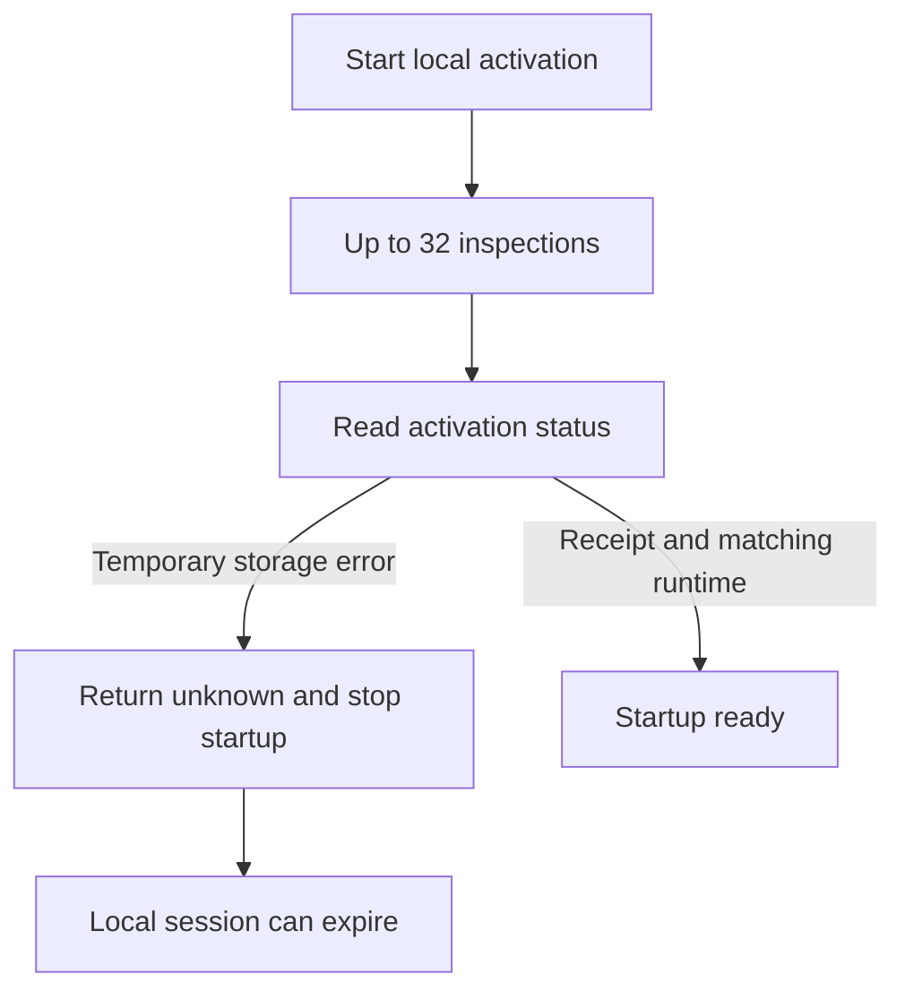
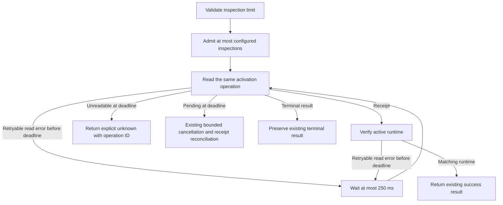

# Change Record: Limit manifest inspection pressure during local startup

| Field | Value |
| --- | --- |
| Status | Plan reviewed |
| Type | Bug fix |
| Primary issue | [#737](https://github.com/eirhop/favn/issues/737) |
| Pull request | Pending |
| Related work | Focused mitigation; does not close all of #737 |
| Affected areas | Local startup, orchestrator boot configuration, manifest inspection admission |
| Approved plan commit | Pending independent review |
| Last updated | 2026-09-18 |

## One-minute summary

Local startup abandons activation after one transient status-read failure. Up to
32 simultaneous inspections can compete with control-plane reads in a local
PostgreSQL pool whose default size is 10. This change gives developers a simple
inspection-concurrency environment setting, defaults local startup to four
inspections, and retries transient activation reads within the existing deadline.
It changes concurrency and recovery, so it needs an independently reviewed record.

## Impact

A developer can run `FAVN_MANIFEST_INSPECTION_CONCURRENCY=2 mix favn.dev` to reduce
inspection pressure without enlarging the database pool. A transient observation
failure no longer immediately tears down startup. Lower concurrency can make
large activations slower; it is a mitigation, not a guarantee of pool availability.

## Problem analysis

### Assumptions

- The agreed scope is the simple mitigation, not every acceptance criterion in #737.
- Four is a conservative initial local default, not a measured optimal capacity.
- Production keeps its current default of 32 and may opt into a lower limit.
- The setting caps concurrent inspections per orchestrator process, not database
  connections or concurrency across multiple control-plane nodes.

### Evidence

| Evidence | What it proves | What it does not prove |
| --- | --- | --- |
| `FavnLocal.Publication.await_activation/3` on main `5b0ea416` | All operation-read errors immediately return unknown; active-runtime reconciliation has the same behavior | The frequency of pool failures |
| `TargetCompatibilityPlanner` and orchestrator application | Per-plan concurrency and shared admission are fixed at 32 | That this alone causes prolonged connection occupancy |
| `FavnLocal.Config` | Local database pool defaults to 10 | A universally safe inspection-to-connection ratio |
| Issue #737 observations | Pool pressure and later local-session fencing occurred | Which application work occupied connections longest |
| Existing admission and activation recovery tests | Admission reclaims exited owners; unresolved inspection decisions can be resolved by later activation | Constrained-pool throughput at the new default |

## Current behavior

## Approved plan

Validate `FAVN_MANIFEST_INSPECTION_CONCURRENCY` at boot as an integer from 1 to 32.
Local `mix favn.dev` defaults to 4; production defaults to 32. Invalid supplied
values fail startup with a safe configuration error. Carry the normalized value
through the existing runtime configuration into the shared inspection admission
process. Keep the existing per-plan ceiling of 32: the shared admission limit is
the actual cap, including concurrent plans. No new CLI flag or pool-size setting
is necessary; local database pool configuration already exists.

Retry only retryable persistence errors from operation-status reads and the
active-runtime read that verifies a committed receipt. Use the existing 250 ms
poll interval and original 330-second absolute deadline; do not reset the budget
or resubmit deployment. Keep polling in the existing supervised publication task.
Check the deadline on retry paths so sustained unavailability terminates. Preserve
an explicit unknown outcome when authoritative state cannot be read, including
the operation identity and initiating read error. Do not infer non-commit from
an unreadable status. Existing timeout cancellation still applies when a readable
operation remains pending. A receipt returned by cancellation must be reconciled
without creating an unbounded loop after deadline.

### Contracts and invariants

- The environment value is boot-frozen; changing it requires restart.
- The shared cap counts admitted inspection bodies and releases on completion or exit.
- Retries repeat reads only, preserving the exact workspace and operation identity.
- Non-retryable errors, cancellation, supersession, fencing, committed receipts,
  and unknown outcomes retain their meanings.
- No successful read is fabricated; unavailable inspection remains unresolved.
- Session renewal continues in its existing independent runtime task while the
  observer waits. This change does not guarantee renewal during sustained outage.
- The deadline bounds polling/retry scheduling, with existing individual storage
  call timeouts still applying; no new per-call cancellation mechanism is added.

### Scope and non-goals

Include local and production environment parsing, normalized runtime wiring,
focused behavioral tests, and canonical configuration/workflow documentation.
Do not change PostgreSQL transaction boundaries, pool size, deployment ownership,
lease duration, production defaults, inspection diagnostics, or the local ready
result shape. Full pool profiling, safe failure-category diagnostics, local
needs-attention presentation, and load qualification remain under #737.

### Implementation slices and complexity budget

Supporting lines include tests and canonical docs; exclude this record, generated
files, locks, and formatter-only changes. Explain overruns above the approved
upper estimate by more than 25 percent or 100 lines, whichever is smaller.

| Slice | Outcome and owner | Production added | Production deleted | Supporting added | Supporting deleted |
| --- | --- | ---: | ---: | ---: | ---: |
| 1 | Boot validation and shared inspection cap; Local and Orchestrator | 60-120 | 2-15 | 100-200 | 0-10 |
| 2 | Bounded activation observation; Local | 80-150 | 50-90 | 150-260 | 0-10 |

An internal activation-observer module may extract the existing polling loop to
allow deterministic callback-driven tests without booting a database. This is
one bounded operation observer, not a generic retry framework. Existing runtime
config owns the normalized cap; existing admission owns queues and cleanup.

## Operational design

### Failures and recovery

Invalid limits fail before runtime starts. A temporary retryable read error waits
and rereads; a non-retryable error returns immediately. Persistent unreadability
returns unknown at the deadline and must be reconciled using the operation ID.
A readable terminal failure remains a failure. Lower concurrency does not extend
the existing inspection budget, and operators may need to tune it for large
catalogs. Unresolved inspections still require a subsequent activation once their
cause is resolved.

### Logs and diagnostics

Expose the effective limit in existing production config diagnostics. Config
errors name only the setting and accepted range, not its arbitrary input. Do not
log every retry or add payload/credential-bearing diagnostics. Preserve existing
structured persistence errors and operation identities in observer results.

### Deployment, migration, and compatibility

No migrations or persisted-contract changes. Restart to apply configuration.
Production retains 32 unless overridden. Local users can explicitly set 32 to
restore old concurrency. Rollback restores the old immediate observer failure and
local concurrency default; it requires no data repair.

## Verification plan

| Acceptance criterion | Planned evidence | Owning layer |
| --- | --- | --- |
| Correct defaults, limits, invalid values, boot wiring | Local, production, runtime config tests | Local and Orchestrator |
| Shared cap across callers and progress after completion/crash | Admission tests with several blocked callers | Orchestrator |
| Temporary operation/runtime read failure then recovery | Deterministic observer tests; exact operation and receipt checks | Local |
| Persistent failure, non-retryable failure, pending timeout | Deadline, cancellation and unknown-outcome tests | Local |
| Cancellation receipt, supersession and terminal failures preserved | Observer boundary regressions | Local |
| Runtime remains responsive while observer waits | Focused regression with a supervised pending observer and runtime renewal handling; retain existing lifecycle tests | Local |
| Config/workflow discoverability | Canonical guides and Favn.AI routing review | Public docs |

Run owning-layer tests first, formatting, warnings-as-errors compilation and the
relevant broader CI checks. Review links and render record diagrams on GitHub.
Unit admission proof is not PostgreSQL load proof: this narrow PR does not claim
to resolve pool starvation or qualify a production-sized activation.

## Risks and open questions

| Risk | Impact | Mitigation |
| --- | --- | --- |
| Too little inspection concurrency | Activation may hit its existing deadline | Document tradeoff; allow 1..32 |
| Pool pressure persists | Status or renewal can still fail | Bounded read retries, explicit unknown, keep broader issue open |
| Retry accidentally repeats writes | Duplicate or ambiguous activation | Observer only retries reads; tests assert cancellation behavior |
| Deadline receipt loop | Observer could wait indefinitely | Explicit regression for receipt reconciliation after deadline |

## Plan review

| Field | Result |
| --- | --- |
| Reviewer | Independent agent `review_737` |
| Reviewed against | Issue #737, current source, tests and this plan |
| Findings | Existing lifecycle tests did not prove renewal while observation waits; require a focused regression. |
| Findings addressed and rechecked | Verification plan now explicitly requires a supervised pending-observer and renewal-handling regression; reviewer rechecked and accepted. |
| Verdict | Approved; no outstanding plan findings. |

## Implementation outcome

Pending.

## Deviations from the approved plan

None yet.

## Decision log

None yet.

## Verification evidence

Pending.

### Not verified

Live pool-load reproduction and production deployment are outside this focused mitigation.

## Final review

Pending independent comparison with the approved baseline.
