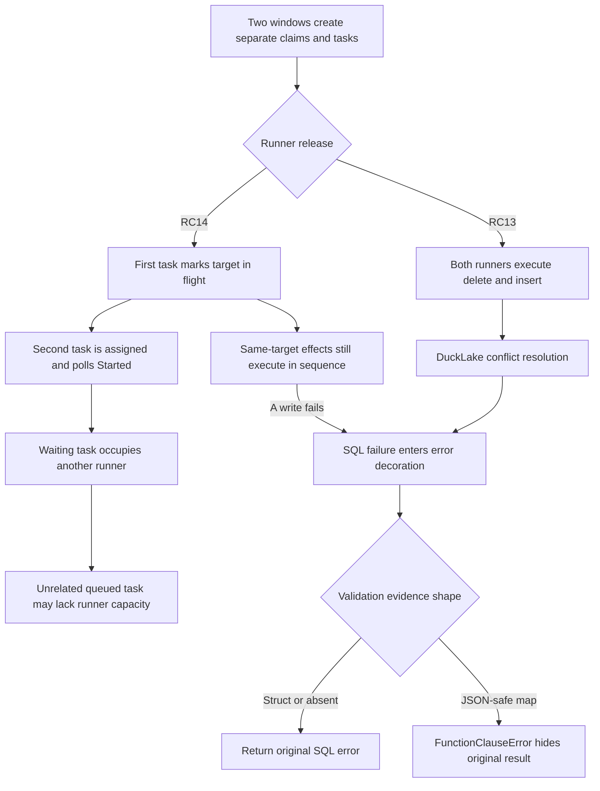
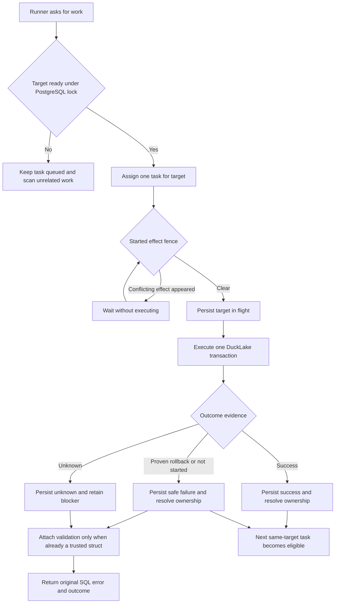

# Change Record: Preserve DuckLake errors and qualify target write coordination

| Field | Value |
| --- | --- |
| Status | Plan reviewed |
| Type | Bug fix |
| Primary issue | [#740](https://github.com/eirhop/favn/issues/740) |
| Pull request | Pending |
| Related work | RC14 target write ownership from issue #700 and PR #703 |
| Affected areas | Runner SQL error evidence, DuckDB ADBC integration, PostgreSQL-backed runner coordination, SQL runtime documentation |
| Approved plan commit | Pending — assigned after this reviewed plan is committed |
| Last updated | 2026-09-21 |

## One-minute summary

An RC13 deployment allowed two monthly `delete_insert` windows for one SQL target
to reach DuckLake concurrently. The backend result was then hidden by a second
runner exception while optional contract-validation evidence was being attached.
RC14 added a PostgreSQL-backed start barrier that prevents overlapping external
writes to one logical target, but a pre-admitted waiter can occupy another runner
and delay unrelated work. This change will make target readiness part of durable
claim selection while retaining `Started` as the final effect fence, preserve the
original SQL error, qualify the complete path against a real PostgreSQL-backed
DuckLake catalog, and document the supported concurrency boundary. Concurrency,
durable write outcomes, persistence queries, and deployment compatibility make
the work substantial enough to require an independent plan.

## Impact

For example, with two runners and queued tasks A1, A2, and B1, A1 and A2 target
table A while B1 targets table B. A1 may execute, A2 must remain queued, and B1
must use the second runner. After A1 settles, A2 becomes claimable. If DuckLake
rejects a write, the runner returns the original bounded SQL error and outcome
evidence instead of a `FunctionClauseError` from optional metadata decoration.

The observed deployment is RC13. This plan targets the current RC14 baseline and
does not make an RC13 runner safe for distributed same-target writes. Until a
later matched deployment containing the merged fix is qualified, RC13 operators
must prevent overlapping writes to one target while retaining concurrency across
unrelated targets. This PR targets `main`; it does not create or tag a new RC.

## Problem analysis

### Assumptions

- The issue occurred on a matched RC13 control plane, runner, manifest, and
  database rather than a mixed release.
- Both windows resolve to the same logical target in one workspace and therefore
  to the same managed physical relation. Cross-workspace or cross-control-plane
  writers to one physical relation are outside the current coordination key and
  remain an operational single-owner requirement.
- The supported runner image remains pinned to DuckDB and DuckLake 1.5.5. This
  change will not alter dependency or extension pins.
- The PostgreSQL `ducklake_snapshot_pkey` message records DuckLake's optimistic
  conflict detection. It does not identify the terminal outcome on its own.
- The hidden terminal result may have been a logical conflict or exhausted
  DuckLake retry budget. The surviving evidence cannot distinguish them.
- RC14's persisted target ownership is the intended distributed authority. SQL
  session pools and catalog `write_concurrency` limits remain runner-local
  capacity controls, not distributed correctness locks.
- Claim selection needs an additive partial index over nonterminal target-linked
  runner tasks. No table, persisted payload, command, or runner wire-contract
  version change is expected.

### Evidence

| Evidence | What it proves | What it does not prove |
| --- | --- | --- |
| [Issue #740](https://github.com/eirhop/favn/issues/740) | The observed RC13 scenario, visible exception, and required concurrency outcome | The hidden DuckLake terminal result |
| RC13-to-RC14 tag comparison | RC13 called `Started` once and had no durable `WriteOwnership`; RC14 added the wait and ownership lifecycle | That RC14 preserves runner capacity for unrelated targets |
| [`Favn.SQLAsset.Runtime`](../../../apps/favn_runner/lib/favn/sql_asset/runtime.ex) | Nested validation lookup may return a map, while metadata insertion accepts only a struct or `nil` | Which upstream error shape produced the map in the observed run |
| [`Favn.SQL.Adapter.DuckDB.ADBC`](../../../apps/favn_duckdb_adbc/lib/favn/sql/adapter/duckdb/adbc.ex) | `delete_insert` executes a windowed `DELETE` and an `INSERT` in one transaction | DuckLake's terminal choice for the lost run |
| [DuckLake conflict resolution](https://ducklake.select/docs/stable/duckdb/advanced_features/conflict_resolution) | Snapshot-key collisions start conflict resolution; delete-versus-insert changes on one table are logical conflicts | Favn's cross-runner coordination behavior |
| [`WriteOwnership`](../../../apps/favn_storage_postgres/lib/favn_storage_postgres/runner_tasks/write_ownership.ex) and [`RunnerAgent`](../../../apps/favn_runner/lib/favn_runner/runner_agent.ex) | RC14 serializes `Started` for unresolved writes to the same workspace target | Claim selection still assigns a same-target waiter before that barrier |
| [`RunnerTasks.Store`](../../../apps/favn_storage_postgres/lib/favn_storage_postgres/runner_tasks/store.ex) | Claim candidates are ordered by pool/release FIFO but do not exclude a target with assigned, preparing, running, or unknown work | That a blocked runner can claim another task |
| [`write_resolution_test.exs`](../../../apps/favn_storage_postgres/test/storage_v2/write_resolution_test.exs) | Pre-admitted same-target tasks wait and unknown outcomes remain blocked at `Started` | Progress for unrelated runner work; the test only acquires an unrelated target lock |
| Current DuckLake test search | Bootstrap races and adapter integration are covered, but no test combines runner ownership with concurrent PostgreSQL-backed DuckLake writes | Live Test-environment behavior |
| [Upgrade guide](../../production/upgrade_and_rollback.md) | RC14 task persistence adoption is breaking and mixed builds are unsupported | The operator's chosen Test rollout window |

## Current behavior

The observed RC13 path had no distributed start barrier. RC14 prevents concurrent
effects, but it can reserve all runner slots for same-target waiters before that
barrier. RC14 also still contains the error-decoration defect.

RC14 intentionally keeps claims window-scoped. Claims retain each window's
lifecycle and freshness identity; the separate target-write state controls when
an external effect may start. Collapsing claims to one target-wide identity would
mix these responsibilities and is not the proposed fix.

## Approved plan

Make target readiness and target-local ordering part of PostgreSQL runner-task
claim selection. Before the bounded candidate limit, the claim query retains only
the earliest eligible queued task for each workspace target within the requesting
runner's exact pool/release FIFO. It uses the same deployment-liveness, deadline,
supported-task-kind, and capability rules as normal claim eligibility. The query
also excludes that target while another task is assigned, preparing, running, or
cancelling, or while a claim/operation lock retains an `in_flight` or
`outcome_unknown` effect. This prevents a large group of blocked same-target tasks
from hiding eligible unrelated work.

Close concurrent-claimer races under the existing per-target transaction
advisory lock. After locking a candidate task row, try the target advisory without
waiting, recheck target readiness and the earliest-eligible condition, and skip
the candidate when another task/unresolved effect owns the target or an older
eligible same-target task remains queued. This closes the race where one claimer
locks older A1's row while another claimer reaches newer A2 and obtains the target
advisory first. A skipped task remains queued and unassigned; its deadline,
cancellation, deployment authority, demand count, and task identity remain under
their existing owners. PostgreSQL notifications remain hints, so a runner that
found only temporarily blocked work returns no assignment and uses the existing
bounded claim retry/wakeup path.

Keep RC14's `Started` ownership transition as the final distributed effect fence.
Claim filtering protects runner capacity and normal liveness; it does not replace
the safety check immediately before external execution. A task with an unknown
external outcome continues to block the target until authorized reconciliation.
Do not infer safe parallelism from different windows or logical partitions.

Add a partial index for nonterminal target-linked tasks, keyed by workspace,
target, pool, release, status, enqueue time, and task ID. It supports both live
reservation lookup and earliest-eligible target ordering. The migration is
additive and contains no data rewrite. Query-plan coverage must prove the bounded
claim path uses the new access path at representative queue size.

Make extraction of optional contract-validation evidence total without treating
an arbitrary nested map as trusted evidence. Preserve an existing
`%Favn.SQL.ContractValidation{}` only when reached through a known internal error
or checked-materialization shape. A map, malformed value, or unknown value is
omitted. Add a catch-all attachment clause so optional evidence can never replace
or mutate the primary SQL error, backend message, phase, transaction outcome,
write outcome, or retry disposition. Restoring serialized map evidence would
require a separately designed Core-owned decoder and known serializer boundary;
it is not required for this repair.

Add a production-shaped acceptance test using disposable Favn PostgreSQL state,
a PostgreSQL-backed DuckLake metadata catalog, the pinned ADBC driver/extension,
and separately registered runner processes with independent SQL sessions. Use
deterministic barriers and bounded assertions, not timing sleeps:

- with exactly two runner slots and FIFO tasks A1, A2, then B1, block A1 after it
  enters execution, prove A2 remains queued and unassigned, and prove B1 is
  claimed and finishes on the second runner;
- gate claimer C1 after it locks A1's row but before the target advisory, let C2
  lock A2 and perform the advisory-locked recheck, prove A2 cannot overtake A1,
  then release C1 and prove A1 is assigned first;
- release A1, then prove A2 is assigned and executes while the existing
  `Started` fence still prevents overlapping same-target effects;
- execute the real `delete_insert` transactions and verify final rows for both
  windows after serialized completion;
- run direct independent DuckLake transactions at a commit barrier to retain a
  real conflict or retry-exhaustion result without asserting a version-specific
  message; and
- feed the resulting bounded error shape through runner mapping and prove no
  optional evidence path can replace it with a framework exception.

The acceptance test must record `version()` and DuckLake extension settings in
its assertion context. It will exercise the supported 1.5.5 pin; an upstream
report against 1.5.4 is motivation for stress coverage, not evidence for changing
the current retry configuration.

### Contracts and invariants

- At most one runner-managed external write may be `in_flight` for a workspace
  target, regardless of window, claim key, runner process, or assignment.
- At most one nonterminal runner task for a workspace target may be assigned,
  preparing, running, or cancelling. Other tasks for that target remain queued.
- Unrelated workspace targets and separate catalogs remain eligible for parallel
  execution; this change must not introduce a global DuckLake single-writer lock.
- A target-blocked task has no assignment or assignment lease. It keeps its task
  identity, attempt number, deadline, claim fence, queue age, and demand count.
- Claim selection remains FIFO among eligible tasks in one pool/release. A task
  blocked by target readiness is ineligible until the current reservation
  settles; later unrelated eligible work may pass it. A newer eligible task for
  the same target and exact pool/release cannot overtake an older one, including
  when concurrent claimers hold different candidate row locks.
- Healthy contention does not consume an execution attempt or fail a sibling.
- An `outcome_unknown` effect never permits automatic retry or a replacement
  writer. Lease expiry, disconnect, cancellation, or process death is not proof
  that the external write had no effect.
- Favn may retry reads and RC14's pre-execution ownership request. It must not
  replay a DuckLake transaction unless no effect is durably proven.
- DuckLake's own in-transaction metadata retry remains authoritative for
  compatible commits. Favn does not parse one snapshot-key log line as failure.
- Optional evidence attachment is total. Invalid evidence may be omitted, but
  the primary error and safe lifecycle outcome must remain intact.
- This repair does not reconstruct a validation struct from a map or call
  `String.to_atom/1`. It does not persist arbitrary exceptions, SQL text,
  credentials, or data.
- The test suite must prove persisted runner task, materialization claim, target
  effect, resource outcome, and run event state converge after completion.

### Scope

- Add target-aware earliest-eligible claim selection, final advisory-locked
  readiness/FIFO recheck, an additive partial index, query-plan coverage, and
  focused concurrent-claimer tests.
- Preserve only trusted struct contract-validation evidence in runner SQL failure
  metadata, with a final defensive fallback that preserves the primary error.
- Add focused runner regressions for trusted structs, atom-keyed maps,
  string-keyed maps, malformed values, and known internal error/cause paths;
  every map case asserts omission and an unchanged primary result.
- Add real PostgreSQL-backed DuckLake concurrency qualification for current
  target ownership and different-target progress.
- Retain and exercise existing success, safe-failure, timeout, runner-loss, and
  unknown-outcome persistence tests at their owning layers.
- Document distributed target coordination, compatible catalog concurrency, and
  retry/unknown boundaries in the canonical SQL runtime and public retry guides.
- Record RC13 containment and the compatibility boundary for any later
  deployment of the merged change.

### Non-goals

- Do not change materialization claim identity from window-scoped to target-scoped.
- Do not add a second write-lock table or adapter-specific distributed lock.
- Do not replace PostgreSQL claim selection with a central in-memory dispatcher.
- Do not globally serialize a DuckLake catalog.
- Do not add same-target append concurrency or infer disjoint files from windows.
- Do not automatically retry a logical conflict, timeout, commit failure, or
  unknown write outcome.
- Do not change DuckDB, DuckLake, ADBC, or Favn dependency pins or retry defaults.
- Do not backport RC14 persistence and ownership contracts into RC13.
- Do not coordinate separate workspaces or control planes that alias one physical
  relation; deployments must retain one authoritative writer for that relation.
- Do not add production-only test hooks or arbitrary SQL/error payload logging.
- Do not reconstruct contract-validation structs from recursively discovered maps.

### Implementation slices

| Slice | Outcome | Owner or area | Depends on |
| --- | --- | --- | --- |
| 1 | Target-blocked tasks remain queued while eligible unrelated tasks use runner capacity | PostgreSQL runner-task claim and migration | Existing RC14 ownership |
| 2 | Validation maps are omitted without changing the original error; trusted structs remain | Runner SQL runtime | None |
| 3 | Real DuckLake tests prove same-target serialization, different-target progress, final rows, and preserved backend errors | Local acceptance, PostgreSQL storage test support, DuckDB ADBC integration | Slices 1-2 |
| 4 | Canonical and public docs describe claim eligibility, effect fencing, retry, and release boundaries | Runner architecture, SQL runtime, and retry documentation | Verified behavior from slices 1-3 |

### Complexity budget

Supporting lines include tests, test-only fixtures/configuration, and canonical
documentation. Exclude this record, generated docs, dependency locks, vendored
code, and formatter-only changes. Explain any category exceeding its upper bound
by more than 25 percent or 100 lines, whichever is smaller.

| Slice | Production added | Production deleted | Supporting added | Supporting deleted | Main reason for the size |
| --- | ---: | ---: | ---: | ---: | --- |
| 1 | 70-170 | 0-30 | 180-430 | Target-ready/FIFO SQL filter, advisory-locked final check, additive index migration, concurrency, lifecycle and query-plan proof |
| 2 | 10-35 | 0-15 | 60-140 | Trusted-struct selection, defensive no-op, and unchanged-error regressions |
| 3 | 0-15 | 0-10 | 260-500 | Disposable PostgreSQL/DuckLake setup, two-runner barriers, lifecycle assertions, and repeated stress |
| 4 | 0 | 0 | 50-120 | Canonical claim/fence explanation plus public retry/operation guidance |

Slice 1 does not introduce a reservation table or new task state. The existing
nonterminal runner task is the dispatch reservation; the existing materialization
claim or target-operation lock remains the effect owner. Slice 3 permits only
test-only dependency or fixture wiring in production-owned configuration files.
Any need for a new persisted state, table, runner message, or protocol version is
a plan deviation requiring review before implementation continues.

### Implementation map

| Concept | Expected code area | Responsibility |
| --- | --- | --- |
| Claim eligibility | `apps/favn_storage_postgres/lib/favn_storage_postgres/runner_tasks/store.ex` | Select the earliest eligible task per target before the batch limit and recheck readiness/FIFO under the target advisory lock |
| Target reservation query | `apps/favn_storage_postgres/lib/favn_storage_postgres/runner_tasks/write_ownership.ex` | Answer whether another active task or unresolved effect owns the target without changing effect state |
| Claim access path | `apps/favn_storage_postgres/lib/favn_storage_postgres/migrations/` | Add and remove the partial nonterminal target-task index |
| Optional evidence selection | `apps/favn_runner/lib/favn/sql_asset/runtime.ex` | Return an existing trusted validation struct or no optional evidence; never raise over the primary error |
| Focused evidence regressions | `apps/favn_runner/test/execution/` | Cover trusted structs, omitted maps/invalid values, known nesting, and preserved SQL outcomes |
| Distributed start authority | Existing `apps/favn_storage_postgres/lib/favn_storage_postgres/runner_tasks/write_ownership.ex` | Remain the only durable same-target effect guard |
| Runner waiting | Existing `apps/favn_runner/lib/favn_runner/runner_agent.ex` | Wait before executor start while retaining assignment and manifest lease |
| Cross-app qualification | `apps/favn_local/test/` acceptance tier and shared test support | Run independent runners and real ADBC sessions against disposable PostgreSQL/DuckLake |
| Backend conflict qualification | `apps/favn_duckdb_adbc/test/` integration tier | Capture pinned-version conflict/retry behavior without defining Favn replay policy from message text |
| Canonical behavior | `docs/structure/favn_sql_runtime.md` | Explain runner-local catalog limits versus distributed target ownership |
| Runner queue behavior | `docs/architecture/elastic-runners.md` and PostgreSQL storage docs | Define target readiness and FIFO among eligible tasks |
| Public failure guidance | `apps/favn/guides/retries-and-replay.md` | Explain same-target waiting, unrelated concurrency, and unknown-outcome prohibition |

## Operational design

### Failures and recovery

A healthy same-target reservation keeps later tasks queued, where existing
deadline, cancellation, deployment, retention, demand, and claim-wakeup behavior
continues to apply. It does not create an assignment lease or occupy a runner.
Concurrent claimers use a nonblocking target advisory and may temporarily return
no work; normal bounded polling and wakeups retry from PostgreSQL. Success or a
proven no-effect failure resolves ownership and makes the next target task
eligible. Timeout, disconnect, lost completion, or ambiguous commit retains
`outcome_unknown`; only the existing evidence-backed administrator recovery may
clear it.

Queued cancellation makes that task ineligible and cannot reserve its target.
Assigned or preparing expiry follows existing recovery to requeue or terminal
settlement before the reservation disappears. Cancellation before `Started`
unblocks only after its unstarted ownership is durably settled. `cancelling`
remains a reservation until settlement. Running expiry or runner loss preserves
an unknown effect and continues blocking new target assignments. The claim filter
reads these existing states; it does not invent a second cleanup lifecycle.

Map-shaped or invalid optional contract evidence is dropped. The original
redacted SQL error and its phase/outcome fields continue through runner result
persistence. The normal error remains non-retryable or unknown according to its
existing result; evidence selection does not alter retry classification.

If compatible different-target commits exhaust DuckLake's internal retry budget
under the pinned build, retain the failure evidence and open a separately
reviewed capacity decision. Possible follow-up choices include measured DuckLake
retry tuning or a distributed per-catalog semaphore with a limit greater than
one. Neither is justified by the current evidence, and neither belongs in this
repair.

### Logs and diagnostics

Use existing runner task, admission, run event, and SQL error surfaces. Normal
same-target contention remains a queue/admission state rather than warning spam.
Persist stable task, run, target, assignment, phase, transaction outcome, write
outcome, and bounded backend class/message fields already allowed by the result
contract. Never log credentials, connection strings, arbitrary SQL, row values,
private paths, or the raw invalid evidence map.

The acceptance test may print pinned component versions and anonymized counts or
durations. It must not print populated environment values or catalog credentials.

### Deployment, migration, and compatibility

The planned additive migration creates one partial runner-task index and its
rollback drops that index. It does not rewrite task rows or change stored values.
Apply it through the normal drained control-plane upgrade before starting the
new build; large-table lock duration and index creation time must be measured in
the PostgreSQL integration/load tier. No runner wire version is planned. This PR
merges code, tests, the migration, and documentation to `main`; creating or
tagging a release is outside its scope. Any later deployment must use compatible
control-plane, runner, manifest, and database artifacts rather than combining a
runner containing this change with an RC13 control plane or database.

An existing RC14 database can contain more than one assigned, preparing, or
running task for a target because the previous claim path allowed pre-admission.
The new index is intentionally nonunique and tolerates that state. New target
claims remain blocked while those tasks drain or recover; the existing `Started`
fence serializes their external effects. The new one-active-reservation invariant
applies to claims committed by the upgraded control plane, without rewriting or
silently cancelling earlier tasks.

An RC13-to-current Test upgrade must follow the existing breaking task-persistence
adoption: stop writers, establish external outcomes, preserve the old control
database, bootstrap a matching fresh control-plane database, republish the
workspace/manifest, and start matched runner capacity. Consumer DuckLake data is
not deleted or rolled back by resetting Favn control state. Rollback restores the
previous matched image and its separate compatible control database; it does not
replay uncertain writes.

Until rollout, prevent overlapping same-target windows in RC13 at the submission
or deployment level. A runner-local catalog limit is not sufficient across
multiple runners. Unrelated targets may continue in parallel.

## Verification plan

| Acceptance criterion | Planned evidence | Owning layer |
| --- | --- | --- |
| Struct validation evidence remains unchanged | Focused success and failure tests | Runner |
| Atom-keyed and string-keyed maps cannot raise and are not trusted | Focused nested error/cause tests assert omission and unchanged primary result | Runner |
| Invalid or unknown values are omitted without atom creation | Negative/boundary tests; no map decoder in this repair | Runner |
| Original backend message, phase, transaction/write outcome, and retry disposition survive | Runner result assertions using bounded representative and captured DuckLake errors | Runner |
| A blocked same-target task does not reserve a runner | Exactly two runners; FIFO A1, A2, B1; hold A1, assert A2 queued/unassigned and B1 executing | Storage and Local acceptance |
| Concurrent claims cannot assign two tasks for one target | PostgreSQL barrier around claim selection with independent claimers and final advisory recheck | Storage |
| A newer same-target task cannot overtake a locked older row | Gate C1 after locking A1 before advisory; let C2 recheck A2; assert A2 stays queued and A1 assigns first | Storage |
| More than one claim batch of blocked tasks cannot hide unrelated work | Queue more than 50 blocked same-target tasks ahead of B1 and prove B1 is surfaced | Storage |
| Target-ready lookup stays indexed | Representative `EXPLAIN` assertion and performance contract using the partial index | Storage |
| Cancellation and expiry update target eligibility correctly | Matrix for queued cancellation, assigned/preparing expiry, pre-Started settlement, cancelling, running expiry, and runner loss | Storage |
| Two same-target `delete_insert` tasks never enter external execution together | Release A1, assert A2 then enters; `Started` remains final fence | Local acceptance and Storage |
| Both windows produce correct final rows | Real PostgreSQL-backed DuckLake materialization and final relation query | DuckDB ADBC acceptance |
| A different target progresses while one target is held | Exactly-two-runner barrier with catalog admission at least two and explicit entry events | Local acceptance |
| Compatible different-table and separate-catalog writes retain concurrency | Real independent sessions with bounded barriers | DuckDB ADBC acceptance |
| A real concurrent backend conflict is returned rather than masked | Direct two-session commit barrier plus runner mapping regression | DuckDB ADBC and Runner |
| Safe failure releases ownership; timeout, runner loss, and unknown outcome do not | Existing and focused write-resolution/crash-recovery tests | PostgreSQL Storage |
| Claims, tasks, target effects, resource outcomes, and run events converge | Bounded authoritative PostgreSQL assertions after success and failure | Storage and Orchestrator |
| Timing-sensitive paths remain stable | Repeated focused test under several runner counts; no unbounded sleeps | Acceptance |
| Current versions are explicit | Test assertion context records DuckDB version and DuckLake extension settings | DuckDB ADBC |
| Documentation states the tested boundary | Link and render review plus `git diff --check` | Documentation |

Run the narrow runner tests first, the DuckDB ADBC integration tier, the
PostgreSQL storage tests using the documented disposable database, and the local
acceptance test. Then run formatting, warnings-as-errors compilation, tag-tier
validation, the umbrella fast suite, and relevant acceptance/slow checks. The
record and Mermaid diagrams require local syntax/link review before commit and
GitHub rendering review after the draft PR exists.

Source inspection and storage-only tests do not constitute a live DuckLake or
deployed multi-node proof. The acceptance test qualifies isolated processes and
the pinned backend; Test-environment rollout remains a separate operational gate.

## Risks and open questions

| Risk or question | Impact | Mitigation or decision needed |
| --- | --- | --- |
| Map-shaped validation evidence is omitted | Optional schema detail may be absent on a failure | Preserve the complete primary error; a trusted Core decoder is separate future work |
| Test barriers validate mocks rather than the real boundary | False confidence in DuckLake behavior | Use a thin test-only entry barrier around real ADBC plus a direct real-commit barrier |
| Claim filter races another claimer | Two tasks for one target become assigned | Nonblocking per-target advisory plus a readiness recheck after candidate row lock |
| More than 50 blocked tasks hide unrelated work | Runner reports no work despite eligible capacity | Exclude blocked targets in SQL before the existing candidate limit and test an over-limit queue |
| Target readiness query becomes a hot scan | Claim latency and PostgreSQL load grow with history | Partial nonterminal target index, `EXPLAIN` contract, and representative load test |
| Target-aware eligibility weakens FIFO expectations | Later unrelated work passes an older blocked task | Define FIFO among currently eligible pool/release tasks; retain original queue age when target becomes ready |
| Concurrent row locks invert same-target FIFO | A2 is assigned while older A1 remains queued | Require earliest eligible task in the pre-limit query and advisory-locked recheck; deterministic race test |
| Additive index migration holds locks too long | Control-plane upgrade exceeds drain window | Measure populated-table migration; document normal drained upgrade and reversible index rollback |
| Upgrade starts with several active tasks for one target | A unique index or immediate invariant check would fail, or work could be cancelled unsafely | Use a nonunique partial index; block new claims and let existing tasks drain/recover behind the `Started` fence |
| DuckLake 1.5.5 exhausts retries for different tables | Horizontal scale produces avoidable failures | Repeat stress, retain exact bounded result, and treat tuning/global capacity as separate evidence-driven work |
| Physical aliases use different workspace target IDs | Current fence cannot detect a shared relation | Preserve one authoritative workspace/control-plane writer; broader physical identity is out of scope |
| RC13 containment is mistaken for a durable fix | Multiple RC13 runners can race again | State the limitation prominently and require a later compatible deployment containing the merged fix |
| Breaking RC14 persistence adoption loses causal evidence | Operators may reset control state before external outcome is known | Follow the upgrade guide: stop writers, establish outcomes, preserve the old database, then bootstrap |

## Plan review

| Field | Result |
| --- | --- |
| Reviewer | Independent agent `review_issue_740_plan` |
| Reviewed against | Issue #740, RC13/RC14 tag diff, current source/tests, DuckLake documentation, and this plan |
| Findings | Initial review found two blockers: the RC14 `Started` fence preserves effect safety but lets a same-target waiter consume runner capacity, and arbitrary nested validation maps lack trustworthy provenance. It also found an incorrect safe-failure diagram. First recheck accepted those corrections, then found a same-target FIFO race between candidate row locking and the target advisory plus missing direct cancellation/expiry coverage. |
| Findings addressed and rechecked | Added earliest-eligible target selection before the candidate limit and under the advisory, deterministic A1/A2 row-lock race coverage, target reservation lifecycle tests, pre-upgrade duplicate-state handling, a nonunique partial index and larger supporting-test budget. Map omission, the defensive attachment fallback, outcome branches, exactly-two-runner progress, and over-50-candidate proof remain. The reviewer rechecked the complete corrected record. |
| Verdict | Approved with no remaining findings. Approval covers the planning record only; implementation, tests, rendered GitHub diagrams, and live Test rollout remain unverified. |

After approval, commit the reviewed plan as the baseline. Record that commit in
the immediate PR-number update; the record cannot name its own commit beforehand.

## Implementation outcome

Pending implementation.

### Actual scope and complexity

- Files and ownership areas changed: Pending.
- Ownership boundaries affected: Pending.
- Implementation complexity: Pending.
- Operational complexity: Pending.
- Canonical documentation updated: Pending.
- Actual additions, deletions, and supporting lines per approved slice: Pending.

## Deviations from the approved plan

Pending implementation.

## Decision log

Pending implementation.

## Verification evidence

| Check | Result | Evidence boundary |
| --- | --- | --- |
| Focused and broader verification | Pending implementation | No implementation claim yet |

### Not verified

- Implementation behavior and tests.
- Live Test-environment rollout.
- Multi-host runner behavior outside the planned isolated-process acceptance test.
- Production-scale DuckLake throughput or retry tuning.

## Final review

| Field | Result |
| --- | --- |
| Reviewer | Pending implementation reviewer |
| Compared | Approved plan, implementation, tests, diagnostics, and docs |
| Deviations complete | Pending |
| Findings | Pending |
| Findings addressed and rechecked | Pending |
| Verdict | Pending |
