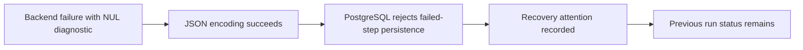
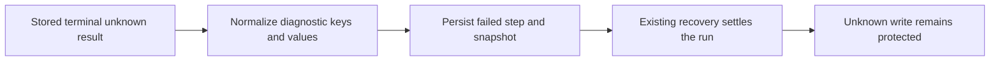

# Change Record: Persist backend diagnostics safely in PostgreSQL

| Field | Value |
| --- | --- |
| Status | Implementing |
| Type | Bug fix |
| Primary issue | [#745](https://github.com/eirhop/favn/issues/745) |
| Pull request | [#746](https://github.com/eirhop/favn/pull/746) |
| Related work | [#740](https://github.com/eirhop/favn/issues/740) |
| Affected areas | Orchestrator diagnostic codecs; PostgreSQL error mapping and regression tests |
| Approved plan commit | `bda3dd60` |
| Last updated | 2026-09-22 |

## One-minute summary

A backend failure can contain NUL bytes that prevent Favn from saving the failed
step, leaving its parent run looking active. Make diagnostic keys and values
safe for PostgreSQL JSONB and retain a useful, safe database error classification.
Keep recovery behavior unchanged unless a focused regression demonstrates a
separate defect. This small fix has a record because it affects persisted
diagnostics and crosses the orchestrator/PostgreSQL boundary.

## Problem analysis

The user reports that the triggering TLS failure came from setting DuckDB's
`curl` option on only the first connection; using `SET GLOBAL` makes later
connections inherit it. That configuration explanation is not independently
verified here and its repair is outside this change. Favn must persist backend
errors regardless of their cause.

Inspection and isolated probes at `f92762c7` established:

| Evidence | Finding | Limit |
| --- | --- | --- |
| `JsonSafe` and actual `RunEventCodec` probe | Nested NUL values remain escaped NUL in JSON; unknown outcome survives | PostgreSQL rejection was reproduced in the issue, not rerun during this investigation |
| Diagnostic-key probe | NUL keys survive; invalid UTF-8 keys fail Jason encoding | No snapshot or recovery integration probe yet |
| `ErrorMapper` | The rejection falls through to a generic internal error | No actionable database classification survives |
| Independent compiled-source round-trip probe | Re-normalizing decoded runner errors drops `outcome`, `retryable`, and `phase` | Codec defect; does not establish a lifecycle defect |
| `RecoveryAttention` and `Execution.stop_for_recovery/1` | Attention updates metadata without changing run status; local shutdown retains durable tasks and leases | Does not prove post-upgrade recovery convergence |

## Current behavior

## Proposed plan

Normalize diagnostic text at the existing shared codec boundary. Use bounded,
deterministic text representations for NUL-containing and invalid UTF-8 values
and keys, preserving ordinary Unicode. Normalize keys before constructing the
output map. If multiple keys normalize to the same key, replace their values
with the fixed text `[DIAGNOSTIC KEY COLLISION]`. This deliberately loses the
ambiguous values instead of silently selecting one; it is bounded, independent
of input order, and stable on a second pass. Preserve existing redaction before
representation changes; normalization must be stable when persisted diagnostics
are decoded and encoded again. Explicitly preserve existing `outcome`, `retryable`,
and `phase` fields in the decoded string-keyed error path, including `false` and
errors without an optional reason. Do not introduce a general serialization framework.

Add a narrow mapping for Postgrex `:untranslatable_character` (SQLSTATE `22P05`)
using an allowlisted
classification, without copying database messages, SQL, parameters, or payloads.
Keep the failure non-retryable. No schema or typed runner-result format change.

The proposed recovery outcome is a test requirement, not an established result.
There is no automatic retry of the backend write, no conversion of unknown to
confirmed rollback, and no change to sibling execution or concurrency policy.

### Scope and complexity budget

| Slice | Owner and outcome | Production added | Production deleted | Supporting added | Supporting deleted |
| --- | --- | ---: | ---: | ---: | ---: |
| 1 | `JsonSafe`: safe keys/values, preserved error classification on round-trip, codec/PostgreSQL coverage | 20–70 | 5–25 | 80–160 | 0–15 |
| 2 | `ErrorMapper`: safe rejection classification and tests | 5–15 | 0–5 | 15–35 | 0–5 |
| 3 | Existing PostgreSQL recovery fixtures: one regression and operator guidance | 0 | 0 | 80–180 | 0–10 |

Supporting lines include tests, fixtures, and canonical documentation. Exclude
this record, generated files, and formatting. Explain overruns exceeding the
smaller of 25% of an upper estimate or 100 lines, and materially fewer deletions.
Reuse existing fixtures; no new recovery subsystem, states, retries, migrations,
runner connection configuration, or demand-accounting redesign is planned.

If the recovery regression fails after normalization, report the concrete
failure and propose a separately reviewed follow-up. Do not silently expand
this fix or claim that all of #745 is resolved.

## Verification and operations

1. Test nested ADBC-shaped diagnostics through the actual event and snapshot
   codecs and real disposable PostgreSQL. Include NUL keys and values, invalid
   UTF-8, ordinary Unicode, length/depth bounds, sensitive-key redaction, key
   escaped/literal and truncated-key collisions, and decode/normalize/re-encode
   stability. Assert the actual snapshot codec preserves `outcome: unknown`,
   `retryable: false`, and `phase` through decode and re-encode, with and without
   an optional reason, including decoded asset/node error maps.
2. Test the narrow database classification and absence of raw database text,
   SQL parameters, or customer diagnostics in the mapped error.
3. Using existing PostgreSQL integration fixtures, persist a terminal unknown
   runner result with the offending diagnostic and a preceding active run
   checkpoint. Recover in a fresh RunServer process, verify the failed step and
   parent settle, execution leases settle, the backend write is not dispatched
   again, and a seeded, nonempty durable unknown-write guard remains unchanged
   before and after recovery, and replacement admission stays blocked. Execution
   lease settlement must not remove that guard; an absent guard cannot satisfy
   the test. Include an active
   sibling: it must remain intact; demand reaches zero only when all work is no
   longer runnable. This is a regression test, not a lifecycle implementation slice.
4. Run owning-layer tests first, then applicable repository format, compile,
   test-tier and CI checks. Record automated proof separately from live evidence.

No data migration is expected: typed stored runner results retain the original
diagnostic. Verify this through the recovery fixture before documenting that an
upgrade repairs existing runs. Add the verified operator procedure and its
limits to the [PostgreSQL operator runbook](../../production/postgresql_operator_runbook.md).
Use supported recovery and write-reconciliation workflows; no raw status edits
or automatic reruns of unknown writes. If recovery does not converge, retain
the attention state and document the follow-up requirement. Rollback can restore
the encoding defect for later errors; this change does not authorize data repair.

## Risks and open questions

- Key encoding must preserve redaction and have deterministic collision handling.
- Repeated normalization must not grow escaped text or change snapshot identity.
- Existing recovery may need a separate correction; the regression decides that.
- The issue's broader lifecycle acceptance criteria remain open unless proven by
  the narrow fix. No live-environment repair or TLS configuration proof is claimed.

## Plan review

| Field | Result |
| --- | --- |
| Reviewer | Astra (`gpt-6-astra`), xhigh reasoning |
| Reviewed against | Issue #745, current source and tests, this plan, agreed narrow scope |
| Findings and recheck | Two P2 findings addressed: preserve decoded error classification; choose a collision policy. Astra reread the amended record and accepted both corrections, plus explicit guard/admission assertions. |
| Verdict | Approved; no remaining blocking findings. Plan only: PostgreSQL recovery and existing-run repair remain unproven until implementation tests. |

The reviewer also emphasized combining sensitive keys with collision cases in
the planned redaction and second-pass stability tests.

## Implementation outcome

Not started. This request covers the planning record and independent review.
Before implementation, publish the reviewed baseline and open the required draft
PR. Record actual changes, deviations, size, verification, and independent final
review here without rewriting the approved plan.
