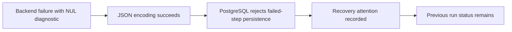
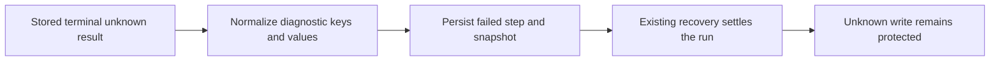

# Change Record: Persist backend diagnostics safely in PostgreSQL

| Field | Value |
| --- | --- |
| Status | Implemented |
| Type | Bug fix |
| Primary issue | [#745](https://github.com/eirhop/favn/issues/745) |
| Pull request | [#746](https://github.com/eirhop/favn/pull/746) |
| Related work | [#740](https://github.com/eirhop/favn/issues/740) |
| Affected areas | Orchestrator diagnostic codecs; PostgreSQL error mapping and regression tests |
| Approved plan commit | `bda3dd60` |
| Last updated | 2026-09-22 |

## One-minute summary

A backend failure can contain NUL bytes that prevent Favn from saving the failed
step, leaving its parent run looking active. Make diagnostic keys and values
safe for PostgreSQL JSONB and retain a useful, safe database error classification.
Keep recovery behavior unchanged unless a focused regression demonstrates a
separate defect. This small fix has a record because it affects persisted
diagnostics and crosses the orchestrator/PostgreSQL boundary.

## Problem analysis

The user reports that the triggering TLS failure came from setting DuckDB's
`curl` option on only the first connection; using `SET GLOBAL` makes later
connections inherit it. That configuration explanation is not independently
verified here and its repair is outside this change. Favn must persist backend
errors regardless of their cause.

Inspection and isolated probes at `f92762c7` established:

| Evidence | Finding | Limit |
| --- | --- | --- |
| `JsonSafe` and actual `RunEventCodec` probe | Nested NUL values remain escaped NUL in JSON; unknown outcome survives | PostgreSQL rejection was reproduced in the issue, not rerun during this investigation |
| Diagnostic-key probe | NUL keys survive; invalid UTF-8 keys fail Jason encoding | No snapshot or recovery integration probe yet |
| `ErrorMapper` | The rejection falls through to a generic internal error | No actionable database classification survives |
| Independent compiled-source round-trip probe | Re-normalizing decoded runner errors drops `outcome`, `retryable`, and `phase` | Codec defect; does not establish a lifecycle defect |
| `RecoveryAttention` and `Execution.stop_for_recovery/1` | Attention updates metadata without changing run status; local shutdown retains durable tasks and leases | Does not prove post-upgrade recovery convergence |

## Current behavior

## Proposed plan

Normalize diagnostic text at the existing shared codec boundary. Use bounded,
deterministic text representations for NUL-containing and invalid UTF-8 values
and keys, preserving ordinary Unicode. Normalize keys before constructing the
output map. If multiple keys normalize to the same key, replace their values
with the fixed text `[DIAGNOSTIC KEY COLLISION]`. This deliberately loses the
ambiguous values instead of silently selecting one; it is bounded, independent
of input order, and stable on a second pass. Preserve existing redaction before
representation changes; normalization must be stable when persisted diagnostics
are decoded and encoded again. Explicitly preserve existing `outcome`, `retryable`,
and `phase` fields in the decoded string-keyed error path, including `false` and
errors without an optional reason. Do not introduce a general serialization framework.

Add a narrow mapping for Postgrex `:untranslatable_character` (SQLSTATE `22P05`)
using an allowlisted
classification, without copying database messages, SQL, parameters, or payloads.
Keep the failure non-retryable. No schema or typed runner-result format change.

The proposed recovery outcome is a test requirement, not an established result.
There is no automatic retry of the backend write, no conversion of unknown to
confirmed rollback, and no change to sibling execution or concurrency policy.

### Scope and complexity budget

| Slice | Owner and outcome | Production added | Production deleted | Supporting added | Supporting deleted |
| --- | --- | ---: | ---: | ---: | ---: |
| 1 | `JsonSafe`: safe keys/values, preserved error classification on round-trip, codec/PostgreSQL coverage | 20–70 | 5–25 | 80–160 | 0–15 |
| 2 | `ErrorMapper`: safe rejection classification and tests | 5–15 | 0–5 | 15–35 | 0–5 |
| 3 | Existing PostgreSQL recovery fixtures: one regression and operator guidance | 0 | 0 | 80–180 | 0–10 |

Supporting lines include tests, fixtures, and canonical documentation. Exclude
this record, generated files, and formatting. Explain overruns exceeding the
smaller of 25% of an upper estimate or 100 lines, and materially fewer deletions.
Reuse existing fixtures; no new recovery subsystem, states, retries, migrations,
runner connection configuration, or demand-accounting redesign is planned.

If the recovery regression fails after normalization, report the concrete
failure and propose a separately reviewed follow-up. Do not silently expand
this fix or claim that all of #745 is resolved.

## Verification and operations

1. Test nested ADBC-shaped diagnostics through the actual event and snapshot
   codecs and real disposable PostgreSQL. Include NUL keys and values, invalid
   UTF-8, ordinary Unicode, length/depth bounds, sensitive-key redaction, key
   escaped/literal and truncated-key collisions, and decode/normalize/re-encode
   stability. Assert the actual snapshot codec preserves `outcome: unknown`,
   `retryable: false`, and `phase` through decode and re-encode, with and without
   an optional reason, including decoded asset/node error maps.
2. Test the narrow database classification and absence of raw database text,
   SQL parameters, or customer diagnostics in the mapped error.
3. Using existing PostgreSQL integration fixtures, persist a terminal unknown
   runner result with the offending diagnostic and a preceding active run
   checkpoint. Recover in a fresh RunServer process, verify the failed step and
   parent settle, execution leases settle, the backend write is not dispatched
   again, and a seeded, nonempty durable unknown-write guard remains unchanged
   before and after recovery, and replacement admission stays blocked. Execution
   lease settlement must not remove that guard; an absent guard cannot satisfy
   the test. Include an active
   sibling: it must remain intact; demand reaches zero only when all work is no
   longer runnable. This is a regression test, not a lifecycle implementation slice.
4. Run owning-layer tests first, then applicable repository format, compile,
   test-tier and CI checks. Record automated proof separately from live evidence.

No data migration is expected: typed stored runner results retain the original
diagnostic. Verify this through the recovery fixture before documenting that an
upgrade repairs existing runs. Add the verified operator procedure and its
limits to the [PostgreSQL operator runbook](../../production/postgresql_operator_runbook.md).
Use supported recovery and write-reconciliation workflows; no raw status edits
or automatic reruns of unknown writes. If recovery does not converge, retain
the attention state and document the follow-up requirement. Rollback can restore
the encoding defect for later errors; this change does not authorize data repair.

## Risks and open questions

- Key encoding must preserve redaction and have deterministic collision handling.
- Repeated normalization must not grow escaped text or change snapshot identity.
- Existing recovery may need a separate correction; the regression decides that.
- The issue's broader lifecycle acceptance criteria remain open unless proven by
  the narrow fix. No live-environment repair or TLS configuration proof is claimed.

## Plan review

| Field | Result |
| --- | --- |
| Reviewer | Astra (`gpt-6-astra`), xhigh reasoning |
| Reviewed against | Issue #745, current source and tests, this plan, agreed narrow scope |
| Findings and recheck | Two P2 findings addressed: preserve decoded error classification; choose a collision policy. Astra reread the amended record and accepted both corrections, plus explicit guard/admission assertions. |
| Verdict | Approved; no remaining blocking findings. Plan only: PostgreSQL recovery and existing-run repair remain unproven until implementation tests. |

The reviewer also emphasized combining sensitive keys with collision cases in
the planned redaction and second-pass stability tests.

## Implementation outcome

The shared diagnostic codec now escapes NUL, renders invalid UTF-8, bounds keys,
marks collisions, and preserves error classification on snapshot round trips.
The PostgreSQL mapper reports a safe `unsupported_unicode` classification.
The additional plain task-error projection normalizes diagnostic fields only.
No lifecycle, concurrency, schema, typed-result, or backend configuration changed.

The real PostgreSQL regression passes: a fresh RunServer reads a typed terminal
unknown result that still contains the original NUL bytes, saves the failed step,
preserves a running sibling, finishes the queued sibling, and settles the run and
execution leases. Demand reaches zero. The original nonempty unknown-write guard
survives and a replacement materialization claim is rejected.

The operator procedure is in the
[PostgreSQL operator runbook](../../production/postgresql_operator_runbook.md#backend-diagnostics-rejected-as-unsupported-unicode).
Implementation and operational complexity remain low: existing boundaries and
recovery behavior are reused.

### Actual scope and complexity

Counts exclude this record and compare against the pre-implementation tree.

| Slice | Production added | Production deleted | Supporting added | Supporting deleted |
| --- | ---: | ---: | ---: | ---: |
| 1 | 39 | 43 | 229 | 0 |
| 2 | 6 | 0 | 16 | 0 |
| 3 | 0 | 0 | 188 | 0 |

Slice 1 exceeds the supporting-line upper budget by 69 lines: 53 lines cover the
newly discovered task-error projection, including 51 resource outcomes and a long
category that generic diagnostic normalization would truncate. Actual snapshot
and PostgreSQL fixtures, including the reviewer-requested atom conversion cases,
account for the remaining size. Production is smaller
than the estimate; sharing the map normalizer removes three repeated mappings.
Slice 3 remains within the allowed variance. No lifecycle implementation was added.

## Verification evidence

| Check | Result | Boundary |
| --- | --- | --- |
| Orchestrator fast app suite | 932 passed, 2 excluded | Local automated tests |
| Event/snapshot/JSON-safe codec slice | 72 passed | Actual codec round trips |
| Updated JSON-safe slice | 27 passed | Includes expanded NUL bounds and evidence projection |
| PostgreSQL diagnostic and recovery regressions | 3 passed | Real PostgreSQL 18; fresh RunServer, typed stored result, siblings, leases, demand and write exclusion |
| Broader affected PostgreSQL files | 253 passed, 3 excluded | Fresh isolated PostgreSQL 18; before final atom-path correction, subsequently covered by focused rerun |
| Format, warnings-as-errors compile, test-tier guard | Passed | Static/build checks |
| PR CI | [Published-head checks](https://github.com/eirhop/favn/pull/746/checks) are the delivery gate | Final-head qualification is required before handoff; local checks do not substitute for CI |

The documented Docker setup was attempted; development bootstrap reported
`unsafe_migrator_ownership` for the existing development database. Testing instead
used the separate existing disposable `favn_test` database owned by the bootstrap
role on port 5433; its documented test migration setup succeeded. Development
ownership was not repaired or reset. The broader run on that pre-existing test
database produced 15 projection/outbox failures. A rerun on a fresh, isolated
PostgreSQL 18 container (`favn-745-postgres`, port 5545, disposable `favn_test`)
passed all 253 selected tests. Subsequent PostgreSQL qualification uses that
isolated container.

No live customer environment repair, TLS configuration qualification, scale
qualification, or fresh operating-system-process crash test is claimed. The
recovery test uses distinct RunServer processes against real PostgreSQL.

## Final review

Astra xhigh compared the change with baseline `bda3dd60`, the approved deviation,
and the evidence above. The first review found one P2: direct atom-to-error-type
and two-atom diagnostic tuple conversions still bypassed normalization. Those
paths now use the shared text/map normalizer; canonical identity references are
unchanged. Codec and PostgreSQL coverage includes these cases. Astra xhigh
rechecked the amended implementation, record, and passing test logs: approved,
with no remaining actionable findings. Final-head CI remains a delivery gate.

## Deviations from the approved plan

The PostgreSQL recovery regression found that `RunnerTasks.Store.persisted_error/1`
also bypasses `JsonSafe`: terminal completion itself rejects a NUL diagnostic in
the plain task error column. Extend slice 1 to normalize only that projection's
`type`, `phase`, `message`, `reason`, and `details`. Preserve outcome, retry fields,
and the full semantic resource-outcome list. This adds a small boundary adapter
using the same codec, without changing typed results or lifecycle behavior.
Astra xhigh approved this addition before implementation, requiring a regression
with more than 50 resource outcomes to prevent semantic truncation.

GitHub's Markdown API rendered the published record with both Mermaid containers.
The computer-use runtime rejected this WSL workspace URI, so the initial visual
check was delayed. Both unchanged diagrams were then rendered in a Linux headless
browser using GitHub's live Mermaid renderer and visually inspected successfully
before final review. No diagram syntax or semantic correction was needed.

## Approved CI qualification amendment, 22 September 2026

Final-head image CI failed with the new Grype database built
`2026-09-22T06:30:41Z`. A scan of the published control-plane digest
`sha256:c1b0ed4d50aebe3c3c4cce5500012eb1f9d1a5823d0a37ca92eeadb426998301`
reproduced one unexcepted High finding: `perl-base 5.40.1-6+deb13u1`,
[CVE-2026-82560](https://security-tracker.debian.org/tracker/CVE-2026-82560).
Debian reports no fixed package. The affected code is `Pod::Text`, which is
absent from that image: package ownership lookup and filesystem search found
no `Pod/Text.pm`, and inspection of Perl's module search path confirmed absence.
This establishes package-level overmatching for that image, not a patched Perl.

Astra (`gpt-6-astra`, xhigh) independently approved this amendment before
implementation. Approved narrow deviation: add an exception scoped
to this CVE, Debian 13, binary package `perl-base`, exact version
`5.40.1-6+deb13u1`, type `deb`, and `not-fixed` state. Keep the existing
28 September review deadline and High gate. Both exact-image contracts must
assert absence of `Pod/Text.pm` on Perl's module search path before scanning;
final image CI must prove that condition for both newly built images. Document
that adding Perl modules or changing the search path invalidates this assessment.
No package, application, lifecycle, or deployment runtime change is proposed.
Budget: at most 20 policy/contract lines plus 35 documentation lines. Final
review will assess the exact exception and positive/negative contract probes.

### Amendment outcome

Implemented the approved exception and both image assertions: 14 policy/contract
lines and 24 canonical documentation lines, within the amendment budget.
The actual assertions, expanded using each script's heredoc form, passed on the
published digest and rejected an injected `Pod/Text.pm` on `PERL5LIB` (exit 255)
for both scripts. Bash syntax, exception-expiry validation, and diff checks pass.
The full pre-amendment published control-plane contract also passed.

The original application CI attempt hit a shared PostgreSQL sandbox connection
loss in the existing inspection-timeout test. Independent review found no
causal evidence against the diagnostic fix. That test passed on a fresh isolated
database; the unchanged complete application CI rerun passed, including fast,
slow, acceptance, Dialyzer, and quick checks. No timeout or lifecycle change was
made. Final-head image qualification and application CI remain delivery gates.

Astra (`gpt-6-astra`, xhigh) approved the implemented amendment with no actionable
findings after independently rerunning both positive/negative probes. Final image
CI must still qualify both newly built images.
