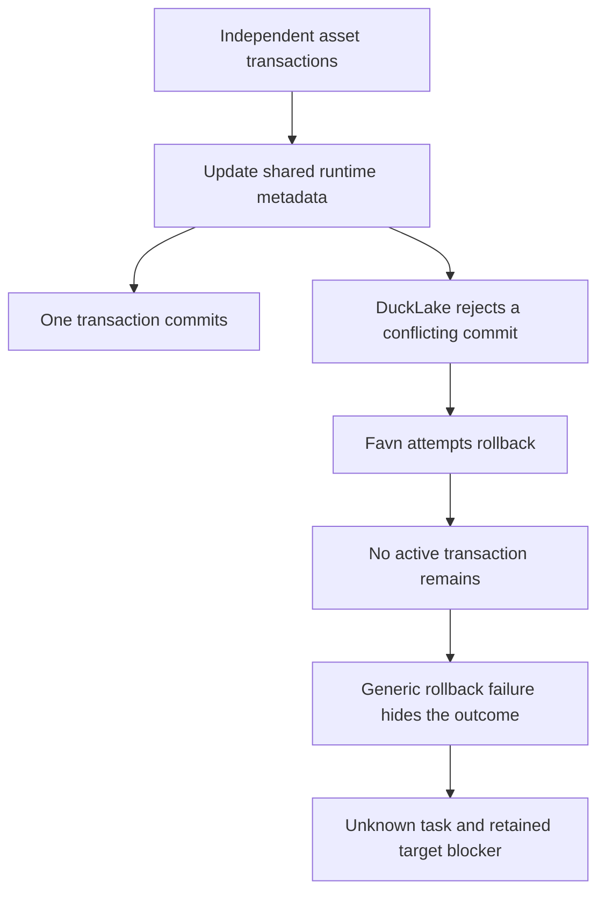
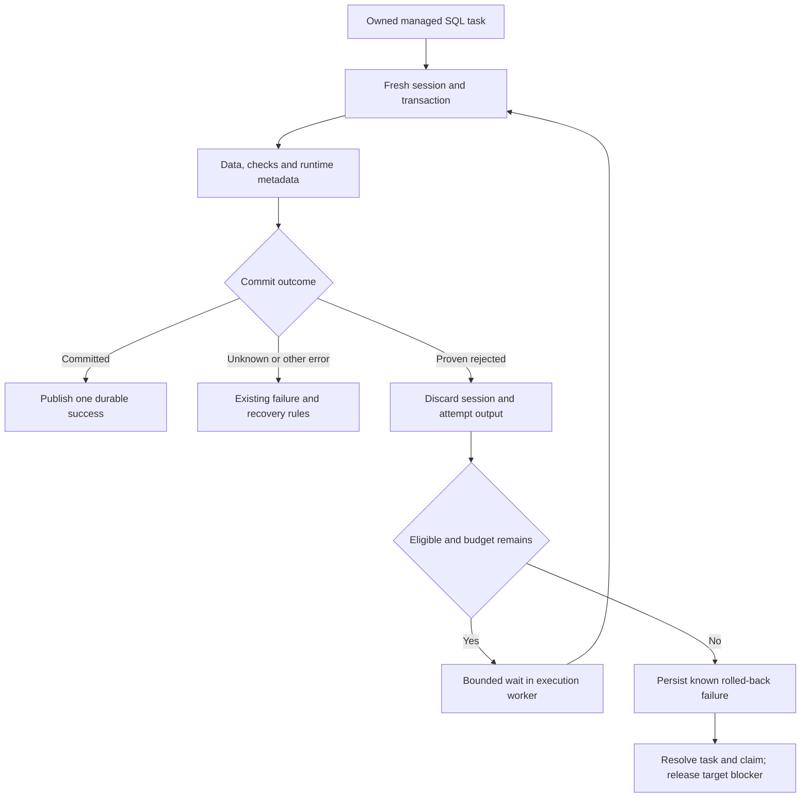

# Change Record: Safely retry rejected DuckLake asset transactions

| Field | Value |
| --- | --- |
| Status | Implemented |
| Type | Bug fix |
| Primary issue | [#751](https://github.com/eirhop/favn/issues/751) |
| Pull request | [#753](https://github.com/eirhop/favn/pull/753) |
| Related work | [#740](https://github.com/eirhop/favn/issues/740), [#742](https://github.com/eirhop/favn/pull/742); run-ownership recovery [#752](https://github.com/eirhop/favn/issues/752) remains separate |
| Affected areas | DuckDB adapter transaction outcomes, SQL runtime error contract, runner managed SQL execution, persistence qualification, SQL documentation |
| Approved plan commit | `45f58e382f88d78e4d009fc2f99bb9232e382db8` |
| Last updated | 2026-09-22 |

## One-minute summary

Different assets can update the same Favn runtime-bookkeeping row while writing
independent DuckLake tables. DuckLake rejects a conflicting transaction, but Favn
currently turns that rejection into an unknown outcome and refuses to retry.
Keep the bookkeeping consistency guard and same-target ownership protection;
recognize proven rejected commits and repeat the complete managed transaction
with a fresh session and a small, fixed retry budget. This preserves concurrency
and atomic data-plus-metadata publication without treating uncertain commits as
safe. Changing transaction outcome and retry semantics requires an independently
reviewed plan.

## Impact

With three runners writing tables A, B, and C, all may execute concurrently.
If their first runtime registrations conflict, the rejected workers close their
sessions, wait briefly, and rebuild their transactions against the latest
catalog state. A successful execution publishes one receipt and one durable
success. Repeated contention ends as a known rolled-back failure after the bound,
not an unresolved write that indefinitely blocks the target.

## Problem analysis

### Assumptions

- The supported native pins remain DuckDB 1.5.5 and DuckLake extension `d8a1881e`.
  No dependency upgrade is proposed.
- Scope is runner-managed declarative SQL materialization with pinned runtime
  publication, generated writes to one DuckLake catalog, and transactional SQL
  checks. Trusted session setup already has to be idempotent. Arbitrary SQL
  callbacks, external side effects, and multiple persistent write catalogs are
  not eligible for replay.
- The existing workspace/logical-target ownership boundary remains authoritative.
  Multiple independent control planes sharing a physical destination remain
  outside that boundary.
- A native rejected-commit message proves rejection only for the qualified
  transaction. A timeout, disconnected client, generic conflict string, or
  missing receipt does not supply that proof.
- Live Azure observations below are point-in-time incident evidence, not a claim
  that the run has since recovered. No existing ambiguous task is repaired by
  deploying this change.

### Evidence

| Evidence | What it proves | What it does not prove |
| --- | --- | --- |
| Read-only Azure Test metadata query on 2026-09-22 joining `ducklake_table` and `ducklake_schema` | Source catalog table ID 10 is `favn_runtime.runtime_schema`, stored as inlined data | Any arbitrary table ID in another catalog has the same meaning |
| Five persisted failed events and their distinct task `write_target_id` values | Different assets received the exact table-10 rejection; each became non-retryable with unknown write outcome | The separate run-ownership failures in #752 |
| Point-in-time task/claim counts | Five affected tasks were unknown and five materialization claims remained claimed | Automated reconciliation of those old tasks |
| [`RuntimeCatalog.introduce/3`](../../../apps/favn_duckdb_adbc/lib/favn/sql/adapter/duckdb/adbc/runtime_catalog.ex) | New targets and new contracts update the same revision row inside the asset transaction; this protects introduction consistency | That removing the row would preserve uniqueness |
| [`SQLAsset.Runtime`](../../../apps/favn_runner/lib/favn/sql_asset/runtime.ex) and [`ADBC`](../../../apps/favn_duckdb_adbc/lib/favn/sql/adapter/duckdb/adbc.ex) | Asset writes bypass the publication-only conflict recognizer; commit/rollback stage forces unknown outcomes | Safe replay of arbitrary transaction callbacks |
| Three-process native reproduction with PostgreSQL 18.4, DuckDB 1.5.5, DuckLake `d8a1881e` | Independent business-table writes committed 3/3; adding a shared revision update committed 1/3, rejected 2/3 with the exact signature, and fresh transactions then succeeded | Full Favn task, claim, resource, and generation convergence |
| [`runtime_catalog_test.exs`](../../../apps/favn_duckdb_adbc/test/runtime_catalog_test.exs) | Existing independent-target coverage accepts one or two successes and does not require convergence | Reliable multi-runner completion |
| [DuckLake conflict resolution](https://ducklake.select/docs/stable/duckdb/advanced_features/conflict_resolution) | Logical conflicts abort; compatible metadata commits can be retried internally by DuckLake | Permission to replay an uncertain Favn write |

The local reproduction used three independent processes and overlapping
transactions. Each first wrote its own business table. In the conflict case each
also ran a conditional increment of a shared revision initially equal to zero.
Both losing commits returned the deleted-inlined-data rejection, rollback then
reported no active transaction, and reads confirmed their business writes had
not committed. Sequential fresh transactions for the two losers succeeded.

## Current behavior

New runtime targets and contracts need the shared revision guard because DuckLake
does not provide the uniqueness mechanism this metadata protocol needs. The
same-target queue protects business destinations; it cannot remove this shared
metadata contention. Established targets can also touch shared asset/window
state, so moving first registration elsewhere alone is not a complete repair.

The existing conflict recognition in `ADBC.Catalog` is private to semantic and
manifest catalog publication. It is not a general asset retry mechanism, and
classification alone would not overcome the runner's current unknown-outcome and
no-write-retry rules.

## Approved plan

This section is the independently reviewed baseline for implementation.

### Recognize rejection without losing the original error

Introduce a normalized SQL error type `:transaction_conflict` for a backend-proven
rejected transaction. The DuckDB plugin owns the native-message recognizer;
shared runtime and runner code must not parse DuckLake strings. Move the existing
native rejection predicate into a small adapter-owned module used by both
catalog publication and transaction finalization. Preserve publication's current
public `:catalog_conflict` return behavior and do not add publication retries.

The new asset eligibility is deliberately narrow: a genuine normalized
`Adbc.Error` at commit with the qualified prefix
`TransactionContext Error: Failed to commit: Failed to commit DuckLake transaction.`
followed by `Transaction conflict - `. The exact deleted-inlined-data case must
have a regression. Do not accept a snapshot-key warning, arbitrary exception
text, an adapter capacity error, or a user-supplied nested map as rejection proof.
The adapter classifies before generic rollback wrapping. Cleanup must either
succeed or return the exact native no-active-transaction response; another
cleanup failure stays conservatively unknown and stops retry.

Return the original bounded message, native classification, commit stage, and
cause together with `type: :transaction_conflict` and
`details.transaction_outcome: :rolled_back`. Retain rollback diagnostics if
present. `rolled_back` means the transaction's durable writes did not commit,
including rejection by the backend. The original stage must not be rewritten to
pretend the failure happened before commit.

Define the narrow proof in the SQL error/adapter contract. Runner outcome mapping
must honor this adapter-issued rolled-back conflict before the generic heuristic
that any commit/rollback stage is unknown. Actual timeout, lost-acknowledgement,
or unknown-outcome evidence must still win over malformed or contradictory
proof. Preserve existing unknown behavior for every unqualified error. Generic
`SQLClient.transaction`, raw `execute`, and `materialize` remain single-attempt;
an error's retryability alone never authorizes replay of a caller callback.

### Repeat one complete managed transaction

Add one runner-owned, small retry boundary around the fresh-session operation
used by managed checked materialization, including its combined-window append
variant. Resolve pinned runtime inputs and render immutable execution input once;
do not rerun Elixir resolvers or user callbacks. Within every transaction attempt,
repeat publication preparation, candidate staging, transaction-dependent planning,
SQL checks, generated materialization, runtime publication, and commit.
Discard all output and check evidence from a rejected attempt before rebuilding.
Initial-generation registration and any later orchestrator success handling run
only after the final successful asset transaction; they are never replayed by
this loop. Rebuild candidates and generation activation are outside replay scope.

Add an optional `qualify_materialization_retry/4` callback to the existing
`Favn.SQL.RuntimeCatalog` backend contract, taking the owner session, pinned
publication, resolved relation and deadline options. Its closed result is
`{:ok, :supported | :unsupported}` or `{:error, %Favn.SQL.Error{}}`; a missing
callback defaults to unsupported. Invoke it on every newly acquired session
before starting a transaction. The DuckDB backend checks `duckdb_databases()`
for the actual resolved target catalog's native type, requires DuckLake and
agreement with the publication target, and qualifies atomic generated writes
and runtime metadata within that catalog. A qualification failure or unsupported
result never authorizes replay.

The runner separately requires ordinary generated managed materialization,
matching pinned publication identity, one generated persistent write destination,
same-catalog runtime metadata and disposable temporary staging only. Do not use
the number of `required_catalogs` or writable attachments as proof: those sets can
include inputs as well as the destination. Multiple attached input catalogs are
allowed. Read-only query/check SQL and absence of user-defined external effects
are trusted declarative authoring requirements, not parser-verified properties;
state this limit explicitly in the canonical guide, as for trusted session
scripts. Arbitrary callbacks, raw/Elixir assets, standalone SQL-client calls,
generation work and generated multi-destination writes remain outside replay.

Use **four total transaction attempts**: the initial attempt plus at most three
retries. Before retries 1, 2, and 3, wait `50`, `100`, and `200` milliseconds plus
uniform jitter in `0..base_delay`. These are internal constants, not a new DSL or
environment setting. A single monotonic deadline covers session acquisition,
bootstrap, all attempts, and waits. Derive it once from the existing caller budget
and cap it by the runner task deadline; never reset it on reconnect. If there is
insufficient time for the chosen wait or the deadline has expired, return the
last proven rejection as a safe terminal failure with a bounded stop reason.
Do not transform a completed rejection into an unknown timeout merely because
its retry budget ended. An actual timeout during a later native write remains
unknown.

Close/discard the rejected session before waiting; acquire a fresh owner-exclusive
session for each retry. Run waiting and replay in the existing execution worker,
not the RunnerAgent, RunServer, or control-operation processes. Existing
cancellation/lease-loss paths must stop that worker and prevent any later attempt;
retry work must not survive it in an unlinked process. Keep the same runner task,
assignment, publication identity, asset attempt, pinned inputs, and target
ownership throughout. This internal transaction budget does not consume or
silently depend on the user's node retry policy.

Once a proven rejection enters this internal budget, every subsequent terminal
error must set `asset_retryable?: false`, including failed replacement-session
connect, bootstrap, qualification and acquisition timeout. A failure before a
new managed transaction begins retains the earlier rolled-back asset-write
outcome and bounded diagnostics for both the rejection and acquisition failure.
Keep a genuine connection/bootstrap failure's resource classification; do not
report it as successful access merely because the prior conflict reached SQL.
If a later transaction started, its own outcome decides safety and an unknown
result overrides the earlier rejection. Before any conflict has entered this
budget, existing connection/bootstrap retry policy remains unchanged. This
prevents an enabled node retry policy from multiplying the four-attempt bound.

### Bound acquisition and the complete session lifetime

Add a narrow, single-attempt `Favn.SQL.Client.with_session/3` owner scope for this
runner path. It takes the connection, scoped options containing the absolute
deadline, and the managed callback; it returns the callback result, never a live
session. Reuse the existing SQL client deadline-guard pattern. One monitored
owner worker acquires the session, performs fixed read-only qualification,
executes the callback and disconnects. The session stays in that owner scope;
there is no cross-process session return or newly introduced ownership transfer.
This helper does not retry any callback and is not added to the public
`Favn.SQLClient` authoring facade.

The guard tracks three phases: acquiring, callback admitted, and completed
result. Qualification before admission must use only the fixed read-only target
resolution/type queries. Before the callback can begin any managed mutation,
an acknowledged entry gate checks the remaining deadline and records admission
in the guard. Timeout while still acquiring or before that gate has no managed
write; after a prior rejection the runner may return its known safe failure.
Interruption after admission is conservatively unknown until the adapter's
completed result has been handed to the guard. No per-statement or per-BEGIN
progress protocol is required. Hand the completed result to the guard before
session cleanup so slow cleanup cannot erase a committed result or proven
rejection. A completed unknown result remains unknown. Distinguish rollback
failure during transaction finalization from disconnect failure after a known
outcome: the latter cannot undo proof, but must prevent reuse of the session.

The guard monitors caller death and cancellation, terminates the owner worker
on deadline, and reaps it before returning; no expired scope may later invoke
the callback. Clamp pool checkout and admission waits to the remaining deadline,
and pass that deadline into bootstrap retry so it checks before each attempt
and before waiting. Native open/connection/bootstrap work runs within the owner
scope because those calls cannot currently be bounded by options alone. Reuse
pool creator/checkout and limiter owner-death monitors for cleanup, and verify
partial native creation explicitly. The ADBC database and connection must be
created through their OTP `start_link` constructors in the scoped owner worker;
retain that process-parent relationship through acquisition. A database created
before connection failure is explicitly released on the ordinary error path;
owner termination during partial acquisition uses OTP parent termination, not
the assumption that an arbitrary link defeats `trap_exit`. Monitor and test
database/connection exit at the allocation-to-checkout gap, including the real
ADBC database process, and wait for known native processes to terminate before
allowing another attempt. Once checkout is tracked, retain the existing pool's
owner-death discard. No resource may be detached before another existing owner
has accepted cleanup responsibility. Do not assume that stopping the caller
cancels an unsupported native side effect. After callback admission, native
uncertainty must remain fenced even while resources are discarded.

This is part of the implementation, not merely an option passed through the
runner: update `Client`, `Admission` and bootstrap `Retry` at their existing
ownership boundaries. Existing callers without this scope retain their current
behavior. Tests must hold both pool and admission capacity past the remaining
deadline, stall native bootstrap, and verify creator reservations, checkout
entries, admission permits and native handles are reclaimed without starting
a subsequent managed transaction.

### Contracts and invariants

- Same-target ownership stays in PostgreSQL. Unrelated targets may execute
  concurrently; no global writer lock or runner-local mutex is introduced.
- Keep `runtime_schema`, immutable contract protection, publication identities,
  and atomic data-plus-runtime-metadata commit semantics intact.
- Only a proven rejected transaction on the eligible managed path may replay.
  Never retry lost commit acknowledgements, uncertain rollback, operation timeout,
  network failure, process death, or an unknown external outcome.
- A later unknown result supersedes earlier known rejections; earlier proof cannot
  establish the outcome of a transaction that started afterward.
- Exhaustion produces a non-retryable asset failure with rolled-back write
  evidence, terminal runner task and claim, and released target ownership. It
  does not start a fresh outer asset retry loop.
- Transient internal conflicts do not emit terminal step failures, change resource
  circuit state, or publish success/freshness/generation evidence. Only the final
  attempt supplies materialization and check results.
- A crash or forced cancellation before safe outcome evidence is durably reported
  retains the existing conservative unknown-outcome fencing. This plan does not
  add durable checkpoints between internal attempts or silently repair old work.
- Readers can change between transactions. Pins and parameters are stable, but
  source snapshots are not newly guaranteed; checks rerun on the new candidate.

### Scope

- Shared native rejection classification and explicit SQL outcome contract.
- Bounded retry of qualified ordinary managed materializations in the runner.
- Existing persistence-path qualification for success, exhaustion and unknowns;
  update the closed persistence codec for any newly persisted type or diagnostic
  key, using its existing bounded shape and explicit atoms only.
- Canonical SQL runtime, runtime-catalog and checks documentation for the precise
  exception to single-attempt writes, plus public plugin docs/typespecs.
- A PostgreSQL-backed, independent-session regression and full lifecycle coverage.

### Non-goals

- Removing shared metadata guards, changing the runtime schema, introducing a
  global catalog lock, or moving runtime metadata outside the data transaction.
- Fixing #752, resuming the incident run, clearing old unknown tasks or claims,
  changing target identity, or altering deployment infrastructure.
- Retrying arbitrary SQL, generation activation, semantic/manifest publication,
  or changing DuckDB/DuckLake versions or catalog concurrency settings.

### Implementation slices

| Slice | Outcome | Owner or area | Depends on |
| --- | --- | --- | --- |
| 1 | Proven rejection retains diagnostics and has one authoritative SQL outcome | `favn_duckdb_adbc`, `favn_sql_runtime` | None |
| 2 | One owned session scope bounds acquisition, qualification, callback and cleanup | `favn_sql_runtime` client, admission and bootstrap retry | None |
| 3 | Explicitly qualified managed writes retry with stable ownership, inputs and deadline | `favn_runner`, `favn_sql_runtime` runtime-catalog boundary, DuckDB backend | 1, 2 |
| 4 | Results survive the closed codec and converge durably; regressions and canonical docs | `favn_core`, `favn_storage_postgres`, `favn_orchestrator`, owning SQL guides | 1, 2, 3 |

### Complexity budget

| Slice | Production added | Production deleted | Supporting added | Supporting deleted | Main reason for the size |
| --- | ---: | ---: | ---: | ---: | --- |
| 1 | 90-160 | 30-65 | 160-260 | 10-35 | Shared native predicate, typed outcome precedence, real adapter failures |
| 2 | 150-260 | 20-70 | 180-300 | 10-35 | Bounded owner scope, acquisition timeouts and cleanup; native calls cannot be bounded by option propagation alone |
| 3 | 125-220 | 20-65 | 230-370 | 10-35 | One retry boundary, explicit backend qualification and terminal disposition |
| 4 | 0-35 | 0-10 | 280-450 | 15-55 | Closed-codec qualification and deterministic multi-runner persistence evidence |

Supporting lines include tests, shared fixtures and canonical docs. The record,
generated artifacts, lockfiles and formatting-only changes are excluded. Reuse
existing retry timing and runner/storage fixtures where their contracts fit;
do not add a new supervisor, durable queue, distributed lock or generic workflow
engine. Explain any upper-bound overrun greater than 25 percent or 100 lines,
whichever is smaller, and materially fewer deletions than planned.

### Implementation map

| Concept | Expected code area | Responsibility |
| --- | --- | --- |
| Native proof and cleanup | `favn_duckdb_adbc/.../adbc.ex`, `adbc/catalog.ex`, small adapter rejection module | Recognize exact backend evidence and preserve diagnostics |
| Typed outcome | `favn_sql_runtime/.../error.ex`, `adapter.ex`, retry classification | Express known rejection without enabling arbitrary write replay |
| Bounded session lifetime | `favn_sql_runtime/.../client.ex`, `admission.ex`, `retry.ex`; existing session-pool ownership monitors | Bound acquisition and callback in one owned scope, cap waits and reclaim resources |
| Replay qualification | `favn_sql_runtime/.../runtime_catalog.ex` and DuckDB runtime-catalog backend | Optional closed callback, unsupported default, native destination identity/type |
| Managed retry | `favn_runner/.../sql_asset/runtime.ex` and one focused runner module if needed | Own eligibility, fresh attempts, deadline, evidence and final retry disposition |
| Durable result compatibility | `favn_core/.../runner_task/persistence_data.ex`; existing runner result normalization | Retain bounded error/outcome fields without atom creation |
| Persistence verification | Existing task/claim/write-ownership and orchestrator fixtures | Prove terminal convergence and preserve unknown fencing |
| Canonical documentation | SQL runtime structure; SQL runtime catalog and SQL asset checks guides | Explain the safe exception and limits once per owning audience |

## Operational design

### Failures and recovery

A recognized rejection is recoverable within four attempts. Exhaustion or the
budget ending between attempts is a safe failure, with no automatic outer retry.
Any actual unknown outcome immediately stops replay and retains the existing
recovery boundary. A crash/cancellation before final durable reporting remains
conservative; only retained authoritative evidence may resolve it later.
Session cleanup and candidate cleanup must not resurrect a discarded attempt or
replace the original rejection diagnostic. Unknown cleanup failure is terminal
for this loop.

### Logs and diagnostics

| Event or state | Level or surface | Safe fields | Rate limit |
| --- | --- | --- | --- |
| Internal conflict retry | SQL execution telemetry/debug event | Task/asset identity, transaction attempt, delay, remaining budget, normalized conflict type | At most three per asset execution |
| Exhausted rejection | Final error and persisted diagnostics | Original redacted native message and commit stage, rolled-back outcome, attempt count, stop reason | One final result |
| Unknown outcome | Existing error/recovery surface | Existing bounded diagnostics; prior retry count if available | Existing limits |

Preserve the original native classification instead of overwriting it with a
retry category. Add only bounded scalar diagnostics, never SQL text, parameters,
credentials, arbitrary exception terms or the discarded body result. Counters
are diagnostic and do not create a new control-plane state machine.

### Deployment, migration, and compatibility

No database or runtime-catalog schema migration is planned. Use the existing
matched release process for runner, orchestrator and pinned manifest; audit the
closed result codec and runner-contract version before publication, and bump
only if the final wire change requires it. An older runner retains old behavior.
Rollback restores the old failure behavior; there is no data rewrite to reverse.
Existing unknown tasks/claims require their existing reconciliation procedure,
and must not be automatically relabeled from historical error text.

## Verification plan

| Acceptance criterion | Planned evidence | Owning layer |
| --- | --- | --- |
| Exact rejection preserves evidence | Real pinned PostgreSQL-backed DuckLake conflict through ADBC; assert original commit stage/message, known rollback and cleanup | DuckDB adapter |
| Recognition fails closed | Lost acknowledgement after actual commit, timeouts, generic/similar conflict strings, unknown cleanup and contradictory nested evidence all stay unknown/non-replayed | Adapter and SQL runtime |
| Guard preserves correctness | Concurrent first targets and same-contract introductions retain one immutable contract and correct target state; guard remains present | Runtime catalog |
| Independent work converges | Three independent runner sessions, distinct targets and shared catalog, deterministic first-commit barrier; all three complete within the bound, both cold and established metadata | Runner integration |
| Same-target writes cannot race | Two tasks for one target plus unrelated work; retain existing target queue and final start-barrier assertions | PostgreSQL ownership and runner integration |
| All managed paths are consistent | Standard table, incremental delete-insert, append combined windows and generated group replacement; no replay for excluded generation/raw/multi-write paths | Runner |
| Eligibility is explicit | Missing callback, unsupported result, native non-DuckLake destination, mismatched publication, qualification error and candidate work cannot replay; extra attached read catalogs do not incorrectly exclude a valid destination | SQL runtime and runner |
| Bound and evidence are correct | Force four proven rejections; assert exactly four executions, three bounded waits, final checks only, unchanged pinned resolver count and one task/publication identity | Runner |
| Replacement-session failures cannot multiply retries | Rejection followed by connect failure, bootstrap failure and acquisition timeout with node retries enabled: no outer asset retry, safe prior write outcome and accurate resource classification | Runner and orchestrator |
| Deadline and cancellation stop work | Shared deadline across reconnect/bootstraps; expiration between attempts retains known rollback; timeout during next write stays unknown; cancellation/lease loss during wait cannot launch another attempt | SQL runtime and runner executor |
| Acquisition is bounded and cleaned | Hold pool/admission capacity; stall bootstrap/native connection creation; race callback-entry acknowledgement with expiry/caller death; expire after completed result and before disconnect; assert no late callback or leaked permits, creators, checkouts or native handles, including partial real ADBC creation | SQL runtime and adapter |
| Durable convergence | Success and exhausted rejection: terminal task/claim/run events, released target ownership, resource outcome does not trip a connection circuit, one valid initial generation only after success | Orchestrator and PostgreSQL |
| Unknown writes remain fenced | Commit acknowledgement lost after native success: one execution, no fresh transaction, durable unknown task/claim and blocked same-target replacement | End-to-end persistence |
| Performance/concurrency remains useful | Barrier proves three different targets entered transactions concurrently; record total executions and retries rather than relying on elapsed-time thresholds | Runner integration |

Use deterministic barriers and injected clocks/jitter for timing assertions.
Record actual DuckDB, DuckLake and PostgreSQL versions with integration output.
Run the narrowest owning-layer tests first, then relevant fast/acceptance tiers,
format, warnings-as-errors compilation and test-tag guard. Follow the disposable
PostgreSQL test-database instructions; never run tests against `favn_dev` or Azure.
GitHub CI qualifies the exact implementation commit. A later authorized Azure
qualification is separate from local and CI evidence.

## Risks and open questions

| Risk or question | Impact | Mitigation or decision |
| --- | --- | --- |
| Four attempts can exhaust under sustained contention | Some work still fails safely | Fixed bounded policy, jitter, honest terminal outcome; tune only from measured evidence in separate work |
| Repeating expensive staging amplifies work | Higher CPU and storage traffic during conflicts | Reuse pinned inputs, close sessions between tries, stop promptly, expose attempt count |
| A broad signature could accidentally authorize an uncertain write | Duplicate external effects | Adapter-owned native proof, one persistent write catalog, negative lost-ack tests, no generic callback retries |
| Broad unknown heuristics could override proof or hide real uncertainty | Nonterminal tasks or unsafe retries | Explicit precedence tests across normalized errors, causes and persisted shapes |
| A narrowly described retry still runs unsupported external SQL effects | Unsafe replay | Enforce retained managed-path eligibility and document SQL-only effects; unresolved qualification requires revised review |
| Registration alone is not the only shared metadata write | Warmed assets may still conflict | Cold and established-target integration tests; keep the solution at transaction scope |

## Plan review

| Field | Result |
| --- | --- |
| Reviewer | Astra (`gpt-6-astra`), xhigh, independent agent |
| Reviewed against | Issue #751, current RC17 source/tests, primary diagnosis/reproduction, this record |
| Findings | First review requested changes: explicit replay qualification; prevent replacement-session errors from enabling outer retries; provide a real acquisition deadline owner and cleanup mechanism |
| Findings addressed and rechecked | Astra xhigh rechecked the concrete callback, terminal transition, owner scope, native cleanup, race tests and revised budget; all three findings resolved |
| Verdict | Approved on 2026-09-22; no remaining blocking plan findings. Implementation review must verify races, cleanup, durable convergence and the four-attempt bound against this baseline |

---

## Implementation outcome

Implemented native rejection classification, the optional native qualification
callback, a single owned session deadline, and the four-attempt managed runner
loop. Ordinary checked writes, combined append and group replacement use this
boundary. Group rendering is retained outside retries. Rejected attempts discard
body/check results. Replacement acquisition failures retain the safe prior write
outcome while preserving their resource failure category and preventing outer
node retry. Known completion reaches the guard before cleanup.

Canonical runtime-catalog/check documentation and the adapter error contract are
updated. The closed codec recognizes the new bounded diagnostics. No schema or
runner contract version change is needed: the diagnostics travel through the
existing normalized error envelope.

The proposed behavior diagram above also describes the final behavior; the
implementation adds no new state or durable owner. Astra review corrections
retain the original native failure proof, veto normalized nested timeout
errors, preserve pre-admission no-write outcomes, and reap blocked native
children before a scoped timeout returns. Retry telemetry includes bounded
publication/run/step/asset identity, attempt, delay, remaining budget and conflict
type; it contains no SQL or parameters.

Astra xhigh approved the implementation against the baseline on 2026-09-22.
Exact-head CI qualification is tracked on the linked pull request.

## Deviations from the approved plan

| Deviation | Reason and impact |
| --- | --- |
| Extract the session owner into internal `SessionScope` rather than adding another receive loop directly to `Client` | Names the lifetime contract and keeps the already large client readable; uses the existing monitored-guard pattern. |
| Scoped sessions are discarded after success as well as rejection | Native handles remain children of the short-lived owner. Returning those handles to idle storage would require a new ownership transfer; fresh scope acquisition preserves the approved lifetime guarantee. This adds connection/bootstrap cost per managed asset. |
| Dispose native resources in the scope owner before pool checkin | Existing pool checkin performs disconnect synchronously in its GenServer. Doing native disposal first keeps slow cleanup under the scope deadline; existing idempotent pool discard remains the final cleanup path. |
| Scoped pool identity is separate from ordinary idle sessions | Prevents borrowing a handle whose native parent belongs to a previous owner. The existing admission gate still enforces catalog capacity. |
| Scoped inner-operation watchdogs report to the lifetime guard | The guard retains native resource monitors and kills/reaps blocked children before returning. Existing operation deadlines and telemetry remain active. |
| Full lifecycle evidence is composed across native runner and PostgreSQL tests | Native PostgreSQL-backed DuckLake regression runs the actual managed runner path; the existing PostgreSQL lifecycle fixture injects the terminal rejected-commit shape after a confirmed transaction rollback. It proves durable settlement with node retries enabled, not a single native-to-control-plane end-to-end run. |

The approved plan above is unchanged. These implementation choices and proof
boundaries require confirmation in final review.

## Decision log

| Date | Decision | Reason | Review needed |
| --- | --- | --- | --- |
| 2026-09-22 | Keep the shared consistency guard and retry proven rejected whole transactions | Removing the guard weakens introduction integrity; serialization would reduce independent-target concurrency | Included in plan review |

## Verification evidence

| Check | Result | Evidence boundary |
| --- | --- | --- |
| Azure metadata and durable incident inspection | Root cause confirmed before planning | Read-only point-in-time evidence; no recovery performed |
| Three-process native reproduction | 3/3 independent writes; 1/3 with shared guard; both rejected transactions succeeded fresh | Native mechanism only, not Favn lifecycle qualification |
| Record links, diagrams and whitespace | All local links resolve; no whitespace errors; both diagrams render in GitHub's Mermaid renderer and were visually inspected | Documentation validation only |
| Focused adapter rejection tests | 36 passed | Exact native error and cleanup qualification; negative cleanup and lost-ack behavior |
| SQL runtime fast tests | 139 passed | Scope acquisition/admission/completion/cancellation, pool/admission bounds and existing SQL behavior |
| Runner fast tests | 287 passed; final retry/execution subset 61 passed | Bounded retry and existing runtime behavior |
| Existing native runtime-catalog tests | 36 passed | Table, window, combined append, groups and publication regressions |
| New native concurrent runner regression | 2 passed | Three independent owners, cold and warm rounds: 3/3 success, six transaction attempts in each round; actual ADBC partial-allocation cleanup; preserved exact native signature, lost acknowledgement, later contradictory uncertainty, append and group retry without duplicate rows or receipts |
| PostgreSQL lifecycle fixture | 2 passed | Known rollback and exhausted conflict settle task/claim/run, preserve independent work, release ownership; node max attempts is three |
| Native pins | DuckDB 1.5.5; DuckLake `d8a1881e`; postgres scanner `41223e5`; PostgreSQL 18 | Local disposable database only |
| Test-tag guard | Passed | New native regressions use the existing CI-covered `adbc_integration` tier |
| Core result codec | 30 passed | New bounded diagnostics survive the closed codec |
| Acceptance subset | 2 passed | Owning public SQL acceptance checks |
| Compile, format and test-tier guard | Passed | Warnings treated as errors; native test added to explicit CI file list |
| Full fast suite | All backend apps passed; View 839/840 | View teardown exited during `GenServer.stop`; unchanged file passed 5/5 on targeted rerun. An earlier broad run hit two other timing failures; both passed targeted reruns. No claim of a fully green local umbrella run. |
| Final scope/qualification subset | 13 passed, including independent reviewer execution | Blocked trapping native child is dead before timeout returns; nested normalized timeouts veto replay |

### Actual complexity

Counts use `git diff -w` against the implementation base, excluding this record,
dependency links and formatter-only indentation. The native acceptance fixture is
counted in slice 4; the shared SQL error/qualification matrix is counted in slice 1.

| Slice | Production added | Production deleted | Supporting added | Supporting deleted |
| --- | ---: | ---: | ---: | ---: |
| 1 | 145 | 37 | 122 | 3 |
| 2 | 292 | 8 | 274 | 0 |
| 3 | 282 | 43 | 258 | 0 |
| 4 | 8 | 0 | 593 | 9 |

Slice 2 adds explicit resource monitors and the acknowledged admission gate to
close the demonstrated native-child lifetime race. Its deletion count is lower
because ordinary SQL operations retain their existing lifecycle.
Slice 3 exceeds its production ceiling because group rendering must stay outside
replay, pre-admission outcomes must remain safe, and publication qualification
and telemetry are explicit. It replaces the old managed transaction call sites;
there is no parallel managed retry path. Supporting deletions in slices 1–3 are
lower because these are new regressions alongside existing coverage, not rewrites.
Slice 4 exceeds its supporting ceiling to prove native cold/warm concurrent
commits, lost acknowledgement, contradictory later evidence, combined append,
group replacement and partial-native cleanup in the actual runner path. The
existing durable lifecycle fixture is parameterized rather than duplicated;
its formatter-only indentation is excluded. These overruns add proof and required
failure semantics, not new product scope.

### Not verified

Final CI, sustained-load throughput, and a deployment containing this fix remain
unverified. Native-to-control-plane behavior is qualified by composed tests as
described above; a single deployed end-to-end test has not been performed.

## Final review

Astra (`gpt-6-astra`, xhigh) independently compared the implementation and this
record with approved baseline `45f58e382f88d78e4d009fc2f99bb9232e382db8`.
Verdict on 2026-09-22: **approved; no remaining blocking findings**.

All reported safety issues were corrected and rechecked. The reviewer accepted
the session-lifetime deviations, composed persistence evidence and explained
complexity overruns. Independent checks included 13 scope/qualification tests,
a blocked trapping native-child cleanup probe and the public runtime's
pre-admission timeout outcome. The two verification-table formatting gaps were
removed after review. CI remained pending at the review point; no deployed proof
was claimed.
