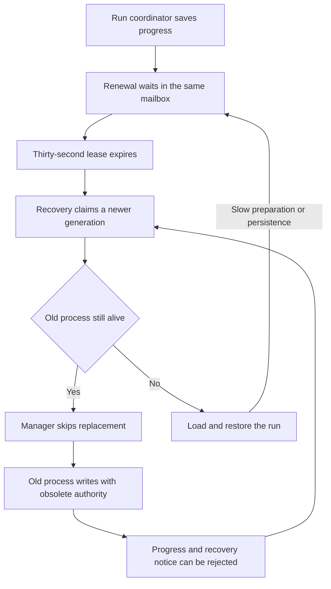
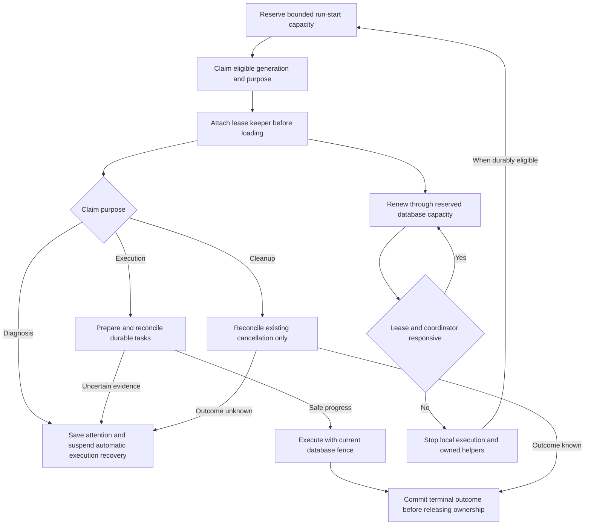

# Change Record: Keep run ownership reliable during slow control-plane work

| Field | Value |
| --- | --- |
| Status | Plan reviewed |
| Type | Bug fix and lifecycle redesign |
| Primary issue | [#752](https://github.com/eirhop/favn/issues/752) |
| Pull request | Pending |
| Related work | [#692](https://github.com/eirhop/favn/pull/692), [#722](https://github.com/eirhop/favn/pull/722), [#731](https://github.com/eirhop/favn/pull/731), [#748](https://github.com/eirhop/favn/issues/748), [#749](https://github.com/eirhop/favn/pull/749) |
| Affected areas | Orchestrator run lifecycle, recovery, configuration and operator reads; PostgreSQL ownership, connection budgets and transactions; recovery operator workflow |
| Approved plan commit | Recorded in the immediate PR-number update after this baseline is committed |
| Last updated | 2026-09-22 |

## One-minute summary

A run can lose ownership while its coordinator is alive but busy saving progress.
Recovery then changes its ownership token without reliably replacing the old
coordinator, and repeated attempts can fail to save even the recovery diagnostic.
Give each run a small, independent lease keeper, bound the database work that
can delay it, and make replacement an explicit handoff between generations.
Keep the existing execution engine and its durable task identities; add bounded
recovery attempts and an actionable attention state when safe progress remains
impossible. This is a design-only change: implementation and production
qualification are separate work against the reviewed baseline.

## Impact

A slow database operation or an overloaded control plane should delay a run,
not create competing coordinators or repeatedly discard completed runner results.
Independent runners and unrelated targets remain concurrent. A genuinely lost
owner must still be fenced: additional time to recover is preferable to duplicate
external writes. Operators gain a reasoned distinction between temporary delay,
lost ownership, uncertain work, and recovery requiring intervention.

## Problem analysis

### Assumptions

- The supported deployment remains one Orchestrator replica and zero to many
  runners. Local old/new run processes and deployment restarts still require
  durable ownership; process liveness is not authority.
- PostgreSQL 18 remains the authority. No design can guarantee timely renewal
  while its entire runtime receives no CPU, its network is unavailable, or the
  database cannot serve requests. Safety must survive those conditions, and
  progress must resume predictably when service returns.
- The user observed near-100% Orchestrator CPU during the incident. This is a
  plausible contributor, not verified causation. The initial missed renewal's
  scheduling, throttling and transaction timings were not captured.
- This task authorizes architecture, a change record and independent Astra Max
  review. No runtime changes, cloud mutations or recovery of customer runs are
  part of this planning change.

### Evidence

Source and the temporary diagnostic probes were examined at RC17,
`3a44bc61`. The probes were run on a disposable local PostgreSQL database;
that database was removed after verification. Their results are summarized here
so the record does not depend on temporary workstation files.

| Evidence | What it proves | What it does not prove |
| --- | --- | --- |
| [Issue #752](https://github.com/eirhop/favn/issues/752) | Repeated lease-expired and stale-token writes, including recovery attention; one reported per-run advisory timeout | Which operation caused the first missed heartbeat |
| [RunServer](../../../apps/favn_orchestrator/lib/favn_orchestrator/run_server.ex), `handle_execution_event/2`, `renew_storage_ownership/5` | Execution callbacks run synchronously; the same mailbox processes renewal; target-lock renewal precedes run-lease renewal | Production callback duration |
| [RunManager](../../../apps/favn_orchestrator/lib/favn_orchestrator/run_manager.ex), `recover_prepared_claimed_run_server/5` | Any still-alive tracked PID causes recovery to report success, without comparing its generation with the newly claimed one | A complete production takeover timeline |
| [Execution](../../../apps/favn_orchestrator/lib/favn_orchestrator/run_server/execution.ex), `persist_step_running/4` | A fenced advisory transition is logged and ignored | That every fenced path has this defect |
| [RecoveryAttention](../../../apps/favn_orchestrator/lib/favn_orchestrator/run_server/recovery_attention.ex) | It copies the caller's fence onto a fresh snapshot and returns `:ok` even if the diagnostic write fails | Permission for a stale caller to adopt another owner's token |
| [RunRecovery](../../../apps/favn_orchestrator/lib/favn_orchestrator/run_recovery.ex) and RunManager | Up to 100 leases are claimed together, then preparation is serial and loads the manifest before handoff | Startup latency for a particular manifest |
| Diagnostic control: real per-run advisory-lock timeout, 3,011 ms | Renewal retried successfully with the same generation and extended its lease | That arbitrary repeated contention is harmless |
| Diagnostic fault: gate one step-persistence callback for 32,133 ms | Renewal remained in the mailbox; the real lease expired; generation 1 became 2; the manager skipped replacement; stale step-running, step-finished and recovery-attention writes followed | CPU saturation as the trigger; a full repeated-loop or three concurrent physical-write test |
| Diagnostic fixture used three durable tasks | Results can be durable while their coordinator is blocked | The tasks were started/completed sequentially in that probe; implementation qualification must add genuinely concurrent runners on independent targets |
| [PostgreSQL ownership store](../../../apps/favn_storage_postgres/lib/favn_storage_postgres/run_ownership/store.ex), [run store](../../../apps/favn_storage_postgres/lib/favn_storage_postgres/runs/store.ex), [admission store](../../../apps/favn_storage_postgres/lib/favn_storage_postgres/admission/store.ex) | Renewal shares both broad run locks and ownership-row contention with execution transactions | That a separate process or pool alone removes all blocking |
| [Storage configuration](../../../apps/favn_storage_postgres/lib/favn_storage_postgres/config.ex) | Current server bounds cover individual statements, lock waits and idle transactions | A total time limit for a transaction containing many statements |

## Current behavior

The timer cannot interrupt a busy callback. Recovery changes database authority
before the local manager establishes who will use that authority.

## Approved plan

This section is the independently reviewed implementation baseline. Use the
smallest explicit lifecycle that meets the contracts below; a second workflow
engine is not needed.

### 1. Keep execution state in one place

`RunServer` stays the sole owner of `RunExecutionState`, ordered step transitions,
retry continuations and result settlement. Its existing four-node/25 ms admission
batches and incremental restoration remain the cooperative execution boundaries.
Audit the work inside each individual callback and add yields to unbounded
fanout/decoding loops. Do not copy the whole execution state into a new task for
every event.

Introduce `RunLeaseKeeper`, an orchestrator lifecycle process owning exactly one
`{workspace, run, owner, fencing_generation}` and its local deadlines. It does not
execute steps or change business outcomes. Its explicit state includes phase,
owner monitor, current lease receipt, renewal operation identity, conservative
local deadline, one outstanding responsiveness challenge, and shutdown state.

Attach it before manifest loading or execution restoration. RunManager records
the keeper, coordinator and generation together. Both normal submission and
recovery use this lifecycle; there is no direct unguarded production start path.
A failure to attach a keeper releases only the exact claim that was obtained.

Put RunManager and a run-process DynamicSupervisor under one `one_for_all`
control supervisor. All keepers, preparers, coordinators and run-specific helpers
are temporary children of that managed process subtree: supervisors must never
automatically restart a worker with an old receipt. RunManager monitors the
registered processes and owns their stop timers. Keeper death makes that surviving
manager close the local admission gate and stop/force-stop the coordinator and
helpers, including a coordinator blocked in a callback. Manager death makes the
outer supervisor stop the entire process subtree before a new manager starts.
Thus cleanup does not depend on the dead keeper or on `terminate/2` running.

During preparation, a dedicated preparer services the keeper's challenges between
bounded loading/restoration units. It cannot acknowledge on behalf of a blocked
unit. Transfer responsiveness monitoring to RunServer with a generation-tagged
ready/challenge acknowledgement before the preparer exits or execution starts.
The transfer itself must complete within the existing responsiveness deadline;
changing phase or monitor cannot reset that deadline without a fresh response.

Coordinator exit stops renewal and initiates helper cleanup. A normal keeper exit
is allowed only after an acknowledged terminal/release or handoff phase. Database
fences remain required on every admission and authoritative write, regardless of
local keeper health. Root-subtree shutdown and individual lifecycle shutdown use
the same bounded stop/force-stop policy described below.

### 2. Renew independently, with honest timing

The keeper schedules renewal itself, independently of RunServer's mailbox,
materialization-lock maintenance, and normal persistence retry delays. It has at
most one supervised renewal worker and one stable renewal ID in flight. Timer
handling and responsiveness checks never wait for that worker. Duplicate timer
messages coalesce; delayed replies carry operation and generation identity and
cannot revive a revoked keeper.

Extend the ownership receipt with database observation time. Derive a
conservative local monotonic deadline from the request's monotonic start plus
`expires_at - database_observed_at`; time spent in checkout, transport and reply
handling consumes that budget. Never compare database expiry with the client's
wall clock or grant a fresh full lease after a delayed/replayed response. Clamp
negative remainder to zero. Every response, including an idempotent replay,
reads a **fresh** `clock_timestamp()` for `database_observed_at`; a replay preserves
the stored expiry, never the original observation time. Otherwise a later request
start would incorrectly restore already-consumed lease time. PostgreSQL always
makes the final expiry decision.

On a timeout whose commit outcome is unknown, retry the exact renewal ID within
the last acknowledged deadline. A confirmed replay reports the stored expiry,
not a newly extended lease. Once the keeper has revoked locally, discard late
success; use fresh fenced recovery even if that means waiting for the last
possibly committed lease to expire. No renewal can resurrect an expired owner.

Proposed initial policy, to be validated before release:

| Budget | Proposed value | Purpose |
| --- | --- | --- |
| Run lease | 120 seconds, configurable from 120 to 600 seconds | Tolerate transient scheduling and storage delays; this is a starting policy, not a measured SLO |
| Renewal interval | 10 seconds with a bounded initial stagger | Several opportunities to renew without synchronizing all runs |
| Local dispatch safety margin | 10 seconds before conservative expiry | Stop authorizing further local admission before authority becomes uncertain |
| Renewal operation | 2 seconds total checkout-to-reply budget, one operation per keeper | A slow request cannot occupy the keeper or its watchdog |
| Renewal contention retry | Jittered 250-1,000 ms, within the acknowledged deadline | Coalesce retries without hot loops or changing command identity |
| Responsiveness challenge | One challenge every 5 seconds; independent deadline 45 seconds after the last verified response | Bound unresponsiveness to 45 seconds, including challenge scheduling; healthy runner waits still answer |
| Start/restore responsiveness | Same 45-second deadline, transferred by acknowledged phase handoff | Keep expensive preparation cooperative; no unrenewed startup gap |
| Maximum active run lifecycles | 64 across the Orchestrator by default, configurable 1-512 | Bound keeper work and queue sizes as well as the existing retained-plan memory budget |
| Concurrent recovery preparation | At most 4, also bounded by available active-run slots | Do not preclaim a large batch whose leases age before adoption |

The 45-second watchdog measures time since the last verified response to a small
control message, not time since an asset finished. Its independent absolute timer
includes the interval before the next challenge; it is not a 5-plus-45-second
budget. A long-running external task with a responsive coordinator remains
healthy. If a legitimate callback cannot yield within this bound, split that
callback; do not silently disable the watchdog. Late challenge replies do not
revive a lifecycle whose watchdog has already fired.
For configuration changes, validate the lease against renewal, operation and
safety budgets at boot. Changing the run lease does not change runner-task,
materialization, dispatch, cancellation or retry deadlines.

The keeper closes admission for **its own run** when renewal headroom falls below
30 seconds or the last verified responsiveness response is over 20 seconds old.
Reopen that run after two consecutive healthy checks. An isolated run's pressure
never pauses unrelated starts; retain existing global memory/capacity limits and
the explicit active-run/start-slot caps. Aggregate pressure is diagnostic in this
change, not a new manager-wide admission heuristic.

Before each new admission command or continuation that could create external
work, StageAdmission requests a fresh permit from its keeper with a one-second
local call bound. Cached permission, a permission covering an entire batch, or
a control message queued behind the blocked callback is insufficient. A missing,
closed or timed-out keeper defers that operation. The database fence is still
checked inside the authoritative admission transaction. Revocation immediately
rejects subsequent permits and initiates bounded process shutdown; an operation
already submitted is reconciled using its original identity, even if it committed
after the permit was returned. Existing results and admitted durable tasks remain
eligible for settlement without obtaining permission for new execution.

### 3. Reserve database service and bound ownership-row holders

Add a storage-owned `RunLeaseRepo` with two connections by default, explicitly
counted in the deployment's PostgreSQL connection budget. Only existing-generation
renewal uses it. Claims, run execution, release, recovery attention and ordinary
reads use the normal pool. Reuse the configured authentication provider, TLS,
credential rotation, redaction, schema gate and backend supervision; do not
create a second database or put SQL in the orchestrator.

The narrow renewal transaction takes the existing shared execution-history
retention guard using the lease repo, then takes the existing ownership row with
`FOR UPDATE NOWAIT`. It checks owner, generation, released state and database
expiry before extending the row. It does not take the broad per-run `RunIdentity`
advisory, read payloads, publish outbox events, acquire capacity, renew target
locks, or scan tasks. Missing/retired rows cannot be recreated by renewal. Keep
the shared history guard and root revalidation so renewal cannot bypass retention.
Only this narrow operation omits the broad identity lock; run mutations do not.

A busy ownership row returns a typed retryable contention result promptly, so
one run cannot occupy the reserved pool while waiting on another transaction.
The total renewal deadline includes pool checkout. Each keeper has one queued
or running operation, with no detached unbounded retry tasks. Do not fall back
to the ordinary pool if the reserved pool is unavailable.

A reserved pool does not remove row contention. Audit every transaction taking
the run ownership row: transition commits, execution checkpoints, runner-task
admission, execution-lease adoption, claim, release and recovery. Apply a
15-second **total transaction** server deadline at their outermost transaction,
not a fresh deadline at each nested call. Preserve the existing 3-second lock
bound and compatible client-side bounds. Serialize/hash large payloads before
locking wherever the current authoritative validation permits it. Test the
actual production runtime role and connection-replacement behavior.

PostgreSQL 18's [transaction timeout](https://www.postgresql.org/docs/18/runtime-config-client.html#GUC-TRANSACTION-TIMEOUT)
terminates an overlong transaction's session, unlike a per-statement timeout.
Map connection loss to explicit uncertain persistence outcome and reconcile the
original command/receipt. Never infer that an external asset write rolled back,
and never automatically repeat it because control-plane bookkeeping timed out.

Renewal lock order is shared history guard, then ownership row; it never seeks
a run, target, capacity or task lock afterwards. Existing mutation paths retain
their documented lock order. Verify actual lock-order interactions, including
retention and cancellation, with independent PostgreSQL connections before
accepting this storage change.

### 4. Keep target locks and helper workers owned

Run ownership and physical-write ownership remain separate. Move the existing
active/paused materialization-lock renewal loop into one maintenance process per
run lifecycle, with bounded asynchronous storage operations on the normal pool.
Its timers and registration acknowledgements do not wait for a storage request.
Run-lease renewal never waits for this maintenance process.

Use a registration protocol **before acquisition**, not after a long admission
callback has returned:

1. Before submitting any admission that may acquire a target-operation lock,
   register its stable admission/task/operation identity with maintenance and
   receive acknowledgement within one second. A paused acquisition uses the same
   identity. No acknowledgement means no submission of that new acquisition.
2. Maintenance resolves committed claim/fence references through a narrow durable
   admission/task read, even when RunServer never receives the admission reply.
   An absent task is not proof of rollback while the original command is pending.
   Admission receipts and task context remain the authority; messages only reduce
   lookup latency. Restore registers existing durable tasks before expensive
   manifest work. Reject registrations from obsolete run generations.
3. Bound acquisition to 20 seconds total, including checkout, request transport
   and reply handling, with checkout capped at three seconds and the existing
   15-second server transaction bound. An unconfirmed acquisition at that total
   deadline closes new admission and remains watched under its original identity;
   client timeout does not prove rollback or that the server has finished.
   Start the first durable lookup within five seconds of submission. Bound each
   lookup/renewal operation, including checkout, to five seconds. Run a due-work
   pass at least every five seconds and prioritize the earliest expiry. Bound the
   watched set by existing admitted-task/paused-admission capacity and one pending
   admission per coordinator; refuse further registrations when due work cannot
   be scheduled within these budgets.
4. Confirm the first renewal within 40 seconds of the acquisition request's
   monotonic start, or its existing stored expiry minus 20 seconds, whichever is
   earlier. Subsequent renewals must preserve at least 20 seconds of confirmed
   headroom. Use fresh database observation time and conservative local deadlines
   for these receipts too. The 20-second complete acquisition budget plus five
   seconds each for detection, durable lookup and renewal totals 35 seconds,
   leaving five seconds of slack before the cutoff and at least 20 seconds before
   the conservative 60-second expiry. Prove those complete budgets, including
   scheduling and transport, in the boundary test; missed budgets close admission
   and enter exact-identity reconciliation, not optimistic continued execution.
5. If registration, acquisition outcome or renewal cannot be confirmed within its
   budget, close admission for that run and reconcile the exact durable identity.
   Continue bounded maintenance while known authority remains, and stop treating
   the target lease as live at the conservative expiry. Do not release unresolved
   holds, manufacture a fresh claim, or redispatch an already admitted task.

This protocol removes the 45-second callback-return delay from the existing
60-second target-lease budget; it does not lengthen that lease. Maintenance owns
its bounded claim set and current renewal receipts, coalesces updates by task and
fence, and preserves an unconfirmed renewal's identity for reconciliation. Task
settlement unregisters an entry only after the durable outcome is acknowledged.
Terminal task/result evidence suppresses renewal even when a stale local claim
reference remains registered, preserving #749.

A hard crash can outlast the 60-second target lease before the 120-second run
lease allows takeover. Recovery then observes the original durable tasks and
write holds. It must not renew an expired target token, release an `in_flight` or
`outcome_unknown` hold, or redispatch that work. Await/reconcile terminal evidence
where the existing recovery contract permits it; otherwise save attention. A
longer run lease trades faster crash recovery for fewer false ownership losses.

Every helper starts inert under the managed run-process supervisor. RunManager
registers and monitors its PID, generation and parent lifecycle, then acknowledges
registration before that helper may perform work. This covers preparers, post-step
reconciliation, await workers, maintenance and renewal workers; no production
`async_nolink` path may bypass it. Owner death or keeper revocation makes RunManager
stop the registered helper group and await `DOWN` acknowledgements. Helpers also
monitor the manager and lifecycle. A local worker's death does not cancel a durable
runner task or prove an external write stopped; replacement restores and reconciles
those exact task identities.

### 5. Make takeover a generation-aware handoff

RunRecovery reserves startup capacity before claiming work. Count active-run
capacity by unique `{workspace, run}`, not generation: replacing a tracked run
transfers its existing slot, even when all 64 slots are occupied. The temporary
new keeper can coexist with the old stopping lifecycle; execution coordinators
cannot. Both replacement and first startup also require one of four preparation
slots. Free reservations after failed claims; retain a run's slot until its old
local processes are confirmed stopped, and release a parked attention run's slot
after cleanup.

Select a bounded list of candidate identities without claiming them, reserve
matching new/replacement slots, then claim only those identities atomically with
eligibility revalidation. Attach a keeper immediately to every successful claim
before loading a run or manifest. There is no serial batch of 100 live claims
waiting for one preparation worker. Preparation failure stops its helpers and
uses the exact fenced release/backoff transition below; a saturated manager does
not report success for an unadopted claim.

RunManager's per-run record becomes an explicit lifecycle entry with generation,
keeper/coordinator identities and `preparing`, `running`, `stopping` or `attention`
phase. Commands and acknowledgements include a handoff reference and generation.
Its callbacks schedule work and return; they do not wait on database I/O, startup
or process termination.

- Same generation and matching keeper: return the existing adoption result.
- Older tracked generation: stop that lifecycle and wait for coordinator and
  helper `DOWN` acknowledgements. Keep the newly claimed lease renewed while
  waiting. Then start one replacement with the new generation.
- Newer tracked generation: reject the stale handoff. Release only the supplied
  older claim, which cannot release the newer owner's authority.
- Old lifecycle cannot be confirmed stopped: do not start overlapping local
  execution. Persist actionable attention under the valid new generation, or
  leave it recoverable if that write cannot be confirmed.

Use a five-second graceful stop budget, then force-stop local processes and
allow a further five seconds for acknowledgements. This bounds the local handoff,
not the lifetime of external SQL effects. A node that was completely unavailable
may resume with old processes still alive; their database writes remain fenced
and helper messages cannot mutate the new generation's state. A new process
always reloads the latest durable snapshot after takeover and after any stopped
old transaction has committed or aborted.

Audit every fenced result, including advisory `step_running`, checkpoints,
replayed admission, settlement and terminal writes. An ownership rejection
revokes the local lifecycle immediately; it is never dropped or treated as a
retryable storage failure. Never transfer a new token into old execution state.

### 6. Bound repeated recovery and make attention durable

Extend `run_ownerships` with a constrained recovery disposition (`automatic` or
`attention`), consecutive recovery-attempt count, and `next_recovery_at`. Add the
index required by workspace-scoped eligible recovery queries. A recovery claim
carries an explicit purpose: execution, diagnosis, or cancellation cleanup.
Execution eligibility applies to **every** claim path, including direct claim,
not only the sweep. Both automatic execution and diagnostic claims require
`automatic` disposition; saved attention excludes both from every recovery sweep.
Only explicit cleanup claims backed by durable cancellation intent may acquire
ownership while attention is set. Cleanup and diagnostic authority cannot authorize
asset admission. Keep the current claim generation as the attention revision; persist
that revision with the diagnostic and compare it during authorized resume.

Allow at most three automatic execution restorations without a new durably
settled node or terminal run. Replaying an existing settlement is not new progress.
Backoff after failed attempts 1, 2 and 3 is respectively 5, 15 and 60 seconds, plus
bounded nonnegative jitter stable for that generation. Use database time. Renewal
moves the next eligible time to at least the renewed expiry plus that attempt's
backoff, so a later crash cannot bypass pacing. Initial ownership has count zero
and no extra backoff. Renewals and diagnostic events never reset the count.

All transitions below are atomic, fenced where an owner exists, and replayable
under the original command identity. Claim replay cannot increment a counter or
reset a deadline twice. No counter/backoff state is kept only in process memory.

| Trigger | Atomic durable transition | Permitted follow-up |
| --- | --- | --- |
| First execution claim of a newly submitted run | Require `automatic`, eligibility and no previous ownership generation; retain count 0; issue fresh generation and lease | Attach keeper and start execution |
| Automatic execution recovery with count below 3 | Require `automatic`, expired/released authority and `now >= next_recovery_at`; increment count once; issue fresh generation; set next eligibility to expiry plus this attempt's backoff | At most one execution restoration for this claim |
| Preparation failure, watchdog stop or relinquishment without new progress | After the local stop barrier, release only the matching generation and set next eligibility to release time plus its backoff; preserve count | Later eligible claim; never immediate hot-loop restoration |
| Process/VM crash without release | Preserve count; normal expiry plus the already-persisted backoff determines eligibility | No cleanup process is required to make pacing durable |
| New durable node settlement or terminal run | Reset count to 0 atomically with the accepted new transition; for an unfinished automatic run, next eligibility follows the current expiry without extra backoff | Continue owned work; terminal runs are excluded from all execution recovery |
| Exhausted count 3, or a fresh claim needed solely to diagnose unsafe recovery | Require `automatic` disposition and expired/released eligible authority; acquire a fresh diagnostic-only generation; set/retain count 3; do not load the manifest or start execution | Bounded current-owner diagnosis only |
| Attention saved | In one transaction, validate current generation, reload sequence, append `run_recovery_required`, store its generation as attention revision, and set disposition `attention`; preserve count | Stop/release that lifecycle and free its slot; automatic execution and diagnostic claims exclude the row even if release is unconfirmed |
| Diagnosis write fails or acknowledgement is lost | Keep execution ineligible by claim purpose and retained exhausted count; reconcile exact diagnostic receipt; on confirmed no commit, release with 60-second diagnostic backoff | Another diagnostic-only attempt after expiry/backoff; no execution restoration |
| Authorized resume | First stop every local lifecycle/helper for the run, regardless of claim purpose; reject active durable cancellation and compare expected attention revision/current claim; record audited idempotent resume; atomically release/fence that current claim, clear the overlay, set `automatic`, reset count to 0 and next eligibility to now | Queue fresh-generation reconciliation; never transfer its token into old state |
| Cancellation while attention is set | Preserve disposition/count and write existing durable cancellation intent; acquire or reuse explicit cleanup-only authority after any active local lifecycle is stopped | Reconcile/cancel original tasks and terminalize only when their outcomes permit; no new asset admission |

For immediate attention before the attempt budget is exhausted, persist execution
ineligibility before handing off to another owner: either atomically save attention
while still owned, or mark the fenced release/claim diagnostic-only with count 3
and the bounded diagnostic reason. This prevents a failed attention write from
silently routing the next owner back into execution. If storage is unavailable,
the old owner cannot claim that marker was saved: stop locally, preserve the
existing durable count, and rely on the remaining bounded attempts to re-evaluate
the same durable evidence. Never dispatch before recovery has reconciled it.

The claim purpose must be durable for its generation, including immediate
diagnostic claims and cleanup claims made by cancellation. Admission
checks both the current fence and execution purpose/disposition in its transaction.
Use a constrained purpose column alongside the recovery fields; do not infer
permission from which caller acquired the lease. Cancellation cleanup may continue
under `attention`. Before resume, RunManager must confirm every local generation
and helper stopped, including an execution-purpose owner that saved attention.
No confirmed stop barrier means no resume. The resume transaction locks/revalidates
the expected attention revision and current claim, then releases/expires that
claim regardless of purpose in the same commit that enables future recovery.
Queued old admissions remain fenced even before a replacement claims the run.
If durable cancellation already owns the run, return a conflict instead of
re-enabling execution. Failed cleanup releases only its claim and retains attention.
A terminal cancellation keeps the historical attention diagnostic and remains
execution-ineligible by terminal status.

Replace best-effort `RecoveryAttention.record/2` with the current-owner atomic
operation above. Its result distinguishes saved, already saved, fenced and
unavailable. Do not report attention as durable until acknowledged or reconciled
from its exact receipt. A stale worker stops; it never borrows the latest owner's
token or dictates the current owner's diagnosis. Do not erase attention during
generic startup or transition persistence. Only the authorized resume operation
clears an active pause; terminalization may preserve it as historical evidence.
Attention overlays an unfinished run, not a fabricated external success/failure.

Expose it through the orchestrator's bounded run header/detail DTO and existing
run detail/CLI surface: reason code, last confirmed renewal, attempts and operator
action. View must not read ownership storage directly. Add a workspace-authorized,
audited `resume_run_recovery` facade command and matching existing run-CLI
subcommand, requiring expected attention revision and idempotency identity. Resume
queues reconciliation only; unknown writes retain their holds until existing
reconciliation proves the outcome. Resume, cancellation, direct claim and admission
must be tested together, including competing commands and lost acknowledgements.

### Contracts and invariants

1. At most one current database generation can authorize run transitions or
   admission. Local liveness, CPU metrics and renewal replies never bypass it.
2. All work retains its durable command/task identity across timeout and takeover.
   Unknown persistence and external-write outcomes require reconciliation.
3. No keeper survives its run lifecycle; no lost keeper leaves local execution
   running indefinitely. Healthy waiting for runner results is not a stuck callback.
4. A fresh claim is either attached and renewed, explicitly released, or expired;
   it is never silently treated as adopted because another PID exists.
5. Successful writes and terminal task results remain usable by recovery without
   redispatch. Independent targets and active siblings retain concurrency.
6. Normal pool exhaustion and one contended run cannot consume all lease service.
   Whole-node or database unavailability fails closed; availability is qualified
   only within the measured operating envelope.
7. Attention is durable and recovery-ineligible atomically; clearing it is an
   explicit authorized operation. No stale-fence diagnostic becomes truth.

### Scope and non-goals

Include the keeper, ownership receipt/deadline contract, dedicated renewal
service, relevant transaction bounds, helper cleanup, target-lock maintenance
separation, generation-aware takeover, recovery pacing/attention, diagnostics,
configuration and operator workflow. Update the canonical orchestrator/storage
architecture and production runbook with the implementation.

Do not rewrite the execution engine, remove fencing, add a distributed lock
service, add Orchestrator replicas, globally serialize runner writes, tune Azure
resources, invent automatic recovery for unknown external writes, or extend all
other lease types. Profiling the original Azure CPU spike remains separate
operational evidence; it is not a prerequisite for repairing the proven defects.

### Alternatives considered

| Alternative | Decision and tradeoff |
| --- | --- |
| Increase 30 seconds only | Useful containment, but blocked callbacks, wrong handoff and stale diagnostic writes remain |
| Move the timer only | Does not reserve DB service, bound ownership-row transactions or detect a stuck coordinator |
| Remove expiry and trust one local PID | A crashed or isolated process can retain authority indefinitely; restart overlap still requires durable fencing |
| Use a database session lock as run ownership | Couples authority to connection lifetime and pool/session behavior; does not solve external-write reconciliation or prove process health |
| Accept an expired owner's writes until replacement appears | Complicates the atomic takeover contract and permits work after the owner lost its promised authority |
| Rewrite all execution as asynchronous workers | Unnecessary state movement and recovery surface; retain existing incremental execution and isolate only lifecycle maintenance |
| One process renewing every run serially | One slow run delays all others; bounded independent keepers use shared reserved connection capacity |

### Implementation slices

| Slice | Outcome | Owner | Depends on |
| --- | --- | --- | --- |
| 1 | Typed policy/receipts, narrow lease transaction, reserved pool and total transaction bounds | Orchestrator contracts; PostgreSQL | None |
| 2 | Keeper, responsiveness watchdog, supervised lifecycle, pre-registered target maintenance and bounded durable claim reads | Orchestrator and PostgreSQL read boundary | 1 |
| 3 | Immediate claim adoption, bounded preparation and generation-aware stop/start barrier | RunManager and RunRecovery | 2 |
| 4 | Fenced-path audit, durable recovery pacing/attention, authorized resume and bounded read surface | Orchestrator, PostgreSQL, existing CLI/View boundary | 3 |
| 5 | Concurrent PostgreSQL, process-death and CPU-limit qualification; canonical docs and operator runbook | Owning test layers and docs | 1-4 |

### Complexity budget

Production covers new/changed lifecycle, store, configuration, migration and
operator-boundary code. Supporting lines cover tests, fixtures, harnesses and
canonical documentation. Exclude this record, generated files, dependency locks
and formatter-only changes. Delete the replaced RunServer lease machinery and
best-effort attention path rather than retaining two authorities.

| Slice | Production added | Production deleted | Supporting added | Supporting deleted | Reason |
| --- | ---: | ---: | ---: | ---: | --- |
| 1 | 220-360 | 60-120 | 200-340 | 30-70 | Existing store contract and connection composition need explicit timing/isolation |
| 2 | 450-700 | 160-260 | 350-550 | 40-90 | Keeper, supervised helper registration and maintenance acquisition handoff |
| 3 | 180-300 | 80-140 | 200-330 | 30-70 | Replace PID-only handoff, transfer capacity and bound claims |
| 4 | 300-500 | 50-110 | 300-470 | 20-60 | Durable purpose/disposition and transition matrix with authorized operator boundary |
| 5 | 0-40 | 0-20 | 300-500 | 30-80 | Real concurrency and overload proof plus canonical docs |
| Total | 1,150-1,900 | 350-650 | 1,350-2,190 | 150-370 | Includes failure handling and proof, without framework extraction |

Explain any category exceeding its upper estimate by more than 25% or 100 lines,
whichever is smaller, and materially fewer deletions than planned, as required
by the [change-record process](../README.md). Preserve these estimates after
approval; material design growth requires re-review before implementation.

### Implementation map

| Concept | Expected area | Responsibility |
| --- | --- | --- |
| Lease lifecycle/policy | `favn_orchestrator/run_lease_keeper.ex`, `run_ownership.ex`, RuntimeConfig | One generation, bounded maintenance and deadlines |
| Execution and helpers | RunServer, Execution, ActiveTaskSet, StageAdmission, Restore | Sole execution state, cooperative progress, helper registration |
| Local ownership handoff | RunManager, RunRecovery, run control/process supervision | Unique-run slot transfer, generation comparison and enforced stop barrier |
| Lease persistence | `favn_storage_postgres/run_ownership/store.ex`, RunLeaseRepo, backend/config | Isolated renewal, recovery eligibility and exact receipts |
| Row-holding transactions | Runs.Store, RunnerTasks.Admission, Admission.Store, history guard | Total deadlines and preserved lock ordering |
| Recovery attention/resume | RecoveryAttention, Runs/public facade, run header/detail queries, existing run CLI/View | Current-owner truth and auditable operator action |
| Canonical documentation | `docs/structure/favn_orchestrator.md`, PostgreSQL architecture/testing, production environment/runbook, relevant public workflow and Favn.AI routing | Actual implemented behavior and operational budgets |

## Operational design

### Failure behavior

| Condition | Required behavior |
| --- | --- |
| One normal-pool query or callback is slow | Lease service continues; watchdog tolerates bounded delay; durable task results queue for settlement |
| Advisory or ownership-row contention | Renewal retries with the same identity and within known authority; other runs retain service |
| Lease response lost or transaction session terminated | Reconcile receipt/state; no fresh task identity or assumed rollback |
| Coordinator permanently unresponsive | Keeper stops local generation and owned helpers; recovery restores persisted tasks |
| Keeper or supervision failure | Coordinator and helpers stop; replacement requires fresh authority |
| Whole runtime paused beyond the lease | Old writes are fenced after resume; exactly one successful takeover under restored service |
| Valid target lock lost | Stop admitting affected work and reconcile; keep unknown-write holds |
| Terminal result committed before process death | Recovery observes it and completes bookkeeping without running the asset again |
| Repeated no-progress restoration or inconsistent evidence | Save attention and exclude automatic execution recovery |
| Attention persistence temporarily unavailable | Keep a bounded diagnostic-only attempt; expose unsaved diagnostic and retry later, without claiming completion |
| Cancellation/shutdown | Preserve durable cancellation intent; stop local maintenance only after settlement/release or loss of authority; do not reinterpret interruption as rollback |

### Logs and diagnostics

| Event or metric | Safe fields | Policy |
| --- | --- | --- |
| Renewal timing | Scheduling delay, checkout/query/total ms, reply age, conservative remaining ms, result class | Histograms without run IDs as metric labels; sampled success logs |
| Renewal degraded/recovered | Workspace/run IDs, generation, safe operation class, retry count and headroom | First change, then at most once per run per minute |
| Coordinator unresponsive | Run/generation, challenge age, current bounded phase, mailbox length | One event per watchdog action |
| Handoff | Old/new generation, phase, stop/start durations, helper count, bounded failure code | One event per transition |
| Recovery disposition | Attempts, next eligible time, attention revision, saved/unsaved result, reason code | Transition-based; no repeating full exception terms |
| Node pressure | Active/preparing counts, reserved pool saturation, scheduling delay, admission paused | Aggregate diagnostics; status-change logs |

Correlate these with platform CPU allocation, utilization and throttling for
qualification. High CPU alone must not revoke ownership or be described as a
proven heartbeat delay. Do not log payloads, SQL values, secret-bearing errors,
credentials or complete renewal IDs. Numeric fencing generations are diagnostic
identifiers, not credentials.

### Deployment, migration and compatibility

Add the constrained recovery fields, claim purpose and index through the normal PostgreSQL migration
and update the exact schema fingerprint. Existing rows start `automatic` with
zero recorded consecutive recoveries and execution purpose; do not rewrite historical task outcomes,
extend existing leases in migration, or infer rollback from old attention text.
Existing stuck runs enter the new fenced reconciliation path on the next eligible
claim. Verify both a clean database and upgrade from RC17.

Deploy one aligned Orchestrator/storage build after migrations, respecting the
single-replica topology and existing drain process. Account for the extra two
connections and the larger maximum crash-detection delay (up to the chosen lease
plus scheduling/recovery delay after a hard crash). Runner wire/assignment
contracts and physical-write fences stay unchanged. Keep migrations and
long-running administrative tasks outside the new execution-transaction deadline.

A binary rollback is not automatically safe: old recovery code ignores the new
attention disposition. Schema readiness must reject an incompatible binary.
Prefer a forward repair; any supported rollback requires a reviewed drain and
state-compatible migration procedure that preserves attention and unknown writes.
Do not prescribe raw status/fence updates as an operator recovery procedure.

## Verification plan

| Acceptance criterion | Planned evidence | Layer |
| --- | --- | --- |
| Renewal independent of persistence | Hold a real RunServer persistence callback beyond the old 30-second lease but below the new responsiveness budget; assert repeated committed renewal and no duplicate execution | Orchestrator with real PostgreSQL |
| Three concurrent runners | Three independent targets, simultaneous start/result traffic, one safe failed asset and successful siblings; all results settle once | PostgreSQL/concurrent runner integration |
| Controlled advisory timeout | Hold the per-run advisory near/through 3 seconds; healthy lease continues through reserved narrow renewal | Independent DB connections |
| Ownership-row contention | Hold the row while ordinary pool is full; verify NOWAIT retry and progress for an unrelated run; release within the total bound and retain the owner | PostgreSQL concurrency |
| Real total deadline | Many individually fast statements exceed the 15-second transaction budget; prove server session termination, lock release, exact receipt reconciliation and no repeated external write | PostgreSQL 18, runtime privileges |
| Delayed/lost renewal responses | Delay beyond local safety cutoff, replay IDs with fresh DB observation time, duplicate/out-of-order completions and skew client wall clock; a later request must not recover already-consumed lease time | Keeper and real storage tests |
| Healthy long runner wait | External task lasts beyond watchdog interval while coordinator answers challenges; no false stuck-owner recovery | Orchestrator |
| Stuck/failed local lifecycle | Block callback beyond watchdog; kill keeper during that block; kill manager/preparer during monitor transfer; hold/kill post-step workers; named surviving supervisor/manager enforces helper death | Fresh processes with monitor barriers |
| Handoff correctness | Expired owner still alive, two concurrent recovery claimers, stale DOWN/reply, manager timeout, crash at every handoff boundary; at most one adopted generation | PostgreSQL and supervised process tests |
| Startup capacity | More recoverable runs than slots, replacement at the 64-run cap and slow preparation; exact slot transfer, no aging unrenewed claims or capacity leak | Orchestrator integration |
| Isolated pressure | Degrade one keeper; its next fresh admission permit fails while an unrelated run starts; reconcile an admission that committed just before revocation without redispatch | Orchestrator and PostgreSQL concurrency |
| Target-lock maintenance | Gate RunServer immediately after admission commit before its reply; maintenance resolves pre-registered identity and renews by the 40-second cutoff; combine acquisition checkout/transport and 15-second transaction within 20 seconds total, 5-second scheduling/read/renewal bounds and positive slack, lost replies and saturation; test terminal/paused tasks and expired targets after hard crash | Real combined-window PostgreSQL regression |
| Attention correctness | Cover every persisted transition above: crash before/after claim, release, progress, attention and resume; replay does not change counters twice; backoff survives renewal/restart; resume resets exhausted count and fences an execution-purpose owner that saved attention, including queued old admission; repeated sweeps cannot claim saved attention for diagnosis; direct claim and cleanup cancellation cannot admit assets | Storage, facade, CLI/read tests |
| CPU-pressure resilience | Repeat representative three-runner workload under explicit container CPU quotas and competing CPU work; measure renewal lag, callback/DB durations, throttling and total CPU before/during/after recovery | Container/slow tier |
| Beyond the operating envelope | Pause the entire VM beyond the configured lease and restore service; bounded takeover or durable attention, no late-owner progress or repeated writes | Fresh-process/container qualification |
| Scale/overhead | Default 64 active lifecycles plus start backlog, burst results and a contended run; bound connection/process counts and renewal query volume; compare throughput with RC17 | Recorded benchmark, not a unit-test timing assertion |
| Retention/upgrade/security | Concurrent history retirement, cancellation, exact RC17 upgrade, least-privilege renewal pool, credential refresh and schema-gated rollback | PostgreSQL acceptance |

Use deterministic gates and explicit lifecycle observations for correctness tests;
do not depend on sleeps to win a race. CPU tests must record quota, active work,
scheduler lag, database latency and pass criteria. The release gate is no lost
lease within the tested envelope, committed renewal headroom of at least twice
the local safety margin, and deterministic fencing/attention outside it. Tune
resource allocation and the proposed policy only with recorded evidence and
review any semantic change; do not declare arbitrary 100% CPU starvation safe.

Run the narrow owning-layer checks first, then the affected fast, acceptance,
slow/container tiers and schema/docs checks. Document database roles, connection
counts and exact revision. A live Azure workload on the intended allocation is
required before claiming the original deployment is qualified. No live test is
authorized by this planning record alone.

## Risks and open questions

| Risk | Decision or gate |
| --- | --- |
| More forgiving lease delays hard-crash recovery | Explicit 120-second starting policy and documented tradeoff; measure recovery time before release |
| Two reserved connections are insufficient at target scale | Benchmark bounded active-run count, jitter and per-operation deadline; increase only within the declared DB connection budget |
| Maintenance cannot preserve the 60-second target lease | Pre-register before acquisition, renew through independently resolved durable identity by the 40-second cutoff, then stop new admission/reconcile on failure; boundary and saturation release gates |
| Helper cleanup differs across termination paths | Test normal exit, supervisor exit and untrappable kill; cleanup cannot depend solely on `terminate/2` |
| Total transaction timeout increases ambiguous replies | Exact command reconciliation and explicit unknown outcomes remain mandatory |
| Persistent overload repeats attempts | Preserve attempt count across owners/restarts, backoff and durable attention; new work waits in existing submission queues |
| Original CPU cause is unknown | Record the limit honestly; use new timing diagnostics to distinguish CPU, mailbox, pool and lock delay |
| Plan grows into a generic scheduler or lease framework | Retain named per-run contracts, existing cooperative engine, bounded helpers and the complexity budget |

## Plan review

| Field | Result |
| --- | --- |
| Reviewer | Independent Astra agent, `gpt-6-astra`, reasoning effort `max` |
| Reviewed against | Issue #752, RC17 source, diagnostic probes, related lifecycle contracts and this record |
| Findings | Changes requested: target acquisition/renewal handoff; incomplete recovery/resume transitions; isolated pressure pausing unrelated runs; unspecified surviving lifecycle enforcer; stale database observation on replay |
| Findings addressed and rechecked | Revised sections 1-6 define pre-acquisition registration and deadlines, durable claim purpose/transition matrix with resume reset, per-run admission permits, named supervisor/manager enforcement and capacity transfer, and fresh replay observation. Second review requested closure of attention-purpose/resume gaps and full acquisition timing. Those rules and regression cases were rechecked and accepted by the independent reviewer. |
| Verdict | Approved on 2026-09-22 after two rounds of corrections; no remaining design findings. Approval covers this plan, not unimplemented behavior or production qualification. |

---

## Implementation outcome

Not started. This PR contains the plan and its review only. Runtime code,
configuration defaults and production behavior remain unchanged.

## Deviations from the approved plan

None yet; implementation has not started.

## Decision log

| Date | Decision | Reason | Review |
| --- | --- | --- | --- |
| 2026-09-22 | Keep RunServer as execution-state owner and add a separate bounded lease lifecycle | Existing admission/restoration already yield; a full execution rewrite would add avoidable state movement | Included in plan review |
| 2026-09-22 | Treat CPU saturation as a plausible trigger, not established root cause | No production heartbeat scheduling or throttling trace was captured | Included in plan review |
| 2026-09-22 | Add durable attention eligibility and authorized resumption | Logging a diagnostic while leaving every sweep free to restore execution cannot stop a recovery loop | Included in plan review |
| 2026-09-22 | Resolve independent-review findings before establishing the baseline | Explicit acquisition registration and complete timing, persisted recovery-purpose transitions, scoped permission, supervision enforcement and fresh replay clocks remove implementation-time correctness choices | Accepted by Astra Max |
| 2026-09-22 | Keep status `Plan reviewed` when the planning-only draft PR is created | Narrow workflow exception: implementation has not started; changing status to `Implementing` would misstate the requested scope | Accepted by Astra Max during plan review |

## Verification evidence

| Check | Result | Evidence boundary |
| --- | --- | --- |
| RC17 fault/control probes | Two passed: ~3-second lock timeout recovered; ~32-second simulated callback delay exposed expiry and broken handoff | Prior diagnostic evidence; no proof of the proposed implementation |
| Source/lock-order review | Current paths inspected; proposed paths require implementation tests | Static analysis |
| Record links, Markdown and Mermaid | Ten local links resolve; whitespace check is clean; both diagrams rendered and visually inspected locally. GitHub rendering will be checked after the baseline is pushed. | Documentation validation only |
| Astra Max plan review | Approved after two rounds of corrections; no remaining findings | Independent design review, not runtime qualification |

### Not verified

The proposed code does not exist yet. Its concurrency behavior, timeout policy,
reserved-pool throughput, migrations, helper cleanup, attention/resume workflow
and CPU-pressure tolerance are unverified. The first Azure stall remains
unattributed; no cloud resources or customer runs were changed.

## Final review

Implementation review is not applicable yet. The eventual final reviewer must
compare the approved planning commit with code, tests, canonical documentation,
actual complexity and every recorded deviation before this work becomes ready.
