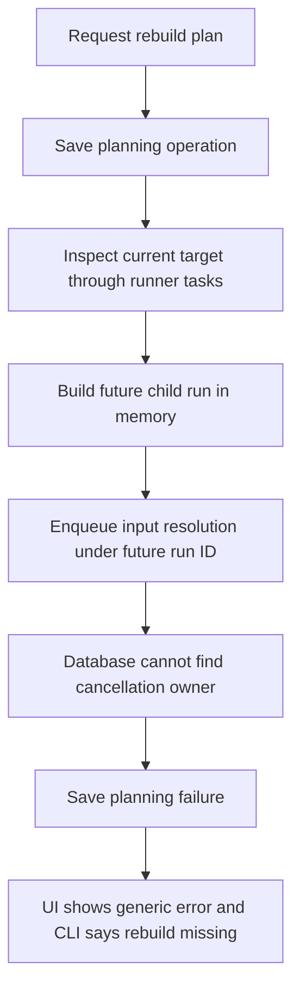
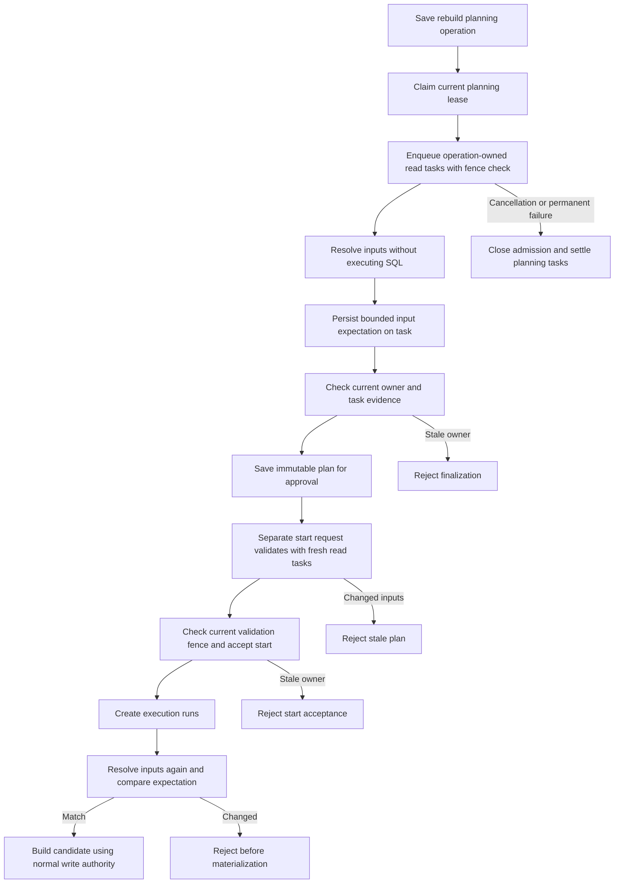

# Change Record: Give rebuild input planning a durable owner

| Field | Value |
| --- | --- |
| Status | Plan reviewed |
| Type | Bug fix |
| Primary issue | [#758](https://github.com/eirhop/favn/issues/758) |
| Pull request | [#759](https://github.com/eirhop/favn/pull/759) |
| Related work | Existing rebuild planning, runner tasks, and operation cancellation |
| Affected areas | Core task contracts, Runner input resolution, Orchestrator rebuild planning, PostgreSQL task ownership, API, CLI, and View errors |
| Approved plan commit | `bb56fb31f2c1defa53dda43209209406299447bb` |
| Approved manual-retry amendment commit | `924a2a55818cb78bd33696d6394724fa3fe54581` |
| Last updated | 2026-09-23 |

The original approved baseline is preserved below. The
[manual-retry amendment](#manual-retry-amendment-2026-09-23) changes only pre-write
validation recovery and its budget; where they differ, the approved amendment
takes precedence. Implementation has not started.

## One-minute summary

Rebuild planning asks a runner to resolve input files under a future run that has
not been saved. PostgreSQL correctly rejects the task because that run has no
durable cancellation owner. The proposed change gives this read-only work the
already-saved rebuild operation as its owner, freezes its input expectations,
and leaves materialization behind the separate start command. It also closes
the missing storage fence on plan finalization and reports planning failures
without calling an existing rebuild missing. These ownership, persistence, and
runner-contract changes require an independently reviewed plan.

Reader: contributors implementing or reviewing issue #758. This is an explanation
and implementation plan, not the canonical rebuild contract.

## Impact

An operator cannot rebuild a SQL table with runtime inputs after an incompatible
contract change. For example, changing `MyApp.Source.Records.code` from an integer
to a string leaves the target correctly marked `rebuild_required`, but planning
fails before approval or replacement is possible. The failing enqueue dispatches
no rebuild write; the existing readable table remains in place.

The lifecycle repair is medium in scope. It reuses the existing rebuild operation,
runner task queue, assignment leases, result persistence, and operation retention.
It introduces no new scheduler, planning-run type, or input-payload table. Initial
planning, start validation, and retry validation share one bounded operation-owned
validation mechanism.

## Problem analysis

### Assumptions

- Source baseline is `94b299df35d666b16bb1beb11fc9b706ac52f69f`, current
  `origin/main` and `v0.5.0-rc.18` on 2026-09-23.
- Runtime-input resolution is the existing read-only phase before SQL rendering
  and session acquisition. Arbitrary resolver side effects are outside its contract.
- Planning freezes resolver, input identity, and payload fingerprint. Start and
  retry must freshly revalidate them before acceptance; execution resolves inputs
  again and must match them before materializing.
- Resolvers may depend on the future child run ID, exact windows, or evaluation
  time. Planning must preserve that context without creating an executable run.
- Only the change record and its review are requested now. Implementation and
  end-to-end qualification have not begun.

### Evidence

| Evidence | What it proves | What it does not prove |
| --- | --- | --- |
| [RuntimeInputs.freeze_one/5 and resolve_expectation/6](../../../apps/favn_orchestrator/lib/favn_orchestrator/rebuild/runtime_inputs.ex), [SubmissionBuilder](../../../apps/favn_orchestrator/lib/favn_orchestrator/run_manager/submission_builder.ex) | A future run is constructed in memory and used to enqueue input resolution | Successful end-to-end rebuild behavior |
| [Task enqueue](../../../apps/favn_storage_postgres/lib/favn_storage_postgres/runner_tasks/store.ex), [CancellationOwnership](../../../apps/favn_storage_postgres/lib/favn_storage_postgres/cancellation_ownership.ex) | A non-null run ID requires a saved submission or run | A defect in ordinary cancellation admission |
| Temporary PostgreSQL probe on 2026-09-23 using the real SQL task payload and enqueue path | Exact `cancellation authority not found` error; zero tasks persisted; the same task succeeds after its run exists | Runner execution, DuckLake behavior, or a complete fix |
| [Runtime-input pin persistence](../../../apps/favn_storage_postgres/lib/favn_storage_postgres/runs/store.ex), `runtime_input_pins_run_fk` | Pin persistence and reads require an actual saved run; a submission alone is insufficient | That planning needs to retain resolved parameter payloads |
| [AssetRunnerTasks.prepare/5](../../../apps/favn_orchestrator/lib/favn_orchestrator/asset_runner_tasks.ex), [operation cancellation](../../../apps/favn_storage_postgres/lib/favn_storage_postgres/rebuilds/store.ex) | Planning puts the rebuild ID only in continuation metadata, while cancellation selects the durable task `operation_id` | An observed live orphan in this incident |
| Temporary PostgreSQL takeover probe on 2026-09-23 and [CreateRebuildPlan](../../../apps/favn_orchestrator/lib/favn_orchestrator/persistence/commands/rebuilds.ex) | A finalization command built before owner takeover succeeds after the fencing token increases; the command carries no owner or fence | A live race frequency or resulting data-plane mutation |
| [Rebuilds.start/4, retry/4 and revalidate_plan/2](../../../apps/favn_orchestrator/lib/favn_orchestrator/rebuilds.ex) | Start and retry resolve inputs and inspect capabilities/physical state again; these phases need fresh task identities | That reusing an initial planning task can detect changed inputs |
| [RebuildsRouter](../../../apps/favn_orchestrator/lib/favn_orchestrator/api/rebuilds_router.ex), [CLI mapping](../../../apps/favn/lib/mix/tasks/favn.rebuild.ex), [View mapping](../../../apps/favn_view/lib/favn_view/rebuilds_live.ex) | Internal ownership not-found becomes misleading rebuild-not-found; UI falls back to a generic message | A genuine missing-operation response |
| Existing `rebuilds_test.exs` and `rebuild_planning_worker_test.exs`: 13 passed | Current unit behavior passes with fake task persistence | PostgreSQL cancellation authority, input-pin foreign keys, or finalization fences |

## Current behavior

Saving a submission to satisfy the first guard would leave pin persistence,
rebuild cancellation, and child-task identity problems unresolved. Planning and
materialization currently derive task identity from the same future run, node,
and attempt. The replacement must distinguish the two purposes explicitly.

## Approved plan (original baseline)

Astra approved this baseline on 2026-09-23 after reviewing and rechecking the
issue, primary source, diagnostic probes, and corrections below.

### Ownership and result contract

Add one explicit `:runtime_input_resolution` operation task kind. Its bounded
request carries the existing pinned runner-work context needed by the resolver,
including future child run ID, asset/node, execution-package reference, manifest,
runner release/pool, exact windows, and evaluation time. The future run ID is
resolver context only: the task row has `run_id: nil`, a required `operation_id`,
and no write claim, write target, or target-operation lock. Validation rejects
using this kind for ordinary asset execution or attaching mutation authority.

Use a typed expectation result containing the resolver, input identity, and
payload fingerprint. Bind it to the exact request and assignment through the
existing task identity and result-validation boundary. The runner invokes the
existing resolver in its supervised, cancellable operation execution path and
returns only this expectation. It must never invoke SQL execution, acquire a
materialization session, write a run pin, or return resolver parameter values or
metadata in the generic task result. Normal asset execution retains the existing
encrypted run-pin handshake and validation.

Keep task payloads compact: extend package-reference extraction and cold-process
decoding for the new request rather than embedding SQL or execution packages.
Reuse the existing task result as the durable planning snapshot; copy the small
expectation into the immutable plan item only at finalization. No new table of
planning parameters is needed. Parameter payloads live only for the resolver
invocation; actual execution resolves and securely pins its own parameters.

The new task uses a separate deterministic identity namespace based on workspace,
rebuild operation, action/item, immutable request hash, validation purpose/attempt. Identity
excludes the worker lease token so a successor can recover the same task. It
cannot collide with a later materialization attempt. The original resolver run
context and evaluated time remain stable across both phases.

### Validation lifecycle and fencing

Use one typed, bounded validation request on the existing rebuild operation,
separate from its immutable plan payload/hash. The migration adds its codec-backed
storage field: purpose (`plan`, `start`, or `retry`), opaque attempt ID, initiating
command/idempotency identity and request hash, authorized actor, requested time,
absolute deadline, status, and bounded failure. Reuse the operation's dispatcher
owner/token/lease and existing planning worker/supervisor. No new queue or public
operation state is needed. A fresh start/retry request persists this intent before
any reads are dispatched; a replay or recovery resumes that exact attempt.

| Purpose | Parent state and admission | Deadline | Success |
| --- | --- | --- | --- |
| Initial plan | `planning`, saved initial request | Initial request plus five minutes | Freeze actions/items and plan hash |
| Start validation | `planned`, explicit admin request for exact approved ID/hash | Request plus five minutes, capped by plan expiry | Acquire/recheck target locks and accept `queued` |
| Retry validation | Eligible `failed` operation with an immutable plan, explicit admin request and existing safe-retry checks | Request plus five minutes; original approval expiry does not disable an already-started rebuild retry | Requeue only work the existing retry contract allows |

Only one validation attempt can be active per operation. Identical request
replays return/resume that attempt; conflicting concurrent requests fail with a
stable busy/conflict result. A later explicit request after a terminal validation
failure gets a fresh attempt, while retries of the same idempotency identity do
not reset deadlines. Capture the authorized request through every entry point,
including the public facade without an HTTP idempotency wrapper. Automatic
recovery may continue an already-authorized request, but cannot invent approval.
Generic operation claiming may select `planned`/`failed` only when such an active
validation request exists; it must never start arbitrary reviewed plans.

All capability, marker-read, relation-inspection, and input-resolution tasks use
the validation purpose and attempt in their identities. Start/retry therefore
perform fresh reads, while recovery within one attempt reuses its existing tasks.
The future child run ID and resolver evaluation context remain the original plan's
values; they do not become the validation attempt ID or its wall-clock time.

Planning/validation enqueue commands carry current owner ID and fencing token.
Lock the parent first and verify the same workspace, active attempt, request hash,
live lease, current owner/token, allowed parent state, and absence of cancellation
in the enqueue transaction. Then acquire task locks in a consistent order. Apply
this to every read task in the validation attempt, without changing ownership of
later activation/cleanup work.

Task claim, start, explicit retry/requeue, and successful result acceptance must
transactionally check that the parent and exact validation attempt still permit
them. Cancellation, permanent validation failure, and deadline exhaustion close
that attempt and cancel queued/assigned work through operation-scoped cancellation.
Active work receives cancellation and retains assignment fencing until settled.
Late success cannot install expectations or change a closed attempt. Diagnostic
settlement remains possible so closing admission cannot strand leases or demand.
Cancellation and enqueue serialize on the parent row, not an application precheck.
A new attempt cannot bypass unresolved task settlement from an earlier attempt.

The existing supervised worker keeps renewing while awaiting results. A successor
claims the active validation request, reuses successful results, and waits for
valid in-flight tasks instead of duplicating resolver invocations. Completion is
authorized by the task's assignment fence and the live attempt, not the obsolete
worker token; the current successor may consume the same unchanged task result.
New enqueue and final acceptance always require the current worker token.

Finalization locks the parent and verifies live owner/token, active attempt,
current state, immutable planning/approval identity, deadline, and required
successful task evidence. Initial planning then saves plan actions/items and
expectations atomically. Start/retry compare fresh expectations and physical
checks with the immutable plan and pass the same attempt/fence/evidence into the
existing queued transition. Recheck storage-authoritative binding versions and
write-lock fences at acceptance; release newly acquired locks on safe rejection.
Reject stale workers even when their plan hash is correct. Exact replay of an
already successful command returns its receipt without a new state change.

A failed initial plan becomes `failed` with a safe planning error. Failed start
validation leaves the reviewed plan `planned`; failed retry validation leaves the
original `failed` operation and its write-outcome evidence intact. Save validation
failure separately. Changed inputs remain `rebuild_plan_stale` (HTTP 409), never a
replacement plan. Unknown write outcomes and unsafe retry eligibility are rejected
before beginning a retry validation; validation cannot clear them.

### Error contract

Once a rebuild operation exists, wrap a permanent planning or validation failure in a bounded
orchestrator-owned error containing a stable reason code, operation ID, safe
message, and outcome. Preserve the original bounded diagnostic in durable failure
state. Internal missing authority or missing snapshot is a planning failure, not
a missing public rebuild. The API returns distinct `rebuild_planning_failed` or `rebuild_validation_failed`
errors (HTTP 422 for a settled safe failure), preserving 409 for stale plans and
conflicting requests; transient unavailability
keeps its existing retryable/unavailable classification and operation identity.
CLI and View render the safe message and operation ID through their existing
public facade/DTO paths. Actual missing plan/operation lookups retain HTTP 404.
Do not expose raw storage exceptions, SQL, parameters, or resolver metadata.

### Contracts and invariants

- Plan never submits a child run or materialization, acquires write authority,
  changes the active generation, or replaces the existing table.
- Every planning task has an existing workspace-scoped rebuild owner. Ordinary
  run cancellation and admission remain enforced without exceptions.
- The request binds exact manifest, package, resolver context, and runner release.
  A mismatched result, cross-workspace owner, or changed payload is rejected.
- Start retains the existing exact plan/hash approval and stale-plan checks.
  Resolver, input identity, and fingerprint must all match before writes.
- No sensitive parameter payload is persisted in task results, plan JSON, logs,
  or UI. Actual execution continues using encrypted runtime-input pins.
- Reuse successful durable results. Do not automatically re-execute a started
  resolution whose result was lost. This dedicated read-only kind settles as
  terminal `failed` with `resolution_result_unavailable`, `safe_failure`, and
  `retryable?: false`; missing evidence is never a successful expectation. Requeue
  only when the existing protocol proves the task unstarted and parent admission
  allows it. Ordinary unknown writes retain their current fencing and resolution.
- Capacity demand, leases, cancellation, and retention settle through existing
  task mechanisms. No generic retry framework or parallel planning scheduler.
- SQL assets without inputs produce a nil expectation without resolution tasks.

### Scope and non-goals

Include the dedicated task/request/result contract, its migration and codecs,
operation ownership checks, finalization fencing, input expectation consumption,
error presentation, focused integration tests, and canonical documentation.
Remove the obsolete rebuild-only `runner_task_mode` execution path and continuation
when replaced, with explicit handling of retained old payloads during upgrade.

Exclude table-rebuild algorithms, generation activation, new materialization retry
policies, automatic repair of existing failed operations, unrelated run recovery,
resolver APIs/DSL, and changes to target write concurrency.

### Implementation slices and complexity budget

Supporting lines include tests, shared fixtures, and canonical documentation.
Exclude this record, generated files, locks, and formatter-only changes. Preserve
the approved ranges and explain overruns above the upper bound by more than 25
percent or 100 lines, whichever is smaller; also explain missing planned deletions.

| Slice | Outcome and owner | Production added | Production deleted | Supporting added | Supporting deleted |
| --- | --- | ---: | ---: | ---: | ---: |
| 1 | Typed planning resolution request/result, compact codec, runner operation; Core and Runner | 150-250 | 30-70 | 200-350 | 15-40 |
| 2 | Parent-owned validation attempts for plan/start/retry, migration, input freezing, recovery and retention; Orchestrator and PostgreSQL | 400-650 | 80-150 | 550-850 | 25-65 |
| 3 | Storage-enforced plan/start/retry acceptance fences and evidence; Orchestrator and PostgreSQL | 100-180 | 30-65 | 170-280 | 10-35 |
| 4 | Actionable planning errors and canonical guidance; Orchestrator, CLI and View | 50-100 | 15-35 | 120-220 | 5-25 |
| Total | One bounded validation-lifecycle repair | 700-1180 | 155-320 | 1040-1700 | 55-165 |

The size is driven by the real cross-app task contract, fresh start/retry
validation, and transaction/race proof.
Using existing task results avoids a separate pin schema and key-retention system.
If a smaller implementation preserves these boundaries, prefer it and record the
decision; adding a second lifecycle or broad recovery redesign requires re-review.

### Implementation map

| Concept | Expected code area | Responsibility |
| --- | --- | --- |
| Request/result, kind and codecs | `apps/favn_core/lib/favn/contracts/runner_task*` and new narrowly named contract structs | Bounded request/result shape, manifest/package validation, safe cold decode |
| Resolution execution | `apps/favn_runner/lib/favn_runner/task_executor.ex` and existing resolver | Cancellable read-only invocation and expectation-only result |
| Planning owner and commands | `apps/favn_orchestrator/lib/favn_orchestrator/rebuild*`, `operation_runner_tasks.ex`, persistence commands | Freeze task context, await/recover results, carry current lease fence |
| Atomic ownership and settlement | `apps/favn_storage_postgres/lib/favn_storage_postgres/runner_tasks/`, `rebuilds/`, migration | Parent-before-task checks, cancellation, finalization, bounded retention |
| Public error projection | Rebuild API/router/operator DTO, `favn.rebuild` CLI, rebuild LiveViews | Safe failure with operation ID; genuine not-found preserved |
| Canonical explanations | [Target generations and rebuilds](../../architecture/target-generations-and-rebuilds.md), [PostgreSQL data model](../../storage/postgresql/data-model.md), [operator workflow](../../operators/runs-and-schedules.md) | Describe implemented ownership and operator action once |

## Operational design

### Failures and recovery

Persist an absolute five-minute deadline on each authorized validation attempt
and pass it to its tasks and waits. Start/retry use their own request time and do not inherit the initial planning
deadline. Cap only initial start acceptance by plan expiry. A rebuild already
started before expiry may safely fail much later; its existing retry eligibility
must remain available without extending or replacing the approved plan. Recovery must
not restart any attempt deadline. Resolver-local timeout remains within the
remaining budget. Storage unavailability cannot fabricate success or change the frozen
request. Resume durable work within the original deadline; if it expires, close
admission, request cancellation, and expose the saved operation and failure.

An unacknowledged task result may be redelivered under the existing assignment
protocol; use the same identity and verify its hash while that assignment is
valid. A lost result, expired started assignment, interrupted resolver, or exhausted
attempt must not rerun that invocation automatically. Settle this dedicated kind
as terminal `failed`, `safe_failure`, `retryable?: false`, with stable
`resolution_result_unavailable` or the appropriate bounded failure class. The
proof is the validated dedicated request and executor path: it has no SQL/write
entry point or write authority, and cannot mutate a target. Do not grant this
classification through metadata on an ordinary asset task.

Keep the initial default retry class conservative (`unknown_do_not_retry`), but
handle this kind explicitly in runner interruption/result classification and
storage expired-assignment recovery. It must not create an unresolvable `unknown`
read task. If a raw unknown error arrives, preserve its bounded diagnostic while
settling the read-only operation as unavailable, without manufacturing an input
expectation or retrying. A late result after assignment expiry/final settlement
is fenced; successful redelivery before settlement remains idempotent. Capacity
and leases release through the normal terminal-failure path, and existing retention
can retire that evidence. An operator may explicitly request a fresh attempt or
new plan after diagnosis. No generic `resolve_write` permission or unknown-task
retention exception is introduced. Ordinary unknown write outcomes and held-write
protections remain unchanged.

Cancellation requests and permanent planning failure must prevent later enqueue,
claim, retry, or successful finalization even if a worker continues briefly.
Do not delete live task evidence or release it solely because a worker lease
expired. Operation retention protects nonterminal task evidence through existing
`operation_id` references and removes terminal planning tasks with their owner.

### Logs and diagnostics

Use existing rebuild/task telemetry and bounded error envelopes. Report workspace,
operation/task ID, phase, stable reason code, outcome, and owner/assignment token
where useful. Emit one failure transition or ownership-loss event, not every poll.
Never log input identity contents, parameters, resolver metadata, SQL, credentials,
or arbitrary exception terms. Operator-facing errors use allowlisted messages.

### Deployment, migration, and compatibility

Add a PostgreSQL migration for the new task-kind constraint, bounded validation
request field, active-attempt recovery lookup, and request/result constraints. No rewrite of run-pin ownership or historical run rows is planned. Keep old task kinds and retained ordinary task payloads
readable; cover that in cold-process upgrade tests.

Use an additive capability extension: retain task wire version **15**, manifest
runner contract **17**, persisted task payload version **2**, and their existing
envelope encodings. The registration/assignment message shapes and old task/result
shapes do not change. Extend the known task-kind/request/result schema and package
reference handling only for the new kind. Existing `supported_task_kinds`, exact
runner release/pool selection, and payload validation remain the dispatch boundary:
a runner that does not advertise the new kind must never receive it, even though
it uses the same wire version. Test actual old-style registration and claim.

Require a runner release built with the new capability for affected rebuilds.
If a registered pinned runner lacks it, report a bounded capability mismatch;
absence of any runner may wait for normal capacity activation only until the
attempt deadline. Never fall back to a resolution-only asset task. Deployment
order is migration, capable control plane, capable runner release, then a manifest
published/activated with that exact release. Ordinary retained payloads and
results remain readable without envelope rewriting or a manifest version bump;
old ordinary runner tasks keep their current protocol during this additive rollout.
No global ordinary-work drain is required for the additive extension. A global
protocol/version bump or dual-version decoder is outside this approved plan and
requires re-review if implementation reveals a necessity.

Stop new rebuild planning and drain/cancel old planning work before enabling this capability. Do not reinterpret a retained resolution-only asset task as the new kind
or silently resume one under weaker authority. Retained ordinary tasks remain
readable; a legacy planning continuation needing the removed path must settle
with an actionable recreate-plan outcome. The known RC18 failures have no input
task or dispatched rebuild write; preserve their failed records and create a new
plan after upgrading. Do not automatically start it.

Rollback requires stopping new planning and draining/cancelling new-kind tasks
before restoring old binaries. Do not drop the widened task constraint while
new-kind evidence is retained. Old binaries cannot consume new-kind tasks. Retain the database migration on
rollback while their evidence exists; do not silently discard that evidence.

## Verification plan

| Acceptance criterion | Planned evidence | Owning layer |
| --- | --- | --- |
| Original failure becomes a planned rebuild | Real PostgreSQL plus normal runner registration/claim/preparation/execution/result path; generic SQL resolver fixture, saved expectation and plan hash, no future run/submission or run pins at plan time | Storage and Runner integration |
| Planning leaves the table unchanged | PostgreSQL-backed DuckLake test: materialize old contract, activate incompatible contract, plan, compare active generation, marker, relation schema and rows, and assert zero write tasks/claims | End-to-end acceptance |
| Approved plan can execute | Start exact ID/hash; assert fresh capability/physical/input task IDs after a delay beyond the original planning deadline but before plan expiry; matching inputs rebuild successfully; changed resolver/identity/fingerprint rejects before accepting start and again before execution writes | End-to-end acceptance |
| Retry validates safely | Eligible failed immutable plan gets a fresh validation attempt and reads, including a rebuild started before approval expiry that fails after it; changed inputs reject; unsafe/unknown writes reject before dispatch; no successful child work repeats | Storage and Runner integration |
| Validation request is durable | Same idempotency resumes one attempt, distinct concurrent requests conflict, crash after persisted approval resumes without a new approval, and generic claiming never starts an unapproved planned operation | Storage-backed runtime |
| Resolver context is preserved | Run-ID-dependent and exact-window/evaluation-time fixture; plan and execution contexts agree; planning and write task IDs differ | Orchestrator and Runner |
| Cancellation is durable | Independent PostgreSQL connections serialize enqueue/claim/start against cancel, including before first task, during resolution, and after result-before-finalization; no runnable orphan or leaked demand/lease | Storage concurrency and Runner integration |
| Recovery and deadline are bounded | Kill worker before/after task enqueue, after result persistence, and before plan/start/retry acceptance; successor reuses task/result and attempt deadline, lost started read settles without rerun | Storage-backed runtime tests |
| Stale finalization is rejected | Expire owner A, claim owner B, submit A's previously built command; expect fenced, no plan/candidate mutation, then B can finalize; repeat for start/retry acceptance, cancellation, expiry, and exact successful replay | Storage concurrency |
| Sensitive input payload stays private | Sentinel parameters/metadata absent from persisted task/results/plan/logs; bounded forged, oversized, wrong-package and wrong-workspace requests/results rejected | Core codec and Storage |
| Existing admission stays intact | Ordinary run cancellation/admission and runtime-input pin tests; no-input SQL planning still succeeds; old resolver-only task shape cannot bypass new ownership | Storage and Orchestrator |
| Capability and upgrade behavior are honest | Assert unchanged versions 15/17/2; real old/new capability registration/claim; retained ordinary payload AND result cold decode; legacy planning rejection; migration and rollback precondition checks | Core/Storage acceptance |
| Lost read result settles safely | Kill a preparing/running resolution runner, expire its assignment, exercise late result and unavailable acknowledgement; terminal non-retryable failure, no repeated resolver or successful expectation, released demand/leases and eligible normal retention; ordinary unknown-write regression remains blocked | Runner and PostgreSQL concurrency |
| Errors are actionable | Settled planning failure with operation ID in API/CLI/LiveView; true missing ID stays 404; transient unavailable stays retryable/unavailable; no raw payload leakage | Owning API, CLI and View tests |
| Evidence retention is safe | Parent retirement with pending/settled tasks, result replay during planning, and cleanup after terminal operation | PostgreSQL maintenance tests |

Run the narrow owning-layer slices first with `mise exec -- mix` and app-scoped
`cmd mix test`. Use a dedicated bootstrap-owned disposable PostgreSQL test database
and the documented test pin key. Before implementation completion, run formatting,
warnings-as-errors compilation, the fast suite, affected acceptance/slow tiers,
and test-tag guard. Obtain independent implementation review against this baseline
and exact-head CI. Tests are not proof of a deployed customer rebuild.

## Risks and open questions

| Risk | Impact | Decision or mitigation |
| --- | --- | --- |
| New task contract touches codec and queue assumptions | Retained tasks become unreadable or wrong runners receive work | Explicit capability/version audit, cold-decode and mixed-version rejection tests |
| Parent/task lock order changes | Deadlock or cancellation that loses a race | Parent-first order across all planning mutations; deterministic concurrency tests |
| Saving only expectation loses resolver payload | Execution cannot reuse planning parameters | Intended: execution resolves again and validates exact identity/fingerprint before its normal encrypted pin |
| Resolver depends on context | Matching data appears changed at execution | Preserve future run ID, exact windows, immutable package and evaluated time |
| Fencing closes admission but prevents settlement | Leaked capacity or nonterminal tasks | Separate permission to start/succeed from permission to cancel and settle diagnostics |
| Start/retry reuse an earlier validation snapshot | Changed inputs or physical drift are missed | Fresh attempt namespace for all reads; recover only within the same attempt |
| Existing inspection tasks outlive a failed planner | Runnable orphan reads | Apply parent planning checks and cancellation to every planning read task in this operation |
| Input identity may contain sensitive values | Leakage through errors or telemetry | Keep identity out of logs/errors; preserve existing bounded plan access and redaction contract |

There are no unresolved ownership or compatibility choices in this baseline.
If implementation invalidates the additive capability strategy or requires a
new persistent ownership table, stop that expansion and re-review the plan and
budget first.

## Plan review

| Field | Result |
| --- | --- |
| Reviewer | Astra (`gpt-6-astra`), xhigh reasoning; independent agent `astra_plan_review_758` |
| Reviewed against | Issue #758, baseline source, PostgreSQL probe evidence, and this record |
| Findings | First review required fresh start/retry validation, explicit version compatibility, and settlement of lost read-only results. Re-review additionally required preserving eligible retry after initial approval expiry. |
| Findings addressed and rechecked | Same-operation validation attempts, additive versions 15/17/2, terminal non-retryable read failure, and retry deadlines independent of initial approval expiry were added. Astra rechecked all four corrections and accepted the revised scope and budget. |
| Verdict | Plan approved; no remaining blocking findings. This approves the plan only, not implementation correctness or deployment readiness. |

## Manual-retry amendment (2026-09-23)

The operator confirmed: "For rebuilds it is ok to manually retry since it is
manual work and not scheduled work." Apply this to the checks before initial
planning, start, and retry are accepted. An interrupted check attempt stops and
requires a fresh explicit request. Do not build the baseline's automatic
resumption of these attempts.

The scope is pre-write validation. Once start/retry has committed `queued`, the
existing rebuild execution, activation reconciliation, held-write protection,
and checkpoint recovery remain in force. Changing those would be a separate
design decision involving possibly completed table writes.

### Smaller lifecycle

Keep the dedicated operation-owned resolution task, expectation-only result,
fresh checks for each purpose, bounded attempt record, lease/fence, cancellation,
and atomic acceptance from the baseline. These prevent changed inputs, duplicate
requests, or an expired worker from starting a rebuild. Manual retry cannot
replace those protections.

Remove successor validation workers, reconstruction of an approved request after
restart, reuse of partial checks across worker incarnations, and background
continuation of start/retry validation. Use the existing supervised planning
worker for one live attempt, with a unique owner per worker incarnation. A
client disconnect does not kill this worker; loss of its process or ownership
does end the attempt. Do not introduce a new supervisor or scheduler.

Beginning an authorized request atomically records the bounded attempt and its
initial dispatcher owner/fence/lease before any read is dispatched. The worker
renews that exact lease with the existing renewal contract; it cannot reacquire
an expired lease or claim an interrupted attempt. Keep one active attempt per
operation. Admission and final acceptance retain parent-first transactional
checks for workspace, state, purpose, attempt, immutable request identity,
deadline, live owner/fence, cancellation, and required successful task evidence.
For start/retry, acquire the sorted target locks inside the PostgreSQL acceptance
transaction, after verifying the parent/attempt fence, using a narrow internal
lock-store helper. Locks, successful acceptance, attempt closure, command receipt,
and operation-lease handoff commit or roll back together. Ordinary execution
dispatch begins only after `queued` commits. Preserve existing held-write guards
and use a consistent parent-first lock order.

All capability, marker, relation, and input checks are namespaced by the fresh
attempt. Successful results can be consumed and redelivered during that same
live attempt. They are never adopted by a replacement validation worker or a
fresh attempt. Future run ID, exact windows, and evaluation time still come from
the original immutable resolver context, not the new attempt time.

An identical command replay may observe/join its still-live attempt or return
its saved outcome; it cannot launch a replacement worker or reset the deadline.
Conflicting requests return busy. After an interrupted attempt has settled, a
deliberate retry uses a fresh request identity and fresh checks. Direct facade
calls without a supplied idempotency key receive an identity at their command
boundary. Existing successful command receipts remain authoritative: after a
lost reply, inspect/replay the original command before deciding that it failed.

### Interruption and cleanup

Keep the baseline's fixed five-minute budget. Initial start is also capped by
plan expiry; safe retry of an already-started rebuild is not. A worker failure,
lease expiry, absolute deadline, or lost started resolution result closes the
attempt. Report `rebuild_validation_interrupted` through the baseline's safe
planning/validation error envelope, with the operation ID and manual action.
No automatic resolver retry or validation resumption follows.

Closing an attempt requests cancellation of its read tasks only. It must not
cancel historical execution tasks or replace their outcome evidence during a
retry check. Storage admission/result checks enforce the live attempt and lease
even before a cleanup sweep runs, so a briefly surviving old worker cannot
enqueue, accept success, save a plan, or start work. Late diagnostic settlement
and cancellation acknowledgements remain allowed under assignment fencing.

The existing dispatcher performs bounded expiration cleanup for active validation
attempts, including attempts on `planned` and eligible `failed` operations. Use
an indexed lookup against the bounded validation field/deadline and existing
lease columns. This sweep atomically verifies expiry and closes/cancels the
attempt; it never claims that attempt to resume its checks. It also catches a
crash after saving intent but before worker startup. The generic operation claim
path must exclude active validations and must stop routing `planning` to a
successor worker. Ordinary accepted execution and cleanup claiming remain as
before once the validation guard permits them.

Known local worker death may trigger the same idempotent closure immediately;
after a process/node crash, lease expiry provides the durable fallback. Do not
depend on `terminate/2` or registry contents for correctness. If storage is
temporarily unavailable, success stays fenced by the expired lease, and cleanup
converges when storage returns. A fresh attempt waits until old task assignments
are settled. It does not extend the old deadline or erase retained evidence.
The baseline's read-only terminal-failure classification, cancellation settlement,
capacity release, and normal retention continue to apply.

| Interrupted phase | Durable result | Operator action |
| --- | --- | --- |
| Initial planning | `failed`, with a safe planning error; no approved plan | Request a new plan with a fresh request identity, then review it |
| Start validation | Original plan remains `planned`, with a separate validation failure | Start the same exact plan/hash again if unexpired; otherwise create and review a new plan |
| Retry validation | Original operation remains `failed`; execution/unknown-outcome evidence is preserved | Request retry again, subject to the existing safe-retry checks |
| Reply lost after acceptance committed | Saved plan or `queued`/later operation and command receipt remain authoritative | Fetch/replay the original result; do not create another attempt or duplicate writes |

Cancellation of the whole rebuild remains an explicit separate operation. A
validation interruption must not call an operation-wide cancellation path that
destroys a reviewed plan or changes prior execution/cleanup eligibility.

Attempt closure must lock the parent and verify that the exact attempt is still
unaccepted. An unavailable response from start/retry is not proof that acceptance
failed: if `queued` committed, a stale worker or expiration sweep must preserve
its execution locks and evidence. If storage cannot confirm the outcome, retain
that evidence until the saved command result can be read. Remove the current
caller-side acquisition and unconditional lock-release-on-start-error path;
atomic acceptance needs no separate pre-acceptance lock cleanup or durable lock
reference list. Validation closure cancels only its read tasks and never releases
accepted execution or historical held-write locks. An expired validation worker
cannot acquire or renew target locks.

### Verification and documentation delta

Retain the baseline's ownership reproduction, real runner/PostgreSQL path,
unchanged-table proof, input/context checks, capability/cold-codec checks,
cancellation races, unknown-write regression, and safe public errors.

Replace the automatic-resumption tests with these focused cases:

- Kill the validation worker before enqueue, during checks, after a persisted
  result, and before acceptance. Restart/expiry performs cleanup only: no new
  checks, plan finalization, or accepted start/retry occurs automatically.
- Race expiry, cancellation, stale finalization, and fresh explicit retry over
  independent PostgreSQL connections. Old work cannot succeed; new reads use a
  fresh attempt and wait for prior assignments to settle.
- Replay a live, interrupted, and committed command. Only the same live worker
  can continue an attempt; saved receipts never create a second rebuild.
- Fail start/retry checks without changing the plan or earlier execution
  evidence; retry remains eligible after original approval expiry when allowed.
- Interrupt after `queued` commits and verify the existing execution recovery
  and unknown-write safeguards still apply. Commit acceptance, lose its reply,
  and make storage unavailable; neither the caller nor expiration cleanup may
  release the accepted rebuild's locks or replay its writes.

During implementation, document manual retry in the canonical rebuild/operator
guides and narrow the pre-write restart promises in
[Elastic Runners](../../architecture/elastic-runners.md). The original baseline
diagrams still describe ownership and successful acceptance; their stale-owner
branches remain valid. No new diagram is needed for the phase/outcome table.
Migration uses the validation field and an expiration lookup rather than a
recovery lookup that selects work to resume. Additive versions 15/17/2 and the
baseline rollout/rollback requirements are unchanged.

### Revised complexity budget

The original budget above is retained for comparison. This amendment replaces
slice 2 and the total; the other slices keep their original ranges. Counts use
the same inclusion rules and are estimates, not a target to fill.

| Slice | Outcome | Production added | Production deleted | Supporting added | Supporting deleted |
| --- | --- | ---: | ---: | ---: | ---: |
| 1 | Typed read task and runner execution | 150-250 | 30-70 | 200-350 | 15-40 |
| 2 | Single live validation attempt, fresh checks, expiration/cancellation and manual retry | 250-420 | 100-170 | 360-550 | 40-90 |
| 3 | Atomic plan/start/retry acceptance and stale-worker rejection | 100-180 | 30-65 | 170-280 | 10-35 |
| 4 | Actionable errors and canonical guidance | 50-100 | 15-35 | 120-220 | 5-25 |
| Total | Manual validation retry | 550-950 | 175-340 | 850-1400 | 70-190 |

This reduces estimated production additions by about one fifth. Most of the
remaining work is the dedicated cross-app task contract and durable ownership,
not automatic recovery. Removing the attempt record or fencing would hide real
concurrency problems rather than simplify them safely.

### Amendment review

| Field | Result |
| --- | --- |
| Reviewer | Astra (`gpt-6-astra`), xhigh; independent agent `astra_plan_review_758` |
| Finding and simplification | A lost start acknowledgement must not release accepted execution locks. Acquire locks inside the acceptance transaction and remove caller-side acquisition/release, avoiding a separate cleanup lifecycle. |
| Recheck | Astra rechecked atomic acquisition, exact-attempt closure, receipt handling, expiration-only cleanup, manual retry, and the revised complexity budget. |
| Verdict | Manual-retry amendment approved; no remaining blocking findings. The approximately 20 percent reduction is credible; most remaining work is required task/ownership contracts. |

Approval covers this amended plan only. Implementation and runtime qualification
have not begun.

## Implementation outcome

Implementation has not started. This request prepares and reviews the plan only.
The draft PR holds the original reviewed baseline and the manual-retry amendment.
Both are independently approved; implementation remains separate work.

## Deviations from the approved plan

| Planned | Amended | Reason | Reviewer verdict |
| --- | --- | --- | --- |
| Resume pre-write validation after worker/node restart | Close interrupted checks and require a fresh manual request; retain expiration/cancellation cleanup | Operator explicitly accepts manual retry for rebuilds; removes successor validation/recovery machinery | Approved by Astra xhigh |
| Acquire start locks before acceptance and release on rejection | Acquire locks in the acceptance transaction; remove caller-side release | Fewer cleanup paths and no accidental release after a committed start loses its reply | Approved by Astra xhigh |

Implementation has not started. The original approved plan and budget above
remain preserved for comparison with this amendment and eventual implementation.

## Verification evidence

| Check | Result | Evidence boundary |
| --- | --- | --- |
| Original ownership failure | Reproduced on real PostgreSQL; identical task accepted after saving a run | Temporary diagnostic probe, not committed regression or full runner execution |
| Missing finalization fence | Reproduced on real PostgreSQL after ownership takeover | Temporary diagnostic probe, not a live incident |
| Existing rebuild/planning worker unit tests | 13 passed on baseline | Fake task persistence does not cover the reported guard |
| Record links and diff whitespace | All repository-relative link targets exist; `git diff --check` clean | Documentation validation only |
| Mermaid diagrams | Both parsed, rendered with Mermaid 11, and visually inspected before the planning commit; both also rendered with GitHub's live Mermaid renderer from the pushed baseline | Documentation rendering only; no diagram changes after approval |

### Not verified

No fix, migration, new runner contract, full rebuild, cancellation-race repair,
customer deployment, or production load has been qualified. The implementation
checks above remain required work for the subsequent implementation.

## Final review

Not requested yet. Independent implementation review must compare code, tests,
canonical docs, actual complexity, and every deviation with the approved baseline.
