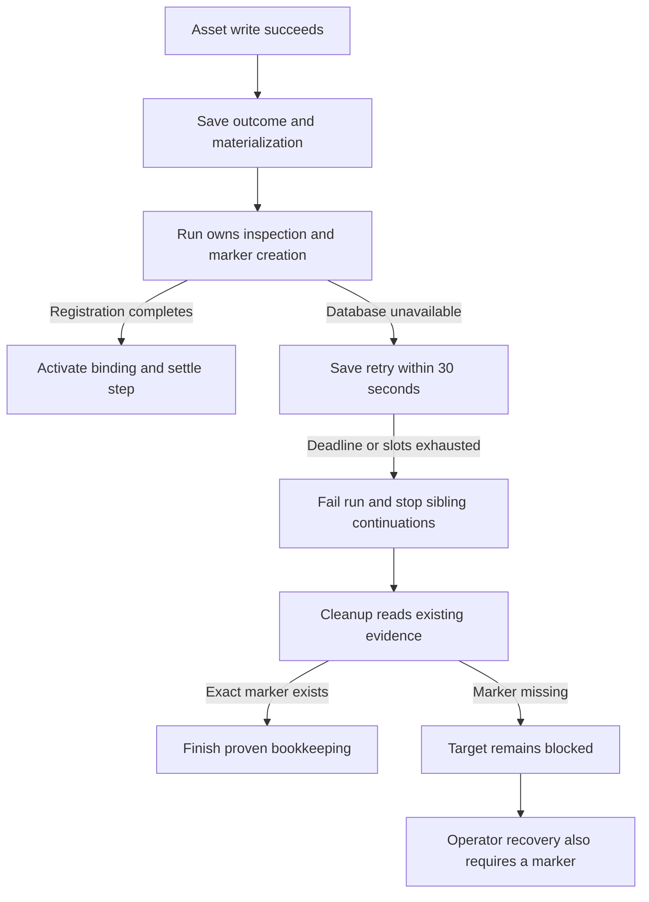
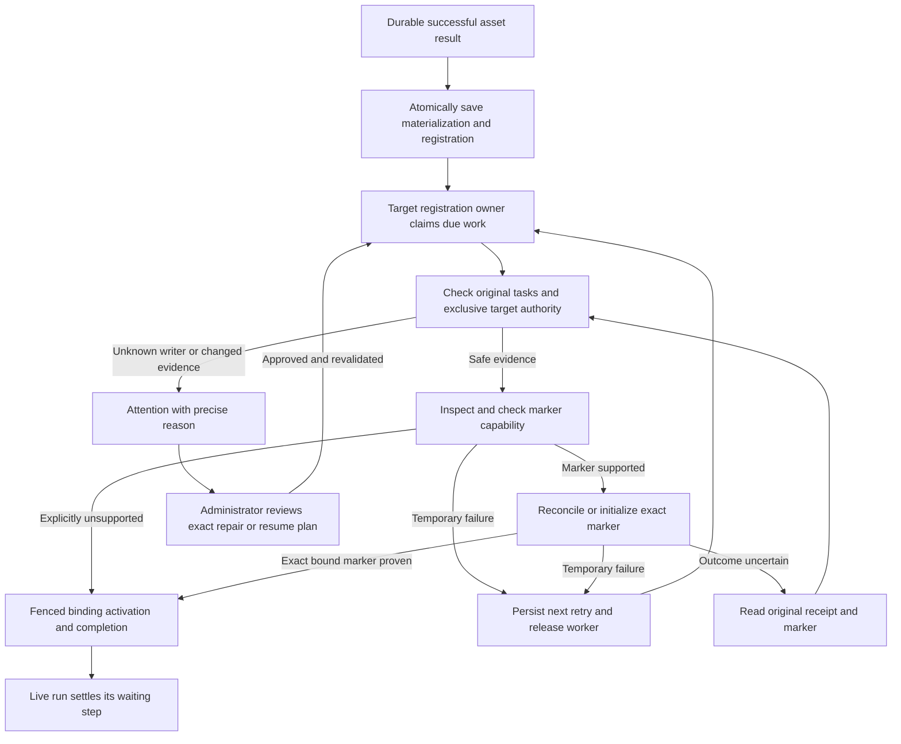
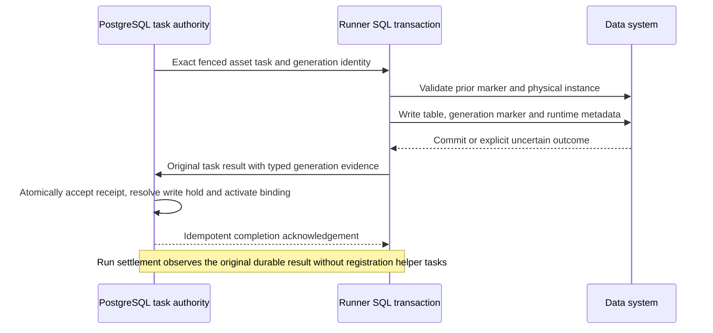

# Change Record: Recoverable initial registration under database pressure

| Field | Value |
| --- | --- |
| Status | Implementing |
| Type | Bug fix, lifecycle refactor, migration |
| Primary issue | [#763](https://github.com/eirhop/favn/issues/763) |
| Pull request | [#766](https://github.com/eirhop/favn/pull/766) |
| Related work | [#762](https://github.com/eirhop/favn/issues/762); the ownership and cleanup changes in PRs #754 and #760 |
| Affected areas | Orchestrator registration, runner-task observation, PostgreSQL persistence, Core task decoding, operator recovery and View diagnostics |
| Approved plan commit | [`f0b5ae52`](https://github.com/eirhop/favn/commit/f0b5ae52cb627972e7b4b30aa2db2710fa71b293) |
| Last updated | 2026-09-24 |

> **Current direction:** the user has explicitly removed historical repair and
> backward-compatibility requirements. The original approved baseline is retained
> below for review. The clean-break architecture in
> [the latest plan revision](#clean-break-plan-revision-atomic-generation-publication)
> supersedes the target-owned registration coordinator and repair-first order.
> That revision was independently approved on 2026-09-24; implementation follows it.

## One-minute summary

A successful asset write can become permanently unusable when the database is
temporarily unavailable during initial generation registration. The run owns
registration today; exhausting its short retry window fails the run, and failed-run
cleanup is deliberately forbidden from creating the missing marker. Make initial
registration a durable target-owned operation, atomically created with successful
materialization, so run failure cannot erase the remaining work. Automatic completion
and an audited operator repair use the same registration state machine. Address the
confirmed checkout crash and repeated task-reading costs alongside this change,
and require outage and constrained-CPU qualification before release.

This is a focused ownership change. It preserves PostgreSQL authority, the runner
queue, target locks, fencing, and explicit unknown outcomes.

## Impact

The incident reports 70 successful asset tasks, but only 9 of 35 generations became
active. Twenty-six remained blocked; 21 had no marker-initialization task, one had a
safe failure, and four had cancellation outcomes requiring reconciliation. Those
are different evidence classes and must not receive a blanket retry.

Increasing a timeout may reduce recurrence but leaves the same terminal dead end.
Operators need both prevention for new runs and a supported way to finish retained
successful materializations. Successful data writes must never be repeated merely
to repair their bookkeeping.

## Problem analysis

Investigation baseline: `origin/main` at `430a891d`, the rc19 release merge.
The [investigation scratchpad](../../report/2026-09-24-issue-763-scratchpad.md)
records the source sweep, local Tidewave experiments, rejected hypotheses, and
evidence limits. The running server also contained PR #765 backfill-command changes;
the audited recovery, storage and codec files match the baseline.

### Root cause

The missing contract is **durable ownership of the work remaining after an accepted
asset write**. Three lifecycles currently participate: run execution creates the
marker; failed-run cleanup may only inspect it; operator target recovery requires
it to exist. Once execution becomes terminal before marker creation, no lifecycle
can finish the operation. This preserves uncertain-write safety but sacrifices
recoverability.

Registration has eight scheduled retry slots and a 30-second absolute deadline.
Saving a retry intent consumes that same window, so one scheduled slot can exhaust
the budget without a second dispatch. A separate 30-second persistence-retry path
can also fail the run. Time spent obtaining authority, saving progress, waiting for
a runner, and observing an uncertain commit crosses several independent budgets.

### Evidence

| Evidence | What it proves | What it does not prove |
| --- | --- | --- |
| Issue #763 and current execution/cleanup/recovery sources | A successful write can reach an unrecoverable missing-marker state | Exact timing or CPU attribution in production |
| Tidewave retry-clock probe | One saved slot is exhausted at +31 seconds; a 120-second deadline is rejected by the version-1 event decoder | An end-to-end 120-second outage has been reproduced |
| Isolated one-connection pool probe, using the existing OrbStack PostgreSQL | Sequencer callback raises `DBConnection.ConnectionError`; Projector returns retryable `:unavailable` under the same condition | Every storage worker crashes on checkout failure |
| Source of `Operation.run/4` | It records telemetry and re-raises; wrapping Sequencer in it alone is insufficient | A broad catch-all is appropriate |
| Three failed task subscriptions through Tidewave | 111 full task-store reads in two seconds; subscription retries use 50 ms | Production had missing tasks or exactly this request rate |
| Valid synthetic manifest decode benchmark, 100 calls per size | A fixed 1,076-byte capability payload and even empty context decoding repeatedly traverse the manifest | This is the sole cause of the reported CPU saturation |
| Empty development database, ten-second telemetry sample | 318 query events, including transaction statements; idle discovery performs work | Production CPU percentage or capacity of a 0.5-vCPU deployment |
| Timeout-option probe | `timeout: 0` is rejected; `timeout_ms: 0` is ignored and reaches storage | Retry workers are unbounded; the outer timer still applies |

At 1, 35 and 350 manifest assets, empty-context decoding consumed approximately
11,811, 36,357 and 260,818 reductions per call. This is a structural cost that can
be removed without weakening validation. The task router polls full detail once
per second and performs separate checks for duplicate subscribers. These reads
also perform retention checks, retained-artifact access, hashing and decoding.

The sweep found further scale risks: synchronous workspace discovery, a global
projection cursor, and individual window upserts inside a projection batch. They
remain measured-profile follow-ups, not asserted causes of this incident.
The immutable run-plan reference, bounded manifest cache, isolated lease-renewal
pool, asynchronous maintenance worker and Projector error handling already exist;
the design retains these improvements.

### Assumptions

- The existing successful materialization and runner-task receipts are authoritative;
  their retained evidence is available for affected targets.
- A database outage does not authorize an expired owner to continue. A new owner
  must reconcile old task/write authority before admitting mutations.
- Existing marker and relation-instance checks remain mandatory when present.
- External administrators can change tables. Matching names and schemas cannot
  establish historical physical identity when no instance marker was ever stored.
- Three runners is not a workload specification. Qualification below declares task
  concurrency, manifest size, event rate and SQL latency explicitly.

## Current behavior

The block on new writes is correct. Removing it would risk repeating an already
successful non-idempotent materialization.

## Approved plan

The following baseline was accepted by independent review on 2026-09-24.

### One owner for registration

Introduce one compact registration record per workspace and initial generation,
owned by the orchestrator target-registration boundary. Keep its phase, revision,
owner/fence, exact evidence references, task identities, retry policy and next due
time in scalar/versioned storage. Use an indexed bounded due-work query; do not
scan run snapshots to find pending registrations.

Create this record in the same PostgreSQL transaction that records the successful
materialization. Replaying that settlement returns the same registration identity.
If the asset result is durable but materialization settlement has not completed,
existing fenced settlement/cleanup reconciles the original result and performs
this handoff; it never submits another asset write. This closes the gap before
registration exists as well as the gap after it exists.

Run execution retains a registration reference and waits for completion before
advancing dependent work or reporting successful completion. The run does not
schedule inspection or marker mutations itself. A run that fails for another
reason retains its original terminal history; target registration remains visible
and repairable independently.

Use typed phases: `inspect`, `capability`, `marker`, `activate`, `complete`;
scheduling disposition is `automatic` or `attention`. Preserve the current
marker-free capability branch: a valid capability response that does not support
initialization, or the explicit `unsupported_capability` result, permits activation
with verified physical inspection and `data_plane_marker: nil`. This is the
existing weaker capability contract, not proof of physical-instance continuity.
Malformed responses and failed capability reads must never select that branch.
Marker-capable adapters require the exact bound marker. Persist the capability
decision with its pinned manifest/runner contract and validate it at activation.

An uncertain marker has explicit evidence state, not a generic retry flag. A single bounded coordinator dispatches supervised work;
no per-target process is retained during backoff. Start with four active
registration operations per node, configurable 1–16, and bounded fair workspace
selection. There is no new broker or general-purpose workflow engine.

### Authority and side effects

- Reuse the existing target-operation lock and runner-task write barrier. Registration
  requires a current operation fence for enqueue, retry, marker start and binding
  activation. Its retention parent is the registration, while its source run is
  evidence provenance. Setting `run_id` to nil alone must never authorize work.
- For new registration-owned tasks, set both the durable retention parent and
  `TargetOperationLock.operation_id` to the registration ID, and set the task's
  `write_operation_id` to that same authority ID. Keep the payload's original
  `initialization_operation_id` and token as the separate immutable marker identity.
  Store and validate this mapping against the registration; neither a payload nor
  a nil run ID grants authority. Update the typed enqueue/bind/start validation
  together, preserving lock/task authority-ID equality. Update persisted-task
  hydration (`write_link_matches?/2`) as well: reads validate immutable retained
  parent/mutation linkage without demanding a live lease; mutations validate
  current authority. Update OperationRunnerTasks' contract and identity derivation
  for this typed branch. Remove the one-hour task-owned fallback for this branch;
  absence of the current registration lock is a fenced error. Legacy tasks retain
  their original IDs, validation branch and receipts.
- The claim owner is a fresh execution identity, distinct from registration and
  marker identity. Claim the registration and target lock transactionally, following
  the existing target-advisory/owner/task lock order. Save the current fence on the
  registration and task. Compare claim, fence, target and pinned mutation identity
  at admission, the external write barrier and activation. Restart never generates
  a different marker identity for the same registration.
- Preserve old run-owned task rows unchanged. The registration may reference their
  terminal receipts. If a safe replacement transport task is necessary after a
  terminal run, create it under current registration authority, retaining the
  original marker mutation identity and predecessor evidence. Never reparent or
  reset an old task to evade its fence.
- Claiming a registration does not itself authorize an external effect. Drain or
  reconcile previous exact-target work and unresolved holds first. Lease expiry,
  process death, a cancelled status, or a missing marker alone is insufficient.
- An already committed exact activation receipt may be observed after authority
  loss. A new mutation requires current authority and unchanged binding/evidence.
- Run cancellation stops new run work and parks unfinished automatic registration
  for explicit operator resume. Serialize its durable cancellation intent with
  handoff, admission and the write barrier using one documented lock order. If
  cancellation commits before the registration exists, the later handoff creates
  it in attention and cannot enqueue automatic work. If the write barrier wins,
  cancellation preserves and reconciles that effect; it cannot label it safely
  cancelled. Operator resume explicitly authorizes a new epoch without changing
  the run's cancelled history. Target-registration cancellation uses the same rules.
- Reads may be repeated with bounded backoff. Marker initialization may execute
  only when never-started/safe-failure evidence authorizes it, or after a separately
  resolved original uncertain write. An exact existing bound marker authorizes
  activation for marker-capable adapters; the explicit marker-free branch retains
  its existing inspection contract. Mismatch or missing required proof leads to
  attention.

Renew registration/target authority independently of the worker awaiting runner
admission, SQL or a receipt. Start with a 120-second lease renewed every ten seconds
through a bounded supervised renewal path, using the existing isolated lease-pool
pattern. Renewal must not queue behind task execution or large projection work;
sharing the run-renewal pool is allowed only with bounded query/lock times and
admission that preserves run-renewal headroom. Persist the exact owner/fence set,
use database expiry and conservative monotonic deadlines, and stop admitting work
when remaining authority cannot cover the bounded start request. Reuse the existing
run-renewal contract for checkout/response deadlines and late-reply rejection: a
renewal reply cannot revive a locally expired or replaced claim. Keep the number
of renewal connections bounded and expose missed-renewal/headroom metrics.

On a failed renewal, stop new admission immediately until the same live fence is
confirmed. Before the external barrier, revoke queued work transactionally so an
old task cannot start later. After the barrier, retain the unresolved hold and
reconcile the original effect; cancellation, expiry or process death cannot release
it. Once expired, a worker cannot renew or activate under that fence. A successor
may read retained receipts before acquiring new mutation authority. During backoff,
release the worker and lease only after queued work is fenced and no effect remains
unresolved; otherwise persist reconciliation work and retain the protective hold.
Lease liveness and effect resolution are separate facts.

### Retry policy and run integration

Persist a versioned policy with each registration. Proposed defaults are a
10-minute automatic window from its first classified transient failure, at most
32 failed-attempt retries, and 1/2/4/8/15/30-second backoff with bounded jitter.
Configuration permits 60–3,600 seconds, 1–128 retries and a 1–60-second backoff
ceiling. Validate the complete policy at boot and show it in diagnostics. A policy
change applies to new operations; restart cannot reset a saved deadline or count.

Count durable admitted attempts separately from failed storage attempts and actual
runner dispatches. Reconcile an uncertain saved command before advancing phase or
spending another attempt. Persist next due time once per failed attempt; do not
write a full run snapshot on each registration retry. Propagate one absolute
attempt deadline through helper admission, task waiting and SQL work, using the
correct timeout contract.

When the automatic window ends, park registration and its still-live run in
actionable attention. Do not convert a retryable registration/storage problem into
irreversible run failure. An authorized revision-checked resume starts a new
registration retry epoch after revalidating evidence. The generic persistence
retry path must preserve this handoff: an exhausted local wait for accepted-result
settlement or registration observation yields to fenced durable recovery rather
than invoking destructive failure semantics solely for storage unavailability.
Permanent asset failures and explicit cancellation retain their own outcomes.

Existing run-owner responsiveness and fencing limits remain in force. This is not
a promise that a starved owner can keep its lease; registration survives replacement
even if run recovery eventually reaches its independent attention/diagnostic limit.

### Repair the existing terminal targets

Extend the current administrator-only target recovery planning/start facade to
plan initial-registration completion. It hands approved work to the same
registration lifecycle. Existing recovery rows become immutable approval/audit
records referencing that single registration. They do not retain a second executor
or independently writable execution state machine. Atomically accept an unexpired
plan and advance the exact registration revision, saving the approval reference
and retry epoch. Derive execution status from the linked registration; persist an
approval's final result in the same transaction as the registration completion or
epoch outcome. Multiple plans may exist, but a stale revision cannot start or resume
work. Delete the current direct recovery activation/execution route.

Keep the reviewed target, registration/binding revision, original generation,
materialization, source/desired descriptors, runner release, relation, capability,
fresh fingerprint, predecessor task outcomes and proposed action in the plan hash.
Plans expire after 15 minutes and must be revalidated at start and before mutation.
The separate per-generation row is justified because current recovery identities
belong to individual immutable operator plans, potentially many for one generation;
automatic work must not rewrite that approval history.

| Existing evidence | Supported action |
| --- | --- |
| Exact bound marker exists | Reconcile and activate; no marker initialization |
| Capability explicitly lacks marker support | Preserve marker-free inspection and fenced activation; historical continuity still needs the attestation below when unproved |
| No marker; original initialization never started or has proven safe failure | Reviewed completion after exclusive authority and physical identity checks |
| Original mutation is cancelled/unknown or a write hold is unresolved | Resolve original effect first; no new initialization merely because the marker is absent |
| Foreign marker, conflicting physical identity, incompatible source contract, or missing successful materialization | Refuse completion with an actionable reason |

If a historical target has no bound physical instance identity, the machine cannot
prove it is still the table originally materialized. Offer a narrowly scoped
administrator attestation in the reviewed plan: the operator explicitly identifies
that exact retained target as unchanged since the successful write, supplies a
reason, and approves first marker creation. Record provenance as
`operator_attested`, not `verified`. This is a restricted adoption decision and
must be named honestly in the UI and audit trail. It cannot override a conflicting
identity, changed contract, active writer or unresolved effect.

This attestation requires an operational freeze on external writes and DDL for the
exact catalog/schema/relation from approval until the first-marker transaction is
known committed, or until a definitive no-effect result. Record the scope, actor,
reason, freeze start and approval expiry. Favn excludes its own competing writers;
the administrator is responsible for excluding out-of-band writers and DDL. Refuse
adoption when that freeze cannot be provided. Expired approval cannot admit a new
write; an already uncertain effect keeps the freeze requirement until resolved.
For a marker-free adapter, the freeze extends through binding activation instead.

Revalidate observations immediately before mutation and retain the transaction's
relation-instance conflict check. Detectable contract changes or foreign bound
identities reject the plan. An identical unbound table replacement can remain
indistinguishable: continuity in that case is trusted to the administrator, not
machine-verified. Do not claim the fingerprint or first-marker transaction proves
more than it does.

The original failed run stays failed. Repair records an independent completion and
unblocks future eligible work; it does not relabel old execution history.

### Reduce work around the lifecycle

1. Normalize expected checkout/connection/transaction failures at the sequencer
   transaction boundary, with bounded jittered backoff and safe error classes.
   Programmer defects still fail visibly. Place independent consumers beneath a
   sibling worker supervisor so one consumer failure cannot repeatedly restart
   healthy consumers; keep Repo/provider dependency ordering intact.
2. Add a bounded scalar task-state batch query, coalesce subscribers by exact task
   identity, and load validated payload/result details only for a terminal result
   or an explicit detail request. Keep notifications advisory and subscribe before
   checking durable state. Retain a bounded fallback sweep and missing-notification
   recovery. Replace the 50-ms all-error subscription retry with classified,
   jittered backoff and bounded admission; permanent missing/expired evidence is
   returned explicitly. Preserve started notifications, parent-death cleanup and
   fairness under load.
3. Build the fixed decoder atom inventory once. Reuse a bounded inventory derived
   only from a verified immutable manifest/content hash; owner-specific atoms and
   separately verified packages remain scoped inputs. Retain every size, type,
   hash, authorization and retained-artifact validation. Do not use an unbounded
   global atom/cache shortcut or accept persisted data as its own validation proof.

### Scope and non-goals

Include the registration handoff, historical repair, related sequencer failure,
task observation cost, decoder cost, diagnostics and qualification. Keep existing
run cleanup for draining assets, preserving outcomes and resolving write holds;
remove its duplicated responsibility for driving initial registration.

Do not rewrite RunManager, move durable state to runners, add Redis, redesign all
projection streams, or refactor files solely because they are long. Do not make
the fix depend on moving markers into materialization transactions. That is a
possible later simplification for qualified adapters; it does not repair rc19
targets and changes a wider runner/adapter protocol. Runtime-catalog publication
receipts are useful evidence but do not prove physical-instance continuity.

### Implementation slices and complexity budget

One implementation PR owns the end-to-end outcome. The slices are reviewable
commits, not independently releasable partial fixes. Supporting lines include
tests, fixtures, benchmark harness and canonical documentation; exclude this
record, generated files and formatting-only changes.

| Slice | Outcome / owner | Depends on | Production added | Production deleted | Supporting added | Supporting deleted |
| --- | --- | --- | ---: | ---: | ---: | ---: |
| 1 | Checkout containment and consumer isolation; PostgreSQL | None | 60–120 | 20–60 | 100–180 | 0–30 |
| 2 | Scalar task observation and paced subscriptions; persistence/orchestrator | None | 160–260 | 100–180 | 160–280 | 40–100 |
| 3 | Verified decoder inventory reuse; Core/storage | None | 80–140 | 40–90 | 100–180 | 10–40 |
| 4 | Registration record, atomic handoff, authority and retention migration; persistence/storage | None | 500–800 | 100–180 | 400–650 | 30–80 |
| 5 | Registration driver, run waiting and replacement of old retry/cleanup routes; orchestrator | 2, 4 | 300–500 | 350–650 | 400–700 | 100–250 |
| 6 | Historical repair planning, attestation and shared execution; operator boundary | 4, 5 | 300–500 | 100–180 | 300–500 | 40–120 |
| 7 | Configuration, diagnostics and recovery UI; facade/View/docs | 5, 6 | 100–180 | 40–80 | 100–180 | 50–100 |
| 8 | Outage, recovery and constrained-resource harness; owning test layers | All | 0 | 0 | 350–550 | 0–30 |

The larger storage slice includes migration/readiness/retention, idempotency,
atomic materialization handoff and authoritative mutation checks. These are required
by the ownership change, not a generic job framework. The deletion budget explicitly
removes run-local registration scheduling and duplicate repair execution. Explain
any category exceeding its upper estimate by more than 25% or 100 lines, whichever
is smaller, and any materially lower deletion count; obtain re-review for added scope.

### Implementation map

| Concept | Expected area | Responsibility |
| --- | --- | --- |
| Registration contract | `favn_orchestrator` target-generation persistence capability and a typed registration lifecycle | Phases, commands, ownership, result DTOs and retry policy |
| Durable handoff | PostgreSQL materialization settlement, target-generation store, schema/readiness and retention | Atomic successful evidence plus registration; indexed claim/replay |
| Target worker | Orchestrator registration coordinator and existing task queue/target locks | Bounded supervised dispatch and exact effect reconciliation |
| Run observer | RunServer Execution, StageResult, sequential settlement, PersistenceRetry and FailureCleanup | Wait on reference; preserve accepted work and cancellation; delete old driving paths |
| Operator repair | Existing TargetRecovery facade, commands and operation history | Plan/hash/approval/revalidation; delegate to the same worker |
| Lightweight observation | RunnerTaskResultRouter, runner-task persistence queries/store | Scalar batches and terminal hydration |
| Decode inventory | Core PersistenceData and verified storage manifest cache | Eliminate repeated graph traversal with unchanged validation |
| Diagnosis | Public orchestrator read models and thin View pages | Distinguish pending, stopped, unknown, drift and operator-attested completion |

## Operational design

### Failures and recovery

Retain registration intent, successful evidence and old task receipts across
process crashes and run terminality. A crash after a marker commit but before
acknowledgement causes receipt/marker reconciliation under fresh authority. A
crash after binding activation returns the same completion. A stopped old worker
cannot start or activate new work with an old fence. One blocked target must not
prevent unrelated registrations or cleanup from progressing.

Retention pins the registration's source run, materialization, task receipts,
manifests/packages and target evidence while automatic or in attention. Completed
operations follow documented bounded retention. History purge and operator repair
share the retention guard; repair cannot race evidence deletion.

### Logs and diagnostics

| Event/state | Surface | Safe fields | Frequency |
| --- | --- | --- | --- |
| Registration pending/retrying | Run and target pages; structured warning | Registration/target/run IDs, phase, failure class, elapsed/deadline, admitted attempts and actual dispatches | First failure, phase change, then at most once per minute |
| Registration needs attention | Target recovery action | Reason code, displayed revision, permitted next action, evidence class | On transition |
| Uncertain marker | Target page and audit | Original task/mutation IDs, fence and effect classification | On transition |
| Storage overload | Metrics and bounded warning | Pool checkout class, queue/query/decode durations, rejected reads, backoff | Aggregated; no per-poll warnings |
| Registration complete/repair approved | Durable audit and metrics | Actor/reason reference, plan hash/revision, evidence provenance and completion ID | Once per accepted command |

Do not log raw SQL, credentials, resolved inputs, full manifests, results, or
arbitrary exception terms. Keep safe error classification before redaction so
operators can distinguish connection unavailability, timeout, conflict and corrupt
evidence. Report the exact phase waiting on capacity versus PostgreSQL.

### Deployment, migration and compatibility

This is an in-place forward upgrade; resetting data is not an acceptable repair.
Stop the old orchestrator, preserve unresolved task/effect records and runner
evidence, apply the schema migration, and start one compatible new control plane.
Fence/drain old task assignments before admitting replacement mutation work.
Mixed ownership protocols are unsupported; readiness checks reject old binaries
against the new schema.

Use a bounded, restartable import to discover retained successful materializations
whose initial generation is still building. Create unique registration records
without changing materialization/run outcomes. Preserve rc19 marker IDs, retry
events, task identities and receipts. Terminal/cancelled historical runs start in
attention for reviewed repair; they never trigger surprise marker writes during
upgrade. Nonterminal handoffs reconcile their saved progress and old owners before
automatic continuation. The new lifecycle replaces old retry execution; compatibility
code reads old evidence only. Audit counts and reject ambiguous candidates.

Migrate existing recovery history without rewriting its immutable plan hashes or
actors. Preserve completed records and their receipts as history. Link legacy
planning/planned records to the unique registration, but require a fresh plan under
the new contract before acceptance. For applying/outcome-unknown records, reconcile
old authority and receipts before any new admission: a proven activation yields
the same completion, while unresolved effects keep the registration in attention.
Never reset them to planned or treat expiry as no-effect proof. Several plans for
one generation link to the same row; acceptance of one revision makes competing
plans stale. Import of both registrations and approval references is idempotent.

Rollback to rc19 is unsupported while new registrations or task parents exist.
Use a forward fix preserving evidence, or a separately planned coordinated restore.
Document exact schema/protocol gates and test upgrade against a retained rc19 fixture.

## Verification plan

| Acceptance criterion | Required evidence | Owning layer |
| --- | --- | --- |
| 60–120 seconds of database unavailability cannot strand accepted writes | Real PostgreSQL fault test after durable runner success, both before and after materialization handoff; after recovery all eligible generations activate and asset execution counts remain unchanged | Storage/orchestrator integration |
| Run replacement does not lose registration | Kill owner before/after each phase and receipt; saved policy/deadline/identity survives; delayed runner, renewal failure, expired lease, competing owner and late old worker cannot bypass the current claim/mutation mapping | Lifecycle plus PostgreSQL |
| Marker-free support is preserved | Supported and unsupported capabilities, explicit unsupported result, malformed response and transient read failure; only the valid unsupported branch activates without a marker | Orchestrator/adapter |
| Historical missing-marker repair works | rc19 cases: never dispatched, safe failure, exact existing marker, cancelled/unknown mutation; preserve old run status and exercise approval/provenance | Operator plus PostgreSQL/runner |
| Unknown writes stay protected | Lost marker reply, absent marker with live/unknown writer, wrong/bound replacement marker, observable contract drift, explicitly attested unbound case and freeze expiry; stale plan, changed deployment, duplicate command and cross-workspace request | Runner/adapter plus authority tests |
| Handoff is atomic and retained | Crash/rollback after every settlement boundary; exactly one registration; import restart, multiple legacy approval states and purge races preserve evidence; approval acceptance and registration advancement commit together | PostgreSQL |
| Cancellation is coherent | Cancel before handoff and during admission, backoff, marker execution and activation; transaction ordering decides whether the effect started, no queued work starts after revocation, uncertain result reconciles | Orchestrator/runner |
| Retry policy is explicit | Bounds, wall/monotonic deadline, persistence delay, configuration upgrade, expiry to attention and revision-checked resume | Pure policy and lifecycle |
| Sequencer survives expected pool failures | Exhausted pool, statement timeout, unavailable connection, no parent restart; expected error telemetry; genuine defects remain visible | PostgreSQL worker |
| Observation cost is bounded | Duplicate subscriptions, 3/12/32 active tasks, unavailable/overloaded/not-found reads, missed notifications, router restart and fairness; no nonterminal detail hydration | Router/storage |
| Codec remains strict | Same malformed-envelope, atom, package, hash, manifest and size rejection matrix; measured reductions independent of unrelated manifest assets on cached decode | Core/storage |
| Small deployment has demonstrated headroom | Release-mode harness under Linux cgroup 0.5 vCPU / 1 GiB, three runners, realistic DB latency and fixed workload described below | Slow/container qualification |

The capacity harness must report work, not only elapsed test time. Use a release
under Linux cgroup limits of 0.5 vCPU / 1 GiB, three runners, and manifest variants
of 35 and 350 assets. Compare baseline and candidate at the same offered load,
including a local database profile and a 10–30 ms round-trip profile. These are
proposed release targets, not capacity already demonstrated on the user's workload.

| Profile | Offered work and measurement | Proposed gate |
| --- | --- | --- |
| Sustained, one task slot per runner | Deterministic two-second asset tasks, one offered asset attempt per second for ten minutes after warm-up | Complete the offered rate without accumulating backlog; p95 registration latency at most ten seconds from durable asset success |
| Sustained, four slots per runner | Same task duration, four offered attempts per second for the full ten minutes | Same rate/latency gate; every run and registration reaches its expected outcome |
| Incident-shaped burst | Fixed 35-target / 70-successful-attempt fixture; clustered completions at both runner concurrency settings | All eligible registrations complete within 30 seconds after the last required asset receipt, with unchanged asset execution counts |
| Outage and restart | Interrupt PostgreSQL for two minutes during each sustained profile, retain the external offered schedule, then restore and restart the owner | Zero duplicate asset writes; all pre-recovery backlog drained within five minutes while the same live rate continues; zero unexplained building generations |

Keep sustained initial-registration work real: repeat independent fresh cohorts
using the same pinned manifest shape, with unique workspace/target identities and
the intended dependency graph. Do not benchmark only already-registered targets.
The driver records offered, admitted, completed and rejected work separately;
capacity throttling or delayed submission cannot silently reduce the denominator.
Measure normal latency outside the injected outage and recovery latency separately.

Record successful settlements per CPU-second, CPU seconds per asset, scheduler
delay/run queue, pool queue/query/decode time, queries and bytes per task,
registration latency, projection lag and lease headroom. For sustained profiles,
orchestrator CPU must average below 80% of its 0.5-vCPU quota for the loaded
ten-minute window, alongside the throughput/latency gates. No unexpected owner
revocation, checkout-drop cascade or growing backlog is acceptable. Report absolute
results and equal-load before/after comparisons; burst time followed by idle time
cannot count as headroom. If a gate fails, use the profile to remove the dominant
cost before calling the release qualified, or revise the supported workload with
independent review. Do not claim arbitrary three-runner workloads fit 0.5 vCPU.

Run the narrow owning-layer tests first, then the relevant formatting, compilation,
fast, acceptance, slow/container and test-tag checks from AGENTS.md. Use a separate
disposable test database in OrbStack for integration tests, never the normal
development workspace. Static source inspection, automated qualification and real
production observations remain separately labelled.

## Risks and open questions

| Risk | Impact | Decision/mitigation |
| --- | --- | --- |
| New owner duplicates rather than replaces old registration paths | More lifecycle complexity | Explicit deletion budget; one driver shared with repair; final review traces all callers |
| A missing marker is mistaken for a safe retry | Concurrent or misidentified mutation | Exact predecessor/effect checks; authority fencing; explicit provenance attestation where machine proof is unavailable |
| Application state migrates but evidence is purged | Repair becomes impossible | Retention references/guards and upgrade/purge fault tests |
| Recovery work monopolizes the small pool | Outage amplification continues | Bounded concurrency, paced scalar observation, jitter and measured CPU/queue gates |
| Retry policy collides with run recovery limits | Unexpected run failure despite pending work | Test both before/after handoff and run-owner replacement; durable registration survives either outcome |
| CPU incident has another dominant cause | Optimizations miss the true limit | No production attribution claimed; release workload profile is mandatory |
| Historical physical continuity cannot be proven | Automatic adoption could be wrong | Explicit narrow administrator attestation; fail closed on conflicting evidence; preserve audit provenance |

## Plan review

| Field | Result |
| --- | --- |
| Reviewer | Independent agent `review_763_plan` |
| Reviewed against | Issue #763/#762, baseline source, scratchpad experiments and this plan |
| Findings | First review requested changes: preserve marker-free adapters; specify lease renewal, identity mapping and cancellation ordering; constrain historical attestation; subordinate recovery approvals to one executor; give the performance gate a fixed offered rate and latency/drain bounds |
| Findings addressed and rechecked | All five corrected; reviewer rechecked both documents against primary source, including persisted-task hydration, late-reply rejection and the temporary-artifact correction |
| Verdict | Approved on 2026-09-24, with no remaining blocking findings. Approval covers the plan; implementation and production-capacity claims still require their stated evidence. |

## Implementation outcome

Implementation is in progress. The resident-pool normalization correction and
storage-consumer containment slice are implemented and independently reviewed.
The reviewed claim-reservation/empty-replay correction, including the shared
owner-validation refinement, is implemented and independently approved after
focused tests.
The durable registration handoff and repair lifecycle are not implemented yet.
This partial outcome does not close issue #763 or qualify the PR for release.
The approved baseline above remains unchanged.

## Verification evidence

The scratchpad records completed local investigation probes. They establish the
failure mechanisms and repeated work described above, not the proposed fix.

Documentation validation: relative links resolve, `git diff --check` passes, and
both Mermaid diagrams in the approved baseline rendered on GitHub without syntax
or layout corrections.

| Completed check | Evidence / limit |
| --- | --- |
| Resident normalization and production configuration | 26 focused tests passed; independent implementation review approved |
| Sequencer and notification recovery | 5 PostgreSQL tests passed: checkout backoff, statement timeout, unexpected invariant failure, sibling restart isolation, deferred subscription delivery after reconnect; independent implementation review approved |
| Claim facade and registry | 15 tests passed, including a real elastic RunnerAgent retaining its wait after transient failure |
| Durable runner task store | 91 passed, 2 excluded; empty-receipt reconciliation preserves the exact task, lease, fence, receipt and demand, and rejects incompatible/other-session adoption |
| Compiler / repository checks | Test-environment compilation with warnings as errors, test-tier guard and `git diff --check` passed |
| Manual unchanged-release outage | 90.005-second durable-receipt-triggered proxy outage reproduced the supervision cascade; 34 successful writes activated after explicit runner restart, one unknown effect stayed protected |

Raw logs and snapshots are retained locally under the ignored
`.favn/registration-stress/evidence/` directory. The image-level candidate replay
has not run yet, and the browser has not connected an authenticated runners page.

### Not verified

- The production incident has not been replayed against its real data or logs.
- The candidate image has not completed the same constrained-resource/outage cases.
- The observed baseline cascade is not a reproduction of a stranded proven write;
  the missing-marker production case still needs an end-to-end reproduction.
- The requested authenticated live runners page is pending local certificate and
  simulation-login approval; earlier measurements exclude that subscription load.
- The proposed migration, registration lifecycle and operator repair are not implemented.
- Broader projection and workspace-discovery risks have not been reproduced at scale.

## Approved-baseline deviations during implementation

### Manual local qualification instead of a CI simulation

At the user's request on 2026-09-24, the constrained-resource and fault simulation
runs locally on OrbStack. It does not add a CI job. Focused owning-layer regression
tests remain required. The local topology uses a 0.5-vCPU/1-GiB orchestrator and
five separately identified runners. The original four-slots-per-runner case is
invalid under the existing one-slot RunnerTask contract; replace it with actual
five-runner admitted concurrency and report offered and completed rates.

Independent reviewer `review_763_plan` approved this qualification adjustment,
subject to durable receipt-based fault triggers, measured CPU throttling and
proxy latency, equal before/after settings, data-plane checks for effect replay,
and retention of the failed baseline for forward upgrade/repair. Preserve all
other correctness and unknown-outcome gates from the approved baseline.

Use the tutorial with 35 independent SQL targets and shared DuckLake storage.
Proxy only the orchestrator's control-database traffic; evidence and data-plane
metadata bypass it. The host is ARM and supported release images are amd64; the
local Erlang `+JMsingle true` compatibility setting is required. These results can
establish failure/recovery behavior under a quota, not native production capacity.
Canonical image health checks remain enabled and must be included in resource
accounting. No global Docker cleanup or native PostgreSQL installation is used.

The baseline's resident-pool boot bug requires five fixed elastic runners with
one-hour idle grace and no autoscaler. Use the same pool policy for comparisons.
The scratchpad records the reproduced double-normalization failure; its focused
fix has passed 26 tests and independent implementation review. Comparisons still
retain the same elastic policy.

### Resident-pool normalization correction

Independent reviewer `review_763_plan` approved this narrow additional fix on
2026-09-24 after separately reproducing the actual production configuration path
through Tidewave. Make resident normalization accept its canonical atom
`:infinity` as well as omitted grace. Continue rejecting finite values, `nil`,
string `"infinity"`, and infinity for elastic mode. Verify mixed-pool idempotence
and production JSON validation followed by runtime normalization. This startup
bug is independent of registration recovery and does not justify a larger design.

### Reviewed qualification-driven correction: failed claim replay

The short-asset OrbStack case exposed a second lifecycle defect before fault
injection. A failed durable task claim is cached by `RunnerTasks`/`RunnerRegistry`
as successful `NoWork` with zero wait. Replaying the same claim command then
expires an elastic runner's idle grace and can shut it down immediately.
A side-effect-free Tidewave callback probe confirms that reply shape; container
logs show two such exits. The transient storage failure itself remains under
investigation.

Revised correction after independent review: keep store failure distinct from a
committed empty claim. Release only the matching process-local in-flight claim
reservation after a store failure, so a retry with the same command ID re-enters
the durable store. Do not fabricate empty work, create a fresh command ID, or cache
errors forever. Give every reservation a fresh local token, returned with the
claimed Session and required for both success completion and failure release.
Match that token, session generation, command ID and claiming status; a delayed
completion for the same command must not release its later reservation. Registry
loss during best-effort completion/release preserves the original durable result.

Reservation release alone is insufficient: logical claim X may commit empty X:0,
then assign a task at X:1 after a queue wake race. A retry starts again at X:0.
On replay of an empty durable receipt only, reconcile an existing compatible
active assignment for the exact runner/session under the existing claim lock,
owner and deployment checks. Never acquire queued work, renew a lease, change a
fence, rewrite the empty receipt, or alter a nonempty receipt's replay. An empty
receipt remains empty if only new queued work exists. Old-session work cannot be
adopted. This persistence replay refinement survives registry loss without a new
durable cursor or a process-local recovery assumption.

Focused tests cover earlier empty receipt then later committed assignment with
lost reply (including the final enrolled subattempt), same-ID replay and registry
loss, unchanged lease/fence/demand, queued-only empty replay, incompatible/other
session rejection, exact nonempty replay, same-ID stale completion, and transient
claim failure without elastic idle shutdown. Estimated production change: 40–100
added and 10–35 deleted lines; focused tests 150–260 added lines. Wire contracts,
serialized types and schema stay unchanged; the empty-receipt replay semantics are
explicitly refined. This supplements the preserved registration baseline.

The local qualification also now includes the production View with an authenticated
runners page held open, as requested by the user. Record connected-page evidence
and separate it from earlier measurements made without that page.

### Qualification finding within storage failure containment

The 90-second proxy outage reproduced the planned Sequencer checkout exception.
Its restart exposed a second concrete containment defect: NotificationListener
accepts only `{:ok, reference}` from Postgrex.Notifications.listen/2, although the
pinned dependency also returns `{:eventually, reference}` for a disconnected,
automatically reconnecting listener. Returning that tuple from GenServer.init/1
causes immediate restart failures; the backend then loses its restart budget and
the orchestrator's one-for-all tree loses runner presence and live owners.

Extend slice 1's existing transient-storage containment to accept both documented
subscription results, retain every reference and let Postgrex reconnect. Preserve
real initialization errors. Add focused evidence for startup while unavailable
and subscription delivery after connection recovery. The existing independent
consumer supervisor and Sequencer bounded retry remain necessary. This correction
is estimated at 5–15 production lines plus 40–90 focused test lines, within slice
1's production budget; additional test work will be reported against its budget.

Independent reviewer `review_763_plan` approved both the revised failed-claim
correction and the deferred notification subscription correction on 2026-09-24.
The reviewer required valid `{:stop, reason}` for real listener init failures and
retention of periodic reconciliation: subscriptions reconnect, but notifications
missed during the outage are not replayed. Existing outbox, projection and
admission pollers remain. This review supplements baseline `f0b5ae52`.

### Reviewed claim-owner contention refinement

Implementation review found that the existing fresh-claim helper also treats an
active rebuild-validation task as absent when its owner row is skipped by
`FOR UPDATE SKIP LOCKED`. Empty-receipt replay inherited that ambiguity. A fresh
claim can then fall through to queued work; replay can cache NoWork despite a
still-owned assignment. Independent reviewer `review_763_plan` approved a bounded
shared-helper correction on 2026-09-24: once an active exact-session candidate
exists, unconfirmed owner validation returns a retryable conflict. Only an absent
or concurrently released assignment returns nil. The error must not assert that
lock contention is the only cause; expired/invalid owner validation also fails.
Existing fenced recovery resolves the assignment. Do not release it, renew its
lease or alter its fence. A real owner-row-lock test must cover fresh and earlier
empty-receipt claims with another compatible queued task, then unlock and verify
that both recover the original assignment with unchanged durable state and demand.
This adds approximately 5 production and 50–80 supporting lines to the claim
correction, within its reviewed budget.

### Independent implementation review of completed slices

Reviewer `review_763_plan` approved resident normalization, the storage-consumer
containment slice, and the corrected claim slice. Claim review initially found
the skipped-owner-row ambiguity described above; re-review confirmed the shared
helper and real row-lock test resolve it, and approved the canonical docs.
The original registration-lifecycle and performance slices still require their
own implementation, verification and final baseline comparison.

### Manual qualification supporting-code budget

The local harness currently adds approximately 900 supporting lines, compared
with slice 8's original 350–550 estimate. It reuses the existing Compose TLS,
bootstrap, images, builder and secrets. The additional code supplies source-pinned
short-asset fixture staging, a candidate-only image build, durable receipt-based
fault triggers, bounded backlog submission with unknown-outcome preservation,
container/cgroup/registry evidence and physical-table checks. Those pieces were
not covered by the original in-test-fixture estimate, and the user's manual
OrbStack and live-View requirements replace the planned CI simulation. Raw logs,
generated images/contexts and credentials remain ignored. There is no application
production-code increase from this harness. The revised supporting budget is
750–950 added lines, zero deleted; independent variance/harness review is requested
before committing it. The original table remains the approved baseline.

### Manual harness review and candidate qualification (2026-09-24)

The independent reviewer approved the 750–950-line supporting-code variance and
re-reviewed corrections for exact Compose proxy ownership/network namespace,
restoration-independent watcher cleanup, archived runner source identity, and
current-assignment receipt joins. Python syntax and whitespace checks pass; the
live wrong-port guard rejected access before mutation. This approves the harness,
not completion of the registration architecture or production capacity.

Candidate d6777925 completed two no-fault 35-asset runs in 61.411 and 24.468 seconds.
A warm run with 10 ms ±3 ms latency per database direction completed successfully
in 456.294 seconds; after removing the delay, runs returned to 25.168 and 24.069
seconds without runner restarts. All five runners remained registered throughout
the latency case. This reproduces severe latency amplification, not stranded
initial registration. Images ran under amd64 emulation with no authenticated
browser connected; measurements are local comparisons only.

A subsequent 90-second warm-generation outage ended with 34 successful tasks and
one protected unknown outcome. Four runners remained registered; the runner with
the expired assignment stopped. No manual replacement was needed to reach the
terminal error. The former registry-wide crash cascade did not recur, but this
is not a successful missing-marker reproduction. The durable-registration and
performance implementation slices remain outstanding. See the scratchpad for
exact run IDs, timestamps, constraints and the user's manual-login fallback.

### Positive reproduction at 0.25 CPU (2026-09-24)

The 35-asset case now positively reproduces the missing-registration defect.
Candidate run `run_api_06349c257d264cbe32675d0a77756f27` ended after 106.770
seconds with `registration_retry_exhausted`. After post-terminal settlement,
all 35 asset tasks had exact successful receipts, successful/resolved claims,
and materializations, but only six generations were active and 29 remained
building. Marker tasks include both cancelled work and absent tasks for proven
materializations. All five runners remained registered/idle. All 35 physical
tables passed the row/distinct-ID/sum audit. No unknown write is being waived.

There was no injected outage or network delay. This case ran with 0.25 CPU,
unchanged runner fixtures, amd64 emulation and original image health probes;
View had no authenticated browser session. Activation itself failed at this
quota because retryable inspection storage errors became operator-decision
bindings. Activation alone was temporarily given 1 CPU, then the quota was
restored/verified before execution. This deliberate setup-only deviation lets
the runtime failure be evaluated separately; it is not an all-quarter-CPU
successful deployment claim. The execution sample consumed 96.0% of available
CPU and was throttled in 95.3% of periods.

The positive case supports the existing target-owned durable-registration plan:
run-scoped retry exhaustion can abandon registration after write success. Preserve
the case for forward-upgrade qualification and do not enlarge the workload to
100 assets before resolving this failure. Additional activation classification
and health-probe defects require follow-up, while native CPU attribution remains
outstanding. Full timestamped evidence and local filenames are in the scratchpad.

### Positive-reproduction plan review and repair-first order (2026-09-24)

Independent reviewer `review_763_plan` rechecked the retained quarter-CPU
reproduction against the implementation and approved the existing durable
registration design. One saved 30-second registration retry exhausted and the
run invoked failure cleanup; successful materialization settlement continued
after the run failed. The later settled snapshot contains 35 materializations
and 29 building generations. The earlier `quarter-stranded-proof.json` contains
34 materializations and 30 building generations; these are different observation
times, not contradictory simultaneous results. Import and repair must collect
current exact receipts and write holds again. Cancelled marker tasks are not
proof that no external effect occurred.

The user prioritizes a supported way out of the failed environment: the old
production repair failed too, leaving reset as the only operational escape.
Implement the registration storage/authority foundation first (slice 4), then
the shared driver and historical repair (slices 5/6), bringing forward the
necessary scalar observation work from slice 2 before enabling that driver.
Complete the remaining observation/decoding improvements and fresh-run
qualification afterward. This changes sequencing, not the approved ownership,
attestation, unknown-outcome or retention contracts. In particular, do not add
a temporary second repair executor.

The first live acceptance gate is an in-place upgrade and supported repair of
the retained failed case. Preserve its failed run history, successful asset
receipts and physical data. Prove exact eligible targets become active with no
additional asset executions. Targets with unresolved effects must remain
protected with a specific supported resolution path. After repair, demonstrate
that a new eligible run can start and finish; repair alone is not sufficient if
admission remains blocked. Then rerun an equivalent fresh initial workload at
0.25 CPU and exercise registration restart/timeout/recovery. A passing run does
not establish an absolute guarantee against all future failures.

Two adjacent findings stay explicit: activation currently converts some
pre-mutation transient inspection failures into durable operator decisions,
and the release-RPC health probe behaves poorly at the constrained quota.
Concrete phase-aware activation handling and any probe replacement require
reviewed additions before their implementation. Keep the original probe in the
primary comparison and report a changed-probe comparison separately.

## Clean-break plan revision: atomic generation publication

### Decision and scope

The user confirms there are no users to migrate and their deployment has already
been reset. They prefer a clean breaking change with as little lifecycle code
as possible. Historical target import, missing-marker attestation, forward
repair of rc19 volumes and compatibility executors are no longer requirements.
The repair-first order immediately above is superseded by this decision. Keep
the failed local reproduction as evidence, not as a migration acceptance target.
Do not reset or rewrite it during implementation.

The source offers a smaller solution than the original target-owned coordinator:
all managed persisted targets are SQL tables or incremental tables; views and
Elixir assets do not get target descriptors. Managed native writes already
commit runtime-catalog metadata inside their existing SQL transaction. Commit
generation identity and physical evidence in that transaction too. Accept that
evidence and activate the initial binding inside the existing PostgreSQL runner
completion transaction. There is then no separate initial-registration work to
be stranded by a run timeout.

This revision supersedes original slices 4–7. It does not implement a new
registration table, background dispatcher, registration lease or retry policy.
The completed consumer/claim fixes remain. Scalar observation and decoder
optimizations remain candidates, but are now measurement-driven: first measure
the removal of separate helper tasks before adding another performance refactor.
The manual harness remains the qualification method; rebuild/transaction outcome
reconciliation and general held-write protections remain supported.

### Write and completion contract

1. Require explicit adapter support for atomic generation publication before a
   persisted managed write starts. General transaction support is insufficient.
   DuckDB ADBC is the shipped generation adapter and must qualify real native
   transactions, including DuckLake. Unsupported adapters fail before mutation;
   there is no marker-free fallback or post-write helper path.
2. Add a bounded typed generation receipt to framework-owned runner evidence.
   Validate it against pinned target, generation, relation, manifest/release and
   the exact task result. Keep it out of user-controlled application metadata.
   Bump the runner task contract and reject mixed runner/orchestrator versions.
3. Prepare and publish on the same owner-exclusive connection and transaction
   used for table, incremental and group-replacement writes. No nested
   transaction and no independent marker retry. The runner carries the exact
   expected generation marker, physical fingerprint and derived instance identity
   from a bounded typed precondition captured in the existing exclusive task
   assignment transaction, after the nonblocking target reservation check.
   Persist it with the assignment generation and carry it separately from
   immutable enqueued work. Hydration, command-receipt replay and registry restart
   must reuse the saved precondition; only a new proven-safe assignment may repin.
   Initial mode requires both table and marker absent and uses deterministic
   identity tied to the generation. After its completion, the next queued window
   receives the exact active marker, fingerprint and derived instance identity.
   An existing unbound table is never automatically adopted. Recheck control-plane
   eligibility at Started and physical evidence before mutation. Read generation
   metadata through a small transaction-local helper; review metadata row-lock
   order against deployment/rebuild rather than nesting a public transaction.
4. Verify an existing marker and its physical-instance binding before any
   managed mutation. A controlled table replacement may rebind the replacement
   inside the same transaction, preserving the pinned generation marker identity.
   An absent, foreign or unbound prior marker for an active target fails closed.
   Rebuild candidates remain isolated and use the existing rebuild activation
   contract; ordinary writes after rebuild pin the resulting active marker.
   Ordinary writes that change the expected physical shape roll back and require
   rebuild; they cannot silently replace the authoritative fingerprint.
5. Inspect and construct bounded physical evidence before commit. If marker or
   evidence publication fails, the entire asset transaction rolls back. A failed
   commit acknowledgement remains unknown and cannot be retried as a safe
   failure. Existing qualified rejected-transaction replay may repeat the whole
   transaction only with proven no-effect rejection; it cannot retry a marker
   separately or interpret an absent marker as no effect.
6. A first-write check that skips materialization cannot report a successful
   generation or create a successful materialization fact for an absent table.
   Return a conclusive safe failure with check evidence. A no-op against an
   existing valid generation preserves its marker and existing binding.
7. Settle validated generation evidence in `RunnerTasks.Store.complete/1`,
   inside the same transaction as the exact terminal task receipt and write-hold
   resolution, before an ownership-only claim can be released. This common boundary covers both normal materialization claims
   and sequential ownership-only claims. Do not rely on the later run-owned
   `FinishMaterialization` call for binding activation. Later freshness and
   materialization-ledger settlement retain their existing durable run behavior.
8. Activation uses the accepted original write as authority; it neither renews
   execution authority nor executes SQL. Cancellation, run failure or a lost
   acknowledgement cannot erase a committed result. A retry of the same result
   observes the same receipt and binding without another asset execution.
   If desired deployment changed while the original write was running, retain
   the current desired descriptor and classify the accepted source generation
   conservatively; never overwrite new desired metadata or reject a valid
   committed write merely because its run has stopped.

This removes the reproduced registration failure class, not distributed-system
uncertainty. A runner can die after a data-system commit and before its result
is durable. Preserve the existing explicit unknown-write hold. Current asset
resolution supports verified no-effect, not successful reconciliation of a
committed-but-unreported asset attempt. A stable generation marker cannot prove
an individual attempt; exact runtime-publication reconciliation is outside this
revision. A missing acknowledgement is never proof that the asset may be blindly
rerun. General cancellation, run settlement and rebuild reconciliation remain.

### Deletions and rollout

Remove the run-owned initial reconciler, registration retry timers/events and
post-step continuations, standalone marker-initialization runner task, its
one-hour task-owned write-lock fallback, and initial-target repair planner/
executor/API/UI. Retain or rename the separate held-write resolution boundary
so removing `TargetRecovery` does not remove unknown-write protections. Remove
stale canonical docs and tests for the deleted public behavior; replace them
with the new transaction and completion contracts.

Use a fresh deployment with newly built orchestrator and runner images from
the same revision. Existing manifests/tasks using the old runner contract are
not supported. No automatic data migration, adoption or cleanup of old targets.
A small forward schema migration adds the bounded per-assignment precondition
column and may remove retired repair-only storage and constraints. It does not
promise in-place recovery of old execution history.
Review each retained table/field reference before deleting it.

### Revised implementation budget and acceptance

The original budget table remains unchanged as the historical approved baseline.
These estimates replace the unimplemented lifecycle/repair slices. Generated
files, formatter-only changes and this record are excluded.

| Slice | Production added | Production deleted | Supporting added | Supporting deleted |
| --- | ---: | ---: | ---: | ---: |
| Typed evidence and transactional runner/adapter publication | 250–450 | 150–300 | 300–550 | 100–250 |
| Atomic completion and deletion of run registration/repair routes | 150–300 | 1,500–2,800 | 300–550 | 500–1,000 |
| Contract/schema gate, canonical docs and operator cleanup | 60–120 | 150–300 | 100–200 | 100–250 |

Verify native first write, ordinary table replacement, incremental and group
replacement, empty bootstrap, initial check skip, existing-target no-op, foreign
marker, identical out-of-band replacement and unsupported adapters. Inject
marker/body failure and uncertain commit acknowledgement; prove rollback or
unknown without a duplicate asset write. At the persistence boundary test exact
receipt replay and registry restart preserving the exact assignment precondition,
two initially queued windows with external ALTER or identical replacement between
them, wrong generation/target/manifest/assignment, stale owner,
cancellation and run failure after commit, a changed desired deployment, and
sequential ownership-only completion. Force a PostgreSQL rollback after binding
mutation to prove receipt, binding and hold settlement are all-or-nothing. Qualify
atomic publication on native DuckDB and DuckLake. Restart during accepted-result delivery
and verify the existing settlement path does not dispatch another asset write.

Build both images and run the same fresh 35-asset, five-runner 0.25-CPU workload
with the original health probe. If activation still needs the baseline's temporary
1-CPU setup allowance, record it separately from runtime qualification. Require
all successful persisted targets active,
no registration helper tasks and no stranded successful receipt. Verify physical
rows and execution counts, repeat warm runs, then bounded database latency/outage
and restart cases. Report unknown-write cases separately from the eliminated
registration failure. Authenticate View and keep the runners page open when the
local TLS setup permits; do not claim browser load when it is absent.

### Independent review of the clean-break revision

Reviewer `review_763_plan` inspected the source and revised plan, required the
assignment-time precondition correction, then rechecked the written changes on
2026-09-24. Verdict: **approved**, with no blocking plan findings. This approves
implementation and deletion scope, not production readiness. Native DuckDB/
DuckLake qualification and the fresh workload comparison remain required.

The reviewed revision is commit `972c05b4012e670a35d4ab6534202e17cec509bd`.
GitHub treated the semicolon in the sequence note as a statement delimiter;
replace it with “without” as a syntax-only correction, retaining the same meaning.
