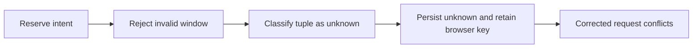
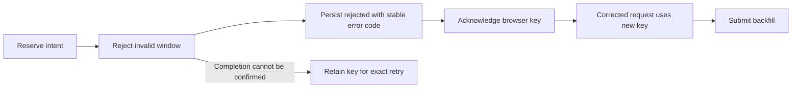

# Change Record: Reject invalid backfill windows without retaining command intent

| Field | Value |
| --- | --- |
| Status | Plan reviewed |
| Type | Bug fix |
| Primary issue | [#764](https://github.com/eirhop/favn/issues/764) |
| Pull request | Pending |
| Related work | None |
| Affected areas | Orchestrator command outcomes; PostgreSQL and View regression coverage |
| Approved plan commit | Pending independent review |
| Last updated | 2026-09-24 |

## One-minute summary

An invalid backfill month such as `2021-31` is recorded as an unknown command
outcome even though range validation rejects it before a run or backfill is
created. The browser retains its command key and a corrected request conflicts
with the unresolved reservation. Explicitly recognize this proven validation
failure as rejected and retain its stable diagnostic code. A change record is
required because the correction changes durable outcome and recovery semantics.

## Impact

A typo blocks later backfills for the same workspace, operation, and target.
The database unresolved-intent constraint can also block other operators. Plain
runs use a different operation and remain unaffected.

## Problem analysis

The public facade reserves intent before calling backfill submission. Range
validation returns `{:invalid_window_value, kind, value}`. The outcome and error
code classifiers recognize atoms and two-element tuples only, so this
three-element tuple falls through to `unknown` and `operator_command_failed`.
The normal finish path writes unknown immediately; expiry is not required.
The View uses the same outcome classification to retain the browser key.

### Assumptions and evidence

| Evidence | What it proves | What it does not prove |
| --- | --- | --- |
| `apps/favn_orchestrator/lib/favn_orchestrator.ex`, submission and finish helpers | Reservation precedes validation; tuple shape produces unknown | Live incident timing |
| `apps/favn_orchestrator/lib/favn_orchestrator/backfills.ex` | Range resolution precedes root-run and backfill persistence | Every unrelated error is safe to reject |
| `apps/favn_storage_postgres/lib/favn_storage_postgres/identity/store.ex` | Unknown can resolve to rejected; fresh keys cannot bypass unresolved slots | That arbitrary historic unknown rows had no effect |
| `apps/favn_view/lib/favn_view/command_attempt.ex` and `assets/js/app.js` | Rejected outcomes acknowledge keys; unknown outcomes retain them | A live browser reproduction |

Tidewave was unavailable at the documented local endpoint during investigation.
The initial evidence is source inspection and the issue report.

## Current behavior

## Approved plan

Add explicit clauses for `{:invalid_window_value, kind, value}` to the existing
outcome and diagnostic classifiers. Do not generalize arbitrary tuples into
terminal failures. Preserve the validation reason returned to callers. Keep the
existing durable completion and browser acknowledgement paths.

### Contracts and invariants

- Invalid window values are proven pre-mutation failures for pipeline and asset backfills.
- Their persisted diagnostic is `invalid_window_value`, without storing the input value.
- Failed audit completion, transport loss, timeouts, and unfamiliar error shapes remain unknown.
- A changed request cannot bypass an unresolved intent using a new key.
- Browser acknowledgement follows the existing durable completion contract.
- No changes to database constraints, retention, fingerprint checks, or public return shapes.

### Scope and non-goals

Include the specific validation classifier correction, focused regression tests,
and canonical operator guidance for prevention and existing affected intents.
Exclude general resolve/abandon UI, new recovery APIs, bulk repair, migrations,
retryability redesign, and changes to unrelated validation families.

### Implementation slices and complexity budget

| Slice | Outcome | Owner | Production added | Production deleted | Supporting added | Supporting deleted |
| --- | --- | --- | ---: | ---: | ---: | ---: |
| 1 | Classify invalid windows and prove rejection, correction, and safe retry | Orchestrator; PostgreSQL/View tests; operator guide | 5–20 | 0–5 | 140–300 | 0–10 |

Supporting lines include tests and canonical documentation. The change record,
generated files, and formatting-only changes are excluded. Explain overruns
above the upper estimate by more than 25 percent or 100 lines, whichever is
smaller, and materially fewer deletions, per [the process](../README.md).
Existing fixtures and test files should avoid new abstractions or dependencies.

## Operational design

After deployment, new invalid-window attempts finish rejected. For an existing
unknown intent caused by this exact bug, an exact replay by the original operator principal (a renewed session is allowed) with the original key,
manifest, and request can revalidate and resolve it through existing completion.
Prove this with an integration test before documenting it as supported recovery.
If the original request/key is unavailable or replay remains unknown, stop and
investigate; do not delete storage rows or clear browser storage as a recovery
procedure. Absence of a backfill alone is not sufficient general evidence of no
effect because other submission failures can leave a root run.

No automatic data rewrite or migration is planned. Deploy the orchestrator fix
before attempting recovery. Rollback reintroduces the typo-triggered wedge but
requires no data conversion. Existing unknown commands are not automatically
settled. The only diagnostic change is a bounded stable error code in the
existing audit result; no new logging of request contents is introduced.

## Verification plan

| Acceptance criterion | Planned evidence | Owning layer |
| --- | --- | --- |
| Recognized window errors are terminal; unfamiliar tuples and uncertain failures retain keys | Focused classifier tests | Orchestrator |
| Invalid pipeline and asset ranges persist rejected and create no root/backfill; corrected request succeeds with new key | Real PostgreSQL facade regression | Storage integration |
| Existing bug-shaped unknown intent resolves on exact invalid replay | Seed unknown via existing audit API; assert changed fingerprints and fresh keys remain unresolved; replay facade exactly and assert rejected | Storage integration |
| Rejection acknowledges browser key; uncertain failures do not | CommandAttempt/LiveView event tests | View |
| Same browser slot creates a new key after terminal acknowledgement | Browser registry test using existing JS with DOM/storage test harness if feasible | View/browser |
| Formatting, compilation, and relevant suites pass | Narrow tests first, warnings-as-errors, affected fast suites, tag guard, diff check | Static and automated |

Live production proof and broad deployment/security qualification are outside
this focused change. Record actual checks and any environment limitations.

## Risks and open questions

| Risk | Mitigation |
| --- | --- |
| Broad tuple handling could release truly unknown effects | Match only the proven invalid-window error family |
| Old unknown intent cannot be reconstructed | No blind abandonment; document recovery prerequisite and limits |
| Unit-only checks miss durable/browser interaction | Include real facade/storage tests and acknowledgement/registry coverage |

## Plan review

| Field | Result |
| --- | --- |
| Reviewer | Independent agent `review_764` |
| Reviewed against | GitHub issue, facade/classifiers, range validation, storage replay/completion, existing tests, View acknowledgement, and plan |
| Findings | Require original operator principal for recovery; explicitly test changed fingerprints and fresh keys remain blocked before exact recovery |
| Findings addressed and rechecked | Both clarifications added and independently rechecked on 2026-09-24 |
| Verdict | Approved; no remaining findings. Source review only; GitHub render and runtime verification follow. |

## Implementation outcome

Not implemented yet.

## Deviations from the approved plan

None recorded.

## Decision log

None recorded.

## Verification evidence

Source inspection only at planning time.

## Final review

Not started.
