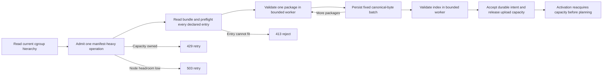
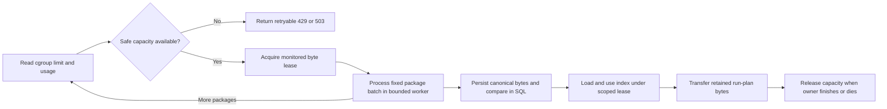

# Change Record: Manifest ingestion memory safety

| Field | Value |
| --- | --- |
| Status | Implemented |
| Type | Bug fix |
| Primary issue | Not filed. The repository owner authorized this implementation contract without an issue. |
| Pull request | [PR 683](https://github.com/eirhop/favn/pull/683) |
| Related work | [Issue 661 manifest deployment](issue-661-pr-662-manifest-deployment.md) |
| Affected areas | Manifest publication, index validation, activation, scoped manifest use, and decoded-cache removal in `favn_orchestrator`; execution-package persistence and manifest reads in `favn_storage_postgres`; runtime resource configuration and diagnostics |
| Approved plan commit | `5b636f08` |
| Last updated | 2026-08-28 |

Because no issue exists, the filename omits the `issue-<n>-` segment. After a
PR is created, rename it to `pr-<number>-manifest-ingestion-memory-safety.md`.

## One-minute summary

Manifest ingestion currently bounds archive bytes but can retain several
decoded and encoded copies of one package batch. Local measurement supports
memory amplification as the leading hypothesis; it does not prove that the
observed `SIGKILL` was OOM. Favn will use one fixed, conservative package batch,
bounded package and index workers, cgroup-aware admission, and scoped use leases.
A manifest may fail safely, but supported ingestion must not exhaust the
Orchestrator's container memory.

## Problem analysis

The current 100-package / 32 MiB batch is a JSON byte limit, not a live-memory
limit. One batch is decoded, verified, encoded, decoded for JSONB, inserted, and
then read back while the original records are retained. The 64 MiB manifest
index also has an unbounded decode/version/cache/activation path, and two
independent decoded-term caches can retain and copy large manifest representations.

### Assumptions

- Supported container runtimes expose a finite cgroup memory limit and current
  usage. The provider must handle cgroup v2 and the v1 fallback.
- The supported control-plane image is Linux-based; Windows containers are not
  part of this contract.
- Bare hosts may expose no safe process-specific ceiling; host RAM is not an
  allocation guarantee.
- Package-payload working memory must not grow with total package count.
  Bounded path/hash metadata and the manifest index still grow within explicit
  limits.
- One bundle, package, or index that cannot fit its safe worker budget is unsupported
  and must return a bounded error.

### Evidence

| Evidence | Proves | Does not prove |
| --- | --- | --- |
| Local representative archive measurement | Whole-batch copies can plausibly exhaust a small container, while 8-package / 4 MiB batching removed most measured amplification | The observed container kill was conclusively OOM, or production PostgreSQL/cgroup peak |
| Current package persistence source | Complete canonicalization, JSON decode, insert, and full-payload readback coexist | The exact allocator peak under a release |
| Current index/version/cache source | Package-only protection cannot establish whole-ingestion memory safety | A final safe index limit before constrained tests |

Implementation must add a generic synthetic fixture and committed executable
measurement before the constants are qualified for merge. Plan approval does
not treat the local consumer measurement as reproducible release proof.

## Current behavior

## Approved plan

### Contracts and invariants

- Favn reads a finite cgroup memory ceiling automatically. Container users do
  not configure their memory size twice.
- Detection depends only on Linux cgroup files. It has no cloud-provider,
  orchestrator, or container-runtime API dependency.
- The provider locates the process cgroup through `/proc/self/cgroup` and the
  mounted controllers instead of assuming one fixed cgroup filesystem path.
- The provider handles v2, v1, and hybrid layouts, `max`, v1 unlimited
  sentinels, and every visible ancestor. It uses the smallest current headroom
  imposed by the hierarchy.
- Optional `FAVN_ORCHESTRATOR_MEMORY_CEILING_BYTES` may lower the detected
  ceiling or provide one when no finite cgroup limit exists. It never raises a
  finite detected limit.
- With a finite cgroup, usage is the controlling cgroup's hierarchical usage.
  With only the configured ceiling, usage is Linux process RSS from an
  injectable provider.
- Cgroup limit and usage are reread for every admission and between batches;
  a detected live limit reduction can only reduce new capacity.
- Current headroom is the smallest ancestor `limit - usage`. A lower configured
  ceiling adds `ceiling - cgroup usage`, or `ceiling - process RSS` when no
  finite cgroup exists. For a new reservation, available bytes are
  `current headroom - max(128 MiB, 20% of the effective limit) - all active
  reservations`. The deliberate double accounting of resident reserved work
  favors safety over utilization.
- The shared byte coordinator accounts for scoped manifest/index use leases,
  transferred retained terms, and every `RunManager.PlanCapacity` reserve and
  resize. Existing run-plan limits remain additional per-kind ceilings, not
  separate memory.
- One owner token composes nested work instead of stacking reservations. It
  tracks `retained_bytes` and `working_bytes`; its total reservation is
  `retained_bytes + working_bytes`. Upload, activation, operation, and run-plan
  callers pass their token into scoped APIs, which atomically resize that token's
  working portion for the next stage. Transfer moves measured bytes from working
  to retained before the working portion is released.
- Every token is bound to one monitored owner. Owner death releases working and
  retained bytes idempotently. Handoff first installs the new owner monitor and
  atomically changes the ledger entry, then removes the old monitor; a crash on
  either side cannot leave an ownerless live reservation.
- The lease ledger survives a coordinator-process restart through an ETS heir.
  A replacement coordinator starts closed, takes back the ledger, re-monitors
  living owners, removes dead owners, and only then admits work. If the ledger
  cannot be reconstructed, admission remains closed with typed 503 until the
  lease-holding application boundary is restarted; it never assumes zero use.
- A run-plan producer acquires its new or enlarged byte lease before retaining
  the replacement term. When its exact retained size is only known after
  construction, construction occurs in a bounded worker under the conservative
  existing run-plan limits and the lease is resized downward before the term is
  transferred.
- Upload acquires a 256 MiB base reservation before reading the request body.
  It covers compressed/tar buffers, bounded `bundle.json` decode and retained
  declarations, one package worker, and the persistence batch. The reservation
  is transferred or resized between stages instead of being duplicated.
- Bundle validation runs in a monitored read-only worker. The existing 4 MiB
  bundle and package limits remain unchanged. Index validation requires
  `max(256 MiB, 128 MiB + 6 * declared index bytes)`, capped at 512 MiB and the
  existing 64 MiB raw-index limit. Admission fails before reading an entry when
  its reservation is unavailable.
- When Favn cannot obtain both a finite ceiling and current usage, it rejects
  manifest-heavy work with retryable `503 memory_capacity_unknown` before body
  read or internal allocation. It never guesses available memory.
- The hard batch limit is 8 packages and 4 MiB of canonical JSON. Raw and
  canonical package bytes are both limited to 4 MiB. Cgroup data may reduce or
  reject work; it does not increase these maxima. Upward adaptation requires
  separate measured evidence of a throughput need.
- The bundle, one package, and the final manifest index are decoded and verified in
  monitored read-only workers. `max_heap_size` includes shared binaries and is
  only a backstop; raw/canonical byte limits and node admission remain primary.
- `bundle.json` is first and declares package/index sizes. After reading it,
  Favn rejects an entry that cannot fit before reading package bodies.
- A verified-package envelope carries canonical JSON bytes plus bounded
  identity metadata. PostgreSQL casts the bytes to JSONB, inserts in the fixed
  batch, and compares stored JSONB plus all identity columns in SQL without
  returning full payloads. Conflicts are reconciled exactly.
- The low-level `/execution-packages`, `/execution-packages/missing`, and
  `/manifests` publication routes acquire admission before reading or decoding
  their bodies. The package route advertises and enforces 8 packages / 4 MiB per
  batch and uses the same verified envelope. The missing-hash route has a
  32 MiB operation reservation, at most 1,000 hashes, and 128 KiB compressed and
  decoded bodies. The manifest route reserves from its bounded decoded size;
  compressed or unknown-length input reserves from the maximum decoded size.
- At most one upload or activation memory-heavy phase runs per node. Upload
  admission occurs before the body. Activation releases a durable claim when
  capacity is unavailable and never waits while holding the claim.
- Package/index workers perform no writes. Once activation may have produced
  side effects, it is not killed for memory enforcement; its reservation and
  existing unknown-outcome reconciliation protect that boundary.
- `429 manifest_capacity_busy` means another manifest operation owns capacity.
  `503 manifest_capacity_unavailable` means current node headroom is
  temporarily insufficient. `503 memory_capacity_unknown` means limit or usage
  could not be measured. `413 manifest_memory_budget_exceeded` means one
  declared entry cannot fit the supported worker budget.
- Persisted content-addressed package batches remain idempotent. A lost database
  outcome is reconciled by read-only hash, identity, and JSONB equality before
  any write retry.
- The decoded `ManifestCache` and `ManifestIndexCache` are removed. A scoped
  `with_manifest` / `with_index` API obtains a temporary use lease before the
  SQL size query, payload load, decode, build, and caller-process copy. Its result
  cannot escape the callback unless ownership and retained bytes transfer
  atomically to the caller's run-plan or operation lease. The escaping public
  getter and every direct unscoped call site are removed in the same change.
- A caller without a token first acquires one 16 MiB scalar-query lease, reads
  only the bounded persisted byte size, and atomically upgrades that same token
  to the size-derived working budget before loading payload bytes. A caller with
  a token performs the query and working-budget resize within that ownership;
  neither path creates a second full reservation.
- Missing use capacity is a typed retryable error. HTTP maps it to 503;
  activation releases its durable claim; run submission, scheduler, backfill,
  rebuild, target-recovery, and deployment-planning workers defer without
  treating the manifest as invalid. Active run startup reuses transferred data
  or retries from its safe checkpoint without becoming terminal. Runner manifest
  delivery stays dispatchable and reports retryable unavailable. Asset-run,
  operator, catalogue, coverage, lineage, and other public-facade reads finish
  inside the scoped callback or map unavailable to 503.
- Failure leaves the previous deployment active. Unreferenced immutable package
  batches may remain and are eligible for existing cleanup; an unaccepted
  operation remains safely retryable.

### Scope

- Hierarchical cgroup v1/v2 limit/current-usage detection with an injectable
  test provider, configured-only RSS provider, and optional operator ceiling.
- Shared node-local byte coordination for run plans, upload, bundle/index
  validation, activation, and every scoped manifest/index use.
- Pre-body admission on all three publication routes, route-specific limits,
  bounded bundle/package/index workers, and canonical-byte package envelopes.
- Removal of decoded-term manifest/index caches and scoped replacement APIs.
- Fixed 8-package / 4 MiB PostgreSQL batches without full-payload readback.
- Stage logs, telemetry, API errors, generic fixtures, and constrained release
  tests with PostgreSQL.

### Non-goals

- Requiring operators to select package or batch sizes.
- Raising deployment memory as the fix.
- Increasing package batches on larger containers before a measured throughput
  need exists.
- Preserving decoded-term cache hit latency.
- Changing archive identity, ordering, authentication, upload leases,
  idempotency, or activation fencing.
- Guaranteeing survival from node eviction or another external platform
  `SIGKILL`.
- Guaranteeing survival when an operator lowers the cgroup limit below current
  usage before Favn reaches its next safe admission boundary.

### Implementation slices

| Slice | Outcome | Owner |
| --- | --- | --- |
| 1 | Add one byte coordinator for hierarchical cgroups, configured-only RSS, run-plan reserve/resize, and diagnostics | `favn_orchestrator` |
| 2 | Admit every publication before its body; validate bundle, packages, and index in bounded read-only workers | `favn_orchestrator`, `favn_core` contracts |
| 3 | Persist fixed canonical-byte batches with SQL-side exact conflict verification | `favn_storage_postgres`, both publication routes |
| 4 | Replace decoded caches/getters with scoped load/decode/build/use leases; transfer retained run-plan ownership and migrate every consumer to explicit retry/defer semantics | Orchestrator activation, active runs, runner delivery, storage reads, scheduler, deployment planning, backfill, rebuild, recovery, asset/operator queries, and public facade |
| 5 | Map bounded failures and add generic cgroup/PostgreSQL regression evidence and canonical docs | API, tests, production docs |

### Complexity budget

| Slice | Production added | Production deleted | Supporting added | Supporting deleted |
| --- | ---: | ---: | ---: | ---: |
| Shared memory capacity and run plans | 550-850 | 20-100 | 650-1,000 | 20-100 |
| Pre-body admission and bounded workers | 400-700 | 40-160 | 500-850 | 40-160 |
| Canonical-byte persistence | 280-480 | 80-200 | 320-560 | 80-200 |
| Scoped manifest/index use and cache removal | 550-950 | 180-420 | 700-1,200 | 180-420 |
| API, diagnostics, harness, and docs | 220-400 | 20-100 | 600-1,000 | 20-100 |

Explain any category exceeding its approved upper estimate by more than 25%
or 100 lines, whichever is smaller.

### Implementation map

| Concept | Expected area | Responsibility |
| --- | --- | --- |
| Memory capacity | `apps/favn_orchestrator/lib/favn_orchestrator/` | Cgroup/RSS providers, shared byte leases, run-plan integration, diagnostics |
| Publication workers | Orchestrator publication APIs and Core manifest contracts | Pre-body admission; bundle/package/index decode, verify, canonicalize |
| Verified package envelope | Orchestrator persistence command | Canonical bytes plus bounded identity metadata |
| PostgreSQL ingest | `apps/favn_storage_postgres/lib/favn_storage_postgres/registry/` | Parameterized JSONB insert, SQL-side equality, read-only reconciliation |
| Scoped manifest/index use | Every current `ManifestStore.get_manifest` / `ManifestIndexCache.fetch` consumer and the public facade | Size before load; lease through use; transfer retained terms; typed HTTP/retry/defer outcomes |

## Operational design

- A finite cgroup limit is automatic. An operator configures the optional
  ceiling only for a bare/unlimited host or to impose a lower policy limit.
- A bare/unlimited host without a configured ceiling, or without readable
  process RSS, cannot admit manifest-heavy work.
- Diagnostics expose limit source, limit bytes, current cgroup bytes, reserved
  or process-RSS bytes, manifest-use/run-plan reserved bytes, available bytes,
  batch count/bytes, and bounded failure class.
- Logs contain operation/workspace IDs and numeric measurements only; never
  manifest contents, package identities, SQL, or credentials.
- Rollback restores the prior code. No schema migration or archive compatibility
  window is required.

## Verification plan

| Acceptance criterion | Evidence |
| --- | --- |
| Capacity is calculated correctly | Unit tests cover v2, v1, hybrid mounts, ancestor limits, `max`, v1 unlimited sentinels, configured-only RSS, a ceiling below usage, and a live downward limit change; every incomplete ceiling/usage pair returns 503 before work |
| Package-payload working memory stays bounded | A committed generator compares 1-, 64-, and 1,024-package archives with the same maximum entry and asserts a fixed peak envelope; metadata/index growth is measured separately against their limits |
| A representative archive survives a small container | Repeated full release plus PostgreSQL upload, activation, replay, and readiness under a 1 GiB cgroup; `memory.events` `oom_kill` is unchanged |
| More RAM needs no Favn configuration | Repeat under larger and smaller finite cgroups; diagnostics use each detected limit while the fixed batch ceiling remains unchanged |
| Every publication route admits before allocation | Archive and all three low-level routes return 429/503 before body read; `/execution-packages/missing` covers plain, gzip, unknown-length, 1,000-hash, 128 KiB, and over-limit cases |
| Bundle and entry limits fail safely | Valid maximum-size/count bundle plus boundary and over-limit package/index fixtures; over-limit entries return 413 before decode and readiness/`oom_kill` remain unchanged |
| Concurrent allocations stay retryable | Upload/upload, upload/activation, and upload or activation versus run-plan reserve/resize tests account atomically, return 429/503 correctly, and release an activation claim |
| Nested work does not reserve twice | A constrained 1 GiB test proves activation and run-plan construction reuse/resize their owner token and complete without self-denial |
| Lease lifecycle cannot leak or forget capacity | Owner-crash, handoff-crash, coordinator-restart, reconstruction-failure, and idempotent-release tests prove capacity is preserved or admission remains closed |
| Interrupted writes remain exactly reconcilable | Force commit uncertainty and prove read-only identity plus JSONB comparison happens before any write retry and returns no full payload |
| Every manifest/index use is scoped | Constrained concurrent-use tests prove load/decode/build/copies hold leases; all old direct getters are absent; retained run-plan terms transfer ownership before release |
| Current consumers remain retryable | Focused tests cover active run startup, runner manifest delivery, target recovery, deployment planning, asset-run context, run submission, scheduler, backfill, rebuild, and HTTP/public-facade 503 mapping |
| Decoded cache copies are gone | Supervision, diagnostics, and call-site tests prove both decoded caches are removed and no direct unscoped manifest/index getter remains |

Broader qualification runs formatter, compile warnings, the owning app suites,
the fast umbrella suite, and the slow cgroup test. Live constrained-container
proof remains separate evidence.

## Risks and open questions

| Risk | Mitigation |
| --- | --- |
| Cgroup files are unavailable or malformed | Use configured ceiling plus process RSS, otherwise return typed 503 before work |
| Configured-only RSS is unavailable | Return typed 503 before work and report the source error |
| Worker heap limit misses off-heap data | Exact raw/canonical byte limits, total reservation, and cgroup headroom |
| Run plans or another process consume memory after admission | Shared run-plan accounting, absolute/proportional headroom, one heavy operation, and rereading usage between batches |
| A token owner or coordinator crashes | Monitored cleanup, atomic handoff, surviving ledger reconstruction, and fail-closed admission |
| The cgroup limit shrinks during work | Stop before the next read-only stage; do not kill a possibly completed database or activation side effect |
| Database outcome is unknown when a call exits | Read-only identity and JSONB reconciliation before any retry |
| Fixed constants are wrong for the release runtime | Generic constrained release proof is required; reopen plan review if a constant must cross the approved contract |

## Plan review

| Field | Result |
| --- | --- |
| Reviewer | Independent sub-agent Galileo (`manifest_memory_plan_review`), not the author |
| Reviewed against | Current RC13 code and lifecycle paths, issue 661, local measurement boundaries, Linux cgroup and OTP constraints, and this plan |
| Findings | Initial review required whole-path protection for index/cache/activation, hierarchical cgroups, explicit reservations, canonical persistence, retryable lifecycle, generic evidence, and honest complexity. Rechecks found omitted low-level routes, run-plan coordination, pre-load/caller-copy protection, unknown-capacity handling, consumer outcomes, nested leases, and crash cleanup. |
| Findings addressed and rechecked | All findings were incorporated. The final recheck confirmed the fixed batch, shared monitored byte ledger, all-route admission, bounded workers, SQL-side reconciliation, decoded-cache removal, scoped consumer APIs, retry/defer semantics, fail-closed unknown capacity, composed owner tokens, crash reconstruction, and expanded tests/budgets. |
| Verdict | Approve |

## Implementation outcome

Favn now admits manifest-heavy work against the memory limit and current usage
reported by the container's Linux cgroup hierarchy. The operator does not
configure the container size in Favn. An optional ceiling can lower that limit
or define one on an otherwise unlimited host, but cannot raise a detected
container limit.

Package persistence uses at most 8 packages and 4 MiB of canonical JSON per
batch. Package, index, and run-plan construction happen in bounded workers.
The decoded manifest caches were removed; callers instead hold a monitored byte
lease for the complete load, decode, use, and cross-process handoff. PostgreSQL
reconciles package conflicts in SQL without returning complete payloads.

If Favn cannot measure safe capacity, or a declared object cannot fit its safe
budget, it returns a typed retryable or size error before the large allocation.
Memory pressure defers activation and run recovery rather than making the
manifest or run terminal.

### Deviations and implementation decisions

| Approved plan | Implemented | Reason | Reviewer verdict |
| --- | --- | --- | --- |
| Malformed cgroup data could fall back to a configured ceiling plus process RSS | A visible but malformed or unreadable cgroup hierarchy fails closed with `memory_capacity_unknown`; process RSS is used only when there is no finite cgroup | Process RSS does not include other processes in the same cgroup and could overstate available capacity when cgroup accounting is broken | Justified; safer than the baseline |
| Bounded workers returned constructed terms directly | Workers serialize results, terminate, and only then does the lease owner decode the result; temporary handoff copies have explicit reservations | A direct message temporarily retains copies in both processes and made the worker heap limit insufficient for the complete handoff | Justified |
| Manifest scoping covered publication and index consumers | The same ledger also covers persisted run snapshot load/decode, `RunManager` handoff, recovery, and combined run-plus-version retention | Run startup and recovery otherwise reconstructed equally large terms outside the protected path | Required to satisfy the whole-path invariant |
| Existing full run paging remained available | Full decoded run paging was removed; compact summaries remain, and single-run recovery loads under an admitted size-derived budget | A page can contain several maximum-size plans and has no safe fixed memory bound | Justified breaking pre-v1 cleanup |
| The existing active-plan limit was the construction backstop | Persisted run decoding reserves at least 16 times encoded bytes and rejects work whose conservative budget exceeds the configured active-plan ceiling | Encoded JSON size is not retained BEAM-term size; the larger multiplier accounts for decode and handoff amplification | Justified conservative bound |
| The coordinator could rely on ordinary call completion | Long-lived handoffs transfer token ownership to the receiving process before the caller can time out | Releasing on caller timeout could make a still-running manager operation unaccounted | Required lifecycle correction |

### Complexity comparison

The final code diff contains **5,081 production additions and 2,213 production
deletions**, compared with approved aggregate upper estimates of 3,380 and 980.
Supporting code and documentation contain **1,308 additions and 220 deletions**,
within their aggregate upper estimates of 4,610 and 980.

These totals compare the implementation with approved plan commit `5b636f08`,
classify tests (including `config/test.exs`), guides, scripts, and canonical docs
as supporting work, and exclude this change record and the untracked local
`deps` symlink. Exact per-slice attribution is not reliable because shared
consumer modules implement admission, scoped use, retry handling, and run-plan
ownership together. The comparison therefore uses the approved aggregate
production and supporting ceilings; the material production overrun is
explained below rather than assigning overlapping lines to one slice.

The production overrun is material. Static review found that protection at the
upload boundary alone was insufficient: every manifest consumer, persisted run
decoder, cross-process handoff, recovery path, and retry/error boundary had to
join the same ownership contract. The deletions are primarily the two decoded
caches, unsafe full-run paging, and replaced consumer flows. This is required
whole-path protection rather than an increase in product scope.

### Verification evidence

| Evidence | Result | Boundary |
| --- | --- | --- |
| Final `git diff --check` | Pass | Static whitespace/conflict-marker check only |
| Independent final static review | Pass; no blocker or high-severity findings remain | The reviewer intentionally ran no formatter, compiler, tests, database, container, or measurement process |
| Focused capacity and run-plan tests | 19 passed | Earlier implementation checkpoint, before the final run-decode and provider corrections |
| Admission and runtime configuration tests | 25 passed | Earlier implementation checkpoint |
| Archive parser tests, including 1,001 packages | 12 passed | Earlier implementation checkpoint; the largest case used about 130 MiB during the test |
| PostgreSQL content-addressed registration test | 1 passed | Earlier implementation checkpoint |
| Synthetic 1/64/1,024-package measurement | About 90 MB peak RSS and 1,916 KiB growth in that run | Pre-final script and implementation; useful diagnosis, not final qualification |

The last attempted local combined verification is not evidence: its cgroup
fixture failed, the process grew to roughly 6.3 GiB, and WSL terminated. After
WSL restarted, no Mix, BEAM, Docker, PostgreSQL, or measurement process was
started for this work. Consequently the final source has **not** been compiled
or executed locally.

Still required before the draft PR is ready to merge:

- remote formatter, warnings-as-errors compile, owning-app tests, and umbrella
  test suites on the final commit;
- the committed measurement harness on the final release build;
- repeated upload, activation, replay, and readiness under a 1 GiB cgroup with
  PostgreSQL, proving `memory.events` `oom_kill` does not increase;
- the configured fault-injection case for an uncertain PostgreSQL commit;
- a larger-container run proving automatic adaptation without a Favn memory-size
  setting.

### Implementation review

| Field | Result |
| --- | --- |
| Reviewer | Independent sub-agent `manifest_memory_static_review` |
| Review configuration | User-requested GPT-5.6-Sol with xhigh reasoning; static-only after the WSL failure |
| Reviewed against | Approved plan commit `5b636f08`, final source diff, memory ownership and handoff lifecycle, cgroup parsing, persistence decoding, API errors, tests, and canonical documentation |
| Findings | The review initially rejected escaping scoped terms, encoded-size under-accounting, unsafe malformed-cgroup fallback, terminal memory retries, inconsistent HTTP errors, and a bounded-worker late-result race. Rechecks also found nested-token shrinkage, insufficient retained-term and handoff budgets, direct index bypasses, release races, unbounded run construction/recovery, full manifest loading during run decode, and combined run/version retention. |
| Findings addressed | All blocker and high-severity findings were corrected and rechecked in the final source. Medium follow-ups were to finalize this record, state the fail-closed cgroup deviation, preserve the corrected `Runs.get/2` typespec, and exclude the local `deps` symlink. |
| Final verdict | Static implementation approval. No blocker or high-severity issue remains. Merge qualification still requires the runtime and constrained-memory evidence listed above. |
