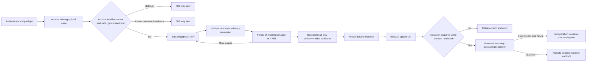

# Change Record: Focused manifest import memory guardrails

| Field | Value |
| --- | --- |
| Status | Plan reviewed |
| Type | Bug fix |
| Primary issue | Not filed. The repository owner explicitly authorized this focused replacement without an issue. |
| Pull request | [PR 684](https://github.com/eirhop/favn/pull/684) |
| Related work | [Issue 661 manifest deployment](issue-661-pr-662-manifest-deployment.md); draft PR 683 |
| Affected areas | First-party manifest archive upload, package batching, asynchronous manifest activation, container-memory diagnostics |
| Approved plan commit | `d483fe8c` |
| Last updated | 2026-08-31 |

## Summary

Manifest import must not consume enough memory to terminate the Orchestrator.
The fix will stay inside the first-party manifest deployment path: one import
phase at a time, smaller package batches, stage-specific memory checks, and
bounded read-only decoding. Insufficient memory returns a structured retryable
error or defers activation. It does not introduce general Orchestrator memory
accounting.

## Evidence and assumptions

- A representative archive is about 1 MiB compressed and 9 MiB expanded.
- Two production deployments ended with exit 137 during upload, but the
  platform did not identify the process as OOM-killed. Import memory
  amplification remains the leading hypothesis, not a proven root cause.
- Current ingestion streams gzip and TAR data, but retains up to 100 decoded
  packages or 32 MiB of package JSON before persistence.
- PostgreSQL verification reads complete stored package payloads back into the
  Orchestrator while the incoming batch remains live.
- Current PostgreSQL admission permits two uploads and the activation
  dispatcher permits four activations, so import phases can overlap.
- Supported production containers are Linux containers with a finite cgroup v2
  or v1 memory limit. No cloud-provider API is assumed. Bare or unlimited
  hosts fail closed for manifest import; this focused change adds no RSS or
  operator-configured fallback.

### Measurement gate

The reviewed plan is implemented in two gates. The first pushed draft contains
only the committed measurement harness and remote workflow. It measures current
`main` before any runtime guardrail is added. Ten representative imports and one
1,001-package import must complete under a 1 GiB cgroup. Fixed worker and result
bounds are selected conservatively from the existing 4 MiB package protocol
unit, not inferred from noisy per-stage RSS samples. End-to-end constrained
qualification then proves the bounds, reserve, and admission policy before an
independent re-review. Runtime implementation cannot begin before that second
approval.

## Contract

For supported manifest archives:

1. Favn resolves the process hierarchy through `/proc/self/cgroup` and the
   mounted controllers through `/proc/self/mountinfo`. For every finite ancestor,
   it reads that ancestor's limit and usage and uses the smallest
   `limit - usage`. Operators do not repeat the container memory size in Favn
   configuration.
2. A missing, unlimited, unreadable, or malformed hierarchy returns a typed
   capacity error before import. No host-RAM or process-RSS estimate is used.
3. Upload and activation share one non-blocking local manifest-import slot.
   The existing PostgreSQL upload lease remains the durable multi-request
   admission and is reduced to one global upload.
4. The importer checks safe headroom before reading the request body, before
   each declared archive entry, before package persistence, before manifest
   index decoding, and before activation.
5. Package batches contain at most 8 packages and 4 MiB of canonical input.
   Package payload working memory therefore does not grow with the total
   package count.
6. Package and index decoding/validation run in monitored read-only workers
   with stage-specific heap ceilings including shared binaries. Before sending
   a result, the worker measures its external size and rejects a result above
   the measured limit. The caller-stage budget covers the raw entry, worker
   heap, result message copy, retained batch/version, acceptance re-verification,
   JSON encoding/decoding, and cache handoff. A killed or timed-out worker
   becomes a structured import error; database writes never run inside those
   workers.
7. A capacity failure before upload returns HTTP 503 with `Retry-After`.
   Capacity loss during upload returns a structured retryable failure and does
   not accept or activate the manifest. Capacity loss before activation releases
   the durable claim so it can be retried later.
8. The previously active deployment is unchanged when import or activation is
   rejected for memory pressure.
9. The existing decoded manifest and compiled-index caches remain. Import
   activation is admitted with a measured cache-miss budget covering manifest
   load, index construction, the caller copy, and insertion into the existing
   64 MiB and 256 MiB cache ceilings. Existing cache residency is already part
   of cgroup usage. Normal cache consumers are not changed.
10. If the current 64 MiB manifest-index protocol limit cannot satisfy the
    measured 1 GiB envelope, the shared builder/receiver limit is lowered to the
    largest qualified value. Favn rejects larger indexes before decoding rather
    than attempting unsafe work.
11. Before acceptance, upload builds the same compiled activation index in a
    bounded read-only validation worker, measures it, and returns only a small
    size summary. A manifest that cannot fit the fixed activation envelope is
    rejected with 413 before durable acceptance. The side-effecting activation
    task is never heap-limited; it relies on measured admission because the
    manifest's deterministic size was already qualified during upload.
12. Before every activation, including an operation accepted by an older image,
    a bounded read-only preparation worker loads the immutable manifest, builds
    the compiled index, and returns only a size summary. It performs no write or
    activation side effect. A deterministic size failure marks that operation
    failed while leaving the previous deployment active; low current headroom
    or a preparation timeout releases the claim for retry. Only a successful
    preparation may enter the existing side-effecting activation path.

The guarantee is limited to allocations controlled by the manifest importer.
It cannot prevent node eviction, an external SIGKILL, or unrelated native
allocator failure. A hard operating-system boundary would require a separately
limited process and is not part of this fix.

## Proposed flow

## Scope boundaries

### Included

- First-party `PUT /api/orchestrator/v1/manifest-deployments/:operation_id`.
- The archive parser and its package persistence callback.
- Existing PostgreSQL upload admission and package conflict verification.
- The manifest deployment dispatcher only at its activation boundary.
- Generic Linux cgroup v2/v1 probing, safe stage budgets, diagnostics, and
  focused tests.
- A committed remote measurement/qualification path for 1 GiB and larger
  finite cgroups.

### Excluded

- Run plans, run snapshots, recovery, rebuilds, backfills, schedules, runners,
  operator reads, and normal manifest readers.
- A global byte ledger, retained-term accounting, token resize/transfer/handoff,
  ETS heirs, or coordinator reconstruction.
- Removing decoded caches, changing normal cache consumers, changing run
  paging, or redesigning public facades.
- A schema migration solely for memory accounting.
- Low-level package and manifest publication APIs unless a focused test proves
  they are used by the first-party archive route.
- Increasing Orchestrator memory as the permanent fix.

## Implementation slices and complexity budget

| Slice | Outcome | Production add/delete | Supporting add/delete |
| --- | --- | ---: | ---: |
| 0 | Current-main remote survival measurement and frozen constants | 0 / 0 | 350-450 / 0-40 |
| 1 | Pure cgroup probe, stage budgets, bounded worker, and one monitored slot | 350-550 / 0-50 | 350-500 / 0-50 |
| 2 | Upload integration and 8-package/4-MiB batching | 180-300 / 0-100 | 250-350 / 0-100 |
| 3 | Activation deferral, SQL-side package comparison, diagnostics, docs | 150-250 / 0-150 | 150-200 / 0-100 |
| **Total ceiling** | Stop and re-review if exceeded | **1,100 / 300** | **1,400 / 250** |

Production additions must not exceed 1,100 and total additions must not exceed
2,500 without owner approval and a new independent plan review. Any change
outside the included files or concepts must be recorded before editing.

## Simplicity checks

- Reuse the existing PostgreSQL upload lease rather than add distributed
  coordination.
- Keep the new guard state to one owner monitor and one opaque lease reference.
  It is a child of the existing root `:one_for_all` supervisor. If the guard
  dies, Bandit, active upload requests, and deployment tasks terminate before
  the guard reopens, so an old untracked owner cannot continue.
- Probe current cgroup state directly at each stage; do not estimate or track
  unrelated Orchestrator allocations.
- Bound both the worker heap and the returned term; count every known caller,
  acceptance, and cache copy in the stage budget.
- Derive fixed worker and result ceilings from the 4 MiB package unit with
  conservative whole-number multipliers. Use constrained measurement to verify
  the complete import stays healthy, not to claim exact attribution of shared
  BEAM or cache memory to individual stages. More container RAM permits
  admission but does not increase archive or batch limits.
- Keep memory-pressure errors local to manifest deployment.
- Prefer rejecting/deferring work over preserving throughput under low headroom.

## Verification

| Criterion | Required evidence |
| --- | --- |
| Generic automatic sizing | Pure tests for cgroup v2, v1, hybrid v1/v2 with the smaller finite ancestor headroom winning, ancestor limits, unlimited values, malformed data, and no finite limit |
| Bounded package work | Parser tests prove 8-package and 4-MiB boundaries across at least 1,001 packages |
| Bounded decode failure | Worker tests cover result-size rejection, success, heap termination including shared binaries, callback failure, timeout, caller handoff, activation-index validation, and cleanup |
| One manifest phase | Upload/upload, upload/activation, and activation/activation tests prove non-blocking admission, one owner, owner-death cleanup, and root-supervisor restart on guard death |
| Safe API behavior | Auth happens before admission; low headroom returns stable 503 and `Retry-After` before body read |
| Safe activation | Dispatcher concurrency is one; slot contention, low headroom, and preparation timeout release the claim for retry. A bounded read-only preparation covers old accepted operations; deterministic incompatibility fails the operation before activation and preserves the prior deployment. |
| Storage memory | Conflict verification does not load complete stored package payloads into the Orchestrator |
| 1 GiB production proof | Ten fresh release-container upload/accept/terminal-activation cycles, each with a new Orchestrator process, plus one idempotent replay and one 1,001-package PostgreSQL deployment within 15 minutes; the effective cgroup limit is recorded as 1 GiB, readiness stays healthy, the container never restarts, and `memory.events` `oom_kill` does not increase |
| Adaptive larger container | The same image detects a larger finite cgroup without a required Favn memory setting |
| Existing deployment safety | An injected capacity rejection leaves the prior active deployment unchanged |

Local WSL is not runtime evidence for this change. Formatter, compilation,
tests, PostgreSQL, Docker, and constrained-memory measurements run in remote CI
or an isolated remote environment.

## Rollout and rollback

- No database schema change is planned.
- Rollout uses the ordinary immutable control-plane image. Old accepted or
  expired-claim operations are compatible because every claimed operation runs
  bounded read-only activation preparation before side effects.
- Capacity diagnostics are checked before the first production import.
- Rollback is the previous image; durable upload and activation leases retain
  their existing compatibility.

## Risks

| Risk | Mitigation |
| --- | --- |
| Cgroup data is absent, unlimited, or malformed | Fail before body read with a typed 503; never infer safety from host RAM or process RSS |
| Stage multipliers underestimate BEAM terms | Use conservative multiples of the bounded 4 MiB protocol unit, enforce worker/result ceilings, and prove them under the committed constrained qualification |
| The local guard restarts during work | Its supervisor must restart the manifest import boundary together or fail closed; it must never reopen while an old owner can continue |
| PostgreSQL outcome is uncertain | Preserve existing durable operation idempotency and do not blindly retry writes |
| Activation is delayed by an upload | Release the claim and let the existing durable dispatcher retry later |
| An old accepted operation bypasses upload validation | Run the same bounded read-only activation preparation for every claimed operation before activation side effects |

## Stable pressure outcomes

| Condition | Upload outcome | Activation outcome |
| --- | --- | --- |
| Import slot already owned | HTTP 429 plus `Retry-After` before body read | Release durable claim and retry later |
| Cgroup headroom unknown or below frozen stage budget | HTTP 503 plus `Retry-After`; do not accept manifest | Release durable claim and retry later |
| Declared protocol size above a fixed archive limit | HTTP 413 before decode | Not applicable; the manifest was never accepted |
| Worker heap, returned-result, or activation-index envelope limit reached | HTTP 413; do not accept manifest | Read-only preparation fails an old incompatible operation without changing the prior deployment; new uploads were already rejected |
| Worker timeout | HTTP 503; do not accept manifest | Release durable claim and retry preparation later; side-effecting activation is not heap-limited |
| Structurally invalid archive or decoded contract | Existing HTTP 422 behavior | Existing terminal invalid-manifest behavior |

Package payload memory is independent of total package count after batching.
Bundle paths, hashes, and inventory metadata still grow up to the existing,
explicit 10,000-package protocol limit; this change does not raise that limit.

## Plan review

| Field | Result |
| --- | --- |
| Reviewer | Independent sub-agent `manifest_import_plan_review` |
| Review configuration | GPT-5.6-Sol with xhigh reasoning; static only |
| Reviewed against | `origin/main` at `852fc1be`, issue 661, draft PR 683 lessons, current upload/activation/cache/storage source, original production evidence, and the explicit complexity ceiling |
| Initial findings | Worker-return and acceptance copies were not bounded; activation caches were omitted; hierarchical cgroup math and guard restart behavior were underspecified; the complexity budget conflicted; deterministic and transient errors were conflated; legacy accepted operations could bypass validation. |
| Corrections | Added the measurement gate, end-to-end copy budgets, bounded returned results, upload and activation-index prevalidation, bounded read-only preparation for every activation including legacy rows, finite hierarchical cgroups, root `:one_for_all` failure semantics, exact pressure outcomes, cold-cache qualification, hybrid cgroup coverage, and consistent add/delete ceilings. |
| Plan verdict | Approve Slice 0 measurement work. Runtime guardrail implementation remains blocked until measurements freeze constants and the reviewer approves the updated plan. |
| Initial Slice 0 review | Rejected the first coarse harness because it did not await terminal activation, prove the effective limit, exercise replay, or provide defensible stage attribution. |
| Slice 0 correction | Await terminal activation, validate and record the effective cgroup limit, exercise replay, and record restart/OOM evidence. Fixed bounds now come from conservative multiples of the existing 4 MiB protocol unit; cgroup RSS is end-to-end proof rather than false per-stage attribution. |
| Slice 0 evidence correction | Preserve logs, restart/OOM state, and a summary even when activation polling fails; bound every HTTP call; record and enforce the 15-minute deployment bound; normalize failure evidence as valid JSON; removed the stale near-limit-evidence claim. |
| Slice 0 verdict | Approved for remote measurement with no remaining findings. Runtime guardrails remain blocked until the evidence is recorded and constants are frozen. |
