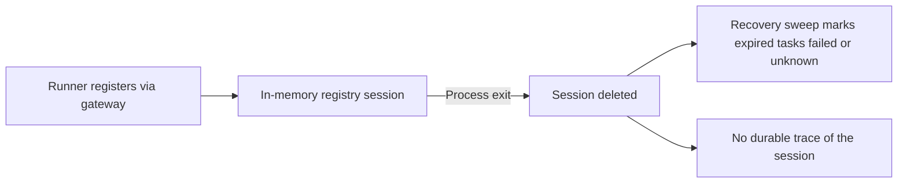
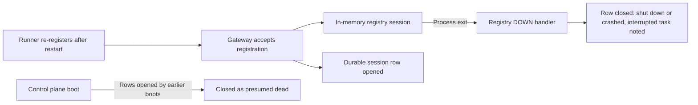

# Change Record: Runners page: durable runner sessions and runner-focused diagnostics

| Field | Value |
| --- | --- |
| Status | Implementing |
| Type | Feature |
| Primary issue | None (authorized by repository owner; change record only) |
| Pull request | [#687](https://github.com/eirhop/favn/pull/687) |
| Related work | None |
| Affected areas | `favn_storage_postgres` (new table, migration), `favn_orchestrator` (registry lifecycle, persistence contracts, read model, facade), `favn_view` (runners page, run-detail link copy, design-system examples), operator documentation |
| Approved plan commit | 37f7e03b |
| Last updated | 2026-09-01 |

## One-minute summary

The `/runners` operator page cannot answer the questions an operator actually
brings to it: when did a runner start, how long was it up, what did it do, and
how did it end. The control plane keeps runner presence only in memory, so a
disconnected runner leaves no durable trace, and the page compensates by
showing workspace task failures with no time bound — a failure from weeks ago
is still presented as "recent". This change adds a durable, bounded runner
session history (opened when a registration is accepted, closed on disconnect
with a reason), reworks the page around runner health (capacity per
pool/release, live runners, session history with date and status filters,
busy/idle totals), and removes the run-outcome framing that belongs to the
runs pages. It is substantial because it adds persistent data, changes runner
lifecycle observation, and redefines operator-visible diagnostics.

## Impact

Operators diagnosing a stuck pipeline today open `/runners` and see "No
runners connected" plus a wall of task cards, one of which may be a
twelve-day-old failure labeled recent. They cannot tell whether a runner
crashed, is crash-looping at startup, or was never started. After this change
the page answers: "2 tasks queued 41 minutes, no compatible runner", "this
runner crashed Aug 20 after 3 minutes while running a map task — here are the
task's error and logs", "this pool had 3 sessions die within 8 minutes before
claiming work". Workspace run and asset outcomes stay on the runs pages.

## Problem analysis

User need: the runners page must be a runner-health surface. The operator
needs to know when each runner woke up, how long it was awake, what it did
while awake, and when and why it stopped — plus whether queued work has a
compatible runner at all.

Current limitations:

1. Runner presence is process-local (`RunnerRegistry` is a GenServer holding
   monitored sessions in memory). A disconnect deletes the session; nothing
   durable records that the runner ever existed, so post-hoc questions are
   unanswerable.
2. The overview read model pages workspace task failures with a status filter
   but no time bound, so the newest 20 failed/unknown tasks are shown as
   "recent failures" indefinitely.
3. The page's information design centers on tasks and runs (which the runs
   pages own), not runners. Durable capacity demand projections
   (`runner_capacity_demands`: queued count, active count, oldest queued age
   per pool/release) exist but are not exposed to the page.
4. Task busy time cannot be derived precisely: durable tasks record
   `enqueued_at`, `assignment_expires_at`, and `terminal_at`, but no stable
   assignment timestamp (`assignment_expires_at` moves with lease renewal,
   and assignment fields are cleared when an expired task is requeued).

### Assumptions

- All production registrations flow through the runner gateway worker, which
  performs resume verification and then calls the registry's verified
  registration; the registry's unverified `register/2` is test-only. The
  gateway worker is therefore the single production entry point where a
  session open can be written off the registry's critical path.
- The registry holds the session (including its status) at the moment its
  DOWN handler runs, and the registry enforces at most one live session per
  runner instance id. The DOWN handler is therefore the single point where a
  close can be classified from status-at-exit plus the exit reason.
- Runner sessions are platform-global (like `runner_capacity_demands`), not
  workspace-scoped. The operator page already lists platform-global live
  runners after operator reauthorization; this change extends that same
  audience to durable session history (see the authorization decision under
  the approved plan).
- Session history is diagnostics, not control-plane authority: losing a
  session write must never block registration, claiming, recovery, or
  shutdown.
- The existing 3-second poll refresh remains acceptable for this page.

### Evidence

| Evidence | What it proves | What it does not prove |
| --- | --- | --- |
| `apps/favn_orchestrator/lib/favn_orchestrator/runner_registry.ex` (`handle_info {:DOWN, ...}`) | Disconnects are observed at one choke point that still holds the session (and its status) before deleting it; the exit reason is available for classification | — |
| `apps/favn_orchestrator/lib/favn_orchestrator/runner_task_recovery.ex` (`handle_info {:runner_down, ...}`) | Task recovery ignores the runner-down payload and only schedules its global lease sweep; it is not a per-runner action point | — |
| `apps/favn_orchestrator/lib/favn_orchestrator/runner_gateway.ex` (register → verify → `register_verified`) | Every production registration passes through the gateway worker with resume verification | — |
| `apps/favn_orchestrator/lib/favn_orchestrator/runner_overview.ex` | Failure listing uses `PageWorkspaceRunnerTasks` with `statuses: [:failed, :unknown]` and no time bound; a live runner's active task id is already hidden when it belongs to another workspace | — |
| `apps/favn_storage_postgres/lib/favn_storage_postgres/schemas/runner_tasks.ex` | Durable per-task logs (`runner_task_log_batches`) and capacity demand projections exist; tasks carry `assigned_runner_instance_id` and `assigned_runner_session_generation`; no runner session table or `assigned_at` exists | — |
| `apps/favn_storage_postgres/lib/favn_storage_postgres/runner_tasks/store.ex` (requeue path) | Requeue clears assignment fields; only the last assignment survives on the task row | — |
| `apps/favn_view/lib/favn_view/components/run_detail_page/submission.ex` and `docs/operators/runs-and-schedules.md` | The run-detail failure panel links to `/runners` as its diagnostics escape hatch, and the operator guide canonically documents the current failure panel | — |
| Operator screenshot (2026-09-01) | An Aug 20 unknown-outcome task renders under "Recent failures" on Sep 1 | — |

## Current behavior

A runner registers through the gateway worker (resume-verified) into the
in-memory registry and is monitored. On process exit the registry deletes the
session and notifies task recovery, which only reschedules its global
lease-expiry sweep. No durable record of the runner's existence remains. The
page shows live sessions from memory plus two task listings from PostgreSQL
with no time bound.

The page consequences: live presence disappears with the process, and the
"Recent failures" panel renders the newest 20 failed or unknown workspace
tasks regardless of age, so a weeks-old failure is presented as recent.

## Approved plan

Open a durable session row when the gateway accepts a registration; close it
in the registry's DOWN path with a reason classified from the session's
status at exit and the exit reason; repair rows orphaned by a control-plane
restart at boot. Rebuild the page around four runner-health sections. All
reads stay bounded.

### Session identity and lifecycle

- One durable row per **registry session** — each accepted registration opens
  a new row with a generated row id. The row records the runner instance id,
  the runner's boot id, the registry session generation, the accepting
  control-plane boot id, pool, release id, BEAM node, protocol version,
  lifecycle mode, and `registered_at`.
- Close fields: `ended_at`, `end_reason`, `busy_at_exit`, and the interrupted
  task id when the session ended while busy.
- End reasons:
  - **shut down** — the monitored process exited with a normal or shutdown
    reason;
  - **crashed** — any other exit reason;
  - **presumed dead** — the row was opened by an earlier control-plane boot
    and was still open when the current boot reconciled; the true end time is
    unknown and the row is closed at reconciliation time.
  `busy_at_exit` is recorded independently of the reason, so a clean exit
  that interrupted a task renders as "shut down — 1 task interrupted, outcome
  unknown" rather than being forced into "crashed". This covers the common
  benign path where a runner drains locally and exits normally while the
  registry still shows it busy.
- Boot reconciliation closes only rows whose control-plane boot id differs
  from the current boot, so it can never race a registration accepted by the
  current boot. A runner that survived the restart re-registers through
  resume verification and gets a **new** row; the read model merges
  consecutive rows that share the same runner instance and runner boot id
  into one displayed session, so the operator still sees one "woke up …
  ended" story per runner process.
- A disconnect and reconnect within one control-plane boot likewise produces
  a closed row and a new open row — including a verified resume that
  preserves the session generation, so the generation cannot serve as an
  idempotency key. Instead the **gateway mints the row id at acceptance and
  the row id is the idempotency token**: a retried open reuses the same row
  id and cannot double-open, while each newly accepted registration mints a
  new id. The open write also opportunistically closes any prior open row
  for the same instance id (as presumed dead, since its true end was not
  observed), which repairs a lost close write immediately instead of waiting
  for the next control-plane boot.

### Task attribution and `assigned_at`

- A new nullable `assigned_at` timestamp on durable tasks is **set on each
  assignment and cleared on requeue**, exactly like the other assignment
  fields — the task row always describes its latest assignment only.
- Session task summaries and busy-time totals attribute a terminal task to a
  session by joining the task's assigned runner instance id and session
  generation to the session row, clamped to the session's interval. Because
  the task row keeps only its final assignment, work performed under an
  earlier expired assignment is **not counted**; the busy/idle stat labels
  state that totals cover completed final assignments within the window.
  This is an accepted approximation for a diagnostics stat, not an
  accounting contract.

### Page sections

1. **Stat header** — two labeled clusters so runner counts and task counts
   cannot be confused: "Runners" (connected, busy) and "Workspace tasks"
   (queued, running, failed in window, longest wait). A one-line warning
   banner appears when tasks are queued and no compatible runner is
   connected.
2. **Capacity by pool and release** — one row per demand partition from the
   existing durable projection: queued, active, connected runners, oldest
   wait; warning tone when demand exists with zero compatible runners.
3. **Connected runners** — compact rows from the live registry (status,
   instance id, pool/release, registered age) with details collapsed.
4. **Runner sessions** — durable history, newest first, with combined
   filters: date window (today, 7 days, 30 days, all) and status (all,
   connected, shut down, crashed, presumed dead, struggling to start). Each
   session shows
   woke-at, awake duration, end reason, and an attributed task summary
   (succeeded, failed, interrupted counts). Expanding a session lists its
   attributed failed and interrupted tasks with error detail and links to
   the durable task logs, **restricted to tasks in the operator's
   workspace**; tasks from other workspaces appear in counts only, following
   the existing precedent that hides another workspace's active task id.
   Consecutive short sessions of the same pool/release that ended without
   claiming work collapse into one derived "struggling to start" group row.
   The section header shows window totals: busy time and idle time (in-window
   awake time minus busy time).

The current "Recent failures" and "Recent runner activity" panels are
removed. Failed tasks whose runner did not crash remain reachable through
their session's expander (the ADBC-driver class of failure shows up as a
session with a high failed count), and run and asset outcomes stay on the
runs pages. The run-detail failure panel's "View runner diagnostics" link
stays valid and its copy is updated, and the operator guide section that
documents the failure panel is rewritten for the new sections.

### Authorization decision

Operator reauthorization yields a workspace-scoped context; capacity demand
and session reads are platform-global, so the read model mints a platform
context after operator reauthorization succeeds, following the existing
precedent of the capacity reconciler and task recovery. This deliberately
gives any workspace's authorized operator platform-global visibility of
runner presence, capacity, and session metadata — consistent with the page's
existing platform-global live runner listing. Task-level detail (ids, errors,
logs) stays workspace-scoped as described above.

### Filters, timezone, and refresh

- Date windows are computed server-side in the workspace default timezone
  using the existing view time helpers ("today" starts at the workspace's
  beginning of day).
- Filter selections live in LiveView assigns and are reapplied on every
  reload, so the 3-second poll and persistence-published refreshes preserve
  the operator's filter state.

### Contracts and invariants

- Session persistence is observability. A failed session write logs a
  warning and never blocks or retries registration, claiming, recovery, or
  shutdown. Open writes are idempotent as described above; close and
  reconcile writes are idempotent by row id and **close-only-if-still-open**:
  when the DOWN-path close and the gateway's opportunistic repair race for
  the same row, whichever lands first wins and the other no-ops, so a
  presumed-dead repair can never overwrite an accurately classified close.
- Every session row eventually closes: normal close on disconnect, or boot
  reconciliation closing rows from earlier control-plane boots as presumed
  dead. Unknown outcomes stay explicit — a presumed-dead close never
  fabricates a shut-down or crashed reason, and an interrupted task is
  reported as outcome unknown, never as failed.
- At most one open session row exists per runner instance id, except in the
  window after a lost close write and before the runner's next registration
  or the next control-plane boot; both repair it (the open write closes any
  prior open row for the instance as presumed dead, and boot reconciliation
  closes rows from earlier boots).
- Reads are bounded: session pages have a limit and date filter pushed into
  SQL; header stats and busy/idle totals are single aggregate queries over
  the filter window; retention keeps the table bounded — closed sessions
  older than 90 days are pruned opportunistically at session open, at most
  once per control-plane boot per day via a cheap watermark check.
- The view keeps using the public orchestrator facade only.
- `assigned_at` always describes the task's latest assignment: set on claim,
  cleared on requeue.

### Scope

- New `favn_control.runner_sessions` table, migration, required-tables and
  schema-fingerprint updates, and store operations in `favn_storage_postgres`,
  plus the `assigned_at` column behavior on `runner_tasks`. Runtime-role
  privileges are covered by the existing default grants; no privilege change
  is needed.
- New persistence commands/queries/results contracts in `favn_orchestrator`;
  session open in the gateway worker, close in the registry DOWN path
  (written off the critical path), and boot reconciliation at orchestrator
  startup.
- A runner-sessions read model replacing the failure/activity listing in
  `RunnerOverview`; capacity demand exposure; facade functions for the page.
- Full rework of `FavnView.Components.RunnersPage` and `RunnersLive`
  (filters as LiveView events, new sections, stats), updated run-detail
  link copy, and updated design-system example fixtures and examples for the
  new sections.
- Canonical documentation: `docs/FEATURES.md` status and the `/runners`
  section of `docs/operators/runs-and-schedules.md`.

### Non-goals

- No runner log streaming or log UI beyond linking to existing durable task
  logs.
- No dashboarding/analytics beyond the two window totals (busy, idle);
  utilization charts and trends are future work.
- No changes to scheduling, claiming, recovery semantics, or capacity
  accounting.
- No orchestrator-initiated drain lifecycle (the registry drain marker has
  no production caller today and this change does not add one).
- No workspace-scoped filtering of sessions (runners are platform-global).
- No changes to run and asset outcome surfaces beyond the run-detail link
  copy.

### Implementation slices

| Slice | Outcome | Owner or area | Depends on |
| --- | --- | --- | --- |
| 1 | `runner_sessions` table, migration, required-tables/fingerprint updates, store operations (open, close, reconcile-boot, page with filters, window aggregates, prune) and `assigned_at` set-on-claim/clear-on-requeue, with storage tests | `favn_storage_postgres` | None |
| 2 | Persistence contracts, lifecycle writes (gateway open, registry DOWN close, boot reconciliation), sessions read model with merge and struggling-to-start derivation, capacity exposure, platform-context bridge, facade functions, orchestrator tests | `favn_orchestrator` | 1 |
| 3 | Runners page rework: stat header, capacity table, live runner rows, filterable session history with totals; LiveView filter events preserving state across refresh; run-detail link copy; design-system fixtures and examples; view tests | `favn_view` | 2 |
| 4 | Canonical docs updated: `docs/FEATURES.md`, `docs/operators/runs-and-schedules.md` | `docs` | 3 |

### Complexity budget

Estimates exclude this record, generated files, and formatter-only changes.

| Slice | Production added | Production deleted | Supporting added | Supporting deleted | Main reason for the size |
| --- | ---: | ---: | ---: | ---: | --- |
| 1 | 220–350 | 0–30 | 220–380 | 0–30 | New table, six store operations, migration, fingerprint updates, and assignment-field behavior with focused tests |
| 2 | 250–400 | 80–160 | 250–400 | 60–150 | Three lifecycle write points, read-model replacement, context bridge, and facade additions |
| 3 | 350–550 | 200–300 | 350–550 | 150–300 | Four page sections with filters and stats replacing the current page, plus design-system fixtures and examples |
| 4 | 0 | 0 | 40–100 | 20–60 | Rewriting the operator-guide section and feature status |

The size is driven by the number of lifecycle write points and page sections;
each is individually small and none introduces new abstractions.

### Implementation map

| Concept | Expected code area | Responsibility |
| --- | --- | --- |
| Durable session rows | `apps/favn_storage_postgres/lib/favn_storage_postgres/runner_sessions/` and `schemas/` | Table, migration, bounded reads, aggregates, pruning |
| Assignment timestamp | `apps/favn_storage_postgres/lib/favn_storage_postgres/runner_tasks/store.ex` | `assigned_at` set on claim, cleared on requeue |
| Session open | `apps/favn_orchestrator/lib/favn_orchestrator/runner_gateway.ex` | Idempotent open after the registry accepts, off the registry critical path |
| Session close | `apps/favn_orchestrator/lib/favn_orchestrator/runner_registry.ex` DOWN path | Classify from status-at-exit and exit reason; write via a spawned task |
| Boot reconciliation | Orchestrator application startup | Close rows from earlier control-plane boots as presumed dead |
| Persistence contracts | `apps/favn_orchestrator/lib/favn_orchestrator/persistence/` | Commands, queries, results for sessions and window aggregates |
| Read model | `apps/favn_orchestrator/lib/favn_orchestrator/runner_overview.ex` (reworked) | Sessions page, filters, totals, capacity, merge, struggling-to-start derivation, workspace-scoped task detail |
| Facade | `apps/favn_orchestrator/lib/favn_orchestrator.ex` | Operator-scoped functions the view calls |
| Page | `apps/favn_view/lib/favn_view/components/runners_page.ex`, `runners_live.ex`, `run_detail_page/submission.ex`, `dev/design_system/examples/` | Sections, filters, rendering, link copy, examples |

## Operational design

### Failures and recovery

- Session write failures (open, close, reconcile, prune) log a warning with
  the runner instance id and operation kind, and continue; registration,
  claiming, recovery, and shutdown are never blocked. A missed open produces
  no session row (the runner still works); a missed close is repaired as
  presumed dead at the next control-plane boot.
- Boot reconciliation runs once during orchestrator startup, closing open
  rows from earlier control-plane boots as presumed dead with the boot
  timestamp. It is idempotent, safe to re-run, and cannot touch rows opened
  by the current boot.
- Classification: normal or shutdown exit reasons close as shut down; any
  other reason closes as crashed; `busy_at_exit` and the interrupted task id
  are recorded independently so a clean-but-busy exit reports the interrupted
  task with outcome unknown.

### Logs and diagnostics

| Event or state | Level or surface | Safe fields | Rate limit |
| --- | --- | --- | --- |
| Session write failed | Warning log | runner instance id, operation kind, bounded error class | Per occurrence (lifecycle events are inherently rare) |
| Boot reconciliation closed rows | Info log | count of rows closed | Once per boot |
| Page overview load failed | Existing error log in `RunnersLive` | reason via `inspect` (unchanged) | Per poll |

### Deployment, migration, and compatibility

- One additive migration: new `runner_sessions` table and a nullable
  `assigned_at` column on `runner_tasks`. No backfill: sessions begin at
  deploy; tasks that predate the column have `assigned_at` null and are
  excluded from busy-time totals (pre-deploy sessions do not exist anyway).
- Rollback: dropping the code is safe; the table and column are unused by
  older code. Favn is pre-v1, so no deprecation path is required.
- No operator action needed beyond running migrations as usual.

## Verification plan

| Acceptance criterion | Planned evidence | Owning layer |
| --- | --- | --- |
| An accepted registration opens exactly one row; a retried open with the same row id does not duplicate; a same-boot reconnect resume opens a new row and closes the orphaned prior row | Storage + orchestrator tests | `favn_storage_postgres`, `favn_orchestrator` |
| Abnormal exit while busy closes as crashed with the interrupted task recorded | Orchestrator test through the registry DOWN path | `favn_orchestrator` |
| Normal exit while idle closes as shut down; normal exit while busy closes as shut down with `busy_at_exit` and the interrupted task | Orchestrator tests | `favn_orchestrator` |
| Rows from an earlier control-plane boot close as presumed dead; rows opened by the current boot are untouched; a post-restart resume opens a new row and the read model merges the displayed session | Orchestrator boot reconciliation and read-model tests | `favn_orchestrator` |
| Session write failure does not block registration or the DOWN path | Orchestrator test with failing store stub | `favn_orchestrator` |
| `assigned_at` is set on claim and cleared on requeue | Storage tests | `favn_storage_postgres` |
| Date and status filters produce bounded SQL reads with correct windows | Storage query tests | `favn_storage_postgres` |
| Busy/idle totals cover final assignments clamped to the window; null `assigned_at` tasks excluded | Storage aggregate tests | `favn_storage_postgres` |
| Struggling-to-start grouping collapses short no-task sessions | Read-model unit test | `favn_orchestrator` |
| Cross-workspace task detail is hidden in session expanders while counts remain | Read-model and view tests | `favn_orchestrator`, `favn_view` |
| Page renders all four sections, filter events preserve state across poll refresh, warning banner appears when demand exists with zero runners | LiveView and component tests | `favn_view` |
| The run-detail diagnostics link still points at `/runners` with updated copy | Component test update | `favn_view` |
| Suite passes | `mix format`, `mix compile --warnings-as-errors`, app-scoped fast suites per AGENTS.md | Umbrella |

Static inspection and focused automated tests cover all criteria; CI
qualification covers the umbrella; live proof is a manual pass on the dev
stack (`mix favn.dev`) with a runner started, killed, and restarted, plus a
control-plane restart while a runner stays alive.

## Risks and open questions

| Risk or question | Impact | Mitigation or decision needed |
| --- | --- | --- |
| Rows are per registry session, so one runner process can span several rows across control-plane restarts | Durations could read fragmented | The read model merges consecutive rows sharing the runner instance and boot id into one displayed session |
| Busy-time totals miss work done under expired earlier assignments and clamp at window edges | Stat under-counts in churny periods | Stated approximation; the label says totals cover completed final assignments within the window |
| Struggling-to-start heuristics (session < 60 s, zero tasks, ≥ 3 within 15 min) may misfire | Noise or missed loops | Thresholds as module constants with unit tests; tune later with real data |
| Platform-global session visibility for any workspace's authorized operator | Broader visibility than workspace scoping elsewhere | Deliberate decision recorded above; task-level detail stays workspace-scoped |
| Writing the close from the DOWN handler via a spawned task can lose the write on VM death | Missed close | Repaired as presumed dead at next boot; accepted for a diagnostics surface |

## Plan review

| Field | Result |
| --- | --- |
| Reviewer | Independent agent (general-purpose, 2026-09-01) |
| Reviewed against | Current code, evidence, and this plan |
| Findings | 3 blocking (close-write ownership contradicted `RunnerTaskRecovery` behavior; session identity broke on control-plane restart vs verified resume; `assigned_at` write-once conflicted with reassignment and attribution was under-specified), 5 should-fix (cross-workspace task exposure, non-existent drain write point, removed failure surface breaking the run-detail link and operator guide, missing design-system/fingerprint scope, timezone and poll/filter interaction), 3 notes (diagram focus, prune wording, registration terminology) |
| Findings addressed and rechecked | All original findings addressed and rechecked against code by the reviewer. Recheck raised one should-fix (open idempotency key broke on same-boot resume; fixed by minting the row id at gateway acceptance as the idempotency token, with opportunistic close of a prior open row) and two notes (softened the one-open-row invariant for the lost-close window; added presumed dead to the status filter). Corrections applied and confirmed by the reviewer. |
| Verdict | Approved (2026-09-01) after corrections were applied and confirmed; the reviewer added one implementation-time expectation, recorded in the close-only-if-still-open invariant |
