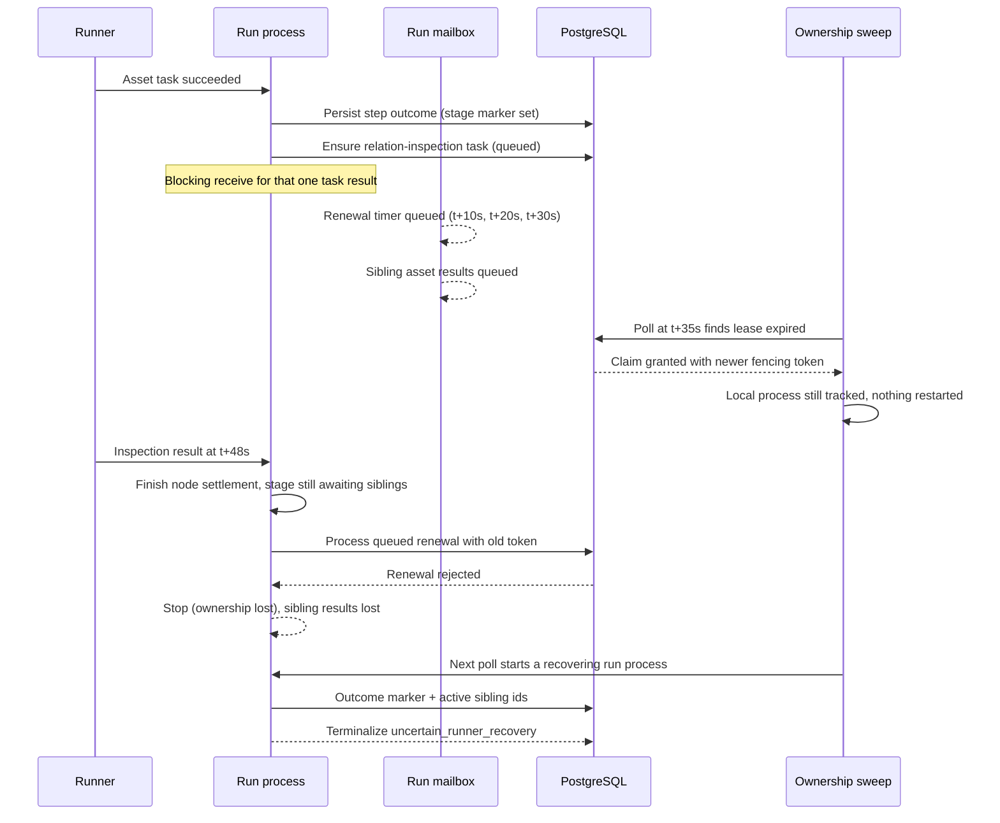
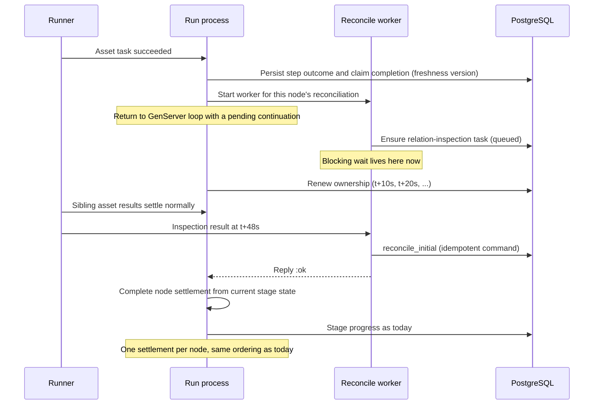

# Change Record: Keep run ownership renewable while initial-generation reconciliation waits on runner tasks

| Field | Value |
| --- | --- |
| Status | Implemented |
| Type | Bug fix |
| Primary issue | None. The maintainer supplied the defect report directly on 2026-09-03 and explicitly exempted this record from the GitHub-issue requirement (see the decision log). |
| Pull request | [#692](https://github.com/eirhop/favn/pull/692) |
| Related work | [#618](https://github.com/eirhop/favn/issues/618) (ownership-boundary concerns during stage recovery; not fixed here). The sibling record for terminal stage-admission failures cancelling independent siblings is [#693](https://github.com/eirhop/favn/pull/693), sequenced after this one. |
| Affected areas | Orchestrator run execution and ownership, initial target-generation reconciliation, operator run reads (orchestrator and PostgreSQL), run detail page in the View |
| Approved plan commit | 2c589109 |
| Last updated | 2026-09-03 |

## One-minute summary

After an asset's first successful write to a persisted target, the run process
activates the target generation by asking a runner to inspect the physical
relation. That wait runs inside the run process itself and blocks it. While it
is blocked, the process cannot renew its 30-second ownership lease, so a wait
longer than the lease loses the run to recovery even though every runner task
succeeded. Recovery then fails closed with `uncertain_runner_recovery`, and the
run page hides that error. This change moves the wait into a supervised worker
so the run process keeps serving renewals, cancellation, and sibling results
while the inspection is queued, stops a run process immediately on a fenced
write, and surfaces the bounded terminal error on the run page. It needs a
record because it changes run concurrency, a persistence read contract, and
operator-visible diagnostics across three applications.

## Impact

Any workspace whose queued work exceeds runner capacity can hit this. The
observed case had a single runner. One run wrote its first persisted target
successfully, then waited about 48 seconds for a relation-inspection task that
was queued behind the run's own sibling asset tasks on the same runner. The
run's lease expired at 30 seconds. The outcome was a run marked failed with
every window failed, while the runner task store showed every asset task
succeeded. The operator saw "failed" with no reason on the run page and had to
read raw events or the database to learn why. A later run against the same
target then failed on an admission conflict left behind by the aborted
reconciliation; that follow-on defect is covered by the sibling record.

The fix removes the lease loss for this path and shows the error class and
message whenever a run does end in a terminal failure.

## Problem analysis

### Verified root cause

The run process is a GenServer. It handles each runner result inside a
callback, and settlement of a successful persisted target calls the
initial-generation reconciler synchronously from that callback. The reconciler
runs up to three runner tasks in sequence (relation inspection, generation
capabilities, marker initialization, plus a marker read when initialization
returns an unknown outcome). Each runs through `ensure_and_await`, which
enters a selective `receive` that waits up to 300 seconds for one specific task
result. Its 250 ms wake-up only checks the deadline and rebuild cancellation.
It never returns control to the GenServer loop.

Ownership renewal is a timer message the process sends to itself every 10
seconds (one third of the lease). While the callback is blocked, those messages
queue in the mailbox. So do materialization-lock renewals, sibling runner
results, and cancel requests. The lease expires at 30 seconds.

`RunRecovery` polls every 5 seconds and claims the expired ownership row with
a new fencing token. On a single node the run manager still tracks the old
process as active, so it returns success without starting a replacement and
without releasing the sweep's claim. The database and the run manager now
disagree about who owns the run, and the old process is re-fenced silently on
every sweep.

When the inspection result finally arrives, the old process finishes the node's
settlement. Because sibling tasks are still awaited, the stage stays in its
await state and no run-fenced write happens at that moment. The next mailbox
message is the renewal queued at ten seconds. It fails against the newer token
and the process stops with `run_ownership_lost`. If the settled node had been
the last one in its stage, the stage checkpoint write would instead have been
rejected as `:fenced`, and the run server's persistence wrapper would have
scheduled a persist retry rather than stopping. That second path was not
observed in the incident but is reachable, and slice 2 hardens it.

The ownership sweep starts a fresh run process. The step-succeeded event for
the settled node already carried the "active stage outcome recorded" marker,
and the sibling task ids are still listed as active because their result
messages died in the old mailbox. Recovery's fail-closed rule maps that
combination to `uncertain_runner_recovery`. Recovery behaved correctly given
the durable state. The defect is upstream.

Only some outcomes reached the projection because sibling result messages were
never processed. Those tasks are durably succeeded in the runner task store but
have no step event, so they render as queued until terminalization marks the
run failed.

On the UI side, the lean run header read by the run page has no error field,
and the event summary read extracts `data.message` or `data.reason` while the
terminal event stores its text under `data.error.message`. Both the header and
the run-failed event row are therefore silent.

### Why this could happen

`ensure_and_await` was written for callers that own their own process and
lease heartbeat: the rebuild dispatcher, rebuild planning worker, and target
recovery. It was later reused from inside the run server callback, where the
same process also owns a timer-driven lease. Nothing guards against a long
callback, and the poll loop gives a false impression of responsiveness. The
reconciler test stubs runner tasks to complete before the wait begins, so no
test ever exercised the blocking receive. A single runner makes the bug likely
because the inspection task queues behind the run's own sibling tasks, so the
wait scales with sibling duration rather than inspection cost.

### Assumptions

- The run snapshot stored in `favn_control.runs` carries the run's `error`
  field at the top level as a string-keyed map with `kind`, `type`, and
  `message`, produced by the JSON-safe normalizer. Verified in the snapshot
  codec and the JSON-safe module. The header read can therefore project
  `snapshot #>> '{error,kind}'`, `'{error,type}'`, and `'{error,message}'`
  without a schema change. Whether the normalizer's message is free of runner
  payload for the catch-all shape (an error map without `kind`) must be
  confirmed in slice 3 before the "redacted" claim is made in documentation.
- Every reconciler step is idempotent by durable identity: task ids are
  deterministic digests of workspace, kind, domain identity, and manifest
  version; `reconcile_initial` uses a deterministic command id. Verified from
  source. Marker initialization idempotency is adapter-owned. This matters
  only for a worker that outlives its run process (see failures), because
  recovery never re-runs the reconciler for a terminalized run.
- The `RunnerTaskResultRouter` and `ensure_and_await` behave the same when
  called from a supervised worker as they do today from the run process. The
  waiter monitors its caller and exits when the caller dies. Verified from
  source.
- Fail-closed recovery for a stage that has one persisted outcome and other
  tasks still active remains the intended behavior and is owned by #618.

### Evidence

| Evidence | What it proves | What it does not prove |
| --- | --- | --- |
| Source: run server handles `runner_task_result` by calling execution synchronously ([run_server.ex:204](../../../apps/favn_orchestrator/lib/favn_orchestrator/run_server.ex)) | Settlement runs inside the GenServer callback | How long settlement takes in production |
| Source: settlement calls the reconciler in `persist_post_step_state` ([stage_result.ex:443](../../../apps/favn_orchestrator/lib/favn_orchestrator/run_server/execution/stage_result.ex)) | Reconciliation is on the settlement path for every successful persisted target | That sequential mode is affected (it does not call this path) |
| Source: `await_message` selective receive with 300 s default and 250 ms poll ([operation_runner_tasks.ex:217](../../../apps/favn_orchestrator/lib/favn_orchestrator/operation_runner_tasks.ex)) | The wait never yields to the mailbox | Nothing further |
| Source: renewal timer at lease/3 sent to self; renewal failure stops the process ([run_server.ex:120](../../../apps/favn_orchestrator/lib/favn_orchestrator/run_server.ex), [run_server.ex:594](../../../apps/favn_orchestrator/lib/favn_orchestrator/run_server.ex)) | Renewal depends on the callback returning | Nothing further |
| Source: same-node recovery returns ok when the pid is still tracked, without releasing the sweep's claim ([run_manager.ex:413](../../../apps/favn_orchestrator/lib/favn_orchestrator/run_manager.ex)) | A newer token is issued while the stale process keeps running | Multi-node behavior, which starts a second process instead |
| Source: after settlement with siblings still awaited the stage returns `:await` and writes nothing run-fenced ([execution.ex:1267](../../../apps/favn_orchestrator/lib/favn_orchestrator/run_server/execution.ex)); the queued renewal then fails | The observed stop came from the renewal, not from a fenced write | Nothing further |
| Source: storage rejects a stale or expired fence with `:fenced` ([runs/store.ex:1289](../../../apps/favn_storage_postgres/lib/favn_storage_postgres/runs/store.ex)); the run server wrapper passes it through as a generic error ([run_server/persistence.ex:36](../../../apps/favn_orchestrator/lib/favn_orchestrator/run_server/persistence.ex)); three code paths schedule persist retries ([run_server.ex:269](../../../apps/favn_orchestrator/lib/favn_orchestrator/run_server.ex), [run_server.ex:370](../../../apps/favn_orchestrator/lib/favn_orchestrator/run_server.ex), [run_server.ex:423](../../../apps/favn_orchestrator/lib/favn_orchestrator/run_server.ex)) | Fencing holds; a stale owner would retry instead of stopping | That this path fired in the incident (it did not) |
| Source: recovery maps "outcome recorded plus active ids" to uncertain ([recovery.ex:28](../../../apps/favn_orchestrator/lib/favn_orchestrator/run_server/recovery.ex)); the marker is set before the step event persists ([stage_result.ex:206](../../../apps/favn_orchestrator/lib/favn_orchestrator/run_server/execution/stage_result.ex)) | The observed `uncertain_runner_recovery` follows from the durable state | That this state is reachable only via the blocking wait (it is reachable via any mid-stage crash; see #618) |
| Source: `RunViewHeader` fields and header SQL ([operator_run_view.ex:72](../../../apps/favn_orchestrator/lib/favn_orchestrator/persistence/operator_run_view.ex), [operator_reads/store.ex:1440](../../../apps/favn_storage_postgres/lib/favn_storage_postgres/operator_reads/store.ex)); event summary coalesce ([operator_reads/store.ex:417](../../../apps/favn_storage_postgres/lib/favn_storage_postgres/operator_reads/store.ex)); terminal event data shape ([run_server.ex:421](../../../apps/favn_orchestrator/lib/favn_orchestrator/run_server.ex)) | The run page cannot show the terminal error today | Nothing further |
| Source: snapshot codec writes `"error" => JsonSafe.error(run.error)` at the top level ([run_snapshot_codec.ex:255](../../../apps/favn_orchestrator/lib/favn_orchestrator/storage/run_snapshot_codec.ex)); JSON-safe always yields string keys `kind`, `type`, `message` ([json_safe.ex:90](../../../apps/favn_orchestrator/lib/favn_orchestrator/storage/json_safe.ex)) | The header SQL can read the terminal error without a migration | Redaction of the catch-all shape (assumption above) |
| Reported incident (single runner, 48 s queue, lease loss, uncertain recovery, blank UI error) | The path is reachable in a real deployment | Exact timing distribution in other deployments |

## Current behavior

The run process waits inside its own callback for a runner task that may be
queued behind the run's own sibling tasks. Everything else it should be doing,
including keeping its lease alive, waits behind that.



The run page then shows "Failed" with no reason, because the header has no
error field and the event summary reads the wrong key.

## Approved plan

Post-step reconciliation runs in a supervised worker process instead of inside
the run process callback. Settlement persists the node's step outcome and its
materialization-claim completion carrying the freshness version exactly as
today, then hands the unchanged reconciler to a worker and returns to the GenServer
loop with a pending continuation for that node. The worker's reply arrives as
an ordinary mailbox message. The run process then completes the node's
settlement and lets the stage progress. Renewals, cancellation, and sibling
results are handled normally in between. The storage-level fence is unchanged,
and a fenced write now stops the run process immediately on every persist path
instead of scheduling retries. The run page shows the bounded error class and
message for any terminal failure.

The reviewer asked whether the earlier draft's phase split of the reconciler
was justified. It was not: a worker keeps `ensure_and_await` and the reconciler
untouched, keeps the existing 300 second per-task deadline, makes cancel a
process kill, and costs one short-lived process per settlement. Its only
downside, a lost in-flight reply on run-process crash, ends in the same
fail-closed terminalization either way (see failures).



### Contracts and invariants

- A run process callback never waits on a runner task. Runner-backed post-step
  reconciliation runs in a worker, and the run process returns to its loop
  with a pending continuation for that node.
- Ownership renewal, materialization-lock renewal, cancellation, and sibling
  result handling proceed while a continuation is pending.
- Pending continuations are tracked separately from stage awaits. They never
  enter the await map, never receive started signals, never go through the
  await timeout or await-down handlers, and are never cancelled through the
  runner-task cancellation path. Stage progress treats a pending continuation
  as in-flight work at every site that today checks the await map: the stage
  cannot finalize, retry, refill, time out its admission wait, or terminalize
  an admission failure while a continuation is pending. Those five sites are
  listed in the implementation map.
- Settlement ordering is preserved. At pending time the node's step outcome
  and its claim completion carrying the freshness version are durable, and the
  node's result is appended to the stage run so sibling writes use the correct
  sequence. The freshness store itself is written at stage finalization, as
  today. On resume, settlement uses the current stage run state, does not
  re-append the node result or re-apply its status transition, and then runs
  resource-circuit settlement and result recording exactly once. A worker
  failure or crash maps to the existing `post_step_persistence_failed` outcome
  for that node.
- One ordering changes relative to today and is accepted: the node's
  execution-admission lease is released at pending time, as it is for every
  settled await, while resource-circuit settlement moves to resume.
- The node's own runner task is terminal at pending time and is removed from
  the stage's pending runner-task set then. A sibling failure while a
  continuation is pending records only sibling runner tasks in the
  stage-draining marker; the stage still waits for the continuation because it
  counts as in-flight work. When the failing sibling was the only other node,
  the marker is therefore not written even though the stage is still in
  flight; recovery of that state is fail-closed either way.
- Each continuation settles exactly once. A reply or down message for a
  continuation that already settled is ignored. The implementation demonitors
  with flush on reply so the worker's normal exit never reaches the mailbox.
- Worker lifetime follows one rule: the run process terminates every pending
  worker through one helper whenever it reaches a terminal transition or stops,
  including cancel, sibling halt, unknown await outcome, admission time-out,
  admission-failure terminalization, and ownership loss. The only worker that
  runs to completion is one whose run process crashed without reaching that
  helper; its idempotent write is accepted (see failures).
- Fencing is unchanged. A stale owner cannot write. A run process that receives
  a `:fenced` persistence error stops with `run_ownership_lost` on every
  persist path and does not schedule persist retries.
- The wait is bounded by the same 300 second per-task deadline as today,
  inside the worker. Up to four runner tasks may run in sequence, so one node
  can hold its stage for up to 20 minutes with the lease renewed throughout.
  The run's own timeout does not apply to this wait. Today the run instead
  dies at 30 seconds; the longer bound is a known, accepted property.
- The run page shows only a bounded, redacted error: the stable kind or type
  and a message of at most 1024 characters. Nested reason maps, cleanup
  details, and runner payloads are never rendered.
- Recovery semantics are unchanged. The fail-closed rule for a stage with one
  durable outcome and other tasks still active stays as it is.

### Scope

- A post-step reconciliation worker started from settlement, with a small
  applicability check extracted from the reconciler so nodes that need no
  reconciliation settle synchronously as today.
- Run server execution: a pending continuation map keyed by worker reference,
  reply and down handling, deferral while a persist retry is pending, stage
  progress that counts pending continuations, and worker termination on cancel
  and on every terminal transition.
- Run server persistence: `:fenced` mapped explicitly and turned into a stop on
  the run-start, step, and terminal persist paths.
- Operator reads: the lean run header and event summaries expose the bounded
  terminal error; the run page renders it.
- Deterministic tests for renewal while pending, continuation settlement with
  interleaved sibling results, worker failure, cancel while pending, fenced
  stop, and error rendering, including a minimal run-server test harness.
- Canonical documentation updates for the run server structure page, the
  target-generation architecture page, and the features list.

### Non-goals

- Increasing the ownership lease or renewal interval.
- Weakening or bypassing stale-owner fencing.
- Making a mid-stage crash with mixed durable outcomes resumable. That is #618
  and remains fail-closed here. A crash or deploy during the pending window
  still ends as `uncertain_runner_recovery`.
- Stopping a still-tracked local process when the sweep takes over its lease
  on the same node, or emitting a diagnostic for that silent re-fencing. With
  this fix the callback no longer blocks on this path; general hardening
  belongs with #618 and is noted there.
- Changing sequential execution mode, which does not run this reconciliation.
- Cancelling the shared inspection task when a run is cancelled. Operation
  tasks are shared idempotent identities also used by activation and target
  recovery; the run only stops its worker.
- Retrying work whose external effects are uncertain.
- Consumer pipeline or asset changes, and any direct repair of affected runs.
- Bounding or redacting the full `error` term already returned by the run
  detail read model to API clients.
- Fixing the terminal stage-admission path that cancels independent siblings.
  That is the sibling record.

### Implementation slices

| Slice | Outcome | Owner or area | Depends on |
| --- | --- | --- | --- |
| 1 | Settlement returns a pending outcome for nodes that need reconciliation; execution starts a supervised worker running the unchanged reconciler, tracks it by reference, resumes settlement on its reply, counts it as in-flight for stage progress, defers replies during persist retries, and terminates it on cancel and on every terminal transition | `favn_orchestrator` run server execution | None |
| 2 | A `:fenced` persistence error is mapped explicitly and stops the run process with `run_ownership_lost` on the run-start, step, and terminal persist paths; the advisory step-running write keeps swallowing it | `favn_orchestrator` run server | None |
| 3 | Lean run header carries `error_code` and `error_message`; event summaries read `data.error.message` and `data.error.type` and a plain string error; the run page renders a terminal-error notice | `favn_storage_postgres` operator reads, `favn_orchestrator` operator run view, `favn_view` run detail | None |
| 4 | A gated test runner executor holds chosen task kinds until released; a minimal run-server harness with fake stores; regression tests for renewal while pending, continuation with interleaved siblings, worker failure, cancel while pending, fenced stop, and rendering | `favn_orchestrator` and `favn_view` tests | 1, 2, 3 |
| 5 | Canonical docs describe the worker continuation and the visible error | `docs/structure`, `docs/architecture`, `docs/FEATURES.md` | 1, 3 |

### Complexity budget

Excludes this record, generated files, dependency locks, and formatter-only
changes. Supporting lines are tests, fixtures, and canonical documentation.

| Slice | Production added | Production deleted | Supporting added | Supporting deleted | Main reason for the size |
| --- | ---: | ---: | ---: | ---: | --- |
| 1 | 150-250 | 20-50 | 0 | 0 | New settlement outcome threaded through stage result and execution; a continuation map with reply, down, deferral, cancel, and progress-count handling; a worker supervisor child |
| 2 | 30-60 | 0-10 | 0 | 0 | Explicit error mapping plus a stop clause on three persist paths |
| 3 | 60-110 | 5-20 | 0 | 0 | SQL, two structs, view model, one notice, one coalesce fix |
| 4 | 20-40 | 0 | 550-850 | 0-20 | Gated executor, a run-server harness with fake ownership, runs, and runner-task stores plus the result router, and six focused suites |
| 5 | 0 | 0 | 20-50 | 0-10 | Three short doc updates |

Variance above 25 percent or 100 lines per category requires explanation under
the outcome. Slice 4's supporting budget is large because no run-server-level
test harness exists today; the renewal acceptance criterion cannot be proven
below that level.

### Implementation map

| Concept | Expected code area | Responsibility |
| --- | --- | --- |
| Applicability check | `apps/favn_orchestrator/lib/favn_orchestrator/initial_target_generation_reconciler.ex` | Expose whether an entry needs reconciliation; `reconcile/1` itself is unchanged |
| Pending post-step outcome | `apps/favn_orchestrator/lib/favn_orchestrator/run_server/execution/stage_result.ex` | After freshness and claim completion, return `{:post_step_pending, stage_state, pending}` with the node result appended and the node's task removed from pending ids; expose a finish function that completes settlement from current stage state |
| Worker and continuation map | `apps/favn_orchestrator/lib/favn_orchestrator/run_server/execution.ex`, `run_execution_state.ex` | Start the worker under a dedicated task supervisor, store `pending` by monitor reference, handle reply and down, demonitor with flush on reply, and count pending continuations at the five await-map sites: admission time-out handling, pipeline progress, post-refill progress, admission-failure terminalization, and the refill wait check |
| Worker termination | `execution.ex`, `run_server.ex` | One helper terminates every pending worker; called on cancel and on every terminal transition and stop of the run process |
| Run server routing | `apps/favn_orchestrator/lib/favn_orchestrator/run_server.ex`, `application.ex` | Route `{ref, result}` replies to execution when `ref` is a pending worker reference; add one deferral clause for those replies while a persist retry is pending (down messages are already deferred); register the worker supervisor |
| Fenced stop | `apps/favn_orchestrator/lib/favn_orchestrator/run_server.ex`, `run_server/persistence.ex` | Map `%Error{kind: :fenced}` explicitly; stop with `run_ownership_lost` on the three retry-scheduling paths |
| Header error | `apps/favn_storage_postgres/lib/favn_storage_postgres/operator_reads/store.ex`, `apps/favn_orchestrator/lib/favn_orchestrator/persistence/operator_run_view.ex`, `operator_run_view.ex` | Project `error_code` and `error_message` from the snapshot; bound the message in SQL |
| Event summary | same store | Add `data.error.message`, `data.error.type`, and a `jsonb_typeof = 'string'` branch to the summary coalesce |
| Run page notice | `apps/favn_view/lib/favn_view/run_detail_live.ex`, `components/run_detail_page.ex` | Carry the error through the view model and render one notice for terminal failures |
| Run-server harness | `apps/favn_orchestrator/test/support/` | Fake ownership and runs stores plus an Agent-backed runner-task store, all through the persistence runtime; result router and claim supervisor as in the router test. The runner-task store must be readable from the router's check processes, so the process-dictionary store in the test helper is not used here. It must confirm cancellation requests so cancel-while-pending terminalizes as cancelled rather than unconfirmed |
| Deterministic gate | test executor module used by that store | The executor blocks inside the worker for held task kinds until the test releases it, then completes the task and notifies the router |

## Operational design

### Failures and recovery

- **Inspection never completes.** The worker's `ensure_and_await` deadline
  fires after 300 seconds, the worker replies with `runner_task_timeout`, and
  the node settles as `post_step_persistence_failed`, as today. The run keeps
  its lease throughout.
- **Reconciler step fails.** The worker replies with the existing bounded
  reason and the node settles as `post_step_persistence_failed`. No step is
  retried automatically.
- **Worker crashes.** The run process receives a down message for the
  reference and settles the node as `post_step_persistence_failed` with a
  `post_step_worker_down` reason.
- **Run reaches any terminal transition while pending.** Cancel, a sibling
  halt, an unknown await outcome, admission time-out, admission-failure
  terminalization, and ownership loss all terminate pending workers through
  the one helper and drop their continuations.
- **Run cancelled while pending.** As above, the worker is terminated through
  its supervisor and the continuation dropped. The shared inspection task is not
  cancelled and the completed materialization claim is not touched. The target
  binding stays `uninitialized`. Whether a later successful write reconciles
  it depends on that write pinning the same generation; the operator path is
  the existing interrupted-initial-generation recovery workflow in the
  target-generation architecture document.
- **Run process crashes or is redeployed while pending.** The worker, if it
  outlives the run process, may still finish `reconcile_initial`; that command
  is idempotent and not run-fenced, so the effect is at worst an activated
  binding for a run that is being terminalized. Recovery applies its existing
  rules and, because the node's outcome marker is durable while sibling tasks
  remain active, terminalizes the run as `uncertain_runner_recovery` with a
  durably succeeded materialization. This is unchanged behavior and is owned
  by #618; the run page now shows the reason.
- **Reply arrives after settlement or after cancel.** The reference matches no
  pending continuation and the message is ignored.
- **Reply arrives while a persist retry is pending.** It is deferred and
  replayed with the other execution events, as today for runner results.
- **Fenced write.** The process stops with `run_ownership_lost` and reason
  `fenced`. Recovery proceeds under the newer owner. No retry timer is
  scheduled.

### Logs and diagnostics

| Event or state | Level or surface | Safe fields | Rate limit |
| --- | --- | --- | --- |
| Post-step continuation started | Debug operational event | workspace id, run id, node key | Per continuation |
| Post-step continuation settled | Debug operational event | workspace id, run id, node key, outcome class | Per continuation |
| Post-step worker failed or timed out | Warning operational event | workspace id, run id, node key, bounded reason class | Per failure |
| Run stopped on fenced write | Error operational event (existing `run_ownership_lost` with reason `fenced`) | workspace id, run id, event type | Per stop |
| Terminal run error on the run page | Run detail notice | error code and message bounded to 1024 characters | n/a |

No reason maps, runner payloads, or cleanup details are logged or rendered.

### Deployment, migration, and compatibility

No migration. The header read projects existing snapshot data. Rollout is a
normal control-plane deploy with one new supervisor child; no operator action.
A run that is mid-stage during the deploy is handled by the existing
crash-recovery rules. Rollback is a normal redeploy of the previous release; no
data written by this change is read by the previous release.

## Verification plan

| Acceptance criterion | Planned evidence | Owning layer |
| --- | --- | --- |
| An inspection task may stay pending longer than the lease without fencing the active owner | Run-server harness test: the gated executor holds `relation_inspection` inside the worker; the test sends the renewal message to the run process several times and asserts each renewal reaches the fake ownership store with the original token; then releases the gate and asserts the run completes | `favn_orchestrator` |
| The run process handles renewals and cancellation while reconciliation is pending | Same harness: a cancel request while pending terminates the worker, does not fail the completed claim, does not cancel the inspection task, and terminalizes as cancelled | `favn_orchestrator` |
| Post-step reconciliation resumes and settles exactly once | Execution-level test: drive `handle_event` with a pending continuation, deliver the reply, assert one resource-circuit settlement and one recorded result; deliver the reply again and assert no change | `favn_orchestrator` |
| Sibling results settling while a continuation is pending keep the run state consistent | Execution-level test with two nodes: A pending, B settles, A resumes; assert B's result and sequence are retained, A's node result appears once, and the stage-draining marker written by a B failure lists only B's task | `favn_orchestrator` |
| Worker failure and worker crash settle the node as a bounded error | Execution-level tests delivering an error reply and a down message | `favn_orchestrator` |
| Replies during a pending persist retry are deferred and replayed | Run-server harness test with a runs store that fails once | `favn_orchestrator` |
| Two pending continuations in one stage settle independently | Execution-level test | `favn_orchestrator` |
| Stage cannot finalize, time out its admission wait, or terminalize an admission failure while a continuation is pending | Unit tests of the progress decisions with zero awaits and one pending continuation, plus execution-level tests for the admission time-out and admission-failure paths with a live worker | `favn_orchestrator` |
| Every terminal transition terminates pending workers | Execution-level tests for cancel and sibling halt asserting the worker is gone and its later reply is ignored | `favn_orchestrator` |
| A stale owner is rejected after a newer token exists and stops without retrying | Existing storage fence tests, plus run-server harness tests where the runs store returns `:fenced` on the step path and on the terminal path; assert stop with `run_ownership_lost` and no retry message | `favn_orchestrator`, `favn_storage_postgres` |
| Deterministic control, no timing sleeps | The gate blocks the executor until released; renewals are triggered by sending the timer message directly | tests |
| The run UI shows a bounded, redacted error code and message | Storage tests for the header and summary reads, including a plain string error; LiveView test rendering a run with `uncertain_runner_recovery` shows the notice with the code and message and nothing from the reason map | `favn_storage_postgres`, `favn_view` |
| The fix does not depend on lease or interval changes | Source inspection: lease and interval constants unchanged | review |

Evidence classes:

- Source and static inspection: `mix compile --warnings-as-errors`,
  `mix format --check-formatted`, Credo, and the tag-tier guard.
- Focused automated tests: the suites above in their owning apps.
- Broader CI qualification: the full repository CI suite.
- Live proof: on the single-runner development stack, hold relation inspection
  beyond one lease by occupying the runner with a long sibling asset, and
  confirm the run completes with the target generation active and no
  ownership-lost event. This is a manual check and is listed as such under the
  outcome if it cannot be automated.

## Risks and open questions

| Risk or question | Impact | Mitigation or decision needed |
| --- | --- | --- |
| The JSON-safe catch-all shape may carry more than a fixed message | The "redacted" claim would be too strong for some error shapes | Confirm `safe_error_message` behaviour in slice 3; if needed, project only `kind` and `type` for the catch-all shape and a generic message |
| The pending node's stage bookkeeping could let the stage finalize early | Node result missing from the stage | Count pending continuations in the progress decision; test finalization ordering explicitly |
| Resume could clobber sibling settlements | Wrong run state or sequence conflict | Resume uses the current stage run and re-applies only the node's remaining settlement; tested with two nodes |
| A worker may outlive a crashed run process | An activated binding for a run that is being terminalized | Acceptable: the command is idempotent and the run is terminalized fail-closed either way; documented above |
| Cancel while pending leaves the target `uninitialized` | Same as today; operator path is the existing recovery workflow | Documented as a non-goal; no new exposure |
| Other synchronous callback work could still exceed the lease | Same failure class on a different path | Out of scope. Remaining callback work is local database writes bounded by query timeouts, plus runner cancellation requests that wait up to about a second per task. Noted for #618 |

## Plan review

| Field | Result |
| --- | --- |
| Reviewer | Independent agent (general-purpose), 2026-09-03 |
| Reviewed against | Defect report, current code, evidence, and this plan |
| Findings | First pass: needs rework. Blocking: reusing the stage await map for the continuation collided with result conversion, started signals, await timeout, await-down, and cancel paths; resume state threading was underspecified; the test plan assumed a run-server harness that does not exist and a process-dictionary gate the router cannot see. Should-fix: the fenced-write step was not the observed stop, and slice 2 is hardening; recovery honesty about the pending window; a third persist-retry path; event-summary string shape and character bound; a simpler worker design; issue exemption to be recorded. Minor: diagram semantics and callback-work wording. |
| Findings addressed and rechecked | Second pass (recheck): blocking findings resolved; verdict "approve after fixes" with three specification gaps: pending continuations must gate all five await-map sites including admission time-out and admission-failure terminalization; the harness runner-task store must be process-independent and confirm cancellations; worker lifetime on non-cancel terminal paths must be stated. Minor: 20-minute total bound, freshness wording, lease release ordering, single-sibling marker, reply-plus-down flush, deferral clause. All folded into this revision and confirmed by the reviewer on the third pass, which also asked for two wording alignments (freshness persistence point, worker termination scope) that were applied before approval. |
| Verdict | Approved, 2026-09-03 |

## Decision log

| Date | Decision | Reason | Review needed |
| --- | --- | --- | --- |
| 2026-09-03 | No GitHub issue for this record. | The maintainer supplied the defect report directly and stated that no official issue is needed. | No |
| 2026-09-03 | Run the unchanged reconciler in a supervised worker instead of splitting it into phases. | Reviewer finding: the phase split added a slice and a new contract without a benefit the worker lacks. | Recheck |

---

The sections below are completed during implementation and before final review.

## Implementation outcome

The run process no longer waits on runner tasks inside a callback. When a
successful asset step's claim pins an uninitialized persisted generation,
`StageResult` persists the step outcome and the claim completion as before,
appends the node result to the stage run, removes the node's task from the
stage's pending set, and returns `{:post_step_pending, stage_state, pending}`.
`Execution` starts the unchanged `InitialTargetGenerationReconciler.reconcile/1`
under a new `Task.Supervisor` named `RunPostStepSupervisor` with
`async_nolink`, records the continuation under the task's monitor reference in
`RunExecutionState.post_step_continuations`, and returns to the GenServer loop.
The worker's reply `{ref, result}` and any `:DOWN` for that reference are routed
by `RunServer` to two new execution events; both are deferred while a persist
retry is pending. `StageResult.finish_post_step/3` completes the settlement from
the current stage state without re-appending the node result, mapping `:ok` to
the normal outcome and any error or worker exit to `post_step_persistence_failed`.
Pending continuations are counted with awaits at all five stage-progress sites
through `RunExecutionState.in_flight_count/1`, so they gate finalization,
retry, admission time-out, and admission-failure terminalization exactly as
awaits do; deferred work still refills while either is in flight.
`Execution.stop_post_step_workers/1` demonitors and kills every pending worker.
`Execution.handle_event/2` and `Execution.retry_persistence/2` call it whenever
they return `{:terminal, _}`, `Execution.cancel/2` calls it, and `RunServer`
calls it in `finalize_terminal/2` and in `terminate/2`. That covers every
terminal transition and every stop the process performs itself, including
ownership loss. The process does not trap exits, so a supervisor shutdown or a
kill skips `terminate/2`; the worker then outlives the run process, which is the
accepted crash-window behaviour described under failures.

`JsonSafe.error/1` gained a clause for maps whose `type` is an atom: the class
is kept as `type`, an explicit `message` is kept as the message, and the reason
and remaining fields are bounded separately. Before, such maps fell to the
catch-all and were stored with type `map` and the whole inspected map as the
message. The post-step failure error now carries a fixed message so the run page
shows a sentence rather than an inspected reason.

`RunServer.Persistence.persist_run_step/3` maps `%Error{kind: :fenced}` to
`{:error, :fenced}`. `RunServer` stops with `{:shutdown, :run_ownership_lost}`
on that value on the run-start, execution (persist-retry), and terminal persist
paths instead of scheduling a retry, emitting the existing `run_ownership_lost`
event with reason `fenced`.

The lean run header projects `error_code` (snapshot `error.type`, falling back
to `error.kind`) and `error_message` (bounded to 1024 characters, accepting a
plain string error). Event summaries additionally read `data.error.message`,
`data.error.type`, and a plain string `data.error`. The run page renders one
error notice with the code and message for a run that ended in error or timed
out; active and cancelled runs show none, because a cancelled run's recorded
error term is its cancellation, not a failure to explain.

```mermaid
sequenceDiagram
    participant Runner
    participant RS as RunServer process
    participant W as RunPostStepSupervisor worker
    participant PG as PostgreSQL

    Runner->>RS: asset task result
    RS->>PG: step_finished + claim completion (fenced write)
    alt write fenced
        RS-->>RS: stop {:shutdown, :run_ownership_lost}, no retry
    else write ok, claim pins uninitialized generation
        RS->>W: async_nolink reconcile(entry)
        Note over RS: continuation keyed by monitor ref; stage counts it as in flight
        loop every lease/3
            RS->>PG: renew ownership with original token
        end
        Runner->>RS: sibling results settle normally
        W->>PG: inspection tasks via runner, reconcile_initial
        W-->>RS: {ref, :ok | {:error, reason}} or :DOWN
        RS->>RS: finish_post_step, stage progress
    end
    opt cancel or any terminal transition while pending
        RS->>W: demonitor + kill
        Note over RS: claim untouched, inspection task not cancelled
    end
```

### Actual scope and complexity

- Files and ownership areas changed: `favn_orchestrator` run server
  (`run_server.ex`, `run_server/execution.ex`, `execution/stage_result.ex`,
  `execution/run_execution_state.ex`, `run_server/persistence.ex`),
  `initial_target_generation_reconciler.ex` (`applicable?/1`),
  `application.ex` (supervisor child), operator run view structs;
  `favn_storage_postgres` operator reads store (header SQL and summary
  coalesce); `favn_view` run detail LiveView and page component; tests in all
  three apps; three canonical docs.
- Ownership boundaries affected: none crossed. The View reads the new header
  fields through the existing `OperatorRunView` facade. Storage keeps owning
  the fence; the orchestrator only maps its error.
- Implementation complexity: one new process kind (a short-lived worker per
  reconciling node), one new state map, two new execution events, one new
  supervisor child, one explicit error mapping. Settlement ordering and
  recovery rules are unchanged.
- Operational complexity: three new debug/warning operational events with
  workspace id, run id, node key, and a bounded reason class. No migration,
  no configuration, no operator action.
- Canonical documentation updated: `docs/structure/favn_orchestrator.md` (run
  server worker and fenced stop), `docs/architecture/target-generations-and-rebuilds.md`
  (initial activation runs in a worker), `docs/FEATURES.md` (run detail shows
  the error code and message).
- Actual additions, deletions, and supporting lines per approved
  complexity-budget slice (from `git diff --numstat`, tests counted as
  supporting):

| Slice | Production added | Production deleted | Supporting added | Supporting deleted | Budget | Explanation |
| --- | ---: | ---: | ---: | ---: | --- | --- |
| 1 | 411 | 58 | 0 | 0 | 150-250 / 20-50 | Over by about 160 added lines. Roughly 60 lines are moduledoc, typedoc, and `@doc` text on the new contracts; roughly 60 lines are the four operational events with bounded reason classes; about 40 lines are run-server routing (reply, deferral, `:DOWN`, worker stop in `finalize_terminal` and `terminate`) that the budget attributed loosely between slices 1 and 2; and about 35 added and 16 deleted lines come from the final-review fix that wraps `handle_event/2` and `retry_persistence/2` so every `{:terminal, _}` result stops workers, which renamed sixteen clause heads. No production behavior beyond the plan and the reviewed fixes was added. |
| 2 | 41 | 9 | 0 | 0 | 30-60 / 0-10 | Within budget. |
| 3 | 104 | 4 | 0 | 0 | 60-110 / 5-20 | Within budget. Includes the 24-line `JsonSafe` clause and the post-step error message added for the redaction finding, and the cancelled-run exclusion on the page. |
| 4 | 0 | 0 | 1315 | 0 | 20-40 / 550-850 | Production is under budget because the gate lives in the test store rather than a production-visible executor module. Supporting is over by about 465 lines: the plan estimated one harness, and the implementation has two, an execution-level harness (548 lines, fake stores plus a gated binding read, ten tests) and a full run-server harness (561 lines) whose fake store implements nineteen persistence callbacks so a real `RunServer` can resume a recovered run end to end. The storage, LiveView, and JSON-safe tests add 206 lines. |
| 5 | 0 | 0 | 21 | 0 | 0 / 20-50 | Within budget. |

## Deviations from the approved plan

| Planned | Implemented | Reason | Impact | Reviewer verdict |
| --- | --- | --- | --- | --- |
| A gated test runner executor module blocks held task kinds inside the worker, used by an Agent-backed runner-task store | The Agent-backed store itself blocks inside `enqueue/1` for held task kinds and completes the task with a canned inspection or capabilities result when released; no separate executor module | One module instead of two gives the same deterministic control, and the hold happens exactly where the incident queued: at task admission | Test-only; no production change | Pending |
| Reply deferral during a pending persist retry proven with a run-server harness whose runs store fails once | Proven with a callback-level unit test that calls `RunServer.handle_info/2` on a constructed state with `execution_persist_pending` set and asserts the reply is appended to the deferred events, plus a routing test that a known reference reaches execution and an unknown one is ignored | Reaching that state end to end needs two nodes and a mid-flight store failure timed between a worker start and a sibling persist; the callback test proves the same rule without timing | Weaker end-to-end coverage of the replay step; the replay mechanism itself is pre-existing and unchanged | Pending |
| "Assert one resource-circuit settlement" for the exactly-once criterion | Asserted that the node result appears once, the stage's pending set and continuation map are cleared once, and a second identical reply or `:DOWN` leaves the state unchanged | Test entries carry no resource-circuit permits, so a store-level count would be vacuous; the state assertions cover the same exactly-once property | None on production | Pending |
| `reconcile/1` itself unchanged | `reconcile/1` now delegates its applicability decision to the new `applicable?/1`; the reconciliation body is unchanged. A claim whose generation id is present but not a string is now treated as not applicable where `reconcile/1` previously raised | Avoids duplicating the claim-shape logic in two places; a malformed id is a data error that should not crash the settlement path | None on behavior for well-formed claims; the reconciler test suite still passes | Pending |
| Live proof on the single-runner development stack | Not performed in this change | Requires a runner occupied by a long sibling asset for more than a lease; the run-server harness holds the inspection task and drives renewals deterministically instead | Listed under not verified | Pending |
| Worker termination on terminal transitions performed only by `RunServer` through one helper | The helper is also called by `Execution.handle_event/2` and `Execution.retry_persistence/2` whenever they return `{:terminal, _}`; `RunServer` still calls it in `finalize_terminal/2` and `terminate/2` | Final-review finding: no test exercised a non-cancel terminal transition with a live worker because the stop lived only in the run server. Enforcing it where the execution state lives makes the rule testable at execution level and removes the dependence on caller discipline | Belt-and-braces double call on the same (already stopped) map is a no-op. New execution-level test: external cancel evidence during a sibling settlement kills the pending worker. New run-server test: a rejected renewal stops the run with `run_ownership_lost` and kills the held worker through `terminate/2` | Pending |
| Slice 3 confirms the JSON-safe catch-all message shape before claiming the page is redacted | Confirmation was skipped in the first pass; the reviewer found that `%{type: atom}` maps such as `post_step_persistence_failed` were stored with type `map` and the inspected map as message. Fixed with a `JsonSafe.error/1` clause for typed maps and a fixed message on the post-step failure error | The plan's own mitigation, applied late | For legacy tuple- and atom-shaped run errors the header still projects type `tuple` or the atom name and the bounded, key-redacted inspection of the term as the message; listed under not verified and qualified in the record's invariant wording | Pending |
| The run page shows the terminal error for any terminal failure | Cancelled runs are excluded; error and timed-out runs show the notice | Final-review finding: a cancelled run records `{:cancelled, reason}` as its error, which would have rendered as code `tuple` with an inspected tuple | LiveView test added for the cancelled case | Pending |
| Reply-deferral test title claimed replay | Test renamed to what it asserts (deferral) | Reviewer finding | None | Pending |
| Contracts wording "cannot ... refill" | Implemented behaviour is that deferred work refills while a continuation is pending, exactly as it does while awaits are pending; the stage still cannot finalize, retry, time out, or terminalize an admission failure | The plan's wording listed refill among the gated actions, but the pre-existing progress rule refills whenever deferred keys exist regardless of in-flight count, and changing that was never intended | Wording in the outcome, module docs, and structure page made precise; no behaviour change | Pending |

## Verification evidence

| Check | Result | Evidence boundary |
| --- | --- | --- |
| `mix compile --warnings-as-errors` (umbrella, dev) | Clean | Static |
| `mix format` on every changed file; `git diff --check` | Clean; a HEEx line-ending artifact from the container formatter was repaired so the page diff contains only the notice | Static |
| `mix credo --strict` on the changed production files | No new findings; remaining items are pre-existing alias ordering, `with` shape, arity, and Windows line-ending consistency notes | Static |
| `elixir scripts/check_test_tag_tiers.exs` | Covered | Static |
| Source inspection: `RunOwnership.default_lease_duration_ms/0` and the renewal interval | Unchanged (30 s, lease/3) | Static |
| `favn_orchestrator` fast suite (`favn-test`, tiers excluded) | 807 passed, 0 failed, including the 18 new tests | Automated qualification |
| New `post_step_continuation_test.exs` (execution level) | 10 passed: pending settlement exactly once, interleaved siblings with the draining marker listing only the still-active sibling, two independent continuations, worker error reply, worker crash, cancel while pending, a terminal transition from a sibling settlement (external cancel evidence) killing the pending worker, ignored late reply after stop, admission deadline while pending, admission failure while pending | Automated qualification |
| New `post_step_run_server_test.exs` (real `RunServer`, fake stores) | 7 passed: three renewals with the original fencing token while the inspection task is held and the run then completes with an active binding; cancel while held kills the worker, leaves the completed claim and the inspection task alone, and terminalizes as cancelled; a rejected renewal stops the run with `run_ownership_lost` and kills the held worker; fenced step write and fenced terminal write each stop with `run_ownership_lost` after exactly one write attempt; reply deferral and routing | Automated qualification |
| `json_safe_test.exs` | Passes with the new typed-map case: class kept as type, explicit message kept, reason bounded and key-redacted, other fields merged under details, and an exception struct with a `type` field still normalized by the exception clause | Automated qualification |
| `favn_view` `run_detail_live_test.exs` | 57 passed including the three new notice tests (error shown, cancelled hidden, active and clean hidden); `favn_view` fast suite 827 passed | Automated qualification |
| `favn_storage_postgres` `core_authority_test.exs` (bootstrap role) | The two new header and summary tests pass; the full file passes 144 of 145 with one unrelated backfill-window seeding failure that passes in isolation (shared-database ordering) | Automated qualification |

### Not verified

- Live proof on the development stack (a runner occupied by a long sibling asset
  while a first-generation target's inspection waits beyond one lease). The
  run-server harness covers the same control flow with a held task and direct
  renewal messages.
- The 300 second per-task deadline expiring inside the worker; the reconciler's
  timeout path is unchanged and exercised by the existing
  `OperationRunnerTasks` tests, and the worker error path is tested with a
  reconciler error reply.
- Behaviour when `RunPostStepSupervisor` itself is unavailable; `async_nolink`
  would exit the run process, which then follows the existing crash-recovery
  rules.
- Redaction of legacy run errors that are plain tuples or atoms (for example
  `{:pipeline_freshness_checkpoint_failed, reason}`). Their header message is
  the bounded, sensitive-key-redacted inspection of the term, which can include
  nested data. Typed error maps and runner errors carry their class and message
  separately and are covered by tests.
- Worker termination when the run process is killed or shut down by its
  supervisor without `terminate/2` running. The worker then finishes on its own;
  the effect is the idempotent activation described under failures.

## Final review

| Field | Result |
| --- | --- |
| Reviewer | Independent agent (general-purpose), 2026-09-03 |
| Compared | Approved plan at 2c589109, this record, the working-tree diff, the new tests, and the three canonical docs |
| Deviations complete | Yes after the second pass; the reviewer confirmed the baseline sections are byte-identical to the approved commit |
| Findings | First pass: no blocking findings. Should-fix: typed error maps such as `post_step_persistence_failed` were stored with type `map` and an inspected message (S1); no test covered a non-cancel terminal transition with a live worker (S2); cancelled runs would have rendered their cancellation term as an error notice (S3). Minor: `terminate/2` coverage overstated, "refill" wording, a test name claiming replay, a silent fallback, and an unmentioned `applicable?/1` edge. Second pass: one should-fix, the new `JsonSafe` typed-map clause matched exception structs that carry a `type` field (N1), and one minor, duplicate `details` puts overwriting each other (N2). |
| Findings addressed and rechecked | S1-S3 and M1-M5 fixed and confirmed resolved on the second pass. N1 fixed with a struct guard on the clause and an exception-with-type test case; N2 fixed by merging explicit details with the remaining fields once. |
| Verdict | Approve after fixes (second pass); N1 and N2 applied afterwards as the reviewer specified, with no further re-review requested |
