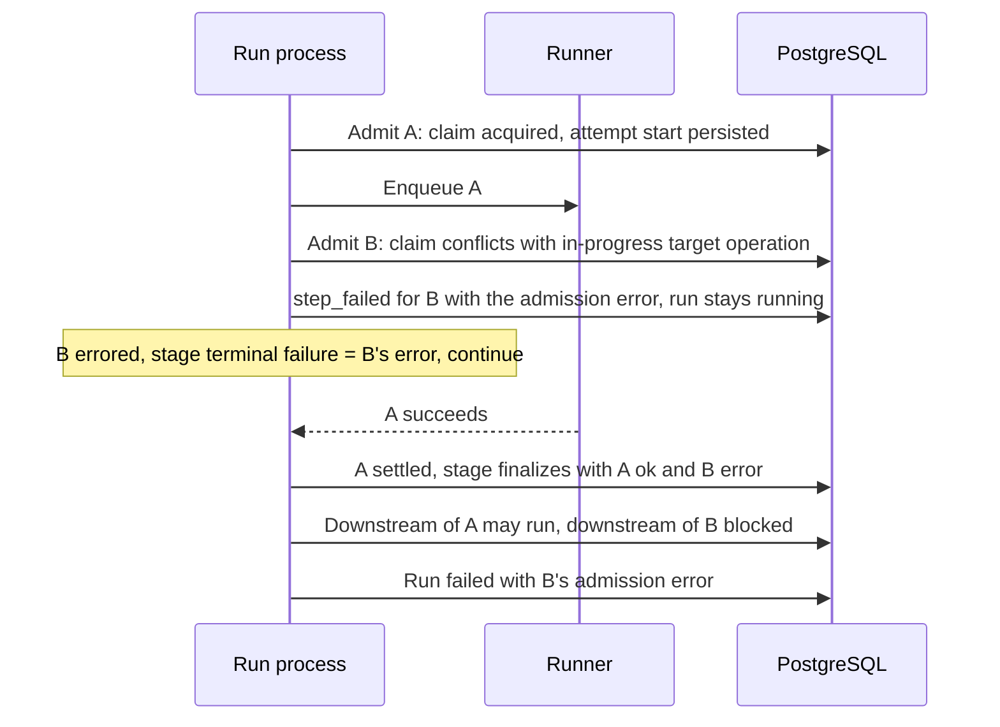

# Change Record: Fail only the affected node when stage admission fails terminally

| Field | Value |
| --- | --- |
| Status | Implementing |
| Type | Bug fix |
| Primary issue | None. The maintainer supplied the defect report directly on 2026-09-03 and exempted this record from the GitHub-issue requirement (see the decision log). |
| Pull request | [#693](https://github.com/eirhop/favn/pull/693) |
| Related work | [#508](https://github.com/eirhop/favn/issues/508) (independent-sibling semantics for result failures, which this record extends to admission failures); [#618](https://github.com/eirhop/favn/issues/618) (fail-closed recovery of a draining stage, unchanged here); [#692](https://github.com/eirhop/favn/pull/692), the record `pr-692-run-server-async-initial-generation.md`, whose aborted reconciliation produced the admission conflict that exposed this defect and which lands first |
| Affected areas | Orchestrator pipeline stage admission and execution persist-retry resume |
| Approved plan commit | 55e6b0be |
| Last updated | 2026-09-03 |

## One-minute summary

Nodes in the same pipeline stage are independent. Favn's runtime contract says
one terminal branch does not stop its siblings; the stage drains and only
dependents of the failed node become blocked. The stage-admission path breaks
that rule: when one node cannot be admitted for a node-specific terminal
reason, such as a materialization claim that conflicts with an in-progress
target operation, the orchestrator cancels every sibling it has already
submitted. A sibling that had started on a runner then fails with an unknown
cancellation outcome and is presented as the primary failure, while the node
that actually failed admission has no failure event of its own. This change
makes a node-specific terminal admission failure fail only its own node, lets
submitted siblings finish, and attributes the run's terminal error to the
admission failure. It needs a record because it changes stage concurrency and
the persist-retry resume contract inside run execution.

## Impact

Any pipeline with two or more independent nodes in one stage can hit this
whenever one of them fails admission for a node-specific terminal reason. The
observed case followed the lease-loss defect in the sibling record: an aborted
initial-generation reconciliation left a target operation in progress, so the
next run's node `B` could not acquire its materialization claim. Node `A`,
already executing on the runner, was cancelled. Because `A` had started, the
runner returned `native_cancel_unknown` with `unknown_do_not_retry`. Every
downstream of `A` was blocked although `A` had done nothing wrong, `B` had no
failure event, and the operator had to unpick `B`'s conflict from inside `A`'s
failure.

After the fix, `A` finishes, its dependents may run, `B` gets its own failure
event carrying the admission error, `B`'s dependents are blocked, and the run's
terminal error is `B`'s conflict.

## Problem analysis

### Verified root cause

Stage admission submits the runnable nodes of a stage one at a time. Most
per-node outcomes already continue past the node: a resource-circuit block
persists a `blocked` decision for that node, records it as the stage's
terminal failure, and moves on; a stage-build failure records the node as
errored and continues; a safely retryable submit failure records a partial
retry and continues. Result failures after execution use the same model: the
stage remembers the first failure, writes a draining marker when siblings are
in flight, and waits for them before it finalizes.

Terminal admission failures do not follow this model. Two node-specific paths
return a whole-stage error:

1. A materialization-claim acquisition error other than "already claimed"
   releases the node's lease and permits and returns a whole-stage error with
   the node's reason as the run error. No per-node event is written. The
   in-progress target-operation conflict arrives here as a persistence
   conflict error carrying the reason code `target_operation_in_progress`;
   "already claimed" is only the competing-claim decision, which queues the
   node instead.
2. A failure to attach the execution package, when not safely retryable,
   cancels every already-submitted sibling directly and then persists a
   `step_failed` for the node, still as a whole-stage error.

A third path, an unknown enqueue outcome for the node's own task, cancels only
that task at the admission layer and returns a whole-stage error with a cleanup
entry; execution then cancels the siblings. That path is fail-closed for a
good reason and is left unchanged (see non-goals).

Execution turns a whole-stage error into stage terminalization: it requests
cancellation of every active runner task of the stage, records the admission
error as the stage's terminal failure, and keeps the stage state only to drain
those cancellations. A sibling whose runner work had already started then ends
in one of two ways. If the runner delivers a result, it is
`native_cancel_unknown`, which settles as an ordinary `step_failed` for the
sibling with that runner error. If instead the await worker dies or the attempt
timer fires, the sibling is terminalized as `runner_await_outcome_unconfirmed`
with the cancellation details nested inside. In both cases the sibling carries
a terminal status, so the read model marks it the primary failure. The node
that actually failed admission has, on path 1, no step event at all; the read
model projects it as a missing step that was stopped after the failure, or as
queued if it had been queued earlier.

### Why this could happen

The independent-sibling contract was implemented for result failures. Stage
admission predates it and kept a single "the stage failed" return shape for
anything it could not classify as blocked, skipped, or retryable. Each terminal
admission path was written defensively as a whole-stage stop, which is the safe
choice when the failure is run-wide but wrong when it is specific to one node.
No test exercised an admission failure while a sibling was executing, so the
cancellation of healthy siblings was never observed until a real admission
conflict occurred.

### Assumptions

- Downstream classification already blocks only dependents of failed nodes when
  the stage finalizes with a per-node status map. Verified: finalization
  records completed statuses into the freshness context, and the decider checks
  each node's own upstreams.
- First failure wins as the run's terminal error. Verified in both stage
  attempt state and result settlement.
- A terminal failure recorded during submission does not itself trigger
  cancellation anywhere in execution; the stage drains its awaits and then
  finalizes. Verified by the reviewer against the progress decision, the refill
  path, and finalization.
- Recovery of a stage that has one durable outcome and other tasks still
  active remains fail-closed and is owned by #618.
- The sibling record's pending post-step continuations, if it lands first, are
  counted as in-flight work by the stage progress decision. That invariant is
  verified only when this record lands second.

### Evidence

| Evidence | What it proves | What it does not prove |
| --- | --- | --- |
| Source: claim-acquisition error returns a whole-stage error after releasing lease and permits ([stage_admission.ex:290](../../../apps/favn_orchestrator/lib/favn_orchestrator/run_server/execution/stage_admission.ex)) | Path 1 has no per-node event | Nothing further |
| Source: the target-operation conflict is a persistence conflict error with reason code `target_operation_in_progress` from the claim and lock stores ([materialization/store.ex:173](../../../apps/favn_storage_postgres/lib/favn_storage_postgres/materialization/store.ex), [target_operation_locks/store.ex:93](../../../apps/favn_storage_postgres/lib/favn_storage_postgres/target_operation_locks/store.ex)); "already claimed" is only the competing decision ([materialization_claims.ex:250](../../../apps/favn_orchestrator/lib/favn_orchestrator/materialization_claims.ex)) | The observed conflict takes path 1 | Nothing further |
| Source: non-retryable package-attach failure cancels submitted siblings, then persists the node's failure ([stage_admission.ex:574](../../../apps/favn_orchestrator/lib/favn_orchestrator/run_server/execution/stage_admission.ex)) | Path 2 cancels healthy siblings | Nothing further |
| Source: unknown enqueue cancels only the node's own task and returns a cleanup entry ([stage_admission.ex:488](../../../apps/favn_orchestrator/lib/favn_orchestrator/run_server/execution/stage_admission.ex)) | Path 3 is a distinct fail-closed case | Whether it could be made per-node safely (deferred to #618) |
| Source: whole-stage error cancels every active task and drains only cancellations ([execution.ex:1409](../../../apps/favn_orchestrator/lib/favn_orchestrator/run_server/execution.ex), [execution.ex:1455](../../../apps/favn_orchestrator/lib/favn_orchestrator/run_server/execution.ex)) | Execution has no way to receive a per-node admission failure and keep draining | Nothing further |
| Source: a delivered `native_cancel_unknown` result settles as the sibling's own `step_failed` ([task_executor.ex:318](../../../apps/favn_runner/lib/favn_runner/task_executor.ex), [stage_result.ex:177](../../../apps/favn_orchestrator/lib/favn_orchestrator/run_server/execution/stage_result.ex)); an unconfirmed cancellation terminalizes it as `runner_await_outcome_unconfirmed` ([execution.ex:845](../../../apps/favn_orchestrator/lib/favn_orchestrator/run_server/execution.ex)); the read model marks any terminal-status step primary and projects a node with no events as a missing step stopped after the failure ([step_projection.ex:387](../../../apps/favn_orchestrator/lib/favn_orchestrator/run_read_model/step_projection.ex)) | Why `A` appears as the failure and `B` does not | Nothing further |
| Source: resource-circuit block and stage-build failure record a per-node status and continue ([stage_admission.ex:194](../../../apps/favn_orchestrator/lib/favn_orchestrator/run_server/execution/stage_admission.ex), [stage_admission.ex:770](../../../apps/favn_orchestrator/lib/favn_orchestrator/run_server/execution/stage_admission.ex)) | The per-node model already exists inside stage admission | Nothing further |
| Source: submission-time terminal failure and node statuses flow into stage state ([stage_attempt_state.ex:58](../../../apps/favn_orchestrator/lib/favn_orchestrator/run_server/execution/stage_attempt_state.ex)); the progress decision ignores the terminal failure and drains awaits ([execution.ex:1267](../../../apps/favn_orchestrator/lib/favn_orchestrator/run_server/execution.ex)); finalization records per-node statuses and the decider blocks only dependents of failed upstreams ([execution.ex:1730](../../../apps/favn_orchestrator/lib/favn_orchestrator/run_server/execution.ex), [decider.ex:90](../../../apps/favn_orchestrator/lib/favn_orchestrator/freshness/decider.ex)) | Recording a per-node failure and continuing produces the intended stage outcome without changes to progress or classification | Nothing further |
| Source: persist-retry resume for admission accepts only the partial-retry and whole-stage error shapes ([execution.ex:464](../../../apps/favn_orchestrator/lib/favn_orchestrator/run_server/execution.ex)) | A per-node path that continues submission needs its own resume shape | Nothing further |
| Source: the queued-step write forces the run to `running` ([stage_admission.ex:670](../../../apps/favn_orchestrator/lib/favn_orchestrator/run_server/execution/stage_admission.ex)) while the current submit-failure write leaves it at `error` ([stage_admission.ex:592](../../../apps/favn_orchestrator/lib/favn_orchestrator/run_server/execution/stage_admission.ex)) | The per-node write must keep the run `running` while work continues | Nothing further |
| Canonical contract text ([runtime-model.md](../../../apps/favn/guides/runtime-model.md), [retries-and-replay.md](../../../apps/favn/guides/retries-and-replay.md)) | The intended behavior is documented; this fix makes admission conform to it | Nothing further |
| Reported incident (admission conflict on `B`, `A` cancelled with `native_cancel_unknown`, `A`'s dependents blocked, `B` without a failure event) | The path is reachable in a real deployment | Frequency outside the lease-loss aftermath |

## Current behavior

One node's terminal admission failure stops the whole stage. Already-submitted
siblings are cancelled, and the one that had started becomes the visible
failure.

```mermaid
sequenceDiagram
    participant RS as Run process
    participant Runner
    participant PG as PostgreSQL

    RS->>PG: Admit A: claim acquired, attempt start persisted
    RS->>Runner: Enqueue A
    Runner->>Runner: A starts executing
    RS->>PG: Admit B: claim conflicts with in-progress target operation
    Note over RS: Whole-stage error, no step_failed for B
    RS->>Runner: Cancel A
    Runner-->>RS: Result: native_cancel_unknown (A had started)
    RS->>PG: step_failed for A with the runner error (primary failure)
    RS->>PG: Downstream of A blocked, downstream of B blocked
    RS->>PG: Run failed; B projected as a missing step
```

## Approved plan

A terminal admission failure that is specific to one node is recorded for that
node and the stage keeps going. The node gets a durable `step_failed` event
carrying the admission error and an explicit node result, its pre-dispatch
resources are released, its status is recorded as errored, and the stage's
terminal failure is set to that error if none is set yet. The run itself stays
`running` in the database while work continues; the terminal failure is held
in stage state and applied when the stage finalizes, exactly as it is for a
resource-circuit block today. Submission continues with the remaining nodes,
and the stage drains its running siblings before it finalizes. Finalization
records per-node statuses as it does today, so only dependents of the failed
node are blocked and dependents of successful siblings may run. Failures that
are run-wide keep stopping the stage.



### Contracts and invariants

- A node-specific terminal admission failure never cancels a sibling. Already
  submitted siblings finish, retry under policy, or fail on their own terms.
- The node that failed admission receives exactly one durable `step_failed`
  event containing the admission error, one explicit node result with status
  `error` and no asset results, and its status is recorded as errored for
  downstream classification. Its runner task id is absent because it never had
  a task.
- The failure write keeps the run `running` and clears the run-level error, as
  the queued-step write does; the admission error lives in the event data and
  the node result. The stage's terminal failure is held in stage state until
  finalization, which is when the run transitions to its terminal status. The
  stage-outcome recovery marker is recorded with the node's failure, as it is
  for every other durable per-node outcome. After the failed stage finalizes,
  later stages run under the durable terminal status exactly as they do after
  a resource-circuit block today; that is pre-existing and unchanged.
- The run's terminal failure is the first terminal failure recorded in the
  stage, whether it came from admission or from a result. Later failures do
  not replace it.
- Downstream nodes whose dependency closure contains the failed node are
  persisted as blocked. Downstream nodes that depend only on successful
  siblings may run. Every planned node receives an explicit terminal result.
- Pre-dispatch resources of the failed node follow their existing contracts:
  its execution lease is released, its resource permits are released, and its
  materialization claim, if it was acquired, is failed with the admission
  error.
- Classification is by call site and error kind, never by kind alone. The
  per-node path handles: claim and lock conflicts from the claim store (a
  persistence conflict at the claim call site), an unpinned or mismatched
  target generation, an unexpected materialization decision, an asset missing
  from the manifest index (largely unreachable at this call site because stage
  build already catches it, kept for completeness), and node-specific
  execution-package errors (package required, package verification). Whole-stage behavior is kept for: external
  cancellation, a run that is no longer admissible, missing run authority for
  materialization, any persistence error of kind unavailable, internal, or
  forbidden at either call site, any failure to persist a run transition
  (including the attempt-start write, whose failure means ownership or store
  trouble), any pre-dispatch release failure, and the unknown enqueue outcome.
- No draining marker is written for an admission failure. A sibling that later
  fails on its own is an independent primary failure, not a cascade, because
  nothing stopped it. Result-failure draining markers are unchanged.
- Persist-retry resume for the per-node path continues submission of the
  remaining nodes. If the node's failure write must be retried, the remaining
  nodes are carried as deferred work with the batch-budget refill cause, so
  they refill immediately after the retry succeeds rather than waiting the
  blocked-refill delay. The initial-stage resume payload also carries the
  statuses of nodes completed in earlier attempts, so a retry during a later
  stage attempt keeps every planned node's terminal result and downstream
  classification intact. The existing partial-retry resume does not carry
  those statuses; that pre-existing gap is out of scope and noted for
  follow-up.
- Recovery semantics are unchanged. A crash while the stage drains after an
  admission failure resolves under the existing fail-closed rules.
- Genuine cancellation after a node has started, from an operator, shutdown,
  timeout, or lease loss, still produces the conservative unknown outcome. No
  runner change.

### Scope

- Stage admission: a per-node terminal failure path for the classified
  node-specific claim, generation, index, and package errors, replacing the
  whole-stage error on path 1 and routing package-attach failures away from the
  sibling-cancelling function on path 2. That function survives for the
  run-wide attempt-start persistence failure, where it must still release
  entries that are not yet in the work set.
- Execution: one new persist-retry resume clause for the per-node path, in both
  the initial-stage and refill variants, with the initial-stage payload
  carrying completed node statuses.
- A classification table with one unit test per error term.
- Regression coverage at the execution level with a withheld sibling result.

### Non-goals

- Fixing the reason a materialization claim or target operation stays active.
  The sibling record removes the trigger observed here.
- Changing `native_cancel_unknown` or any runner-side cancellation semantics.
- Changing operator cancellation, shutdown, timeout, lease-loss, retry, or
  circuit-breaker behavior.
- Making the unknown-enqueue path per-node. The node's own task may or may not
  exist in the runner task store; today's path cancels it, tracks it as a
  cleanup entry, and fails closed. Making that per-node would require holding
  an unconfirmed task in the work set across the rest of the stage, which is
  a recovery-shape change owned by #618.
- Making attempt-start persistence failures per-node. That write is a run
  transition; its failure indicates lost ownership or a store problem, and a
  per-node path would immediately issue another transition write to the same
  store.
- Writing a draining marker from the admission path.
- Exposing the runner task id in projected step failure logs. The reviewer
  found no read-model surface that reads a step-level task id from failure
  event data; the id is already present in the nested node result, and the
  run-level field is nil at terminal by design. Until the surface that showed
  nil is identified, this is a separate small change and is not part of this
  record. The maintainer should confirm this scope reduction.
- Changing recovery of a draining stage. A crash during the drain still ends
  as `uncertain_runner_recovery` when an outcome is durable and sibling tasks
  remain active. This becomes reachable for the admission case, which today
  terminalizes quickly instead; it is the only fail-closed outcome available.
- Repairing runs that were already mis-attributed.
- Canonical documentation changes. The runtime-model and retries guides already
  state the contract this fix restores; no operator document describes the
  defective behavior.

### Implementation slices

| Slice | Outcome | Owner or area | Depends on |
| --- | --- | --- | --- |
| 1 | Classified node-specific admission errors fail only the node: release its resources, persist its `step_failed` with the run kept running, the run error cleared, and the outcome marker set, append its node result, record its status and the first terminal failure, continue submission; whole-stage behavior and the sibling-cancelling function retained for run-wide errors | `favn_orchestrator` stage admission | None |
| 2 | Persist-retry resume for the per-node path in the initial-stage and refill variants, carrying remaining nodes as batch-budget deferred work and, for the initial-stage variant, the completed node statuses | `favn_orchestrator` execution | 1 |
| 3 | Classification unit tests per error term; execution-level regression tests with a withheld sibling result: node failure event and result, no cancellation request for the sibling, sibling completion, downstream classification, terminal error attribution, resource release, persist-retry resume, and fail-closed recovery disposition | `favn_orchestrator` tests | 1, 2 |

### Complexity budget

Excludes this record, generated files, dependency locks, and formatter-only
changes. Supporting lines are tests and fixtures.

| Slice | Production added | Production deleted | Supporting added | Supporting deleted | Main reason for the size |
| --- | ---: | ---: | ---: | ---: | --- |
| 1 | 90-160 | 20-50 | 0 | 0 | One per-node failure function with a classification function; the path 1 whole-stage return is replaced and path 2 is rerouted; the sibling-cancelling function survives for run-wide errors, so deletions stay at the low end |
| 2 | 30-70 | 0-10 | 0 | 0 | Two resume clauses that build stage state with deferred remaining nodes and completed statuses |
| 3 | 0-20 | 0 | 380-600 | 0-20 | Two-node stage fixture through the existing execution harness with a fake claim store that conflicts for one node, a recording cancellation surface added to the shared test runner-task store, classification cases (the index-miss case bypasses stage build), resume case, recovery case |

Variance above 25 percent or 100 lines per category, or materially fewer
deletions than planned in slice 1, requires explanation under the outcome.

### Implementation map

| Concept | Expected code area | Responsibility |
| --- | --- | --- |
| Per-node admission failure | `apps/favn_orchestrator/lib/favn_orchestrator/run_server/execution/stage_admission.ex` | Release lease and permits, fail the claim if acquired, persist `step_failed` with the run kept running and the outcome marker set, append the node result, record node status and first failure, continue with the rest of the stage |
| Classification | same, one function | Map call site plus error term to per-node or whole-stage |
| Whole-stage failures kept | same | External cancel, run not admissible, missing authority, unavailable/internal/forbidden persistence errors, failed run-transition writes, pre-dispatch release failures, unknown enqueue |
| Resume clauses | `apps/favn_orchestrator/lib/favn_orchestrator/run_server/execution.ex` | Accept the per-node continuation shape for both the initial-stage and refill variants; remaining nodes become deferred work and refill through the existing loop |
| Stage progress, classification, finalization | `execution.ex`, `stage_classifier.ex`, `freshness_context.ex`, `decider.ex` | Unchanged; consume the per-node status map |

## Operational design

### Failures and recovery

- **Admission fails for one node while siblings run.** The node fails with its
  own event and result and the siblings drain. The run finishes failed with the
  admission error. Dependents of the failed node are blocked; dependents of
  successful siblings run in later stages.
- **Admission fails for several nodes in one stage.** Each gets its own
  failure event; the first is the run's terminal error.
- **A sibling later fails on its own.** It is recorded as a further primary
  node failure; the run error stays the first one.
- **Persisting the node's failure event fails.** The persist-retry mechanism
  applies through the new resume clause; the remaining nodes are refilled after
  the retry succeeds.
- **Releasing the node's pre-dispatch resources fails.** Unchanged: the stage
  stops with the release failure, because lease or permit state is then
  unknown.
- **Crash while draining.** Unchanged fail-closed recovery: the failed node's
  outcome is durable and the sibling's task is active, so recovery reports the
  stage as not resumable and the run is terminalized. This outcome is new for
  the admission case, which today terminalizes before any drain.
- **Unknown enqueue outcome for the failing node.** Unchanged whole-stage
  behavior.

### Logs and diagnostics

| Event or state | Level or surface | Safe fields | Rate limit |
| --- | --- | --- | --- |
| Node admission failed terminally | Existing `step_failed` run event | asset ref, node key, stage, attempt, bounded error | Per node |

No new log lines. Error terms in event data pass through the existing
JSON-safe redaction.

### Deployment, migration, and compatibility

No migration and no payload change. Rollout is a normal control-plane deploy;
rollback is a normal redeploy. Runs mid-stage during the deploy follow the
existing crash-recovery rules.

## Verification plan

The execution-level tests use the existing harness: a persistence runtime with
fake stores and the test runner-task store, driving `Execution` directly. The
held sibling is simulated by withholding the injection of its runner result
until the test chooses to deliver it, as the sequential tests do today. The
fake claim store returns a conflict error for `B`. The fake stores record
lease and permit releases and claim failures, and the shared test runner-task
store gains a recording cancellation surface (today it returns unavailable and
records nothing), so the tests can assert on them. Required fake surfaces: run transitions and reads,
admission lease acquire and release, resource-circuit acquire, release, and
outcome recording, materialization claim, freshness reads, evidence bindings,
and execution checkpoints; the fixture uses non-SQL assets to avoid package
fetches and plan nodes carrying target and evidence generation identities.

| Acceptance criterion | Planned evidence | Owning layer |
| --- | --- | --- |
| `B` receives a durable `step_failed` event and node result containing the admission conflict | Execution test: assert one `step_failed` for `B` with the conflict error, the run still `running` after that write, and one node result for `B` with status `error` | `favn_orchestrator` |
| `A` is not cancelled and finishes | Same test: assert no cancellation request for `A`'s task reached the fake store; deliver `A`'s result and assert it settles as ok | `favn_orchestrator` |
| A downstream node depending only on `A` may run; one depending on `B` is blocked | Same test with a second stage: assert the `A`-dependent is admitted and the `B`-dependent is persisted as blocked | `favn_orchestrator` |
| The run finishes failed with `B`'s admission error as the primary cause | Same test: assert the terminal run error equals `B`'s admission error | `favn_orchestrator` |
| Every planned node receives an explicit terminal result | Same test: assert the final result contains one entry per planned node | `favn_orchestrator` |
| Resources released or retained per existing contracts | Same test: assert lease release, permit release, and claim failure calls for `B`; none for `A` | `favn_orchestrator` |
| Classification is correct per error term | Unit tests: each listed per-node term takes the per-node path; each listed whole-stage term keeps the whole-stage path | `favn_orchestrator` |
| Persist-retry resume continues submission | Execution test: the failure write fails once; after the retry, remaining nodes are refilled and the stage completes | `favn_orchestrator` |
| Run-wide failures still stop the stage | Execution test: external cancel during submission still terminalizes as cancelled | `favn_orchestrator` |
| Recovery while draining after an admission failure is fail-closed and consistent | Recovery disposition test on the persisted run state after `B` failed with `A` active: asserts the not-resumable disposition listing `A`'s task | `favn_orchestrator` |
| Genuine cancellation after start still yields the unknown outcome | Existing runner tests unchanged; the diff touches no runner code | `favn_runner` |

Evidence classes:

- Source and static inspection: `mix format --check-formatted`,
  `mix compile --warnings-as-errors`, Credo, the tag-tier guard.
- Focused automated tests: the orchestrator suites above.
- Broader CI qualification: the full repository CI suite.
- Live proof: on the development stack, hold one asset of a two-asset stage on
  the runner and force an admission conflict on the other by starting a
  conflicting target operation; confirm the held asset completes and the run
  error names the conflict. Manual; recorded as such under the outcome if not
  automated.

## Risks and open questions

| Risk or question | Impact | Mitigation or decision needed |
| --- | --- | --- |
| A term classified as node-specific turns out to be run-wide in some deployment | A run-wide failure would be recorded as one node's failure while siblings continue | Classification is by call site and kind with a unit test per term; unknown terms default to whole-stage |
| Holding the terminal failure only in stage state until finalization | A crash between the node's failure write and finalization leaves the run `running` with a durable outcome marker | Same as every per-node outcome today; recovery is fail-closed and terminalizes |
| Ordering with the sibling record | If this lands first, pending post-step continuations do not yet exist; if second, the drain must count them | Land after the sibling record; the assumption is marked verified only in that order |
| Scope reduction on the task-id projection | The defect report asked for it; this record drops it pending identification of the surface | Maintainer confirmation requested in the decision log |

## Plan review

| Field | Result |
| --- | --- |
| Reviewer | Independent agent (general-purpose), 2026-09-03 |
| Reviewed against | Defect report, current code, evidence, and this plan |
| Findings | First pass: needs rework. Blocking: attempt-start persistence failures were listed as per-node in scope but whole-stage in the invariants. Should-fix: the sibling-failure mechanism (delivered unknown result vs unconfirmed cancellation) and `B`'s projection were misdescribed; classification needed an explicit call-site-plus-kind table; the failure write must keep the run running and set the outcome marker; the per-node path needs its own persist-retry resume shape and Execution changes; the task-id slice had no identified surface; the admission draining marker would attribute inconsistently; the harness cannot route results through the router and must withhold injected results instead; the node needs an explicit node result. Minor: evidence line references, path-3 description, recovery honesty, sibling-record dependency, budget, and a doc slice with no target. |
| Findings addressed and rechecked | Addressed in this revision: attempt-start failures kept whole-stage; mechanism and projection corrected; classification table added; run kept running with outcome marker; resume clauses specified as slice 2; task-id item split out as a non-goal pending maintainer confirmation; draining marker dropped with the primary-failure rationale; harness described per the sequential tests; node result added; evidence corrected; doc slice removed. Second pass confirmed all first-pass findings resolved and raised six minor items: the initial-stage resume payload must carry completed node statuses; the sibling-cancelling function survives for the run-wide case so deletions are lower; the failure write clears the run error and later stages run under the terminal status as today; the resumed remaining nodes use the batch-budget refill cause; the recording cancellation surface is a test-store change to budget; the index-miss term is largely unreachable. All recorded in this revision before baseline. |
| Verdict | Approved, 2026-09-03 |

## Decision log

| Date | Decision | Reason | Review needed |
| --- | --- | --- | --- |
| 2026-09-03 | No GitHub issue for this record. | The maintainer supplied the defect report directly and stated that no official issue is needed. | No |
| 2026-09-03 | Separate record and PR from the lease-loss fix, sequenced after it. | Different code paths and defects; combined review would be harder and the two interact only at the drain boundary. | No |
| 2026-09-03 | Drop the runner-task-id projection item from this record. | Reviewer found no read-model surface that reads a step-level task id from failure event data; the id is already in the nested node result. Needs a separate small change once the surface is identified. | Maintainer confirmation |
| 2026-09-03 | Write no draining marker from the admission path. | With siblings left running, a later sibling failure is an independent primary failure, not a cascade; a marker from admission would also miss nodes admitted after the failed one. | Recheck |

---

The sections below are completed during implementation and before final review.

## Implementation outcome

Both node-specific admission paths now fail only their own node. Stage
admission gained a public classification function, `node_specific_failure?/2`,
and a per-node failure function that releases nothing (both call sites already
released), persists the node's `:step_failed` with the run left `running` and
the recovery marker set, appends the node's result, records the node status and
the stage's first terminal failure, and then continues submitting the rest of
the stage. Execution gained the matching persist-retry resume clause in both
the initial-stage and refill variants.

Path 1, the claim-acquisition error, now classifies after its existing
pre-dispatch release. Path 2 no longer reaches the sibling-cancelling function
for a node-specific package error; that function survives unchanged for the
run-wide attempt-start persistence failure, which `fail_unsubmitted_entry/4`
now distinguishes by an explicit call site.

### Actual scope and complexity

- Files and ownership areas changed:
  `apps/favn_orchestrator/lib/favn_orchestrator/run_server/execution/stage_admission.ex`,
  `apps/favn_orchestrator/lib/favn_orchestrator/run_server/execution.ex`,
  `apps/favn_orchestrator/test/test_helper.exs`, and two new orchestrator test
  files.
- Ownership boundaries affected: none. Every change is inside
  `favn_orchestrator`; no store, runner, view, or core contract changed.
- Implementation complexity: one new classification function with one clause
  per error term, one per-node failure function, two resume clauses with two
  handlers that mirror the existing partial-retry pair.
- Operational complexity: unchanged. No new log line, event type, payload
  field, migration, or configuration.
- Canonical documentation updated: none needed. The runtime-model and
  retries-and-replay guides already state the contract this restores.
- Actual lines per approved complexity-budget slice:

| Slice | Production added | Production deleted | Supporting added | Supporting deleted |
| --- | ---: | ---: | ---: | ---: |
| 1 (`stage_admission.ex`) | 197 | 12 | 0 | 0 |
| 2 (`execution.ex`) | 86 | 3 | 0 | 0 |
| 3 (tests) | 0 | 0 | 625 | 0 |

## Deviations from the approved plan

| Planned | Implemented | Reason | Impact | Reviewer verdict |
| --- | --- | --- | --- | --- |
| Slice 1: 90-160 production lines added, 20-50 deleted | 197 added, 12 deleted | Additions: the classification table is one clause per error term (~55 lines) and the module, type, and function documentation another ~45, neither of which the budget counted separately. Deletions: nothing was removed outright. Path 1's whole-stage return was wrapped in a classification branch rather than deleted, path 2's `if` became a `cond` with one added branch, and the sibling-cancelling function survives in full, which the plan review's second pass had already predicted would push deletions to the low end | None on behavior; the whole-stage paths are byte-for-byte the same code, only reached through one more branch | Pending |
| Slice 2: 30-70 production lines added | 86 added | Two resume clauses plus two handlers, each with the comment explaining why the variant exists; the initial-stage handler repeats the stage-state construction of its partial-retry twin rather than sharing a helper, matching the surrounding style | None | Pending |
| `submit_stage_entries/5` keeps its `queued_steps` default | The default was removed when `completed_node_statuses` was added | With the initial-stage caller now passing six arguments and the refill caller five, arity 4 became unreachable and `--warnings-as-errors` rejected the unused default | None; both call sites pass the argument explicitly | Pending |
| Node result appended after the failure write, as `StageResult` does | Appended before it | `RunState.for_step_persistence/1` sets `result` to `nil` on every non-terminal write, so neither order changes the durable payload; appending first keeps the failure function a single expression | None | Pending |

## Verification evidence

| Check | Result | Evidence boundary |
| --- | --- | --- |
| `mix compile --warnings-as-errors` (umbrella, test env) | Clean | Static |
| `mix format --check-formatted` (umbrella) | Clean | Static |
| `mix credo --only warning --strict` | Clean | Static |
| Whole-umbrella Dialyzer (`mix dialyzer --format dialyzer --quiet-with-result`) | `Total errors: 0, Skipped: 0, Unnecessary Skips: 0` | Static |
| `elixir scripts/check_test_tag_tiers.exs` | Test tag tiers are covered by CI | Static |
| Classification unit tests (`stage_admission_classification_test.exs`, 24 tests) | Pass. One test per per-node term and per run-wide term, including the two unrecognized-term defaults | Automated qualification |
| Execution regression tests (`stage_admission_node_failure_test.exs`, 8 tests) | Pass. Claim conflict fails only `b` with the run left `running` and the error cleared; the held sibling `a` is never cancelled, completes, and the run ends with `b`'s conflict; `e` is persisted `blocked` for `upstream_blocked` while `d` reaches admission; a missing execution package fails only its node and fails its acquired claim; a `:unavailable` claim error still cancels the sibling and writes no per-node failure; a failed failure write resumes and submits the remaining node; the initial-stage resume keeps statuses of nodes completed earlier; the drained-stage recovery disposition is `active_stage_outcomes_not_resumable` listing the sibling's task | Automated qualification, not live proof |
| `favn_orchestrator` fast suite | 839 passed, 2 excluded (807 before this change, plus the 32 added here) | Automated qualification |

### Not verified

- Live proof on the development stack. The planned manual scenario, holding one
  asset on the runner while forcing a conflicting target operation on another,
  was not run. The execution-level tests drive the same code path with fake
  stores.
- Resource-permit release for the failed node. The fixture's assets request no
  resource permits, so `ResourceCircuits.release/2` returns early with an empty
  list. The release call itself is unchanged by this record: both call sites
  run the same pre-dispatch release they ran before, and only the branch taken
  after a successful release is new.
- The umbrella-wide fast, acceptance, and slow suites were not run locally.
  They run in CI on the pull request.

## Final review

| Field | Result |
| --- | --- |
| Reviewer | Independent agent or person |
| Compared | Approved plan, implementation, tests, diagnostics, and docs |
| Deviations complete | Pending |
| Findings | Pending |
| Findings addressed and rechecked | Pending |
| Verdict | Pending |
