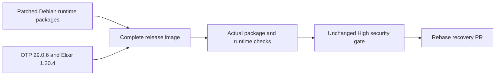

# Change Record: Patch Debian and Erlang runtimes in both images

| Field | Value |
| --- | --- |
| Status | Implemented |
| Type | Security maintenance |
| Primary issue | None; prerequisite issue explicitly waived for this change |
| Pull request | [#709](https://github.com/eirhop/favn/pull/709) |
| Related work | [Recovery PR #708](https://github.com/eirhop/favn/pull/708), to be rebased onto this security branch |
| Affected areas | Control-plane runtime image, generated runner runtime image, image qualification and Grype policy |
| Approved plan commit | `03a6761fb551b5807c67275d7bc103c3bce43588` |
| Last updated | 2026-09-14 |

## One-minute summary

Both image scans fail because the pinned Debian packages and bundled Erlang
predate published security patches. Refresh the Debian runtime snapshot and
Erlang/Elixir patch versions, remove obsolete exceptions, and qualify both images
with the same High severity gate. This is a separate security PR; recovery changes remain
in PR #708 and will be rebased onto the security branch after qualification.

## Impact and evidence

The reproduced runtime scan has 20 unsuppressed High/Critical matches across
18 advisories. Every match has a vendor fix. Earlier exceptions were constrained
to an unfixed vendor state and correctly stopped suppressing these findings when
fixes became available. Increasing suppression would defeat that safeguard.

| Evidence | Result and boundary |
| --- | --- |
| [Failed image workflow](https://github.com/eirhop/favn/actions/runs/34841822261) | Both exact image scans fail the severity threshold; image build/contract stages completed |
| Local runtime-package reproduction with Grype 0.116.0 | Seven Critical and thirteen High matches, all fixable; runtime-only probe, not a full release image |
| Grype database | Built `2026-09-14T06:38:38Z`, schema v6.1.9 |
| Authenticated APT metadata for `20260914T000000Z` | All five fixed source-package families are available in the dated archive |
| Source baseline | Current origin/main `5b8a1124`; no recovery implementation on this branch |

Debian's tracker confirms the fixed versions for
[glibc](https://security-tracker.debian.org/tracker/CVE-2026-5450),
[Perl](https://security-tracker.debian.org/tracker/CVE-2026-13221),
[gzip](https://security-tracker.debian.org/tracker/CVE-2026-41992),
[PCRE2](https://security-tracker.debian.org/tracker/CVE-2026-86145), and
[SQLite](https://security-tracker.debian.org/tracker/CVE-2026-11822).

## Current behavior

Both runtime stages upgrade packages from `20260826T000000Z`. Image digests and
build-stage inputs are also pinned, so a rebuild cannot silently acquire these
new runtime fixes.

## Approved plan

### Scope and invariants

1. Change only the two runtime stages' Debian and Debian-security archive dates
   from `20260826T000000Z` to `20260914T000000Z`. Retain the existing base-image
   digests, build-stage snapshot, toolchain, dependencies, package installation
   list and upgrade mechanism. This fixes shipped runtime packages without
   unrelated build-tool churn.
2. Remove the eighteen package-specific exception rules covering the now-fixed
   glibc, Perl, gzip and SQLite findings. PCRE2's two findings have no exception.
   Retain unrelated reviewed exceptions, their applicability constraints, the
   1 October review deadline, scanning of unfixed findings and the High gate.
3. Add minimum patched package checks to both existing image-contract scripts,
   using `dpkg --compare-versions` so later patched versions remain valid. Each
   standalone image contract checks its actual installed packages; do not add a
   source-text test or a shared helper dependency to the generated runner script.
4. Update the canonical security document with the new snapshot, installed/fixed
   versions and removal of obsolete exceptions. Existing historical source
   evidence for retained exceptions remains explicit; new package/version changes
   must not silently broaden those exceptions.
5. Build and qualify both complete images, scan them with Grype 0.116.0 and current
   vulnerability data, and confirm the High gate passes. If another finding
   emerges, assess its vendor fix first and record/review any material scope
   change. Do not weaken the threshold to obtain a green result.
6. After the separate PR is qualified, rebase `codex/bounded-runner-recovery`
   onto this branch with `--force-with-lease`. Keep #708 targeting `main` while
   qualifying the rebased head: its pull-request CI workflows filter on base
   `main`. Record the checked head and base, then retarget #708 to the security
   branch so the two diffs remain independently reviewable. A post-retarget image
   workflow dispatch, if needed, qualifies the exact branch head without image
   publication; earlier main-base merge-ref checks do not qualify a changed head.
   Preserve the recovery
   approved-plan contents and record its new dependency; do not merge either PR
   or deploy as part of this task.

| Runtime package | Minimum patched version |
| --- | --- |
| libc6 and libc-bin | `2.41-12+deb13u4` |
| perl-base | `5.40.1-6+deb13u1` |
| gzip | `1.13-1+deb13u1` |
| libpcre2-8-0 | `10.46-1~deb13u2` |
| libsqlite3-0 | `3.46.1-7+deb13u2` |

### Implementation map and complexity budget

| Slice | Files | Production added/deleted | Supporting added/deleted |
| --- | --- | ---: | ---: |
| Runtime snapshot refresh | `rel/control_plane/Dockerfile`; `apps/favn/priv/templates/deployment/runner.Dockerfile` | 6-12 / 6-12 | 0 / 0 |
| Remove fixed-finding exceptions | `security/control-plane-grype.yaml` | 0-4 / 72-95 | 0 / 0 |
| Qualification and explanation | Both existing image-contract scripts; `security/README.md` | 0 / 0 | 50-85 / 0-10 |

Exclude this record and recovery's dependency metadata. Count image-contract
scripts as supporting qualification. Explain any material variance per the
repository change-record rules; no new framework or application code is planned.

### Failure, rollout and compatibility

The runtime remains Debian 13 with the same release versions, entrypoints,
non-root UID/GID, capability restrictions, read-only image contracts and external
configuration. Package patch updates require new image builds. Rollback restores
the old vulnerable package set and is not a security remediation. No database
migration, signing, publication or live rollout is included.

## Verification plan

- Confirm archive availability and fixed versions using authenticated APT.
- Validate exception constraints and unchanged deadline with
  `scripts/check_grype_exceptions.sh`; inspect the removed-rule set.
- Run shell syntax checks and meaningful installed-version rejection/acceptance
  checks, including rejection of the old package image and acceptance of patched
  versions. Run the existing control-plane and generated runner image contracts.
- Build both full images using repository CI build arguments. Inspect installed
  versions and scan each image at the existing High threshold, distinguishing
  runtime-only probes from complete image qualification.
- Run owning deployment-artifact tests for generated runner assets and relevant
  CI image/quick checks. No application behavior changes justify the full database
  suite solely for this security patch.
- Verify both diagrams render on GitHub before implementation and final review;
  check links, whitespace, final diff size and independent review against the
  approved baseline.
- After rebasing #708, verify ancestry, its recovery-only PR diff, unchanged
  recovery source/test patches and preserved approved-plan content. Run rebased
  image qualification and relevant PR CI while #708 still targets main; record
  the checked head/base before retargeting. Confirm the final stacked head is
  unchanged, or qualify the changed head explicitly. Any post-retarget image
  dispatch must run on that exact branch head without publication.

## Plan review

Astra (`gpt-6-astra`) at xhigh reasoning effort independently reviewed the plan
and primary evidence on 2026-09-14. The CI-before-retarget sequence was clarified
and rechecked. Verdict: approved, with no remaining actionable findings. This
approval covers the plan; complete-image qualification is still required.

## Implementation outcome

Implementation `380a7364` updates both runtime snapshots and both builder
pins, aligns CI and Compose toolchains, removes 18 obsolete exception rules,
and checks installed packages and executed release runtimes. The reviewed
OTP/Elixir deviation below explains the additional scope. No application code,
application dependency, runtime base digest, scan threshold or remaining
exception constraint changed.

| Slice | Actual production added/deleted | Actual supporting added/deleted |
| --- | ---: | ---: |
| Runtime snapshots and builder/CI toolchain patches | 30 / 32 | 0 / 0 |
| Fixed-finding exceptions | 3 / 83 | 0 / 0 |
| Contracts, Compose builder and canonical explanation | 0 / 0 | 70 / 6 |

Counts compare the final implementation against `5b8a1124` and exclude this
record. All slices fit the original budget plus the independently approved
toolchain extension. Standalone checks require fewer additions than originally
estimated; no replaced execution path or obsolete exception was retained.

## Verification evidence

| Check | Result and boundary |
| --- | --- |
| Baseline scan and authenticated archive metadata | 20 fixable blocking matches; all minimum patched versions available in the selected snapshot |
| Exception guard and shell syntax | Passed; 1 October deadline and High gate unchanged |
| Old runtime package floor rejection | Each of the six installed-version checks rejects its older package in the baseline runtime probe |
| Generated deployment acceptance | Owning deployment-artifact test passed |
| Initial complete image builds and contracts | Both passed at `cf6038e9`; OS-only fix still leaves bundled Erlang findings |
| Patched-toolchain image builds and contracts | Both complete images built at `380a7364`; all local and GitHub image contracts pass, including both control-plane runtime evals and offline runner DuckDB/ADBC checks |
| Initial complete image scans | Both clear all 20 Debian blockers but fail on 11 Erlang High matches; patch deviation independently reviewed |
| Patched-toolchain image scans | [Both exact image scans and direct repository image qualification pass](https://github.com/eirhop/favn/actions/runs/34845338819); both local Grype scans also pass with zero unsuppressed High/Critical matches using database `2026-09-14T06:38:38Z` |
| GitHub diagrams | Original two diagrams and additional reviewed toolchain-flow diagram rendered and visually checked before their respective implementation |
| New-toolchain CI | [Quick, fast, acceptance, slow and Dialyzer pass](https://github.com/eirhop/favn/actions/runs/34845338952); [HTTP boundary passes](https://github.com/eirhop/favn/actions/runs/34845338964); fast-suite busy-time assertion failed at seed `916640` and passed on unchanged rerun; no test change was made |
| Recovery rebase and stacked CI | Coordinated follow-up; its exact checked head/base and preserved recovery plan will be recorded in [PR #708](https://github.com/eirhop/favn/pull/708) after this security branch is finalized |

No image has been published or deployed, and neither PR has been merged.

## Deviations

The user explicitly waived creation of a prerequisite issue. A PR-only record
filename is used; the independent plan and final review process still applies.

### Additional toolchain patch refresh (independently approved)

The complete runner at `cf6038e9` passes its image contract and clears all 20
Debian blocking matches, but exposes 11 High matches for bundled Erlang 29.0.4.
Grype identifies OTP 29.0.6 as fixed; the upstream
[OTP release](https://github.com/erlang/otp/releases/tag/OTP-29.0.6) documents the
ERTS and inets fixes. A runtime-only Debian probe could not reveal these.

The published Hex image matrix has no Elixir 1.20.2 / OTP 29.0.6 image. Use the
verified `hexpm/elixir:1.20.4-erlang-29.0.6-debian-trixie-20260824-slim` index digest
`sha256:3eade7c27e7e3022842799ae0933b69ce29005e556d570c001b18bce93ebd325`.
[Elixir 1.20.4](https://github.com/elixir-lang/elixir/releases/tag/v1.20.4)
also contains a security patch. This keeps the existing major/minor lines and
uses the publisher's maintained image instead of creating a custom OTP build.

Before implementing, independently review this deviation from the original
unchanged-toolchain invariant. Replace the two builder pins, advance their APT
snapshot to `20260824T000000Z` to match the new base, and update toolchain checks
and OCI labels. Align all five CI toolchain pairs and the Compose customer
builder with the same version pair and pinned digest. Preserve historical
benchmark/implementation reports and application dependency versions.

Add a runner contract assertion for the actual bundled ERTS 17.0.6 and Elixir
1.20.4 through release eval, plus matching image label checks. The control-plane
contract already checks recorded build versions; add an actual release eval
assertion there too. Keep the Debian runtime base/snapshot and all remaining
scan rules unchanged. No new suppression is justified.

Additional budget: builder/toolchain production changes 18-30 added / 18-30
deleted across both Dockerfiles and CI; supporting Compose/checks/security docs
20-40 added / 5-12 deleted. Counts exclude this record. Rebuild both complete
images, rerun both contracts and unchanged High scans, and require CI fast,
acceptance and HTTP runtime coverage on the new toolchain before qualification.
Local tests on the old host toolchain are supplementary evidence only.

The final path adds a patched BEAM toolchain to the original package refresh.

Astra at xhigh independently approved this deviation before implementation on
2026-09-14 with no blocking findings. The reviewer verified the publisher digest,
image matrix, complete-image evidence, affected pins, budget and third diagram.
Final approval still requires rebuilt image qualification and CI on the new
patch versions, including Slow and Dialyzer, followed by final-head stack checks.

## Final review

Astra (`gpt-6-astra`) at xhigh independently reviewed implementation `380a7364`
against approved baseline `03a6761f` and the reviewed deviation `e52c263a`.
Verdict on 2026-09-14: approved, no remaining actionable findings. The reviewer
verified both complete local scans, runtime contracts, passing hosted image/HTTP
and CI checks, all three rendered diagrams, line counts and the unchanged
approved plan. Security implementation approval is separate from the coordinated
recovery rebase and final-head audit recorded in PR #708.
