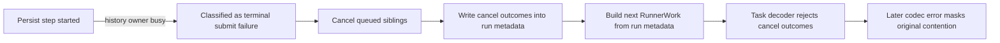
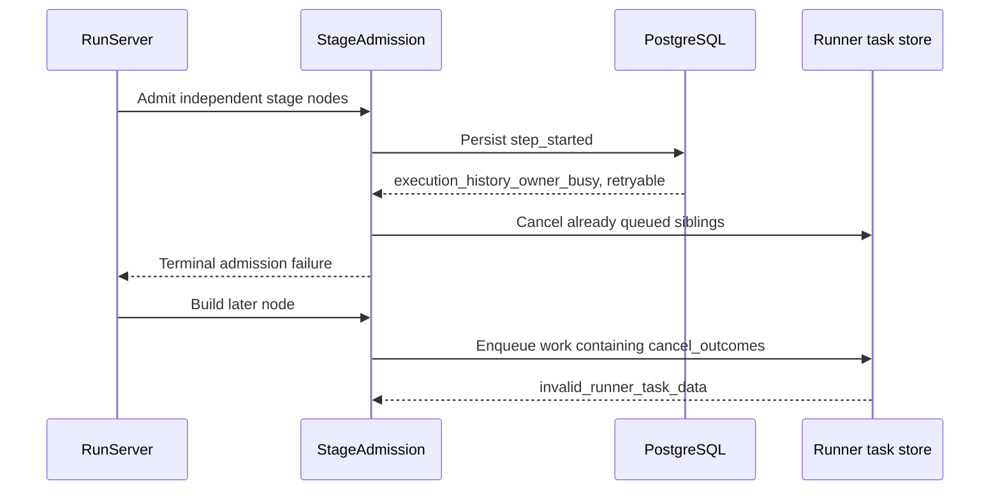

# Change Record: Recover stage admission from transient persistence contention

| Field | Value |
| --- | --- |
| Status | Implemented; final review pending |
| Type | Bug fix |
| Primary issue | None. The maintainer supplied the production-like failure report directly and previously authorized this regression repair without a GitHub issue. |
| Pull request | [#722](https://github.com/eirhop/favn/pull/722) |
| Related work | [#693](https://github.com/eirhop/favn/pull/693), [#716](https://github.com/eirhop/favn/pull/716), and [#717](https://github.com/eirhop/favn/pull/717) |
| Affected areas | Orchestrator stage admission, run-to-runner metadata boundary, PostgreSQL-backed lifecycle integration, and run diagnostics |
| Approved plan commit | `0ecaa5da` |
| Last updated | 2026-09-16 |

## One-minute summary

A backfill can lose healthy work when the run-history row is briefly locked during
stage admission. The store correctly returns a retryable
`execution_history_owner_busy` error, but admission treats it as a terminal
submit failure, cancels already queued siblings, and continues with cancellation
state mixed into the next runner payload. That payload then fails the closed task
decoder on `cancel_outcomes`, masking the contention that started the chain. This
change makes the original run transition retry in place, prevents run-only state
from crossing into runner work, and proves the complete contention-to-recovery
flow through the persisted task boundary.

## Impact

The observed backfill completed ten Landing tasks, cancelled three queued
independent siblings, blocked twenty-five downstream nodes, and then failed the
next Source task as `invalid_runner_task_data`. The successful Landing writes
must be retained and must not be blindly replayed. Without this repair, any
short-lived run-history lock can turn a healthy stage into a failed run and can
hide the original error behind a later serialization failure.

## Problem analysis

Four contracts were composed incorrectly:

1. `persist_run_step/3` returns a structured persistence error with
   `retryable?: true` when the history owner is busy. Stage admission only calls
   an error safe when it is a retryable `%RunnerError{outcome: :safe_failure}`.
2. The fallback terminal branch cancels every task already submitted by the
   current admission batch. This contradicts the independent-sibling contract
   restored by #693 and is especially wrong for a transition that never reached
   the runner.
3. Cancellation outcomes are run-server recovery state. `RunnerWork` is built by
   copying most run metadata, so `cancel_outcomes` enters the closed task codec.
   The codec rejects the unregistered atom key and the later enqueue failure
   becomes the visible run error.
4. Run-ownership renewal takes the same execution-history advisory lock. The
   RunServer treats every renewal error as proof of ownership loss and stops,
   even when the store explicitly says a conflict is retryable and the current
   lease has not expired. A retryable admission pause would therefore remain
   vulnerable to the next ownership heartbeat unless renewal is corrected too.

The test gap followed the same split. PostgreSQL tests proved that the store
labels history contention retryable, #693 tests proved selected terminal node
failures preserve siblings, and #716/#717 tests proved representative task
payloads and results round-trip. No test connected a retryable transition
failure to stage admission, cancellation behavior, the mutated run snapshot,
and the next persisted task.

### Assumptions

- The supplied run is diagnostic evidence only. This PR will not mutate or
  replay that run.
- A rejected `step_started` persistence command has no runner or external data
  effect. Retrying the identical fenced/idempotent transition is safe and does
  not consume an authored asset retry.
- `cancel_outcomes`, active task bookkeeping, retry checkpoints, draining
  markers, and terminal markers are control-plane state; runners do not need
  them to execute an asset.
- Backfill identity and validated operator metadata remain runner-visible because
  existing integrations use them for correlation.

### Evidence

| Evidence | What it proves | What it does not prove |
| --- | --- | --- |
| Read-only query of run `run-bfw:NEyi6JBkpG77phSz69bHPiCPIaDqROs0b5slWxrN` | Ten tasks succeeded, three queued tasks were cancelled, twenty-five nodes were blocked, and the next Source node failed with `invalid_runner_task_data` | The query cannot recreate or independently recover the transient database error after it has cleared |
| The cancelled tasks' durable command receipts and supplied cancellation-hash reconstruction | All three cancellations were issued by Favn; the supplied report attributes their exact reason to `execution_history_owner_busy`; no operator cancellation was recorded | The durable receipt alone does not retain the original transient error term, so that attribution remains supplied-report evidence until the regression reproduces it |
| `StageAdmission.fail_unsubmitted_entry/4` | Only safe runner errors enter the retry branch; other errors reach sibling cancellation | It does not identify which PostgreSQL statement held the competing lock |
| `Persistence.Error` and PostgreSQL runner-task tests | `execution_history_owner_busy` is explicitly `retryable?: true`, and exact commands succeed after lock release | Store-level retryability does not prove the caller honors it |
| `StepAttemptLifecycle.work_metadata/1` and cancellation writers | Run-only `cancel_outcomes` is copied into later work unless explicitly removed | It does not establish a public need for every other run metadata key |
| `RunOwnership.Store.renew_run!/1` and `RunServer.handle_info(:renew_storage_ownership)` | Ownership renewal takes the same history lock, while the RunServer currently stops on every renewal error | It does not prove a lease was lost when a retryable conflict is returned before the known expiry |
| Existing #693, #716, and #717 tests | Each isolated contract was tested | They never composed transient admission failure, cancellation mutation, and the next task round-trip |

## Current behavior

### Current call or event sequence

## Approved plan

When persisting `step_started` encounters a retryable persistence failure, stage admission
will hand the exact transition to the RunServer's existing persistence-retry
loop only when a disposition classifier says replay is safe. Structured
retryable store errors and ambiguous control-write replies may replay the exact
command. Fencing and deterministic invalid or non-retryable conflicts remain
fail-closed and never enter an unbounded retry loop. Before yielding, execution makes ownership explicit: already enqueued
same-batch entries join the active work set, and the current pre-dispatch entry
is tracked as local owned work with its admission lease, materialization claim,
resource permits, and deterministic task ID. The distinction between a durable
task and local pre-dispatch work prevents cancellation from addressing an
unsaved task while still allowing renewal and cleanup. After the identical
write succeeds, replay success is followed by a fresh run-ownership proof. The
same task is enqueued only when that proof succeeds and the original work
deadline is still live, then the batch continues. Exact replay is not ownership
proof because the store can return a committed command replay before validating
the current fence. If the deadline expired while admission was paused, the
entry is terminalized as a safe pre-dispatch timeout and independent siblings
continue; the deadline is never reset and the expired task is never enqueued.
Fenced writes and external cancellation retain fail-closed behavior.

Ownership heartbeats will separately retry only structured retryable failures.
One renewal ID is retained for exact replay, and retries are allowed only while
the locally known lease remains live with a safety margin. Fenced,
non-retryable, or no-longer-provably-live ownership stops the process for
recovery as today; a temporary history lock is not mislabeled as ownership loss.

Runner work construction will explicitly remove control-plane-only lifecycle
state before persistence. Backfill identity, validated operator metadata,
pipeline execution context, and other intended execution metadata remain. A
composed regression will force one history-owner conflict, release it, complete
the stage, enqueue a later node through the real task codec, and prove that no
sibling cancellation occurred.

The pause freezes the complete command and continuation identity: intended run
snapshot and event sequence, event type/time/data, node and attempt, task ID,
work payload, and deadline. A retry token identifies that one continuation.
Every execution-progress message, including `:continue_execution`, retry timers,
runner results, and cancellation, must either defer behind or invalidate that
token. Cancellation removes the token before cleanup, so stale mailbox messages
cannot resume cancelled or superseded pre-dispatch work.

```mermaid
flowchart LR
    A[Persist step started] -->|retryable contention| B[Pause on exact persistence command]
    B --> C[Register durable and pre-dispatch ownership]
    C --> D[Retry transition and ownership heartbeat within live lease]
    D -->|success plus fresh ownership and live deadline| E[Enqueue same task]
    E --> F[Continue independent siblings]
    F --> G[Project execution metadata only]
    G --> H[Persist and read later task]
```

### Contracts and invariants

- A transient control-plane persistence failure never consumes an asset retry.
- The exact transition is retried; no runner work or external write is replayed.
- The transition snapshot, sequence, event time/data, task ID, attempt, work
  payload, and deadline are identical across retries, including a
  commit-succeeded/reply-lost replay.
- Every lease, claim, permit, and durable sibling task owned during a persistence
  pause is visible to renewal, cancellation, cleanup, and recovery code.
- Cancellation during the pause cancels durable tasks, cleans the local
  pre-dispatch entry, and never issues runner cancellation for an unsaved task.
- Invoking runner enqueue ends the known-unsubmitted state. An ambiguous enqueue
  outcome is resolved by authoritative task evidence and is never cleaned as a
  safely absent task.
- A retryable ownership-renewal conflict is retried only while the existing
  lease is provably live; it is never reported as ownership loss by itself.
- Successful command replay is followed by a fresh ownership proof before any
  runner enqueue; replay alone never authorizes work.
- An expired original work deadline produces a safe pre-dispatch node timeout,
  releases local ownership once, preserves independent siblings, and never
  enqueues the expired task.
- Already submitted or queued siblings are never cancelled because a
  `step_started` transition is temporarily contended.
- External cancellation, fencing, and unknown enqueue outcomes retain their
  current fail-closed handling.
- Control-plane bookkeeping never enters `RunnerWork.metadata`.
- Backfill identity and operator metadata continue to round-trip through an
  enqueued and read-back runner task.
- Unknown structs and unregistered atoms at the closed codec boundary remain
  rejected.
- Diagnostics retain the specific persistence reason while retrying; a later
  error cannot overwrite a durable terminal cause because this path does not
  manufacture a terminal failure.
- Completed external writes remain completed and are not automatically replayed.

### Scope

- Add an exact persistence-resume shape for stage attempt-start transitions.
- Add an explicit retry-disposition classifier so only replay-safe control
  writes pause; deterministic invalid and non-retryable failures do not loop.
- Add explicit paused-admission ownership to the active work lifecycle, including
  renewal, cancellation, normal cleanup, and recovery cleanup.
- Add bounded exact ownership-renewal retry for structured retryable failures.
- Route the resumed admission result through both initial-stage and refill
  execution state without duplicating lifecycle semantics.
- Define and test the run-only metadata excluded from runner work, including
  cancellation, active-task, retry, drain, and terminal bookkeeping.
- Add focused, composed, and PostgreSQL-backed regression coverage.
- Verify run header diagnostics fall back from error `type` to error `kind` and
  show the stable reason code.
- Update canonical retry/runtime documentation where the current text does not
  state control-plane transition retry behavior.

### Non-goals

- Repairing or rerunning the supplied failed backfill.
- Retrying runner work with an unknown external outcome.
- Changing authored asset retry policies or SQL admission limits.
- General redesign of run snapshot storage or the complete task codec.

### Implementation slices

| Slice | Outcome | Owner or area | Depends on |
| --- | --- | --- | --- |
| 1 | Attempt-start persistence pauses with explicit durable and pre-dispatch ownership, then resumes without sibling cancellation | `favn_orchestrator` execution and active work set | None |
| 2 | Retryable ownership-heartbeat contention replays the same renewal within the known live lease | `favn_orchestrator` RunServer ownership | None |
| 3 | Run-only lifecycle metadata is excluded from runner work while execution metadata is preserved | `favn_orchestrator` runner-work construction | None |
| 4 | Unit and composed regressions cover pause ownership, cancellation, renewal, contention, later task persistence, unknown-value rejection, and diagnostics | Orchestrator and PostgreSQL tests | 1, 2, 3 |
| 5 | Canonical retry/runtime text describes the recovered transition and proof boundary | Public guides | 1, 2 |

### Runner metadata boundary

`RunnerWork.metadata` is an execution input and correlation surface. It is not
a copy of the mutable run snapshot. Projection happens in `build_work` and
handles both atom and string forms.

| Field family | Disposition | Reason |
| --- | --- | --- |
| `backfill_id`, `backfill_window_id`, `backfill_window_key`, `backfill_execution_group_id`, `backfill_root_run_id`, `operator_metadata` | Retain | Backfill and operator correlation explicitly required by the runner contract |
| Validated authored/submission metadata and execution correlation fields already accepted by `RunnerWork` | Retain | Inputs intentionally supplied to executing work; closed-codec validation still applies |
| `runner_metadata`, `pipeline_context`, `execution_pool_policy`, `connection_circuit_policy` | Remove as today | Stored or derived elsewhere and already excluded from work metadata |
| `active_runner_task_ids`, `cancel_outcomes`, `cancellation_needs_attention`, `cancel_requested`, `cancel_reason`, `cancel_requested_at`, `cancelled` | Remove | Active/cancellation intent and outcome bookkeeping owned by the control plane |
| `retrying`, `next_attempt`, `retry_state`, `next_retry_at` | Remove | Retry checkpoint/timer state owned by the RunServer |
| `pipeline_active_stage_outcome`, `stage_draining_after_failure`, `terminal_event_type` | Remove | Recovery position, drain, and terminal bookkeeping owned by lifecycle persistence |

Focused tests construct real `RunnerWork` through `build_work`, then cross the
actual task encode/store/read/decode path. They prove retained fields survive,
removed families do not enter the payload, and unrelated unknown atoms or
unsupported structs are still rejected by the closed codec.

### Complexity budget

| Slice | Production added | Production deleted | Supporting added | Supporting deleted | Main reason for the size |
| --- | ---: | ---: | ---: | ---: | --- |
| 1 | 130-280 | 15-90 | 0 | 0 | Disposition, frozen resume, fresh ownership/deadline gate, paused ownership, cleanup, and shared result handling |
| 2 | 50-130 | 5-35 | 0 | 0 | Renewal replay state, lease-bound scheduling, and fail-closed branches |
| 3 | 20-70 | 5-30 | 0 | 0 | One explicit metadata projection with atom/string-key handling |
| 4 | 0 | 0 | 400-900 | 0-80 | Deterministic lifecycle fixtures plus coordinated real-lock proof |
| 5 | 5-30 | 0-10 | 0 | 0 | Narrow contract clarification |

A slice outside its range, or total production growth above 550 lines, requires
an explicit deviation and independent re-review.

### Implementation map

| Concept | Expected code area | Responsibility |
| --- | --- | --- |
| Exact transition retry | `run_server/execution/stage_admission.ex`, `run_server/execution.ex` | Retain admission state, retry the persisted event, then continue the same enqueue |
| Paused ownership | `run_server/execution/active_task_set.ex`, `run_server/execution/run_execution_state.ex`, `run_server.ex` | Distinguish durable tasks from local pre-dispatch work and cover renew/cancel/cleanup |
| Ownership renewal retry | `run_server.ex`, `run_ownership.ex` | Replay one renewal only inside the known lease safety window |
| Runner metadata projection | `run_server/execution/step_attempt_lifecycle.ex` | Keep execution inputs and remove run-server bookkeeping |
| Codec boundary | Existing `RunnerTask.PersistenceCodec` and storage task store | Remain closed and prove the projected work survives enqueue/read |
| Diagnostics | Operator read/store tests and operational-event assertions | Preserve specific retry reason and stable displayed code |

## Operational design

### Failures and recovery

The RunServer already retries pending persistence once per configured execution
persistence interval and defers runner messages while the write is pending. The
new path uses that owner instead of creating a separate admission retry policy.
Its replay classifier accepts only replay-safe control-write failures. The exact
command and continuation remain frozen, and all execution progress handlers are
gated by the pending token. A commit-then-error response therefore replays the
same command without a second event or task, while cancellation invalidates the
continuation before cleanup.

The active work set owns every resource during the pause. Cancellation cleans
local pre-dispatch work and cancels only durable tasks. A normal shutdown cleans
the local entry; hard process loss relies on the existing finite database and
admission leases and is recovered fail-closed.

The local entry is known unsubmitted only before runner enqueue is invoked.
Calling enqueue crosses the unknown-outcome boundary: an unacknowledged call is
never released as safe local work because the task may have committed. Existing
authoritative fetch and cancellation handling resolves that ambiguity. An
acknowledged enqueue or existing-task proof promotes the entry to durable work.

Ownership renewal uses its own short retry timer and the same renewal ID. It may
retry a structured retryable error only before a safety deadline derived from
the last confirmed `expires_at`. It stops for fencing, permanent errors, or when
the lease can no longer be proven live. A prolonged storage outage therefore
converges to existing ownership-loss recovery instead of running past expiry.

After a transition succeeds or exactly replays, admission obtains a fresh
ownership proof before runner enqueue. It then compares the frozen work deadline
with the current time. An expired entry follows the safe pre-dispatch terminal
path and releases its lease, claim, and permits once. It does not call the runner
store and does not prevent independent siblings from progressing.

### Logs and diagnostics

| Event or state | Level or surface | Safe fields | Rate limit |
| --- | --- | --- | --- |
| Transition write failure | Existing error telemetry/log | Workspace/run ID, event type, bounded persistence kind and reason code | Once per failed write attempt |
| Execution persistence retry scheduled | Existing warning telemetry/log | Run ID, event type, bounded persistence kind and reason code | Once per scheduled retry |
| Ownership renewal retry scheduled | Warning telemetry/log | Workspace/run ID, fencing generation, remaining bounded lease time, persistence kind and reason code | Once per scheduled retry |
| Ownership no longer provably live | Error telemetry/log | Workspace/run ID, fencing generation, bounded terminal class | Once before stop |
| Terminal run header | Operator run view | Stable error type/kind and bounded message | Read surface |

No payload, parameters, customer data, credentials, or arbitrary exception term
is added to diagnostics.

### Deployment, migration, and compatibility

No schema migration or runner rollout ordering is required. The fix changes
control-plane admission behavior and the contents of newly created runner work.
Rollback restores the prior failure behavior; tasks already persisted by the
new code remain compatible because the task wire contract is unchanged.

## Verification plan

| Acceptance criterion | Planned evidence | Owning layer |
| --- | --- | --- |
| Retryable history contention resumes admission | Deterministic execution test fails `step_started` once with `execution_history_owner_busy`, then succeeds through the RunServer persistence timer | `favn_orchestrator` |
| Independent siblings remain queued/running | Same test asserts no cancellation command and successful sibling completion | `favn_orchestrator` |
| Admission retry does not consume an asset attempt | Assert the same node/task identity and attempt are used after persistence recovery | `favn_orchestrator` |
| Commit succeeded but reply was lost | Store harness commits `step_started`, returns one ambiguous retryable error, and proves exact replay keeps one event, one task, identical sequence/time/data/task/attempt/payload, then requires fresh ownership before enqueue | `favn_orchestrator` |
| Paused work remains owned | Assert same-batch durable tasks and the local pre-dispatch entry are registered, claims renew, and resource ownership is unchanged across retry | `favn_orchestrator` |
| Cancellation during pause is safe | Assert durable siblings receive cancellation, the unsaved task does not, local lease/permit/claim cleanup runs once, and no retry resumes afterward | `favn_orchestrator` |
| Stale progress cannot resume paused work | Deliver sibling result, `:continue_execution`, retry timer, timeout, and cancellation around the pause; assert token gating, cancellation invalidation, and no stale enqueue or duplicate transition | `favn_orchestrator` |
| Work deadline expires before enqueue | Controlled-clock test expires the original deadline during the pause; assert no enqueue, one local cleanup, safe node timeout, and continued independent sibling progress | `favn_orchestrator` |
| Enqueue reply is lost after commit | Runner-task harness commits enqueue then returns an ambiguous error; assert the entry is no longer treated as safely unsubmitted, authoritative lookup finds it, and cleanup preserves unknown-outcome safeguards | `favn_orchestrator` and task store |
| Ownership heartbeat tolerates the same lock | Hold the history lock across one attempt-start failure and heartbeat; assert exact renewal retry, unchanged owner/fence, then successful recovery after release | Orchestrator plus PostgreSQL |
| Lease expiry remains fail-closed | Controlled-clock/unit test keeps renewal failing past the safety deadline and asserts ownership-loss stop/recovery | `favn_orchestrator` |
| Cancellation state cannot poison later tasks | Actual `build_work` projection includes every removed family in atom and string form, then encodes/stores/reads/decodes the task | `favn_orchestrator` and PostgreSQL task store |
| Backfill execution metadata remains available | Composed work fixture preserves all six backfill/operator fields through enqueue and read-back | PostgreSQL runner-task store |
| Complete backfill-like stage recovers | Sandboxed storage integration gates initial admission before any task is durable and refill after one sibling is durable, observes transition and renewal contention on the real advisory lock, releases it, and proves both paths finish; a cancellation case keeps the durable sibling tracked until its persisted cancellation arrives | `favn_storage_postgres` integration |
| Unknown values remain rejected | Existing and focused codec tests for an unknown atom and unsupported struct | `favn_core` |
| Diagnostics remain specific | Operational-event and run-header tests assert `execution_history_owner_busy`/`conflict`, with kind fallback when type is absent | Orchestrator/PostgreSQL operator read |
| No wider regression | Format, warnings-as-errors, affected app suites, tag guard, and pull-request CI | Umbrella |

The supplied run is verified read-only. A fresh local backfill may be used as
additional live proof, but automated tests remain the acceptance evidence.

## Risks and open questions

| Risk or question | Impact | Mitigation or decision needed |
| --- | --- | --- |
| Retaining an admission lease while persistence is unavailable | Capacity can be held during an outage | Ownership is explicit, renewable, cancellable, and bounded by the run timeout and ownership-lease safety deadline |
| Metadata projection removes a field a runner actually needs | Runtime behavior could lose context | Preserve documented backfill/operator/pipeline execution fields and test real `RunnerWork` consumers; remove only lifecycle state with an orchestrator owner |
| A real lock test is timing-sensitive | Flaky regression proof | Coordinate on an explicit PostgreSQL lock holder and waiter observation, never sleeps alone |
| Hard process loss during the local pre-dispatch pause | In-memory cleanup cannot run | Existing finite admission/materialization/operation-lock leases bound the leak; recovery never assumes an unsaved runner task exists; add normal-stop cleanup and record the hard-kill proof boundary |
| Existing retry-resume deadline/recovery limitations from #693 | A crash or stale deadline could affect a different retry path | The new pause freezes the original deadline, has an explicit post-replay expiry outcome before any await timer exists, gates every progress message, and records unrelated retry-state limitations honestly |

## Plan review

| Field | Result |
| --- | --- |
| Reviewer | Independent Astra agent, xhigh reasoning |
| Reviewed against | Supplied report, durable run evidence, current source/tests, #693/#716/#717 records, and this plan |
| Findings | Initial review found missing paused-work ownership, heartbeat contention, post-replay ownership/deadline gates, stale-message cancellation guards, ambiguous enqueue handling, and an incomplete metadata boundary. |
| Findings addressed and rechecked | The plan now specifies frozen exact replay, first-class local/durable ownership, bounded renewal, fresh ownership and original-deadline gates, retry-token invalidation, authoritative ambiguous-enqueue handling, and every current run-only metadata family. Reviewer rechecked the complete revision. |
| Verdict | Approved for implementation with no remaining findings. Reviewed against source `8d2b8e1f`; document SHA-256 `6ad5ab77504243cc59c3a295732ff146e434975df040bc68db639d493c343cb9`. |

After review, address findings and commit the approved plan. Record that commit
ID in the immediate PR-number update. From that point, keep the approved plan
stable.

---

The sections below are completed during implementation and before final review.

## Implementation outcome

Stage admission now pauses on a replay-safe persistence failure before runner
enqueue, retains the exact command and local ownership, and resumes only after
the command succeeds and run ownership is freshly renewed. The original work
deadline remains authoritative. Cancellation, ownership loss, or deadline
expiry cleans the known-unsubmitted entry without sending a runner cancellation
for a task that was never saved. Already durable siblings remain owned and are
not cancelled by temporary history contention.

Ownership renewal now replays one exact renewal ID for structured retryable
store errors while the last confirmed lease remains live with a one-second
safety margin. It remains fail-closed for fencing, permanent errors, and leases
that are too close to expiry. Execution progress is deferred while either the
attempt-start command or its post-write ownership proof is pending.

Runner work metadata now removes the complete known control-plane lifecycle
families in both atom and string form. Backfill identity and operator metadata
remain present. The PostgreSQL regression creates actual backfill work, persists
and reads its first runner task, and proves cancellation outcomes do not cross
the codec boundary.

### Actual scope and complexity

| Area | Added | Deleted | Net |
| --- | ---: | ---: | ---: |
| Production Elixir | 625 | 40 | 585 |
| Tests | 1,003 | 16 | 987 |
| Canonical documentation | 11 | 0 | 11 |
| This implementation record | 510 | 0 | 510 |
| **Total PR** | **2,149** | **56** | **2,093** |

The executable production change is 665 changed lines. Most of the PR is proof:
1,003 test additions and this required 510-line implementation record. The
implementation changes five orchestrator production modules, four existing test
modules, and the canonical orchestrator structure document. It adds no migration,
dependency, wire-format registration, public DSL, or runner release requirement.

## Deviations from the approved plan

- Production additions are 625 lines, 75 above the plan's 550-line re-review
  threshold. The increase implements issues found by the first final review:
  heartbeat coalescing, cancellation ownership for saved same-batch siblings,
  cleanup against the newest durable run snapshot, and normal-stop recovery
  cleanup. These are all in the reported admission/ownership/cancellation chain.
  The final independent review must explicitly accept this variance.
- Supporting test growth is 1,003 lines, 102 above the planned upper range. The
  increase replaces the earlier layered proof with one sandboxed PostgreSQL
  integration that observes the real advisory-lock error in both attempt-start
  and ownership renewal, proves initial and refill recovery, proves a committed
  transition with a lost reply replays as one durable event, and proves a saved
  sibling remains tracked through durable cancellation. Per-run and per-task
  gates avoid global attempt ordering, and the SQL sandbox rolls every row back.
- A deterministic non-replayable rejection after a previously retryable
  attempt-start failure now stops for recovery. The first implementation
  manufactured a `step_failed` event from the uncertain transition state; final
  review rejected that as an impossible event sequence. Recovery is the smaller
  fail-closed outcome and writes no false terminal event; it does not newly
  persist the attempted command for diagnosis.
- The existing run header already falls back from error `type` to `kind`, so no
  diagnostic source change was needed. The specific persistence reason remains
  available in retry telemetry and is not replaced by a manufactured terminal
  enqueue failure.

## Decision log

- Reuse `PersistenceRetry` for exact `step_started` replay rather than adding a
  second retry scheduler.
- Represent pre-dispatch admission as explicit paused state beside the durable
  active-task set. A local entry is never treated as a saved runner task.
- Require a fresh ownership renewal after exact command success because command
  receipt replay alone does not prove the current fence.
- Bound renewal retries by the last confirmed lease and preserve one renewal ID
  across retries.
- Project runner metadata from mutable run metadata at work construction rather
  than registering control-plane keys in the closed codec.
- Preserve existing authoritative resolution for ambiguous enqueue outcomes and
  existing unknown-outcome protections for completed external writes.

## Verification evidence

| Check | Result | Evidence boundary |
| --- | --- | --- |
| Format and compile | Passed: `mix format`; test compile with warnings as errors | Static/build qualification |
| Focused orchestrator tests | Passed: 50 tests | Deterministic state-machine, retry, cancellation, ownership, deadline, and metadata qualification |
| Full fast orchestrator suite | Passed: 889 tests, including 6 doctests; 2 excluded | Orchestrator regression qualification |
| PostgreSQL real lifecycle regression | Passed: 1 composed test; 154 excluded | Observed `execution_history_owner_busy` for attempt-start and ownership renewal, initial/refill recovery, durable reply-loss replay, and cancellation drain |
| PostgreSQL backfill task regressions | Passed: 2 focused integration tests; 153 excluded | Actual backfill enqueue/read/Landing-style result persistence for asset and pipeline submissions |
| SQL sandbox cleanup | Passed: zero persisted runs and runner tasks after the composed test | The real-lock proof does not leak global runner demand or tasks into neighboring tests |
| Closed codec safeguards | Passed: 26 focused tests | Unknown atoms and unsupported structs remain rejected |
| Umbrella fast suite | Attempted; owning suites passed, repository run had unrelated environment/timing failures described below | Repository-wide run did not provide a clean final signal |
| Test tier guard | Passed | Tagged tests remain assigned to CI-covered tiers |
| Diff checks | Passed: `git diff --check` | Whitespace only |

### Not verified

- The supplied failed run was inspected read-only and was not mutated or replayed.
- No fresh external Landing backfill was executed against a deployed service.
- One pre-existing delayed-insert PostgreSQL test remains timing-sensitive when
  selected alone under the shared SQL sandbox; it failed by exhausting its owned
  sandbox connection while its trigger held that same connection. The new
  composed test passes independently and leaves zero durable rows. This existing
  test behavior is not used as evidence for this fix.
- The repository-wide fast command was also run without the PostgreSQL environment and therefore failed the PostgreSQL app at setup. With the disposable database configured, the full PostgreSQL app reached 451 passing tests but its bootstrap privilege tests required a bootstrap role rather than the migrator role used for focused storage tests; one unrelated 100 ms timing test and one globally owned runtime test also failed under full-app concurrency. The affected PostgreSQL regressions pass in isolation.
- Pull-request CI and final review of the corrected head remain pending.

## Final review

| Field | Result |
| --- | --- |
| Reviewer | Independent Astra agent, xhigh reasoning |
| Compared | Approved plan, implementation, tests, diagnostics, and docs |
| Deviations complete | Pending |
| Findings | Pending |
| Findings addressed and rechecked | Pending |
| Verdict | Pending |
