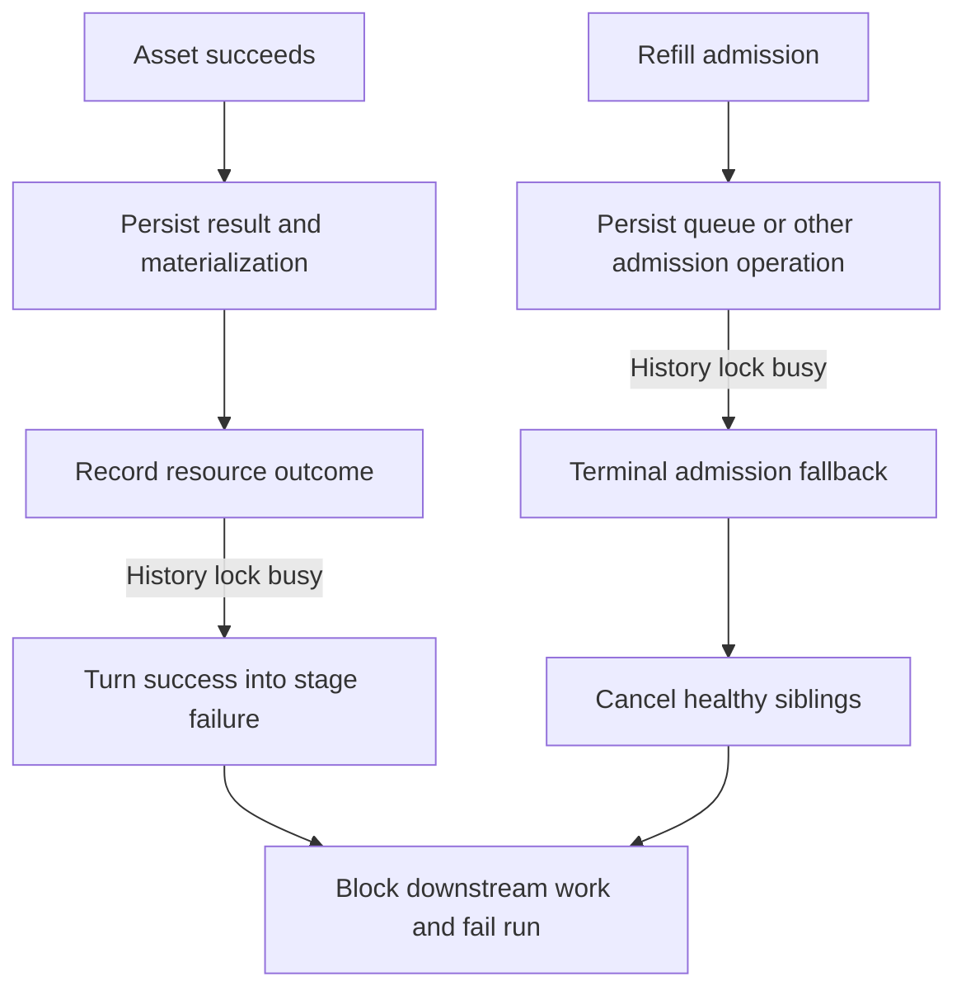
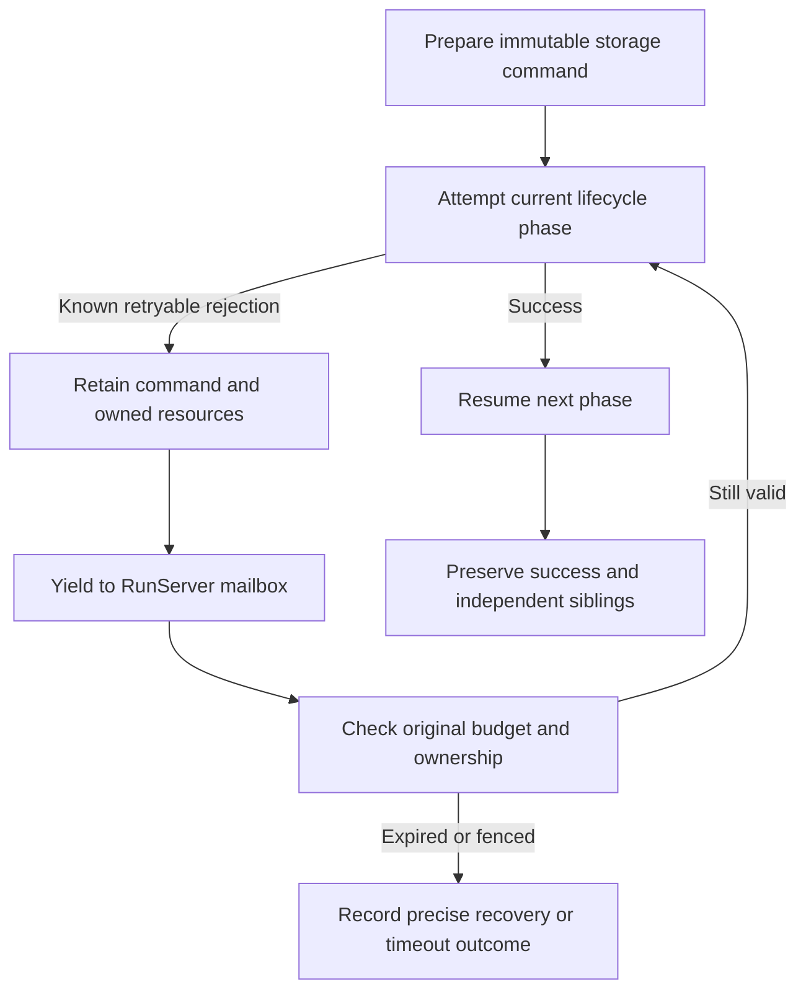

# Change Record: Recover history contention across the run lifecycle

| Field | Value |
| --- | --- |
| Status | Implemented |
| Type | Bug fix |
| Primary issue | None; the maintainer supplied the incident and authorized this repair without a separate issue. |
| Pull request | [#725](https://github.com/eirhop/favn/pull/725) |
| Related work | [#711](https://github.com/eirhop/favn/pull/711), [#716](https://github.com/eirhop/favn/pull/716), [#717](https://github.com/eirhop/favn/pull/717), [#722](https://github.com/eirhop/favn/pull/722) |
| Affected areas | PostgreSQL history protection; orchestrator admission, settlement, retry, cancellation and error projection |
| Approved plan commit | `7967ac33` |
| Last updated | 2026-09-17 |

## One-minute summary

A completed asset can be marked failed because its separate resource bookkeeping
encounters a temporary database lock. Admission can encounter the same lock while
recording a queue event, then cancel healthy siblings. The previous repair only
retained retry continuations for attempt-start events and ownership renewal.
This repair audits the entire lock contract, preserves the exact pending storage
operation at each execution boundary, and proves completion and admission
contention in one pipeline with downstream work.

## Impact and evidence

The supplied incident reports 28 successful runner tasks, a persisted Landing
materialization with no resource outcome, four healthy queued tasks cancelled by
an admission error, and 21 blocked descendants. The exact admission operation
is unknown in the supplied evidence; queue persistence is a verified vulnerable
path, not an asserted reconstruction of the incident.

| Evidence | Finding | Limit |
| --- | --- | --- |
| `StageResult.finish_persisted_step/1` and `complete_post_step/3` | A resource-outcome write failure becomes `post_step_persistence_failed` even after durable success. | Source proves vulnerability, not the original competing transaction. |
| `StageAdmission.persist_or_defer_queued_entry/1` | A queue-event error becomes a terminal admission error without retaining the event or continuation. | The incident does not identify its precise admission sub-operation. |
| `Execution.terminalize_stage_admission_failure/4` and `StageAdmission.terminalize_unsubmitted_entry/3` | Fallback paths cancel independent submitted work. | Cancellation remains necessary for explicit cancellation or authoritative loss of execution permission. |
| `History.guard!/2` and `RunIdentity.lock!/2` | Ordinary writers share an exclusive lock keyed by history root with retention and root-run identity. | Some cancellation paths deliberately serialize on their cancellation owner; those locks must remain. |
| #722 PostgreSQL lifecycle test | Gates `step_started` and renewal; releases contention before completion; separately tests operator cancellation. | Does not contend resource outcomes, queue events, or combined completion/refill boundaries. |
| #722 plan and independent review | The approved scope named attempt-start replay and renewal. | Broad claims of full lifecycle coverage were not supported by that scope. |

### Why previous tests and review missed this

The tests followed the repaired call sites. They proved real PostgreSQL errors
but did not vary the persistence phase at which the error occurred. Successful
completion after releasing an attempt-start lock does not test a lock acquired
after completion. Review challenged races within the selected continuation,
but did not enumerate every caller of the shared history guard. This record
requires that inventory and ties the new test to final persisted outcomes rather
than only the selected retry message.

### Assumptions

- Existing failed runs are diagnostic evidence; this PR does not replay them.
- A transaction explicitly rolled back with `execution_history_owner_busy`
  committed no part of that transaction. Earlier separate transactions may
  already have committed and must not be repeated as an asset execution.
- Successful runner outcomes are authoritative even while bookkeeping is pending.
- Unknown external outcomes retain existing fail-closed recovery behavior.

## Current behavior

## Approved plan

Use the existing RunServer persistence-retry scheduler for a closed set of
immutable storage operations. Retain the prepared command and the owning
lifecycle phase. On success, resume after that phase; do not rerun the callback,
whole admission batch, or previously completed bookkeeping. Keep the GenServer
responsive to ownership renewal and real cancellation while waiting.

Separate live-history protection from per-run serialization: ordinary writers
take a shared advisory history lock in a distinct namespace; retention takes an
exclusive lock in that namespace. Keep existing exclusive run/cancellation
identity locks. This removes accidental contention between independent history
writers while still returning a retryable error when retirement owns the guard.

### Contracts and invariants

- Commands retain IDs, payloads, event sequence/time, ownership generation and
  original work/admission deadlines across retries.
- Retry only the known-safe database operation. Asset attempts and external
  writes are never replayed by this mechanism.
- A settled step waiting for resource bookkeeping keeps its successful result.
- A partially admitted batch retains saved tasks, pre-dispatch leases/claims,
  circuit permits and registered waiters before yielding.
- Claim preparation may already own a target-operation lock before a durable
  claim exists. A paused claim retains and renews that exact lock; it does not
  use the old helper that releases the lock on every rejected claim call.
- A committed blocked/fresh decision advances the retained run snapshot before
  any recovery-candidate write. Retrying that second operation never restores
  the pre-event sequence or appends the decision twice.
- Success of a command receipt does not establish current ownership. Admission
  resume uses the existing fresh ownership gate before dispatch and checks the
  unchanged deadline. Exhaustion stops or drains safely with a specific reason.
- A node or persistence error is not a cancellation request. Healthy siblings
  continue unless cancellation, timeout, fencing or uncertain dispatch makes
  stopping that specific work necessary.
- Genuine cancellation invalidates admission retry tokens before cleaning known
  unsubmitted work. Ambiguous enqueue requires authoritative task reconciliation.
  Already-completed bookkeeping is retained and drained under cancellation, or
  explicitly recorded incomplete when its original budget expires. It cannot
  cancel/reclassify the completed task, fail its completed claim, or discard its
  successful result. Normal stop and crashes preserve unknown-outcome rules.
- Do not add a second retry scheduler, generic closures, process-dictionary state,
  synchronous retry sleeps, a new task codec registration, or a schema migration.

### Lifecycle inventory and intended handling

The final record will give exact functions and tested results for every family.
This inventory distinguishes a history guard from unrelated persistence errors.

| Guarded operation family | Owner and required retry/recovery behavior |
| --- | --- |
| Run ownership claim/renew/release | Claim can be retried by durable RunManager recovery; renew preserves one renewal ID within known lease; release must not manufacture asset failure. Verify these boundaries. |
| Run creation/start, step start/outcome, queue, blocked/fresh decisions, stage drain/retry and terminal events | Freeze exact event transition. Add missing queue/classification/sequential-start continuations to the existing event retry mechanism. Run creation's skipped busy identity error must carry a specific reason code too. |
| Execution admission | Freeze admission command; retain the original work and waiter/lease identity; continue capacity handling after success. |
| Materialization claim acquisition | Freeze claim command and operation-lock context; retain/release exact pre-dispatch ownership; resume claim classification after success. |
| Materialization completion/failure and execution checkpoints | These do not call the history guard directly. Audit their idempotency and adjacent failures; do not claim they emit this error or replay them as part of resource-outcome retry. |
| Resource outcome and recovery candidate | Freeze command after success; retry only the missing write, including the async post-step path and blocked-decision partial success. |
| Runner enqueue | Preserve deterministic task/command/payload and deadlines; retry known rolled-back history conflict; retain authoritative reconciliation for ambiguous enqueue. |
| Runner claim/start/renew/complete/cancel/logs/input resolution | Inventory store guards and protocol retry behavior. Preserve exact assignment/command IDs and unknown completion safeguards; fix any uncovered terminalization of this specific retryable conflict. |
| Submission, backfill, scheduler, rebuild and resource-recovery workers | Inventory outer polling/claim/recovery semantics. Retain durable intent on transient failure; distinguish intentional skipped busy candidates from terminal failure. |
| Operator cancellation, logs and retention | Keep idempotent operator retries, bounded log handling and retirement protection; document any diagnostic-only write loss. |

### Scope and complexity budget

The scope is history contention and its lifecycle consequences. No external
connector changes, data replay, public DSL change, general scheduler rewrite,
or unrelated cleanup belongs here. The expanded budget is driven by named
persisted phases missed by #722, not a new orchestration framework.

| Slice | Production added | Production deleted | Supporting added | Supporting deleted |
| --- | ---: | ---: | ---: | ---: |
| Shared history guard and lock-contract tests | 25-75 | 10-40 | 80-160 | 10-40 |
| Frozen persistence operations and admission/classification continuations | 300-500 | 150-300 | 220-400 | 40-120 |
| Completion bookkeeping, sibling preservation and diagnostics | 150-300 | 80-180 | 180-300 | 20-80 |
| Composed PostgreSQL lifecycle and recovery tests | 0-30 | 0-15 | 300-550 | 40-120 |

Supporting lines include tests, fixtures and canonical documentation; the record
itself is excluded. Explain any variance exceeding 25 percent or 100 lines,
whichever is smaller; obtain independent review of behavior that expands scope.

## Operational design

Retry diagnostics must retain the original structured reason, named operation,
asset/node/step, retry attempt, elapsed time, original budget, and exhaustion
disposition. Bounded redaction applies; command payloads and credentials are not
logged. Error projection rejects blank or literal `nil`/`null` code candidates
and falls back to the actual reason code/kind.

RunServer timer retries remain nonblocking. Pre-dispatch retries cannot extend
work or stage deadlines. A pending command has a 30-second control retry budget
starting at its first rejected attempt, further bounded by the original work or
admission deadline when dispatch has not happened. Ownership must remain live.
The first error and monotonic start time survive every timer and ownership gate.

When resource bookkeeping exhausts that budget, keep the successful node result
and materialization. Record an explicit `persistence_retry_exhausted` run error
with `operation`, node/step identity, original reason code, attempt count and
elapsed budget through the existing durable failure-drain/terminal transition.
Already admitted siblings finish normally; their writes are not cancelled.
The run is failed for incomplete control-plane bookkeeping, without changing
the successful asset's outcome. If persistence remains unavailable, the existing
terminal-event retry path retains that diagnostic until it can be stored.
Admission exhaustion may fail only the unsubmitted node when authoritative
evidence proves the operation never committed; ambiguous commit state stops for
recovery instead of inventing a second conflicting event.

These continuations are process-owned. On crash or ownership loss, existing
`outcome_recorded` recovery remains fail-closed and can terminate with
`uncertain_runner_recovery`; this repair does not add automatic completion of
every interrupted bookkeeping phase. Durable successful runner outcomes and
materializations remain available, and asset callbacks are never rerun. Test
that boundary and state the remaining operator-recovery limitation explicitly.

The advisory namespace change requires a coordinated control-plane restart:
stop old workers and maintenance before new workers/maintenance start. Mixed
old/new history-lock protocols are unsupported. No data reset or schema change
is required. The deployment notes must make that constraint explicit.

## Verification plan

1. Reproduce the completion-plus-admission regression against unmodified main.
2. Use a real PostgreSQL pipeline with materializations, execution-pool outcomes,
   independent siblings, a capacity queue and downstream dependencies. Acquire
   history locks on separate connections at completion outcome recording and
   subsequent refill/queue persistence. Observe the actual structured rejection,
   retain the command, release the lock and let the same pipeline finish.
3. Assert all nodes/tasks succeed, expected outcome/materialization rows exist,
   no cancellation receipts or blocked descendants exist, external callback/write
   counters are exactly one, and leases/claims/waiters are settled.
4. Parameterize owning-layer phase tests across every resumable operation;
   include committed-response loss, cancellation while paused, duplicate timers,
   original deadline exhaustion, fencing and deterministic rejection.
5. Prove shared live guards coexist and exclusive retirement still excludes new
   writes. Keep retention and cancellation race tests intact.
6. Verify resource completion after async reconciliation, cancellation during
   resource-outcome retry, and preservation of completed results/claims in both
   cases. Verify precise operator error projection.
7. Run focused owning suites first, then relevant umbrella CI, acceptance, slow,
   type checks and images. Independent Astra xhigh review compares this baseline,
   operation inventory, tests and final code. Report deployment proof separately.

## Plan review

Independent Astra xhigh review approved this plan on 2026-09-17 with no remaining
blocking findings. The reviewer independently enumerated the history-guard
callers and challenged retry exhaustion, crash recovery, ownership of locks
before claim creation, sequence retention after a committed blocked decision,
and cancellation during already-completed bookkeeping. Those corrections are
part of this approved baseline. The reviewer accepted the shared lock namespace,
coordinated restart constraint and closed operation union; implementation and
the composed PostgreSQL proof require a separate final review.

## Implementation outcome

### Implemented behavior

The history guard now takes a shared lock in a separate namespace, while
retirement retains exclusive ownership. Multi-run writers acquire cancellation
owners before children. The log writer still accepts pre-creation diagnostic
identities; it revalidates their owner under the identity lock and rolls back if
creation changed the owner while the writer waited.

The existing `PersistenceRetry` carries a closed union of prepared commands,
original cause, first rejection time, attempts, and ambiguity. Admission retains
capacity/claim/queue/decision/enqueue phases; classification retains its remaining
nodes; sequential dispatch retains claim/start/enqueue phases. Completion retains
only resource bookkeeping after the successful result/materialization. No asset
callback, connector, schema, task codec, or runner protocol was added or changed.

Successful replay adopts acquired resources before the ownership-renewal gate.
Every new node clears per-node ownership scratch state. Every admission exit
retains already-saved same-batch tasks; uncertain enqueue retains a complete
stage entry and consumes its durable outcome before claim cleanup. A cancellation
reply saying the task already completed is not evidence that its write failed.
New stages reset admission budgets; retries within the same stage retain them.
Waiter registration has one immediate, separately frozen capacity recheck.

### Completed guard inventory

Paths below are relative to the owning application's `lib` directory. This is
an inventory of the specific history-conflict lifecycle, not a guarantee that
all unrelated storage errors have the same recovery semantics.

| Operation and source | Conflict/recovery disposition | Evidence |
| --- | --- | --- |
| `favn_storage_postgres/run_identity.ex:lock!/2, try_lock!/2`; `maintenance/history.ex:guard!/2, try_guard!/2` | Shared root guard plus exclusive per-run authority. Try-lock callers skip busy candidates; retirement still excludes all writers. | Real shared/exclusive PostgreSQL test; existing retention and claim tests. |
| `run_ownership/store.ex:claim_run, renew_run, release_run, claim_recovery_batch` | Existing recovery polling and bounded exact-ID renewal. No new asset execution is authorized by a successful old receipt. | Existing real history-conflict renewal/fencing tests and RunServer gate tests. |
| `runs/store.ex:create_run, commit_transition, request_cancellation` | Creation returns the explicit retryable reason to submission reconciliation. Execution events retain the exact intended transition; cancellation remains authoritative and idempotent. Terminal persistence retains its separate existing retry path. | Composed queue test; attempt-start, replay-loss, cancellation and error-projection tests. |
| `admission/store.ex:admit` through cancellation ownership | Frozen admit and registration-recheck commands. Saved leases/waiters are tracked before renewal; known rejected unsubmitted work is cleaned on exhaustion. | Admission gate-held cancellation and same-batch cancellation/exhaustion tests. |
| `materialization/store.ex:claim` through cancellation ownership | Frozen claim; retain target-operation lock and newly acquired claim. Completed materialization/claim finish and execution checkpoints do not directly call the history guard and are not replayed as resource bookkeeping. | Claim gate-held cancellation and same-batch cleanup tests; composed persisted materializations. |
| `resource_circuits/store.ex:record_outcomes, record_recovery_candidate` | Exact prepared command, with successful result and advanced event sequence retained. Async post-step reconciliation runs only once. Exhaustion fails bookkeeping, preserving asset success. | Composed resource conflict; async recovery/exhaustion tests. |
| `resource_circuits/store.ex:claim_recovery, complete_recovery` | `ResourceRecovery` returns `:retry`; durable candidates and periodic sweep retain work. Root-first locking avoids inversion against admission/cancellation. | Existing resource recovery suite and real recovery-finalization lock-order test. |
| `runner_tasks/store.ex` enqueue and guarded assignment/start/renew/complete/cancel/log/input mutations | Enqueue retries only a known history rejection. Ambiguous enqueue reconciles saved identity or stops for recovery. Protocol errors retain retryability; claim skips a busy owner instead of wedging the queue. | Existing runner task suite; sequential committed-reply-loss completion/cancellation; sibling-drain and composed completion tests. |
| `run_submissions/store.ex` enqueue/claim/transition and `RunSubmission.Processor` | Claims skip busy identities; processor reconciles the deterministic run/submission identity and uses its bounded retry policy. Unknown admission remains recovery work. | Existing submission and core authority tests; source audit of `reconcile_run` and `retry_or_fail`. |
| `scheduler/store.ex` dispatch and `Scheduler.PersistenceRuntime` | Retryable dispatch errors preserve the occurrence; later poll reconciles it. | Existing scheduler authority tests and `preserve_occurrence_on_dispatch_error?/2`. |
| `backfills/store.ex` window claim/transition and `BackfillDispatcher` | Busy claims retain durable windows; dispatcher preserves retryable submission failures and reconciles reserved identities. | Existing backfill authority tests and source audit. |
| `rebuilds/store.ex:transition_item, transition_action` | Guarded child transitions return errors to the worker; durable item/operation leases allow poll/reclaim. A new child submission is reserved before run creation. | Existing rebuild authority tests and source trace through `process_items`/`RebuildExecutionWorker`. No dispatcher rewrite. |
| `logs/store.ex:append_batch`; runner log/input writes | Canonical owner-before-child ordering. Diagnostic append returns a retryable error to its caller; best-effort log callers can drop diagnostics, without changing asset outcome. | Real log-batch lock-order test and missing-run diagnostic test; runner log tests. |
| `maintenance/history.ex`, submission retention and operation cancellation | Exclusive retirement and retained references remain mandatory. Operator mutations retain their existing command receipts and cancellation authority. | Existing retention/cancellation suites plus shared-writer exclusion tests. |

### Verification evidence

- The composed real PostgreSQL pipeline injects exclusive history contention at
  resource outcomes and subsequent queue persistence, observes the specific
  rejection, verifies exact command replay, and completes five nodes including
  descendants. It checks five materializations/outcomes, successful tasks and no
  remaining claims/leases or unintended cancellation metadata. It also checks a
  later stage receives a fresh admission budget.
- The fixture completes durable runner tasks with Landing-style metadata. This
  proves the orchestrator/storage composition; it does not execute a deployed
  connector or validate external Landing writes in the reported environment.
- Three real concurrent lock-order tests wait for the writer in `pg_locks`, then
  prove its child remains lockable while its cancellation root is held. They
  cover log batches, resource outcomes and resource-recovery completion.
- Focused tests cover successful-replay cancellation, same-batch pre-dispatch
  ownership, immutable claim/event commands, completed-bookkeeping recovery and
  exhaustion, sequential committed-enqueue reply loss, structured error fallback,
  and cancellation deferral while completed bookkeeping remains pending.
- PostgreSQL core authority, concurrency authority and resource circuits passed
  together: **195 tests** before the final unknown-enqueue ownership correction.
  The subsequent complete PostgreSQL fast suite passed **479 tests** on a fresh
  disposable database. The final domain-wait regression file passed **15 tests**,
  including actual target-write contention after a history rejection in both
  sequential and pipeline modes.
- The umbrella fast run passed all other applications except one 100ms-sensitive
  manifest-slot test; that unchanged file passed all five tests on rerun. Earlier
  session-history failures were caused by accumulated disposable database data
  exceeding the fixture's 200-row page and global reconciliation count; a fresh
  test database passed the complete storage suite. No session behavior changed.
- Astra xhigh independently passed **76 focused tests** and approved the final
  source correction, accepting the documented scope increase and deviations.
  Initial and replayed writer contention now follow domain waiting rather than
  the history retry budget. The added real PostgreSQL test needed a complete
  physical-relation pin in its fixture; it passed after that fixture correction.
- The final local orchestrator fast suite passed **907 tests**. CI fast,
  acceptance, quick/security, image and HTTP qualification passed on `cb4c5b6f`.
  Dialyzer then identified six unreachable patterns left by the new result
  shapes. The obsolete four-element admission error form and classifier/fallback
  clauses were removed without suppressing warnings. Review also retained the
  full uncertain-task cleanup entry in the already-terminal cancellation branch;
  an injected cancellation regression checks both task awaits remain installed.
  All **161 RunServer tests** passed after this cleanup. Final pushed-head CI is
  the merge-readiness gate; its live results are attached to the PR.

### Deviations and scope accounting

1. The first valid red composed test used the new lock namespace with the old
   completion behavior still present. It proved terminalization at the rejected
   resource write, but was not a run against wholly unmodified main. This is
   narrower evidence than verification-plan item 1; no contrary claim is made.
2. Shared guards exposed existing root/child lock-order inversions previously
   masked by the exclusive guard's early rejection. Logs, outcome recording and
   recovery finalization now use one canonical ordering. Missing-run diagnostics
   preserve their old contract, with owner revalidation for concurrent creation.
3. Independent review found additional same-batch ownership and uncertain-enqueue
   cleanup paths that had relied on blanket sibling cancellation. Preserving
   siblings required retaining all saved entries and draining already-completed
   outcomes before claim cleanup; the fix includes these paths and tests.
4. Production additions exceeded the reviewed 525–905-line estimate: the current
   formatted diff is approximately **1,520 added / 530 removed production lines**,
   plus approximately **1,400 added / 60 removed test lines** (final counts follow
   qualification). The added phases, acquired-result adoption, bounded recheck,
   sequential reconciliation, and cancellation-safe tracking account for the
   overrun. This is one existing retry scheduler and a closed command union,
   not a replacement scheduler or new persistence framework. Astra must review
   the overrun and final behavior against the approved baseline.
   The wider suite also exposed a domain distinction: target-write contention
   must retain its existing durable admission timer, even when preceded by a
   history conflict. Both initial and replayed sequential claim replies now
   preserve that path in sequential and pipeline modes; PostgreSQL tests exercise owner completion and deadline
   expiry without consuming another asset attempt.
5. The repository PostgreSQL setup found an existing bootstrap-ownership mismatch
   on its reused local volume. Verification uses a separate disposable
   `favn_test_history_lifecycle` and fresh `favn_test_history_final` databases under the bootstrap role; no user
   development database, running pipeline or old failed run was reset/replayed.

### Operational and recovery limits

Follow the canonical [history-lock upgrade requirement](../../storage/postgresql/retention.md#live-execution-history-locks): old control-plane/maintenance processes must stop
before the new lock protocol starts. Process-crash recovery during incomplete
bookkeeping remains fail-closed. Unknown first replies may retain finite leases
or claims for expiry/recovery when ownership cannot be established; they are not
reported as successfully cleaned up. Neither a green suite nor review proves
arbitrary workloads bug-free. The reported live backfill has not been replayed.
