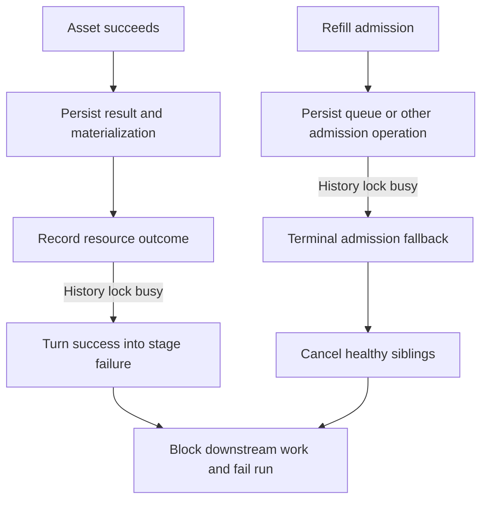
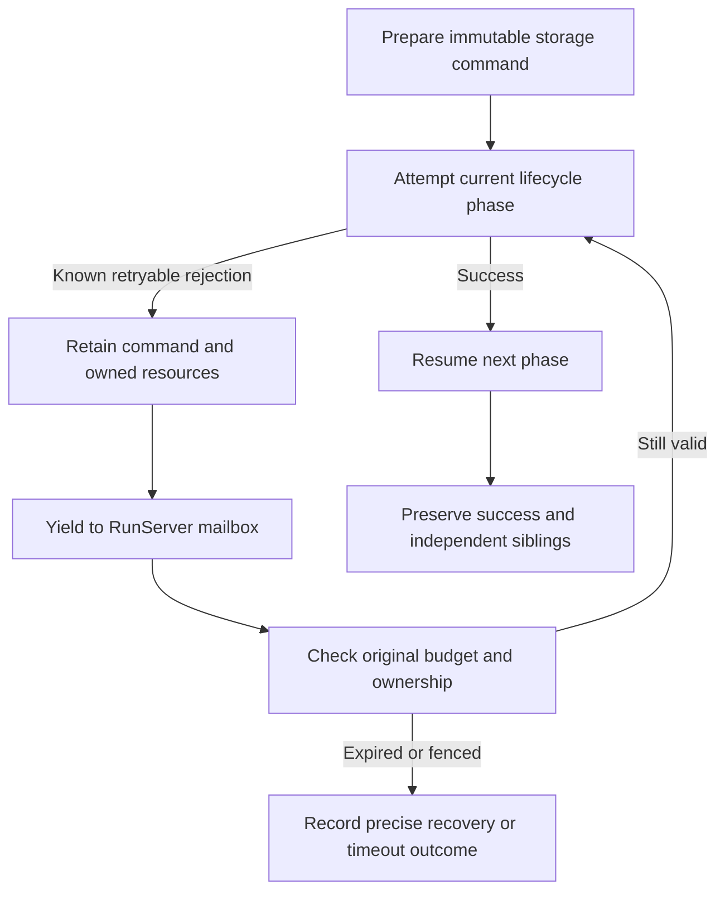

# Change Record: Recover history contention across the run lifecycle

| Field | Value |
| --- | --- |
| Status | Implementing |
| Type | Bug fix |
| Primary issue | None; the maintainer supplied the incident and authorized this repair without a separate issue. |
| Pull request | [#725](https://github.com/eirhop/favn/pull/725) |
| Related work | [#711](https://github.com/eirhop/favn/pull/711), [#716](https://github.com/eirhop/favn/pull/716), [#717](https://github.com/eirhop/favn/pull/717), [#722](https://github.com/eirhop/favn/pull/722) |
| Affected areas | PostgreSQL history protection; orchestrator admission, settlement, retry, cancellation and error projection |
| Approved plan commit | `7967ac33` |
| Last updated | 2026-09-17 |

## One-minute summary

A completed asset can be marked failed because its separate resource bookkeeping
encounters a temporary database lock. Admission can encounter the same lock while
recording a queue event, then cancel healthy siblings. The previous repair only
retained retry continuations for attempt-start events and ownership renewal.
This repair audits the entire lock contract, preserves the exact pending storage
operation at each execution boundary, and proves completion and admission
contention in one pipeline with downstream work.

## Impact and evidence

The supplied incident reports 28 successful runner tasks, a persisted Landing
materialization with no resource outcome, four healthy queued tasks cancelled by
an admission error, and 21 blocked descendants. The exact admission operation
is unknown in the supplied evidence; queue persistence is a verified vulnerable
path, not an asserted reconstruction of the incident.

| Evidence | Finding | Limit |
| --- | --- | --- |
| `StageResult.finish_persisted_step/1` and `complete_post_step/3` | A resource-outcome write failure becomes `post_step_persistence_failed` even after durable success. | Source proves vulnerability, not the original competing transaction. |
| `StageAdmission.persist_or_defer_queued_entry/1` | A queue-event error becomes a terminal admission error without retaining the event or continuation. | The incident does not identify its precise admission sub-operation. |
| `Execution.terminalize_stage_admission_failure/4` and `StageAdmission.terminalize_unsubmitted_entry/3` | Fallback paths cancel independent submitted work. | Cancellation remains necessary for explicit cancellation or authoritative loss of execution permission. |
| `History.guard!/2` and `RunIdentity.lock!/2` | Ordinary writers share an exclusive lock keyed by history root with retention and root-run identity. | Some cancellation paths deliberately serialize on their cancellation owner; those locks must remain. |
| #722 PostgreSQL lifecycle test | Gates `step_started` and renewal; releases contention before completion; separately tests operator cancellation. | Does not contend resource outcomes, queue events, or combined completion/refill boundaries. |
| #722 plan and independent review | The approved scope named attempt-start replay and renewal. | Broad claims of full lifecycle coverage were not supported by that scope. |

### Why previous tests and review missed this

The tests followed the repaired call sites. They proved real PostgreSQL errors
but did not vary the persistence phase at which the error occurred. Successful
completion after releasing an attempt-start lock does not test a lock acquired
after completion. Review challenged races within the selected continuation,
but did not enumerate every caller of the shared history guard. This record
requires that inventory and ties the new test to final persisted outcomes rather
than only the selected retry message.

### Assumptions

- Existing failed runs are diagnostic evidence; this PR does not replay them.
- A transaction explicitly rolled back with `execution_history_owner_busy`
  committed no part of that transaction. Earlier separate transactions may
  already have committed and must not be repeated as an asset execution.
- Successful runner outcomes are authoritative even while bookkeeping is pending.
- Unknown external outcomes retain existing fail-closed recovery behavior.

## Current behavior

## Approved plan

Use the existing RunServer persistence-retry scheduler for a closed set of
immutable storage operations. Retain the prepared command and the owning
lifecycle phase. On success, resume after that phase; do not rerun the callback,
whole admission batch, or previously completed bookkeeping. Keep the GenServer
responsive to ownership renewal and real cancellation while waiting.

Separate live-history protection from per-run serialization: ordinary writers
take a shared advisory history lock in a distinct namespace; retention takes an
exclusive lock in that namespace. Keep existing exclusive run/cancellation
identity locks. This removes accidental contention between independent history
writers while still returning a retryable error when retirement owns the guard.

### Contracts and invariants

- Commands retain IDs, payloads, event sequence/time, ownership generation and
  original work/admission deadlines across retries.
- Retry only the known-safe database operation. Asset attempts and external
  writes are never replayed by this mechanism.
- A settled step waiting for resource bookkeeping keeps its successful result.
- A partially admitted batch retains saved tasks, pre-dispatch leases/claims,
  circuit permits and registered waiters before yielding.
- Claim preparation may already own a target-operation lock before a durable
  claim exists. A paused claim retains and renews that exact lock; it does not
  use the old helper that releases the lock on every rejected claim call.
- A committed blocked/fresh decision advances the retained run snapshot before
  any recovery-candidate write. Retrying that second operation never restores
  the pre-event sequence or appends the decision twice.
- Success of a command receipt does not establish current ownership. Admission
  resume uses the existing fresh ownership gate before dispatch and checks the
  unchanged deadline. Exhaustion stops or drains safely with a specific reason.
- A node or persistence error is not a cancellation request. Healthy siblings
  continue unless cancellation, timeout, fencing or uncertain dispatch makes
  stopping that specific work necessary.
- Genuine cancellation invalidates admission retry tokens before cleaning known
  unsubmitted work. Ambiguous enqueue requires authoritative task reconciliation.
  Already-completed bookkeeping is retained and drained under cancellation, or
  explicitly recorded incomplete when its original budget expires. It cannot
  cancel/reclassify the completed task, fail its completed claim, or discard its
  successful result. Normal stop and crashes preserve unknown-outcome rules.
- Do not add a second retry scheduler, generic closures, process-dictionary state,
  synchronous retry sleeps, a new task codec registration, or a schema migration.

### Lifecycle inventory and intended handling

The final record will give exact functions and tested results for every family.
This inventory distinguishes a history guard from unrelated persistence errors.

| Guarded operation family | Owner and required retry/recovery behavior |
| --- | --- |
| Run ownership claim/renew/release | Claim can be retried by durable RunManager recovery; renew preserves one renewal ID within known lease; release must not manufacture asset failure. Verify these boundaries. |
| Run creation/start, step start/outcome, queue, blocked/fresh decisions, stage drain/retry and terminal events | Freeze exact event transition. Add missing queue/classification/sequential-start continuations to the existing event retry mechanism. Run creation's skipped busy identity error must carry a specific reason code too. |
| Execution admission | Freeze admission command; retain the original work and waiter/lease identity; continue capacity handling after success. |
| Materialization claim acquisition | Freeze claim command and operation-lock context; retain/release exact pre-dispatch ownership; resume claim classification after success. |
| Materialization completion/failure and execution checkpoints | These do not call the history guard directly. Audit their idempotency and adjacent failures; do not claim they emit this error or replay them as part of resource-outcome retry. |
| Resource outcome and recovery candidate | Freeze command after success; retry only the missing write, including the async post-step path and blocked-decision partial success. |
| Runner enqueue | Preserve deterministic task/command/payload and deadlines; retry known rolled-back history conflict; retain authoritative reconciliation for ambiguous enqueue. |
| Runner claim/start/renew/complete/cancel/logs/input resolution | Inventory store guards and protocol retry behavior. Preserve exact assignment/command IDs and unknown completion safeguards; fix any uncovered terminalization of this specific retryable conflict. |
| Submission, backfill, scheduler, rebuild and resource-recovery workers | Inventory outer polling/claim/recovery semantics. Retain durable intent on transient failure; distinguish intentional skipped busy candidates from terminal failure. |
| Operator cancellation, logs and retention | Keep idempotent operator retries, bounded log handling and retirement protection; document any diagnostic-only write loss. |

### Scope and complexity budget

The scope is history contention and its lifecycle consequences. No external
connector changes, data replay, public DSL change, general scheduler rewrite,
or unrelated cleanup belongs here. The expanded budget is driven by named
persisted phases missed by #722, not a new orchestration framework.

| Slice | Production added | Production deleted | Supporting added | Supporting deleted |
| --- | ---: | ---: | ---: | ---: |
| Shared history guard and lock-contract tests | 25-75 | 10-40 | 80-160 | 10-40 |
| Frozen persistence operations and admission/classification continuations | 300-500 | 150-300 | 220-400 | 40-120 |
| Completion bookkeeping, sibling preservation and diagnostics | 150-300 | 80-180 | 180-300 | 20-80 |
| Composed PostgreSQL lifecycle and recovery tests | 0-30 | 0-15 | 300-550 | 40-120 |

Supporting lines include tests, fixtures and canonical documentation; the record
itself is excluded. Explain any variance exceeding 25 percent or 100 lines,
whichever is smaller; obtain independent review of behavior that expands scope.

## Operational design

Retry diagnostics must retain the original structured reason, named operation,
asset/node/step, retry attempt, elapsed time, original budget, and exhaustion
disposition. Bounded redaction applies; command payloads and credentials are not
logged. Error projection rejects blank or literal `nil`/`null` code candidates
and falls back to the actual reason code/kind.

RunServer timer retries remain nonblocking. Pre-dispatch retries cannot extend
work or stage deadlines. A pending command has a 30-second control retry budget
starting at its first rejected attempt, further bounded by the original work or
admission deadline when dispatch has not happened. Ownership must remain live.
The first error and monotonic start time survive every timer and ownership gate.

When resource bookkeeping exhausts that budget, keep the successful node result
and materialization. Record an explicit `persistence_retry_exhausted` run error
with `operation`, node/step identity, original reason code, attempt count and
elapsed budget through the existing durable failure-drain/terminal transition.
Already admitted siblings finish normally; their writes are not cancelled.
The run is failed for incomplete control-plane bookkeeping, without changing
the successful asset's outcome. If persistence remains unavailable, the existing
terminal-event retry path retains that diagnostic until it can be stored.
Admission exhaustion may fail only the unsubmitted node when authoritative
evidence proves the operation never committed; ambiguous commit state stops for
recovery instead of inventing a second conflicting event.

These continuations are process-owned. On crash or ownership loss, existing
`outcome_recorded` recovery remains fail-closed and can terminate with
`uncertain_runner_recovery`; this repair does not add automatic completion of
every interrupted bookkeeping phase. Durable successful runner outcomes and
materializations remain available, and asset callbacks are never rerun. Test
that boundary and state the remaining operator-recovery limitation explicitly.

The advisory namespace change requires a coordinated control-plane restart:
stop old workers and maintenance before new workers/maintenance start. Mixed
old/new history-lock protocols are unsupported. No data reset or schema change
is required. The deployment notes must make that constraint explicit.

## Verification plan

1. Reproduce the completion-plus-admission regression against unmodified main.
2. Use a real PostgreSQL pipeline with materializations, execution-pool outcomes,
   independent siblings, a capacity queue and downstream dependencies. Acquire
   history locks on separate connections at completion outcome recording and
   subsequent refill/queue persistence. Observe the actual structured rejection,
   retain the command, release the lock and let the same pipeline finish.
3. Assert all nodes/tasks succeed, expected outcome/materialization rows exist,
   no cancellation receipts or blocked descendants exist, external callback/write
   counters are exactly one, and leases/claims/waiters are settled.
4. Parameterize owning-layer phase tests across every resumable operation;
   include committed-response loss, cancellation while paused, duplicate timers,
   original deadline exhaustion, fencing and deterministic rejection.
5. Prove shared live guards coexist and exclusive retirement still excludes new
   writes. Keep retention and cancellation race tests intact.
6. Verify resource completion after async reconciliation, cancellation during
   resource-outcome retry, and preservation of completed results/claims in both
   cases. Verify precise operator error projection.
7. Run focused owning suites first, then relevant umbrella CI, acceptance, slow,
   type checks and images. Independent Astra xhigh review compares this baseline,
   operation inventory, tests and final code. Report deployment proof separately.

## Plan review

Independent Astra xhigh review approved this plan on 2026-09-17 with no remaining
blocking findings. The reviewer independently enumerated the history-guard
callers and challenged retry exhaustion, crash recovery, ownership of locks
before claim creation, sequence retention after a committed blocked decision,
and cancellation during already-completed bookkeeping. Those corrections are
part of this approved baseline. The reviewer accepted the shared lock namespace,
coordinated restart constraint and closed operation union; implementation and
the composed PostgreSQL proof require a separate final review.

## Implementation outcome

Pending implementation and verification.
