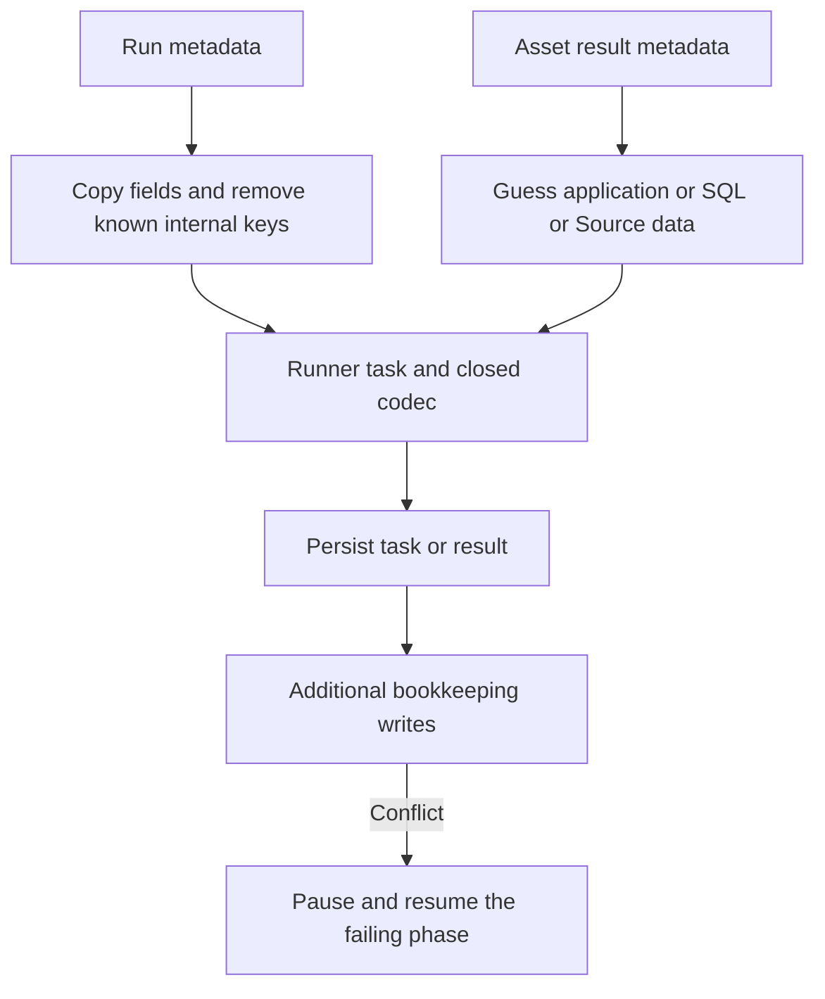
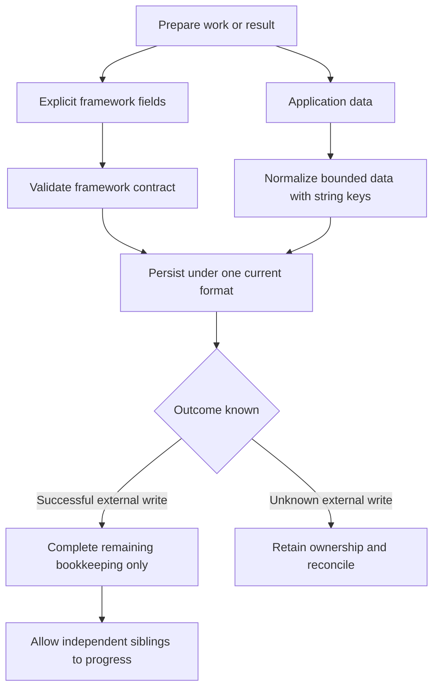

# Change Record: Simplify runner data and history-conflict recovery

| Field | Value |
| --- | --- |
| Status | Implemented |
| Type | Contract simplification and regression repair plan |
| Primary issue | None; the maintainer authorized this regression work without a separate issue. |
| Pull request | [#726](https://github.com/eirhop/favn/pull/726) |
| Related work | [#703](https://github.com/eirhop/favn/pull/703), [#711](https://github.com/eirhop/favn/pull/711), [#714](https://github.com/eirhop/favn/pull/714), [#716](https://github.com/eirhop/favn/pull/716), [#717](https://github.com/eirhop/favn/pull/717), [#722](https://github.com/eirhop/favn/pull/722), [#725](https://github.com/eirhop/favn/pull/725) |
| Compared versions | Main `ba3fa194`; proposed repair #725 at `f8fde8af` |
| Affected areas | Core runner contracts; Runner result construction; Orchestrator task preparation and completion; PostgreSQL history protection |
| Approved plan commit | `d96cf97c73131a876424bb8a65c26f4d18853a4d` |
| Last updated | 2026-09-17 |

## One-minute summary

Favn has two different problems. Its serializer mixes application data with
framework instructions, so an ordinary new metadata key can encounter rules
intended for execution controls. Separately, history cleanup introduced a lock
that makes ordinary writes compete, and existing failure handling can turn a
short database conflict into failed work and cancelled siblings.

We should separate those concerns and delete the special cases they require.
Keep the protections that prevent duplicate external writes. Do not preserve
old development formats or add a new workflow engine. This record proposes the
smaller boundaries and the experiments needed to decide how much of #725 is
necessary; it does not claim that a smaller replacement has already passed tests.

**This PR contains only this reviewed plan. Implementation is not authorized by
plan review alone.** It does not merge, close, replace or edit #725. Before code
work, confirm its current status and explicitly choose the implementation PR;
if the work is split, each implementation PR gets its own bounded record and
links here for the research rather than copying it.

## Three examples of the problem

### 1. Application metadata should not need framework registration

An Elixir asset can return `%{pages_written: 12, load_mode: :append}`. Those keys
and `:append` are already atoms in the application; Favn is not turning arbitrary
strings into atoms. The old replacement decoder only recognized names in its
approved dictionary. Adding a name repaired one example but could not cover
all names future applications might choose.

Application data should become `%{"pages_written" => 12, "load_mode" => "append"}`
at the runner boundary. No dictionary update is needed. Favn's own status such
as `:ok`, and its evidence about whether a write committed, stay separately
validated. **#717 already added application-result normalization.** The proposed
work removes the remaining guessing about which kind of metadata was returned;
it must not introduce a second normalization layer.

### 2. Two healthy tasks should not fight over permission to save history

Two backfill tasks finish at the same time. Both must protect their history from
being deleted. They should be able to hold that protection together. Instead,
#714 gave ordinary writers an exclusive lock for their shared execution group,
in the same lock namespace as run identity. One writer could reject the other
with `execution_history_owner_busy`, even with optional cleanup disabled.

#725 separates the namespace and shares writer protection while retaining
exclusive retirement. That addresses the source of unnecessary contention.
It does not prove that all retries or the required lock ordering can be removed.

### 3. Completed work is different from unfinished bookkeeping

Landing writes data successfully. Favn temporarily cannot record the resource
outcome. The state should mean **“the asset succeeded; bookkeeping is pending.”**
Retry recording the outcome, not the external write. Independent siblings keep
running. If the external write's outcome is unknown instead, Favn must retain
that uncertainty and require evidence before replay.

## What the research established

| Evidence | Finding | Limit |
| --- | --- | --- |
| [#703 record](issue-700-pr-703-crash-recovery.md), codec before/after merge `5b8a1124` | The old Erlang-term decoder depended on which atoms a restarted VM knew. The replacement omitted valid nested structures and treated application names as closed framework names. | The old happy path worked; the old crash-recovery behavior was not a safe baseline to restore wholesale. |
| [Current codec](../../../apps/favn_core/lib/favn/contracts/runner_task/persistence_data.ex) | Atom encoding and dictionary-based decoding accept different sets of values. Unknown structs/atoms still need rejection at the framework boundary. | A successful encode alone is not proof of a restorable task. |
| [Result normalization](../../../apps/favn_core/lib/favn/contracts/runner_task/persistence_result.ex) | SQL/Source/application treatment is chosen from metadata contents. | The heuristics are current-contract complexity, not an old-format decoder. |
| [Work construction](../../../apps/favn_orchestrator/lib/favn_orchestrator/run_server/execution/step_attempt_lifecycle.ex) | Run metadata is copied after removing a list of control-plane keys. | Another internal key can escape that list; the existence of a key does not prove the runner needs it. |
| [#714](issue-704-pr-714-postgresql-retention.md), `RunIdentity` and `Maintenance.History` | Introduced the exclusive history guard into ordinary writes; the guard runs independently of whether optional retention is enabled. | The original incident does not identify its exact competing transaction. |
| Git history of `terminalize_stage_admission_failure`, including `49ff99e4` | Blanket sibling cancellation predates #703. | Later locks exposed an older failure-path weakness. |
| [#725 reviewed repair](https://github.com/eirhop/favn/blob/f8fde8af/docs/change-records/2026/pr-725-history-conflict-lifecycle.md) | Broader exact-command retries and ownership tracking now pass composed tests. | That proves the tested behavior, not that this is the smallest design. Its process-owned bookkeeping continuations are not durable crash recovery. |

The five repair PRs add 8,934 lines gross: 2,952 production, 4,458 tests,
1,364 change records and 160 other documentation/security lines. Their net
production growth is 2,331 lines. #703 itself added 3,454 net production lines;
#714 added another 2,403 for retention. These are sums of per-PR diffs, not a
count of unique surviving lines or proof that the safety work is unnecessary.

### Why tests and reviews missed successive failures

#703 tested all task kinds and fresh processes, but its representative asset
fixture did not include the actual backfill pipeline context and Landing result.
Later repairs tested the next failing key or persistence boundary. #722's
contention test covered attempt-start and ownership renewal, not a new lock
acquired during successful completion bookkeeping or queue refill.

A reviewer finding no defects within those examples did not establish complete
lifecycle coverage or justify the total design. Future review must separately
answer “does this work?” and “can we delete this machinery by fixing its cause?”

## Current behavior and proposed boundary

The current contracts mix metadata from several owners. The serializer must
infer meaning; the #725 repair also carries partial execution state between
database writes. This diagram shows those contracts with the proposed #725
recovery behavior, rather than implying that every repair is already on main.

The proposed boundary keeps meaning explicit. The last branch represents the
required behavior, not a decision to introduce another persistence subsystem.

## Proposed plan

### A. Give each field one owner

Use the existing runner request/result contracts. Do not build a general-purpose
object serializer, a plugin registration mechanism or a replacement scheduler.

| Data | Proposed rule | Example |
| --- | --- | --- |
| Task identity, status, deadline, write outcome and generation pins | Explicit framework fields with closed validation; reuse existing fields | An application's `"status"` key cannot change task status. |
| SQL/Source execution evidence currently mixed into result `meta` | One explicitly typed evidence field, selected by the trusted execution path, on the asset result and its attempt entries | Source relation evidence is constructed by Source execution; it is not detected by looking for `observed` in user metadata. |
| Application result `meta` | Normalize once with the existing bounded open-data rules | `%{pages_written: 12}` becomes `%{"pages_written" => 12}`. |
| Application context needed by the runner | Explicitly supplied application metadata, normalized by the same rules | Adding unrelated cancellation bookkeeping to a run cannot change runner work. |
| Required framework context currently carried in metadata | Inventory consumers and construct only the fields they actually require; reuse existing `RunnerWork`/pipeline fields first | Backfill identity needed by the asset remains available; cancellation outcomes stay in the control plane. |
| Parameters, runtime-input contracts, manifest references and execution packages | Keep their existing typed contracts | Do not stringify every field in a runner task as a shortcut. |

The first implementation artifact is a field inventory: producer, consumer,
owner, destination and replacement for every touched metadata field. Unknown
internal fields are not copied. Removing a field requires proving that no
supported execution path consumes it. Fields with overlapping names remain
separate by ownership, not precedence rules. Existing top-level write evidence
and new SQL/Source evidence must agree; the new field must not duplicate or
replace the authoritative write-outcome field.

For application metadata, keep `OpenData`'s bounds and permitted value types:
strings/binaries, numbers, booleans, nil, lists, string-keyed maps and its existing
approved date/time/Decimal values. Normalize atom keys/values to strings; do not
create atoms from stored names. Reject duplicate keys after normalization,
unsupported structs/functions/process handles and unsupported tuples. Keep
existing error-detail tuple handling separate. Preserve the existing byte,
depth and node limits; validation errors name the field without logging
its value.

Change result producers, persistence validation, attempt history, materialization
and freshness readers, operator projections and public result documentation
together. Remove metadata-shape guessing and the replaced metadata-copy path
in the same change. A current-format wrapper is not permission to keep both
representations indefinitely.

### B. Prove the smallest history-conflict repair

Keep #725's evidence and tests available at its pinned commit. On isolated
implementation candidates, compare main plus the root lock correction and
required lock-order changes with the complete #725 repair. Reuse its composed
PostgreSQL regression rather than writing a second large fixture.

Test shared sibling writes, exclusive retirement, completion bookkeeping,
admission queue/refill, cancellation, ownership loss, deadlines and lost replies.
For each failure of the smaller candidate, name the exact missing guarantee and
retain only the required mechanism. **A lock-only candidate is an experiment,
not an approved complete fix.** Simply disabling retention or removing its
writer guards is not acceptable: that does not resolve the installed contention
or preserve safe deletion.

Prefer grouping bookkeeping that is already owned by the same PostgreSQL
transaction where that removes a partial state. Never hold a database transaction
open around an asset callback or external write. Do not combine capacity waiting,
unknown task delivery and a rolled-back database write under one generic retry.

If safe progress still requires a durable completion phase, a new stored command
or a change to crash recovery, stop this slice and return a separate design with
its own budget. Do not quietly add another state machine to this plan.

### C. Make the implementation decision explicit

After the comparison, report which #725 production paths are retained, replaced
or unnecessary, with the failing/passing test for each decision and actual diff
counts. Its diagnostic, sibling-tracking and unknown-outcome safeguards remain
requirements even if their implementation changes. Replacing #725 requires a
new independently reviewed implementation; this planning PR cannot supersede it
by claiming that fewer lines are automatically safer.

## Failure rules in simple terms

| Situation | Required behavior |
| --- | --- |
| Application uses a new metadata key | Accept supported data without adding that key to a framework dictionary. |
| Metadata is unsupported before dispatch | Reject with the exact field/reason; no saved executable task or orphaned claim. |
| Result metadata is unsupported after execution | Preserve the existing unknown-outcome safeguards; never label a possibly completed write safe to replay. |
| Database confirms a transaction rolled back | Retry the same safe storage command, with its identity and original deadline. |
| Another writer legitimately owns the target | Use normal admission waiting; keep the attempt and original deadline. |
| Task enqueue/completion reply is lost | Reconcile the existing command/task identity; do not manufacture another execution. |
| External write succeeded, bookkeeping is busy | Preserve success and retry only remaining bookkeeping; let independent siblings run. |
| External write outcome is unknown | Keep ownership protection and require evidence before replay. |
| Operator cancels, deadline expires or ownership is lost | Respect that authority; preserve saved tasks/results and clean each owned resource once. |
| Retry budget expires or the process crashes | Expose the original operation/asset/error and the supported recovery disposition. Do not claim transparent crash recovery for an in-memory continuation. |

Diagnostics retain operation, asset/task/run ID, reason code and retry exhaustion.
Do not log application metadata, payloads or credentials. Reuse existing bounded
retry logging; do not add one log per failed polling attempt or render `nil` as
the error type.

## Scope, ownership and complexity limits

The reader is the maintainer deciding whether to approve a smaller implementation.
These are initial estimates, not promises of savings; slice 1 must validate them
before production edits. The record itself and generated/formatter-only changes
are excluded. Slices are alternatives/comparisons where stated, not permission
to accumulate every candidate in the final product.

| Slice | Owner and outcome | Production added | Production deleted | Supporting added | Supporting deleted |
| --- | --- | ---: | ---: | ---: | ---: |
| 1 | Core/Runner/Orchestrator: field inventory and reuse of end-to-end fixtures; comparison baseline | 0 | 0 | 80–160 | 0–40 |
| 2 | Core/Runner/Orchestrator: explicit evidence and application data, all producers/readers, one normalized representation | 180–350 | 200–400 | 200–400 | 80–200 |
| 3 | PostgreSQL/Orchestrator: isolate history lock fix and compare required lifecycle continuations | 80–180 | 40–140 | 100–200 | 40–100 |
| 4 | Owning guides/types and shared fixtures: adoption and complete qualification | 0–30 | 0–30 | 60–120 | 20–60 |

The desired direction is fewer special cases and a smaller production design
than #725, not a guaranteed net deletion from main. Include reused/cherry-picked
code in all counts. If slices 2 or 3 cannot meet their behavior within these
bounds, stop and re-review the design before expanding it. Apply the repository
variance rule: explain an overrun exceeding 25% or 100 lines, whichever is
smaller, and materially fewer deletions. Do not finish a large implementation
first and justify the overrun afterward.

Core owns data contracts and normalization. Runner owns constructing genuine
execution evidence. Orchestrator owns task preparation and lifecycle decisions.
PostgreSQL owns transactions and history locking. View consumes the public
orchestrator facade; no direct storage access is introduced.

Non-goals: arbitrary Elixir-term persistence, a framework-wide metadata rewrite,
a new retry engine, new retention features, a UI redesign, automatic repair of
old failed runs, or proving a live connector never duplicates writes.

## Deployment and compatibility

The maintainer confirmed that there are no production installations requiring
old data support. #703 already
removed its old decoder and dual-format rollout; this is not where most of the
current complexity resides. Use one current format after this change. Update
persisted-format/wire validation and runner-release requirements when the actual
contract changes; reject incompatible records and runner versions explicitly.
Do not retain an old decoder, dual writes or shape-detection fallbacks.

Stop old control-plane, maintenance and runner processes before adopting changed
locks or runner contracts. Any fresh disposable database adoption or old local
data disposal requires explicit operator action; this plan does not authorize
a reset. Existing external data and unknown writes are not cleared merely by
changing control-plane schema. Before any development reset, establish that old
workers have stopped and unresolved external writes are accounted for. Rollback
uses the matching prior build/database, not a decoder for both versions.

## Verification and review gates

| Acceptance criterion | Required proof |
| --- | --- |
| New application keys never need framework registration | Separate fresh writer/reader processes using multiple application keys absent from the registry; exact normalized values and no new atoms. |
| Application data cannot impersonate framework evidence | Keys such as `status`, `write_outcome`, `relation`, `observed` and `retryable?` remain application data; genuine SQL/Source success and failure evidence survives separately. |
| Task construction cannot leak internal metadata | Add arbitrary control-plane/cancellation metadata and prove the executable task context does not change; required backfill/window/schedule/application context still arrives. |
| Accepted tasks are restorable | Real BackfillDispatcher → fully populated task → PostgreSQL readback in a fresh process; bounds, unknown atoms/structs and normalization collisions remain rejected. |
| Complete success survives contention | Backfill enqueue → Landing-style result → real PostgreSQL contention at resource bookkeeping and admission refill/queue → lock release → whole pipeline completes once. |
| No hidden safety loss | No duplicate write effects, orphaned claims/leases, unintended cancellations or blocked descendants; unknown delivery and unknown external write remain distinct. |
| Real cancellation and deadlines remain effective | Contend, cancel/expire/lose ownership, then release the lock; no new dispatch past the original deadline and all saved tasks are accounted for. |
| Simpler implementation is actually smaller | Compare production/test/deletion counts, number of lifecycle phases and metadata special cases against main and #725; report any guarantees that still require added state. |

Run owning-layer tests first, then relevant full fast/slow/acceptance suites,
format, warnings-as-errors compilation, static checks and final-head CI.
Fresh-process codec tests and real PostgreSQL contention tests prove different
things; neither substitutes for the other. Live connector interruption, deployed
release recovery and workload performance require separate evidence and must
not be inferred from a green synthetic pipeline.

The final reviewer must compare the reviewed baseline with the implementation,
including everything removed. In particular, challenge whether each remaining
retry phase protects a real partial side effect or merely compensates for a
boundary that could be eliminated.

## Plan review and outcome

Independent **Astra xhigh** review approved this planning record on 2026-09-17.
The reviewer checked the pinned source, PR history, production/test line counts,
field ownership, failure safeguards and complexity limits.

| Review point | Resolution |
| --- | --- |
| No production installations must be evidence, not an inference from pre-v1 status | Attributed explicitly to the maintainer's statement. |
| The current-state diagram could imply #725 is already merged | Identified the diagram as existing contracts combined with proposed #725 recovery. |
| Smaller code is not evidence of complete recovery | Retained the field inventory, composed-test comparison, separate design for new durable phases, and budget re-review before expansion as approval conditions. |

**Verdict:** no remaining actionable findings; approved as a bounded research and
decision record. The reviewer did not authorize implementation or assert that
the smaller candidate is sufficient.

Documentation checks: all relative links resolve, GitHub's Markdown renderer
accepts the page, and both Mermaid diagrams render in Chrome. The planning diff
passes whitespace checks. No implementation, automated product tests or live
runtime validation were performed for this proposal. The record stays
`Plan reviewed` when its draft PR opens because implementation has not started.

## Implementation decisions (after the approved baseline)

The maintainer authorized implementation on 2026-09-17. PR #726 is the
implementation PR; #725 remains open at its compared commit. The planning text
above remains the baseline, including its historical documentation-only status.

### Field inventory before production edits

| Producer / fields | Consumers | Owner and implementation destination |
| --- | --- | --- |
| Elixir callback result map, including arbitrary nested keys | Result codec, stored asset/attempt output, operator output | Application: `meta`, normalized once by existing `OpenData`; never inspected to select SQL or Source handling. |
| SQL runtime: command, connection, materialized relation, rows affected, check results, quality, transaction/write outcome, contract validation, group replacement, runtime inputs, manifest identity, message/reason/metrics | MaterializationClaims, stored asset/node/attempt output, Catalogue.Assurance | Runner/Core: explicit `RunnerAssetEvidence`, selected from the manifest asset type, carried separately from `meta`. Existing top-level generation/write fields remain authoritative. |
| Source execution: observed flag and relation | Stored result and operator output | Runner/Core: the same evidence contract with Source kind. |
| RunnerAssetResult evidence | ResultBuilder → NodeResult; Projector → AssetResult; JsonSafe, snapshot codec, DTO, Catalogue.Assurance | Carry evidence through every projection; assurance reads evidence rather than application keys. Freshness uses materialization records populated from that evidence. |
| Pipeline policy/schedule, planned window, identity, params, deadlines, runtime pin, generations | ContextBuilder and SQL runtime | Existing explicit RunnerWork fields; preserve types and populated fresh-process tests. |
| BackfillDispatcher identity and operator_metadata | Runner lifecycle logs/result trace context; not exposed by ContextBuilder to asset callbacks | Copy only explicit backfill identity fields. Normalize the explicitly supplied operator metadata map; unrelated run keys never enter work. |
| Runtime-input lineage produced during run planning | MaterializationClaims before enqueue | Explicitly selected control-plane preparation metadata, removed before task persistence as today. |
| Rebuild runtime-input-resolution mode | RunnerWork.runtime_input_resolution_only? | Existing framework control, explicitly constructed by the rebuild path; do not derive it from application metadata. |
| runner_task_id | Task/log correlation | Construct at enqueue. Existing node identity remains authoritative; no new fallback to run metadata. |
| dispatch_id / ownership_id / runtime_input_event | Old exclusions; dispatch_id read by SQL cancellation but stripped before durable dispatch | Do not copy them from run metadata; use the actual task/execution identity for SQL cancellation. |
| Cancellation, retry, recovery, admission, active task IDs and other internal run keys | Control-plane lifecycle only | Keep on RunState. Remove the growing exclusion list from work construction. |

Slice 2 will reuse the existing codec and normalization, add one evidence
contract, and update these producers/readers together. No general serializer or
new metadata registration system is needed. The initial production budget still
applies; the inventory also identifies existing tests that must move their SQL
assertions from metadata to evidence.

### History comparison result and proposed budget deviation

The lock/order-only candidate adds 48 and deletes 30 production lines against
main. On disposable PostgreSQL 18, the shared-writer/exclusive-retirement test
passes. The composed regression was then run with each exclusive-lock injection
independently. Both fail at the required pause assertion: `resource_outcomes`
and `step_queued`. The commands receive the real retryable history-owner error;
main does not retain the required remaining work. The initial 180-line estimate
therefore does not cover a complete repair.

In plain terms: changing the lock stops healthy writers fighting each other,
but a real maintenance lock can still interrupt bookkeeping. Favn must remember
which database write remains, without repeating the asset or cancelling siblings.
That state cannot safely be removed merely to reduce the patch size.

**Proposed deviation, requiring independent review before import:** use #725 at
`f8fde8af` as the behavior baseline, retaining its tested operation identities,
ownership adoption, deadlines, sibling draining and uncertain-outcome rules.
Delete unused acquisition/decision wrappers; interpret a successful acquisition
once; use the same admission continuation for attempt-start persistence. No new
durable state, generic callback retry system or expanded crash-recovery promise.

| Budget comparison | Production added | Production deleted | Supporting added | Supporting deleted |
| --- | ---: | ---: | ---: | ---: |
| Consolidation against #725 | At most 120 | At least 150 | At most 120 | Report actual; retain behavioral coverage |
| Revised slice 3 against main, including imported #725 code | At most 1,650 | Target 700–900 | At most 1,530 | At least the existing 64 |

These are replacements for slice 3's estimate, not additions hidden outside it.
Slice 2's metadata budget remains unchanged. Imported tests and production code
count in full. This is a smaller lifecycle implementation than #725, not a claim
that all its safety machinery was unnecessary. The record will show both the
main-based totals and the direct consolidation diff. If the deletion target or
added-line cap cannot be met, re-review before expanding further.

The existing composed, cancellation-at-ownership-gate, same-batch exhaustion,
lost-reply and domain-wait tests remain required behavioral gates. Changes to
internal continuation assertions must preserve their original fault injection
and external outcome assertions.

Astra xhigh approved this deviation before lifecycle import on 2026-09-17,
with no blocking findings. Approval retains all five conditions above, including
separate measurement against main and #725 and re-review before exceeding bounds.

### Implemented outcome and review evidence

Application metadata now uses the existing bounded open-data codec uniformly.
For example, `%{pages_written: 3, write_outcome: :custom}` becomes
`%{"pages_written" => 3, "write_outcome" => "custom"}`; it does not become SQL
evidence or change whether a write is safe to replay. SQL and Source execution
produce a separate typed `RunnerAssetEvidence`. That evidence is carried through
results, attempts, stored snapshots, materialization records and operator views.
Only explicit backfill identity and operator metadata enter task metadata;
cancellation and future control-plane keys stay on the run.

This is a clean protocol-14 change. There is no protocol-13 compatibility decoder
or migration of old tasks. The maintainer's no-production-installations decision
is the basis for that choice; replace runners and orchestrator together and
recreate disposable old task state when adopting it.

The lock-only comparison was insufficient. The implementation therefore retains
#725's exact-command retries, completion bookkeeping, ownership checks, diagnostics,
sibling draining and unknown-outcome handling. It removes unused acquisition and
decision wrappers, resolves acquisition replies once, and folds attempt-start into
the existing stage-operation continuation. No callback retry framework or new
durable recovery phase was introduced. #725 remains untouched; this PR incorporates
its behavior baseline and can replace it after qualification.

Interim Astra xhigh implementation review found two cleanup edges introduced by
that consolidation. Both were corrected and received regressions:

- A non-owned materialization decision releases its prepared target lock. The
  adopted continuation now forgets that released lock before renewal. The
  PostgreSQL regression proves the old lock is fenced while paused renewal
  succeeds, for both competing and materialized decisions.
- A waiting admission reply arriving after its deadline registers a local waiter.
  Expiry now cancels that subscription. Tests cover initial and replayed replies.

The reviewer approved raising supporting consolidation additions to 150 to cover
these tests. Final main-based accounting is recorded separately below rather than
counting deletions from #725 as deletions from main.

Verification so far: core 527, runner 272, orchestrator 909, focused admission 37,
write-resolution PostgreSQL 16, and both composed PostgreSQL lifecycle tests pass.
The composed tests exercise real exclusive history locks during completion and
queue persistence, admission, committed-but-lost replies and cancellation. They
retain assertions against duplicate execution, unintended cancellation, blocked
descendants and orphaned claims. Full umbrella, slow, acceptance and final review
qualification are still pending. This does not claim live connector validation,
transparent recovery after arbitrary process crashes, or a guarantee of no bugs.

Astra independently reproduced and approved these accounting corrections:
#725 itself is +1,517/-555 production and +1,451/-71 supporting lines against
main, excluding its record. The earlier support estimate omitted 43 guide lines.
The main-based lifecycle target is therefore 650–750 deletions and at most 1,600
supporting additions; its 1,650 production-addition cap is unchanged. Direct
consolidation remains at most 120 production additions, at least 150 production
deletions, and at most 150 supporting additions. Removing code newly added by
#725 reduces additions against main; it is not counted as a main deletion.

Current corresponding lifecycle files are +1,506/-681 production and
+1,580/-73 supporting against main (including small metadata edits in overlapping
files). The five consolidated lifecycle modules are +63/-212 directly against
#725, including three metadata projection lines in MaterializationClaims. The
remaining changes implement the metadata boundary, its tests and this record.
The total PR is larger than the metadata change because it incorporates #725;
it is not a 4,000-line serializer replacement.

Final-review integration findings expanded the field inventory in two existing
consumers, without changing the design:

- `ResultCompactor` also consumes result detail. It now trims optional evidence
  and preserves asset identity, generation identity and unknown-write/error
  classification. Retention is best effort below the essential envelope size;
  transport limits remain enforced by the codec. Regression tests cover large
  successful SQL output and unknown writes.
- RebuildDispatcher produces `runtime_input_expectation` for an approved rebuild.
  RuntimeInputPins consumes it after task persistence to reject changed resolver
  output. It is now explicitly copied as framework metadata. The regression goes
  through work construction, stored task readback and pin validation, checking
  changed resolver, input identity and payload fingerprint independently.

These findings explain why testing only metadata encoding is insufficient: a
valid value must also survive producer selection, compaction and every consumer.
The first broad run also exposed an incorrect new test assumption that every
backfill asset has a window. The assertion now checks the exact planned node
window, including legitimately unwindowed assets; pipeline selection is checked
separately.

The final UI review also required preserving evidence provenance through asset,
attempt and log views. Their summary components now receive evidence separately;
application keys are displayed generically. The existing attempt-projection JSON
column stores a framework-built `{meta, evidence}` envelope, unpacked by the public
read facade. No column or legacy decoder is added; adoption requires rebuilding
old disposable projections along with old task state. Storage-backed and rendered
regressions cover application keys named `kind`, `evidence`, `write_outcome` and
`check_results` without granting them SQL/write authority.

Astra approved a narrow increase of slice 2 supporting additions from 400 to 500
for the compaction, rebuild pin and UI/projection regressions discovered in final
review. Production limits remain unchanged; these are required consumers of the
approved evidence contract, not additional features.

### Final implementation accounting and qualification

Against main (`ba3fa194`), production code is **+1,788/-915**. Against the qualified
#725 behavior baseline it is **+359/-448: 89 fewer production lines overall**,
including the new metadata boundary. Of that comparison, lifecycle consolidation
is +60/-209 and metadata changes are +299/-239. The three MaterializationClaims
projection substitutions belong to metadata. This is a modest production
simplification with broader regression coverage, not a claim that thousands of
lines of necessary recovery behavior can disappear.

The PR also includes 1,940 added and 128 deleted test/fixture lines against main,
mostly reused #725 coverage. The reviewed planning record is counted in the PR's
documentation total, not hidden as production savings. Metadata supporting changes
are +425/-74, within the revised 500-line cap; lifecycle supporting consolidation remains 130 added
lines, below its revised 150-line cap. Actual metadata support deletions are below
the initial 80-line estimate because the review added consumer regressions rather
than replacing whole existing suites.

| Verification | Evidence and limit |
| --- | --- |
| Core and runner | 527 core tests and 274 runner tests pass, including fresh-process persistence, generation safeguards and compaction. |
| Orchestrator | Full run passes all semantic tests; two unchanged 100 ms heartbeat tests fail under load and pass in a focused five-test rerun. Earlier full run passed 909 tests before the two new expiry cases were added. |
| View | All 840 tests pass; explicit evidence preserves SQL rendering, and SQL-looking callback keys remain generic. |
| PostgreSQL composition | Both real history-contention pipeline tests pass; backfill enqueue/completion passes; the final projection/write-resolution group passes all 18 tests, including changed rebuild inputs. |
| Static checks | Formatting, warnings-as-errors compilation, whitespace and CI test-tier guard pass. Security route catalog covers 31 browser and 66 API routes. |
| Local wider qualification | Attempted umbrella, slow, acceptance and full HTTP security harness. Local restore uses PostgreSQL 16 tools against server 18; acceptance lacks the consumer asset binary/runtime-role setup; BuildKit prints double-quoted config where the existing guard expects single quotes. Local performance probes also exceed timing limits under load. These environment/tooling issues are not changed in this patch. |
| CI | Initial implementation CI passes acceptance, slow tests, Dialyzer, static checks, image qualification and HTTP security. Its only fast-suite failures are the two corrected window fixture assertions. Merge readiness requires the same checks on the final pushed head; current results are available on PR #726. |

No live connector run or automatic repair/replay of historical unknown writes was
performed. The adoption boundary remains a coordinated protocol-14 deployment
with fresh disposable task/projection state.

**Final Astra xhigh verdict:** approved the implementation on 2026-09-17 with no
remaining actionable findings, against the original baseline and all documented
deviations. The reviewer independently passed 193 focused checks and accepted
the stated PostgreSQL proof boundaries. Final-head CI remains the merge gate.
