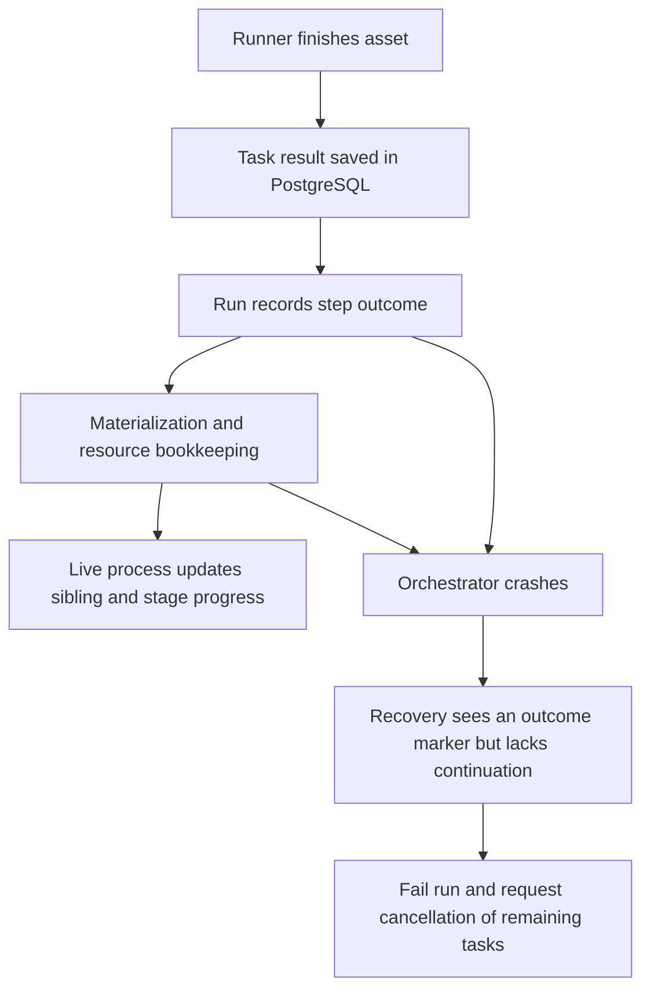
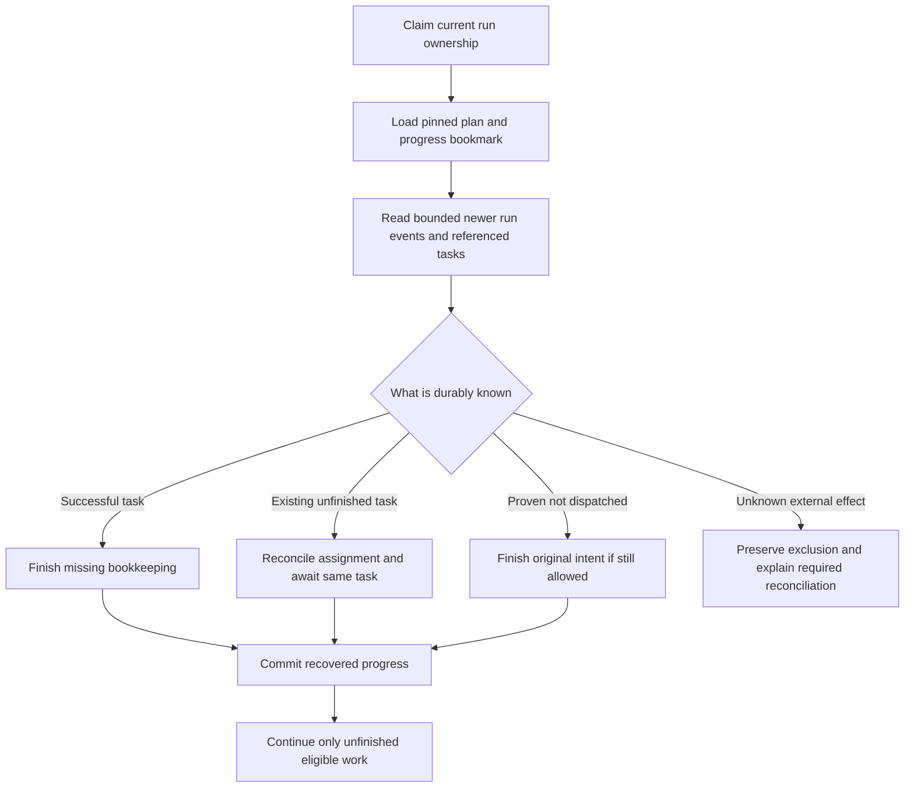

# Decision Record: Resume known work after an orchestrator crash

| Field | Value |
| --- | --- |
| Status | Implementing |
| Type | Recovery design decision and bounded implementation proposal |
| Primary issue | None; the maintainer requested this follow-up without a new issue. |
| Pull request | [#731](https://github.com/eirhop/favn/pull/731) |
| Related work | [#700](https://github.com/eirhop/favn/issues/700), [#703](https://github.com/eirhop/favn/pull/703), [#726](https://github.com/eirhop/favn/pull/726) |
| Inspected baseline | Main at 97ac8657cc668d3d7faad441a813c545650c4464, including merged #726 |
| Affected areas | Orchestrator run recovery and execution; PostgreSQL run transitions; runner result and ownership contracts; release qualification |
| Approved plan commit | 57c64fcb; design direction accepted, field/replay qualification gate retained |
| Last updated | 2026-09-17 |

## One-minute explanation

Favn saves runner tasks and their results, but does not save enough of the
pipeline's progress to resume every interrupted run. For example, Landing can
finish successfully and Favn can record that success, yet a subsequent
orchestrator crash still makes Favn stop the run and cancel its remaining tasks.
The proposed decision is to rebuild progress from the task results and run
events already stored in PostgreSQL, adding only the missing intent and
bookkeeping information. Do not restart completed asset callbacks, serialize
the entire running process, or introduce a second workflow engine.

This is analysis and a proposal, not an implemented fix or proof of production
readiness. The maintainer has authorized a new worktree and this decision record;
implementation follows a separately accepted plan.

## Three examples

**1. Success is known.** Landing writes 100 pages and PostgreSQL accepts the
task's successful result. Favn crashes while updating pipeline bookkeeping.
After restart, Favn should read that result, finish its records, and continue
downstream. Landing must not write those 100 pages again.

**2. Work has not started.** Favn records its intention to enqueue a task, then
crashes before saving the task itself. After restart, it should establish that
the original task is absent and that no execution could have started, then
finish enqueueing that same task if its original deadline and cancellation
checks allow it. An unavailable database is not evidence of an absent task.

**3. The external outcome is genuinely unknown.** Landing writes the pages, but
the runner dies before reporting a result and no supported external receipt
proves the write. Favn must preserve the unknown outcome and exclude conflicting
writes. It needs an actionable reconciliation path, not an automatic rerun.
The proposed work cannot manufacture evidence an external system never saved.

## How critical and how difficult?

Recovery of known results is a production-readiness requirement for unattended
pipelines. Restarts and deployments must not turn ordinary successful work into
avoidable failed runs. The current conservative behavior protects against
duplicate writes, but leaves an availability and operator-workload problem.

The work is feasible because tasks, results, manifests, runtime inputs, claims,
events, and ownership already have durable owners. The difficulty is joining
those facts correctly across every interruption point, not inventing persistence
from scratch. The size of the final repair is not established by this analysis;
the budget below is a review constraint, not a delivery estimate.

Basic production readiness means known results recover automatically, truly
unknown writes stay protected, and recovery makes progress or explains precisely
why it cannot. It does not require transparent recovery from arbitrary database
loss or exactly-once writes to every possible external service.

## What the earlier PRs actually established

[#700](https://github.com/eirhop/favn/issues/700) principally required readable
tasks in a fresh VM, service recovery, bounded claim failures, safe expiry, and
preservation of uncertain writes. [#703's record](issue-700-pr-703-crash-recovery.md)
and tests establish substantial work in those areas. They did not establish
automatic continuation of every partially completed pipeline.

[#726's record](pr-726-runner-persistence-simplification.md) separates application
data from framework evidence and repairs temporary persistence contention while
the run process is alive. It explicitly leaves its bookkeeping continuations in
process memory. The [roadmap](../../ROADMAP.md) already lists restoration of
settled siblings after a mid-stage crash as remaining work.

Calling the overall crash-recovery goal complete was therefore too broad. The
task-level fixes are useful and should remain; whole-run continuation still
needs proof. This distinction must remain visible in reviews and release claims.

## Assumptions and evidence limits

- PostgreSQL survives the orchestrator/runner process failure and retains the
  current-format history. Database restore and external storage durability are
  separate operational contracts.
- There are no production installations requiring a legacy-format reader.
  This does not authorize deleting development data or resetting a database.
- The supported topology remains one control plane with independent runners.
  A stale old process must still be fenced after recovery takes ownership.
- A matching persisted runner result is accepted evidence under the existing
  runner/adapter contract; an application metadata key claiming success is not.
- The investigation uses current source, existing tests, and historical PR
  records. No fresh crash drill or live connector replay was performed here.
  No callable Tidewave tool was available; no runtime claims are inferred from
  an unrelated development server.

## Verified current behavior

### The exact missing information

| Durable fact today | What is still missing or insufficient on restart | Source |
| --- | --- | --- |
| Task identity, payload, orchestration context, assignment fence, terminal result and version | A terminal task is not itself proof that all control-plane bookkeeping finished | [RunnerTasks.complete](../../../apps/favn_orchestrator/lib/favn_orchestrator/runner_tasks.ex), [task store](../../../apps/favn_storage_postgres/lib/favn_storage_postgres/runner_tasks/store.ex) |
| Immutable per-assignment outcome history used by task receipts | Safe operation retry can clear the current task row's result; recovery needs a validated lookup of the referenced historical outcome | [Task store: persist_task_outcome!, retry and load_task_outcome!](../../../apps/favn_storage_postgres/lib/favn_storage_postgres/runner_tasks/store.ex) |
| Step outcome event, including node result | Restore does not fold these events back into completed sibling state | [StageResult](../../../apps/favn_orchestrator/lib/favn_orchestrator/run_server/execution/stage_result.ex), [Execution](../../../apps/favn_orchestrator/lib/favn_orchestrator/run_server/execution.ex) |
| Active task IDs in the run snapshot | Completed siblings disappear from that active set; an empty set does not mean a new run | [ActiveTaskSet](../../../apps/favn_orchestrator/lib/favn_orchestrator/run_server/execution/active_task_set.ex) |
| Marker that an active stage has recorded an outcome | Marker says recovery is unsafe; it does not describe how to finish safely | [RecoveryPosition](../../../apps/favn_orchestrator/lib/favn_orchestrator/run_server/execution/recovery_position.ex) |
| Shared freshness checkpoint with completed-node and upstream-status information | It advances at stage boundaries, not every partial settlement; it is not a complete pipeline continuation | [PipelineFreshnessCheckpoint](../../../apps/favn_orchestrator/lib/favn_orchestrator/run_server/execution/pipeline_freshness_checkpoint.ex) |
| Earlier-stage step events | Later-stage restore starts with empty accumulated results and no restored first failure; a complete prior result/failure history must be reconstructed | [Execution.restore_task_waits](../../../apps/favn_orchestrator/lib/favn_orchestrator/run_server/execution.ex), [RunExecutionState](../../../apps/favn_orchestrator/lib/favn_orchestrator/run_server/execution/run_execution_state.ex) |
| Run events and current snapshot | Nonterminal snapshots intentionally remove accumulated results; event-to-execution reconstruction is absent | [RunState.for_step_persistence](../../../apps/favn_orchestrator/lib/favn_orchestrator/run_state.ex), [Persistence](../../../apps/favn_orchestrator/lib/favn_orchestrator/run_server/persistence.ex) |
| Before-enqueue task reference in step-start intent | Exact work deadline, prepared command and all adopted handles are not captured as a validated replayable intent there | [StageAdmission](../../../apps/favn_orchestrator/lib/favn_orchestrator/run_server/execution/stage_admission.ex) |
| Admission, materialization, and target locks | Current pipeline restore tries to adopt a live capacity lease even when loading a terminal task; expired leases are rejected | [Execution.restore_entry](../../../apps/favn_orchestrator/lib/favn_orchestrator/run_server/execution.ex), [admission store](../../../apps/favn_storage_postgres/lib/favn_storage_postgres/admission/store.ex) |
| Live retry command, reply, phase and 30-second retry budget | These fields are process-owned and disappear on process death | [PersistenceRetry](../../../apps/favn_orchestrator/lib/favn_orchestrator/run_server/persistence_retry.ex) |

The guard is deliberate: [Recovery.disposition](../../../apps/favn_orchestrator/lib/favn_orchestrator/run_server/recovery.ex)
rejects active stages with the outcome marker before inspecting their task rows.
With no active tasks, it accepts only explicit retry checkpoints or a fresh run.
[RunServer](../../../apps/favn_orchestrator/lib/favn_orchestrator/run_server.ex)
then terminalizes uncertain recovery and requests cancellation. Removing that
guard alone would let the current restorer treat already completed siblings as
deferred work. That is not a safe fix.

### Interruption inventory

This inventory covers both pipeline and sequential execution where applicable.
“Must recover” means when cancellation, deadlines and durable evidence permit;
it does not override those controls.

| Crash boundary | Current limitation or evidence | Required behavior |
| --- | --- | --- |
| Before a run starts | Fresh-run and submission recovery already exist | Preserve them and demonstrate that unrelated work remains available |
| Admission acquired; enqueue intent not yet complete | Paused commands/handles can exist only in memory | Reconcile exact acquisition identity before reuse/release; no new admission on an ambiguous reply |
| Step-start intent saved; task absent | Recovery reports missing durable tasks | Restore exact validated intent, confirm authoritative absence and finish the same enqueue; otherwise stop with precise evidence |
| Task saved; enqueue reply or queue event lost | Task exists; some recovery tests cover immediate restart | Adopt that task, reconcile queue bookkeeping once, preserve its pins and deadline |
| Assigned/preparing/running; runner still alive | Task state and assignment fences are durable | Reconnect/await according to existing assignment authority; do not dispatch a second callback |
| External effect occurred; terminal result not saved | Outcome may be unknowable | Preserve unknown write exclusion across expiry/restarts; use existing supported reconciliation |
| Terminal result saved; step outcome absent | Result is available independently of notification | Consume stored result and persist the missing step outcome once |
| Step outcome saved; materialization/resource records incomplete | Marker stops recovery; pending phase is volatile | Reconcile exact bookkeeping and resume only what is missing |
| Initial target-generation reconciliation in progress | Worker is volatile; it can enqueue inspection and marker operations | Reattach to durable operation tasks and reconcile their outcomes; never treat marker writes as ordinary retryable database bookkeeping |
| One sibling settled; others queued/running | Explicitly rejected by current code/tests | Restore settled/non-run decisions, await active siblings and continue descendants |
| Later stage active after an earlier branch failed | Earlier failure and accumulated results are not reconstructed by current task restore; this is source-derived, not a reproduced final-status error | Restore the original failure and full retained result history while continuing independent branches |
| Last sibling settled; stage advance not saved | Current snapshot/checkpoint do not form one atomic progress boundary | Commit one coherent next position, or replay the preceding suffix safely |
| Sequential success; next index not saved | Index and accumulated results are partly process-owned | Restore completed prefix and exact next step; never replay the prefix |
| Retry wait or failure draining | Some retry checkpoints exist; full continuation is incomplete | Retain attempt count, original cause, completed statuses, deadlines and next retry time |
| Terminal run write committed; reply/notification lost | Terminal run is authoritative | Observe existing terminal outcome; do not reopen run or repeat submission completion |
| Downtime outlasts capacity/assignment/ownership leases | Immediate-restart tests do not prove this case | Settle terminal results without requiring new execution capacity; reconcile live/unknown work with current fences and original deadlines |

## Options and decision

| Option | Benefit | Cost or failure | Decision |
| --- | --- | --- | --- |
| Keep fail-closed behavior and rely on manual reruns | Smallest code change | Known successful work still strands runs; manual reruns can be unsafe | Insufficient for the intended production contract |
| Delete recovery guard or restart the stage | Very small diff | May rerun completed callbacks and lose skipped/blocked decisions | Reject |
| Save the entire live execution/retry state | Easy to imagine restoring | Duplicates large payloads and persists process-specific machinery; creates another fragile codec | Reject |
| Reuse existing events, task results and checkpoint; add missing typed progress fields | Uses existing durable authorities and avoids duplicate result storage | Requires a precise bounded restoration algorithm and crash tests | Recommended |
| Add a dedicated row for every node's recovery progress | Direct keyed recovery reads | Another authority, migration, retention/index and live-write contract | Reserve for measured inability of the recommended design to meet bounds |
| Make every bookkeeping operation one database transaction | Can remove some crash windows | Cannot include runner callbacks or external generation marker writes; broad lock coupling can recreate contention | Use only for a small coherent PostgreSQL transition where justified |

### Recommended behavior in plain terms

Save a compact bookmark saying where the pipeline was, then read the few newer
records needed to catch up. A bookmark references existing results; it does not
copy all of them. The same rules interpret progress during normal execution and
after restart, so recovery does not become a second scheduler with different
decisions.

### What must be recorded, and where

The names below describe proposed concepts, not new public APIs.

| Information | Proposed owner and representation |
| --- | --- |
| Run position | Compact typed value associated with the existing run snapshot/checkpoint: execution mode, stage or sequential index, attempt, checkpoint/event sequence, retry/drain disposition and original failure reference |
| Decisions and completed siblings | Restore from authoritative step events after the checkpoint; compact completed statuses/result references when advancing the checkpoint. Preserve skipped-fresh, blocked, failed and cancelled outcomes as well as success |
| Exact admission and pre-dispatch intent | Record or deterministically derive stable acquisition identity before the first admission/circuit/materialization mutation, from a previously persisted attempt identity. Persist any non-derivable deadlines/semantic input first. Extend an existing transition or add one narrow intent event if necessary; the later step-start event alone is too late |
| Enqueue input | Stable task/step/node identity, pinned input/package/generation references, frozen decision and original deadlines; enough to reconcile acquired claims/permits and finish or abandon that exact intent |
| Known runner outcome | Reference task ID, assignment generation and accepted result version/hash in existing immutable outcome history, plus its historical status/retry disposition. Read through a bounded owning-store contract and verify the reference. The current task row is not immutable: safe operation retry can clear its result |
| Pending settlement | Typed phase and operation identity at an existing run transition: step outcome, materialization settlement, resource outcomes, initial-generation reconciliation, or completion of the node |
| Retry budget | Durable first-failure time/absolute retry expiry and original reason; no persisted monotonic clock, PID, timer reference or anonymous function |
| External reconciliation | Existing operation-task identity and outcome; use its supported marker/read/reconciliation contract |

Do not use operator read models, arbitrary application metadata or current
freshness guesses as recovery authority. Validate all references against the
pinned run/manifest and fail precisely on missing or conflicting evidence.
The serializer must retain #726's explicit framework/application separation.

A crash after acquiring a lease but before recording its reply is part of the
contract. Query/reconcile that exact acquisition through its owner using the
prior stable identity; do not acquire again or infer absence from an expired
local handle. Where acquire-and-record can be one small PostgreSQL transaction,
that is an alternative. Saving returned handles only after acquisition leaves
the original window open.

Safe operation retries must not invalidate an outcome the run still needs.
Retain and reference the accepted observation before advancing an operation to
its next assignment; preserve its decision in run progress. Reuse the existing
outcome history, including for post-step inspection, rather than duplicating
large result bodies in the bookmark. A full historical-outcome lookup is new
bounded behavior: the existing receipt reader intentionally returns unloaded
data, while the normal fetch reads the current mutable task. Validate the
historical disposition and hash against retained evidence, and decode using
the original pinned manifest/package/context.

### How to avoid creating another complexity problem

1. Start with a pure, typed restoration reducer over saved facts. It returns
   “await this task”, “finish this bookkeeping”, “finish this unsubmitted intent”,
   “continue from here”, or “needs reconciliation”. It does not execute assets.
2. Use that reducer's progress rules in live execution and recovery. Delete the
   old marker-only refusal when, and only when, replacement coverage passes.
3. Add missing data to existing authoritative boundaries. Do not add a generic
   event-sourcing library, callback journal or parallel durable queue.
4. Couple a progress bookmark with its matching run transition transactionally.
   A checkpoint cannot claim to cover events/settlement that have not committed.
5. Keep the existing large freshness checkpoint shared. Write it at coherent
   stage/checkpoint boundaries, not once per sibling result or lock retry.
6. Page only the required event suffix and batch referenced task reads. Start
   with the existing page limit of 500; measure aggregate decoded bytes/events
   against the existing active-run memory admission budget. Preserve cancellation
   and ownership renewal responsiveness between batches. A page limit alone is
   not a total memory or latency bound.
7. If the suffix cannot stay bounded between checkpoints, or typed intent cannot
   fit existing payload limits without duplication, return for design review.
   A new progress table is an evidence-driven fallback, not an automatic next layer.

## Safety and recovery rules

### Ownership and exact commands

Recover under a newly claimed run fence. Do not overwrite the old result's
assignment identity or blindly reuse expired capacity authority. A durable
terminal result needs settlement, not another runner slot.

Separate a logical operation's immutable identity/content from the current
owner's permission to finish it. Reconcile an already committed command before
issuing another mutation. Existing stores differ: run transitions compare
sequence and snapshot/event hashes; materialization finish compares its command
hash and claim fence; resource outcomes deduplicate by outcome identity. A
reconstructed command with a new timestamp or changed content is not assumed to
be an exact replay. The implementation must either preserve the original
semantic input or use an explicitly fenced reconciliation operation.

Capacity lease renewal does not extend an asset's original deadline. On expiry,
finish already proven results, cancel/expire work that must stop, and keep unknown
writes protected. Never reacquire execution capacity merely to make settlement
of a completed task pass.

### Unknown versus incomplete

“Bookkeeping incomplete” must not be presented as “external write unknown” when
a matching result proves success. Conversely, a saved step-start record proves
intent, not a successful external write. A timeout, lost reply or missing row
from an unavailable read is not proof that execution never happened.

Initial-generation activation includes read-only inspection and potentially an
external marker write. It must use existing durable operation identities and
reconciliation, not be swept into a generic “retry all post-step work” helper.

### Cancellation, draining and cleanup

Restore durable cancellation and the first failure before admitting anything.
Preserve completed work, existing healthy siblings, retry selection and blocked
dependency reasons. Recovery alone is not a cancellation request. Actual
cancellation, expired execution deadlines and superseded ownership still have
their existing authority to stop work.

Cleanup follows durable facts and is idempotent. Repeated recovery must converge
without duplicate task creation, materializations, resource outcomes or leaked
capacity/claims. Unknown write exclusion may deliberately remain; report it as
an unresolved hold rather than an orphan or successful cleanup.

### Retention and deployment

The existing execution-history retirement protocol must protect every result,
event suffix and checkpoint referenced by a recoverable run. Checkpoint
compaction must not silently discard the only proof of a completed sibling.
Recovery and retirement races require PostgreSQL tests and existing lock order.

Protect historical outcome references independently of command receipt retention.
Current older-assignment outcome pruning relies on command-snapshot references;
a bookmark must still protect its referenced result after those receipts expire.

If the current-format bookmark or intent changes, adopt one coordinated
pre-production format with explicit deployment instructions. No legacy reader
is required, but no automatic database reset or abandonment of unknown external
writes is allowed. Restarts on the new format must preserve that format's data.

## Scope and implementation gates

Include pipeline and sequential progress, exact intent recovery, known-result
settlement, stage/retry/drain boundaries, lease expiry, cancellation, diagnostics,
and deterministic crash qualification. Reuse task-level recovery and existing
generation reconciliation.

Do not add arbitrary callback replay, distributed transactions with user data,
a multi-control-plane design, a new generic workflow engine, legacy migration
machinery, or historical data repair. Do not expand this into unrelated retention
or performance work.

| Slice | Required deliverable | Gate before proceeding |
| --- | --- | --- |
| 1. Durable-fact contract | Field-by-field inventory and pure reconstruction of partial sibling completion, sequential prefix, retry/drain and empty-active-set boundaries | Prove existing records plus proposed minimal fields are sufficient; enumerate exact payload and reference bounds |
| 2. Live/restart integration | Persist missing intent/settlement position and reuse progress rules; settle terminal tasks independently of expired capacity leases | Prove command hashes/fences and checkpoint/event ordering, including commit-with-lost-reply |
| 3. Crash qualification | Fresh-process orchestrator/runner drill with a durable external effect and deterministic barriers | Full run converges with no duplicate effects, unintended cancellation, blocked eligible descendants or leaked claims |

### Complexity budget for later implementation

These rough ranges exclude this record, generated code and dependencies. They
must be reviewed after slice 1 establishes exact data sufficiency. They are not
permission to fill a line allowance or a claim that investigation has already
proved a small patch.

| Slice | Production added | Production deleted | Tests/docs added | Tests/docs deleted |
| --- | ---: | ---: | ---: | ---: |
| 1. Typed progress and restoration | 250–450 | 40–120 | 200–350 | 20–60 |
| 2. Live/restart integration and settlement | 250–450 | 80–180 | 250–450 | 20–80 |
| 3. Diagnostics and composed qualification | 50–120 | 0–30 | 250–450 | 0–30 |

Re-review a production overrun above 20%, any new persistence table, increased
payload ceiling, new general retry abstraction or broadened external-write
replay contract. Report gross additions/deletions separately for production,
tests and documentation. Reuse the existing PostgreSQL/process harness and
remove tests whose old contract merely requires avoidable run failure.

## Verification: what must actually pass

### Why previous tests did not catch this

- [Recovery unit tests](../../../apps/favn_orchestrator/test/run_server/recovery_test.exs)
  explicitly require failure after an active-stage outcome becomes durable.
- [Pipeline PostgreSQL tests](../../../apps/favn_storage_postgres/test/storage_v2/core_authority_test.exs)
  prove restart just after enqueue and adoption while capacity leases remain
  live; another explicitly expects a failed run after a completed sibling.
- [#703's fresh-process SIGKILL test](../../../apps/favn_storage_postgres/test/storage_v2/crash_recovery_test.exs)
  covers task lifecycle and a durable effect counter through two restarts. Its
  [probe](../../../apps/favn_storage_postgres/test/support/crash_recovery_process.exs)
  drives task storage; it does not demonstrate recovery of the full pipeline's
  sibling and bookkeeping continuation.
- #726's composed contention tests exercise live-process resumption and submit
  synthetic runner completions. They do not kill the orchestrator during those
  bookkeeping operations and then demonstrate full pipeline completion.

The missing test is not another assertion that a task can decode. It is the
user's whole run continuing correctly after the process that coordinated it
has gone away.

### Required crash matrix

| Scenario | Required evidence |
| --- | --- |
| Crash before/after enqueue transaction and after commit before reply | One durable task per original attempt; preserved deadline/pins; no leaked acquired handles |
| Crash after durable task result, step outcome, materialization, and resource outcome | Same successful result retained; exactly one logical outcome/materialization; only missing bookkeeping resumed |
| Crash after one sibling and after the last sibling before stage advance | Finished nodes never redispatched; eligible siblings and descendants complete |
| Crash in stage two after stage one had a failed branch and a successful independent branch | Preserve the first failure and earlier result history; finish eligible work and retain the correct failed final outcome |
| Skipped-fresh, blocked and failed nodes mixed with successes | Same decisions and final failure attribution after restart; no accidental fresh reclassification |
| Sequential prefix and retry wait | Completed prefix restored; original retry selection, attempt count and absolute deadlines retained |
| Failure draining or cancellation during recovery | No new prohibited work; known successes retained; appropriate terminal run/submission/backfill state |
| All relevant leases expire during downtime | Terminal result still settles; live/unknown assignments remain fenced; capacity is neither exceeded nor leaked |
| Initial-generation reconciliation crash | Existing inspection/marker task reused or safely reconciled; no duplicate marker mutation or activation |
| External effect committed with no accepted result | No automatic repeat, even after two fresh restarts and lease expiry; conflicting target blocked, unrelated target progresses |
| Database contention or unavailable read during recovery | Bounded retry with original cause and phase; no unavailable-to-missing conversion; cancellation/renewal stay responsive |
| Checkpoint/event disagreement, missing pin, unknown atom or corrupt reference | Precise bounded rejection, no duplicate work and no global queue poisoning |
| Retention races and large partial stage | All required evidence retained; bounded query pages and aggregate memory/work; no full checkpoint copy per result |
| Post-step operation safely retried and old command receipts pruned | Original referenced outcome/status still decodes and remains protected; recovery never substitutes the newest assignment's result |

Use deterministic barriers immediately before and after owning commits, not
arbitrary sleeps. Kill the actual run process and also a separate orchestrator
OS process so terminate callbacks and warm VM state cannot accidentally help.
Restart twice. Cover runner survival/reconnection and runner loss separately.

The composed release drill must use the real runner completion path and a
disposable Landing-style asset whose writes are counted durably outside BEAM.
It must not manually synthesize successful completions. Use a counter that
would expose every callback invocation; an idempotent sink alone can hide an
unsafe replay. Add a disposable real Landing integration for the deployment
stack before declaring that connector qualified. No populated user data or
production credentials are needed.

## Operator-visible recovery

Expose known asset success separately from pending control-plane work. Report
run/task/node identity, last committed event, pending phase, original reason,
attempt count, retry expiry and whether reconciliation is required. Never
render a nil error code or log result payloads/secrets.

Emit recovery start, meaningful phase change, completion and final blockage;
rate-limit repeated unchanged errors. A run that is safe but temporarily unable
to progress must remain discoverable by the bounded recovery worker. Do not
silently fail it solely because an old continuation lived in memory.

## Questions the implementation must settle with evidence

| Question | Current position and decision gate |
| --- | --- |
| Are existing event payloads sufficient for exact typed reconstruction? | No blanket assumption. Establish a field inventory and extend only the missing intent/settlement data; round-trip in a fresh VM |
| Can bookmark and run position advance coherently within existing storage contracts? | Require a fenced atomic transition or an explicitly replayable ordering; do not merely move the current two writes |
| Can expired claim/permit settlement safely use original command identity under a new run owner? | Audit each store's replay/fence rules and prove takeover races; do not globally relax fencing |
| What is the maximum replay suffix and aggregate memory? | Measure against existing plan/checkpoint bounds in slice 1; re-review if a new progress table is required |
| Is a reported success sufficient for each external adapter? | Reuse existing write-outcome/evidence contracts; unknown or contradictory evidence remains protected |

## Independent review and outcome

| Field | Result |
| --- | --- |
| Reviewer | Astra xhigh, independent agent |
| Reviewed against | Merged #726 source, original #700/#703 scope, existing crash/continuation tests, and this proposal |
| Findings | Close the pre-acquisition intent gap; use historical outcomes rather than mutable task results; restore earlier-stage failures and result history |
| Findings addressed and rechecked | All three amended, including bounded historical lookup and retention protection; rechecked on 2026-09-17 |
| Verdict | Accepted design direction with no remaining blocking findings. Slice 1 must establish exact fields, replay bounds, command/fence semantics and revised complexity estimates before integration |

This verdict does not establish implementation sufficiency or production
readiness. The remaining questions are explicit investigation gates, not
permission to fill gaps with unreviewed state or extra persistence layers.

| Verification performed | Evidence boundary |
| --- | --- |
| Current-source and existing-test review by author and Astra xhigh | Static evidence, including intentional fail-closed tests; not a newly reproduced full-run crash |
| Repository-relative links resolve; diagrams and prose reviewed | Documentation qualification; no renderer or runtime behavior claimed |
| Whitespace/diff checks | Documentation-only change |
| Automated tests, fresh-process crash drills and real Landing replay | Not run for this decision-only change; required future gates are listed above |

Only this decision record has been created. No implementation, database change,
live replay, production-readiness claim or issue creation is part of this work.
