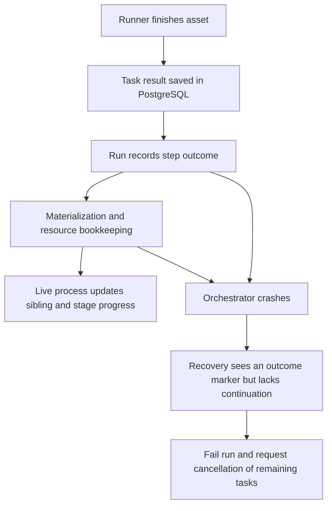
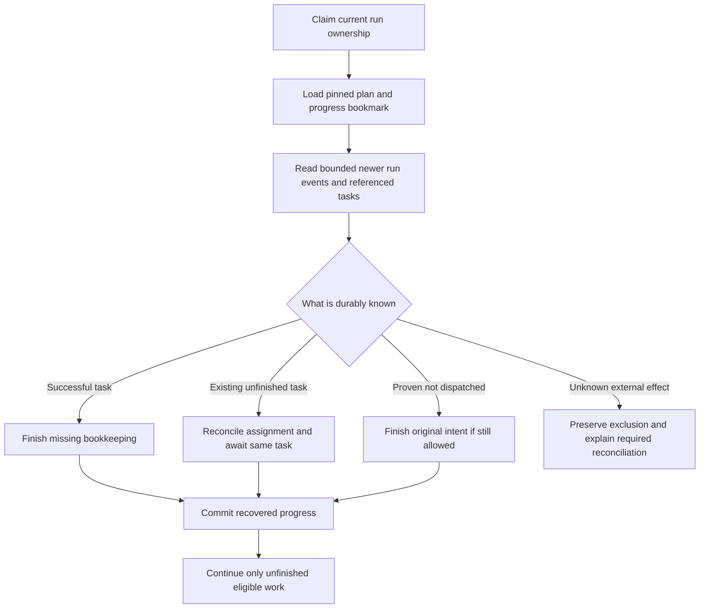

# Decision Record: Resume known work after an orchestrator crash

| Field | Value |
| --- | --- |
| Status | Implementing |
| Type | Recovery design decision and bounded implementation proposal |
| Primary issue | None; the maintainer requested this follow-up without a new issue. |
| Pull request | [#731](https://github.com/eirhop/favn/pull/731) |
| Related work | [#700](https://github.com/eirhop/favn/issues/700), [#703](https://github.com/eirhop/favn/pull/703), [#726](https://github.com/eirhop/favn/pull/726) |
| Inspected baseline | Main at 97ac8657cc668d3d7faad441a813c545650c4464, including merged #726 |
| Affected areas | Orchestrator run recovery and execution; PostgreSQL run transitions; runner result and ownership contracts; release qualification |
| Approved plan commit | 57c64fcb; design direction accepted, field/replay qualification gate retained |
| Last updated | 2026-09-18 |

## One-minute explanation

Favn saves runner tasks and their results, but does not save enough of the
pipeline's progress to resume every interrupted run. For example, Landing can
finish successfully and Favn can record that success, yet a subsequent
orchestrator crash still makes Favn stop the run and cancel its remaining tasks.
The proposed decision is to rebuild progress from the task results and run
events already stored in PostgreSQL, adding only the missing intent and
bookkeeping information. Do not restart completed asset callbacks, serialize
the entire running process, or introduce a second workflow engine.

Implementation is now integrated in the draft branch and under qualification.
The baseline proposal and its review are preserved below; the implementation
outcome section records changes and proof boundaries. This is not yet a
production-readiness verdict.

## Three examples

**1. Success is known.** Landing writes 100 pages and PostgreSQL accepts the
task's successful result. Favn crashes while updating pipeline bookkeeping.
After restart, Favn should read that result, finish its records, and continue
downstream. Landing must not write those 100 pages again.

**2. Work has not started.** Favn records its intention to enqueue a task, then
crashes before saving the task itself. After restart, it should establish that
the original task is absent and that no execution could have started, then
finish enqueueing that same task if its original deadline and cancellation
checks allow it. An unavailable database is not evidence of an absent task.

**3. The external outcome is genuinely unknown.** Landing writes the pages, but
the runner dies before reporting a result and no supported external receipt
proves the write. Favn must preserve the unknown outcome and exclude conflicting
writes. It needs an actionable reconciliation path, not an automatic rerun.
The proposed work cannot manufacture evidence an external system never saved.

## How critical and how difficult?

Recovery of known results is a production-readiness requirement for unattended
pipelines. Restarts and deployments must not turn ordinary successful work into
avoidable failed runs. The current conservative behavior protects against
duplicate writes, but leaves an availability and operator-workload problem.

The work is feasible because tasks, results, manifests, runtime inputs, claims,
events, and ownership already have durable owners. The difficulty is joining
those facts correctly across every interruption point, not inventing persistence
from scratch. The size of the final repair is not established by this analysis;
the budget below is a review constraint, not a delivery estimate.

Basic production readiness means known results recover automatically, truly
unknown writes stay protected, and recovery makes progress or explains precisely
why it cannot. It does not require transparent recovery from arbitrary database
loss or exactly-once writes to every possible external service.

## What the earlier PRs actually established

[#700](https://github.com/eirhop/favn/issues/700) principally required readable
tasks in a fresh VM, service recovery, bounded claim failures, safe expiry, and
preservation of uncertain writes. [#703's record](issue-700-pr-703-crash-recovery.md)
and tests establish substantial work in those areas. They did not establish
automatic continuation of every partially completed pipeline.

[#726's record](pr-726-runner-persistence-simplification.md) separates application
data from framework evidence and repairs temporary persistence contention while
the run process is alive. It explicitly leaves its bookkeeping continuations in
process memory. The [roadmap](../../ROADMAP.md) already lists restoration of
settled siblings after a mid-stage crash as remaining work.

Calling the overall crash-recovery goal complete was therefore too broad. The
task-level fixes are useful and should remain; whole-run continuation still
needs proof. This distinction must remain visible in reviews and release claims.

## Assumptions and evidence limits

- PostgreSQL survives the orchestrator/runner process failure and retains the
  current-format history. Database restore and external storage durability are
  separate operational contracts.
- There are no production installations requiring a legacy-format reader.
  This does not authorize deleting development data or resetting a database.
- The supported topology remains one control plane with independent runners.
  A stale old process must still be fenced after recovery takes ownership.
- A matching persisted runner result is accepted evidence under the existing
  runner/adapter contract; an application metadata key claiming success is not.
- The investigation uses current source, existing tests, and historical PR
  records. No fresh crash drill or live connector replay was performed here.
  No callable Tidewave tool was available; no runtime claims are inferred from
  an unrelated development server.

## Verified current behavior

### The exact missing information

| Durable fact today | What is still missing or insufficient on restart | Source |
| --- | --- | --- |
| Task identity, payload, orchestration context, assignment fence, terminal result and version | A terminal task is not itself proof that all control-plane bookkeeping finished | [RunnerTasks.complete](../../../apps/favn_orchestrator/lib/favn_orchestrator/runner_tasks.ex), [task store](../../../apps/favn_storage_postgres/lib/favn_storage_postgres/runner_tasks/store.ex) |
| Immutable per-assignment outcome history used by task receipts | Safe operation retry can clear the current task row's result; recovery needs a validated lookup of the referenced historical outcome | [Task store: persist_task_outcome!, retry and load_task_outcome!](../../../apps/favn_storage_postgres/lib/favn_storage_postgres/runner_tasks/store.ex) |
| Step outcome event, including node result | Restore does not fold these events back into completed sibling state | [StageResult](../../../apps/favn_orchestrator/lib/favn_orchestrator/run_server/execution/stage_result.ex), [Execution](../../../apps/favn_orchestrator/lib/favn_orchestrator/run_server/execution.ex) |
| Active task IDs in the run snapshot | Completed siblings disappear from that active set; an empty set does not mean a new run | [ActiveTaskSet](../../../apps/favn_orchestrator/lib/favn_orchestrator/run_server/execution/active_task_set.ex) |
| Marker that an active stage has recorded an outcome | Marker says recovery is unsafe; it does not describe how to finish safely | [RecoveryPosition](https://github.com/eirhop/favn/blob/57c64fcb/apps/favn_orchestrator/lib/favn_orchestrator/run_server/execution/recovery_position.ex) |
| Shared freshness checkpoint with completed-node and upstream-status information | It advances at stage boundaries, not every partial settlement; it is not a complete pipeline continuation | [PipelineFreshnessCheckpoint](../../../apps/favn_orchestrator/lib/favn_orchestrator/run_server/execution/pipeline_freshness_checkpoint.ex) |
| Earlier-stage step events | Later-stage restore starts with empty accumulated results and no restored first failure; a complete prior result/failure history must be reconstructed | [Execution.restore_task_waits](../../../apps/favn_orchestrator/lib/favn_orchestrator/run_server/execution.ex), [RunExecutionState](../../../apps/favn_orchestrator/lib/favn_orchestrator/run_server/execution/run_execution_state.ex) |
| Run events and current snapshot | Nonterminal snapshots intentionally remove accumulated results; event-to-execution reconstruction is absent | [RunState.for_step_persistence](../../../apps/favn_orchestrator/lib/favn_orchestrator/run_state.ex), [Persistence](../../../apps/favn_orchestrator/lib/favn_orchestrator/run_server/persistence.ex) |
| Before-enqueue task reference in step-start intent | Exact work deadline, prepared command and all adopted handles are not captured as a validated replayable intent there | [StageAdmission](../../../apps/favn_orchestrator/lib/favn_orchestrator/run_server/execution/stage_admission.ex) |
| Admission, materialization, and target locks | Current pipeline restore tries to adopt a live capacity lease even when loading a terminal task; expired leases are rejected | [Execution.restore_entry](../../../apps/favn_orchestrator/lib/favn_orchestrator/run_server/execution.ex), [admission store](../../../apps/favn_storage_postgres/lib/favn_storage_postgres/admission/store.ex) |
| Live retry command, reply, phase and 30-second retry budget | These fields are process-owned and disappear on process death | [PersistenceRetry](../../../apps/favn_orchestrator/lib/favn_orchestrator/run_server/persistence_retry.ex) |

The guard is deliberate: [Recovery.disposition at the approved baseline](https://github.com/eirhop/favn/blob/57c64fcb/apps/favn_orchestrator/lib/favn_orchestrator/run_server/recovery.ex)
rejects active stages with the outcome marker before inspecting their task rows.
With no active tasks, it accepts only explicit retry checkpoints or a fresh run.
[RunServer](../../../apps/favn_orchestrator/lib/favn_orchestrator/run_server.ex)
then terminalizes uncertain recovery and requests cancellation. Removing that
guard alone would let the current restorer treat already completed siblings as
deferred work. That is not a safe fix.

### Interruption inventory

This inventory covers both pipeline and sequential execution where applicable.
“Must recover” means when cancellation, deadlines and durable evidence permit;
it does not override those controls.

| Crash boundary | Current limitation or evidence | Required behavior |
| --- | --- | --- |
| Before a run starts | Fresh-run and submission recovery already exist | Preserve them and demonstrate that unrelated work remains available |
| Admission acquired; enqueue intent not yet complete | Paused commands/handles can exist only in memory | Reconcile exact acquisition identity before reuse/release; no new admission on an ambiguous reply |
| Step-start intent saved; task absent | Recovery reports missing durable tasks | Restore exact validated intent, confirm authoritative absence and finish the same enqueue; otherwise stop with precise evidence |
| Task saved; enqueue reply or queue event lost | Task exists; some recovery tests cover immediate restart | Adopt that task, reconcile queue bookkeeping once, preserve its pins and deadline |
| Assigned/preparing/running; runner still alive | Task state and assignment fences are durable | Reconnect/await according to existing assignment authority; do not dispatch a second callback |
| External effect occurred; terminal result not saved | Outcome may be unknowable | Preserve unknown write exclusion across expiry/restarts; use existing supported reconciliation |
| Terminal result saved; step outcome absent | Result is available independently of notification | Consume stored result and persist the missing step outcome once |
| Step outcome saved; materialization/resource records incomplete | Marker stops recovery; pending phase is volatile | Reconcile exact bookkeeping and resume only what is missing |
| Initial target-generation reconciliation in progress | Worker is volatile; it can enqueue inspection and marker operations | Reattach to durable operation tasks and reconcile their outcomes; never treat marker writes as ordinary retryable database bookkeeping |
| One sibling settled; others queued/running | Explicitly rejected by current code/tests | Restore settled/non-run decisions, await active siblings and continue descendants |
| Later stage active after an earlier branch failed | Earlier failure and accumulated results are not reconstructed by current task restore; this is source-derived, not a reproduced final-status error | Restore the original failure and full retained result history while continuing independent branches |
| Last sibling settled; stage advance not saved | Current snapshot/checkpoint do not form one atomic progress boundary | Commit one coherent next position, or replay the preceding suffix safely |
| Sequential success; next index not saved | Index and accumulated results are partly process-owned | Restore completed prefix and exact next step; never replay the prefix |
| Retry wait or failure draining | Some retry checkpoints exist; full continuation is incomplete | Retain attempt count, original cause, completed statuses, deadlines and next retry time |
| Terminal run write committed; reply/notification lost | Terminal run is authoritative | Observe existing terminal outcome; do not reopen run or repeat submission completion |
| Downtime outlasts capacity/assignment/ownership leases | Immediate-restart tests do not prove this case | Settle terminal results without requiring new execution capacity; reconcile live/unknown work with current fences and original deadlines |

## Options and decision

| Option | Benefit | Cost or failure | Decision |
| --- | --- | --- | --- |
| Keep fail-closed behavior and rely on manual reruns | Smallest code change | Known successful work still strands runs; manual reruns can be unsafe | Insufficient for the intended production contract |
| Delete recovery guard or restart the stage | Very small diff | May rerun completed callbacks and lose skipped/blocked decisions | Reject |
| Save the entire live execution/retry state | Easy to imagine restoring | Duplicates large payloads and persists process-specific machinery; creates another fragile codec | Reject |
| Reuse existing events, task results and checkpoint; add missing typed progress fields | Uses existing durable authorities and avoids duplicate result storage | Requires a precise bounded restoration algorithm and crash tests | Recommended |
| Add a dedicated row for every node's recovery progress | Direct keyed recovery reads | Another authority, migration, retention/index and live-write contract | Reserve for measured inability of the recommended design to meet bounds |
| Make every bookkeeping operation one database transaction | Can remove some crash windows | Cannot include runner callbacks or external generation marker writes; broad lock coupling can recreate contention | Use only for a small coherent PostgreSQL transition where justified |

### Recommended behavior in plain terms

Save a compact bookmark saying where the pipeline was, then read the few newer
records needed to catch up. A bookmark references existing results; it does not
copy all of them. The same rules interpret progress during normal execution and
after restart, so recovery does not become a second scheduler with different
decisions.

### What must be recorded, and where

The names below describe proposed concepts, not new public APIs.

| Information | Proposed owner and representation |
| --- | --- |
| Run position | Compact typed value associated with the existing run snapshot/checkpoint: execution mode, stage or sequential index, attempt, checkpoint/event sequence, retry/drain disposition and original failure reference |
| Decisions and completed siblings | Restore from authoritative step events after the checkpoint; compact completed statuses/result references when advancing the checkpoint. Preserve skipped-fresh, blocked, failed and cancelled outcomes as well as success |
| Exact admission and pre-dispatch intent | Record or deterministically derive stable acquisition identity before the first admission/circuit/materialization mutation, from a previously persisted attempt identity. Persist any non-derivable deadlines/semantic input first. Extend an existing transition or add one narrow intent event if necessary; the later step-start event alone is too late |
| Enqueue input | Stable task/step/node identity, pinned input/package/generation references, frozen decision and original deadlines; enough to reconcile acquired claims/permits and finish or abandon that exact intent |
| Known runner outcome | Reference task ID, assignment generation and accepted result version/hash in existing immutable outcome history, plus its historical status/retry disposition. Read through a bounded owning-store contract and verify the reference. The current task row is not immutable: safe operation retry can clear its result |
| Pending settlement | Typed phase and operation identity at an existing run transition: step outcome, materialization settlement, resource outcomes, initial-generation reconciliation, or completion of the node |
| Retry budget | Durable first-failure time/absolute retry expiry and original reason; no persisted monotonic clock, PID, timer reference or anonymous function |
| External reconciliation | Existing operation-task identity and outcome; use its supported marker/read/reconciliation contract |

Do not use operator read models, arbitrary application metadata or current
freshness guesses as recovery authority. Validate all references against the
pinned run/manifest and fail precisely on missing or conflicting evidence.
The serializer must retain #726's explicit framework/application separation.

A crash after acquiring a lease but before recording its reply is part of the
contract. Query/reconcile that exact acquisition through its owner using the
prior stable identity; do not acquire again or infer absence from an expired
local handle. Where acquire-and-record can be one small PostgreSQL transaction,
that is an alternative. Saving returned handles only after acquisition leaves
the original window open.

Safe operation retries must not invalidate an outcome the run still needs.
Retain and reference the accepted observation before advancing an operation to
its next assignment; preserve its decision in run progress. Reuse the existing
outcome history, including for post-step inspection, rather than duplicating
large result bodies in the bookmark. A full historical-outcome lookup is new
bounded behavior: the existing receipt reader intentionally returns unloaded
data, while the normal fetch reads the current mutable task. Validate the
historical disposition and hash against retained evidence, and decode using
the original pinned manifest/package/context.

### How to avoid creating another complexity problem

1. Start with a pure, typed restoration reducer over saved facts. It returns
   “await this task”, “finish this bookkeeping”, “finish this unsubmitted intent”,
   “continue from here”, or “needs reconciliation”. It does not execute assets.
2. Use that reducer's progress rules in live execution and recovery. Delete the
   old marker-only refusal when, and only when, replacement coverage passes.
3. Add missing data to existing authoritative boundaries. Do not add a generic
   event-sourcing library, callback journal or parallel durable queue.
4. Couple a progress bookmark with its matching run transition transactionally.
   A checkpoint cannot claim to cover events/settlement that have not committed.
5. Keep the existing large freshness checkpoint shared. Write it at coherent
   stage/checkpoint boundaries, not once per sibling result or lock retry.
6. Page only the required event suffix and batch referenced task reads. Start
   with the existing page limit of 500; measure aggregate decoded bytes/events
   against the existing active-run memory admission budget. Preserve cancellation
   and ownership renewal responsiveness between batches. A page limit alone is
   not a total memory or latency bound.
7. If the suffix cannot stay bounded between checkpoints, or typed intent cannot
   fit existing payload limits without duplication, return for design review.
   A new progress table is an evidence-driven fallback, not an automatic next layer.

## Safety and recovery rules

### Ownership and exact commands

Recover under a newly claimed run fence. Do not overwrite the old result's
assignment identity or blindly reuse expired capacity authority. A durable
terminal result needs settlement, not another runner slot.

Separate a logical operation's immutable identity/content from the current
owner's permission to finish it. Reconcile an already committed command before
issuing another mutation. Existing stores differ: run transitions compare
sequence and snapshot/event hashes; materialization finish compares its command
hash and claim fence; resource outcomes deduplicate by outcome identity. A
reconstructed command with a new timestamp or changed content is not assumed to
be an exact replay. The implementation must either preserve the original
semantic input or use an explicitly fenced reconciliation operation.

Capacity lease renewal does not extend an asset's original deadline. On expiry,
finish already proven results, cancel/expire work that must stop, and keep unknown
writes protected. Never reacquire execution capacity merely to make settlement
of a completed task pass.

### Unknown versus incomplete

“Bookkeeping incomplete” must not be presented as “external write unknown” when
a matching result proves success. Conversely, a saved step-start record proves
intent, not a successful external write. A timeout, lost reply or missing row
from an unavailable read is not proof that execution never happened.

Initial-generation activation includes read-only inspection and potentially an
external marker write. It must use existing durable operation identities and
reconciliation, not be swept into a generic “retry all post-step work” helper.

### Cancellation, draining and cleanup

Restore durable cancellation and the first failure before admitting anything.
Preserve completed work, existing healthy siblings, retry selection and blocked
dependency reasons. Recovery alone is not a cancellation request. Actual
cancellation, expired execution deadlines and superseded ownership still have
their existing authority to stop work.

Cleanup follows durable facts and is idempotent. Repeated recovery must converge
without duplicate task creation, materializations, resource outcomes or leaked
capacity/claims. Unknown write exclusion may deliberately remain; report it as
an unresolved hold rather than an orphan or successful cleanup.

### Retention and deployment

The existing execution-history retirement protocol must protect every result,
event suffix and checkpoint referenced by a recoverable run. Checkpoint
compaction must not silently discard the only proof of a completed sibling.
Recovery and retirement races require PostgreSQL tests and existing lock order.

Protect historical outcome references independently of command receipt retention.
Current older-assignment outcome pruning relies on command-snapshot references;
a bookmark must still protect its referenced result after those receipts expire.

If the current-format bookmark or intent changes, adopt one coordinated
pre-production format with explicit deployment instructions. No legacy reader
is required, but no automatic database reset or abandonment of unknown external
writes is allowed. Restarts on the new format must preserve that format's data.

## Scope and implementation gates

Include pipeline and sequential progress, exact intent recovery, known-result
settlement, stage/retry/drain boundaries, lease expiry, cancellation, diagnostics,
and deterministic crash qualification. Reuse task-level recovery and existing
generation reconciliation.

Do not add arbitrary callback replay, distributed transactions with user data,
a multi-control-plane design, a new generic workflow engine, legacy migration
machinery, or historical data repair. Do not expand this into unrelated retention
or performance work.

| Slice | Required deliverable | Gate before proceeding |
| --- | --- | --- |
| 1. Durable-fact contract | Field-by-field inventory and pure reconstruction of partial sibling completion, sequential prefix, retry/drain and empty-active-set boundaries | Prove existing records plus proposed minimal fields are sufficient; enumerate exact payload and reference bounds |
| 2. Live/restart integration | Persist missing intent/settlement position and reuse progress rules; settle terminal tasks independently of expired capacity leases | Prove command hashes/fences and checkpoint/event ordering, including commit-with-lost-reply |
| 3. Crash qualification | Fresh-process orchestrator/runner drill with a durable external effect and deterministic barriers | Full run converges with no duplicate effects, unintended cancellation, blocked eligible descendants or leaked claims |

### Complexity budget for later implementation

These rough ranges exclude this record, generated code and dependencies. They
must be reviewed after slice 1 establishes exact data sufficiency. They are not
permission to fill a line allowance or a claim that investigation has already
proved a small patch.

| Slice | Production added | Production deleted | Tests/docs added | Tests/docs deleted |
| --- | ---: | ---: | ---: | ---: |
| 1. Typed progress and restoration | 250–450 | 40–120 | 200–350 | 20–60 |
| 2. Live/restart integration and settlement | 250–450 | 80–180 | 250–450 | 20–80 |
| 3. Diagnostics and composed qualification | 50–120 | 0–30 | 250–450 | 0–30 |

Re-review a production overrun above 20%, any new persistence table, increased
payload ceiling, new general retry abstraction or broadened external-write
replay contract. Report gross additions/deletions separately for production,
tests and documentation. Reuse the existing PostgreSQL/process harness and
remove tests whose old contract merely requires avoidable run failure.

## Verification: what must actually pass

### Why previous tests did not catch this

- [Recovery unit tests](../../../apps/favn_orchestrator/test/run_server/recovery_test.exs)
  explicitly require failure after an active-stage outcome becomes durable.
- [Pipeline PostgreSQL tests](../../../apps/favn_storage_postgres/test/storage_v2/core_authority_test.exs)
  prove restart just after enqueue and adoption while capacity leases remain
  live; another explicitly expects a failed run after a completed sibling.
- [#703's fresh-process SIGKILL test](../../../apps/favn_storage_postgres/test/storage_v2/crash_recovery_test.exs)
  covers task lifecycle and a durable effect counter through two restarts. Its
  [probe](../../../apps/favn_storage_postgres/test/support/crash_recovery_process.exs)
  drives task storage; it does not demonstrate recovery of the full pipeline's
  sibling and bookkeeping continuation.
- #726's composed contention tests exercise live-process resumption and submit
  synthetic runner completions. They do not kill the orchestrator during those
  bookkeeping operations and then demonstrate full pipeline completion.

The missing test is not another assertion that a task can decode. It is the
user's whole run continuing correctly after the process that coordinated it
has gone away.

### Required crash matrix

| Scenario | Required evidence |
| --- | --- |
| Crash before/after enqueue transaction and after commit before reply | One durable task per original attempt; preserved deadline/pins; no leaked acquired handles |
| Crash after durable task result, step outcome, materialization, and resource outcome | Same successful result retained; exactly one logical outcome/materialization; only missing bookkeeping resumed |
| Crash after one sibling and after the last sibling before stage advance | Finished nodes never redispatched; eligible siblings and descendants complete |
| Crash in stage two after stage one had a failed branch and a successful independent branch | Preserve the first failure and earlier result history; finish eligible work and retain the correct failed final outcome |
| Skipped-fresh, blocked and failed nodes mixed with successes | Same decisions and final failure attribution after restart; no accidental fresh reclassification |
| Sequential prefix and retry wait | Completed prefix restored; original retry selection, attempt count and absolute deadlines retained |
| Failure draining or cancellation during recovery | No new prohibited work; known successes retained; appropriate terminal run/submission/backfill state |
| All relevant leases expire during downtime | Terminal result still settles; live/unknown assignments remain fenced; capacity is neither exceeded nor leaked |
| Initial-generation reconciliation crash | Existing inspection/marker task reused or safely reconciled; no duplicate marker mutation or activation |
| External effect committed with no accepted result | No automatic repeat, even after two fresh restarts and lease expiry; conflicting target blocked, unrelated target progresses |
| Database contention or unavailable read during recovery | Bounded retry with original cause and phase; no unavailable-to-missing conversion; cancellation/renewal stay responsive |
| Checkpoint/event disagreement, missing pin, unknown atom or corrupt reference | Precise bounded rejection, no duplicate work and no global queue poisoning |
| Retention races and large partial stage | All required evidence retained; bounded query pages and aggregate memory/work; no full checkpoint copy per result |
| Post-step operation safely retried and old command receipts pruned | Original referenced outcome/status still decodes and remains protected; recovery never substitutes the newest assignment's result |

Use deterministic barriers immediately before and after owning commits, not
arbitrary sleeps. Kill the actual run process and also a separate orchestrator
OS process so terminate callbacks and warm VM state cannot accidentally help.
Restart twice. Cover runner survival/reconnection and runner loss separately.

The composed release drill must use the real runner completion path and a
disposable Landing-style asset whose writes are counted durably outside BEAM.
It must not manually synthesize successful completions. Use a counter that
would expose every callback invocation; an idempotent sink alone can hide an
unsafe replay. Add a disposable real Landing integration for the deployment
stack before declaring that connector qualified. No populated user data or
production credentials are needed.

## Operator-visible recovery

Expose known asset success separately from pending control-plane work. Report
run/task/node identity, last committed event, pending phase, original reason,
attempt count, retry expiry and whether reconciliation is required. Never
render a nil error code or log result payloads/secrets.

Emit recovery start, meaningful phase change, completion and final blockage;
rate-limit repeated unchanged errors. A run that is safe but temporarily unable
to progress must remain discoverable by the bounded recovery worker. Do not
silently fail it solely because an old continuation lived in memory.

## Questions the implementation must settle with evidence

| Question | Current position and decision gate |
| --- | --- |
| Are existing event payloads sufficient for exact typed reconstruction? | No blanket assumption. Establish a field inventory and extend only the missing intent/settlement data; round-trip in a fresh VM |
| Can bookmark and run position advance coherently within existing storage contracts? | Require a fenced atomic transition or an explicitly replayable ordering; do not merely move the current two writes |
| Can expired claim/permit settlement safely use original command identity under a new run owner? | Audit each store's replay/fence rules and prove takeover races; do not globally relax fencing |
| What is the maximum replay suffix and aggregate memory? | Measure against existing plan/checkpoint bounds in slice 1; re-review if a new progress table is required |
| Is a reported success sufficient for each external adapter? | Reuse existing write-outcome/evidence contracts; unknown or contradictory evidence remains protected |

## Independent review and outcome

| Field | Result |
| --- | --- |
| Reviewer | Astra xhigh, independent agent |
| Reviewed against | Merged #726 source, original #700/#703 scope, existing crash/continuation tests, and this proposal |
| Findings | Close the pre-acquisition intent gap; use historical outcomes rather than mutable task results; restore earlier-stage failures and result history |
| Findings addressed and rechecked | All three amended, including bounded historical lookup and retention protection; rechecked on 2026-09-17 |
| Verdict | Accepted design direction with no remaining blocking findings. Slice 1 must establish exact fields, replay bounds, command/fence semantics and revised complexity estimates before integration |

This verdict does not establish implementation sufficiency or production
readiness. The remaining questions are explicit investigation gates, not
permission to fill gaps with unreviewed state or extra persistence layers.

| Verification performed | Evidence boundary |
| --- | --- |
| Current-source and existing-test review by author and Astra xhigh | Static evidence, including intentional fail-closed tests; not a newly reproduced full-run crash |
| Repository-relative links resolve; diagrams and prose reviewed | Documentation qualification; no renderer or runtime behavior claimed |
| Whitespace/diff checks | Documentation-only change |
| Automated tests, fresh-process crash drills and real Landing replay | Not run for this decision-only change; required future gates are listed above |

Only this decision record has been created. No implementation, database change,
live replay, production-readiness claim or issue creation is part of this work.

## Added regression: initial marker ownership (2026-09-17)

The maintainer reported a separate failure on #726 and explicitly included its
repair. `InitialTargetGenerationReconciler` supplies its marker mutation ID as a
runner task's `operation_id`. That field identifies a retained rebuild/recovery
parent, while `write_operation_id` already carries the independent marker write
identity. No such parent exists for normal first writes, so PostgreSQL correctly
rejects the asserted parent at enqueue. The same guard protects later mutations.

The proposed localized correction removes the false parent reference from normal
initialization, keeping its deterministic task, marker token, payload and
`write_operation_id`. Do not weaken `OperationRetention` or exempt names with an
`initial-marker:` prefix. Actual parent references must continue to be checked
at enqueue and subsequent transitions. Verify lifecycle and retention behavior
using real PostgreSQL and an end-to-end first-write registration sequence.
The existing reconciler unit suite substitutes a task store, and existing storage
reconciliation tests skip runner marker dispatch; neither composes this path.

Recovery of existing successful writes needs special care: current public target
recovery requires an already present marker. It cannot repair a marker task that
was rejected before execution. Qualify reuse of the original persisted successful
asset task and claim through initial registration, with original manifest and
generation pins and no asset re-execution. Do not document ordinary target recovery
as sufficient for an unmarked target. Unknown writes and conflicting bindings
remain rejected; do not reset bindings or clear materialization evidence.

Additional estimate: 1–60 production additions, 1–10 deletions; 150–350 test and
operator documentation additions. This is a correction of an existing owner
reference, not a new retention or generic repair framework. Independent review
must check the exact recovery entry and proof boundaries before delivery.

Astra xhigh independently approved the localized ownership correction. Review
confirmed that unknown marker tasks and unresolved write locks remain protected;
SQL initialization also verifies an existing exact marker instead of replacing it.
For manual repair, require the matching committed materialization before marker
dispatch (the reconciler's final store validation occurs after dispatch), and
leave an already failed run terminal. This approval does not qualify the broader
crash-recovery retention and historical-outcome design.

The concrete repair script is restricted to a quiescent target in the existing
administrator console. Review found that a preflight cannot exclude writes
starting during runner waits, and initial activation does not itself acquire the
write-ownership lock. Rather than silently extending this repair into a new
concurrent administration contract, the script requires submissions and other
writes to remain paused throughout repair. It rejects currently unresolved holds,
uses retained exact evidence and leaves the failed run terminal. A concurrent
repair API is outside this localized addition. The earliest-materialization
lookup deliberately refuses a later source task rather than guessing.

### Initial marker repair outcome and verification

The application correction removes one false parent option. Deterministic marker
write identity, task/token identity, target write fences and all actual operation
parent guards are unchanged. The optional operator-console script qualifies the
original saved success against committed evidence, repairs only registration,
and leaves failed run history intact. It never clears unknown write holds.

Astra xhigh reviewed the change and the console-only repair. Findings addressed:
check materialization evidence before any marker dispatch; constrain repair to a
quiescent target; continue quiescence after timeout until dispatched tasks settle;
and copy the reviewed script into release hosts, which do not contain repository
scripts. No new runtime repair API or retention exemption was introduced.

| Verification | Result and limit |
| --- | --- |
| New composed PostgreSQL test on unchanged marker code | Reproduced `operation history not found` after successful asset/materialization and inspection/capability completion |
| Complete PostgreSQL core authority test file | 164 passed, including normal first registration, checked repair after the original rejection, missing evidence, changed binding, unresolved write holds, actual rebuild/recovery parents, missing parents, retirement during completion, idempotence and existing contention/recovery tests |
| Focused orchestrator tests | 19 passed: reconciler and operation tasks plus the six separate progress-reducer tests |
| Compile with warnings as errors | Passed with `MIX_ENV=test` |
| Documentation relative links and `git diff --check` | Passed |
| External writes / actual runner callbacks | The new PostgreSQL tests submit synthetic runner results. They establish the control-plane lifecycle and persistence guard correction, not external adapter execution or the broader fresh-process crash qualification |

The added regression scope is larger than its rough supporting-file estimate:
application code is +5/-2 lines (four additions clarify the contract); the checked
maintenance script is +110/-0; tests are +496/-0; operator documentation is +48/-0.
The script exceeds the 60-line production upper estimate because review required
explicit preflight proof and unresolved-write rejection. Test and guide additions
exceed the 350-line estimate to compose the real PostgreSQL/run-server path,
reproduce the pre-fix failure for repair, and cover both parent lifecycles and
negative repair evidence. Astra accepted those explicit checks as justified;
there is no additional application state machine. These figures exclude this
record and the still-unintegrated broader crash-recovery progress reducer.

Final independent review of this localized addition: Astra xhigh approved the
application fix, checked maintenance procedure, test evidence and size deviation
against addendum baseline `bd5a2f28`, with no blocking findings. This approval
explicitly excludes the unintegrated recovery reducer and does not establish
external-effect or full crash-recovery qualification.

## Implementation investigation: recovery facts and admission (2026-09-17)

This section records new findings against the original approved baseline. It
does not change that baseline into a claim that runtime integration is complete.
The initial-marker correction is committed as `f5cd25ed`; its exact-head CI
passed quick checks, compilation, Dialyzer, fast, acceptance and slow tests, and
the control-plane, runner-template and repository-image qualification jobs.

### What a restart can already reconstruct

| Fact | Existing source | Missing part |
| --- | --- | --- |
| Node, stage, manifest, target generation, upstream pins and package | Pinned run plan, manifest and immutable package | Validate identity before using a task as evidence |
| Parameters, pipeline context, backfill/operator metadata and run start time | Run snapshot and the explicit work-metadata selection | Freeze the original attempt deadline before admission |
| Successful callback result | Accepted asset task, whose attempt has its own deterministic task ID | Persist the settlement position and restore the completed sibling |
| Original claim and circuit permits after enqueue | Task-local orchestration context | No equivalent immutable fact exists before enqueue |
| Freshness inputs | Shared run checkpoint | Couple checkpoint replacement with its matching progress transition |
| Completed/blocked/skipped nodes and first permanent failure | Ordered step events | Compact references and bounded replay; do not retain every result body |
| Retry selection | Existing retry checkpoint and step retry disposition | Restore the exact original delay/deadline and distinguish retry from permanent failure |

The pure progress-reducer prototype is still unintegrated. Its tests distinguish
an accepted step outcome from finished bookkeeping, preserve a blocked branch
as a failure, and reject changed identities, sequence gaps and replay of a
successful node. They do not establish sufficient live or restart behavior.

### Why the pre-dispatch gap needs an atomic boundary

For example, Favn can grant a half-open circuit probe and then crash before
saving its task. The circuit may have changed by restart. Asking for permission
again cannot reliably recover whether the first attempt owned that probe.

Source inspection established three concrete gaps:

- A closed circuit returns a permit without an immutable acquisition receipt.
  The returned resource set also depends on the active execution-pool policy.
- An execution lease's exact replay includes its previous owner and fence.
  An expired or released lease cannot simply be reacquired under the same ID.
- Materialization preparation can already acquire a combined-window target
  lock before it returns the claim command.

Astra independently recommended one bounded transaction per node, after saving
the immutable attempt intent. A runnable decision must commit its capacity,
circuit permits, optional target lock, claim, task and matching run transition
together. A waiting, blocked or already-satisfied decision must not leave
provisional handles behind. Package loading and work preparation remain outside
the transaction; process notifications happen after commit. Returned errors
must explicitly roll back, rather than accidentally committing an outer
transaction containing an error tuple.

This is narrower than recording and recovering four or five separate
acquisition phases. It adds no new progress table or generic transaction API.
Lock order, waiting-decision takeover and rollback tests remain implementation
gates; the current facades cannot simply be wrapped in a transaction.

### Corrected bounds and further design checks

The existing event-page maximum is **200**, not the 500 assumed in the baseline.
Run events are capped at 512 KiB, task payloads at 8 MiB for asset work and 1 MiB
for other work, task results at 1 MiB, task-local continuation at 4 MiB, and the
shared run checkpoint/plan at 64 MiB. The run snapshot is limited to 4 MiB.
Recovery must use smaller pages where needed and account for decoded working
memory through the existing active-run capacity owner. A 200-event maximum
alone is not a memory bound acceptable for every run.

Two additional checks are required before finalizing the integration estimate:

1. **Avoid unnecessary historical-result machinery.** Generic task retry only
   restarts failed `safe_to_retry` tasks. It cannot replace a successful result;
   asset attempts also use different task IDs. Successful inspection and
   capability tasks may therefore be sufficient current-row evidence. Their
   retention still needs protection for the run that will reuse them. Review
   must settle the failure/fallback cases before removing the baseline's
   proposed historical lookup.
2. **Expiry is not proof that execution stopped.** Admission expiry currently
   frees capacity without checking the saved runner task. Claim/start does not
   check the execution-capacity lease. Merely skipping lease adoption for a
   successful task cannot qualify the all-leases-expired recovery scenario.
   Joining only run and step is insufficient because it conflates attempts.
   Review must specify the exact task-to-capacity relationship and all release
   paths before introducing a changed reservation contract.

These findings keep the broader PR in implementation. The marker fix's passing
tests and review do not establish that the original crash-recovery gates passed.

### Reviewed simplifications from those checks

Astra's follow-up source review supports the following narrower implementation:

- Reuse accepted successful tasks through their current rows, with their
  assignment/result identity checked. Success cannot be replaced by generic
  retry. Preserve accepted failure decisions in progress; a task's initial
  retry classification does not make every failed result immutable. Protect
  the current operation tasks required by a recoverable run instead of adding
  the proposed historical-result reader and historical-reference retention.
- Preserve existing finite admission-lease semantics. Normal task deadlines
  precede their capacity-lease expiry by at least the lease buffer. Settle a
  proven terminal task without adopting capacity. Reconcile/cancel expired
  unfinished tasks under their original deadline, then re-fetch authoritative
  results so a winning completion is preserved. Valid unfinished work still
  requires a live adopted lease. Missing deadlines remain a precise refusal;
  never infer a fresh deadline from the current timeout setting. Sequential
  work does not acquire capacity today, and this change must not invent it.
- Use one pending admission intent. Current submission stops at the first
  waiting node, so there is no need for an intent per planned node in each run
  snapshot. Persist the exact pending attempt and frozen decision before
  acquisition; preserve it through sibling completion and clear it only with
  its committed admission/outcome/abandonment transition. No new task status
  or mutable pre-admission task payload is needed.
- Keep admission request hashes and exact owner/fence replay checks. A waiting
  request can be re-evaluated under a different command ID only when its stored
  scope IDs/units and step identity match, the current run owner is locked and
  validated, and the same pending intent/deadline remains admissible. This
  avoids changing the hash format or adding waiter owner columns.

The all-leases-expired qualification row means safe recovery under these
existing contracts. It does not introduce a stronger promise that PostgreSQL
capacity can stop an unconfirmed external write physically. Unknown outcomes
retain their target exclusion and existing reconciliation requirements.

The prototype's actual snapshot round-trip test exposed why typed intent cannot
pass through the general display-metadata encoder: that encoder deliberately
limits depth and collection sizes. The intent now has an exact bounded path
inside the run snapshot, and its metadata key is reserved against new
submissions and removed when constructing a new rerun. This is separate from
application-result serialization. Runtime admission does not use the prototype
yet; full composed integration and fresh-process crash qualification remain open.

Astra's foundation review also removed a proposed 64 KiB limit on the full
freshness diagnostic tree. The intent now preserves only the execution decision
(`decision`, `reason`, `node_key`, `freshness_key`) and checkpoint reference;
`stale_reasons` is not required for claim or freshness settlement. Live admission
must use that same canonical decision when integrated. Existing context and
snapshot limits remain in force. A pipeline intent cannot substitute a
sequential context; checkpoint stage/attempt and freshness-key equality are
validated too. Two fresh BEAM processes restore the original deadline from the
saved snapshot and manifest without relying on previously loaded consumer atoms.
This qualifies the foundation format only, not whole-run crash recovery.

The localized marker correction is now independently extracted into
[PR 732](https://github.com/eirhop/favn/pull/732) on current main so it can ship
without unfinished recovery work. Its source/tests/repair behavior are unchanged.
PR 731 remains a draft for the broader implementation.

Foundation review outcome: Astra xhigh approved the corrected identity checks,
diagnostic compaction and exact snapshot path with no remaining production
blockers in that slice. The final focused set passed 52 tests, including both
fresh-process decodes and stripping a previous intent from a new rerun. This
still does not qualify runtime admission, exact event persistence, checkpoint
transaction consistency, whole-run restore or crash behavior. Those integration
gates remain required before this draft can be made ready.

### Reviewed integration correction (2026-09-18)

The original size estimate omitted the work needed to make permission acquisition
and task creation atomic. Astra xhigh reviewed a revised whole-PR estimate of
1,800–2,300 production additions and 600–900 deletions, plus 1,000–1,600 supporting
lines, excluding the separately merged marker fix and this record. These are
review limits, not targets. The implementation must replace the old separate
admission/recovery paths, rather than retain two mechanisms. Actual counts and
any further deviation must be reported before final review.

Admission will lock cancellation authority, validate run ownership, lock the
target, and lock the active runtime policy before capacity and circuit rows.
This matches deployment's target/policy/capacity order. It must check the original
deadline and current owner again after blocking locks. Ordinary enqueue must
also lock cancellation authority before its task receipt lock to avoid an
inversion with composed admission.

A committed task and its matching admission event are replay evidence even if
later sibling events have advanced the run snapshot. Replay must precede new
acquisitions and must not depend on the enqueue receipt's age. Waiting decisions
may be reevaluated with a new command under the same persisted intent, exact
scope requirements and current run fence; same-command changed content remains
an error. Acquisition expiry uses current database time, while the task retains
its original deadline. Every non-runnable acquisition branch rolls back its
provisional handles; a capacity waiter alone may commit.

Required composed PostgreSQL checks include deployment/admission lock order,
ordinary/composed enqueue races, waiter takeover, expiry during lock waits,
rollback after acquisitions, and replay after later sibling progress. These
supplement, and do not replace, the original whole-run crash qualification.

## Runtime integration outcome (qualification in progress)

The localized initial-marker parent fix shipped separately as #732 and is on
main. This draft implements the original interrupted-run recovery, rather than
stopping at the intent/reducer foundation. The current contract is documented
once in [run recovery](../../architecture/elastic-runners.md#resuming-an-interrupted-run).

In plain terms: the task stores the callback result, the step outcome says what
happened, and a small settlement receipt says the remaining control-plane work
finished. A restart reads those facts and resumes only the unfinished part.
It never treats an unknown external write as safe to repeat.

### Changes from the approved baseline

- Admission uses one PostgreSQL transaction after the saved intent. This replaces
  separate acquire/enqueue/start phases, removing the unrecorded-handle crash
  window. A waiting capacity request may remain; other provisional acquisitions
  roll back together. Independent siblings are retained.
- `step_settled` is the bookkeeping receipt. There is no serialized process,
  second progress table, generic workflow engine or new payload ceiling.
- Restoration scans the retained event history in 50-event pages instead of
  introducing a separately compacted event suffix. It keeps one compact fact per
  planned node and bounded result references. Full payloads are refetched one at
  a time, never accumulated in restart state or mailbox messages. This favors
  fewer durable authorities; recovery time remains proportional to retained
  run history and needs deployment load measurements.
- Asset attempts already have distinct task IDs; successful operation tasks
  cannot be retried. Accepted failure/retry decisions are retained in step
  evidence. These contracts make a new historical-outcome API unnecessary.
  Operation tasks required by first registration now retain their run owner.
- Terminal tasks release their exact old reservation without adopting new
  execution capacity. Live tasks still require current ownership, the original
  deadline and valid capacity authority. Expiry does not prove a writer stopped.
- Saved resource outcomes can be reconciled after the ordinary receipt-age
  window only under retained run ownership. Old outcomes cannot overwrite newer
  circuit health or create already-expired recovery candidates.
- There is no legacy recovery reader. Old in-flight runs must be drained before
  format adoption; no development database was reset or rewritten for adoption.

### Review findings addressed during implementation

Astra xhigh reviewed the foundation, atomic-admission design and integration in
several bounded passes. Corrections include exact task/result identity checks,
retaining successful evidence after await failures, canonical failure replay,
unknown marker observation, safe terminal-capacity cleanup, compact task reads,
and binding the recovery position to the atomic checkpoint. A damaged terminal
reread now suspends recovery rather than recording a new asset failure.

Composed tests also exposed an ordering defect: retry selection follows
completion order, which can differ from plan order. Recovery must resume the
single persisted intent first. The regression now deliberately reverses that
order instead of relying on scheduler timing.

A further integration audit found a competing crash handler in `RunManager`:
it only recovered retry-wait runs and terminalized other crashed runs, cancelling
their tasks. Direct `RunServer` restart tests bypassed that production path.
The handler is removed; the existing fenced ownership sweep is the single
recovery entrypoint after either a process or node crash. The new manager test
checks a monitored crash and a failed manifest restoration without cancellation,
then recovery with a newer fence. Late monitor notifications cannot remove the
replacement owner's local tracking or memory allocation. The separate-BEAM drill also uses the production
batch-claim and manager entrypoint. This is a correction within the planned whole
run recovery scope, with fewer competing lifecycle paths.

The requested broader Astra xhigh review resumed after the account limit was
fixed. It accepted the atomic-admission architecture and bounded restoration
approach, subject to the corrections and qualification below. Slice reviews do
not count as final approval; the PR remains draft until final review and checks
complete.

### Test migration and evidence boundaries

Old admission tests substituted separate acquisition phases that no longer
exist. Their replacement uses the compound admission boundary for unit-level
classification and real PostgreSQL for rollback, replay, waiter takeover, stale
fences, deadline expiry and lock ordering. Removing obsolete phase mocks does
not remove the requirement to prove those outcomes.

Fault-injection stores now intercept compound admission, so lost-reply and
history-contention tests still inject failures at the actual runtime boundary.
An invalid task no longer leaves a failed provisional claim: the claim and task
both roll back. Successful replay continues remaining healthy siblings. The old
paused-lock test constructed an acquisition phase that no longer exists. Its
replacement uses the real atomic admission command and verifies that a competing
claim prevents admission without leaving a lock or task. Unused standalone
acquire/claim/enqueue retry dispatch clauses are removed as well.

The fresh-process drill kills the OS BEAM after `step_finished`, restarts and
kills it after `step_settled`, then restarts again to finish the pipeline. The
asset runs through `FavnRunner.Worker`; its callback increments a PostgreSQL
counter on every invocation and returns Landing-style metadata. Assertions
require one write per node, all descendants completed, and no remaining capacity.
This qualifies the disposable callback and control-plane persistence path, not
an actual Landing adapter or the deployed distributed runner transport.

Current local evidence: the complete fast orchestrator suite passes **902 checks
(896 tests and six doctests; two excluded)**, compilation with warnings as errors
passes, and the CI tag guard passes. The manager recovery and independent-branch
PostgreSQL regressions pass. The expanded PostgreSQL suite and revised
fresh-process drill are still being completed. Final independent review and
CI for the integrated head remain outstanding.

### Complexity deviation requiring final review

The integration exceeds the revised production estimate. Against current main,
the code diff is **+3,436/-1,540 production lines** (net +1,896), and
**+2,960/-1,330 supporting lines** (tests, fixtures and canonical documentation).
The record itself is reported separately (about 840 lines). Production additions
are roughly 49% over the revised +2,300 upper estimate. Final review must accept
or reject this overrun; test additions do not justify production complexity.

The main additions are the atomic admission owner, validated intent/progress
contracts, bounded restoration and terminal/live task reconciliation. The old
multi-phase admission and fail-closed recovery modules are removed. The overrun
is not approved merely because these pieces have tests: final review must check
whether the same safety can be expressed more simply and reject unrelated scope.

### Requested extension: issue #736 (plan reviewed by Astra xhigh)

The user explicitly requested [#736](https://github.com/eirhop/favn/issues/736)
be fixed in this PR. A failed SQL data check can roll back successfully and still
be classified as an unknown write because the worker currently equates
non-retryable with unknown. The ownership guard correctly refuses to release an
unknown write, but the resulting bookkeeping error hides the original check
failure and incorrectly says the write succeeded.

The proposed correction preserves two separate facts: whether repeating the
asset is allowed, and whether its write outcome is known. The SQL transaction
owner will carry explicit no-write/rollback evidence into the SQL asset error;
both worker normalization paths will use that evidence independently of retry
policy. An error type or a before-materialize phase alone is not evidence.
Missing proof, rollback failure, commit ambiguity, and lost results remain
unknown. Existing runner error/task wire shapes already support this distinction;
no compatibility layer or new task lifecycle is required.

Post-step settlement will retain the original failed asset error as primary and
record the secondary bookkeeping error with asset, operation and outcome context.
For a successful asset, registration failure remains the primary failure, with
accurate wording. Existing unknown claims require the supported write-resolution
workflow and authoritative evidence; neither blind replay nor database edits are
a recovery procedure.

Verification will compose PostgreSQL control-plane persistence, an actual SQL
transaction/check failure with confirmed rollback, the runner worker, task
completion and run settlement. A dependent must block, an independent sibling
must finish, the original error must survive, and corrected work must acquire
ownership normally. Contrasting rollback/commit/result ambiguity cases remain
held. Existing unit tests asserted diagnostic rollback metadata but did not assert
its task/claim ownership consequence; this is the missing boundary coverage.

Additional budget: production +80–180/-20–60 lines; tests/fixtures/canonical docs
+250–550/-0–30. Reuse existing contracts and fixtures; challenge any larger design.
This extension is distinct from, and does not rewrite, the approved crash-recovery
baseline. Independent review must evaluate this plan and the integrated outcome.

Astra approved the extension with two required safety constraints: only a body
failure followed by rollback confirmed by the actual adapter can prove no write;
a commit error stays unknown even when later rollback succeeds. Unknown outcome
or failed rollback anywhere in the transaction cause takes precedence over
nested begin/body tags. A generic SQL asset error is not no-write proof. These
constraints are accepted before implementation.

### Integrated review corrections and issue #736 outcome

The issue #736 fix separates **permission to retry** from **certainty about the
write**. For example, an invalid customer name must still fail; if the adapter
confirms that the transaction rolled back, Favn can release that attempt's write
ownership. If COMMIT or ROLLBACK is uncertain, Favn keeps the hold. A contract
error name, an early-looking phase, or a nested BEGIN error is never sufficient
proof. Raised COMMIT exceptions no longer pass through the body-exception rescue.

The original asset error stays primary. Secondary materialization or generation
registration errors retain their operation and asset context, with wording that
matches the accepted outcome. Recovery of existing held claims uses the audited
write-resolution procedure in the canonical runner operations guide.

Astra's integrated review identified additional crash-recovery gaps:

- A materialization-finish reply could be lost after commit. Recovery now retains
  the accepted result and resumes the remaining bookkeeping; it does not emit a
  permanent `step_settled` error for a transient or ambiguous response.
- An asynchronous generation-registration worker can time out or disappear after
  saving work. Those cases also suspend for reconciliation instead of destroying
  successful evidence.
- Cancellation hints arriving while an accepted outcome awaits persistence must
  wait for that outcome. An already-completed task whose result is temporarily
  unreadable is likewise retained for recovery.
- Cold manifest identifiers now share the rehydrator's VM atom headroom guard.
  Unknown identifiers remain rejected; checking the budget creates no atoms.
- A run needing recovery saves a bounded `recovery_attention` annotation and an
  event with its first cause, latest phase/reason, and reporting count. Repeated
  identical reports within one minute are coalesced. Progress clears both the
  saved annotation and the recovered process's copy, so later checkpoints cannot
  restore stale warnings. This diagnostic survives ordinary metadata truncation.

The diagnostic implementation is deliberately smaller than the original proposed
attempt timeline: the 30-second immediate persistence retry budget is **per run
owner**, not a global recovery deadline. A subsequent fenced owner can resume
safe bookkeeping after that budget. Original asset deadlines are unchanged.
Detailed per-attempt durable history and a dedicated recovery timeline UI are
not included; the existing metadata/event/log surfaces carry the current cause.
This is a documented baseline deviation for final review, not an implicit claim
that a new global retry deadline was implemented.

The composed SQL test exposed an existing timestamp constraint: a completion
reported before its enqueue timestamp could be rejected even with valid task
identity and ownership. Stored terminal/cancellation timestamps now respect causal
order, while issued command identity, assignment fences, leases and executable
deadlines remain unchanged. Repeated cancellation preserves the first request
rather than moving it after an existing acknowledgement. Explicit nil resets
remain intact. Astra reviewed this narrow correction.

New regression evidence includes an actual PostgreSQL SQL transaction/check and
confirmed rollback through the worker and durable task/claim settlement, an
independent sibling and blocked dependent; a committed materialization with a
lost reply followed by recovery; asynchronous cancellation during completion
persistence; metadata-heavy snapshot round-trips; and clock-skew receipt replay.
Adapter/runner cases retain unknown outcomes for absent proof, rollback failure,
and uncertain COMMIT, including raised COMMIT and misleading nested BEGIN tags.
The PostgreSQL SQL fixture is a small test adapter, not a qualification of a real
DuckLake deployment. It proves the orchestration boundary with real SQL rollback;
ADBC transaction behavior is covered separately by adapter tests.

Why earlier tests missed #736: they checked that the SQL diagnostic said rollback,
but did not follow that error through worker classification, durable ownership
and final run error selection. The new composed test asserts those consequences.
Why earlier recovery tests were insufficient: restarting `RunServer` directly did
not exercise the manager's competing crash handler, and successful persistence
responses did not prove behavior after a committed-but-lost reply. Both boundaries
now have explicit regression coverage.

Final-head test counts, scope totals, CI and final review are recorded below after
qualification; the preceding historical counts are not claims about this head.

Astra xhigh's final source pass also identified five analogous uncertainty guards
in pipeline/sequential admission, non-running decisions and required package
reads. Timeout/unavailable errors without a retryable flag now preserve the
original pause or intent instead of becoming conclusive node failures. Initial
resource-settlement uncertainty follows the same rule. The new focused matrix
passes, including preservation of a healthy sibling and the original command.

Astra xhigh granted **conditional source approval** after checking those guards
against baseline `57c64fcb` and the reviewed #736 extension `4f1deb7d`. It found no
remaining source blockers and accepted the complexity and documented deviations.
The reviewer ran no database/tests; this does not replace qualification. At this
point the 175 core PostgreSQL checks pass together, 911 orchestrator checks passed
before the last guard matrix, and the final 21 admission/sequential checks pass.
Credo, Sobelow, warnings-as-errors compilation and Dialyzer pass. Full storage
order/isolation qualification and final-head CI remain pending.
