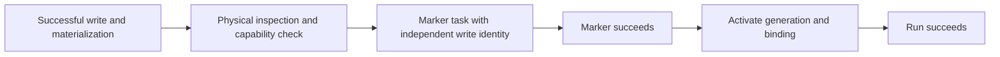

# Fix normal first-write generation registration

| Field | Value |
| --- | --- |
| Status | Implemented |
| Primary issue | None; maintainer requested the repair without a new issue |
| Pull request | [#732](https://github.com/eirhop/favn/pull/732) |
| Approved extraction plan | 474d9e6c |
| Related work | [#731](https://github.com/eirhop/favn/pull/731), [#726](https://github.com/eirhop/favn/pull/726) |
| Inspected baseline | Main at 5d27a519 |
| Last updated | 2026-09-17 |

## Problem in plain terms

An asset writes successfully, but Favn then refuses the small task that registers
its first generation. The task says it belongs to a rebuild operation that does
not exist. The retention guard rejects that claim, leaving a successful write
with an uninitialized binding and a failed run.

`InitialTargetGenerationReconciler` passes an `initial-marker:…` value as the
runner task's `operation_id`. That field identifies a retained rebuild/recovery
parent. Normal first writes have neither parent. The marker's independent write
identity already has its own `write_operation_id` field. This is an ownership
mix-up, not another application-result codec failure.

The same parent guard protects later task transitions, so changing only the
enqueue guard would leave a broken lifecycle. Existing reconciler tests replace
the task store; existing storage reconciliation tests skip marker dispatch.
Neither test composes the failing PostgreSQL path.

## Reviewed scope carried from PR 731

This isolates the already reviewed marker repair from unfinished whole-run crash
recovery. Its original approved plan is the PR 731 marker addendum at `bd5a2f28`;
its reviewed implementation is `f5cd25ed`. The independent reviewer must recheck
this extraction against current main. The broader crash-recovery decision and
unintegrated prototypes stay in PR 731.

Remove the false parent reference from normal marker initialization. Preserve
its deterministic task ID, marker token, payload and write identity. Leave
`OperationRetention` unchanged: do not exempt task names or permit missing or
retiring real parents.

For existing affected writes, provide a checked script in an existing trusted
administrator console. It must require the original successful asset task,
matching committed materialization, original manifest and generation pins, and
an uninitialized unchanged binding. Reject unresolved write holds, changed
bindings and missing evidence. Reuse only registration; never rerun the asset,
clear unknown holds, or reopen the failed run.

The target must be quiescent throughout repair. A preflight query is not a
concurrent maintenance lock. Keep submissions and writes paused after a timeout
until any dispatched inspection/marker tasks settle or are reconciled. Keep
runners available for registration. Ordinary public target recovery needs an
existing marker and cannot repair this absent-marker case. Release hosts need
the reviewed script copied to an explicit path; it is not packaged in a release.

## Scope limits and tradeoffs

No new public API, schema, retention exception, state machine or compatibility
reader. No automatic replay of external writes. No repairs are run against the
user's data as part of implementation. The console procedure deliberately
requires operator-controlled quiescence instead of adding concurrent maintenance
coordination. It conservatively requires the earliest matching materialization;
a later source task is refused rather than guessed.

The original rough budget was 1–60 production additions, 1–10 deletions, and
150–350 supporting additions. PR 731's final review accepted the necessary
variance: application +5/-2, checked script +110, tests +496, operator guide +48.
The checks cover the exact original saved evidence and real parent lifecycles;
there is no new application state machine. Extraction should keep those code
counts unchanged. This record is excluded from the count.

## Verification and recovery acceptance

Use the real PostgreSQL store and RunServer to reproduce the original failure
and verify successful materialization, physical inspection, capability check,
marker task dispatch/completion, generation activation and successful run finish.
Exercise missing parents and retirement during later transitions, legitimate
rebuild/recovery tasks, repeated reconciliation, and repair from original success.
Negative repair cases include missing materialization, changed binding, unresolved
write holds and insufficient administrator permission.

The PostgreSQL tests supply runner outcomes through the actual task persistence
boundary. They do not execute external SQL callbacks. Those are separate runner
contracts; this repair qualifies the control-plane parent guard and registration
lifecycle. Whole-run crash recovery and fresh-process external-write qualification
remain outside this PR.

Re-run the PostgreSQL core-authority suite and focused reconciler/task tests on
current main; compile with warnings as errors, check formatting and documentation
links, and qualify the exact final PR head in CI. Independent Astra xhigh review
must compare this extraction with the approved marker plan and report any new
interaction with main before marking the PR ready.

Astra xhigh approved the extraction plan with no blocking findings. Apply the
selected patch so current main retains its schema-version expectation and runtime
catalog guard. Final review and current-main qualification remain required.

## Implementation outcome

The selected patch is unchanged from the approved marker repair in PR 731. It
removes one false `operation_id` option and clarifies the separate parent/write
identities. No retention code changed. Current main's schema-version expectation
and runtime catalog guard remain intact. The checked repair script and operator
guide preserve existing successful writes and keep the failed run terminal.
The final behavior is the proposed flow above.

| Verification on main 5d27a519 plus this repair | Result |
| --- | --- |
| PostgreSQL core-authority suite in a new disposable test database | 164 passed |
| Reconciler and operation-task tests | 13 passed |
| Runner generation-operation tests | 10 passed |
| Compilation with warnings as errors | Passed |
| Formatting, test-tier coverage and `git diff --check` | Passed |
| Documentation links and Mermaid syntax | Reviewed; interactive GitHub rendering unavailable because the browser bridge rejected the local workspace URI |
| Original failure reproduction | Preserved from PR 731's pre-fix PostgreSQL run; the current repair test also reproduces the false-parent rejection before repairing registration |

These checks establish the control-plane registration lifecycle, real parent
protection and checked repair conditions. PostgreSQL tests use synthetic runner
outcomes; separate runner tests exercise generation operations with a test
adapter. This is not a live external-database or whole-run crash qualification.
No customer data has been repaired by this implementation work.

| Planned | Actual | Reason and review |
| --- | --- | --- |
| Isolate reviewed repair without prototypes | Application +5/-2; script +110/-0; tests +496/-0; operator guide +48/-0 | Identical localized implementation; the original accepted size variance is carried above |
| Requalify on current main | Preserved schema version 21 and runtime catalog guard; all targeted suites pass | Astra independently checked the extraction and owning guards |

Astra xhigh approved the implementation, extraction and final record with no
blocking findings, and independently inspected the completed local test logs.
Exact-head CI remains required before marking the PR ready; its final status is
tracked on the PR checks rather than inferred from this local test evidence.
